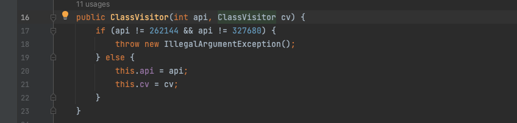
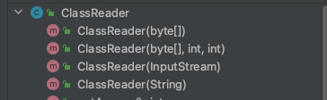
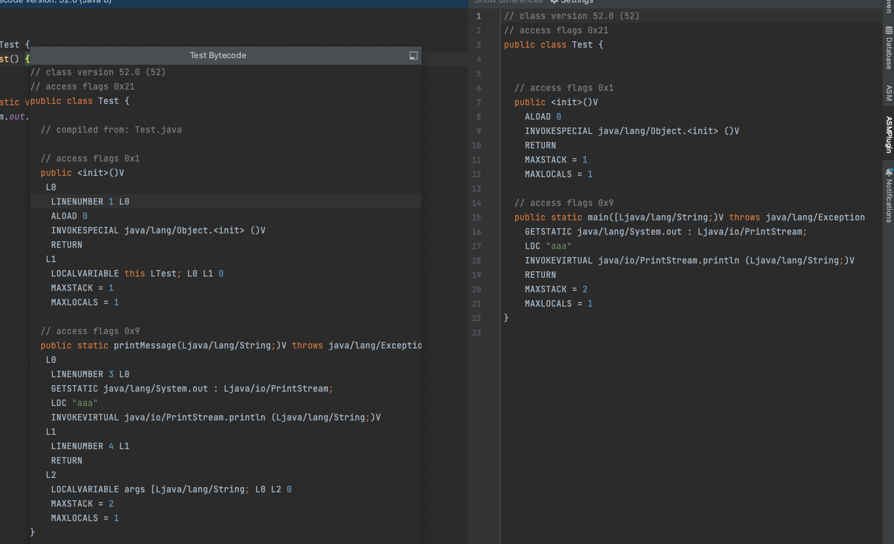

# 前言

最近准备去学java的Rasp，原理和过程基本上都能看明白，用agent以及其APi实现增强功能，根据上下文操作字节码实现，但是之前只了解过javassist这种直接对类和方法进行操作的。最近找到了一个简单的对OGNL，RCE，SQL这些采用rasp的方式进行防护的时候，它却用的ASM这种方式直接对字节码进行操作，感觉这种方式确实要灵活一点，要实现Rasp的话，还是这把这块再了解一下。

然后再对这个项目进行简单的改造

# 环境搭建

创建一个新的Maven项目导入ASM到依赖

```
<dependencies>
    <dependency>
        <groupId>org.ow2.asm</groupId>
        <artifactId>asm-debug-all</artifactId>
        <version>5.1</version>
    </dependency>
</dependencies>
```

# 核心API

在 `ASM` 的核心 `API` 中，按照对 `class` 文件处理的划分有：类处理（`ClassVisitor`、`ClassReader`）、注解处理（`AnnotationVisitor`）、方法处理（`MethodVisitor`）和字段处理（`FiledVisitor`）。

## ClassVisitor

ClassVisitor顾名思义，就是对类进行访问的，在Java中，要对类里面的字节码进行修改，首先得访问这个类，以下三个组件说基于ClassVisitor的

- `ClassReader` 用于解析分析分析类文件，转成 `ASM` 框架能分析的格式。然后在 `accept` 方法中接收一个 `ClassVisitor` 对象用于访问该类；
- `ClassWriter` 是 `ClassVisitor` 的子类，直接通过二进制的形式生成类；
- `ClassVisitor` 类可以看作一个事件筛选器，完成对类的访问遍历。

要实现对类的访问，大致的代码结构为

```
ClassReader classReader = new ClassReader("Test");
ClassWriter classWriter = new ClassWriter(ClassWriter.COMPUTE_MAXS | ClassWriter.COMPUTE_FRAMES);

// 创建一个自定义的ClassVisitor来修改Test类
ClassVisitor classVisitor = new ClassVisitor(Opcodes.ASM5, classWriter) {
    @Override
    public MethodVisitor visitMethod(int access, String name, String descriptor, String signature, String[] exceptions) {
				重写的visitMethod方法，对方法进行访问
    }
};

classReader.accept(classVisitor, ClassReader.SKIP_FRAMES);

byte[] modifiedClass = classWriter.toByteArray();
```

可能在ClassVisitor看到，接受的明明是个ClassVisitor对象，但是这里为什么是ClassWriter



因为ClassWriter继承至ClassVisitor


### ClassReader

用于将 `Java` 类文件转换成 `ClassVisitor` 能访问的结构。它有四个构造函数，分别支持 `byte[]`、`InputStream`、`File Path` 三种输入方式，这三种输入类型的构造方法如下：

- `ClassReader(byte[] classFile)`：以文件字节数组作为参数构建 `ClassReader`；
- `ClassReader(java.io.InputStream inputStream)`：以文件字节流作为参数；
- `ClassReader(java.lang.String className)`：以文件全路径名作为参数。



同时 `ClassReader` 类中还提供读取 `Class` 文件信息的方法，比如 `getClassName()`、`getAccess()`、`readByte(int offset)`。其中比较重要的一个方法是 `accept` 方法，该方法中接收一个 `ClassVisitor` 对象，用于完成对字节码的方法。

```text
accept(ClassVisitor classVisitor, int parsingOptions)
```

`parsingOptions` 转换参数取值有：

- `EXPAND_FRAMES`：处理 `StackMapTable` 属性信息，对于小于 JDK1.6 的类文件是默认展开的，其它是默认压缩的。使用此配置， `StackMapTable` 属性信息会全部按照展开进行处理，并可以访问到；
- `SKIP_CODE`：忽略 `Code` 属性信息(`attribute_info`)；
- `SKIP_DEBUG`：忽略 `SourceFile`、`SourceDebugExtension`、`LocalVariableTable`、`LocalVariableTypeTable`、`LineNumberTable` 和 `MethodParameters` 属性信息(`attribute_info`)，同时对应的 `visitXX` 方法也不会调用，比如 `visitSource`、`visitLocalVariable`；
- `SKIP_FRAMES`：忽略 `StackMap` 和 `StackMapTable` 属性信息，对应的 `visitFrame()` 方法不会调用。

> 相对直白的解释：
>
> - `ClassReader.SKIP_CODE`：跳过方法的代码部分，仅解析类的结构信息。
> - `ClassReader.SKIP_DEBUG`：跳过调试信息，加快解析速度。
> - `ClassReader.SKIP_FRAMES`：跳过栈帧信息，加快解析速度。
> - `ClassReader.EXPAND_FRAMES`：展开栈帧信息，方便调试和分析。

当你想要使用ASM对类进行字节码操作时，通常会创建一个 `ClassVisitor` 的子类，重写相应的方法（会遍历ClassVisitor里面的方法）来实现具体的操作。然后，通过 `accept` 方法将 `ClassVisitor` 与 `ClassReader` 关联，从而启动字节码解析和访问过程，达到对类进行修改的目的。

### ClassWriter

ClassWriter用于生成符合JVM规范的字节码文件，可以单独生成，也可以配合ClassVisitor和ClassReader一起使用对已有的进行修改。

> `ClassWriter` 提供了两种创建方式，一种是单独创建，另一种是以 `ClassReader` 作为参数。
>
> - `ClassWriter(int flags)`：创建新的 `ClassWriter`对象；
> - `ClassWriter(ClassReader classReader, int flags)`：以 `ClassReader` 作为参数创建新的对象，这种方式可以极大提高修改时的效率。
>
> 在上面的构造方法中，`Flag` 有两种类型取值：
>
> - `COMPUTE_FRAMES`：自动计算栈帧信息，即计算全部，必须调用 `visitMaxs(int)`，但是不必调用 `visitFrame()`；
> - `COMPUTE_MAXS`：自动计算最大的操作数栈和最大的局部变量表，但是必须调用 `visitMaxs(int)` 方法，可以使用任何参数，它会被重新计算覆盖，但是该方式需要自行计算帧；
> - `0`：不计算任何东西，必须由开发者手动进行计算帧、局部变量、操作数栈的大小。
>
> `COMPUTE_MAXS` 选项使 `ClassWriter` 的速度降低 10%，而使用 `COMPUTE_FRAMES` 选项则使其降低一半。

```
import org.objectweb.asm.*;

import java.io.FileOutputStream;

public class TestClassModifier {
    public static void main(String[] args) throws Exception {
        ClassReader classReader = new ClassReader("Test");
        ClassWriter classWriter = new ClassWriter(ClassWriter.COMPUTE_MAXS | ClassWriter.COMPUTE_FRAMES);

        // 创建一个自定义的ClassVisitor来修改Test类
        ClassVisitor classVisitor = new ClassVisitor(Opcodes.ASM5, classWriter) {
            @Override
            public MethodVisitor visitMethod(int access, String name, String descriptor, String signature, String[] exceptions) {
                // 用一个新的方法printMessage替换main方法
                if (name.equals("main") && descriptor.equals("([Ljava/lang/String;)V")) {
                    // 修改方法名和描述符
                    return super.visitMethod(access, "printMessage", "(Ljava/lang/String;)V", signature, exceptions);
                }
                return super.visitMethod(access, name, descriptor, signature, exceptions);
            }
        };

        classReader.accept(classVisitor, ClassReader.SKIP_FRAMES);

        byte[] modifiedClass = classWriter.toByteArray();

        FileOutputStream outputStream = new FileOutputStream("Test.class");
        outputStream.write(modifiedClass);
        outputStream.close();
    }
}
```

来创建一个类，对Test类进行修改，然后将修改后的Test类写到一个新的Test.class中



前后字节码对比，其实就是将方法名修改成了printMessage

## MethodVisitor

前面已经提到了如何对一个类进行访问，修改，然后生成一个新的符合JVM规范的字节码文件，那接下来就是对其内容进行修改访问，必然会有的就是对方法对修改，那就涉及到了MethodVisitor和FieldVisitor

而在我看来，前面对类的访问可以说是一个约定俗成的结构，对于内容的修改，才是我们真正要实现的

MethodVisitor提供了很多方法

> 方法说明：
>
> - `visitCode`：开始访问方法；
> - `visitParameter(String name, int access)`：访问方法参数；
> - `visitAnnotation`：访问方法的注解；
> - `visitParameterAnnotation`：访问方法参数的注解；
> - `visitFrame`：访问当前栈帧，即当前的局部变量表和操作数栈的状态；
> - `visitFieldInsn`：访问一个字段时的指令，即加载一个字段(`load`)或保存一个字段值(`store`)；
> - `visitIincInsn`：访问一个 `IINC` 指令；
> - `visitIntInsn(int opcode, int operand)`：访问一个 `int` 数值类型指令,当 `int` 取值 `-1~5`采用 `ICONST` 指令，取值 `-128~127`采用 `BIPUSH` 指令，取值 `-32768~32767` 采用 `SIPUSH`指令，取值 `-2147483648~2147483647` 采用 `ldc` 指令；
> - `visitInvokeDynamicInsn`：访问一个 `invokedynamic` 指令，一般是 `Lambda` 访问时；
> - `visitJumpInsn(int opcode, Label label)`：访问一个 `Jump` 指令；
> - `visitLdcInsn(Object value)`：访问一个 `LDC` 常量，并加载到操作数栈；
> - `visitMethodInsn(int opcode, String owner, String name, String descriptor, boolean isInterface)`：访问方法时的指令，即调用方法的指令，比如在一个方法中调用另一个方法；
> - `visitVarInsn(int opcode, int var)`：访问局部变量指令，局部变量指令是加载或存储局部变量值的指令；
> - `visitLineNumber(int line, Label start)`：访问方法行号声明；
> - `visitTryCatchBlock`：访问 `try..catch` 块；
> - `visitInsn(int opcode)`：访问一个字节码指令，比如 `IADD`、`ISUB`、`F2L`、`LSHR` 等；
> - `visitMax(int maxStack, int maxLocals)`：方法的局部变量表和操作数栈的最大个数；
> - `visitEnd`：方法访问结束，结束时必须调用。

MethodVisitor还可以配合上AdviceAdapter进行使用

`AdviceAdapter` 是 ASM 库中的一个实用工具类，它是 `MethodVisitor` 的子类，用于在方法的进入和退出时插入额外的字节码指令，从而实现一些常见的字节码操作。`AdviceAdapter` 简化了在方法中插入字节码的过程，使得在方法的开头（进入时）和结尾（退出时）进行插入操作变得更加方便。

`AdviceAdapter` 提供了许多钩子方法，它们对应着方法的不同阶段，允许你在这些阶段插入额外的字节码。主要的钩子方法有：

1. `protected void onMethodEnter()`: 这个方法在方法进入时被调用，在方法的开头可以插入额外的字节码指令。例如，你可以在这里插入一些参数检查或初始化操作。
2. `protected void onMethodExit(int opcode)`: 这个方法在方法退出时被调用，在方法的结尾可以插入额外的字节码指令。`opcode` 参数表示方法退出指令的操作码，你可以通过 `opcode` 参数判断是正常退出还是异常退出。


除了上述两个主要的钩子方法，`AdviceAdapter` 还提供了其他一些钩子方法，例如 `visitFieldInsn`、`visitMethodInsn` 等，用于在相应的操作发生时进行插入。

通过继承 `AdviceAdapter`，你可以重写这些钩子方法，并在其中插入相应的字节码指令来实现你需要的功能。这样的设计让ASM在操作字节码的时候变得更加的灵活。


# 在main方法前插入一个if方法

来实现一个简单的例子，在main方法前插入一个if方法，并且在这个类中新增一个hahaha方法

test.java

```
public class Test {
    private String name = "DawnT0wn";

    public void setName(String name) {
        this.name = name;
    }

    public String getName() {
        return name;
    }

    public static void main(String[] args) {
        Test test = new Test();
        System.out.println(test.getName());
    }
}
```

TestClassModifier.java

```
import Visitor.testVisitor;
import com.sun.org.apache.bcel.internal.generic.ALOAD;
import com.sun.org.apache.bcel.internal.generic.INVOKEVIRTUAL;
import org.objectweb.asm.*;

import java.io.FileOutputStream;

public class TestClassModifier {
    public static void main(String[] args) throws Exception {
        ClassReader classReader = new ClassReader("Test");
        ClassWriter classWriter = new ClassWriter(ClassWriter.COMPUTE_MAXS | ClassWriter.COMPUTE_FRAMES);

        // 创建一个自定义的ClassVisitor来修改Test类
        ClassVisitor classVisitor = new testVisitor(Opcodes.ASM5, classWriter);
        // 直接创建一个方法
        MethodVisitor methodVisitor = classVisitor.visitMethod(Opcodes.ACC_PUBLIC+Opcodes.ACC_FINAL, "hahaha","()V",null,null);
        methodVisitor.visitCode();
        methodVisitor.visitFieldInsn(Opcodes.GETSTATIC, "java/lang/System", "out", "Ljava/io/PrintStream;");
        methodVisitor.visitLdcInsn("aaaa");
        methodVisitor.visitMethodInsn(Opcodes.INVOKEVIRTUAL, "java/io/PrintStream", "println", "(Ljava/lang/String;)V", false);
        methodVisitor.visitInsn(Opcodes.RETURN);
//        methodVisitor.visitMaxs(1,1);
        methodVisitor.visitEnd();

        classReader.accept(classVisitor, ClassReader.SKIP_FRAMES);

        byte[] modifiedClass = classWriter.toByteArray();

        FileOutputStream outputStream = new FileOutputStream("Test.class");
        outputStream.write(modifiedClass);
        outputStream.close();
    }
}

```

testVisitor.java

```
package Visitor;

import org.objectweb.asm.ClassVisitor;
import org.objectweb.asm.MethodVisitor;

public class testVisitor extends ClassVisitor {
    public testVisitor(int api) {
        super(api);
    }

    public testVisitor(int api, ClassVisitor cv) {
        super(api, cv);
    }

    @Override
    public MethodVisitor visitMethod(int access, String name, String descriptor, String signature, String[] exceptions) {
        // 用一个新的方法printMessage替换main方法
        MethodVisitor mv = super.visitMethod(access, name, descriptor, signature, exceptions);
        if (name.equals("main") && descriptor.equals("([Ljava/lang/String;)V")) {
            // 修改方法名和描述符
//            return super.visitMethod(access, "printMessage", "(Ljava/lang/String;)V", signature, exceptions);
            mv = new testAdaptor(mv, access, name, descriptor);
        }
        return mv;
    }
}
```

testAdaptor,java

```
package Visitor;

import org.objectweb.asm.Label;
import org.objectweb.asm.MethodVisitor;
import org.objectweb.asm.Opcodes;
import org.objectweb.asm.commons.AdviceAdapter;

public class testAdaptor extends AdviceAdapter {
    protected testAdaptor(MethodVisitor mv, int access, String name, String desc) {
        super(Opcodes.ASM5, mv, access, name, desc);
    }

    @Override
    protected void onMethodEnter(){
        Label label1 = new Label();
        mv.visitLabel(label1);
        mv.visitVarInsn(ALOAD, 0);
        mv.visitMethodInsn(INVOKEVIRTUAL, "Test", "getName", "()Ljava/lang/String;", false);

        // 将常量字符串 "DawnT0wn" 推送到栈顶
        mv.visitLdcInsn("DawnT0wn");
        Label label2 = new Label();

        // 使用 IFNE 条件跳转指令，如果相等则跳转到标签 label2
        mv.visitJumpInsn(IFNE, label2);
        Label label3 = new Label();
        mv.visitLabel(label3);
        mv.visitTypeInsn(NEW, "java/lang/Exception");
        mv.visitLdcInsn("Name is wrong");
        mv.visitMethodInsn(INVOKEVIRTUAL, "java/lang/Exception", "<init>","(Ljava/lang/String;)V",false);
        mv.visitInsn(ATHROW);
        mv.visitLabel(label2);

    }
}
```

让我们逐步解释这段代码的作用：

1. `Label label1 = new Label();`: 这里定义了一个标签 `label1`，用于标记字节码中的某个位置。
2. `mv.visitLabel(label1);`: 这个语句会在字节码中插入一个标记指令，将标签 `label1` 插入到这个位置。
3. `mv.visitVarInsn(ALOAD, 0);`: 这是一个 `ALOAD` 指令，它会将索引为0的局部变量（通常是 `this` 对象）加载到栈顶。
4. `mv.visitMethodInsn(INVOKEVIRTUAL, "Test", "getName", "()Ljava/lang/String;", false);`: 这是一个虚方法调用指令，它会调用名为 `getName` 的方法。方法所属的类为 `"Test"`，并且该方法无参数，返回值类型为 `java.lang.String`。它将返回值（`getName` 方法的结果）推送到栈顶。
5. `mv.visitLdcInsn("DawnT0wn");`: 这是一个加载常量指令，它会将字符串常量 `"DawnT0wn"` 加载到栈顶。
6. `Label label2 = new Label();`: 这里定义了另一个标签 `label2`，用于标记字节码中的某个位置。
7. `mv.visitJumpInsn(IFNE, label2);`: 这是一个条件跳转指令，它会在栈顶的值为真（非0）时跳转到标签 `label2` 所标记的位置。在这里，栈顶的值是通过 `getName()` 方法的结果和常量字符串 `"DawnT0wn"` 进行比较得到的。
8. `Label label3 = new Label();`: 这里定义了另一个标签 `label3`，用于标记字节码中的某个位置。
9. `mv.visitLabel(label3);`: 这个语句会在字节码中插入一个标记指令，将标签 `label3` 插入到这个位置。
10. `mv.visitTypeInsn(NEW, "java/lang/Exception");`: 这是一个新对象创建指令，它会创建一个 `java.lang.Exception` 的新对象。
11. `mv.visitLdcInsn("Name is wrong");`: 这是一个加载常量指令，它会将字符串常量 `"Name is wrong"` 加载到栈顶。
12. `mv.visitMethodInsn(INVOKEVIRTUAL, "java/lang/Exception", "<init>", "(Ljava/lang/String;)V", false);`: 这是一个实例方法调用指令，它会调用 `Exception` 类的构造方法，并传递栈顶的字符串常量（此时时刚才压入栈道参数Name is wrong）作为构造方法的参数。
13. `mv.visitInsn(ATHROW);`: 这是一个抛出异常指令，它会将栈顶的异常对象抛出。
14. `mv.visitLabel(label2);`: 这个语句会在字节码中插入一个标记指令，将标签 `label2` 插入到这个位置。这是条件跳转的目标位置，当条件满足时，会跳转到这里。

这段代码的作用是：在方法的开头，它检查 `getName()` 方法的返回值是否等于字符串常量 `"DawnT0wn"`，如果不等于，则抛出一个自定义异常 `java.lang.Exception`。这样做是为了在方法的开头进行参数检查或条件检查，如果条件不满足，则抛出异常终止方法的执行。

最后生成的类


ASM是一个非常强大的库，里面有很多操作，这里都没有提到，我也背不下来，只有遇到再去搜索，运用这个库实现具体操作的时候，还是得对字节码比较熟悉才行，比如System.out.println，他其实就分了两段，显示获取一个静态的System.out变量，然后在调用这个变量的println方法，压入LDC


参考链接：

[AOP 利器 ——ASM 基础入门 - 知乎 (zhihu.com)](https://zhuanlan.zhihu.com/p/263806589#:~:text=ASM 是一个 Java 字节码操作框架，它能用来动态生成类或者增强既有类的功能。 ASM 可以直接生成二进制,class 文件，也可以在类被加载到 Java 虚拟机之前动态改变类行为。 ASM 框架中提供了常见的字节码分析和生成工具，可以快速进行类的生成或分析转换。)