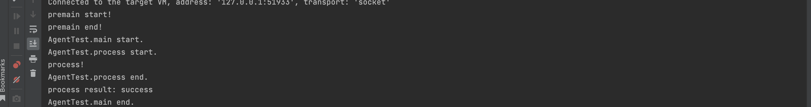

# 什么是Agent

Agent可以被当作一个探针，Java 代理 (agent) 是在你的main方法前的一个拦截器 (interceptor)，也就是在main方法执行之前，执行agent的代码。

Agent的代码和我们Java程序的运行代码可以在同一个JVM里面运行，java agent其实也是一个Jar包，在java程序运行时可以指定这个jar包来加载Agent，从而实现在main方法执行前执行agent代码。

Java Agent主要通过两个API实现：

- Instrumentation API：提供了在程序运行期间加载字节码的能力，可以用来动态地修改类的行为。Java Agent可以在类被加载前，对其使用字节码动态修改，可以插入自己的代码。
- Java Virtual Machine Tool Interface（JVMTI）：提供了程序运行期间监视和控制JVM的能力。JVMTI可以用于监视内存的使用情况，线程执行情况，堆栈信息等。

Agent的技术，在RASP中得到了应用，在学习Rasp之前，先来简单了解一下Agent

接下来我们就来实现一个简单的Agent

# Agent实现在开始前打印日志

我们来用Agent实现在Main函数开始前和结束后打印内容

## 开发Agent

创建一个Maven项目，以下是我的pom文件

引入`javassist`用来修改目标类的字节码，增加自定义代码。通过`maven-assembly-plugin`插件打包自定义的 agent jar

```
<?xml version="1.0" encoding="UTF-8"?>
<project xmlns="http://maven.apache.org/POM/4.0.0"
         xmlns:xsi="http://www.w3.org/2001/XMLSchema-instance"
         xsi:schemaLocation="http://maven.apache.org/POM/4.0.0 http://maven.apache.org/xsd/maven-4.0.0.xsd">
    <modelVersion>4.0.0</modelVersion>

    <groupId>org.example</groupId>
    <artifactId>demo-javaagent</artifactId>
    <version>1.0-SNAPSHOT</version>

    <properties>
        <maven.compiler.source>8</maven.compiler.source>
        <maven.compiler.target>8</maven.compiler.target>
        <project.build.sourceEncoding>UTF-8</project.build.sourceEncoding>
    </properties>
    <dependencies>
        <dependency>
            <groupId>org.javassist</groupId>
            <artifactId>javassist</artifactId>
            <version>3.25.0-GA</version>
        </dependency>
    </dependencies>

    <build>
        <plugins>
            <plugin>
                <groupId>org.apache.maven.plugins</groupId>
                <artifactId>maven-assembly-plugin</artifactId>
                <version>3.1.0</version>
                <configuration>
                    <descriptorRefs>
                        <!--将应用的所有依赖包都打到jar包中。如果依赖的是 jar 包，jar 包会被解压开，平铺到最终的 uber-jar 里去。输出格式为 jar-->
                        <descriptorRef>jar-with-dependencies</descriptorRef>
                    </descriptorRefs>
                    <archive>
                        <!-- 设置manifest配置文件-->
                        <manifestEntries>
                            <!--Premain-Class: 代表 Agent 静态加载时会调用的类全路径名。-->
                            <Premain-Class>demo.MethodAgentMain</Premain-Class>
                            <!--Agent-Class: 代表 Agent 动态加载时会调用的类全路径名。-->
                            <Agent-Class>demo.MethodAgentMain</Agent-Class>
                            <!--Can-Redefine-Classes: 是否可进行类定义。-->
                            <Can-Redefine-Classes>true</Can-Redefine-Classes>
                            <!--Can-Retransform-Classes: 是否可进行类转换。-->
                            <Can-Retransform-Classes>true</Can-Retransform-Classes>
                        </manifestEntries>
                    </archive>
                </configuration>
                <executions>
                    <execution>
                        <!--绑定到package生命周期阶段上-->
                        <phase>package</phase>
                        <goals>
                            <!--绑定到package生命周期阶段上-->
                            <goal>single</goal>
                        </goals>
                    </execution>
                </executions>
            </plugin>

            <plugin>
                <groupId>org.apache.maven.plugins</groupId>
                <artifactId>maven-compiler-plugin</artifactId>
                <version>3.1</version>
                <configuration>
                    <source>${maven.compiler.source}</source>
                    <target>${maven.compiler.target}</target>
                </configuration>
            </plugin>
        </plugins>
    </build>


</project>
```

这一部分非常重要

```
<manifestEntries>
  <!--Premain-Class: 代表 Agent 静态加载时会调用的类全路径名。-->
  <Premain-Class>demo.MethodAgentMain</Premain-Class>
  <!--Agent-Class: 代表 Agent 动态加载时会调用的类全路径名。-->
  <Agent-Class>demo.MethodAgentMain</Agent-Class>
  <!--Can-Redefine-Classes: 是否可进行类定义。-->
  <Can-Redefine-Classes>true</Can-Redefine-Classes>
  <!--Can-Retransform-Classes: 是否可进行类转换。-->
  <Can-Retransform-Classes>true</Can-Retransform-Classes>
</manifestEntries>
```

这里需要解释下为什么要指定 Agent-Class 和 Premain-Class ?

在加载Java Agent之后，会找到 Agent-Class 或者 Premain-Class 指定的类，并运行对应的 agentmain 或者 premain 方法。

在一部分文章中是直接提到在MANIFEST.MF文件中指定


agent实现代码

```
package demo;

import javassist.ClassPool;
import javassist.CtClass;
import javassist.CtMethod;
import javassist.Modifier;

import java.lang.instrument.ClassFileTransformer;
import java.lang.instrument.Instrumentation;
import java.lang.instrument.UnmodifiableClassException;
import java.security.ProtectionDomain;

public class MethodAgentMain {

    /** 被转换的类 */
    public static final String TRANSFORM_CLASS = "org.example.agent.AgentTest";

    /** 静态加载。Java agent指定的premain方法，会在main方法之前被调用 */
    public static void premain(String args, Instrumentation instrumentation) {
        System.out.println("premain start!");
        addTransformer(instrumentation);
        System.out.println("premain end!");
    }

    /** 动态加载。Java agent指定的premain方法，会在main方法之前被调用 */
    public static void agentmain(String args, Instrumentation instrumentation) {
        System.out.println("agentmain start!");
        addTransformer(instrumentation);
        Class<?>[] classes = instrumentation.getAllLoadedClasses();
        if (classes != null){
            for (Class<?> c: classes) {
                if (c.isInterface() ||c.isAnnotation() ||c.isArray() ||c.isEnum()){
                    continue;
                }
                if (c.getName().equals(TRANSFORM_CLASS)) {
                    try {
                        System.out.println("retransformClasses start, class: " + c.getName());
                        /*
                         * retransformClasses()对JVM已经加载的类重新触发类加载。使用的就是上面注册的Transformer。
                         * retransformClasses()可以修改方法体，但是不能变更方法签名、增加和删除方法/类的成员属性
                         */
                        instrumentation.retransformClasses(c);
                        System.out.println("retransformClasses end, class: " + c.getName());
                    } catch (UnmodifiableClassException e) {
                        System.out.println("retransformClasses error, class: " + c.getName() + ", ex:" + e);
                        e.printStackTrace();
                    }
                }
            }
        }
        System.out.println("agentmain end!");
    }

    private static void addTransformer (Instrumentation instrumentation) {
        /* Instrumentation提供的addTransformer方法，在类加载时会回调ClassFileTransformer接口 */
        instrumentation.addTransformer(new ClassFileTransformer() {
            public byte[] transform(ClassLoader l,String className, Class<?> c,ProtectionDomain pd, byte[] b){
                try {
                    className = className.replace("/", ".");
                    if (className.equals(TRANSFORM_CLASS)) {
                        final ClassPool classPool = ClassPool.getDefault();
                        final CtClass clazz = classPool.get(TRANSFORM_CLASS);

                        for (CtMethod method : clazz.getMethods()) {
                            /*
                             * Modifier.isNative(methods[i].getModifiers())过滤本地方法,否则会报
                             * javassist.CannotCompileException: no method body  at javassist.CtBehavior.addLocalVariable()
                             * 报错原因如下
                             * 来自Stack Overflow网友解答
                             * Native methods cannot be instrumented because they have no bytecodes.
                             * However if native method prefix is supported ( Transformer.isNativeMethodPrefixSupported() )
                             * then you can use Transformer.setNativeMethodPrefix() to wrap a native method call inside a non-native call
                             * which can then be instrumented
                             */
                            if (Modifier.isNative(method.getModifiers())) {
                                continue;
                            }

                            method.insertBefore("System.out.println(\"" + clazz.getSimpleName() + "."
                                    + method.getName() + " start.\");");
                            method.insertAfter("System.out.println(\"" + clazz.getSimpleName() + "."
                                    + method.getName() + " end.\");", false);
                        }

                        return clazz.toBytecode();
                    }
                } catch (Exception e) {
                    e.printStackTrace();
                }

                return null;
            }
        }, true);
    }
}
```

以上代码中，我们用到了两种加载方式，premain对应静态加载，agentmain对应动态加载的代码，静态加载和动态加载的实现会在后面体现，而addTransformer方法则是对应增强的功能，我们可以在里面通过字节码操作对应类

将agent打包成jar包

## 静态加载Agent

```
// -javaagent:/Users/DawnT0wn/IdeaProjects/demo-javaagent/target/demo-javaagent-1.0-SNAPSHOT-jar-with-dependencies.jar
package org.example.agent;

public class AgentTest {
    public static void main(String[] args) throws InterruptedException {
//        for (int i = 0; i < 1000; i++) {
//            System.out.println("process result: " + process());
//            Thread.sleep(5000);
//        }
        System.out.println("process result: " + process());
    }

    public static String process() {
        System.out.println("process!");
        return "success";
    }
}
```

写一个简单的类，直接打印内容即可，在运行时勾选VM options，加上-javagent:`agent jar包的位置`


运行看一下效果


来解读一下

premain方法内容

```
public static void premain(String args, Instrumentation instrumentation) {
        System.out.println("premain start!");
        addTransformer(instrumentation);
        System.out.println("premain end!");
    }
```

其实正常的话标准的结构应该是

```
public static void premain(String args, Instrumentation instrumentation) {
        System.out.println("premain start!");
        MyTranformer myTransfomer = new MyTransformer();
        instrumentation.addTransformer(myTransfomer);
        System.out.println("premain end!");
    }
```

MyTranformer是一个转化器，是我们自己写的一个类，它需要实现ClassFileTransformer接口，并且重写transformer方法

```
package demo;

import java.lang.instrument.ClassFileTransformer;
import java.lang.instrument.IllegalClassFormatException;
import java.security.ProtectionDomain;

public class MyTransFormer implements ClassFileTransformer {
    @Override
    public byte[] transform(ClassLoader loader, String className, Class<?> classBeingRedefined, ProtectionDomain protectionDomain, byte[] classfileBuffer) throws IllegalClassFormatException {
    		// 对应增强的代码
        return new byte[0];
    }
}
```

可以把它想象成我们实现一个filter要去重写doFilter方法，然后在里面实现具体代码，回到代码来看

当类加载的时候会回调ClassFileTransformer接口，调用其transformer方法，首先是Java中本来就会加载的一些类，然后加载到我们对应的类的时候，我们通过equal筛选出来，接下来就是主要的实现代码了


通过javassist修改字节码，用for循环获取所有的方法，并在其前后分别插入System.out.println代码，这样在方法运行前后就会有输出

至于为什么要用

```
if (Modifier.isNative(method.getModifiers())) {
    continue;
}
```

给出的解释是如下的，反正就是要筛选出可用的方法吧


最后就是输出了，首先是premain的输出，接下来就是通过字节码插到每个方法前后的代码，方法运行前会执行start，然后输出对应方法打印的内容，方法执行完成后会执行end


## 动态加载Agent

动态加载不是通过 `-javaagent:` 的方式实现，而是通过 Attach API 的方式。

修改AgentTest，让他保持运行状态

```
package org.example.agent;

public class AgentTest {
    public static void main(String[] args) throws InterruptedException {
        for (int i = 0; i < 1000; i++) {
            System.out.println("process result: " + process());
            Thread.sleep(5000);
        }
//        System.out.println("process result: " + process());
    }

    public static String process() {
        System.out.println("process!");
        return "success";
    }
}
```

新建AttachMain

```
package org.example.agent;

import com.sun.tools.attach.VirtualMachine;
import com.sun.tools.attach.VirtualMachineDescriptor;

import java.util.List;

public class AttachMain {

    public static void main(String[] args) throws Exception {
        List<VirtualMachineDescriptor> listBefore = VirtualMachine.list();
        // agentmain()方法所在jar包
        String jar = "/Users/DawnT0wn/IdeaProjects/demo-javaagent/target/demo-javaagent-1.0-SNAPSHOT-jar-with-dependencies.jar";

        for (VirtualMachineDescriptor virtualMachineDescriptor : VirtualMachine.list()) {
            // 针对指定名称的JVM实例
            if (virtualMachineDescriptor.displayName().equals("org.example.agent.AgentTest")) {
                System.out.println("将对该进程的vm进行增强：org.example.agent.AgentTest的vm进程, pid=" + virtualMachineDescriptor.id());
                // attach到新JVM
                VirtualMachine vm = VirtualMachine.attach(virtualMachineDescriptor);
                // 加载agentmain所在的jar包
                vm.loadAgent(jar);
                // detach
                vm.detach();
            }
        }
    }
}
```

运行AgentTest先，不需要加javaagent参数，然后等一会再运行AttachMain，以便观察区别




可以看到已经成功加载了agent，所谓动态加载，即在程序运行过程中加载agent

还是来读一下代码，首先AgentTest没有什么好说的，来看到AttachMain

```
public static void main(String[] args) throws Exception {
        List<VirtualMachineDescriptor> listBefore = VirtualMachine.list();
//        System.out.println(listBefore);
        // agentmain()方法所在jar包
        String jar = "/Users/DawnT0wn/IdeaProjects/demo-javaagent/target/demo-javaagent-1.0-SNAPSHOT-jar-with-dependencies.jar";

        for (VirtualMachineDescriptor virtualMachineDescriptor : VirtualMachine.list()) {
            // 针对指定名称的JVM实例
            if (virtualMachineDescriptor.displayName().equals("org.example.agent.AgentTest")) {
                System.out.println("将对该进程的vm进行增强：org.example.agent.AgentTest的vm进程, pid=" + virtualMachineDescriptor.id());
                // attach到新JVM
                VirtualMachine vm = VirtualMachine.attach(virtualMachineDescriptor);
                // 加载agentmain所在的jar包
                vm.loadAgent(jar);
                // detach
                vm.detach();
            }
        }
    }
```

因为每个Java程序在运行的时候就是一个JVM，通过列出所有的JVM遍历来找到AgentTest运行时的JVM，然后attach（附加）到对应的JVM进程上，再通过loadAgent添加对应的jar包，最后，使用`vm.detach()`方法从目标JVM实例分离（分离的是当前的java进程，即AttachMain这个java进程结束）。

当你通过 `VirtualMachine.attach(virtualMachineDescriptor)` 方法将Java进程附加到目标JVM实例时，你会成为目标JVM实例的监视器，这意味着你可以在运行时检查和操作该JVM的状态。当你完成对目标JVM实例的操作后，你可以使用 `detach()` 方法将当前Java进程从目标JVM实例中分离。

分离的目的是为了确保在你的操作完成后，目标JVM实例可以继续独立运行而不受附加的Java进程的影响。这样做可以避免不必要的干扰和副作用，同时保持目标JVM实例的完整性和稳定性。

因此，在注入代理（agent）后，通过调用 `vm.detach()` 方法，你将解除与目标JVM实例的连接，使其可以继续正常运行。

回到我们开发的agent中

```
public static void agentmain(String args, Instrumentation instrumentation) {
    System.out.println("agentmain start!");
    addTransformer(instrumentation);
    Class<?>[] classes = instrumentation.getAllLoadedClasses();
    if (classes != null){
        for (Class<?> c: classes) {
            if (c.isInterface() ||c.isAnnotation() ||c.isArray() ||c.isEnum()){
                continue;
            }
            if (c.getName().equals(TRANSFORM_CLASS)) {
                try {
                    System.out.println("retransformClasses start, class: " + c.getName());
                    /*
                     * retransformClasses()对JVM已经加载的类重新触发类加载。使用的就是上面注册的Transformer。
                     * retransformClasses()可以修改方法体，但是不能变更方法签名、增加和删除方法/类的成员属性
                     */
                    instrumentation.retransformClasses(c);
                    System.out.println("retransformClasses end, class: " + c.getName());
                } catch (UnmodifiableClassException e) {
                    System.out.println("retransformClasses error, class: " + c.getName() + ", ex:" + e);
                    e.printStackTrace();
                }
            }
        }
    }
    System.out.println("agentmain end!");
}
```

通过调用 `vm.loadAgent(jar)` 方法，使用指定的 JAR 文件加载代理。该 JAR 文件中应该包含代理类，并在其中定义 `public static void agentmain(String agentArgs, Instrumentation inst)` 方法。加载代理后，目标JVM会调用代理类的 `agentmain` 方法，从而执行代理逻辑。这个agentmain方法是在对应JVM的main方法执行之前

agentmain和premain其实是差不多的，都是可以通过Instrumentation对象实现对目标应用程序的增强和修改。

```
// 伪代码如下

public static void agentmain(String args, Instrumentation instrumentation) {
        System.out.println("premain start!");
        MyTranformer myTransfomer = new MyTransformer();
        instrumentation.addTransformer(myTransfomer);
        instrumentation.retransformClasses(c); // 重新加载类
    }
```

这里就是和premain一样的了

为什么需要retransformClasses()方法，因为在静态加载的时候，我们提前制定了agent，在类完成加载其实就已经修改了类的字节码，而在动态加载的时候，类已经提前被加载了，所以即使我们修改了字节码也没有用，必须重新加载这个类，而retransformClasses方法就实现了这个功能

`retransformClasses` 方法是Java Instrumentation API中的一个重要方法，它允许在运行时重新定义已加载的类的字节码。通过调用 `retransformClasses` 方法，你可以对已加载的类进行修改，例如修改方法的实现、添加字段、增加注解等。

所以agentmain的代码看起来会更长

```
Class<?>[] classes = instrumentation.getAllLoadedClasses();
if (classes != null){
    for (Class<?> c: classes) {
        if (c.isInterface() ||c.isAnnotation() ||c.isArray() ||c.isEnum()){
            continue;
        }
        if (c.getName().equals(TRANSFORM_CLASS)) {
            try {
                System.out.println("retransformClasses start, class: " + c.getName());
                /*
                 * retransformClasses()对JVM已经加载的类重新触发类加载。使用的就是上面注册的Transformer。
                 * retransformClasses()可以修改方法体，但是不能变更方法签名、增加和删除方法/类的成员属性
                 */
                instrumentation.retransformClasses(c);
                System.out.println("retransformClasses end, class: " + c.getName());
            } catch (UnmodifiableClassException e) {
                System.out.println("retransformClasses error, class: " + c.getName() + ", ex:" + e);
                e.printStackTrace();
            }
        }
    }
}
```

获取所有加载过的类，对其接口，类名进行过滤，得到需要修改的类然后重新加载

# JVMTI

最开始提到了，Agent主要通过两个API实现，一个是instrumentation api，另外一个则是JVMTI

他们都是**一套 JVM 操作和监控的接口**，且都**需要通过agent来启动**：

- `Instumentation API`需要打包成 jar，并通过 Java agent 加载（对应启动参数: `-javaagent`）
- JVMTI 需要打包成动态链接库（随操作系统，如.dll/.so文件），并通过 JVMTI agent 加载（对应启动参数: `-agentlib/-agentpath`）

并且JVMTI的功能比Instrumentation API更强大，它支持：

- 获取所有线程、查看线程状态、线程调用栈、查看线程组、中断线程、查看线程持有和等待的锁、获取线程的CPU时间、甚至将一个运行中的方法强制返回值……
- 获取Class、Method、Field的各种信息，类的详细信息、方法体的字节码和行号、向Bootstrap/System Class Loader添加jar、修改System Property……
- 堆内存的遍历和对象获取、获取局部变量的值、监测成员变量的值……
- 各种事件的callback函数，事件包括：类文件加载、异常产生与捕获、线程启动和结束、进入和退出临界区、成员变量修改、gc开始和结束、方法调用进入和退出、临界区竞争与等待、VM启动与退出……
- 设置与取消断点、监听断点进入事件、单步执行事件……


Java agent 是基于 JVMTI 实现，核心部分是 `ClassFileLoadHook`和`TransFormClassFile`。

`ClassFileLoadHook`是一个 JVMTI 事件，该事件是 Instrumentation agent 的一个核心事件，主要是在读取字节码文件回调时调用，内部调用了`TransFormClassFile`的函数。

`TransFormClassFile`的主要作用是调用`java.lang.instrument.ClassFileTransformer`的`tranform`方法，该方法由开发者实现，通过`Instrumentation`的`addTransformer`方法进行注册。

**在字节码文件加载**的时候，会触发`ClassFileLoadHook`事件，该事件调用`TransFormClassFile`，通过经由`Instrumentation` 的 `addTransformer` 注册的方法完成整体的字节码修改。

**对于已加载的类**，需要调用`retransformClass`函数，然后经由`redefineClasses`函数，在读取已加载的字节码文件后，若该字节码文件对应的类关注了`ClassFileLoadHook`事件，则调用`ClassFileLoadHook`事件。后续流程与类加载时字节码替换一致。


参考链接：

https://cloud.tencent.com/developer/article/1813421

https://juejin.cn/post/7157684112122183693#heading-5

https://chat.openai.com/