# 前言

最近有点想去挖一些Java CMS或者一些产品的漏洞，在此之前来了解一下Java代码审计中关注的漏洞存在的一些关键词和产生的漏洞，先来看看SSRF。在很久之前已经学习过SSRF了，包括原理，修复方案，绕过手法，但是大多数都只停留在PHP中，在Java中，要对代码审计的话，还是得了解在不同语言中，SSRF漏洞形成的方式（代码方面），以及利用方式的是否有不同，从而可以从代码方面达到修复，或者进行代码审计。

# SSRF介绍

什么是SSRF，在之前已经了解过了，在我自己看来就是，SSRF本身的实质就是一个请求，但是呢，对这个请求的功能没有进行严格的过滤和限制，导致攻击者可以利用该漏洞对内网进行访问，从而可能获取到一些敏感信息。简而言之就是攻击者可以从外网通过具有SSRF漏洞对web服务器访问内网主机。

所以一般来说存在SSRF漏洞的地方都是一些可以发起请求的地方

- 对外能够发起网络请求的地方就有可能存在SSRF(订阅处，在线识图处，分享处等)
- 从指定URL地址获取网页文本内容，加载指定地址的图片，下载等
- 加载远程配置

因为请求方式和PHP用的不同，自然而然用到的伪协议也有一定的差异

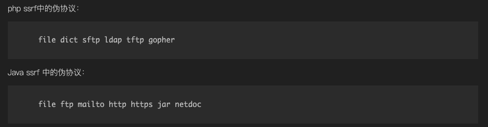

特别注意在Java的SSRF中补支持gopher，Java网络请求支持的协议可通过下面几种方法检测：

- 代码中遍历协议
- 官方文档中查看
- `import sun.net.www.protocol`查看

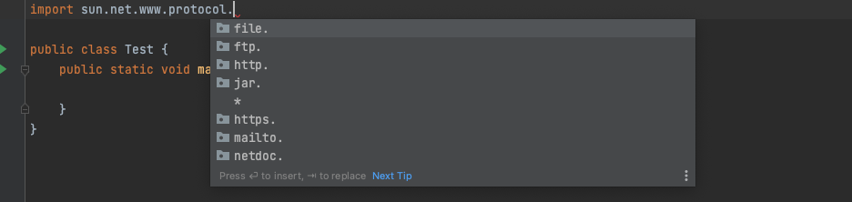

其实在Java的SSRF中会存在多个场景，因为不同的类发送请求的时候不会像PHP那样支持各种伪协议直接使用，要针对不同的场景

SSRF是由发起网络请求的方法造成。所以先整理Java能发起网络请求的类。大概有如下类可以发起网络请求

- HttpClient
- Request (对HttpClient封装后的类)
- HttpURLConnection
- URLConnection
- URL
- okhttp
- ImageIO（JDK自带的图片操作类）

如果发起网络请求的类是带HTTP开头，那只支持HTTP、HTTPS协议。

比如：

```
HttpURLConnection
HttpClient
Request
okhttp
```

所以，如果用以下类的方法发起请求，则支持`sun.net.www.protocol`所有协议

```
URLConnection
URL
```

注意，Request类对HttpClient进行了封装。类似Python的requests库。
用法及其简单，一行代码就可以获取网页内容。

```
Request.Get(url).execute().returnContent().toString();
```

总的来说一般SSRF存在的点为

```
HttpURLConnection.getInputStream
URLConnection.getInputStream
Request.Get.execute
Request.Post.execute
URL.openStream
ImageIO.read
OkHttpClient.newCall.execute
HttpClients.execute
HttpClient.execute
```

# Java SSRF场景

## HTTP探测

```
package com.example.javassrfdemo.Controller;

import org.springframework.stereotype.Controller;
import org.springframework.web.bind.annotation.RequestMapping;
import org.springframework.web.bind.annotation.ResponseBody;

import javax.servlet.http.HttpServletRequest;
import javax.servlet.http.HttpServletResponse;
import java.io.BufferedReader;
import java.io.InputStreamReader;
import java.io.PrintWriter;
import java.net.HttpURLConnection;
import java.net.URL;
import java.net.URLConnection;

@Controller
public class SsrfController {
    @RequestMapping("/ssrftest")
    @ResponseBody
    public void test(HttpServletRequest request, HttpServletResponse response)throws Exception{
        String url = request.getParameter("url");   //接收url的传参
        String htmlContent;
        PrintWriter writer = response.getWriter();  //获取响应的打印流对象
        URL u = new URL(url);   //实例化url的对象
        try {
            URLConnection urlConnection = u.openConnection();//打开一个URL连接，并运行客户端访问资源。
//            BufferedReader base = new BufferedReader(new InputStreamReader(urlConnection.getInputStream(), "UTF-8"));  //获取url中的资源
            HttpURLConnection httpUrl = (HttpURLConnection) urlConnection;  //强转为HttpURLConnection
            BufferedReader base = new BufferedReader(new InputStreamReader(httpUrl.getInputStream(), "UTF-8"));  //获取url中的资源
            StringBuffer html = new StringBuffer();
            while ((htmlContent = base.readLine()) != null) {
                html.append(htmlContent);  //htmlContent添加到html里面
            }
            base.close();

            writer.println(html);//响应中输出读取的资源
            writer.flush();

        } catch (Exception e) {
            e.printStackTrace();
            writer.println("请求失败");
            writer.flush();
        }
    }
}
```

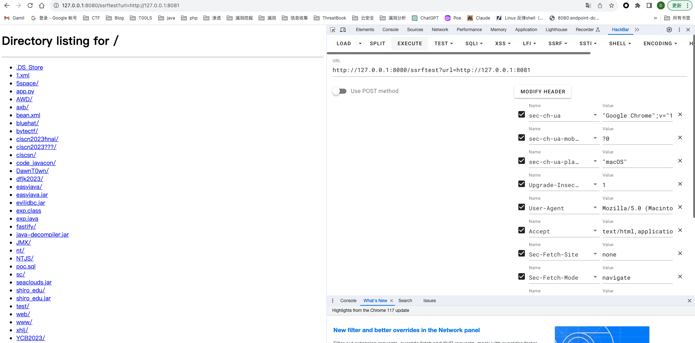

整个代码的含义就是通过URL.openConnect获取与一个地址的连接，然后读到缓冲流里面，通过response对象打印在页面上

注意到代码中的注释区别，存在一个类型转换，将URLConnection转换成了HttpURLConnection对象

```
URLConnection:可以走邮件、文件传输协议。
HttpURLConnection 只能走浏览器的HTTP协议
```

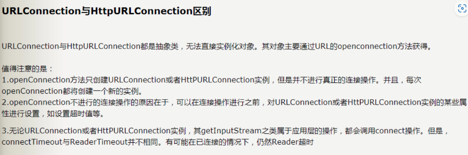

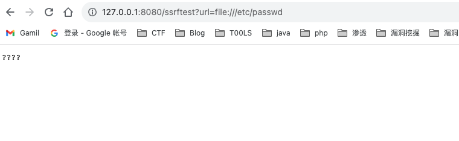

因为将类型转换为了HttpURLConnection对象，所以只能用到http协议，当我用file读文件的时候就没有成功

当我不进行类型转换的时候，直接用URLConnection，就可以用到文件传输协议读到/etc/passwd

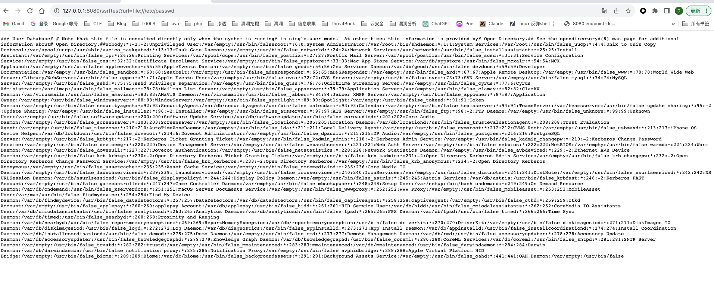

用netdoc读文件

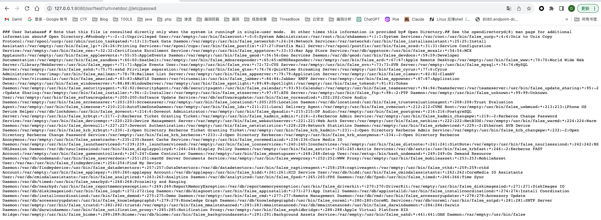

利用jar+http

jar 协议语法，`jar:{url}!/{entry}`，url是文件的路径，entry是想要解压出来的文件

当然这里url不仅仅是http协议，也可以是file协议或者netdoc

jar协议处理文件过程

- 下载 jar/zip 文件到临时文件中
- 提取出我们指定的文件
- 删除临时文件

```
url=jar:http://127.0.0.1:8081/test.jar!/poc.txt
```

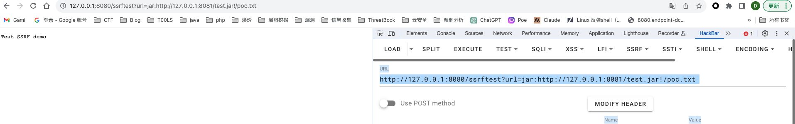

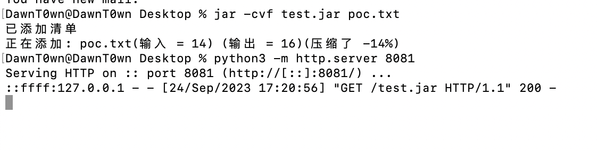

jar+file

```
url=jar:file:///Users/DawnT0wn/Desktop/test.jar!/poc.txt
```

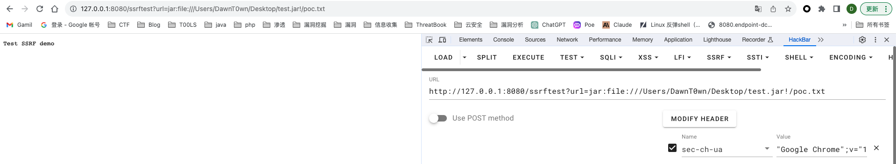

## SSRF文件读取

对于URL类，可以通过openConnection获取一个连接，也可以直接用openStream打开一个连接，并返回一个InputStream值

> 官方说明文档：
>
> ```none
> openConnection():返回一个实例，该实例表示与所引用的远程对象的连接。 返回类型： URLConnection
> openStream():打开与此连接，并返回一个值以从该连接读取。 			  返回类型：  InputStream 
> ```
>
> 详细说明：

> ```none
> openConnection:返回一个URLConnection对象，它表示到URL所引用的远程对象的连接。每次调用此URL的协议处理程序的openConnection方法都打开一个新的连接。如果URL的协议（例如，HTTP或JAR）存在属于以下包或其子包之一的公共、专用URLConnection子类：java.lang、java.io、java.util、java.net，返回的连接将为该子类的类型。例如，对于HTTP，将返回HttpURLConnection，对于JAR，将返回JarURLConnection。（返回到该URL的URLConnection！）
> 
> openStream():打开到此URL的连接并返回一个用于从该连接读入的InputStream。
> ```

当我用到openStream到时候

```
public void fileread(HttpServletRequest request, HttpServletResponse response)throws Exception{
    String url = request.getParameter("url");
    InputStream inputStream = new URL(url).openStream();
    OutputStream outputStream = response.getOutputStream();
    byte[] bytes = new byte[1024];
    int len;
    while ((len = inputStream.read(bytes)) > 0){
        outputStream.write(bytes, 0, len);
    }
}
```

仍然是可以通过ssrf，通过http获取到资源

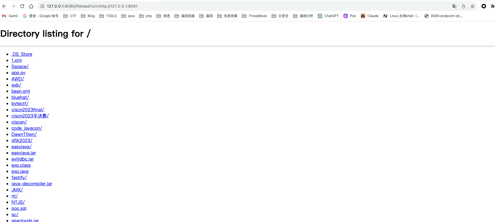

除此之外，通过文件操作函数读取文件也可以

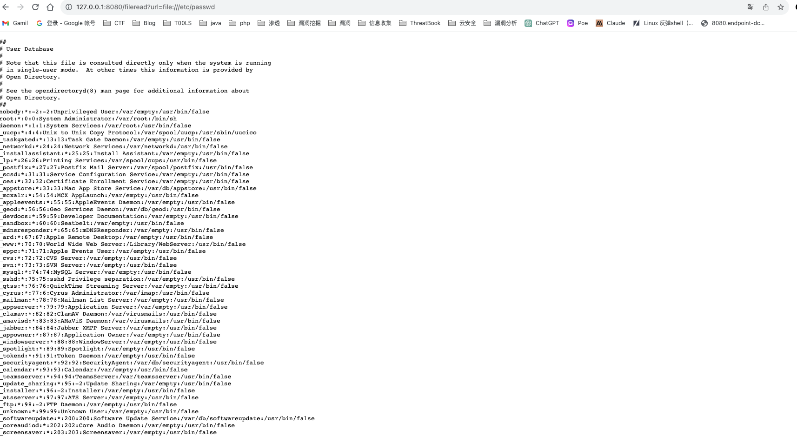

如果是windows的话，反斜杠需要url编码

## 文件下载

其实SSRF文件下载和文件读取是一样的，都可以通过URL类去读取，只是将相应头设置了一下

```
response.setHeader("content-disposition", "attachment;fileName=" + filename);
```

```
public void fileread(HttpServletRequest request, HttpServletResponse response)throws Exception{
    String filename = "test";
    String url = request.getParameter("url");
    InputStream inputStream = new URL(url).openStream();
    response.setHeader("content-disposition", "attachment;fileName=" + filename);
    OutputStream outputStream = response.getOutputStream();
    byte[] bytes = new byte[1024];
    int len;
    while ((len = inputStream.read(bytes)) > 0){
        outputStream.write(bytes, 0, len);
    }
}
```

将response的header设置为文件类型，最后就会被下载下来

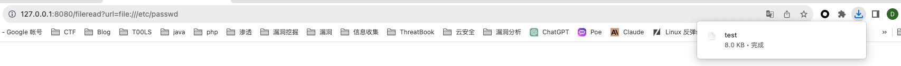

最后下载下来了文件

上面场景虽然都用到的是URL类，得到URLConnection对象，是因为这个对象可以支持`sun.net.www.protocol`所有协议

## ImageIO SSRF

ImageIO是JDK自带的操作图片的子类，其实也是用到了URL类

```
public void imageio(HttpServletRequest request, HttpServletResponse response) throws Exception{
    String geturl = request.getParameter("url");
    ServletOutputStream outputStream = response.getOutputStream();
    ByteArrayOutputStream os = new ByteArrayOutputStream();
    URL url = new URL(geturl);
    InputStream istream = url.openStream();
    ImageInputStream stream =  ImageIO.createImageInputStream(istream);  //获取文件流
    BufferedImage image = ImageIO.read(stream);

    ImageIO.write(image, "png", os);
    InputStream input = new ByteArrayInputStream(os.toByteArray());
    int len;
    byte[] bytes = new byte[1024];
    while ((len = input.read(bytes)) > 0) {
        outputStream.write(bytes, 0, len);
    }
}
```

本质上还是URL.openStream发起的请求，后续只是处理，而javax.imageio.ImageIO它的 read()方法，用来加载图片。它可以传入一个URL对象，且没有协议限制，但是只能读取图片


当读取文本文档的时候，却报错了

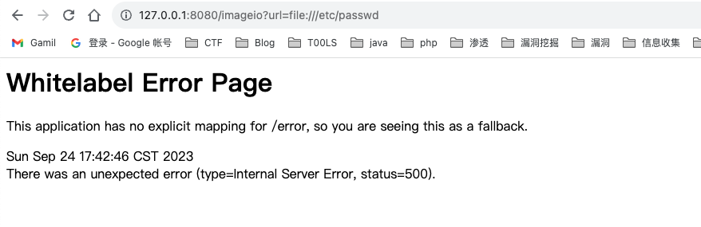

在spring中，看不到报错，在tomcat中可以看到，这里我直接在spring运行处的报错来看看区别了

当读取非图片的时候，是这样的报错

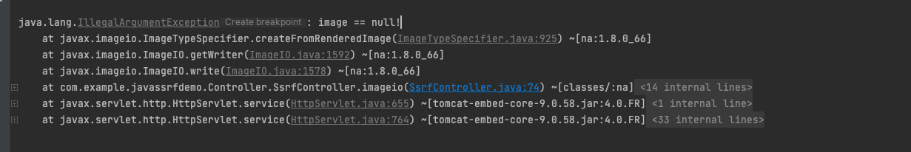

但当读取不存在的文件的时候，会报错文件不存在，这样可以探测是否存在文件，在tomcat的报错栈可以看到

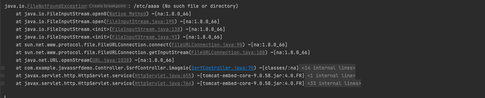

剩下的一些类就记录一下了，以下内容来源于https://www.cnblogs.com/CoLo/p/15236424.html

## HttpClient SSRF

org.apache.commons.httpclient.HttpClient

相关依赖

```xml
<dependency>
    <groupId>commons-httpclient</groupId>
    <artifactId>commons-httpclient</artifactId>
    <version>3.1</version>
</dependency>
<dependency>
    <groupId>org.apache.httpcomponents</groupId>
    <artifactId>httpclient</artifactId>
    <version>4.5.12</version>
</dependency>
```

```
 CloseableHttpClient httpClient = HttpClients.createDefault();
  HttpGet getRequest = new HttpGet(url);
  HttpResponse response = httpClient.execute(getRequest);
  if(response.getStatusLine().getStatusCode() == 200)
    {
        HttpEntity entity = response.getEntity();
        return EntityUtils.toByteArray(entity);
    }
  throw new IOException("Error:下载图片失败");
```

## OkHttp SSRF

okhttp是一个第三方类库，用于android中请求网络

```java
  String url = request.getParameter("url");
  OkHttpClient httpClient = new OkHttpClient();
  Request request = new Request.Builder()
        .url(url)
        .build();
  Response response = httpClient.newCall(request).execute();
  return response.body().string(); 
```

## HttpRequest SSRF

第三方的工具类

```java
HttpRequest request = HttpRequest.get("http://www.baidu.com",true,'q',"baseball gloves","size",100);
```

在su18师傅的文章中也提到了一些有关请求的类

重点关注一些HTTP请求操作函数：

```
om.alibaba.druid.util.HttpClientUtils
sun.net.www.http.HttpClient
javax.net.ssl.HttpsURLConnection
sun.net.www.protocol.http.HttpURLConnection
java.net.HttpURLConnection
javax.servlet.http.HttpServletRequest
java.net.URI
java.net.URL
java.net.URLConnection
com.bea.uddiexplorer.Search
com.squareup.okhttp.Request
com.squareup.okhttp3.Request
org.apache.commons.httpclient.HttpMethodBase
org.apache.http.client.methods.HttpRequestBase
```

除了建立HTTP协议连接，还可能直接通过 Socket建立连接，因此应该同样关注Socket相关类：

```
AsynchronousServerSocketChannel.accept/bind
AsynchronousSocketChannel.write/read/bind/connect
ServerSocketChannel.bind
ServerSocket.accept/bind
Socket.bind/connect
Socket.getInputStream().read
Socket.getOutputStream().write
SocketChannel.bind/read/write/connect
```

# 漏洞修复

## Java SSRF修复

在PHP中，我们还存在一些SSRF绕过的手法，比如说302跳转

```
<?php
$url = 'gopher://35.185.163.134:2333/_joy%0achou';
header("location: $url");
?>
```

直接用302重定向配合协议进行一个ssrf黑名单的绕过，这种方式主要是在对协议进行过滤后，访问资源文件，但是没有对302重定向发起的第二次访问进行过滤，导致了绕过

但是在Java中，不存在gopher这种协议，当用到这种方式的时候，会收到如下报错

```
java.net.MalformedURLException: unknown protocol: gopher
```

而关于报错的代码如下

```
private boolean followRedirect() throws IOException {
        if(!this.getInstanceFollowRedirects()) {
            return false;
        } else {
            final int var1 = this.getResponseCode();
            if(var1 >= 300 && var1 <= 307 && var1 != 306 && var1 != 304) {
                final String var2 = this.getHeaderField("Location");
                if(var2 == null) {
                    return false;
                } else {
                    URL var3;
                    try {
                        // 该行代码发生异常，var2变量值为`gopher://35.185.163.134:2333/_joy%0achou`
                        var3 = new URL(var2);
                        /* 该行代码，表示传入的协议必须和重定向的协议一致
                         * 即http://joychou.me/302.php的协议必须和gopher://35.185.163.134:2333/_joy%0achou一致
                         */
                        if(!this.url.getProtocol().equalsIgnoreCase(var3.getProtocol())) {
                            return false;
                        }
                    } catch (MalformedURLException var8) {
                        var3 = new URL(this.url, var2);
                    }
```

从followRedirect方法可以看到：

- 实际跳转的url也在限制的协议内
- 传入的url协议必须和重定向的url协议一致

因此，Java的SSRF一般的利用方式就是通过HTTP进行端口探测，或者file等文件操作函数读取文件

通过一般的触发点可以想到一定的修复方式

- 限制协议为HTTP、HTTPS协议。
- 禁止URL传入内网IP或者设置URL白名单。（可以用到IP段）
- 因为传入协议需要一致，因此不用限制302重定向。

在https://xz.aliyun.com/t/206/给了一个简单的修复示例，主要是限制协议，通过白名单过滤

```
public static Boolean securitySSRFUrlCheck(String url, String[] urlwhitelist) {
    try {
        URL u = new URL(url);
        // 只允许http和https的协议通过
        if (!u.getProtocol().startsWith("http") && !u.getProtocol().startsWith("https")) {
            return  false;
        }
        // 获取域名，并转为小写
        String host = u.getHost().toLowerCase();
        // 获取一级域名
        String rootDomain = InternetDomainName.from(host).topPrivateDomain().toString();

        for (String whiteurl: urlwhitelist){
            if (rootDomain.equals(whiteurl)) {
                return true;
            }
        }
        return false;

    } catch (Exception e) {
        return false;
    }
}
```

函数调用

```
String[] urlwhitelist = {"joychou.org", "joychou.me"};
if (!securitySSRFUrlCheck(url, urlwhitelist)) {
    return;
}
```

## 常用的SSRF修复方案

另外还可以提一下关于PHP等SSRF等修复在面试中容易被问到的内容

在很多时候我们都知道去检查请求用到的协议，限制内网IP等等，但是对于怎么样去检查IP是否为内网IP，已经内网IP很多怎么去进行过滤，如何获取真正请求的host，却是很多人没有去了解的

### 如何通过IP判断

首先毋庸置疑地是内网基本上会在某一些特定的IP段里面，我们可以通过IP段去判断，但是怎么判断IP段呢

也许会用正则去匹配IP段，但可能出现一些通过进制方式去绕过的手法，一些人可能还会先将IP规范化，用点来分割IP成不同的部分，根据取值来判断，但是也出现过用进制方法绕过的案例如`WordPress < 4.5 SSRF`。

在P牛的文章中，提到了一种解决方法，提到了将整个IP地址转换为一个整数，在PHP中调用ip2long函数即可转换，在Python使用inet_aton去转换。

IP地址是和2^32内的整数一一对应的，也就是说0.0.0.0 == 0，255.255.255.255 == 2^32 - 1。所以，我们判断一个IP是否在某个IP段内，只需将IP段的起始值、目标IP值全部转换为整数，然后比较大小即可。

所以去判断IP的话就可以在一个整数值里面去判断，而不是直接去对IP判断

特别是P牛还提到了IP地址掩码实际上就是`(32 - IP地址所代表的数字的末尾bit数)`，因为IPv4的长度是32位，减去IP地址所代表数字的末尾的bit数，比如说192.168.0.124/24，末尾的bit数是8，所以有24位，即255.255.255.0，因此，只需要确保IP地址与内网边界IP的前掩码位bit相同（即掩码相同），则在一个网段来判断，通过位运算来进行判断

例子：比如我要取127.0.0.0/8这个段，我只需要判断掩码位也就是前8位进行判断，采用位运算为

```
ip2long('127.0.0.0') >> 24
```

当执行 `ip2long('127.0.0.0') >> 24` 时

1. '127.0.0.0' 被转换为长整数：2130706432。这是IP地址 '127.0.0.0' 的长整数表示。
2. 对长整数 2130706432 进行右移 24 位：这将导致二进制表示中的前 8 位被保留，其余部分被丢弃。
   - 长整数 2130706432 的二进制表示：01111111000000000000000000000000
3. 右移 24 位后，保留的二进制部分是：01111111
4. 最后，将这个二进制数转换为十进制，得到 '127'。

所以，`ip2long('127.0.0.0') >> 24` 的结果是 '127'，这是 IP 地址 '127.0.0.0' 的前 8 位的值

所以我们可以通过这种方式去判断IP是否在一个内网IP段里面

### 如何获取真正的HOST

在SSRF的绕过手法中，我们可能会看到一些通过短域名，302，DNS-rebind等方法绕过的情况，所以在获取host的时候，我们应该考虑如下的几个问题

1. 如何正确的获取用户输入的URL的Host？
2. 只要Host只要不是内网IP即可吗？
3. 只要Host指向的IP不是内网IP即可吗？

第一个问题，看起来很简单，但实际上有很多网站在获取Host上犯过一些错误。最常见的就是，使用`http://233.233.233.233@10.0.0.1:8080/`、`http://10.0.0.1#233.233.233.233`这样的URL，让后端认为其Host是233.233.233.233，实际上请求的却是10.0.0.1。这种方法利用的是程序员对URL解析的错误，有很多程序员甚至会用正则去解析URL。

在Python 3下，正确获取一个URL的Host的方法：

```
from urllib.parse import urlparse

url = 'https://10.0.0.1/index.php'
urlparse(url).hostname
```

这是一个常见的绕过方式

对于第二个和第三个问题，主要就是解析流程的问题了，为了防止一些DNS-rebind和302跳转的情况，我们需要循环去执行一些判断逻辑

完美解决SSRF漏洞的过程如下：

1. 解析目标URL，获取其Host
2. 解析Host，获取Host指向的IP地址
3. 检查IP地址是否为内网IP
4. 请求URL
5. 如果有跳转，拿出跳转URL，执行1

当然对于一些302跳转还可以禁止跳转，不过一般的业务应该允许跳转的，所以应该每跳转一次，就检查一次新的Host是否是内网IP，直到抵达最后的网址

```
<?phps

function safe_request($url){
    $ch = CURL_INIT();
    CURL_SETOPT($ch, CURLOPT_HEADER, FALSE);
    CURL_SETOPT($ch, CURLOPT_RETURNTRANSFER, TRUE);
    CURL_SETOPT($ch, CURLOPT_SSL_VERIFYPEER, FALSE);
    while(true){
        // 0.判断URL合法性
        if (!$url || !filter_var($url, FILTER_VALIDATE_URL, FILTER_FLAG_PATH_REQUIRED & FILTER_FLAG_HOST_REQUIRED & FILTER_FLAG_QUERY_REQUIRED)){
            return false;
        }

        // 1.仅允许http或https协议
        if(!preg_match('/^https?:\/\/.*$/', $url)){
            return false;
        }

        // 2.解析目标URL，获取其host
        $host = parse_url($url, PHP_URL_HOST);
        if(!$host){
            return false;
        }

        // 3.解析host，获取host指向的IP地址
        $ip = gethostbyname($host);
        $ip = ip2long($ip);
        if($ip === false){
            return false;
        }

        // 4.检查IP地址是否为内网IP
        $is_inner_ipaddress = ip2long('127.0.0.0') >> 24 == $ip >> 24 or
            ip2long('10.0.0.0') >> 24 == $ip >> 24 or
            ip2long('172.16.0.0') >> 20 == $ip >> 20 or
            ip2long('192.168.0.0') >> 16 == $ip >> 16;
        if($is_inner_ipaddress){
            return false;
        }

        // 5.请求URL
        CURL_SETOPT($ch, CURLOPT_URL, $url);
        $res = CURL_EXEC($ch);
        $code = curl_getinfo($ch,CURLINFO_HTTP_CODE);

        // 6.如果有跳转，获取跳转URL执行1, 否则返回响应
        if (300<=$code and $code<400){
            $headers = curl_getinfo($ch);
            $url=$headers["redirect_url"];
        } else {
            CURL_CLOSE($ch) ;
            return $res;
        }
    }

}

    $url = $_GET['url'];
    // $url="http://localhost:8888/302.php";
    $res=safe_request($url);
    if($res)
        echo var_dump($res);
```

大概给出的流程就是如上，P牛给出的Python的实现逻辑

```
import socket
import re
import requests
from urllib.parse import urlparse
from socket import inet_aton
from struct import unpack
from requests.utils import requote_uri

def check_ssrf(url):
    hostname = urlparse(url).hostname

    def ip2long(ip_addr):
        return unpack("!L", inet_aton(ip_addr))[0]

    def is_inner_ipaddress(ip):
        ip = ip2long(ip)
        return ip2long('127.0.0.0') >> 24 == ip >> 24 or \
                ip2long('10.0.0.0') >> 24 == ip >> 24 or \
                ip2long('172.16.0.0') >> 20 == ip >> 20 or \
                ip2long('192.168.0.0') >> 16 == ip >> 16 \
                ip2long('0.0.0.0') >> 24 == ip >> 24

    try:
        if not re.match(r"^https?://.*/.*$", url):
            raise BaseException("url format error")
        ip_address = socket.getaddrinfo(hostname, 'http')[0][4][0]
        if is_inner_ipaddress(ip_address):
            raise BaseException("inner ip address attack")
        return True, "success"
    except BaseException as e:
        return False, str(e)
    except:
        return False, "unknow error"

def safe_request_url(url, **kwargs):
    def _request_check_location(r, *args, **kwargs):
        if not r.is_redirect:
            return
        url = r.headers['location']

        # The scheme should be lower case...
        parsed = urlparse(url)
        url = parsed.geturl()

        # Facilitate relative 'location' headers, as allowed by RFC 7231.
        # (e.g. '/path/to/resource' instead of 'http://domain.tld/path/to/resource')
        # Compliant with RFC3986, we percent encode the url.
        if not parsed.netloc:
            url = urljoin(r.url, requote_uri(url))
        else:
            url = requote_uri(url)

        succ, errstr = check_ssrf(url)
        if not succ:
            raise requests.exceptions.InvalidURL("SSRF Attack: %s" % (errstr, ))

    success, errstr = check_ssrf(url)
    if not success:
        raise requests.exceptions.InvalidURL("SSRF Attack: %s" % (errstr,))

    all_hooks = kwargs.get('hooks', dict())
    if 'response' in all_hooks:
        if hasattr(all_hooks['response'], '__call__'):
            r_hooks = [all_hooks['response']]
        else:
            r_hooks = all_hooks['response']

        r_hooks.append(_request_check_location)
    else:
        r_hooks = [_request_check_location]

    all_hooks['response'] = r_hooks
    kwargs['hooks'] = all_hooks
    return requests.get(url, **kwargs)
```


参考链接

https://www.cnblogs.com/CoLo/p/15236424.html

https://xz.aliyun.com/t/206/

https://www.cnblogs.com/nice0e3/p/13682434.html#ssrf%E4%B8%AD%E5%86%85%E7%BD%91%E6%8E%A2%E6%B5%8B

https://www.cnblogs.com/nice0e3/p/13683023.html

https://www.freebuf.com/articles/web/319825.html

https://www.leavesongs.com/PYTHON/defend-ssrf-vulnerable-in-python.html