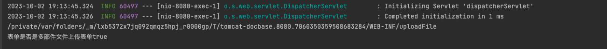
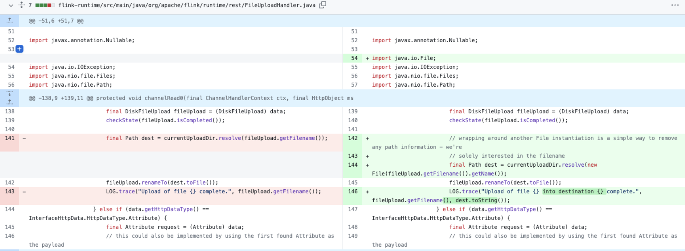
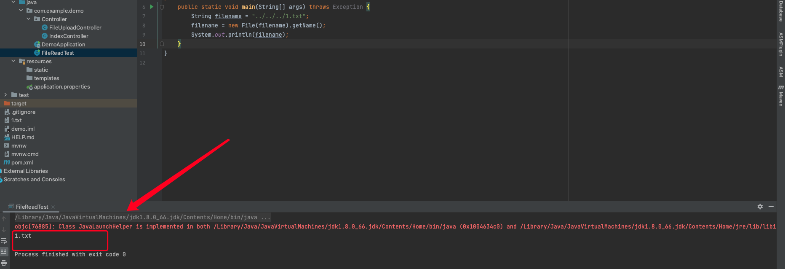

# 前言

这次来看看Java 文件上传漏洞相关代码，主要还是来关注一下哪里函数和类有可能造成文件上传漏洞，其实在Java的文件上传中，主要是来了解哪些库或者说类可以解析`multipart/form-data;` 这种表单请求，从中获取相应的值，并且通过怎么的路径拼接或者其他方式输出到文件中，将文件保存在服务端

# 00截断

在PHP中可以采用00截断来进行相应后缀名的绕过，需要PHP<5.3.29，且GPC关闭

在Java中仍然有文件上传进行绕过的问题，但是现在基本上不存在了，在JDK1.7.0_40（7u40）开始对\00进行了检查，相关代码如下

```java
final boolean isInvalid(){
    if(status == null){
        status=(this.path.indexOf('\u0000')<0)?PathStatus.CHECKED:PathStatus.INVALID;
    }
    return status == PathStatus.INVALID;
}
```

也就是说在后面的版本Java就不存在这个问题了

# Java文件上传

关注的类

```
FileUpload
FileUploadBase
FileItem
FileItemIteratorImpl
FileItemStreamImpl
FileUtils
UploadHandleServlet
FileLoadServlet
FileOutputStream
DiskFileItemFactory
MultipartRequestEntity
MultipartFile
com.oreilly.servlet.MultipartRequest
javax.servlet.http.Part
```

## Servlet Part

Servlet3.0提供了对文件上传的支持，通过`@MultipartConfig`标注和`HttpServletRequest`的两个新方法`getPart()`和`getParts()`

在一个请求中有多个表单部分的时候，每一个表单都会被转换为一个Part

可以通过HttpServletRequest的getPart方法来获取

```
HttpServletRequest接口定义了以下方法来获取Part：

Part getPart(String name)　　返回与指定名称相关的Part，名称为相关表单域的名称(name)

Colleciton getParts()　　返回这个请求中的所有Part
```

Part中的部分方法

```
String getName()　　获取这部分的名称，例如相关表单域的名称

String getContentType()　　如果Part是一个文件，那么将返回Part的内容类型，否则返回null（可以利用这一方法来识别是否为文件域）

Collection getHeaderNames()　　返回这个Part中所有标头的名称

String getHeader(String headerName)　　返回指定标头名称的值

void write(String path)　　将上传的文件写入服务器中项目的指定地址下，如果path是一个绝对路径，那么将写入指定的路径，如果path是一个相对路径，那么将被写入相对于location属性值的指定路径。

InputStream getInputStream()　　以inputstream的形式返回上传文件的内容
```

所以可以这样来实现一个文件上传

```
package com.example.demo.Controller;

import org.springframework.stereotype.Controller;
import org.springframework.web.bind.annotation.RequestMapping;
import org.springframework.web.bind.annotation.ResponseBody;

import javax.servlet.http.HttpServletRequest;
import javax.servlet.http.HttpServletResponse;
import javax.servlet.http.Part;
import java.io.File;

@Controller
public class FileUploadController {
    @RequestMapping("/partupload")
    @ResponseBody
    public void part(HttpServletRequest request, HttpServletResponse response) throws Exception{
        String savePath = request.getServletContext().getRealPath("/WEB-INF/uploadFile");
        //Servlet3.0将multipart/form-data的POST请求封装成Part，通过Part对上传的文件进行操作。
        Part part = request.getPart("file");//通过表单file控件(<input type="file" name="file">)的名字直接获取Part对象
        //Servlet3没有提供直接获取文件名的方法,需要从请求头中解析出来
        //获取请求头，请求头的格式：Content-Disposition: form-data; name="file"; filename="aaa.jsp"
//        String header = part.getHeader("content-disposition");
        String fileName = getFileName(part);
        //把文件写到指定路径
        part.write(savePath + File.separator + fileName);
    }

    private String getFileName(Part part) {
        // 获取文件名
        String header = part.getHeader("Content-Disposition");
        String fileName = header.substring(header.indexOf("filename=\"") + 10, header.lastIndexOf("\""));
        return fileName;
    }
}
```

请求如下

```
POST /partupload HTTP/1.1
Host: 127.0.0.1:8080
User-Agent: python-requests/2.31.0
Accept-Encoding: gzip, deflate, br
Accept: */*
Connection: keep-alive
Content-Length: 174
Content-Type: multipart/form-data; boundary=e4ba8383f713cbf914b47c39d4c05d5d

--e4ba8383f713cbf914b47c39d4c05d5d
Content-Disposition: form-data; name="file"; filename="aaa.jsp"
Content-Type: form-data

123456
--e4ba8383f713cbf914b47c39d4c05d5d--
```

最后在对应的目录下看到上传的文件


可想而知，当我们文件名如果是有目录穿越符的时候，就可以上传到任意目录下了


## FileUpload类

导入文件上传相关依赖

```
<dependency>
    <groupId>commons-io</groupId>
    <artifactId>commons-io</artifactId>
    <version>1.4</version>
</dependency>

<dependency>
    <groupId>commons-fileupload</groupId>
    <artifactId>commons-fileupload</artifactId>
    <version>1.2.1</version>
</dependency>
```

Commons-FileUpload是Apache的一个组件，依赖于Commons-io，也是目前用的比较广泛的一个文件上传组件之一

> FileUpload基本步骤
>
> 1. 创建磁盘工厂：DiskFileItemFactory factory = new DiskFileItemFactory();
> 2. 创建处理工具：ServletFileUpload upload = new ServletFileUpload(factory);
> 3. 设置上传文件大小：upload.setFileSizeMax(3145728);
> 4. 接收全部内容：List items = upload.parseRequest(request);

FileUpload核心类：

| 类名                | 介绍                                                         |
| ------------------- | ------------------------------------------------------------ |
| DiskFileItemFactory | 磁盘文件项工厂, 读取文件时相关的配置,比如: 缓存的大小 , 临时目录的位置 |
| ServletFileUplaod   | 文件上传的一个核心类                                         |
| FileItem            | 代表每一个表单项                                             |

FileItem类：

- isFormField()	判断是否是普通表单项
- getFieldName()	获得表单的name属性值
- getString()	获得表单的value值
- getName()	获得上传文件的名称
- getInputStream()	获得上传文件的输入流
- delete()	删除临时文件

上传代码如下：

```
public void Upload(HttpServletRequest request, HttpServletResponse response) throws Exception {
        String uploadDir = request.getServletContext().getRealPath("/WEB-INF/uploadFile");
        System.out.println(uploadDir);
        File uploadFile = new File(uploadDir);

        if (!uploadFile.exists() && !uploadFile.isDirectory()){
            uploadFile.mkdirs();
        }

        String message = "";

        DiskFileItemFactory factory = new DiskFileItemFactory();
        ServletFileUpload fileUpload = new ServletFileUpload(factory);
        fileUpload.setFileSizeMax(3145728);
        fileUpload.setHeaderEncoding("utf-8");

        boolean multipartContent = fileUpload.isMultipartContent(request);
        System.out.println("表单是否是多部件文件上传表单" + multipartContent);
        if (multipartContent){
            List<FileItem> list = fileUpload.parseRequest(request);
            if (null != list){
                for (FileItem item : list){
                    // 判断是普通表单项还是文件上传表单项
                    // isFormField方法用于判断FileItem类对象封装的数据是否属于一个普通表单字段，还是属于一个文件表单字段，如果是普通表单字段则返回true，否则返回false。
                    boolean formField = item.isFormField();
                    if (formField){
                        // 普通表单项，当enctype="multipart/form-data"时，request的getParameter方法无法获取参数
                        String fieldName = item.getFieldName(); // 获取表单文本框中name的值
                        String value = item.getString("utf-8"); // 获取utf-8编码后表单文本框内容
                        System.out.println(fieldName + "=" + value);
                    }else {
                        // 文件上传表单项
                        String fileName = item.getName(); // 获取文件名
                        InputStream is = item.getInputStream();
                        FileOutputStream fileOutputStream = new FileOutputStream(uploadDir + File.separator + fileName);
                        byte buffer[] = new byte[1024];
                        int length = 0;
                        //循环将输入流读入到缓冲区当中，(len=in.read(buffer))>0就表示in里面还有数据
                        while ((length = is.read(buffer)) > 0){
                            fileOutputStream.write(buffer, 0 ,length);
                        }
                        is.close();
                        fileOutputStream.close();
                        item.delete(); //删除处理文件上传时生成的临时文件
                    }
                }
            }
        }
    }
```

因为我用到的是Springboot，springboot已经自动配置了MultipartResolver ,导致文件上传请求已经被处理过了,所以解析文件列表为空

需要在启动类排除MultipartResolver

```
@SpringBootApplication(exclude = {MultipartAutoConfiguration.class})
```



除了这两个以外，FileUtils工具类也可以用来处理文件

## 防御 

检查后缀名，通过`.`截取文件后缀，然后判断，比较字符串时，全部转小写，或者用equalsIgnoreCase这种方式来判断，建议是使用白名单

```java
fileName.substring(fileName.lastIndexOf("."));
后缀直接限定死
String type = new File(item.getContentType()).getName();
if(type.equalsIgnoreCase("jpeg")||type.equalsIgnoreCase("pdf")||
  type.equalsIgnoreCase("jpg")||type.equalsIgnoreCase("png")
  ) {
		item.write( new File(filePath + File.separator + name + '.' + type));
		res.setStatus(201);
}
```

校验文件大小，通过以下代码获取文件大小判断

```java
fileItems.size()
```

限制大小

```
DiskFileItemFactory factory = new DiskFileItemFactory();
ServletFileUpload servletFileUpload = new ServletFileUpload(factory);
servletFileUpload.setSizeMax(1024 * 400);
```

基于注解的大小限制

```
@MultipartConfig(maxFileSize = 1000 * 1024 * 1024, maxRequestSize = 1000 * 1024 * 1024)
public class UploadServlet extends HttpServlet {}
```

对文件重命名

```
String filename = UUID.randomUUID().toString().replaceAll("-","")+".jpg";
```

对于使用Hutool的`FileTypeUtil`的`getType()`或`ImageIO.read()`通过读取文件流中前N个byte值来判断文件类型的，也可以使用类似图片马的方式进行绕过。

总结下来的修复方案如下

对上传文件后缀进行白名单验证，验证文件大小，强制重命名后缀，上传文件单独服务器保存

# 任意文件下载/读/删/遍历

关注函数

```
sun.nio.ch.FileChannelImpl
java.io.File.list/listFiles
java.io.FileInputStream
java.io.FileOutputStream
java.io.FileSystem/Win32FileSystem/WinNTFileSystem/UnixFileSystem
sun.nio.fs.UnixFileSystemProvider/WindowsFileSystemProvider
java.io.RandomAccessFile
sun.nio.fs.CopyFile
sun.nio.fs.UnixChannelFactory
sun.nio.fs.WindowsChannelFactory
java.nio.channels.AsynchronousFileChannel
FileUtil/IOUtil
filePath/download/deleteFile/move/getFile
```


## 文件读取

Java的文件读取主要是两种，一种基于InputStream，另外就是FileReader

```java
//InputStream
package com.example.demo;

import java.io.*;

public class FileReadTest {
    public static void main(String[] args) throws Exception {
        String filename = "1.txt";

        InputStream inputStream = new FileInputStream(filename);
        ByteArrayOutputStream byteArrayOutputStream = new ByteArrayOutputStream();

        int bytesRead;
        byte[] buffer = new byte[1024];
        while ((bytesRead = inputStream.read(buffer)) != -1) {
//            byteArrayOutputStream.write(buffer, 0, bytesRead); // 读到字节流里面
            String data = new String(buffer, 0, bytesRead, "UTF-8");
            System.out.print(data);
        }
    }
}

```

```java
//FileReader
package com.example.demo;

import java.io.*;

public class FileReadTest {
    public static void main(String[] args) throws Exception {
        String filename = "1.txt";
        FileReader fileReader = new FileReader(filename);
        BufferedReader bufferedReader = new BufferedReader(fileReader);
        String line = "";
        String fileconent = "";
        while ((line = bufferedReader.readLine()) != null){
            fileconent += (line + "\n");
        }
        System.out.println(fileconent);
    }
}

```

## 文件下载

这个其实和文件读取差不多，只是说将文件名通过传参的方式控制，然后将response对象设置了一下，其他基本一样

```
response.reset();
response.addHeader("Content-Disposition", "attachment;filename=" + new String(filename.getBytes("utf-8")));
response.addHeader("Content-Length", "" + file.length());
response.setContentType("application/octet-stream; charset=utf-8");
```

## 文件删除

用到的是`new File().delete()`

## 防御

这方面的漏洞主要在于对目录穿越符的修复，防止垮目录

```java
private boolean checkFilename(String filename) {
    filename = filename.replace("\\", "/"); //消除平台差异
  	//将文件操作限定在指定目录中
  	File file = new File(filename);
    if(file == null || !file.exists() || file.getCanonicalFile().getParent().equals(new File(DOWNLOAD_PATH).getCanonicalPath())) { //检测上级目录是否为指定目录
      return false;
    }
  	//检测文件名中是否有敏感字符
    List<String> blackList = Arrays.asList("./", "../");
    for(String badChar : blackList) {
      if(filename.contains(badChar)) {
        return false;
      }
    }
  	//对文件后缀名设置白名单
    List<String> whiteExt = Arrays.asList("png", "jpg", "gif", "jpeg", "doc");
    String fileExt = filename.substring(filename.lastIndexOf(".") + 1).toLowerCase();
    if(!whiteExt.contains(fileExt)) {
      return false;
    }
    return true;
}
```

su18师傅给出的修复方案

- 对要操作的文件名进行黑白名单限制。
- 对用户输入的数据进行过滤，过滤掉"./"、"…/"、"%"、"/"
- 针对不同的功能，将可操作文件路径限制在某个目录内，禁止攻击者通过 '../'的方式穿越路径，建议使用`getCanonicalPath()`标准化路径，之后再进行限制和判断。
- 使用 FilePermission 限制权限。

我在看一些补丁的时候，他们对于目录穿越符的过滤没有直接采用黑名单，而是用到了`new File().getName()`的方式多做了一层处理





# 文件写入

这点其实也算文件上传，他们很多是直接在POST请求中获取的内容，直接通过IO流写入到文件中，这种的话，对文件内容过滤会比较方便，另外对于文件名也可以采用黑白名单的方式去处理

```
private boolean checkFilecontent(String fileContent) {
    List<String> blackContents = Arrays.asList("<%@page", "<%!");
    for(String blackContent : blackContents) {
      if(fileContent.contains(blackContent)) {
        return false;
      }
    }
    return true;
}
```

另外在写入的时候，最好对表情进行htmlencode

```
String fileContent = request.getParameter("content");
fileContent = ESAPI.encoder().encodeForHTML(fileContent);
```


参考链接：

https://www.cnblogs.com/Nbge/p/5249880.html

https://www.cnblogs.com/CoLo/p/15225367.html

https://blog.csdn.net/weixin_44792004/article/details/105411782

https://blog.csdn.net/weixin_48893653/article/details/120290309

https://su18.org/post/code-audit/#centerfont-colorblue-7-%E6%96%87%E4%BB%B6%E4%B8%8A%E4%BC%A0fontcenter

https://github.com/proudwind/javasec_study/blob/master/java%E4%BB%A3%E7%A0%81%E5%AE%A1%E8%AE%A1-%E6%96%87%E4%BB%B6%E6%93%8D%E4%BD%9C.md