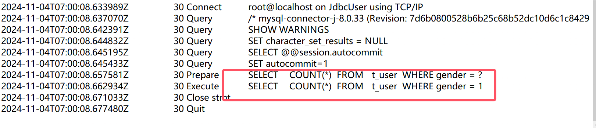
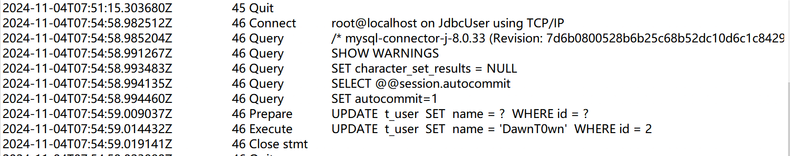

# 前言

了解过一些Java进行SQL查询的代码，利用原生的Jdbc连接查询，利用mybatis框架查询，但是对于从事安全行业的人来说，主要还是需要了解其中的风险——SQL注入，在原始的Jdbc查询中，可以用PreparedStatement创建预编译对象（连接字符串需要设置useServerPrepStmts=true），以及mybatis框架的占位符需要`#{}`才能进行预编译，这次来了解一个Spring中进行SQL操作的JdbcTemplate类，以及如何开启预编译查询来防止SQL注入

# 环境搭建

```xml
<dependency>
    <groupId>org.springframework.boot</groupId>
    <artifactId>spring-boot-starter-jdbc</artifactId>
</dependency>
<dependency>
    <groupId>mysql</groupId>
    <artifactId>mysql-connector-java</artifactId>
    <version>8.0.33</version> <!-- 使用最新版本 -->
</dependency>
```

创建数据表

```sql
CREATE TABLE `t_user` (
  `id` bigint(20) NOT NULL AUTO_INCREMENT,
  `name` varchar(100) NOT NULL,
  `gender` int(3) NOT NULL,
  `phone` varchar(50) NOT NULL,
  `note` text,
  `status` tinyint(4) NOT NULL,
  `created_ts` datetime NOT NULL,
  `last_modified_ts` datetime DEFAULT NULL,
  `creator` bigint(20) NOT NULL,
  `editor` bigint(20) DEFAULT NULL,
  PRIMARY KEY (`id`)
) ENGINE=InnoDB AUTO_INCREMENT=16 DEFAULT CHARSET=utf8mb4;
 
 
INSERT INTO t_user VALUES(1, '张三', 2, '17565485695', '学生', 1, '2018-12-12 00:00:00.000', NULL, 1001, NULL);
INSERT INTO t_user VALUES(2, '李四', 1, '13654865859', '上班族', 1, '2018-12-12 00:00:00.000', NULL, 1001, NULL);
INSERT INTO t_user VALUES(3, '王五', 1, '13546652858', '班长', 1, '2018-12-12 00:00:00.000', NULL, 1001, NULL);
INSERT INTO t_user VALUES(4, '赵六', 2, '15856548565', NULL, 1, '2018-12-12 00:00:00.000', NULL, 1001, NULL);
INSERT INTO t_user VALUES(5, 'Tom', 1, '19846515616', 'student', 1, '2018-12-12 00:00:00.000', NULL, 1001, NULL);
INSERT INTO t_user VALUES(6, 'R', 1, '13654585654', 'Super', 1, '2018-12-12 00:00:00.000', NULL, 1001, NULL);
```


为了看到预处理执行的语句，开启日志记录

```
set global general_log='on';
set global general_log_file='query.log';
```

# JdbcTemplate

JdbcTemplate主要提供以下五类方法：

- execute方法：可以用于执行任何SQL语句，一般用于执行DDL语句；
- update方法及batchUpdate方法：update方法用于执行新增、修改、删除等语句；batchUpdate方法用于执行批处理相关语句；
- query方法及queryForXXX方法：用于执行查询相关语句；
- call方法：用于执行存储过程、函数相关语句。

这次主要是学习预编译相关的查询语法，也就是queryForObject相关的

## 初始化连接

```
public JdbcTemplate initJdbcTemplate() {
    DriverManagerDataSource dataSource = new DriverManagerDataSource();;
    dataSource.setDriverClassName("com.mysql.jdbc.Driver");
    dataSource.setUrl("jdbc:mysql://127.0.0.1:33060/JdbcUser");
    dataSource.setUsername("root");
    dataSource.setPassword("root");
    return new JdbcTemplate(dataSource);
}
```

## 查询基本数据类型

此类查询只存在一个返回值

```
package com.DawnT0wn.JdbcTest;

import org.springframework.jdbc.core.JdbcTemplate;
import org.springframework.jdbc.datasource.DriverManagerDataSource;

public class JdbcPrepareTest {
    public static void main(String[] args) {
        Integer count = new JdbcPrepareTest().countUsers(1);
        System.out.println(count);
    }

    public JdbcTemplate initJdbcTemplate() {
        DriverManagerDataSource dataSource = new DriverManagerDataSource();;
        dataSource.setDriverClassName("com.mysql.cj.jdbc.Driver");
        dataSource.setUrl("jdbc:mysql://127.0.0.1:33060/JdbcUser");
        dataSource.setUsername("root");
        dataSource.setPassword("root");
        return new JdbcTemplate(dataSource);
    }

    public Integer countUsers(Integer gender) {
        StringBuilder sql = new StringBuilder();
        sql.append(" SELECT ")
                .append(" 	COUNT(*) ")
                .append(" FROM ")
                .append(" 	t_user ")
                .append(" WHERE gender = " + (gender == null ? 1 : gender));

        JdbcTemplate jdbcTemplate = initJdbcTemplate();
        return jdbcTemplate.queryForObject(sql.toString(), Integer.class);
    }
}

```


第二个参数是参数对应的类型


### 预编译查询

此时并没有进行预编译，采用占位符的方式，因为需要传入gender，需要用到重写方法

```
public <T> T queryForObject(String sql, @Nullable Object[] args, Class<T> requiredType)
```

第一个参数是sql语句，第二个事参数值的Object数组，第三个是查询值的class对象类型

```
public Integer countUsers(Integer gender) {
    StringBuilder sql = new StringBuilder();
    sql.append(" SELECT ")
            .append("   COUNT(*) ")
            .append(" FROM ")
            .append("   t_user ")
            .append(" WHERE gender = ?");

    JdbcTemplate jdbcTemplate = initJdbcTemplate();
    return jdbcTemplate.queryForObject(sql.toString(), new Object[]{gender}, Integer.class);
}
```


还是没有预编译，这是因为必须要在JDBC连接的URL设置`useServerPrepStmts=true`

```
dataSource.setUrl("jdbc:mysql://127.0.0.1:33060/JdbcUser?useServerPrepStmts=true");
```




发现预编译成功了，所以要使用预编译和预编译缓存的话还是需要在连接字符串中加入`useServerPrepStmts`参数和`cachePrepStmts`参数`useServerPrepStmts=true&cachePrepStmts=true`

## 查询列表

加入要通过gender查询name，返回时多个值，可以用queryForList来进行查询

```
public List<String> listName_by_gender(Integer gender) {
    JdbcTemplate jdbcTemplate = initJdbcTemplate();
    StringBuilder sql = new StringBuilder();
    sql.append(" SELECT ")
            .append(" name ")
            .append(" FROM ")
            .append(" t_user ")
            .append(" WHERE gender = " + gender);
    try {
        return jdbcTemplate.queryForList(sql.toString(), String.class);
    } catch (Exception e) {
        return null;
    }
}
```


当然也可以使用另外的重写方法返回Map<String, Object>数组


查询所有也可以利用这个方法


### 预编译查询

同理，使用占位符对语句进行修改


为了返回`List<String>`类型，选择这个方法，查询name

```
public <T> List<T> queryForList(String sql, @Nullable Object[] args, Class<T> elementType)
```

```
public List<String> listName_by_gender(Integer gender) {
    JdbcTemplate jdbcTemplate = initJdbcTemplate();
    StringBuilder sql = new StringBuilder();
    sql.append(" SELECT ")
            .append(" name ")
            .append(" FROM ")
            .append(" t_user ")
            .append(" WHERE gender = ?");
    try {
        return jdbcTemplate.queryForList(sql.toString(), new Object[]{gender}, String.class);
    } catch (Exception e) {
        return null;
    }
}
```


如果要查询全部的值，可以返回Map<String, Object>，这样就可以不用处理返回对象的类型了

```
public List<Map<String, Object>> listName_by_gender(Integer gender) {
    JdbcTemplate jdbcTemplate = initJdbcTemplate();
    StringBuilder sql = new StringBuilder();
    sql.append(" SELECT ")
            .append(" * ")
            .append(" FROM ")
            .append(" t_user ")
            .append(" WHERE gender = ?");
    try {
        return jdbcTemplate.queryForList(sql.toString(), new Object[]{gender});
    } catch (Exception e) {
        return null;
    }
}
```


## 查询对象

查询列表和查询对象实际上是差不多的，在JdbcTemplate中，ResultSet的处理是通过RowMapper完成的，当调用jdbcTemplate的queryxxx方法时，JdbcTemplate会自动处理ResultSet的创建和关闭，但自己需要实现RowMapper接口来定义如何将每一行数据映射到对象中，这样可以更方便地将查询的值映射到对象的变量中去

### 查询单个对象

定义UserEntity对象，实现RowMapper接口

```java
package com.DawnT0wn.JdbcTest.dao;

import org.springframework.jdbc.core.RowMapper;

import java.sql.ResultSet;
import java.sql.SQLException;

public class UserEntity implements RowMapper {
    public Long id;
    public String name;
    public Integer gender;
    public String phone;
    public String note;

    public Long getId() {
        return id;
    }

    public void setId(Long id) {
        this.id = id;
    }

    public String getName() {
        return name;
    }

    public void setName(String name) {
        this.name = name;
    }

    public Integer getGender() {
        return gender;
    }

    public void setGender(Integer gender) {
        this.gender = gender;
    }

    public String getPhone() {
        return phone;
    }

    public void setPhone(String phone) {
        this.phone = phone;
    }

    public String getNote() {
        return note;
    }

    public void setNote(String note) {
        this.note = note;
    }

    @Override
    public Object mapRow(ResultSet rs, int rowNum) throws SQLException {
        UserEntity userEntity = new UserEntity();
        userEntity.setId(rs.getLong("id"));
        userEntity.setName(rs.getString("name"));
        userEntity.setGender(rs.getInt("gender"));
        userEntity.setPhone(rs.getString("phone"));
        userEntity.setNote(rs.getString("note"));
        return userEntity;
    }
}

```

实现的 `RowMapper` 接口的 `mapRow` 方法接收两个参数：`ResultSet rs`（当前行的结果集）和 `int rowNum`（当前行的索引）。在这个方法中，你可以从 `ResultSet` 中提取数据并构建你的对象。

使用如下方法（这种带参数传递的只要开启了预编译配置就可以预编译了）

```
 public <T> T queryForObject(String sql, @Nullable Object[] args, RowMapper<T> rowMapper)
```

```
public static void main(String[] args) {
        UserEntity user = new JdbcPrepareTest().query_one_object(1);
        System.out.println(user.getName());
    }

public UserEntity query_one_object(Integer id) {
    JdbcTemplate jdbcTemplate = initJdbcTemplate();
    StringBuilder sql = new StringBuilder();
    sql.append(" SELECT ")
            .append(" * ")
            .append(" FROM ")
            .append(" t_user ")
            .append(" WHERE id = ?");

    return (UserEntity) jdbcTemplate.queryForObject(sql.toString(), new Object[]{id}, new UserEntity());
}
```


### 查询多个对象

queryForObject没有提供列表返回的，queryForList没有提供RowMapper接口的查询，使用这里用query实现

```
public <T> List<T> query(String sql, RowMapper<T> rowMapper) throws DataAccessException {
		return result(query(sql, new RowMapperResultSetExtractor<>(rowMapper)));
	}
```

```
public static void main(String[] args) {
        List<UserEntity> lists = new JdbcPrepareTest().all_object();
        for (UserEntity userEntity : lists) {
            System.out.println(userEntity.getName());
        }
    }
    
public List<UserEntity> all_object() {
        JdbcTemplate jdbcTemplate = initJdbcTemplate();
        StringBuilder sql = new StringBuilder();
        sql.append(" SELECT ")
                .append(" * ")
                .append(" FROM ")
                .append(" t_user ");

        return jdbcTemplate.query(sql.toString(), new UserEntity());
    }
```


加入占位符

```
public List<UserEntity> all_object() {
        JdbcTemplate jdbcTemplate = initJdbcTemplate();
        StringBuilder sql = new StringBuilder();
        sql.append(" SELECT ")
                .append(" * ")
                .append(" FROM ")
                .append(" t_user ")
                .append(" limit ?,?");

        return jdbcTemplate.query(sql.toString(), new Object[]{1, 2}, new UserEntity());
    }
```


#### BeanPropertyRowMapper

```
public List<UserEntity> find_all(){
    JdbcTemplate jdbcTemplate = initJdbcTemplate();
    StringBuilder sql = new StringBuilder();
    sql.append(" SELECT ")
            .append(" * ")
            .append(" FROM ")
            .append(" t_user ");

    return jdbcTemplate.query(sql.toString(), new BeanPropertyRowMapper(UserEntity.class));
}
```

使用BeanPropertyRowMapper可以不需要在UserEntity定义RowMapper接口，`BeanPropertyRowMapper` 会根据数据库查询结果的列名自动将其映射到 `UserEntity` 类的属性


## update方法


在JdbcTemplate中也定义了update的预编译方法



成功预编译执行了update语句，当然其他语句也一样

## Like模糊查询预编译

```
String sql = "select * from tb_user where username like '%?%'" ;
```

这种写法无法将参数绑定到`?`位置，这是因为 `?` 的位置在两个引号中，此时程序会把这个 `?` 当作字符串处理，程序会报错

然后有些开发就想到拼接语句

```
String sql = "select * from tb_user where username like '%" + var + "%'" ;
```

但是这里由于用的是字符串拼接的 `sql` 语句，因此还是可以注入

如果既想使用预编译，又想使用 `like` 模糊查询，正确的写法应该如下

```
String sql = "select * from tb_user where username like concat('%', ?, '%')" ;
```

示例

```
public void find_by_like_name(){
    String like_name = "awn";
    String sql = "select * from t_user where name like concat('%', ?, '%')" ;
    JdbcTemplate jdbcTemplate = initJdbcTemplate();
    List<UserEntity> list = jdbcTemplate.query(sql, new Object[]{like_name}, new BeanPropertyRowMapper<>(UserEntity.class));
    for (UserEntity userEntity: list) {
        System.out.println(userEntity.getName());
    }
}
```


无法使用参数化查询的地方：order by，in，limit，group by，offset

## IN后的预编译

IN后面跟的数组的参数个数不同，需要动态生成占位符，而不是用一个占位符传入数组参数

```
public void find_by_in_name() {
    JdbcTemplate jdbcTemplate = initJdbcTemplate();
    List<String> names = Arrays.asList("DawnT0wn", "R");

    // 动态生成占位符
    String placeholders = String.join(",", Collections.nCopies(names.size(), "?"));
    String sql = "SELECT * FROM t_user WHERE name IN (" + placeholders + ")";

    // 使用预编译的 SQL 和参数
    List<UserEntity> list = jdbcTemplate.query(sql, names.toArray(), new BeanPropertyRowMapper<>(UserEntity.class));

    for (UserEntity userEntity : list) {
        System.out.println(userEntity.getName());
    }
}
```


## 不能预编译的

### Group by&Order by

⽤户参数需要⽤到表名、字段名或涉及到order by、group by、limit操作时，参数化查询会使表名、字段名失去原有的意义

实际情况如果真的要 `order by` 后面接动态参数，这里大概率也会被写成拼接，从而造成 `sql` 注入。解决方式只能是对这里对传入的动态参数加内容过滤

```
private static final Set<String> ALLOWED_SORT_COLUMNS = Collections.unmodifiableSet(
        new HashSet<String>() {{
            add("name");
            add("age");
            add("date_created");
        }}
    );

public String buildSafeQuery(String sortBy, String order) {
    // 校验排序列是否在白名单中
    if (!ALLOWED_SORT_COLUMNS.contains(sortBy)) {
        throw new IllegalArgumentException("Invalid sort column");
    }

    // 校验排序顺序
    String sortOrder = "ASC".equalsIgnoreCase(order) ? "ASC" : "DESC";

    // 安全地构建 SQL 查询
    String sql = "SELECT * FROM users ORDER BY " + sortBy + " " + sortOrder;
    return sql;
}
```

group by一样的方式

### Limit&Offset

限制参数为Integer

# 写在最后

通过观察一些函数方法，可以看到JdbcTemplate类相当于来原生的Jdbc中包装了一次，简化了查询语句，操作语句也不再需要手动commit，甚至将ResultSet相关操作通过回调函数实现，只需要在重写的mapRow方法中定义逻辑即可，通过参数传递来实现预编译，但是前提仍然是要在jdbc连接字符串中开启预编译设置，对于每个方法多去观察参数类型，接受的参数就慢慢明白了这个类的用途

对于安全的设置仍然是观察连接字符串以及sql语句是否采用了占位符进行参数传递