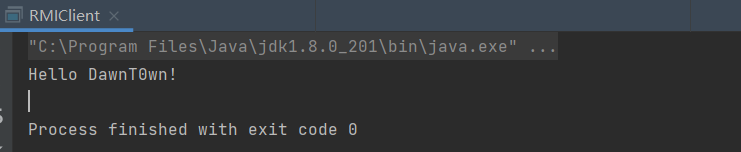

# RMI定义：

RMI全称 **远程方法调用(Remote Method Invocation)**，它支持存储于不同地址空间的程序级对象之间彼此进行通信，实现远程对象之间的无缝远程调用。
**Java RMI：** 用于不同虚拟机之间的通信，这些虚拟机可以在不同的主机上、也可以在同一个主机上；一个虚拟机中的对象调用另一个虚拟机上中的对象的方法，只不过是允许被远程调用的对象要通过一些标志加以标识。

**组成部分**：

RMI由三部分组成：

- `RMI Registry`：JDK提供的一个可独立运行的程序（bin目录下）；
- `RMI Server`：服务端程序，对外提供远程对象，代码在这里执行，将执行结果返回给客户端；
- `RMI Client`：客户端程序，想要调用远程对象的方法。

# 示例

## 1.定义远程接口

在Java中，只要一个类extends了java.rmi.Remote接口，即可成为存在于服务器端的远程对象

所以我们先定义一个远程接口,继承Remote接口,表明它可以远程调用,定义一个sayhello方法供远程调用

这个方法必须抛出`java.rmi.RemoteException`异常

```
package cn.DawnT0wn.RMI;

import java.rmi.Remote;
import java.rmi.RemoteException;

public interface ServiceInterface extends Remote {
    public String sayHello(String name) throws RemoteException;
}
```

在Java中，`Remote`接口用于标识其方法可从非本地虚拟机调用的接口。任何远程对象都必须直接或间接实现此接口。只有在“远程接口”中指定的那些方法是远程可用的

## 2.定义远程接口实现类

上面只是定义了一个远程接口和一个方法,我们要再去定义一个它的实现类

远程对象必须实现java.rmi.server.UniCastRemoteObject类

这个实现必须有一个显式的构造函数，并且要抛出一个RemoteException异常

```
package cn.DawnT0wn.RMI;

import java.rmi.RemoteException;
import java.rmi.server.UnicastRemoteObject;

public class ServiceInterfaceImpl extends UnicastRemoteObject implements ServiceInterface {

    protected ServiceInterfaceImpl() throws RemoteException {
        super();
    }
    
    public String sayHello(String name) throws RemoteException{
        return "Hello " + name +"!";
    }
}
```

远程对象必须实现`java.rmi.server.UniCastRemoteObject`类，这样才能保证客户端访问获得远程对象时，该远程对象将会把自身的一个拷贝以Socket的形式传输给客户端，此时客户端所获得的这个拷贝称为“存根”，而服务器端本身已存在的远程对象则称之为“骨架”。其实此时的存根是客户端的一个代理，用于与服务器端的通信，而骨架也可认为是服务器端的一个代理，用于接收客户端的请求之后调用远程方法来响应客户端的请求

## 3.定义服务端

注册远程对象，向客户端提供远程对象服务

远程对象是在远程服务上创建的，无法准确的知道远程服务器上的对象的名称，不过将远程对象注册到`RMI Registry`之后，客户端就可以通过`RMI Registry`请求到该远程服务对象的stub了，利用stub代理就可以访问远程服务对象了


## 4.定义客户端

客户端向服务端请求远程对象服务

从`RMI Registry`中请求stub，如果`RMI Registry`在本地机器上，url就是`rmi://localhost:port/绑定名`，如果在远程机器上url就是`rmi://RMI Service_IP:port/绑定名`

```
package cn.DawnT0wn.RMI;

import java.rmi.Naming;

public class RMIClient {
    public static void main(String[] args) throws Exception {
        //从远程获取名为Hello的远程接口实现类
        ServiceInterface rc = (ServiceInterface)Naming.lookup("rmi://127.0.0.1:5001/Hello");
        //调用它的sayHello方法并传值
        String say = rc.sayHello("DawnT0wn");
        System.out.println(say);
    }
}
```

## 5.远程方法调用

首先启动`RMIService`，对指定端口进行监听；

然后`RMIService`将自己提供的服务的实现类注册到`RMIRegistry`上，并指定一个访问路径；

最后启动`RMIClient`，客户端通过本地接口和事先约定好的路径到`RMIRegistry`上去拿到实现类，所有的方法都在接口里，便可以任意调用远程对象的方法了。

简单的来说就是先运行`RMIService`开启服务,再运行`RMIClient`去调用远程方法



参考链接

http://1.15.187.227/index.php/archives/497/

https://blog.csdn.net/xinghun_4/article/details/45787549