# 环境搭建

https://github.com/veracode-research/spring-view-manipulation/

核心代码如下

```
@GetMapping("/path")
public String path(@RequestParam String lang) {
    return "user/" + lang + "/welcome"; //template path is tainted
}
```

所有的在项目已经配置好了，只需要起spring就行了

# Thymeleaf语法

## 环境搭建

创建一个新的springboot

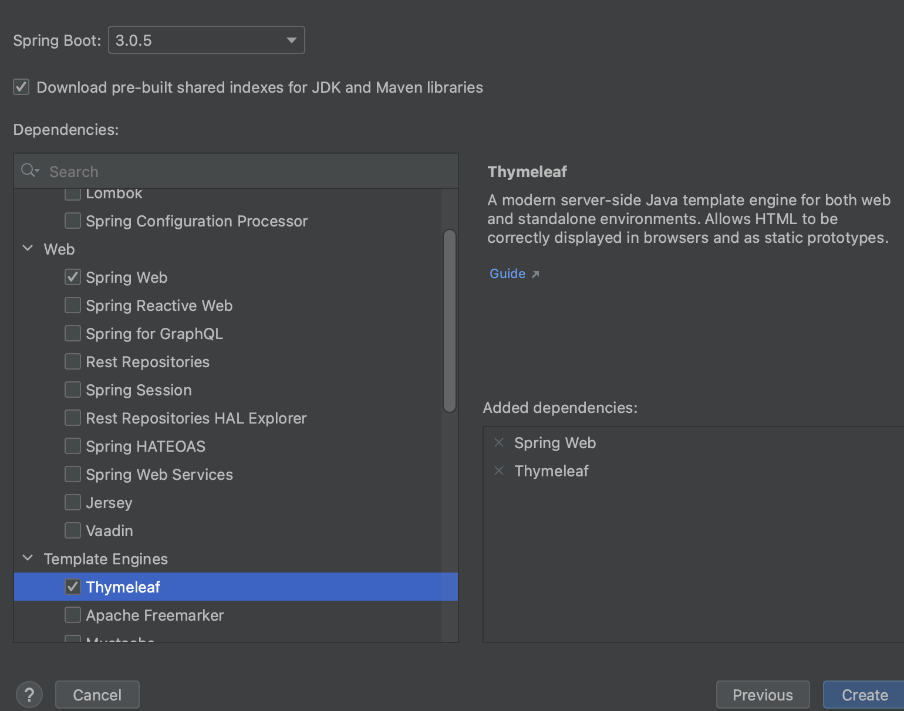

创建好的目录结构如下

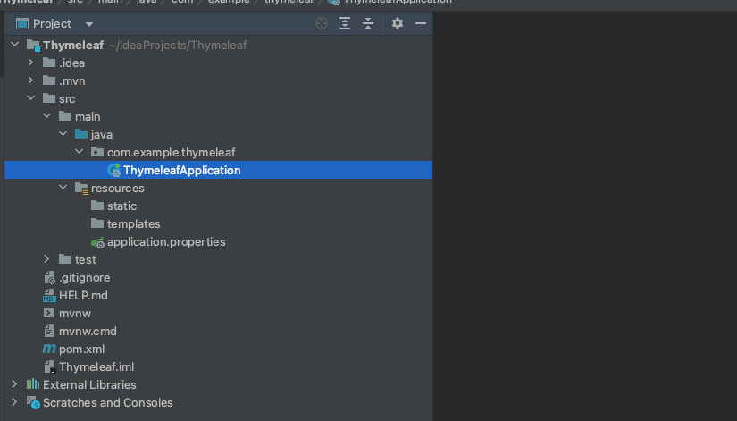

```
package com.example.thymeleaf;

import org.springframework.stereotype.Controller;
import org.springframework.ui.Model;
import org.springframework.web.bind.annotation.GetMapping;

@Controller
public class urlController {
    @GetMapping("/index")//页面的url地址
    public String getindex(Model model)//对应函数
    {
        model.addAttribute("name","bigsai");
        return "hhh";//与templates中hhh.html对应
    }
}
```

创建hhh.html

```
<!DOCTYPE html>
<html  xmlns:th="http://www.thymeleaf.org">
<head>
  <meta charset="UTF-8">
  <title>title</title>
</head>
<body>
hello DawnT0wn
<div th:text="${name}"></div>
</body>
</html>
```

## 语法

`Thymeleaf`是众多模板引擎的一种和其他的模板引擎相比，它有如下优势：

- Thymeleaf使用html通过一些特定标签语法代表其含义，但并未破坏html结构，即使无网络、不通过后端渲染也能在浏览器成功打开，大大方便界面的测试和修改。
- Thymeleaf提供标准和Spring标准两种方言，可以直接套用模板实现JSTL、 OGNL表达式效果，避免每天套模板、改JSTL、改标签的困扰。同时开发人员也可以扩展和创建自定义的方言。
- Springboot官方大力推荐和支持，Springboot官方做了很多默认配置，开发者只需编写对应html即可，大大减轻了上手难度和配置复杂度

在`Thymeleaf`的`html`中首先要加上下面的标识。

```
<html xmlns:th="http://www.thymeleaf.org">
```

`Thymeleaf`提供了一些内置标签，通过标签来实现特定的功能。

| 标签      | 作用               | 示例                                                         |
| --------- | ------------------ | ------------------------------------------------------------ |
| th:id     | 替换id             | `<input th:id="${user.id}"/>`                                |
| th:text   | 文本替换           | `<p text:="${user.name}">bigsai</p>`                         |
| th:utext  | 支持html的文本替换 | `<p utext:="${htmlcontent}">content</p>`                     |
| th:object | 替换对象           | `<div th:object="${user}"></div>`                            |
| th:value  | 替换值             | `<input th:value="${user.name}" >`                           |
| th:each   | 迭代               | `<tr th:each="student:${user}" >`                            |
| th:href   | 替换超链接         | `<a th:href="@{index.html}">超链接</a>`                      |
| th:src    | 替换资源           | `<script type="text/javascript" th:src="@{index.js}"></script`> |

其实相对于html，就是多了一个`th:`，这东西是在html最开始定义的标识

### 变量表达式

通过`${…}`在model中取值，如果在`Model`中存储字符串，则可以通过`${对象名}`直接取值

示例代码：

```
package com.example.thymeleaf;

import org.springframework.stereotype.Controller;
import org.springframework.ui.Model;
import org.springframework.web.bind.annotation.GetMapping;

@Controller
public class urlController {
    @GetMapping("/index")//页面的url地址
    public String getindex(Model model)//对应函数
    {
        model.addAttribute("name","DawnT0wn");
        return "hhh";//与templates中index.html对应
    }
}
```

hhh.html

```
<!DOCTYPE html>
<html  xmlns:th="http://www.thymeleaf.org">
<head>
  <meta charset="UTF-8">
  <title>title</title>
</head>
<body>
WelCome to Thymeleaf Test
<div th:text="'My name is: ' + ${name}"></div>
</body>
</html>
```

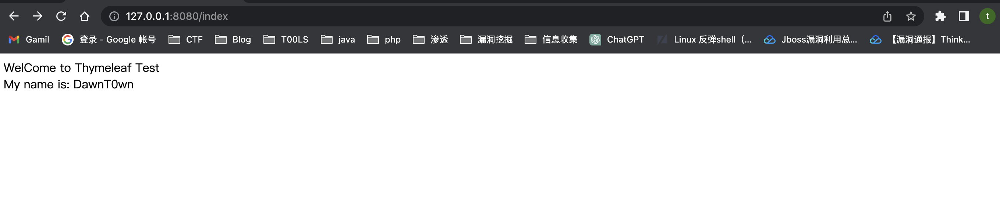

如果需要在javabean中取值，则需要将javabean的对象存储在model中，通过`${对象名.属性}`这种方式来取值，当然，也可以通过`${对象名['对象属性']}`这种方法，如果javabean中实现了getter方法，还可以通过getter方法取值`${对象.get方法名}`

```
package com.example.thymeleaf;

public class User {
    public String name;
    public int age;

    public User(String name, int age) {
        this.name = name;
        this.age = age;
    }

    public String getName() {
        return name;
    }

    public void setName(String name) {
        this.name = name;
    }

    public int getAge() {
        return age;
    }

    public void setAge(int age) {
        this.age = age;
    }
}
```

urlController.java

```
package com.example.thymeleaf;

import org.springframework.stereotype.Controller;
import org.springframework.ui.Model;
import org.springframework.web.bind.annotation.GetMapping;

@Controller
public class urlController {
    @GetMapping("/index")//页面的url地址
    public String getindex(Model model)//对应函数
    {
        User user = new User("DawnT0wn",20);
        model.addAttribute("user",user);
        return "hhh";//与templates中index.html对应
    }
}
```

hhh.html

```
<!DOCTYPE html>
<html xmlns:th="http://www.thymeleaf.org" xmlns="http://www.w3.org/1999/html">
<head>
    <meta charset="UTF-8">
    <title>title</title>
</head>
<body>
<h1>WelCome to Thymeleaf Test</h1>
<div th:text="'My name is: ' + ${user.name}"></div>
<td th:text="'My age is: ' + ${user['age']}"></td>
</br>
<td th:text="'Name is: ' + ${user.getName()}"></td>
</br>
<td th:text="'Object is: ' +${user}"></td>
</body>
</html>
```

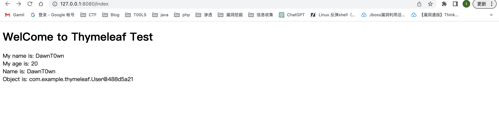

取map对象

```
package com.example.thymeleaf;

import org.springframework.stereotype.Controller;
import org.springframework.ui.Model;
import org.springframework.web.bind.annotation.GetMapping;

import java.util.HashMap;
import java.util.Map;

@Controller
public class urlController {
    @GetMapping("/index")//页面的url地址
    public String getindex(Model model)//对应函数
    {
        Map map = new HashMap();
        map.put("key","DawnT0wn");
        map.put("sex","man");
        model.addAttribute("map",map);
        return "hhh";//与templates中index.html对应
    }
}
```

hhh.html

```
<!DOCTYPE html>
<html xmlns:th="http://www.thymeleaf.org" xmlns="http://www.w3.org/1999/html">
<head>
    <meta charset="UTF-8">
    <title>title</title>
</head>
<body>
<h1>WelCome to Thymeleaf Test</h1>
<div th:text="'My name is: ' + ${map.key}"></div>
<td th:text="'My age is: ' + ${map['sex']}"></td>
</br>
<td th:text="'Name is: ' + ${map.get('key')}"></td>
</br>
<td th:text="'Object is: ' +${map}"></td>
</body>
</html>
```

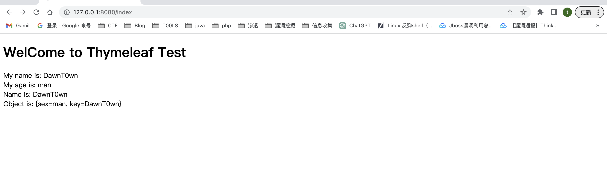

取list对象，list是一个有序列表，在取值的时候需要用到each

```
package com.example.thymeleaf;

import org.springframework.stereotype.Controller;
import org.springframework.ui.Model;
import org.springframework.web.bind.annotation.GetMapping;

import java.util.ArrayList;
import java.util.HashMap;
import java.util.Map;

@Controller
public class urlController {
    @GetMapping("/index")//页面的url地址
    public String getindex(Model model)//对应函数
    {
        ArrayList arrayList = new ArrayList<>();
        arrayList.add("DawnT0wn");
        arrayList.add("18");
        arrayList.add("man");
        model.addAttribute("list",arrayList);
        return "hhh";//与templates中index.html对应
    }
}
```

```
<!DOCTYPE html>
<html xmlns:th="http://www.thymeleaf.org" xmlns="http://www.w3.org/1999/html">
<head>
    <meta charset="UTF-8">
    <title>title</title>
</head>
<body>
<h1>WelCome to Thymeleaf Test</h1>
<tr th:each="item:${list}">
    <td th:text="${item}"></td>
</tr>
</body>
</html>
```

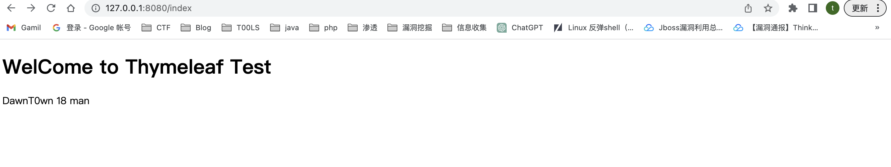

### 链接表达式

在html中我们用的是href来设置一个链接，在Thymeleaf中我们改成`th:href`，还需要使用`@{资源地址}`引入资源

hhh.html

```
<!DOCTYPE html>
<html xmlns:th="http://www.thymeleaf.org" xmlns="http://www.w3.org/1999/html">
<head>
    <meta charset="UTF-8">
    <title>title</title>
</head>
<body>
<h1>WelCome to Thymeleaf Test</h1>
<link rel="stylesheet" th:href="@{index.css}">
<script type="text/javascript" th:src="@{index.js}"></script>
<a th:href="@{http://47.93.248.221/index.html}">超链接</a>
</body>
</html>
```

### 选择变量表达式

变量表达式也可以写为`*{...}`。星号语法对选定对象而不是整个上下文评估表达式。也就是说，只要没有选定的对象，美元(`${…}`)和星号(`*{...}`)的语法就完全一样

也就是说，将值存放在model对象里面的话，这两种方法没有区别

### 预处理

语法：`__${expression}__`

官方文档对其的解释：

> 除了所有这些用于表达式处理的功能外，Thymeleaf 还具有预处理表达式的功能。
>
> 预处理是在正常表达式之前完成的表达式的执行，允许修改最终将执行的表达式。
>
> 预处理的表达式与普通表达式完全一样，但被双下划线符号（如__${expression}__）包围。
>

这是出现SSTI最关键的一个地方，预处理也可以解析执行表达式，也就是说找到一个可以控制预处理表达式的地方，让其解析执行我们的payload即可达到任意代码执行，大多数payload也是这个样子的

# Spring MVC

## 核心组件

### 前端控制器DispatcherServlet

接收请求，响应结果，相当于转发器，中央处理器。有了dispatcherServlet减少了其它组件之间的耦合度。用户请求到达前端控制器，它就相当于mvc模式中的c，dispatcherServlet是整个流程控制的中心，由它调用其它组件处理用户的请求，dispatcherServlet的存在降低了组件之间的耦合性。

### 处理器映射器HandlerMapping

根据请求的url查找Handler，HandlerMapping负责根据用户请求找到Handler即处理器，springmvc提供了不同的映射器实现不同的映射方式，例如：配置文件方式，实现接口方式，注解方式等。

### 处理器适配器HandlerAdapter

按照特定规则（HandlerAdapter要求的规则）去执行Handler通过HandlerAdapter对处理器进行执行，这是适配器模式的应用，编写Handler时按照HandlerAdapter的要求去做，这样适配器才可以去正确执行Handler通过扩展适配器可以对更多类型的处理器进行执行。

### 处理器Handler

Handler 是继DispatcherServlet前端控制器的后端控制器，在DispatcherServlet的控制下Handler对具体的用户请求进行处理。由于Handler涉及到具体的用户业务请求，所以一般情况需要工程师根据业务需求开发Handler。

### 视图解析器ViewResolver

进行视图解析，根据逻辑视图名解析成真正的视图（view）
ViewResolver负责将处理结果生成View视图，ViewResolver首先根据逻辑视图名解析成物理视图名即具体的页面地址，再生成View视图对象，最后对View进行渲染将处理结果通过页面展示给用户。 springmvc框架提供了很多的View视图类型，包括：jstl View、freemarker View、pdf View等。

## 解析流程

Spring Boot 是 Spring MVC 的简化版本。是在 Spring MVC 的基础上实现了自动配置，简化了开发人员开发过程。Spring MVC 是通过一个叫 DispatcherServlet 前端控制器的来拦截请求的。而在 Spring Boot 中 使用自动配置把 DispatcherServlet 前端控制器自动配置到框架中。

例如，我们来解析 /users 这个请求

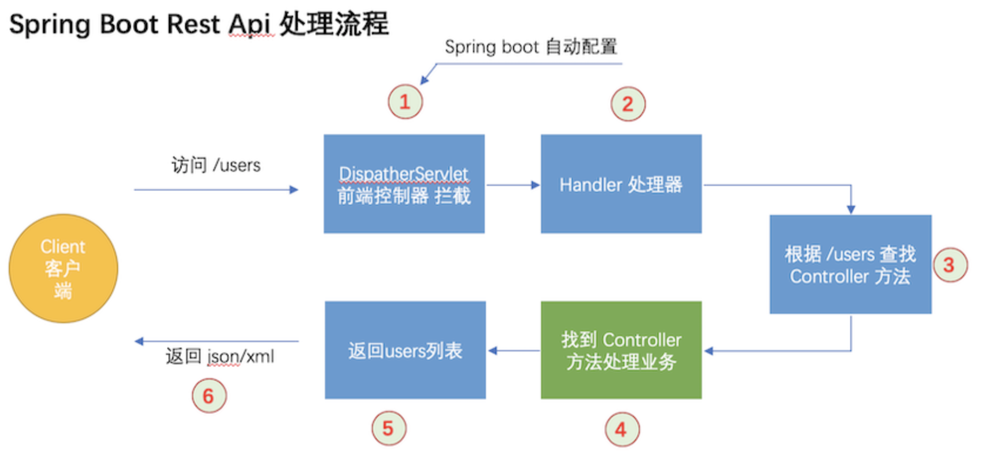

1. DispatcherServlet 前端控制器拦截请求 /users
2. servlet 决定使用哪个 handler 处理
3. Spring 检测哪个控制器匹配 /users，Spring 从 @RquestMapping 中查找出需要的信息
4. Spring 找到正确的 Controller 方法后，开始执行 Controller 方法
5. 返回 users 对象列表
6. 根据与客户端交互需要返回 Json 或者 Xml 格式

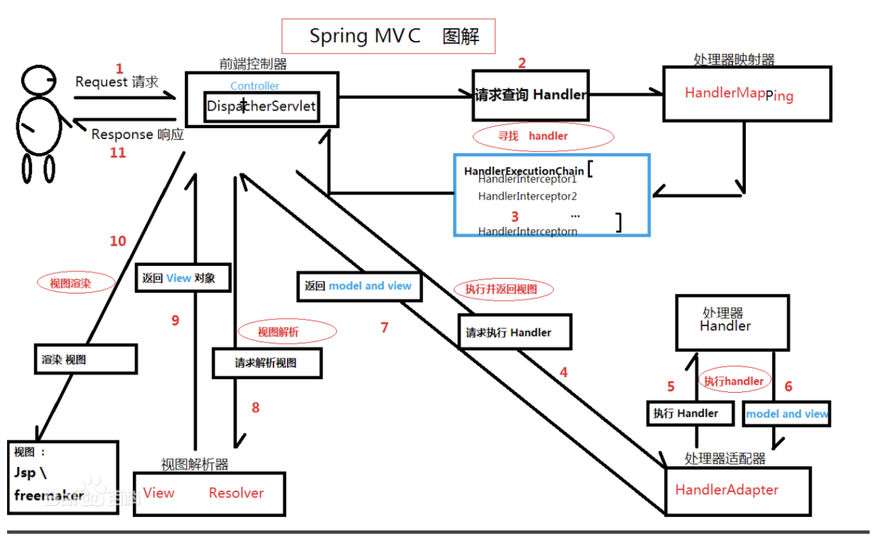

- （1）客户端发起的请求request通过核心处理器DispatcherServlet进行处理
- （2-3）核心处理器DispatcherServlet通过注册在spring中的HandlerMapping找到对应的Handler（其实是HandlerMethod,可以认为是我们编写的某个Controller对象的具体的某个方法 即通过映射器将请求映射到Controller的方法上），同时将注册在spring中的所有拦截器和Handler包装成执行链HandlerExecutionChain并返回给核心处理器DispatcherServlet
- （4）核心处理器DispatcherServlet 通过2-3部获取的Handler来查找对应的处理器适配器HandlerAdapter
-    (5-7) 适配器调用实现对应接口的处理器，并将结果返回给适配器，结果中包含数据模型和视图对象，再由适配器返回给核心控制器
- （8-9）核心控制器将获取的数据和视图结合的对象传递给视图解析器，获取解析得到的结果，并由视图解析器响应给核心控制器
- （10）渲染视图
- （11）核心控制器将response返回给客户端

根据解析流程我们知道，所有的请求都会经过这个DispatcherServlet分发

在controller打个断点，根据调用栈我们回溯到了DispatcherServlet的doservice方法（所有的http请求都会进入到该方法中）

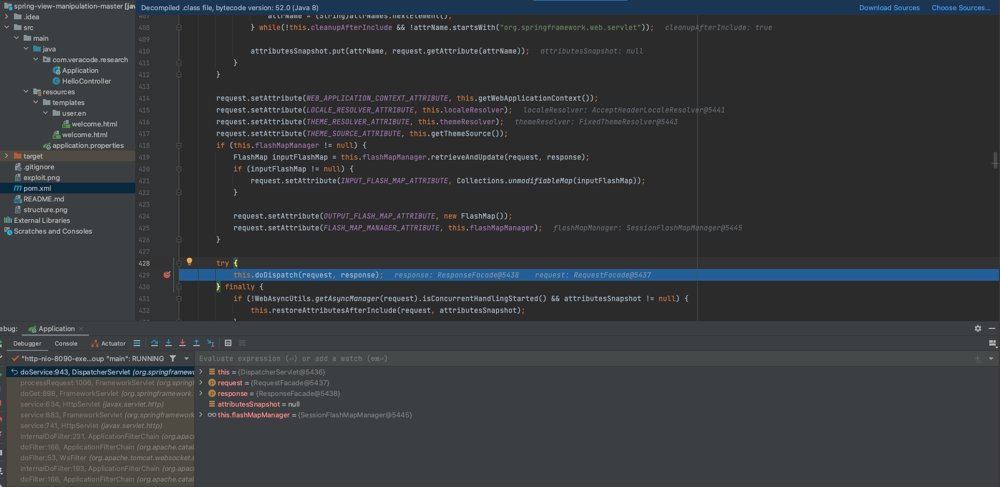

在这个函数中，主要存在着一些参数绑定到request请求中，如WebApplicationContext，还有区域解析器localeResolver，另外还有主题解析器的themeResolver

接下来调用doDispatch方法，这个方法才是整个Spring MVC解析最核心的方法，主要的解析流程都在这个方法中体现

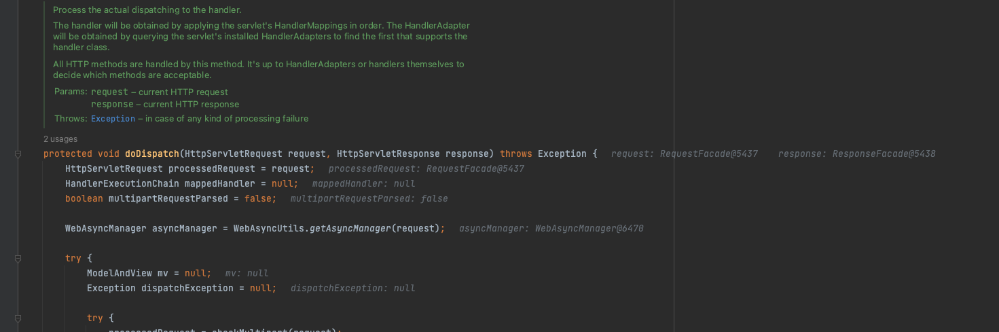

我们先来看看上面的引用文字的翻译

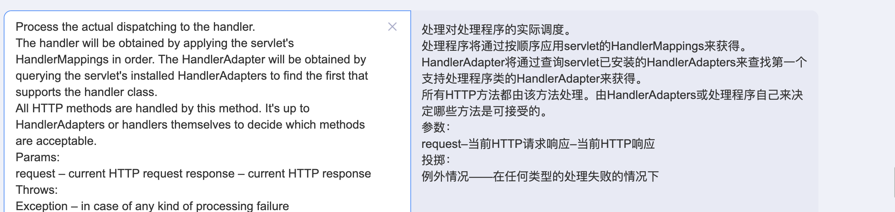

大概意思为

- 该方法为真正处理转发请求的过程
- 通过该servlet的注册的所有处理器映射器HandlerMapping中的进行url请求映射到具体的处理器Handler上 ，即通过HandlerMapping将具体的httpurl请求映射到Controller层对应的方法上
- 通过该servlet上注册的处理器适配器HandlerAdapter去查找第一个可以支持处理处理器Handler的HandlerAdapter
- 通过查询所有的HTTP请求均被该方法处理，它是由HandlerApadaters和处理器解析类来决定该controller层的方法是合理的

我们根据上面Spring MVC解析图来看这个方法

```java
protected void doDispatch(HttpServletRequest request, HttpServletResponse response) throws Exception {
   HttpServletRequest processedRequest = request;
   HandlerExecutionChain mappedHandler = null;
   /*
   * 声明变量processedRequest，处理器执行链HandlerExecutionChain 里面包含handlerMethod和springMVC中所有的拦截器
   */
   boolean multipartRequestParsed = false;
	 //文件上传的处理请求标识
   WebAsyncManager asyncManager = WebAsyncUtils.getAsyncManager(request);
	 //将请求包装成异步请求来进行管理，为防止线程阻塞将请求的处理委托给另外一个线程
	 
   try {
      ModelAndView mv = null;	//视图
      Exception dispatchException = null;	//异常

      try {
      /*
      *	检查当前请求是否为文件上传请求，如果是就将request请求包装为文件上传请求，如果不是则直接返回原请求request
      *	multipartRequestParsed作为一个标识符，如果请求不一致则为true
      */
         processedRequest = checkMultipart(request);
         multipartRequestParsed = (processedRequest != request);

         // Determine handler for the current request.
         //根据当前请求获取handler执行链HandlerExecutionChain，里面包含了handler和拦截器（interceptor）
         mappedHandler = getHandler(processedRequest);
         if (mappedHandler == null) {
         //如果没有获取到hanler到话，则直接return（404）
            noHandlerFound(processedRequest, response);
            return;
         }

         // Determine handler adapter for the current request.
         HandlerAdapter ha = getHandlerAdapter(mappedHandler.getHandler());
				 //通过mappedHandler这个handler处理链确定处理程序适配器
         // Process last-modified header, if supported by the handler.
         
         //获取请求方法，处理last-modified 请求头
         String method = request.getMethod();
         boolean isGet = "GET".equals(method);
         if (isGet || "HEAD".equals(method)) {
            long lastModified = ha.getLastModified(request, mappedHandler.getHandler());
            if (new ServletWebRequest(request, response).checkNotModified(lastModified) && isGet) {
               return;
            }
         }
				 //预处理，递归执行拦截器的preHandler方法
         if (!mappedHandler.applyPreHandle(processedRequest, response)) {
            return;
         }

         // Actually invoke the handler.
         // 实现执行Controller中(Handler)的方法,返回ModelAndView视图
         // 到这里就到了执行handler并返回视图数据的那一步流程了
         mv = ha.handle(processedRequest, response, mappedHandler.getHandler());

         // 判断是否是异步请求
         if (asyncManager.isConcurrentHandlingStarted()) {
            return;
         }
				 // 视图处理
         applyDefaultViewName(processedRequest, mv);
         // 拦截器后置处理
         mappedHandler.applyPostHandle(processedRequest, response, mv);
      }
      catch (Exception ex) {
         dispatchException = ex;
      }
      catch (Throwable err) {
         // As of 4.3, we're processing Errors thrown from handler methods as well,
         // making them available for @ExceptionHandler methods and other scenarios.
         dispatchException = new NestedServletException("Handler dispatch failed", err);
      }
      // 页面渲染
      processDispatchResult(processedRequest, response, mappedHandler, mv, dispatchException);
   }
   catch (Exception ex) {
      // 对页面渲染完成里调用拦截器中的AfterCompletion方法
      triggerAfterCompletion(processedRequest, response, mappedHandler, ex);
   }
   catch (Throwable err) {
      // 最终对页面渲染完成里调用拦截器中的AfterCompletion方法
      triggerAfterCompletion(processedRequest, response, mappedHandler,
            new NestedServletException("Handler processing failed", err));
   }
   finally {
      if (asyncManager.isConcurrentHandlingStarted()) {
         // Instead of postHandle and afterCompletion
         if (mappedHandler != null) {
            mappedHandler.applyAfterConcurrentHandlingStarted(processedRequest, response);
         }
      }
      else {
         // Clean up any resources used by a multipart request.
         if (multipartRequestParsed) {
            cleanupMultipart(processedRequest);
         }
      }
   }
}
```

在了解完上述代码后，我们一步一步来看执行流程

### 获取handle

首先是通过org.springframework.web.servlet.DispatcherServlet#getHandler方法获取HandlerExecutionChain对象

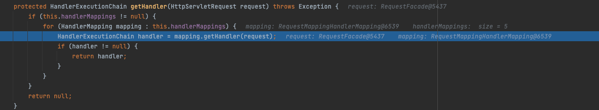

这个方法便利了handlerMappings这个arraylist，然后调用HandlerMapping的getHandler方法，根据请求获取HandlerExecutionChain

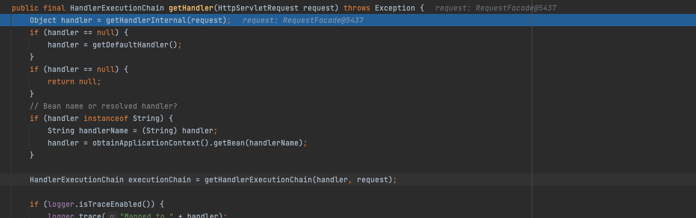

可以看到是通过getHandlerInternal传入request请求获取的handler，继续跟进，调用了其父类的getHandlerInternal

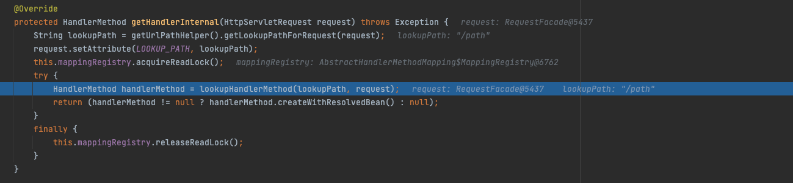

从请求中获取了lookupPath，接下来调用lookupHandlerMethod获取HandlerMethod，这里其实就是通过url和请求信息定位到了Controller层的方法

```java
protected HandlerMethod lookupHandlerMethod(String lookupPath, HttpServletRequest request) throws Exception {
   List<Match> matches = new ArrayList<>();
   List<T> directPathMatches = this.mappingRegistry.getMappingsByUrl(lookupPath);
   if (directPathMatches != null) {
      addMatchingMappings(directPathMatches, matches, request);
   }
   if (matches.isEmpty()) {
      // No choice but to go through all mappings...
      addMatchingMappings(this.mappingRegistry.getMappings().keySet(), matches, request);
   }

   if (!matches.isEmpty()) {
      Comparator<Match> comparator = new MatchComparator(getMappingComparator(request));
      matches.sort(comparator);
      Match bestMatch = matches.get(0);
      if (matches.size() > 1) {
         if (logger.isTraceEnabled()) {
            logger.trace(matches.size() + " matching mappings: " + matches);
         }
         if (CorsUtils.isPreFlightRequest(request)) {
            return PREFLIGHT_AMBIGUOUS_MATCH;
         }
         Match secondBestMatch = matches.get(1);
         if (comparator.compare(bestMatch, secondBestMatch) == 0) {
            Method m1 = bestMatch.handlerMethod.getMethod();
            Method m2 = secondBestMatch.handlerMethod.getMethod();
            String uri = request.getRequestURI();
            throw new IllegalStateException(
                  "Ambiguous handler methods mapped for '" + uri + "': {" + m1 + ", " + m2 + "}");
         }
      }
      request.setAttribute(BEST_MATCHING_HANDLER_ATTRIBUTE, bestMatch.handlerMethod);
      handleMatch(bestMatch.mapping, lookupPath, request);
      return bestMatch.handlerMethod;
   }
   else {
      return handleNoMatch(this.mappingRegistry.getMappings().keySet(), lookupPath, request);
   }
}
```

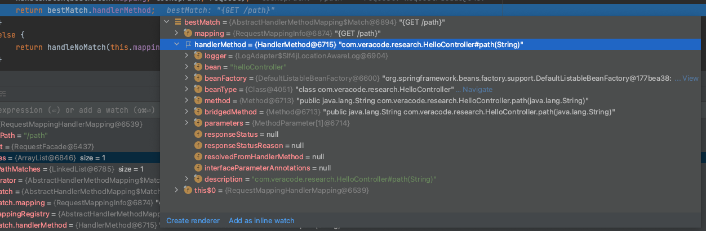

回到getHandler

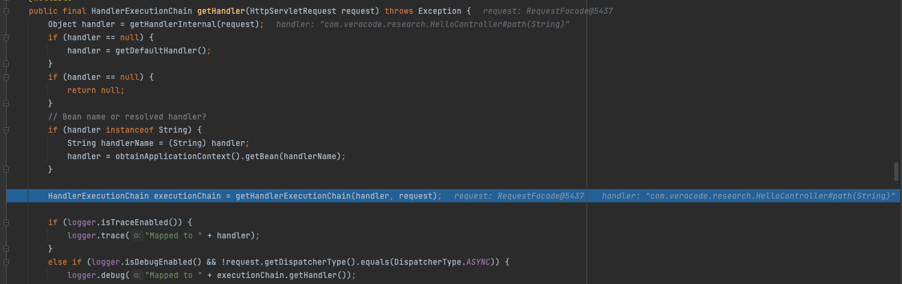

可以看到handler其实是HandlerMethod对象，里面其实就是定位到了url对应Contrller的方法

然后调用getHandlerExecutionChain获取HandlerExecutionChain

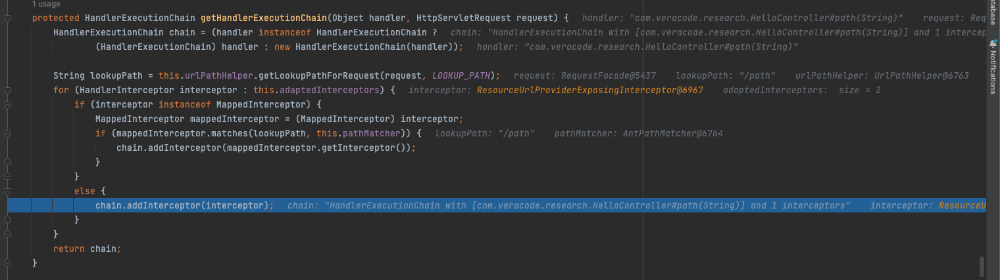

先创建HandlerExecutionChain对象，再判断有没有interceptor实现了MappedInterceptor接口，如果实现了就将当前路径与mappedInterceptor的要求url匹配 如果匹配则将其添加进去，如果没有实现则直接添加进去

最后返回HandlerExecutionChain对象，回到doDispatch，随后调用getHandlerAdapter

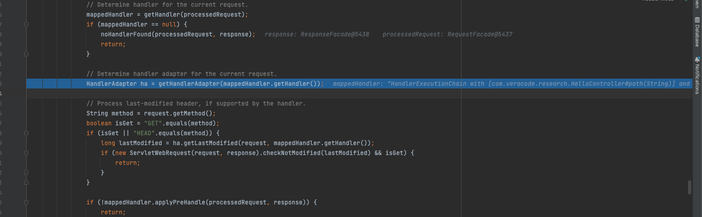

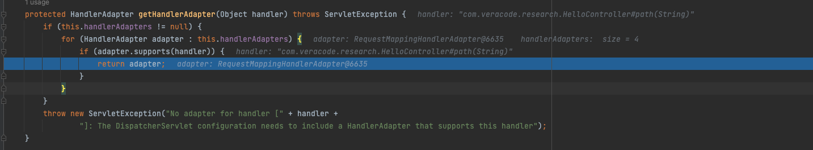

这个方法会遍历所有HandlerAdapter，如果当前的handlerAdapter能够处理Handler则直接返回该处理器适配器

回到doDispatch方法，调用applyPreHandler进行预处理

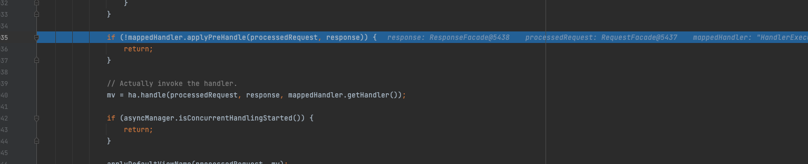


这里取获取所有的interceptor，并遍历调用preHandler方法，因为没有配置，这里只获取到自动配置的两个interceptor

### 调用handle

回到doDispatch继续调用handle方法，前面是获取handle，这里是取去执行handle返回ModelAndView

```
public final ModelAndView handle(HttpServletRequest request, HttpServletResponse response, Object handler)
      throws Exception {

   return handleInternal(request, response, (HandlerMethod) handler);
}
```

跟进handleInternal

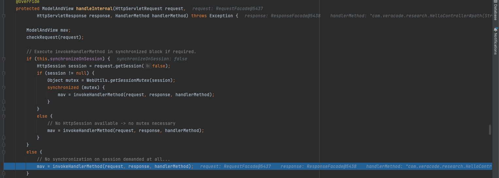

跟进invokeHandlerMethod

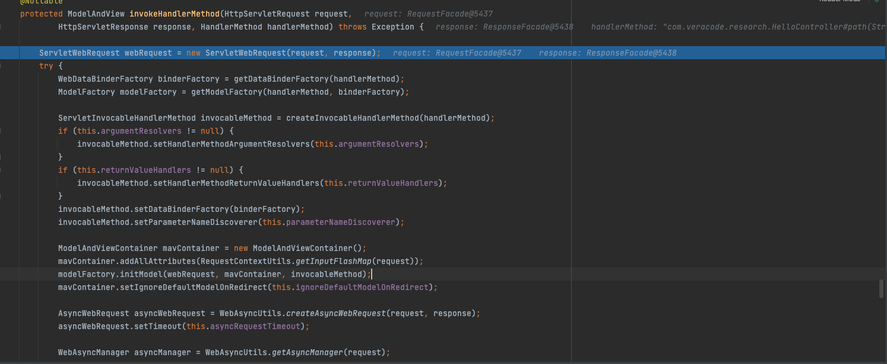

封装ModelAndView对象

它的作用就是执行目标的HandlerMethod，然后返回一个ModelAndView ，往下走会调用invokeAndHandle

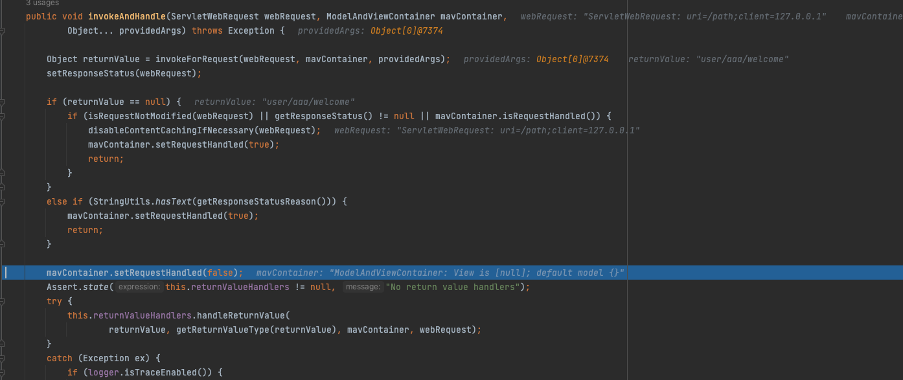

invokeForRequest，一直跟可以发现通过反射调用Controller并返回值给returnValue，接下来通过handleReturnValue根据返回值的类型和返回值将不同的属性设置到ModelAndViewContainer中，跟进handleReturnValue

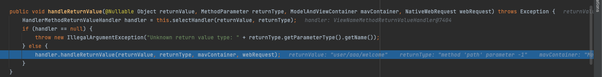

先通过selectHandler找到HandlerMethodReturnValueHandler，然后调用其handleReturnValue方法

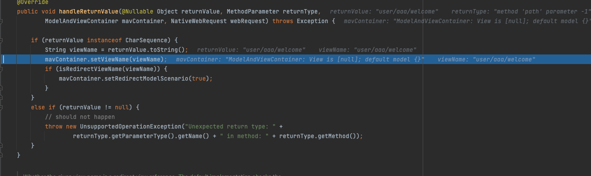

判断返回值类型是否是字符型，如果是，就设置返回值为ViewName，然后判断返回值是否以`redirect:`开头，如果是的话则设置重定向的属性

回到invokeHandlerMethod

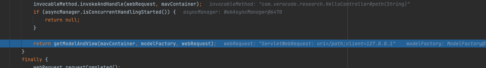

调用getModelAndView，根据ViewName和model创建ModelAndView对象返回

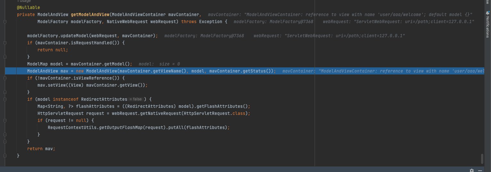

### 获取视图

回到doDispatch往下走，进入processDispatchResult方法

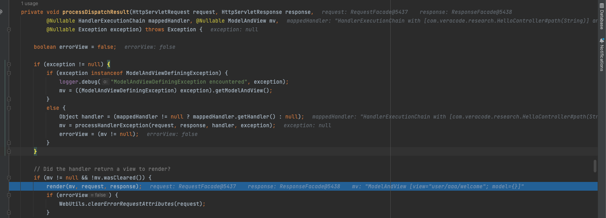

通过`DispatcherServlet#render`获取视图解析器并渲染

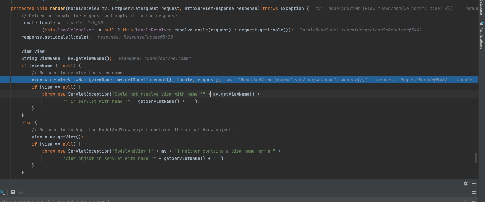

最终的解析在resolveViewName中完成

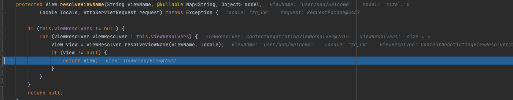

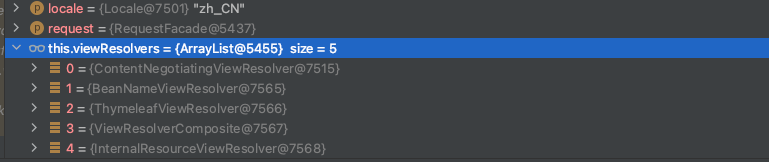

遍历5个viewResolvers解析器解析视图得到View，解析成功则返回

### 视图渲染

得到view后，回到render

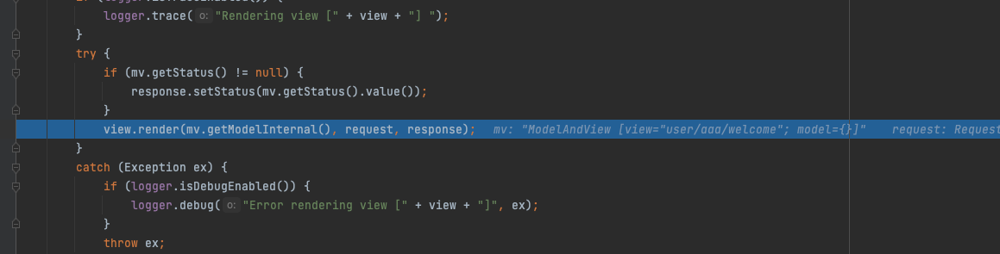

会调用view.render，这里也就是`ThymleafView#render`渲染。`render`方法中又通过调用`renderFragment`完成实际的渲染工作

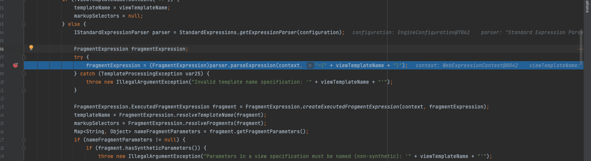

在renderFragment中存在一个判断，如果viewTemplateName中不包含`::`就不会进到else逻辑，就没法解析表达式，可以看到，解析的是SPEL表达式，也就是上面Thymeleaf说的预处理步骤

# 漏洞复现

利用条件：

1. 不使用`@ResponseBody`注解或者RestController注解
2. 模板名称由`redirect:`或`forward:`开头（不走ThymeleafView渲染）即无法利用
3. 参数中有`HttpServletResponse`，设置为HttpServletResponse，Spring认为它已经处理了HTTP
   Response，因此不会发生视图名称解析。

漏洞修复也是通过上面三个方面来的

```
__$%7bnew%20java.util.Scanner(T(java.lang.Runtime).getRuntime().exec(%22whoami%22).getInputStream()).next()%7d__::.x
```

网上的payload都有x，但是在整个解析的流程中我并没有看见，把最后的点和x去掉发现还是可以命令执行

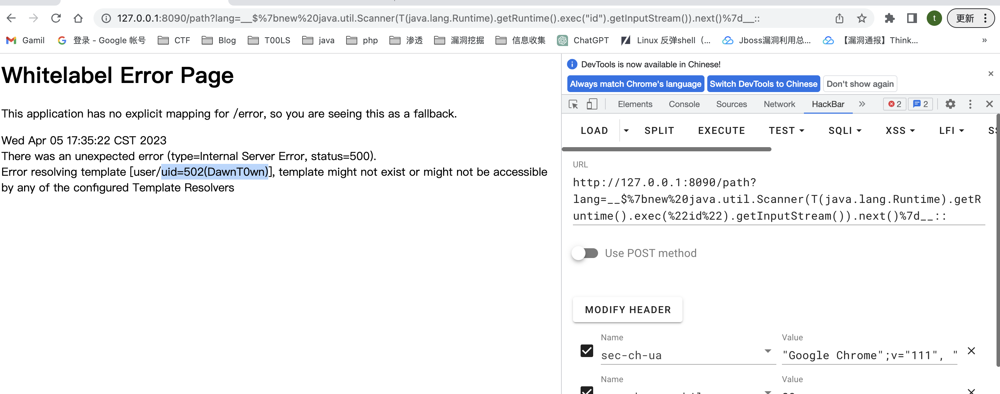


参考链接：

https://blog.csdn.net/weixin_53601359/article/details/114460179

https://www.cnblogs.com/TT0TT/p/16845759.html

https://xz.aliyun.com/t/10514#toc-5

[Java安全之Thymeleaf 模板注入分析 - nice_0e3 - 博客园 (cnblogs.com)](https://www.cnblogs.com/nice0e3/p/16212784.html#执行模板渲染)

https://xz.aliyun.com/t/9826#toc-1