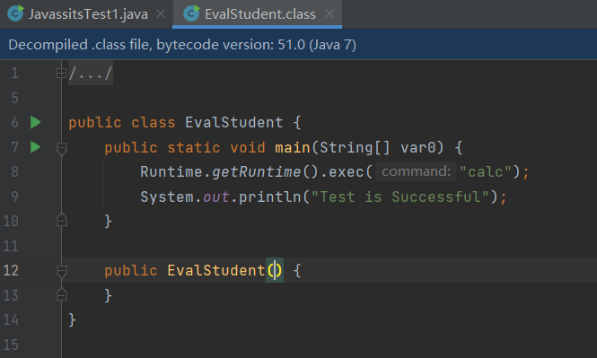
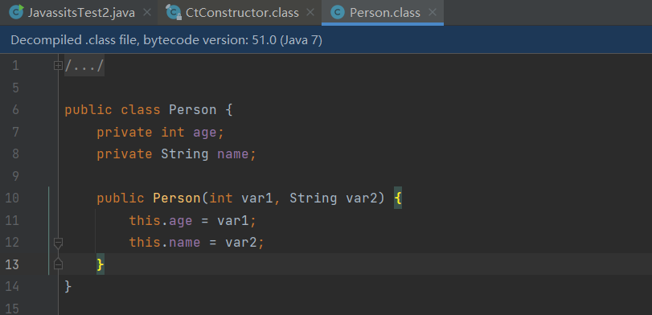

# 前言

由于CC2要用到javassist,所以来填补一下知识盲区

# 环境搭建

maven项目引入下面依赖导入即可

```
<dependency>
    <groupId>org.javassist</groupId>
    <artifactId>javassist</artifactId>
    <version>3.25.0-GA</version>
</dependency>
```

# Javassist 介绍

`Javassist`是一个开源的分析、编辑和创建Java字节码的类库，可以直接编辑和生成Java生成的字节码。能够在运行时定义新的Java类，在JVM加载类文件时修改类的定义

Java 字节码以二进制的形式存储在 class 文件中，每一个 class 文件包含一个 Java 类或接口。Javaassist 就是一个用来处理 Java 字节码的类库。

Javassist类库提供了两个层次的API，源代码层次和字节码层次。源代码层次的API能够以Java源代码的形式修改Java字节码。字节码层次的API能够直接编辑Java类文件

# Javassist 使用

**javassist字节码编程常用的类：**

- ClassPool：ClassPool 类可以控制的类的字节码，例如创建一个类或加载一个类，与 JVM 类装载器类似

- CtClass： CtClass提供了类的操作，如在类中动态添加新字段、方法和构造函数、以及改变类、父类和接口的方法

- CtField：类的属性，通过它可以给类创建新的属性，还可以修改已有的属性的类型，访问修饰符等

- CtMethod：表示类中的方法，通过它可以给类创建新的方法，还可以修改返回类型，访问修饰符等， 甚至还可以修改方法体内容代码

- CtConstructor：用于访问类的构造，与CtMethod类的作用类似

## ClassPool

ClassPool是CtClass对象的容器，它按需读取类文件来构造CtClass对象，并且保存CtClass对象以便以后使用，其中键名是类名称，值是表示该类的CtClass对象

### **常用方法**

- `static ClassPool getDefault()`：返回默认的ClassPool，一般通过该方法创建我们的ClassPool；
- `ClassPath insertClassPath(ClassPath cp)`：将一个ClassPath对象插入到类搜索路径的起始位置；
- `ClassPath insertClassPath(java.lang.String pathname)` 在搜索路径的开头插入目录或jar（或zip）文件
- `ClassPath appendClassPath`：将一个ClassPath对象加到类搜索路径的末尾位置；
- `CtClass makeClass`：根据类名创建新的CtClass对象；
- `CtClass get(java.lang.String classname)`：从源中读取类文件，并返回对CtClass 表示该类文件的对象的引用；
- `java.lang.ClassLoader getClassLoader()`  获取类加载器toClass()，getAnnotations()在 CtClass等

## CtClass

### 常用方法

- `void setSuperclass(CtClass clazz)`  更改超类，除非此对象表示接口。 
- `java.lang.Class<?> toClass(java.lang.invoke.MethodHandles.Lookup lookup) `将此类转换为java.lang.Class对象。 
- `byte[] toBytecode() `将该类转换为类文件。 
- `void writeFile()` 将由此CtClass 对象表示的类文件写入当前目录。 
- `void writeFile(java.lang.String directoryName)` 将由此CtClass 对象表示的类文件写入本地磁盘。 
- `CtConstructor makeClassInitializer()` 制作一个空的类初始化程序（静态构造函数）。

## CtMethod

`CtMethod`：表示类中的方法。

## CtConstructor

`CtConstructor`的实例表示一个构造函数。它可能代表一个静态构造函数（类初始化器）。

### 常用方法

```
void setBody(java.lang.String src)	
	设置构造函数主体。
void setBody(CtConstructor src, ClassMap map)	
	从另一个构造函数复制一个构造函数主体。
CtMethod toMethod(java.lang.String name, CtClass declaring)	
	复制此构造函数并将其转换为方法。
```

## ClassClassPath

该类作用是用于通过 getResourceAsStream（） 在 java.lang.Class 中获取类文件的搜索路径。

构造方法：

```
ClassClassPath(java.lang.Class<?> c)	
	创建一个搜索路径。
```

### 常见方法：

```
java.net.URL find (java.lang.String classname)	
	获取指定类文件的URL。
java.io.InputStream	openClassfile(java.lang.String classname)	
	通过获取类文getResourceAsStream()。
```

# 测试代码

## 创建一个新类并添加main方法

```
package Javassits;

import javassist.ClassPool;
import javassist.CtClass;
import javassist.CtMethod;
import javassist.Modifier;

import java.lang.reflect.Method;

public class JavassitsTest1 {
    public static void main(String[] args) throws Exception{
        //创建一个ClassPool类对象容器
        ClassPool Pool = ClassPool.getDefault();
        //通过ClassPool类对象池新建一个CtClass,类名为Student
        CtClass STU = Pool.makeClass("Student");
        //新建一个方法名为main,方法返回值void,参数类型是String[],所属类是STU
        CtMethod mainMethod = new CtMethod(CtClass.voidType,"main",new CtClass[]{Pool.get(String[].class.getName())},STU);
        //设置main方法的修饰访问符为public和static
        mainMethod.setModifiers(Modifier.PUBLIC+Modifier.STATIC);
        //设置main方法的内容
        mainMethod.setBody("{Runtime.getRuntime().exec(\"calc\");" +
                "System.out.println(\"Test is Successful\");}");
        //将main方法添加到STU类中去
        STU.addMethod(mainMethod);
        //重新设置类名
        STU.setName("EvalStudent");
        //输入内容到文件
        STU.writeFile();

        //加载该类,和getClass不同,不需要再去获取构造函数,即可调用newInstance是实例化对象
        Class T0WN = STU.toClass();
        //创建对象(实例化),无参构造函数的时候
        Object obj = T0WN.newInstance();

        //通过反射去调用main函数
        Method main_method = T0WN.getDeclaredMethod("main",String[].class);
//        main_method.invoke(obj,(Object) new String[1]);
        main_method.invoke(null, (Object) new String[]{"1"});//静态方法可以不传对象,但是invoke的两个参数都是object所以强制转化
    }
}
```

运行后弹出了计算机,输出了内容,然后新建了应该`.class`文件




CtMethod 类是用于添加方法的，例如添加main方法主要包括：方法的属性、类型、名称、参数，方法体。new CtMethod操作主要是创建方法的声明，setModifiers方法用于设置方法的修饰符， setBody方法用于设置方法体，addMethod方法用于把main方法添加到Student类的CtClass对象中。然后调用CtClass对象的writeFile方法在磁盘上生成Student类的class文件

通过javassist创建一个类会生成相应类的class文件

还有一种方法可以直接创建方法，通过CtNewMethod类的静态方法make创建方法，make方法的参数1直接传入方法的完整结构信息，例如下面这段代码：

```
CtMethod ctMethod1 = CtNewMethod.make("public int print_stu(){ return 100;}", student_ctClass);
student_ctClass.addMethod(ctMethod1);
```

传入的参数类型是对象类型时需要注意以下几点：

例如传入的是String类型，那么就要使用`classPool.get(String[].class.getName())` 这种方式传入

当传入多个参数，且参数类型相同，例如传入多个Integer类型的参数，需要使用`new CtClass[] {classPool.get(Integer[].class.getName())}` 这种方式传入

当传入多个参数，且参数类型不相同，例如传入char类型的参数和long类型的参数就要使用 `new CtClass[] {CtClass.charType , CtClass.longType}` 这种方式

如果方法接收的参数是一个对象类型，例如接收的是一个Student对象类型的参数，那么就可以通过classPool对象的getCtClass方法来获取Student类的CtClass对象的方式传入该参数。

```
classPool.getCtClass("Student");
```

## 创建Student类并添加一个构造方法和成员属性

```
package Javassits;

import javassist.*;

public class JavassitsTest2 {
    public static void main(String[] args) throws Exception{
        //创建ClassPool类对象池
        ClassPool Pool = ClassPool.getDefault();
        //创建类Person
        CtClass person_Ct = Pool.makeClass("Person");
        //创建属性age,类型是int,属于person_Ct类
        CtField ctField1 = new CtField(CtClass.intType,"age",person_Ct);
        //修改属性
        ctField1.setModifiers(Modifier.PRIVATE);
        //添加属性到person_Ct
        person_Ct.addField(ctField1);

        //添加另外的属性name,是String类型的
        CtField ctField2 = new CtField(Pool.getCtClass("java.lang.String"),"name",person_Ct );
        ctField2.setModifiers(Modifier.PRIVATE);
        person_Ct.addField(ctField2);

        //添加有参的构造函数
        CtConstructor ctconstructor = new CtConstructor(new CtClass[]{CtClass.intType,Pool.getCtClass("java.lang.String")},person_Ct);
        ctconstructor.setModifiers(Modifier.PUBLIC);
        //$0相当于this,$1,$2分别对于构造函数的第一个参数和第二个参数
        ctconstructor.setBody("{$0.age = $1;$0.name = $2;}");
        //将构造函数添加去类中
        person_Ct.addConstructor(ctconstructor);

        person_Ct.writeFile();

        //加载类
        Class Per = person_Ct.toClass();
//        Per.newInstance();只能调用无参的构造函数所以会报错
    }
}
```

得到Person.class




参考链接

https://www.cnblogs.com/nice0e3/p/13811335.html

https://xz.aliyun.com/t/10387#toc-3

https://songly.blog.csdn.net/article/details/118944928